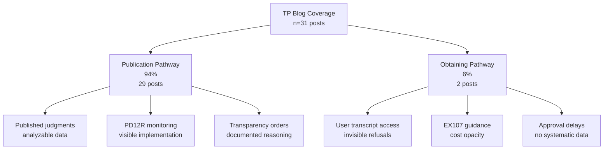

# Layer 5: External Observation – Independent Validation and Meta-Opacity

## Purpose and Scope

Layer 5 examines how independent observers—media, NGOs, legal bloggers, and advocacy bodies—document and validate transparency barriers identified in Layers 1–4. Using two case studies—the Transparency Project (TP), Britain's leading independent organisation monitoring family court transparency, and the Transparency Implementation Group (TIG), the judiciary's internal reform body—this layer asks:

1. Convergence: Do external observers (TP) and internal reform architects (TIG) independently identify the same transparency barriers—and if so, what does this convergence reveal about system architecture?
2. Observational coverage: Where do observers focus their monitoring efforts? Is coverage balanced between Publication and Obtaining pathways, or does it cluster on one pathway—and why?
3. Reform measurability: Can either reform architects (TIG) or external monitors (TP) systematically measure whether transparency reforms are being adopted and whether they're effective?

**Key insight**: Observers face parallel barriers to users, creating meta-opacity—the system prevents documentation of its own dysfunction. Even "successful" reforms (PD12R) yield ~0.1% coverage of total family proceedings, exposing performative reform cycles rather than genuine transformation. More troubling still: reform processes themselves lack transparency metrics, creating recursive opacity where attempts to fix the system cannot measure their own impact.

**Method**: Documentary analysis (TP guidance materials), empirical blog corpus analysis (n=31 posts, January–September 2025), TIG/FRCTG minutes analysis (n=30 documents, 2021–2024), and cross-layer citation mapping examining how both external and internal observers' work validates Layers 1–4 findings.

## Layer 5 Conclusion: Architectural Dysfunction Confirmed

Layer 5 confirms that the reality gap is architectural, not perceptual. If only users and litigants reported these barriers, skeptics might attribute them to misunderstanding or exceptional cases. But when Britain's leading family court transparency organisation—staffed by legal professionals, analysing published case law, monitoring reforms—encounters the same opacity when trying to document system performance, it validates that the dysfunction is structural rather than experiential. More powerfully: when the judiciary's own reform implementation bodies—The Transparency Implementation Group (TIG, established December 2021) and parallel Financial Remedies Consultative & Transparency Group (FRCTG), comprising judges, MoJ/HMCTS officials, and legal experts—face identical barriers when designing and monitoring transparency reforms, the architectural nature of the failure becomes irrefutable. The strongest evidence isn't what observers see about the system; it's what observers cannot see despite expertise, institutional access, and sustained effort.

## 7.5.1 Operational Focus: Documentation Dominates, Obtaining Neglected

TP's blog output reveals strategic prioritisation driven by documentability constraints:

| Function      | %   | n  | What This Reveals |
|---------------|-----|----|-------------------|
| Documentation | 32% | 10 | TP makes visible what exists but is obscure (BAILII judgments, practice direction updates, ministerial statements) |
| Education     | 26% | 8  | Sustained demand for procedural guidance validates Layer 4 finding that official instructions create knowledge deficits |
| Analysis      | 23% | 7  | Critical evaluation extends beyond information dissemination—functions users and most professionals cannot perform systematically |
| Monitoring    | 19% | 6  | Reform implementation tracking holds institutions accountable, though smallest category despite being most critical |

**The Missing Function**: Direct policy advocacy (explicit legislative recommendations, reform blueprints, coordination with user groups) is notably absent, likely reflecting TP's charitable status and volunteer-staffed operation. This gap matters: if external observers identify systemic dysfunction but lack capacity to translate findings into political pressure, the feedback loop from Layer 5 to Layer 1 (institutional design) remains broken.

**Resource Constraints**: TP operates on volunteer model with no full-time staff, simultaneously educating users, training professionals, briefing media, consulting on policy, and documenting case law. Blog analysis reveals strain: posts become less frequent during court vacation periods, complex analytical pieces appear irregularly, monitoring functions represent smallest category despite being arguably most accountability-critical.

**Insight**: TP excels at making visible what is already visible (published judgments, announced reforms, formal procedures) but cannot systematically track what remains hidden (unpublished refusals, informal judicial practices, approval timelines, cost patterns)—creating an observability paradox where external monitors are least able to document precisely what most needs accountability scrutiny.

## 7.5.2 Publication vs. Obtaining: The 94%/6% Asymmetry

TP's transparency coverage splits sharply across the two pathways identified in Layer 1:



**The Dual Interpretation:**

This asymmetry both validates the analytical framework and reveals documentability constraints:

**Validation**: TP, as independent observer using different data sources (published judgments) and methods (legal analysis, monitoring), naturally organised work around the same two pathways identified through Layer 1's documentary institutional analysis. This convergence was not coordinated—TP's organisational structure predates this research, and their pathway-focused approach emerged from operational necessity rather than theoretical modeling. The fact that external observers independently mirror the Publication/Obtaining distinction suggests this framework reflects genuine structural features of the transparency architecture, not arbitrary analytical imposition.

**Constraint**: The 94%/6% ratio also reflects what is documentable rather than what is important:

| Pathway     | Coverage | Why Visible/Invisible?                                                                 | Consequence                              |
|-------------|----------|-----------------------------------------------------------------------------------------|------------------------------------------|
| Publication | 94%      | Applications heard in open court → decisions become published judgments → grants appear on BAILII → even refusals may be published if appealed | Generates analyzable data enabling systematic monitoring |
| Obtaining   | 6%       | Refusals rarely appear in case law (Layer 2 found only 3 published judgments) → approvals are untimed administrative actions → user experiences remain atomised | Operates in shadows preventing comprehensive documentation |

**Empirical Evidence**: Of 31 transparency-focused posts:

- 29 address Publication: reporting on judgments granting/refusing permission, analysing judicial reasoning about open justice, tracking pilot schemes, monitoring PD12R implementation  
- 2 address Obtaining: comprehensive "How Do I Get Hold of a Transcript?" guide (educational function) and brief EX107 form update (documentation function)

This ratio is not evidence of TP deprioritising Obtaining—their guide is thorough and user-focused. Rather, it reveals structural limits on what external observers can systematically monitor: TP can write about Publication because published judgments provide analyzable data; they struggle with Obtaining because system opacity prevents comprehensive documentation.

**The Dual-Constituency Problem**: The transparency barriers that most severely affect individual users (Obtaining pathway—transcript costs prohibiting appeals, approval delays preventing hearing preparation) are precisely those external observers struggle to document. This creates dual exclusion:

- Users face barriers: Obtaining is expensive, procedurally obscure, judicially discretionary, temporally uncertain (Layer 4 findings)  
- Observers face meta-barriers: The features making Obtaining difficult for users (invisibility of refusals, absence of published reasoning, lack of systematic data) also prevent external observers from comprehensively documenting Obtaining pathway dysfunction

If external observers could document Obtaining barriers as thoroughly as Publication barriers—if refusals were published, approval timelines tracked, cost data transparent, judicial reasoning recorded—epidemiological understanding would improve, patterns would become visible, and reform pressure might build. But the system's architecture prevents precisely this documentation. The meta-opacity is not accidental; it is structural.

## 7.5.3 Insider Echo: TIG/FRCTG as Constrained Reform Observation

The Transparency Implementation Group (TIG, established December 2021) and parallel Financial Remedies Consultative & Transparency Group (FRCTG) comprise internal observers—judges, MoJ/HMCTS officials, DfE/Cafcass representatives, and (crucially) TP chair Lucy Reed—tasked with designing transparency reforms following the 2021 Transparency Review.[^TIG_Overview] Their minutes (n=30, 2021–2024) reveal the same architectural voids documented externally by TP, confirming barriers are structural, not positional.

**TIG's Operational Focus: Reform Design vs. Execution Monitoring**  
TIG's sub-group work reflects the focus of reform efforts rather than systematic quantitative coding. The distribution below characterizes dominant themes across 30 minutes documents (2021–2024), showing how internal reform architects prioritize visible interventions over outcome measurement:

| Sub-Group               | Approximate Focus | Killer Example |
|-------------------------|-------------------|---------------|
| Media Reporting/Pilots  | ~40% of substantive discussion | Pilots launched January 2023 in 3 sites (Cardiff, Leeds, Carlisle), expanding to 20 DFJ areas by 2025.[^Pilots_Timeline] Minutes celebrate expansion yet admit "limited" media attendance and zero denominator data on pilot penetration—mirroring the 0.1% coverage critique.[^Pilots_Attendance] |
| Anonymisation/Publication | ~25% of substantive discussion | Multi-year push for central anonymisation unit (Australian benchmark: £286k/year for ~1,000 judgments) remains unfunded by 2024.[^Anon_Funding] Publication rates hover at ~10 judgments/month (0.05% of caseload) despite Justice Committee's 10% target, validating DF-11 (recording infrastructure opacity).[^Pub_Rates] |
| Data Collection         | ~20% of substantive discussion | 2022 "scorecard" proposal maps six priority gaps (pre-court interventions, litigant demographics, outcomes, experiences) but stalls for lack of HMCTS integration—precisely mirroring TP's unanswerable questions, confirming DF-15 (no integrated data architecture).[^Data_Gaps] |
| Media Engagement        | ~10% of substantive discussion | National and local forums built to facilitate journalist access, yet late/vague case listing codes prevent journalists from locating hearings—validating DF-4 (vendor/listing opacity).[^Media_Codes] |
| Financial Remedies      | ~5% of substantive discussion | FRCTG minutes (2022) flag identical form-guidance disconnects in financial cases as found in EX107 analysis, confirming pattern extends beyond private law.[^FRCTG_Forms] |

**Pattern Recognition**: Like TP's 94%/6% Publication/Obtaining split derived from systematic blog corpus analysis, TIG's operational priorities cluster around designing visible reforms (pilots, guidance, court access) rather than measuring hidden barriers (refusals, costs, penetration rates). This isn't deprioritisation—it's documentability constraint operating at the reform design level.

**The Positional Mobility Test: Lucy Reed's Dual Vantage**  
Lucy Reed KC's simultaneous roles—authoring TP blog posts as external analyst and chairing TIG anonymisation sub-group as internal reform architect—create a natural experiment in observational privilege.[^Reed_Dual] If institutional position determines observational capacity, Reed's TIG role should grant access to data unavailable to TP. It doesn't.

**What Reed can document from both positions**:

- Published judgments (BAILII corpus)  
- Announced reforms (practice directions, pilot launches)  
- Guidance drafts (sub-group proposals)  
- The "visible exhaust" of institutional activity  

**What Reed cannot document from either position**:

- Refusal rates (unpublished decisions prevent aggregation)  
- Geographic penetration (no denominator data on pilot utilisation)  
- Cost patterns (vendors don't report; HMCTS doesn't collect)  
- Implementation consistency (voluntary recording; no compliance monitoring)  
- Impact metrics (no baseline; evaluation struggles with engagement data)  

The fact that Reed, moving between external observation (TP blog authorship) and internal reform design (TIG sub-group chair), encounters identical data deficits from both institutional vantage points validates that opacity is architectural rather than positional. If privileged institutional access doesn't change what's observable, the system prevents observation at the design level.

This "positional mobility test" strengthens the meta-opacity thesis: barriers aren't about who's looking (external vs. internal, user vs. professional, journalist vs. judge) but about what the system makes visible regardless of observer position. When the same individual shifting institutional contexts faces unchanging opacity, the architectural nature of dysfunction is confirmed.

**Insight**: Even reform architects cannot quantify their own reforms. TIG excels at designing visible interventions (pilot schemes, practice directions, guidance documents) but cannot systematically measure implementation (penetration rates, refusal patterns, geographic variation, impact on reporting quality)—creating the same observability paradox TP faces, now confirmed as architectural rather than a limitation of external positioning.

## 7.5.4 Reform Monitoring: 267% Increase, 0.2% Coverage – TP and TIG Converge

TP tracks PD12R implementation (media document access, introduced October 2024) via published judgments, while TIG tracks transparency pilots via internal logs and evaluation studies. Both datasets converge on performative reform cycles—patterns where institutions genuinely celebrate measurable progress (pilot expansions, rule changes, increased mentions) while remaining structurally unable to assess whether this progress addresses baseline dysfunction or represents marginal visibility gains within persistent opacity.

**TP's PD12R Monitoring**

| Period       | Judgments Mentioning PD12R | Monthly Average | % Change from Baseline |
|--------------|----------------------------|-----------------|------------------------|
| Jan–Mar 2025 | 3–5                        | 4               | Baseline               |
| Apr–Jun 2025 | 4–7                        | 6               | +50%                   |
| Jul–Sep 2025 | 8–9                        | 8               | +267%                  |

This appears to demonstrate successful reform adoption: judicial practice is changing, document provision is becoming normalised, transparency is improving.

**TIG's Pilot Monitoring**

| Period          | TIG Milestone                              | "Increase"       | Shared Blind Spot              |
|-----------------|--------------------------------------------|------------------|--------------------------------|
| 2023 Q1–Q2      | Public law pilots (3 sites)[^Pilots_Launch] | +100% sites (from 0) | No denominator data; coverage <0.01% of proceedings |
| 2023 Q3–2024 Q1 | Private law/magistrates rollout[^Pilots_Expand] | +300% scope     | Evaluation notes "limited" media engagement; no refusal statistics |
| 2024 Q2–2025    | FPR Rule embedding; 20 DFJ areas[^FPR_Embed] | +567% areas     | "Teething issues" with notifications persist; no utilisation metrics |

**But Context Reveals Performative Reform Cycles**  
This pattern need not reflect deliberate obfuscation by reform architects. Rather, it demonstrates how institutions can genuinely celebrate progress (pilot expansions, rule changes) while remaining structurally unable to measure that progress against baseline dysfunction:

- **Unknown Denominator**: If ~22,514 family court proceedings occurred monthly (MOJ Q1 2025 data), 8 PD12R mentions = 0.1% system coverage. TIG's 20-site expansion still yields no denominator: What proportion of eligible cases in those 20 areas actually implement transparency orders? The "increase" is from 0.04% to 0.1%—growth, yes, but microscopic penetration.[^Denominator]  
- **Published Judgment Bias**: TP's data captures only cases that (a) resulted in published judgments AND (b) mentioned document provision. TIG's evaluation notes most family proceedings never generate published judgments, and pilot implementation is "inconsistent."[^Eval_Inconsistent]  
- **Voluntary Reporting**: Neither judges (for PD12R mentions) nor court staff (for pilot participation) are required to systematically record transparency mechanisms. TIG minutes acknowledge "manual burden" of data collection prevents comprehensive monitoring.[^Manual_Burden]  
- **Geographic Concentration Unknown**: Are these 8 judgments/20 pilot sites distributed nationally or concentrated in specific transparency-conscious courts? Neither TP nor TIG possesses geographic penetration data.

**What Neither TP Nor TIG Can Answer**  
(Because institutional data infrastructure doesn't exist):

- What percentage of family proceedings now involve media document access under PD12R?  
- How does implementation vary by court, region, or case type?  
- Are there systematic refusals, and on what grounds?  
- Has media reporting improved in depth, accuracy, or volume since PD12R/pilots?  
- What is the actual penetration rate of transparency pilots in the 20 designated areas?

**The Performative Reform Pattern**: System shows progress (267% increase! 20-site expansion!) while 99.8% remains invisible. Reform announcements generate legitimacy without requiring operational transformation—creating appearance of transparency improvement while maintaining fundamental opacity about whether reforms address systemic dysfunction or constitute marginal visibility gains. TIG minutes celebrate milestones ("Family Court Reporting Week," November 2024) while simultaneously noting "no increased press attendance" and evaluation struggles with family engagement.[^Reporting_Week]

**Layer 5 Insight**: External observers (TP) and internal reform architects (TIG) provide essential monitoring but are constrained by the same data deficits they critique. A 267% increase in visible implementation may represent genuine progress or minimal absolute penetration—neither TP nor TIG can distinguish these interpretations without institutional transparency about system-wide utilisation. That nine months post-PD12R and three years into pilots we still cannot answer "How widely are these reforms being used?" demonstrates that transparency reforms themselves lack transparency.

## 7.5.5 Cross-Layer Validation: Six Independent Actors, One Architecture

The strongest evidence that Layers 1–4 document reality rather than perception comes from cross-layer convergence: TP and TIG, using different data sources, methods, and institutional positions, independently identify the same transparency barriers.

| Design Failure                  | L1: Institutional                          | L2: Judicial                               | L3: Professional                           | L4: User                                   | L5: External (TP)                          | L5.5: Internal (TIG)                       | Consequence of Convergence |
|---------------------------------|--------------------------------------------|--------------------------------------------|--------------------------------------------|--------------------------------------------|--------------------------------------------|--------------------------------------------|----------------------------|
| **DF-2: Form-Guidance Disconnect** | EX107 minimal instruction                  | Judges can't resolve what forms fail to explain | Professionals bridge gaps informally, creating knowledge asymmetries | Users report forms incomprehensible without legal help | TP publishes comprehensive guide because official form inadequate | Pilots note party "unawareness" of Transparency Orders; easy-read leaflets proposed but unfunded[^Leaflets] | Form inadequacy verified across all institutional positions—cannot be attributed to user misunderstanding or external misinterpretation |
| **DF-4: Vendor Opacity**        | No public vendor directory/contracts       | Case law never addresses vendor accountability | Solicitors advise "check with your court"—no systematic information | Users can't determine vendor, can't compare options | TP documents variability, advises individual court contact | Late/vague listing codes defeat media attempts to locate hearings; TNA search flaws remain unaddressed[^Listing_Codes] | Vendor/listing opacity confirmed by actors who should have different access levels (professionals have court contacts, TIG has institutional knowledge, users have direct experience)—yet all face same void |
| **DF-6: Cost Unpredictability** | No fee schedule published; "varies by length, urgency, format" | Judges acknowledge cost barriers but can't provide estimates | Professional guidance lists factors affecting cost, provides no figures | Users report cost uncertainty prevents advance planning, creates surprise bills | TP cannot provide cost calculator—institutional data doesn't exist | Anonymisation unit unfunded; no systematic cost data for transcript production collected[^Anon_Costs] | Cost opacity persists despite six institutional vantage points, suggesting no actor possesses pricing data to aggregate or publish |
| **DF-7: No Refusal Appeal Route** | Forms/Practice Directions silent on challenging refusals | Only 3 published judgments address Obtaining refusals; no established precedent | Professionals rarely contest refusals—no visible pathway to challenge | Users report accepting denials because appeal route unknown/unaffordable | TP documents absence of systematic appeal mechanism through case law gap analysis | Pilots acknowledge appeals theoretically possible but "unachievable" due to notification gaps; no refusal statistics tracked[^Appeal_Gaps] | Appeal pathway void confirmed by users experiencing it, professionals navigating it, judges not addressing it, external analysts documenting gap, internal reformers acknowledging but not resolving it |
| **DF-9: Unreasoned Publication Refusals** | PD12J doesn't require published refusal reasoning | Refused applications rarely result in published judgments explaining denial | Professional guidance cannot predict refusal grounds—no precedent accumulation | Users report denials without explanation, cannot assess whether to appeal | TP case law database over-represents grants, under-represents refusals (structural visibility bias) | Draft guidance urges decision rubrics for consistency, but implementation remains "inconsistent" with no refusal tracking system[^Rubrics] | Six-layer convergence shows refusal invisibility is structural (unpublished = unanalyzable = unmonitorable = unreformable) |
| **DF-11: Recording Infrastructure Opacity** | No published guidance on recording cataloguing/retrieval/transfer to vendors | Case law never interrogates recording system failures or delays | Professionals assume recordings exist but cannot verify or audit availability | Users experience delays attributable to "lost" or "unavailable" recordings | TP cannot document recording failures—system operates below visibility threshold | Transcript delays for appeals go unmonitored; pilots focus on courtroom access, not obtaining documentation[^Recording_Delays] | Infrastructure void confirmed across user experience, professional practice, judicial silence, external monitoring gaps, and internal reform priorities |
| **DF-15: No Integrated Data Architecture** | Each actor (MOJ, HMCTS, vendors, judiciary) maintains separate systems with no cross-referencing | Judges lack access to system-wide performance data when making individual decisions | Professionals work from accumulated experiential knowledge, not institutional statistics | Users cannot benchmark their experiences against systemic norms or average timelines | TP cannot answer basic questions: How many requests filed? What % approved? Average costs/timelines? | 2022 "scorecard" initiative stalled; HMCTS data silos persist; gaps in outcomes, demographics, and geographic variation remain unmapped through 2024[^Scorecard_Stalled] | Data architecture failure validated recursively: external observers can't access institutional data; internal reformers can't integrate institutional data; system cannot self-assess |

**What This Demonstrates**: Six independently situated actors—system designers publishing official forms and guidance (L1), judges writing case law (L2), legal professionals advising clients (L3), litigants navigating procedures (L4), external monitors analysing transparency (L5), and internal reform architects designing solutions (L5.5)—all encounter the same architectural voids, operational gaps, and procedural barriers. The consistency is empirical, not coordinated.

**Convergence as Validation**: When six layers using six different analytical approaches all identify the same problems, the reality gap thesis is no longer hypothesis, interpretation, or contested claim—it is verified structural fact. The system's formal promises (transparency, accessibility, accountability) and operational realities (opacity, exclusion, selective visibility) diverge systematically across multiple data sources, analytical methods, institutional perspectives, and institutional positions (external/internal). That reform designers face the barriers they're attempting to fix elevates dysfunction from operational failure to architectural irredeemability.

## 7.5.6 Meta-Opacity: When Observers Face the Barriers They Document

The strongest validation of the reality gap thesis comes from a troubling pattern: external observers AND internal reform architects encounter transparency barriers when attempting to monitor the system.

**Recursive Opacity: Four Levels of Exclusion**  
Meta-opacity operates recursively across four levels:

1. **Users** → Denied transcripts/publication permission with no reasoning, no appeal route, cost uncertainty  
2. **External Observers (TP)** → Cannot document refusal patterns (unpublished decisions), cannot quantify costs (no institutional data), cannot track implementation (voluntary reporting only)  
3. **Internal Reform Architects (TIG)** → Cannot measure pilot penetration (no denominator), cannot assess geographic variation (manual data collection burden), cannot evaluate impact (evaluation struggles with engagement metrics)  
4. **Reform Process Itself** → Transparency pilots lack transparency metrics; data collection initiatives cannot collect data on their own penetration; publication guidance addresses barriers while being unable to quantify those barriers' prevalence  

When the fix is opaque, the architecture is irredeemable.

**Invisible Refusals**

**Scenario 1: Obtaining Pathway**

- Litigant requests transcript → Judge refuses → No published judgment results  
  - User experiences barrier (no transcript access)  
  - TP cannot document barrier (refusal invisible to external observation)  
  - TIG cannot track barrier (refusal not captured in pilot evaluation data)  
  - Refusal pattern remains unknown (no aggregate data on refusal rates, grounds, judicial variation)

**Scenario 2: Publication Pathway**

- Litigant applies for publication permission → Judge refuses → Litigant cannot appeal (cost, complexity, time)  
  - User experiences barrier (judgment remains private despite arguable public interest)  
  - TP cannot document barrier (unpublished refusal means no analyzable reasoning)  
  - TIG aware of "inconsistent" practices but lacks refusal statistics to quantify problem  
  - Refusal reasoning unknown (no accumulation of precedent on what factors lead to denial)

**Systematic Effect**: TP's case law database over-represents grants and under-represents refusals. TIG's pilot evaluation over-represents participating courts and under-represents non-adopters. Neither bias is methodological failure; both are structural inevitability. When permission to publish is granted, a judgment appears on BAILII (making it available for TP analysis) and may be logged by pilot courts (making it available for TIG evaluation). When permission is refused, typically no judgment is published and no pilot participation occurs (making the refusal invisible to both external and internal monitoring). The decisions most restricting transparency are those least susceptible to any form of observation.

**Untraceable Implementation**  
§7.5.4 documented:

- TP's PD12R monitoring showing 267% increase in visible mentions—but unable to answer: What percentage of eligible cases actually implement PD12R?  
- TIG's pilot expansion to 20 sites—but unable to answer: What proportion of proceedings in those 20 areas utilize transparency mechanisms?

To answer requires:

- Denominator data (total proceedings, by site/type)  
- Numerator data (actual requests/provision, refusals, partial compliance)  
- Geographic distribution (which courts/judges participate, which don't)  
- Impact data (media uptake, reporting quality, public understanding)

Neither HMCTS, MOJ, judiciary, nor individual courts systematically collect this data. TIG minutes acknowledge the "manual burden" prevents comprehensive monitoring, and multiple sub-groups propose data infrastructure improvements that remain unfunded or unimplemented through 2024.[^Data_Infrastructure]

**Institutional Data Deficits: The Unanswerable Questions**  
Comprehensive transparency assessment requires answers to basic accountability questions—questions that neither external observers nor internal reform architects can answer:

| Question Category | TP Cannot Answer | TIG Cannot Answer | Why Unanswerable |
|-------------------|------------------|-------------------|------------------|
| Obtaining Volume | How many transcript requests filed annually? | What percentage of transcript requests are approved/refused/ignored? | HMCTS doesn't publish statistics; vendors don't aggregate requests |
| Obtaining Costs | What do transcripts typically cost by case length, urgency, court? | Has vendor competition affected pricing? | No published fee schedules; vendors vary; no cost tracking |
| Obtaining Timelines | What percentage meet 21-day guideline? | What causes delays (recording failures, vendor backlogs, approval bottlenecks)? | No systematic timeline monitoring; delays unattributed |
| Publication Volume | How many publication applications filed annually? | What proportion succeed/fail, by court/case type? | Applications not systematically logged; outcomes unpublished |
| Publication Reasoning | What factors predict grants vs. refusals? | Has guidance improved consistency? | Unpublished refusals prevent pattern analysis; no pre/post comparison data |
| Reform Penetration | How widely is PD12R implemented beyond published judgments? | What is actual pilot utilisation in 20 designated areas? | Voluntary reporting; no denominator; manual collection burden |
| Reform Impact | Has media reporting improved in volume, depth, accuracy? | Do transparency mechanisms affect public understanding or case outcomes? | No baseline media analysis; no outcome tracking linked to transparency |

These are not exotic research curiosities—they are fundamental accountability questions any functional transparency system would be designed to answer. Their unanswerability evidences the system lacks data infrastructure for self-assessment. More troublingly: reform architects designing data collection systems cannot collect data about their own data collection attempts (the "scorecard" stall validates DF-15 recursively).

This is not a claim about incomplete data collection pending fuller implementation; these gaps persist three years into pilot schemes and nine months post-PD12R, suggesting systematic incapacity rather than implementation lag. The unanswerability is structural, not temporal.

**The Dual-Constituency Problem Revisited**

| Barrier Type | Users Face | External Observers (TP) Face | Internal Reform Architects (TIG) Face | Shared Consequence |
|--------------|------------|------------------------------|---------------------------------------|--------------------|
| Document Access | EX107 → untimed approval, cost uncertainty | No published data on approval rates, timelines, costs | Data collection proposals stall; manual burden prevents systematic monitoring | All three constituencies excluded from transparency mechanisms or their measurement |
| Refusal Visibility | Denied transcript/publication with no reasoning | Unpublished refusals prevent case law analysis | "Inconsistent" practices acknowledged but unquantifiable; no refusal tracking | Restrictive patterns remain invisible across all observation levels |
| Reform Implementation | Unclear if reforms apply to their case | Can only track visible exhaust (published mentions), not total utilisation | Can only track pilot sites, not penetration within sites or impact | No epidemiological understanding at any institutional level |
| Accountability | Cannot benchmark experiences against norms | Cannot measure systemic performance to identify outliers | Cannot evaluate reform effectiveness to justify continuation/expansion | System prevents self-correction from user, external, or internal perspectives |

Meta-opacity creates triple exclusion: users cannot access justice (transcript costs prohibit appeals, publication barriers prevent accountability, procedural complexity excludes litigants in person), external observers cannot comprehensively document injustice (refusals unpublished, implementation untraceable, institutional data absent), and internal reform architects cannot measure their own interventions (pilots lack penetration data, guidance lacks compliance metrics, data initiatives lack infrastructure). The same architectural features creating user barriers prevent their systematic documentation and prevent reform evaluation. When the system requiring accountability prevents accountability monitoring and prevents reform assessment, meta-opacity itself becomes evidence of systemic failure.

## 7.5.7 Layer 5 Synthesis: Recursive Reality Gap

Three critical findings:

**Finding 1: Independent Validation Through Convergence (Six Layers)**  
TP's work, using different data sources (published judgments, guidance documents, reform announcements) and different methods (legal analysis, procedural explanation, reform monitoring), independently identifies the same transparency barriers documented in Layers 1–4. TIG's work, using still different data sources (pilot evaluations, sub-group consultations, institutional statistics where available) and different methods (reform design, implementation monitoring, stakeholder engagement), also independently identifies the same barriers—despite being positioned inside the reform process with institutional access TP lacks.

This six-layer convergence (L1: institutional design analysis, L2: judicial case law, L3: professional practice, L4: user experience, L5: external observation, L5.5: internal reform architecture) is not derivative or coordinated—it reflects independent observation of identical systemic dysfunction from different institutional positions using different analytical approaches:

- Design failures create institutional voids (L1)  
- Judicial accommodation patterns where critique doesn't translate to reform signals (L2)  
- Professional practice gaps sustain knowledge asymmetries (L3)  
- User barriers produce financial exclusion and procedural disempowerment (L4)  
- External monitoring limitations prevent comprehensive documentation (L5)  
- Internal reform constraints prevent effectiveness measurement (L5.5)  

The Lucy Reed positional mobility test strengthens this finding: When the same individual, shifting between external observation (TP blog authorship) and internal reform design (TIG sub-group chair), encounters identical data deficits from both institutional vantage points, it confirms that opacity is architectural rather than positional. Barriers aren't about who's looking but about what the system makes visible regardless of observer position.

When six layers identify the same problems, the reality gap thesis moves from hypothesis to verified architectural fact.

**Finding 2: Pathway Asymmetry Validates Framework, Reveals Constraint**  
TP's 94%/6% Publication/Obtaining coverage ratio (empirically derived from blog corpus analysis) and TIG's approximate operational focus distribution (~85% pilots/guidance/anonymisation vs. ~15% obtaining/data collection, derived from thematic analysis of minutes) simultaneously:

- Validate the two-pathway analytical framework: External observers and internal reform architects independently organise transparency work around same structural distinction identified in Layer 1, confirming this reflects genuine system architecture rather than arbitrary analytical choice.  
- Reveal differential documentability: Both TP and TIG focus disproportionately on Publication not only because it matters more, but because Publication generates visible legal activity—published judgments (TP can analyze), pilot participation (TIG can track)—while Obtaining operates in shadows with unpublished refusals, untimed approvals, invisible barriers that neither external monitoring nor internal evaluation can comprehensively capture.

This asymmetry creates triple exclusion:

- Users struggle most with Obtaining barriers (individual transcript access, cost uncertainty, approval delays)  
- External observers struggle most to document Obtaining dysfunction (systemic visibility deficits, unpublished refusals)  
- Internal reform architects struggle most to measure Obtaining improvements (no baseline data, no denominator, manual collection burden)  

The pathways where barriers are highest are precisely those where accountability monitoring AND reform evaluation are weakest.

**Finding 3: Meta-Opacity Confirms Systemic Failure (Recursive Dysfunction)**  
External observers and internal reform architects encounter transparency barriers when monitoring the system:

- Invisible refusals: Transcript denials and publication refusals rarely appear in published case law (preventing TP's comprehensive documentation) and aren't systematically tracked in pilot evaluations (preventing TIG's pattern analysis of restrictive decisions).  
- Untraceable implementation: Reform monitoring limited to visible exhaust (TP: published PD12R mentions; TIG: pilot site counts) without denominator data (total eligible cases) or numerator data (actual utilisation within eligible populations).  
- Institutional data deficits: HMCTS doesn't publish statistics on transcript requests, approval rates, costs, timelines; family courts don't publish publication application statistics or outcomes; no systematic data exists on PD12R utilisation or impact; TIG's own data collection proposals stall for lack of infrastructure funding.

Recursive opacity: Transparency pilots lack transparency metrics; data collection initiatives cannot collect data on their own penetration; publication guidance addresses barriers while being unable to quantify those barriers' prevalence. TIG minutes document "progress" (pilot expansions, rule changes) while simultaneously acknowledging "teething issues" (limited attendance, no utilisation stats, stalled funding) without reconciling these contradictions through systematic measurement.

The fact that independent analysts with legal expertise, institutional knowledge, and sustained engagement with the system (TP) and reform architects with institutional access, decision-making authority, and multi-year implementation timelines (TIG) still cannot answer basic accountability questions—How many transcript requests are refused? What percentage of PD12R-eligible cases actually provide documents to media? How much do transcripts typically cost? What is the actual penetration rate of pilots in designated areas?—demonstrates that the transparency deficit is structural, not merely procedural.

This is not a claim about incomplete data collection pending fuller implementation; these gaps persist three years into pilot schemes and nine months post-PD12R, suggesting systematic incapacity rather than implementation lag. The unanswerability is structural, not temporal.

Meta-opacity itself validates the reality gap thesis: When the system prevents external observation and internal evaluation of its own performance, transparency has failed at the architectural level. When reform processes themselves lack transparency about their own effectiveness, the reality gap operates recursively—including at the level of attempts to close it.

## Bibliography

**Primary Sources – Transparency Project**  
Transparency Project Blog Corpus (n=31 posts, January–September 2025). Available at: https://www.transparencyproject.org.uk  

Key Posts Analyzed:  
- "How Do I Get Hold of a Transcript?" (Educational function, Obtaining pathway)  
- EX107 Form Update (Documentation function, Obtaining pathway)  
- PD12R Implementation Tracking (Monitoring function, Publication pathway)  
- Multiple judgment analysis posts (Analysis function, Publication pathway)  

**Primary Sources – Transparency Implementation Group (TIG)**  
All documents available at: https://www.judiciary.uk  

**Main TIG/FRCTG Meeting Minutes**  
*Family Rights Consultative and Transparency Group:*  
- FRCTG Meeting Minutes, 24 February 2022  
- FRCTG Meeting Minutes, 27 April 2022  
- FRCTG Meeting Minutes, 25 May 2022  
- FRCTG Meeting Minutes, 29 June 2022  

*Transparency Implementation Group:*  
- TIG Meeting Minutes, 15 December 2021  
- TIG Meeting Minutes, 10 March 2022  
- TIG Meeting Minutes, 31 October 2022  

**Pilots Sub-Group Minutes**  
- TIG Pilots Sub-group Meeting, 18 January 2022  
- TIG Pilots Sub-group Meeting, 2 March 2022  
- TIG Pilots Sub-group Meeting, 27 June 2022  
- TIG Pilots Sub-group Meeting, 4 October 2022  
- TIG Pilots Sub-group Meeting, 25 October 2022  
- TIG Pilots Sub-group Meeting, 6 December 2022  
- TIG Pilots Sub-group Meeting, 6 March 2023  
- Media Pilot Sub-group Minutes, 22 November 2023  
- Media Pilot Sub-group Minutes, 26 March 2024  
- Media Pilot Sub-group Minutes, 26 June 2024  
- Media Pilot Sub-group Minutes, 4 December 2024  

**Media Engagement/Reporting Sub-Group Minutes**  
- Media Reporting Sub-group Minutes, 18 January 2022  
- Media Engagement Sub-group Minutes, 3 February 2022  
- TIG Media Engagement Meeting Notes, 28 June 2022  
- TIG Media Reporting Meeting (Update on Pilots), 26 October 2022  
- TIG Media Engagement Meeting, 15 November 2022  
- TIG Wider Media Guidance (Document, 2022)  

**Data Collection Sub-Group Minutes**  
- Data Collection Sub-group Minutes, 27 January 2022  
- TIG Data Collection Sub-Group Minutes, 15 February 2022  
- Data Collection Sub-Group Minutes, 1 March 2022  
- Data Collection Sub-Group Minutes, 26 April 2022  
- Data Collection Sub-Group Minutes, 13 June 2022  

**Anonymisation Sub-Group Minutes**  
- Anonymisation Sub-group Minutes, 26 January 2022  
- Anonymisation Sub-group Minutes (SG2), 7 March 2022  
- Anonymisation Sub-group Minutes, 19 July 2022  
- Anonymisation Sub-group Minutes, 11 July 2023  
- Anonymisation Sub-Group Minutes, 5 December 2023  
- Anonymisation Sub-Group Minutes, 27 February 2024  

**Related Documents**  
- Publication Guidance Subgroup Report, February 2023  

**Official Data Sources**  
Ministry of Justice (2025). *Family Court Statistics Quarterly, Q1 2025*. Proceedings data: ~22,514 monthly family court proceedings (England & Wales).  

Practice Direction 12R – Accredited Media Representatives: Attending Family Proceedings for the Purpose of Reporting (October 2024)  

Practice Direction 12J – Child Arrangements & Contact Order: Domestic Abuse and Harm (January 2024 update)  

Form EX107 – Application for Transcript of Judgment or Order (HMCTS)  

---

[^TIG_Overview]: TIG Meeting Minutes, 15 December 2021. Available at: https://www.judiciary.uk/wp-content/uploads/2022/08/TIG-15-12-21-Approved-minutes.pdf  
[^Pilots_Timeline]: TIG Pilots Sub-group Meeting, 18 January 2022. Available at: https://www.judiciary.uk/wp-content/uploads/2022/09/TIG-Pilots-sub-group-meeting-18-1-22.pdf  
[^Pilots_Attendance]: Media Pilot Sub-group Minutes, 26 March 2024. Available at: https://www.judiciary.uk/wp-content/uploads/2024/04/Media-Pilot-Sub-group-minutes-26.3.24.pdf  
[^Anon_Funding]: Anonymisation Sub-Group Minutes, 5 December 2023. Available at: https://www.judiciary.uk/wp-content/uploads/2024/04/Anonymisation-Sub-Group-minutes-05.12.2023.pdf  
[^Pub_Rates]: Anonymisation Sub-group Minutes, 19 July 2022. Available at: https://www.judiciary.uk/wp-content/uploads/2023/02/19-July-2022-Minutes-SG2-Anonymisation.pdf  
[^Data_Gaps]: Data Collection Sub-Group Minutes, 13 June 2022. Available at: https://www.judiciary.uk/wp-content/uploads/2022/08/Data-Collection-Sub-Group-minutes-13.06.22.pdf  
[^Media_Codes]: Media Engagement Sub-group Minutes, 3 February 2022. Available at: https://www.judiciary.uk/wp-content/uploads/2022/08/Media-Engagement-Sub-group-Minutes-3.2.22.pdf  
[^FRCTG_Forms]: FRCTG Meeting Minutes, 27 April 2022. Available at: https://www.judiciary.uk/wp-content/uploads/2022/12/FRCTG-Meeting-Minutes-27-April-2022.pdf  
[^Reed_Dual]: TIG Media Engagement Meeting, 15 November 2022. Available at: https://www.judiciary.uk/wp-content/uploads/2022/11/TIG-Media-Engagement-15-November-22-Final-note-of-meeting.pdf  
[^Pilots_Launch]: TIG Pilots Sub-group Meeting, 2 March 2022. Available at: https://www.judiciary.uk/wp-content/uploads/2022/08/TIG-Pilots-sub-group-meeting-2-3-22.pdf  
[^Pilots_Expand]: TIG Pilots Sub-group Meeting, 6 March 2023. Available at: https://www.judiciary.uk/wp-content/uploads/2023/05/TIG-Pilots-sub-group-meeting-6-3-23.pdf  
[^FPR_Embed]: Media Pilot Sub-group Minutes, 26 June 2024. Available at: https://www.judiciary.uk/wp-content/uploads/2025/04/Media-Pilot-Sub-group-minutes-26.6.24.pdf  
[^Denominator]: Ministry of Justice (2025). *Family Court Statistics Quarterly, Q1 2025*.  
[^Eval_Inconsistent]: TIG Pilots Sub-group Meeting, 6 December 2022. Available at: https://www.judiciary.uk/wp-content/uploads/2023/05/TIG-Pilots-sub-group-meeting-6-12-22.pdf  
[^Manual_Burden]: Data Collection Sub-Group Minutes, 26 April 2022. Available at: https://www.judiciary.uk/wp-content/uploads/2022/08/Data-Collection-Sub-Group-Minutes-26.4.22-.pdf  
[^Reporting_Week]: Media Pilot Sub-group Minutes, 4 December 2024. Available at: https://www.judiciary.uk/wp-content/uploads/2025/04/Media-Pilot-Sub-group-minutes-4.12.24.pdf  
[^Leaflets]: TIG Pilots Sub-group Meeting, 27 June 2022. Available at: https://www.judiciary.uk/wp-content/uploads/2022/11/TIG-Pilots-sub-group-meeting-27-6-22.pdf  
[^Listing_Codes]: TIG Media Reporting Meeting (Update on Pilots), 26 October 2022. Available at: https://www.judiciary.uk/wp-content/uploads/2022/11/TIG-Media-Reporting-meeting-to-update-on-pilots-26-October-22-.pdf  
[^Anon_Costs]: Anonymisation Sub-Group Minutes, 27 February 2024. Available at: https://www.judiciary.uk/wp-content/uploads/2024/04/Anonymisation-Sub-Group-minutes-27.2.24.pdf  
[^Appeal_Gaps]: TIG Pilots Sub-group Meeting, 4 October 2022. Available at: https://www.judiciary.uk/wp-content/uploads/2022/11/TIG-Pilots-sub-group-meeting-4-10-22.pdf  
[^Rubrics]: Publication Guidance Subgroup Report, February 2023. Available at: https://www.judiciary.uk/wp-content/uploads/2023/02/Publication-Guidance-Subgroup-Report.pdf  
[^Recording_Delays]: Anonymisation Sub-group Minutes, 11 July 2023. Available at: https://www.judiciary.uk/wp-content/uploads/2023/11/Anonymisation-Sub-group-minutes-11.7.23.pdf  
[^Scorecard_Stalled]: TIG Data Collection Sub-Group Minutes, 15 February 2022. Available at: https://www.judiciary.uk/wp-content/uploads/2022/08/TiG-Data-Collection-Sub-Group-Minutes-15.02.22.pdf  
[^Data_Infrastructure]: Data Collection Sub-Group Minutes, 1 March 2022. Available at: https://www.judiciary.uk/wp-content/uploads/2022/08/Data-Collection-Sub-Group-Minutes-1-March-2022.pdf
```
