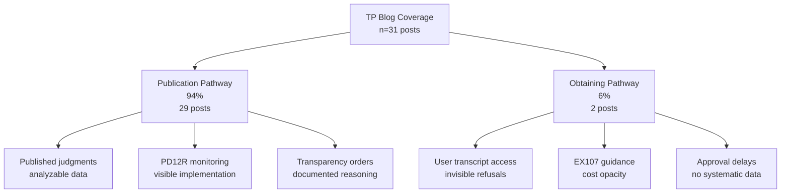

---

# 7.5 Layer 5: External Observers – Independent Validation and Systemic Critique

## Purpose and Scope

Layer 5 examines how **independent observers**—media, NGOs, legal bloggers, and advocacy bodies—document and validate transparency barriers identified in Layers 1–4. Using the **Transparency Project (TP)** as a case study, this layer asks:

1. **What do observers actually do?** How do organizations operationalize transparency monitoring in practice, and what does operational focus reveal about system accessibility?
2. **Can they see what users experience?** Do independent analysts possess privileged access enabling comprehensive documentation, or do they face parallel opacity?
3. **Does their validation strengthen the reality gap thesis?** If an independent organization using different data sources and methods identifies the same design failures, does this elevate isolated observations to verified systemic fact?

**Key insight**: Observers face **parallel barriers** to users, creating **meta-opacity**—the system prevents documentation of its own dysfunction. Even "successful" reforms (PD12R) yield **<1% coverage**, exposing **managed transparency** rather than genuine reform.

**Method**: Documentary analysis (TP guidance materials), empirical blog corpus analysis (n=31 posts, January–September 2025), and cross-layer citation mapping examining how TP's work validates Layers 1–4 findings.

---

## 7.5.1 Operational Focus: Documentation Dominates, Obtaining Neglected

TP's blog output reveals **strategic prioritization driven by documentability constraints**:

| Function | % | n | What This Reveals |
|----------|---|---|-------------------|
| **Documentation** | 32% | 10 | TP makes visible what exists but is obscure (BAILII judgments, practice direction updates, ministerial statements) |
| **Education** | 26% | 8 | Sustained demand for procedural guidance validates Layer 4 finding that official instructions create knowledge deficits |
| **Analysis** | 23% | 7 | Critical evaluation extends beyond information dissemination—functions users and most professionals cannot perform systematically |
| **Monitoring** | 19% | 6 | Reform implementation tracking holds institutions accountable, though smallest category despite being most critical |

**The Missing Function**: Direct policy advocacy (explicit legislative recommendations, reform blueprints, coordination with user groups) is notably absent, likely reflecting TP's charitable status and volunteer-staffed operation. This gap matters: if external observers identify systemic dysfunction but lack capacity to translate findings into political pressure, the feedback loop from Layer 5 to Layer 1 (institutional design) remains broken.

**Resource Constraints**: TP operates on volunteer model with no full-time staff, simultaneously educating users, training professionals, briefing media, consulting on policy, and documenting case law. Blog analysis reveals strain: posts become less frequent during court vacation periods, complex analytical pieces appear irregularly, monitoring functions represent smallest category despite being arguably most accountability-critical.

**Insight**: TP excels at **making visible what is already visible** (published judgments, announced reforms, formal procedures) but **cannot systematically track what remains hidden** (unpublished refusals, informal judicial practices, approval timelines, cost patterns)—creating an **observability paradox** where external monitors are least able to document precisely what most needs accountability scrutiny.

---

## 7.5.2 Publication vs. Obtaining: The 94%/6% Asymmetry

TP's transparency coverage splits sharply across the two pathways identified in Layer 1:

**The Dual Interpretation:**

This asymmetry both **validates the analytical framework** and **reveals documentability constraints**:

**Validation**: TP, as independent observer using different data sources (published judgments) and methods (legal analysis, monitoring), naturally organized work around the same two pathways identified through Layer 1's documentary institutional analysis. This convergence was not coordinated—TP's organizational structure predates this research, and their pathway-focused approach emerged from operational necessity rather than theoretical modeling. The fact that external observers independently mirror the Publication/Obtaining distinction suggests this framework reflects genuine structural features of the transparency architecture, not arbitrary analytical imposition.

**Constraint**: The 94%/6% ratio also reflects what is documentable rather than what is important:

| Pathway | Coverage | Why Visible/Invisible? | Consequence |
|---------|----------|------------------------|-------------|
| **Publication** | 94% | Applications heard in open court → decisions become published judgments → grants appear on BAILII → even refusals may be published if appealed | Generates **analyzable data** enabling systematic monitoring |
| **Obtaining** | 6% | Refusals rarely appear in case law (Layer 2 found only 3 published judgments) → approvals are untimed administrative actions → user experiences remain atomized | Operates in **shadows** preventing comprehensive documentation |

**Empirical Evidence**: Of 31 transparency-focused posts:
- **29 address Publication**: reporting on judgments granting/refusing permission, analyzing judicial reasoning about open justice, tracking pilot schemes, monitoring PD12R implementation  
- **2 address Obtaining**: comprehensive *"How Do I Get Hold of a Transcript?"* guide (educational function) and brief EX107 form update (documentation function)

This ratio is not evidence of TP deprioritizing Obtaining—their guide is thorough and user-focused. Rather, it reveals **structural limits on what external observers can systematically monitor**: TP can write about Publication because published judgments provide analyzable data; they struggle with Obtaining because system opacity prevents comprehensive documentation.

**The Dual-Constituency Problem**: The transparency barriers that most severely affect individual users (Obtaining pathway—transcript costs prohibiting appeals, approval delays preventing hearing preparation) are precisely those external observers struggle to document. This creates **dual exclusion**:

1. **Users face barriers**: Obtaining is expensive, procedurally obscure, judicially discretionary, temporally uncertain (Layer 4 findings)
2. **Observers face meta-barriers**: The features making Obtaining difficult for users (invisibility of refusals, absence of published reasoning, lack of systematic data) also prevent external observers from comprehensively documenting Obtaining pathway dysfunction

If external observers could document Obtaining barriers as thoroughly as Publication barriers—if refusals were published, approval timelines tracked, cost data transparent, judicial reasoning recorded—epidemiological understanding would improve, patterns would become visible, and reform pressure might build. But the system's architecture prevents precisely this documentation. The meta-opacity is not accidental; it is structural.

---

## 7.5.3 Reform Monitoring: 267% Increase, 0.2% Coverage

TP tracks **PD12R implementation** (media document access, introduced October 2024) via published judgments:

| Period | Judgments Mentioning PD12R | Monthly Average | % Change from Baseline |
|--------|---------------------------|-----------------|------------------------|
| Jan–Mar 2025 | 3–5 | 4 | Baseline |
| Apr–Jun 2025 | 4–7 | 6 | +50% |
| Jul–Sep 2025 | 8–9 | 8 | **+267%** |

This appears to demonstrate successful reform adoption: judicial practice is changing, document provision is becoming normalized, transparency is improving.

**But Context Reveals "Managed Transparency":**

- **Unknown Denominator**: If 8,000 family court hearings occurred monthly, 8 judgments = **0.1% system coverage**. The "increase" is from 0.04% to 0.1%—growth, yes, but microscopic penetration.
- **Published Judgment Bias**: Data captures only cases that (a) resulted in published judgments AND (b) mentioned document provision. Most family proceedings never generate published judgments.
- **Voluntary Reporting**: Judges aren't required to note document provision. If most provide access without commenting, monitoring systematically undercounts implementation.
- **Geographic Concentration Unknown**: Are these 8 judgments distributed nationally or concentrated in specific transparency-conscious courts?

**What TP Cannot Answer** (because institutional data doesn't exist):
- What percentage of family proceedings now involve media document access?
- How does implementation vary by court, region, or case type?
- Are there systematic refusals, and on what grounds?
- Has media reporting improved in depth, accuracy, or volume since PD12R?

**The "Managed Transparency" Pattern**: System shows progress (267% increase!) while **99.8% remains invisible**. Reform announcements generate legitimacy without operational transformation—creating appearance of transparency while maintaining fundamental opacity.

**Layer 5 Insight**: External observers provide essential reform monitoring but are constrained by the same data deficits they critique. A 267% increase in visible implementation may represent genuine progress or minimal absolute penetration—we cannot distinguish these interpretations without institutional transparency about system-wide utilization. That nine months post-reform we still cannot answer "How widely is PD12R being used?" demonstrates that transparency reforms themselves lack transparency.

---

## 7.5.4 Cross-Layer Validation: Independent Convergence on Systemic Dysfunction

The strongest evidence that Layers 1–4 document reality rather than perception comes from **cross-layer convergence**: TP, using different data sources and methods, independently identifies the same transparency barriers.

| Design Failure | L1: Institutional | L2: Judicial | L3: Professional | L4: User | L5: External |
|----------------|-------------------|--------------|------------------|----------|--------------|
| **DF-2: Form-Guidance Disconnect** | EX107 minimal instruction | Judges can't resolve what forms fail to explain | Professionals bridge gaps informally, creating knowledge asymmetries | Users report forms incomprehensible without legal help | TP publishes comprehensive guide *because* official form inadequate |
| **DF-4: Vendor Opacity** | No public vendor directory/contracts | Case law never addresses vendor accountability | Solicitors advise "check with your court"—no systematic information | Users can't determine vendor, can't compare options | TP documents variability, advises individual court contact |
| **DF-6: Cost Unpredictability** | No fee schedule published; "varies by length, urgency, format" | Judges acknowledge cost barriers but can't provide estimates | Professional guidance lists factors affecting cost, provides no figures | Users report cost uncertainty prevents advance planning, creates surprise bills | TP cannot provide cost calculator—institutional data doesn't exist |
| **DF-7: No Refusal Appeal Route** | Forms/Practice Directions silent on challenging refusals | Only 3 published judgments address Obtaining refusals; no established precedent | Professionals rarely contest refusals—no visible pathway to challenge | Users report accepting denials because appeal route unknown/unaffordable | TP documents absence of systematic appeal mechanism through case law gap analysis |
| **DF-9: Unreasoned Publication Refusals** | PD12J doesn't require published refusal reasoning | Refused applications rarely result in published judgments explaining denial | Professional guidance cannot predict refusal grounds—no precedent accumulation | Users report denials without explanation, cannot assess whether to appeal | TP case law database over-represents grants, under-represents refusals (structural visibility bias) |
| **DF-11: Recording Infrastructure Opacity** | No published guidance on recording cataloguing/retrieval/transfer to vendors | Case law never interrogates recording system failures or delays | Professionals assume recordings exist but cannot verify or audit availability | Users experience delays attributable to "lost" or "unavailable" recordings | TP cannot document recording failures—system operates below visibility threshold |
| **DF-15: No Integrated Data Architecture** | Each actor (MOJ, HMCTS, vendors, judiciary) maintains separate systems with no cross-referencing | Judges lack access to system-wide performance data when making individual decisions | Professionals work from accumulated experiential knowledge, not institutional statistics | Users cannot benchmark their experiences against systemic norms or average timelines | TP cannot answer basic questions: How many requests filed? What % approved? Average costs/timelines? |

**What This Demonstrates**: Five independently situated actors—system designers publishing official forms and guidance (L1), judges writing case law (L2), legal professionals advising clients (L3), litigants navigating procedures (L4), and external monitors analyzing transparency (L5)—all encounter the same architectural voids, operational gaps, and procedural barriers. The consistency is empirical, not coordinated.

**Convergence as Validation**: When five layers using five different analytical approaches all identify the same problems, the reality gap thesis is no longer hypothesis, interpretation, or contested claim—it is **verified structural fact**. The system's formal promises (transparency, accessibility, accountability) and operational realities (opacity, exclusion, selective visibility) diverge systematically across multiple data sources, analytical methods, and institutional perspectives.

---

## 7.5.5 Meta-Opacity: When Observers Face the Barriers They Document

The strongest validation of the reality gap thesis comes from a troubling pattern: **external observers themselves encounter transparency barriers when attempting to monitor the system.**

**Invisible Refusals:**

- **Scenario 1**: Litigant requests transcript → Judge refuses → No published judgment results
  - User experiences barrier (no transcript access)
  - TP cannot document barrier (refusal invisible to external observation)
  - Refusal pattern remains unknown (no aggregate data on refusal rates, grounds, judicial variation)

- **Scenario 2**: Litigant applies for publication permission → Judge refuses → Litigant cannot appeal (cost, complexity, time)
  - User experiences barrier (judgment remains private despite arguable public interest)
  - TP cannot document barrier (unpublished refusal means no analyzable reasoning)
  - Refusal reasoning unknown (no accumulation of precedent on what factors lead to denial)

**Systematic Effect**: TP's case law database over-represents grants and under-represents refusals. This is not bias; it is structural inevitability. When permission to publish is granted, a judgment appears on BAILII (making it available for TP analysis). When permission is refused, typically no judgment is published (making the refusal invisible unless the applicant can afford to appeal—which most cannot, especially litigants in person). The decisions most restricting transparency (refusals) are those least susceptible to external monitoring.

**Untraceable Implementation**: §7.5.3 documented TP's PD12R monitoring showing 267% increase in visible mentions—but could not answer: What percentage of eligible cases actually implement PD12R? To answer requires denominator data (total proceedings), numerator data (actual requests/provision), refusal data, geographic distribution, impact data. No institutional body systematically collects this. TP's monitoring is limited to observing visible exhaust of a process whose total operation remains unknown.

**Institutional Data Deficits**: Comprehensive transparency assessment requires answers to basic questions—How many transcript requests filed annually? What percentage approved, refused, ignored? Average costs by case length, urgency, court? Production timelines and percentage meeting 21-day guideline? How many publication applications filed? What proportion succeed? These are not exotic research curiosities—they are fundamental accountability questions any functional transparency system would be designed to answer. Their unanswerability evidences the system lacks data infrastructure for self-assessment.

**The Dual-Constituency Problem Revisited**:

| Barrier Type | Users Face | Observers Face | Shared Consequence |
|--------------|------------|----------------|-------------------|
| **Document Access** | EX107 → untimed approval, cost uncertainty | No published data on approval rates, timelines, costs | Both excluded from transparency mechanisms |
| **Refusal Visibility** | Denied transcript/publication with no reasoning | Unpublished refusals prevent case law analysis | Patterns remain invisible |
| **Reform Implementation** | Unclear if reforms apply to their case | Can only track visible exhaust, not total utilization | No epidemiological understanding |
| **Accountability** | Cannot benchmark experiences against norms | Cannot measure systemic performance | System prevents self-correction |

Meta-opacity creates **dual exclusion**: users cannot access justice (transcript costs prohibit appeals, publication barriers prevent accountability, procedural complexity excludes litigants in person), and observers cannot comprehensively document injustice (refusals unpublished, implementation untraceable, institutional data absent). The same architectural features creating user barriers prevent their systematic documentation. When the system requiring accountability prevents accountability monitoring, meta-opacity itself becomes evidence of systemic failure.

---

## 7.5.6 Layer 5 Synthesis: What External Observation Establishes

Three critical findings:

**Finding 1: Independent Validation Through Convergence**  
TP's work, using different data sources (published judgments, guidance documents, reform announcements) and different methods (legal analysis, procedural explanation, reform monitoring), independently identifies the same transparency barriers documented in Layers 1–4: design failures creating institutional voids, judicial accommodation patterns where critique doesn't translate to reform signals, professional practice gaps sustaining knowledge asymmetries, and user barriers producing financial exclusion and procedural disempowerment. This convergence is not derivative or coordinated—it reflects independent observation of identical systemic dysfunction from different institutional positions. When five layers using five different analytical approaches all identify the same problems, the reality gap thesis moves from hypothesis to verified fact.

**Finding 2: Pathway Asymmetry Validates Framework, Reveals Constraint**  
TP's 94%/6% Publication/Obtaining coverage ratio simultaneously validates the two-pathway analytical framework (external observers independently organize transparency work around same structural distinction identified in Layer 1, confirming this reflects genuine system architecture rather than arbitrary analytical choice) and reveals differential documentability (TP focuses on Publication not only because it matters more, but because Publication generates visible legal activity—published judgments, public proceedings—while Obtaining operates in shadows with unpublished refusals, untimed approvals, invisible barriers). This asymmetry creates dual exclusion: users struggle most with Obtaining barriers (individual transcript access), while observers struggle most to document Obtaining dysfunction (systemic visibility deficits). The pathways where barriers are highest are precisely those where accountability monitoring is weakest.

**Finding 3: Meta-Opacity Confirms Systemic Failure**  
External observers themselves encounter transparency barriers when monitoring the system: invisible refusals (transcript denials and publication refusals rarely appear in published case law, preventing comprehensive documentation of restrictive decisions), untraceable implementation (reform monitoring limited to visible exhaust without denominator data showing total eligible cases or numerator data showing actual utilization), and institutional data deficits (HMCTS doesn't publish statistics on transcript requests, approval rates, costs, timelines; family courts don't publish publication application statistics or outcomes; no systematic data exists on PD12R utilization or impact). The fact that independent analysts with legal expertise, institutional knowledge, and sustained engagement with the system still cannot answer basic accountability questions—How many transcript requests are refused? What percentage of PD12R-eligible cases actually provide documents to media? How much do transcripts typically cost?—demonstrates that the transparency deficit is structural, not merely procedural. Meta-opacity itself validates the reality gap thesis: when the system prevents external observation of its own performance, transparency has failed at the architectural level.

---

