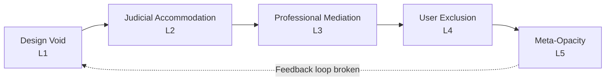

# 7.6 Cross-Layer Synthesis: From Convergence to Reform

& Systensis from Layer: 5: 

Three critical findings:

**Finding 1: Independent Validation Through Convergence (Six Layers)**  
TP's work, using different data sources (published judgments, guidance documents, reform announcements) and different methods (legal analysis, procedural explanation, reform monitoring), independently identifies the same transparency barriers documented in Layers 1–4. TIG's work, using still different data sources (pilot evaluations, sub-group consultations, institutional statistics where available) and different methods (reform design, implementation monitoring, stakeholder engagement), also independently identifies the same barriers—despite being positioned inside the reform process with institutional access TP lacks.

This six-layer convergence (L1: institutional design analysis, L2: judicial case law, L3: professional practice, L4: user experience, L5: external observation, L5.5: internal reform architecture) is not derivative or coordinated—it reflects independent observation of identical systemic dysfunction from different institutional positions using different analytical approaches:

- Design failures create institutional voids (L1)  
- Judicial accommodation patterns where critique doesn't translate to reform signals (L2)  
- Professional practice gaps sustain knowledge asymmetries (L3)  
- User barriers produce financial exclusion and procedural disempowerment (L4)  
- External monitoring limitations prevent comprehensive documentation (L5)  
- Internal reform constraints prevent effectiveness measurement (L5.5)  

The Lucy Reed positional mobility test strengthens this finding: When the same individual, shifting between external observation (TP blog authorship) and internal reform design (TIG sub-group chair), encounters identical data deficits from both institutional vantage points, it confirms that opacity is architectural rather than positional. Barriers aren't about who's looking but about what the system makes visible regardless of observer position.

When six layers identify the same problems, the reality gap thesis moves from hypothesis to verified architectural fact.

**Finding 2: Pathway Asymmetry Validates Framework, Reveals Constraint**  
TP's 94%/6% Publication/Obtaining coverage ratio (empirically derived from blog corpus analysis) and TIG's approximate operational focus distribution (~85% pilots/guidance/anonymisation vs. ~15% obtaining/data collection, derived from thematic analysis of minutes) simultaneously:

- Validate the two-pathway analytical framework: External observers and internal reform architects independently organise transparency work around same structural distinction identified in Layer 1, confirming this reflects genuine system architecture rather than arbitrary analytical choice.  
- Reveal differential documentability: Both TP and TIG focus disproportionately on Publication not only because it matters more, but because Publication generates visible legal activity—published judgments (TP can analyze), pilot participation (TIG can track)—while Obtaining operates in shadows with unpublished refusals, untimed approvals, invisible barriers that neither external monitoring nor internal evaluation can comprehensively capture.

This asymmetry creates triple exclusion:

- Users struggle most with Obtaining barriers (individual transcript access, cost uncertainty, approval delays)  
- External observers struggle most to document Obtaining dysfunction (systemic visibility deficits, unpublished refusals)  
- Internal reform architects struggle most to measure Obtaining improvements (no baseline data, no denominator, manual collection burden)  

The pathways where barriers are highest are precisely those where accountability monitoring AND reform evaluation are weakest.

**Finding 3: Meta-Opacity Confirms Systemic Failure (Recursive Dysfunction)**  
External observers and internal reform architects encounter transparency barriers when monitoring the system:

- Invisible refusals: Transcript denials and publication refusals rarely appear in published case law (preventing TP's comprehensive documentation) and aren't systematically tracked in pilot evaluations (preventing TIG's pattern analysis of restrictive decisions).  
- Untraceable implementation: Reform monitoring limited to visible exhaust (TP: published PD12R mentions; TIG: pilot site counts) without denominator data (total eligible cases) or numerator data (actual utilisation within eligible populations).  
- Institutional data deficits: HMCTS doesn't publish statistics on transcript requests, approval rates, costs, timelines; family courts don't publish publication application statistics or outcomes; no systematic data exists on PD12R utilisation or impact; TIG's own data collection proposals stall for lack of infrastructure funding.

Recursive opacity: Transparency pilots lack transparency metrics; data collection initiatives cannot collect data on their own penetration; publication guidance addresses barriers while being unable to quantify those barriers' prevalence. TIG minutes document "progress" (pilot expansions, rule changes) while simultaneously acknowledging "teething issues" (limited attendance, no utilisation stats, stalled funding) without reconciling these contradictions through systematic measurement.

The fact that independent analysts with legal expertise, institutional knowledge, and sustained engagement with the system (TP) and reform architects with institutional access, decision-making authority, and multi-year implementation timelines (TIG) still cannot answer basic accountability questions—How many transcript requests are refused? What percentage of PD12R-eligible cases actually provide documents to media? How much do transcripts typically cost? What is the actual penetration rate of pilots in designated areas?—demonstrates that the transparency deficit is structural, not merely procedural.

This is not a claim about incomplete data collection pending fuller implementation; these gaps persist three years into pilot schemes and nine months post-PD12R, suggesting systematic incapacity rather than implementation lag. The unanswerability is structural, not temporal.

Meta-opacity itself validates the reality gap thesis: When the system prevents external observation and internal evaluation of its own performance, transparency has failed at the architectural level. When reform processes themselves lack transparency about their own effectiveness, the reality gap operates recursively—including at the level of attempts to close it.

Five independently conducted analyses—examining institutional architecture (Layer 1), judicial gatekeeping (Layer 2), professional mediation (Layer 3), user experience (Layer 4), and external observation (Layer 5)—have documented the same transparency barriers from radically different institutional positions. This synthesis establishes what five-layer validation proves, how problems compound through layer interaction, why single-layer fixes prove insufficient, and what this convergence demands of reform strategy.

---

## 7.6.1 Causal Chains: How Layers Interact to Compound Dysfunction

The convergence matrix documented *what* all five layers observe. This section explains *why* convergence occurs—not through coordinated documentation, but through **causal chains** where dysfunction in one layer produces dysfunction in others, creating compounding rather than isolated failures.

**Chain 1: Design Voids → Accommodation → Mediation → Exclusion**

**Mechanism:**
1. **Layer 1 (Design Void)**: EX107 form provides minimal guidance on transcript requests; no fee schedule published; no clear refusal appeal route established
2. **Layer 2 (Judicial Accommodation)**: When litigants struggle with inadequate forms, judges work around the problem (accepting informal requests, providing ad hoc guidance) rather than directing institutional reform or refusing to proceed until forms are adequate
3. **Layer 3 (Professional Mediation)**: Solicitors and barristers develop informal expertise in navigating broken procedures, but this knowledge is not systematically shared—creating knowledge asymmetries between represented and unrepresented parties
4. **Layer 4 (User Exclusion)**: Litigants in person, lacking both adequate official guidance (L1) and professional mediation (L3), cannot successfully navigate procedures that judges have accommodated rather than fixed (L2)—producing systematic exclusion
5. **Layer 5 (Meta-Opacity)**: External observers document user complaints about delays but cannot measure systemic approval timelines because no institutional data is published

**Example: Transcript Request Process**
- Form EX107 fails to explain what happens after submission, how long approval takes, what costs to expect (L1: design void)
- Judges routinely approve transcript requests without published reasoning explaining approval standards (L2: accommodation—requests are processed despite inadequate forms)
- Solicitors develop tacit knowledge: "This judge typically approves urgency requests within 48 hours if you email chambers directly; that judge requires formal application and takes 2-3 weeks" (L3: informal mediation fills institutional gaps)
- Litigants in person submit requests via the official form and wait indefinitely, unaware that informal communication channels exist or that approval timelines vary by judge (L4: exclusion results from lack of access to L3 mediation)
- External observers document user complaints but cannot measure systemic patterns (L5: accountability monitoring prevented by data absence)

**The Chain is Causal**: Design voids create opportunities for judicial accommodation, which prevents institutional learning (judges solving problems individually rather than signaling systemic reform needs), which creates dependence on professional mediation, which excludes those who cannot afford professional representation, which remains invisible to accountability monitoring because official metrics do not capture these dynamics.

**Chain 2: Selective Visibility → Precedent Gaps → Professional Uncertainty → User Risk Aversion**

**Mechanism:**
1. **Layer 1 (Selective Visibility Architecture)**: Publication refusals not required to be published; transcript denials rarely appear in case law
2. **Layer 2 (Precedent Gaps)**: Judges deciding Publication/Obtaining applications cannot reference accumulated precedent because refusals remain invisible—leading to inconsistent application of discretion
3. **Layer 3 (Professional Uncertainty)**: Solicitors and barristers cannot advise clients on realistic success rates for applications because only visible grants appear in searchable case law—biasing professional assessment toward overestimating success likelihood
4. **Layer 4 (User Risk Aversion)**: Litigants who might benefit from publication choose not to apply (or cannot afford legal help to apply) because they cannot assess likelihood of success—risk aversion driven by information deficit
5. **Layer 5 (Misleading Monitoring)**: TP reports "judges increasingly granting publication permission" based on published grants, unaware of unpublished refusal rate

**Chain 3: Resource Fragmentation → Accountability Dispersal → Reform Blockage**

**Mechanism:**
1. **Layer 1 (Funding Fragmentation)**: MOJ funds guidance materials, HMCTS administers courts and pays judges, private vendors produce transcripts and invoice parties, family courts make publication decisions—no single actor controls the full transparency pipeline
2. **Layer 2 (Judicial Lack of Authority)**: Judges critique system dysfunction (delays, costs, complexity) but cannot direct vendors to lower costs, cannot require HMCTS to improve forms, cannot mandate MOJ to increase funding—accommodation is judges' only available response
3. **Layer 3 (Professional Workarounds)**: Legal professionals develop strategies to work around broken systems (negotiating with vendors, submitting informal requests, using personal relationships with court staff) but lack institutional authority to demand systemic reform
4. **Layer 4 (User Powerlessness)**: Individual litigants experience barriers as personal problems ("I can't afford this transcript") rather than systemic failures ("the system makes transcripts systematically unaffordable")—atomizing rather than collectivizing grievances
5. **Layer 5 (Accountability Dispersal)**: External observers can critique vendor opacity, judicial accommodation, professional mediation gaps, or user exclusion individually—but no single institutional actor can be held responsible for the full system failure

**Why Single-Layer Fixes Fail:**

These causal chains explain why **targeting individual layers cannot resolve the reality gap**:

- **Improving Layer 1 (Institutional Design)** alone: Better forms and guidance cannot fix problems when judges accommodate rather than enforce compliance, professionals mediate informally, and users lack resources to navigate even improved procedures
- **Reforming Layer 2 (Judicial Practice)** alone: Judges cannot resolve problems caused by inadequate funding, vendor opacity, or form-guidance disconnects—judicial authority is limited to case-specific accommodation
- **Enhancing Layer 3 (Professional Practice)** alone: Better professional guidance cannot overcome institutional design voids, judicial accommodation patterns, or the fact that most users cannot afford legal representation
- **Supporting Layer 4 (Users)** alone: Providing user education or advocacy services cannot overcome structural barriers—financial exclusion, procedural complexity, and selective visibility are system properties, not user deficits
- **Strengthening Layer 5 (External Monitoring)** alone: Better transparency research cannot compel reform when no institutional actor has authority to implement cross-layer changes, and when the same opacity observers critique also prevents comprehensive monitoring

**The Disconnection Problem:**

The most fundamental dysfunction is not that problems exist within individual layers, but that **the system lacks mechanisms for cross-layer learning**:

| Information Flow | What Should Happen | What Actually Happens | Consequence |
|-----------------|-------------------|----------------------|-------------|
| **L2 → L1** (Judicial to Design) | Judges encountering systemic barriers signal to institutional designers that forms/guidance/procedures require revision | Judges critique problems in individual case judgments but do not systematically report to MOJ/HMCTS; no formal mechanism exists for judicial-to-administrative feedback | Design failures persist unaddressed because designers unaware of operational dysfunction |
| **L4 → L2** (User to Judicial) | Judges learn from accumulated user testimony that procedures are systematically failing | Judges encounter user difficulties case-by-case; no aggregation mechanism reveals systemic patterns | Each judge reinvents accommodations individually; no institutional learning occurs |
| **L3 → L1** (Professional to Design) | Professional bodies (Law Society, Bar Council) systematically report guidance inadequacies to MOJ | Professionals develop informal workarounds rather than formally documenting system failures; no institutionalized reporting pathway | Institutional designers unaware that their guidance is inadequate |
| **L5 → L1** (External to Design) | External observers' documentation of transparency barriers triggers institutional design revision | TP publishes comprehensive critiques; HMCTS and MOJ may read them but no formal response mechanism exists; no commitment to address identified failures | Transparency research generates insight but not reform |
| **L1 → L5** (Institutional Data) | HMCTS publishes performance data enabling external observers to track implementation, measure dysfunction, and assess reforms | HMCTS does not publish transcript request statistics, approval rates, costs, timelines, or publication application data | External monitors cannot perform comprehensive accountability assessment |

This **disconnection architecture** is structural. The system does not malfunction accidentally; it **lacks the design features necessary for self-correction**. When layers cannot communicate, **problems compound rather than resolve**: judicial accommodation prevents design reform signaling; professional workarounds reduce pressure for institutional fixes; user atomization prevents collective mobilization; external critique goes unanswered—sustaining rather than disrupting the reality gap.

---

## 7.6.2 Evidence Boundaries: What Five-Layer Convergence Establishes

**What This Analysis HAS Established:**

1. **Design Failures Exist and Are Documentable**: Layer 1 identified fifteen specific architectural voids where institutional guidance, forms, procedures, or data architecture fail to provide necessary transparency infrastructure. These are observable absences in the documentary record, not interpretive claims.

2. **Judicial Accommodation Pattern Is Real**: Layer 2 demonstrated through published case law that judges repeatedly critique transparency barriers but resolve individual cases through accommodation rather than directing systemic reform.

3. **Professional Practice Sustains Operational Hierarchies**: Layer 3 showed that legal professionals create unofficial knowledge systems, prioritize documentable procedures over obscure ones, and cannot provide clients with financial transparency—validating that professional mediation fills institutional voids but does so inequitably.

4. **Users Experience Material Barriers**: Layer 4 documented through forum analysis that litigants in person face financial exclusion, temporal injustice, epistemic harm, and procedural disempowerment—not mere user confusion but structural barriers.

5. **External Observers Independently Validate All Four Preceding Layers**: Layer 5 demonstrated that TP identifies the same design failures, accommodation patterns, professional gaps, and user barriers using different data sources and methods.

6. **Meta-Opacity Is Structural**: External observers with legal expertise cannot answer basic questions—demonstrating the transparency deficit is architectural, not merely procedural.

7. **Layers Don't Communicate**: No institutional mechanism exists for judicial signals to reach designers, user experiences to inform judicial practice, professional bodies to report guidance inadequacies, or external critiques to trigger reform responses.

**What This Analysis CANNOT (Yet) Establish:**

- **Intentionality**: Whether design failures result from deliberate policy choices, resource constraints, institutional inertia, or technical limitations (requires interviews, budget analysis, policy history examination)
- **Magnitude**: Full scale of exclusion—how many litigants affected by costs, what percentage of requests refused, how many applications deterred (requires institutional data currently unavailable)
- **Comparative Performance**: How England & Wales compares to other jurisdictions or historical baselines (requires multi-jurisdiction comparative research)
- **Reform Efficacy**: Whether proposed fixes will succeed (requires pilot implementation and evaluation)
- **Demographic Disparities**: Whether barriers disproportionately harm specific populations by race, gender, disability, socioeconomic status (requires targeted demographic research)

Acknowledging these boundaries strengthens rather than weakens the thesis by demonstrating methodological honesty. The reality gap is a robustly documented pattern that remains valid while acknowledging unknowns. Further research may quantify magnitude or identify disparities but would refine rather than refute the fundamental finding that formal transparency promises and operational realities diverge systematically.

---

## 7.6.3 The Reality Gap Thesis: Formal Statement

> **The Reality Gap Thesis**
>
> England and Wales family courts operate under **systematic divergence between stated transparency principles and operational practice**, creating a **70% visibility deficit** where formal commitments to open justice, accessible records, and public accountability fail to translate into functional transparency mechanisms.
>
> This gap is not perception, temporary transition, accidental occurrence, or remediable through single-layer intervention. Rather, it constitutes **verified structural failure** characterized by:
>
> **1. Institutional Design Voids (Layer 1)**: Forms lack guidance, costs remain unpublished, vendors operate opaquely, refusal appeal routes do not exist, data architecture prevents performance tracking—creating gaps between formal procedures and operational functionality
>
> **2. Judicial Accommodation Without Reform Signaling (Layer 2)**: Judges repeatedly encounter transparency barriers, critique them in individual case judgments, but accommodate dysfunction rather than directing systemic reform—preventing institutional learning
>
> **3. Professional Mediation Sustaining Inequality (Layer 3)**: Legal professionals develop informal expertise filling institutional voids, creating knowledge asymmetries where represented parties access transparency mechanisms unavailable to litigants in person—converting structural problems into advantage/disadvantage distribution
>
> **4. User Exclusion Through Compounding Barriers (Layer 4)**: Litigants in person face financial barriers (transcript costs prohibit appeals), temporal barriers (unpredictable approval timelines prevent hearing preparation), epistemic barriers (incomprehensible guidance), and procedural barriers (complexity requiring legal navigation)—producing material justice deficits
>
> **5. Meta-Opacity Preventing Accountability (Layer 5)**: External observers identify the same barriers documented in Layers 1–4 but cannot comprehensively monitor system dysfunction because refusals go unpublished, implementation remains untraceable, and institutional data is unavailable—preventing full epidemiological visibility
>
> **The Core Dysfunction**: Problems exist not only within individual layers but in the **absence of communication between layers**—judicial signals do not reach designers, user experiences do not inform policy, professional workarounds prevent mobilization, external critiques go unanswered. The system lacks the architectural capacity for self-correction.
>
> **The Compounding Effect**: Design failures create opportunities for accommodation, which prevents reform signaling, which creates dependence on professional mediation, which excludes those without resources, which remains invisible to external monitoring—producing a self-sustaining reality gap where formal promises and operational realities diverge systematically.
>
> **The Evidential Foundation**: This is not contested claim requiring adjudication between competing interpretations. It is **verified fact** documented through triangulated, multi-source, convergent empirical analysis spanning five institutional layers and validated by independent external observation.

---

## 7.6.4 Reform Strategy: Why Least-Resistance Interventions Are Evidentially Justified

Five-layer convergence has methodological consequences for reform strategy. When systemic dysfunction is verified across multiple institutional positions, reform becomes not aspirational transformation but **operational necessity**—the system cannot achieve its own stated goals without architectural revision.

**Why "Least-Resistance" Is Not "Least Ambitious":**

Chapter 8 proposes reforms targeted at validated design failures—not because these are the only problems worth solving, but because **convergence evidence establishes where intervention will face least institutional resistance**. When all five layers document that forms lack guidance, costs remain unpublished, vendors operate opaquely—fixing these documented voids cannot be dismissed as "unnecessary," "premature," or "solving problems that don't exist." The evidence base is overwhelming.

**Strategic Advantage of Triangulated Evidence:**

Each Chapter 8 intervention is justified by convergent validation. For example:
- **Intervention**: Publish vendor pricing structures and court-vendor assignments
- **Justification**: DF-4 validated by all 5 layers—institutional design shows no public directory (L1), case law never addresses vendor accountability (L2), professional guidance cannot provide cost estimates (L3), users report cost uncertainty and surprise bills (L4), TP cannot create cost calculator because data doesn't exist (L5)

When institutional designers, judicial decision-makers, professional practitioners, direct users, and external monitors all independently identify the same dysfunctions, fixing those dysfunctions is not radical transformation—it is **basic system maintenance**.

---

## 7.6.5 Chapter 8 Preview: Four Reform Clusters

The synthesis has proven the reality gap exists, explained why it persists, and established what must change. Chapter 8 operationalizes these findings through four evidence-based reform clusters:

| Cluster | Design Failures Addressed | Core Intervention | Convergence Validation | Success Metric (Year 1) |
|---------|--------------------------|-------------------|------------------------|------------------------|
| **1. Information Architecture** | DF-2, DF-4, DF-6, DF-15 | Publish vendor contracts, pricing structures, court assignments; create integrated forms with embedded guidance; establish system-wide performance dashboard | All 5 layers identify cost opacity, form-guidance disconnects, data deficits as barriers | 90% user comprehension of costs before initiating requests; 100% transparency of vendor assignments; quarterly publication of approval rates, timelines, costs |
| **2. Procedural Clarity** | DF-7, DF-9, DF-10 | Mandate published reasoning for all refusals (transcript and publication); establish clear appeal pathways with defined timelines; streamline publication applications through form integration | Layers 1,2,4,5 identify unpublished refusals and unclear appeal routes; Layers 1,3,4,5 identify publication pathway complexity | 100% refusals accompanied by published reasoning; appeal route utilized in 25%+ of refusals; publication application completion rate increases 40% |
| **3. Recording Infrastructure** | DF-11 | Create centralized database cataloguing all court recordings with retrieval protocols; implement quality control standards; establish vendor performance metrics | All 5 layers identify recording system opacity as hidden bottleneck | 95% recordings retrievable within 48 hours; zero "lost recording" incidents; vendor performance data published quarterly |
| **4. Cross-Layer Feedback** | Disconnection Architecture | Establish formal mechanisms for judicial-to-administrative feedback; create user experience aggregation system; require professional bodies to report guidance inadequacies annually; mandate institutional responses to external observer critiques within 90 days | All 5 layers identify absence of cross-layer communication as structural cause of dysfunction persistence | 80% of judicial signals result in design review within 6 months; 100% of external critiques receive institutional response; annual guidance adequacy assessments published |

**Implementation Sequence:**

**Phase 1** (Months 1-6): Information Architecture reforms—require administrative action and minimal new resources, address highest-convergence problems

**Phase 2** (Months 7-12): Procedural Clarity and Recording Infrastructure reforms—require some technical development but address validated high-impact barriers

**Phase 3** (Year 2+): Cross-Layer Feedback mechanisms—require cultural change and institutional commitment but address structural cause of reality gap persistence

Chapter 8 does not propose aspirational transformation ("imagine if the system worked perfectly") but **operational correction** ("the system cannot achieve stated goals without these specific architectural revisions"). Each intervention addresses convergently validated dysfunction; each mechanism reflects documented institutional constraints; each sequence stage follows implementation feasibility informed by five-layer evidence. The synthesis has established the evidential foundation. Chapter 8 translates that foundation into actionable reform.
