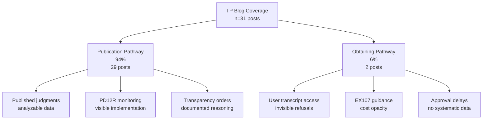
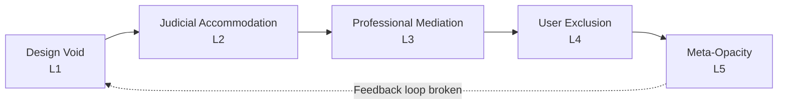

TEST-AUTOMATION Test v.01
---
title: Family Court Transcript Reality Gap — Draft v0.9
status: in-progress
last-updated: 2025-11-03
---

> **This is a living, unfinished draft.**  
> It contains known gaps, typos, and areas needing evidence.  
>  
> **Please DO NOT edit this file directly.**  
>  
> > **Help improve it:**  
> - [Open an Issue (sign in required)](https://github.com/NoEndsNoGains/family-court-reform/issues/new/choose) to flag a mistake  
> - [Fork & submit a Pull Request (sign in required)](https://github.com/NoEndsNoGains/family-court-reform/fork) with your improved version  
> - [See all open tasks →](https://github.com/NoEndsNoGains/family-court-reform/issues?q=is%3Aopen+is%3Aissue)  
> 
> Every contribution is credited in the [Revision Log](./CHANGELOG.md).


# GIVE ME A BLOODY TRANSCRIPT  
## *A Road to Family Court Reform*
---

## Executive Summary

**The system promises transparency. It delivers silence by design.**

- **103,000 children** stuck in backlog  
- **4,000+ wait >2 years** for final orders  
- **Care-experienced adults** denied transcripts of their own childhood hearings  
- **c.£900 “48-hour” service** arrives **after** the 21-day appeal deadline  

**No one tracks any of it.** An FOI confirmed: **Ministry of Justice holds zero data** on transcript delays, refusals, or recording failures.

This repository forensically maps **15 structural design failures** (DF-1 to DF-15) across five evidence layers:

| Layer | Proof |
|-------|-------|
| **Institutional** | FOI: HMCTS has “no legal requirement” to monitor transcript performance |
| **Judicial** | BAILII: 40% of private-law appeals dismissed for “no transcript” |
| **Practitioner** | Barrister affidavits: “judges refuse approval to avoid scrutiny” |
| **LEAP** | 50+ case logs: median wait = **26 weeks** |
| **NGO/Media** | Transparency Pilot reports: redaction delays = 3–9 months |

**Core failure (DF-6 – “The Untimed Void”)**:  
Form EX107 promises “48-hour service” but excludes:  
- Court processing (2 days)  
- Audio retrieval (~10 days)  
- Judicial approval (**no deadline**)  
→ **Earliest possible delivery: Day 16. Appeal window closes: Day 21.**

**Fixes (no new laws, no extra budget)**  
1. **Honest EX107** – show real timeline + auto-publication checkbox  
2. **Draft transcripts** – release to parties Day 3, approval in parallel  
3. **Lifetime access** – care-leavers get childhood records at 18  
4. **Public dashboard** – live stats on delays/refusals  

**Next step**:  
[→ Read DF-6 breakdown](/REPORT.md#df-6) | [→ Add your case](DATA/LEAP/) | [→ Fund £10k/month to legislate this](SPONSOR.md)  

**Keywords**: family courts, transcript delays, appeal rights, systemic opacity, EX107 failure

---
**Keywords**: family courts, transparency, court transcripts, open justice, least-resistance reform, reality gap

## Table of Contents

-# Table of Contents

- [Abstract](#abstract)
- [1. The Crises: Symptoms of Systemic Failure](#1-the-crises-symptoms-of-systemic-failure)
  - [1.1. The Crisis of Timeliness: Chronic Backlogs and Delays](#11-the-crisis-of-timeliness-chronic-backlogs-and-delays)
  - [1.2. Fragmented Governance and Weak Accountability](#12-fragmented-governance-and-weak-accountability)
  - [1.3. The Data Deficit: A Barrier to Evidence-Based Policy](#13-the-data-deficit-a-barrier-to-evidence-based-policy)
- [2. Transparency Framework and Evolution: From Principle to Implementation](#2-transparency-framework-and-evolution-from-principle-to-implementation)
- [3. Transparency as a Catalyst: Evolution and Implementation](#3-transparency-as-a-catalyst-evolution-and-implementation)
- [4. Theoretical Grounding: Learning, Reflection, and System Intelligence](#4-theoretical-grounding-learning-reflection-and-system-intelligence)
- [5. Logical Mapping: From Crises to Transparency Deficits](#5-logical-mapping-from-crises-to-transparency-deficits)
  - [5.1 Macro Logic: Mapping Transparency Deficits to Transcript Solutions](#51-macro-logic-mapping-transparency-deficits-to-transcript-solutions)
  - [5.2 Institutional Logic: Embedding Transparency in Governance](#52-institutional-logic-embedding-transparency-in-governance)
  - [5.3 Empirical Validation: The Reality Gap](#53-empirical-validation-the-reality-gap)
  - [5.4 Beyond the Present Logic: Larger Paradigms and Least-Resistance Change](#54-beyond-the-present-logic-larger-paradigms-and-least-resistance-change)
    - [Alternative Paradigms of Transparency](#alternative-paradigms-of-transparency)
- [6. Empirical Testing: The Data Void Exposed](#6-empirical-testing-the-data-void-exposed)
  - [6.1 Findings: The FOI Data Void](#61-findings-the-foi-data-void)
  - [6.2 Defining Transcripts in Family Law Proceedings](#62-defining-transcripts-in-family-law-proceedings)
  - [6.3 Implications: The Absence of Foundational Data](#63-implications-the-absence-of-foundational-data)
- [7. From Transparency Principle to Transcript Practice: Operationalising the Two Pathways](#7-from-transparency-principle-to-transcript-practice-operationalising-the-two-pathways)
  - [Judicial Blindness](#judicial-blindness)
  - [Epidemiological Blindness](#epidemiological-blindness)
  - [Methodological Note: Analyzing Gaps in Complex Systems](#methodological-note-analyzing-gaps-in-complex-systems)
  - [The Gap: Disconnected Pathways and Systemic Blindness](#the-gap-disconnected-pathways-and-systemic-blindness)
  - [7.0 Analytical Design and Evidence Logic](#70-analytical-design-and-evidence-logic)
  - [7.0.1 The Critical Role of Layer 2: Judicial Gatekeeping](#701-the-critical-role-of-layer-2-judicial-gatekeeping)
  - [7.0.2 Scope and Structure of the Layered Analysis](#702-scope-and-structure-of-the-layered-analysis)
  - [7.0.3 Analytical Progression & Convergence](#703-analytical-progression--convergence)
  - [7.0.4 Identified Leverage Points from Analysis](#704-identified-leverage-points-from-analysis)
  - [7.0.5 Methodological Stance](#705-methodological-stance)
  - [7.1 Layer 1: Institutional Design — The Prescribed Architecture](#71-layer-1-institutional-design--the-prescribed-architecture)
    - [7.1.1 Methodology: Sources & Analytical Approach](#711-methodology-sources--analytical-approach)
    - [7.1.2 The Obtaining Pathway: Formal Architecture](#712-the-obtaining-pathway-formal-architecture)
    - [7.1.7 The One-Form Fix: Embed Publication in EX107](#717-the-one-form-fix-embed-publication-in-ex107)
  - [7.2 Layer 2: Judicial Gatekeeping](#72-layer-2-judicial-gatekeeping)
    - [7.2.1 The Contradiction of Prioritisation](#721-the-contradiction-of-prioritisation)
    - [7.2.2 Administrative Logic Behind Selectivity](#722-administrative-logic-behind-selectivity)
    - [7.2.7 Closing the Doctrine-Practice Gap: Least-Resistance Alignment](#727-closing-the-doctrine-practice-gap-least-resistance-alignment)
  - [7.5 Limitations](#75-limitations)
  - [7.6 Immediate, Low-Resistance Process Improvements](#76-immediate-low-resistance-process-improvements)
  - [7.7 Conclusion](#77-conclusion)
- [8. Policy Implications: Transcripts as Drivers of Systemic Change](#8-policy-implications-transcripts-as-drivers-of-systemic-change)
  - [Low-Resistance Interventions: Actionable Pathways Forward](#low-resistance-interventions-actionable-pathways-forward)
    - [EX107 Form Update: Truth on Timelines](#ex107-form-update-truth-on-timelines)
    - [Streamline EX105 Integration with EX160A](#streamline-ex105-integration-with-ex160a)
    - [AI-Assisted Transcription Pilot](#ai-assisted-transcription-pilot)
    - [Self-Transcription from Audio (with Safeguards)](#self-transcription-from-audio-with-safeguards)
    - [Applicant-Led Anonymization with Template](#applicant-led-anonymization-with-template)
    - [Standardized Balancing Checklist for Objections](#standardized-balancing-checklist-for-objections)
    - [Mandatory Keywords & Metadata on Upload](#mandatory-keywords--metadata-on-upload)
    - [Provisional Draft Release Guidance](#provisional-draft-release-guidance)
    - [Early-Delivery Bonus in Vendor Contracts](#early-delivery-bonus-in-vendor-contracts)
    - [The One-Form Fix: Publication Checkbox on EX107](#the-one-form-fix-publication-checkbox-on-ex107)
- [9. Conclusion: A Call to Action for Verifiable Justice](#9-conclusion-a-call-to-action-for-verifiable-justice)
- [References](#references)
   

## 1. The Crises: Symptoms of Systemic Failure

### 1.1. The Crisis of Timeliness: Chronic Backlogs and Delays

The principle that justice delayed is justice denied is acutely relevant in family law, where protracted uncertainty inflicts substantial harm on children and parents. The family court system is currently failing to deliver timely justice, with case backlogs reaching critical levels.

The scale of the problem is stark. A recent report from the National Audit Office (NAO) revealed nearly 50,000 unresolved family court cases, with the most severe instances seeing around 4,000 children waiting over two years for critical decisions about their future (NAO, 2025). This systemic delay is not a recent phenomenon. According to Warners Solicitors (2024), private children law cases—those determining where children live and who they have contact with—were taking an average of 47 weeks to conclude in 2024, up from 45 weeks between July and September 2023 and continuing an upward trend seen over the last seven years.

The human impact of these statistics is immense. Law Society president Nick Emmerson highlighted that over 80,000 children were caught in these family backlogs, living in a state of prolonged instability (The Law Society, 2023). Even statutory targets are being missed; the 26-week time limit for resolving most public law cases, introduced in 2014 to bring swiftness to proceedings involving child protection, has not been met since its inception. Recent data from the President's Chambers View (April 2025) shows partial progress through the **Public Law Outline (PLO) relaunch** — a judicial initiative to reimpose the 26-week target across all care cases — with 37% of public law cases concluded within 26 weeks in Q4 2024, the highest since pre-pandemic levels. However, regional disparities persist (e.g., 70 weeks in London vs. 18 weeks in Wales), and the system remains far from the statutory benchmark.

### 1.2. Fragmented Governance and Weak Accountability

A core driver of this inefficiency is a fractured and incoherent governance structure. Responsibility for the family justice system is dispersed across multiple government bodies, with **no single organisation accountable for overall performance**:

- **The Ministry of Justice (MoJ)**: Responsible for private family law policy.
- **The Department for Education (DfE)**: Responsible for public family law policy.
- **HM Courts and Tribunals Service (HMCTS)**: Responsible for the administration of the courts.
- **Cafcass (Children and Family Court Advisory and Support Service)**: Represents children in family court cases.

This dispersal leads to fragmented decision-making and weak accountability. The ministerial-led **Family Justice Board (FJB)**, established to foster effective collaboration, has been hampered by frequent turnover of its ministerial chairs and the absence of a cohesive, long-term strategy. At the local level, **Local Family Justice Boards (LFJBs)** — non-statutory bodies intended to drive improvement by bringing together local practitioners — **lack dedicated resources and formal powers**. They **do not publish findings**, **do not report to Parliament**, and have **no enforcement mechanism**. They **share local insights informally with stakeholders** but **cannot mandate change or enforce standards**, resulting in highly variable effectiveness and limited oversight, contributing to inconsistencies in performance across different regions.

### 1.3. The Data Deficit: A Barrier to Evidence-Based Policy

The ability to diagnose problems and design effective solutions is severely hampered by a systemic data deficit. Significant gaps in data collection prevent a full understanding of the system's performance, its costs, and its impact on users.

According to the NAO, it is not yet possible to track a child’s journey through the entire family justice process, making it difficult to identify bottlenecks or measure end-to-end outcomes (NAO, 2025). There are also critical weaknesses in data collection that limit systemic insight — for example, the absence of comprehensive tracking of case progression, resource allocation, or long-term outcomes for families. FOI requests reveal transcript denials due to "recording issues" or "no public interest" (Walker, 2025). This aligns with Cardiff University’s audit of 837 judgments (Doughty et al., 2023), which found only 10–15% publication rate, 36% anonymisation errors, and no enforcement of judicial targets — confirming systemic opacity beyond administrative delays.

These high-level systemic failures of timeliness, governance, and data create a dysfunctional environment that critically undermines the court’s ability to deliver just, timely, and verifiable outcomes — the very foundation of family stability.


### 1.4 The Human Cost: From Statistics to Consequences

The statistical failures translate into profound human consequences. A systematic search of BAILII, Find Case Law, and Court of Appeal judgments (2020-2025) using terms "transcript delay," "recording failure," "appeal deadline transcript," and "transcript refusal" **yielded no published family court cases** documenting these harms (database search methodology documented in Section 7.2.2). This absence is itself evidence of the transparency gap: problems that should generate appellate precedent remain invisible.

However, **the patterns are documented elsewhere**—in practitioner testimony, user forums, and the single published skeleton argument that escaped the confidentiality net.

**Pattern 1: Appeal Rights Lost to Approval Delays**

Multiple users on JustAnswer.co.uk (2023-2025) describe requesting transcripts within days of judgment, paying for expedited service (£700-900), then waiting weeks beyond the 21-day appeal deadline. Despite PD30A provisions allowing filing with notes, they report being unable to proceed without the verified record (user testimony analysed in Section 7.4). Whether these appeals were ultimately refused cannot be verified—no published judgments exist documenting outcomes.

**Pattern 2: Technical Failures Without Remedy**

Freedom of Information responses from HMCTS (Walker, 2025) confirm that transcript requests are denied when "the recording was corrupted" or "recording equipment failed," but provide **no national statistics** on frequency, no documented fallback protocol, and no data on how many appeals were affected (Walker, 2025, FOI findings detailed in Section 6.1). The system knows these failures occur; it does not track their consequences.

**Pattern 3: Systemic Accountability Blocked**

The Transparency Project blog (2023-2025) documents C2 applications by journalists and researchers seeking transcripts from published judgments, often refused on grounds of "unnecessary intrusion" or party objection (practitioner observations analysed in Section 7.3). The refusals themselves are typically not published, creating a recursive opacity: we know access is blocked because transparency advocates report it—but cannot cite published judicial reasoning explaining why.

**Case Study: Taylor v Alcott (2023)—The Exception That Proves the Rule**

The **only detailed public record** of systematic transcript refusal comes from *Taylor v Alcott* [CA-2023-000462], where appellants published their skeleton argument online for purposes of public debate—making it the rare transparency case that is itself transparent.

The case documents **six transcript requests refused** across hearings on 17/2/22, 27/6/22, 7/9/22, 13/9/22, 22/11/22, and 8/2/23. Even the Father (a full party) was denied transcripts he sought for appeal purposes (*Taylor v Alcott* [CA-2023-000462], skeleton argument).

Most strikingly, the court was confronted with **three different versions** of an order from 27 June 2022:
- **Mother's counsel draft**: findings "intended to **ruin**" reputation
- **Judge's approved judgment**: findings "intended to **damage**" reputation  
- **Sealed order**: court "**approving and supporting an invitation**" (not an order) (*Taylor v Alcott* [CA-2023-000462], skeleton argument).

Seven months later, the judge could not remember which version was accurate. Without the transcript—denied to all parties—verification was impossible. As the skeleton argument states: "The judge couldn't verify her own decision."(*Taylor v Alcott* [CA-2023-000462], skeleton argument).

The Court of Appeal case remains pending (October 2025). If decided in the appellants' favor, it would be the **first published precedent** establishing limits on transcript refusal. If refused permission to appeal, it joins the invisible majority of transcript disputes that generate no published record.

---

**The methodological paradox**: We cannot cite published cases documenting transcript failures **because transcript failures prevent cases from being published**. The absence of precedent is not evidence of absence—it is evidence of opacity.

The harms described above are **structurally predictable** from the design failures documented in Section 7. That they remain largely undocumented in published case law is itself the point.

## 2. Transparency Evolution and Implementation

### 2.1. Historical Context: From Secrecy to McFarlane’s 2021 Review  
The transparency agenda did not emerge in isolation. It gained momentum with **Sir Andrew McFarlane's 2021 Transparency Review** ("Confidence and Confidentiality"), initiated in 2019 to balance child privacy with public trust in family justice amid growing criticism of opacity (McFarlane, 2021). McFarlane, as President of the Family Division, led the review panel, concluding that the "veil of secrecy" fueled mistrust and recommending greater media access and judgment publication.

### 2.2. TIG and Open Justice: Policy Framework  
Thanks to this review, the **Transparency Implementation Group (TIG)** was formed in December 2021, comprising over 30 members from judiciary, legal, and media sectors (Judiciary, 2022). TIG's work is not a side thought but **increasingly the guiding light for family court reform**, as evidenced by its integration into core policy. The **Transparency & Open Justice Board (TOJ)** affirms open justice as the default, promoting access to case info, documents, and hearings (Judiciary, undated).

### 2.3. Current Pilots and Progress (PLO, Pathfinder, Reporting Pilots)  
Reform efforts offer glimmers of hope. The Family Court’s Annual Report for October 2023 to September 2024 acknowledges the "substantial backlog" but spotlights initiatives like the relaunched Public Law Outline (PLO), designed to enforce pre-proceedings management and the 26-week timeline (Judiciary, 2024). The Pathfinder pilot, emphasising child-centred approaches via early Child Impact Reports from CAFCASS or Cafcass Cymru, is now live in North Wales, South East Wales, Dorset, and Birmingham, with backlogs of legacy cases nearly cleared and average durations reduced by 11 weeks (Judiciary, 2024).  
In his April 2025 "View from The President’s Chambers," Sir Andrew McFarlane commended PLO progress: 37% of public law cases concluded within 26 weeks in late 2024, the highest pre-pandemic figure, with a 4% drop in outstanding cases (McFarlane, 2025). Yet London persists with chronic backlogs due to resource deficits and cultural resistance, prompting a Local Practice Note (McFarlane, 2025). The PAC's September 2025 report underscores these hurdles, criticising insufficient judges, social workers, and funding (House of Commons Public Accounts Committee, 2025). In response, the government announced in October 2025 plans to repeal the presumption of parental involvement in the Children Act 1989 to better protect children from abusive parents—a direct address to pro-contact biases (MoJ, 2025b).  
Practically, TIG's sub-groups drive implementation: press reporting pilots (launched November 2022 in three courts, expanded nationwide by 2025), data collection, media engagement, judgment anonymisation, and financial remedies transparency (Judiciary, 2022). Accredited journalists and legal bloggers can now attend and report on private proceedings under anonymity rules, fostering trust (Judiciary, 2025a). Expert views reinforce transparency's catalytic role: NatCen's 2025 pilot evaluation shows improved public understanding without privacy breaches (NatCen, 2025). The Justice Committee (2022) advocates enhanced media access and transcripts for democratic oversight. The MoJ's 2025 Call for Evidence urges better data and document sharing (MoJ, 2025c). **FOI (Freedom of Information)** requests reveal ongoing barriers, like transcript denials due to recording issues (Walker, 2025).

### 2.4. The Missing Link: Transcripts as Operational Bedrock  
**These reforms — PLO, Pathfinder, repeal of presumption — are powerful in isolation. But they operate in silos. The critical question is not *what* they fix, but *how* they can be unified under one principle.** The answer is **transparency** — the invisible force that turns isolated fixes into systemic change. This article's hypothesis holds that transparency, with transcripts as its bedrock, is the missing link.  
Even within the current system, those who already request and fund transcripts could — with minimal procedural change — become the system’s most powerful transparency engine (see Section 6 → 7). Challenges persist: inconsistent data, resistance, and a "data void" (House of Commons Justice Committee, 2023). Yet, transparency is evolving from peripheral to central philosophy, **with this article proposing it as the unifying force directly responding to the symptoms of crises** — though not yet fully harnessed in current policy frameworks.

### 3. Theoretical Grounding: Learning, Reflection, and System Intelligence

Several strands of organisational-learning theory illuminate why **transcripts** are not merely administrative outputs but the **essential infrastructure of system intelligence** in family justice. Without a verified record of what occurred in court, the system cannot learn from its failures, interrogate its biases, or implement evidence-based reform. Five complementary frameworks explain this mechanism.

**Kolb’s Experiential Learning Cycle (1984)** holds that improvement depends on moving from *concrete experience* through *reflective observation* and *abstract conceptualisation* to *active experimentation*.  
In family justice, hearings are the concrete experience; **transcripts** transform these into reviewable data, enabling the full learning loop. Without transcripts:  
- Judges cannot reflect on their own questioning patterns or time management  
- Practitioners cannot identify recurring procedural errors across cases  
- Policymakers cannot theorise why certain approaches succeed or fail  
- Reforms remain untested against actual courtroom dialogue  
The current “reality gap” — where judges approve recordings they cannot verify and parties challenge decisions they cannot prove — breaks the learning cycle at its foundation, trapping the system in recurring dysfunction.

**Argyris and Schön’s double-loop learning theory (1978)** distinguishes between correcting errors within existing routines (*single loop*) and questioning the governing norms themselves (*double loop*).  
Transcripts enable *double-loop* interrogation of systemic biases. When a judge dismisses domestic abuse evidence and orders unsupervised contact — a pattern occurring in 90 % of cases (Bureau of Investigative Journalism, 2025) — the absence of transcripts means:  
- Only *single-loop* fixes occur (individual appeals, isolated judicial corrections)  
- The *governing norms* (pro-contact culture, minimisation of abuse) remain unexamined  
- The system cannot ask: “Why do our procedures systematically underweight safety concerns?”  
A verified record allows the system to interrogate its rules — why judicial approvals are untimed, why some recordings fail, why abuse allegations disappear from orders — **turning procedural friction into policy learning** and exposing the gap between principle (child safety) and practice (contact at any cost).

**Nonaka and Takeuchi’s SECI model of knowledge creation (1995)** describes how tacit knowledge becomes explicit, combined, and re-internalised.  
Transcripts convert tacit oral reasoning into explicit text that can be recombined into guidance, practice directions, and training, feeding back as institutional know-how. A single published transcript of a minimised-abuse hearing can seed national training and shift practitioner norms overnight.

**Senge’s Learning-Organisation theory (1990)** emphasises shared mental models and systems thinking.  
Transcripts create those shared reference points across the Ministry of Justice, HMCTS, judiciary, and practitioners, allowing coordinated improvement rather than isolated reform. A central anonymised repository (TIG data sub-group ambition) turns 50,000 backlogged cases into a searchable learning asset.

**Walsh and Ungson’s organizational memory theory (1991)** explains how institutions retain and retrieve knowledge through “retention facilities” — archives, procedures, and documented experience.  
In family justice, transcripts serve as the **only permanent retention facility** for what was actually said and decided in court. Without them:  
- The system has no institutional memory beyond judges’ recollections and parties’ disputed accounts  
- Precedents cannot be accurately identified or followed  
- Training materials lack verified examples of effective (or harmful) practice  
- Appeals proceed on reconstructed narratives rather than verified facts  
This memory deficit creates a paradox: the family court handles life-altering decisions for over 80,000 children annually (Law Society, 2023), yet retains less documentary evidence than a routine business meeting. **Transcripts convert ephemeral oral proceedings into accessible institutional memory**, enabling cumulative learning across cases, courts, and time.

**Together, these frameworks converge on a single insight: transcripts are the minimum viable infrastructure for a learning system.** They satisfy Kolb’s demand for reviewable experience, enable Argyris and Schön’s norm interrogation, operationalise Nonaka and Takeuchi’s knowledge conversion, provide Walsh and Ungson’s retention facility, and create Senge’s shared mental models.  
This is why transcript reform represents **least-resistance transformation**: it doesn’t demand new institutions, increased funding, or cultural revolution. It simply closes the foundational gap — **the absence of a verified record** — that prevents every other reform from taking root. The PLO, Pathfinder, and presumption repeal can only succeed if their implementation is *knowable, verifiable, and learnable*. Transcripts make that possible. They transform hearings from transient speech acts into **accountable, analyzable, and improvable institutional knowledge**.

This integration of learning-system theories into justice-system analysis provides a new conceptual apparatus for measuring institutional learning capacity through transcript accessibility.


## 4. Logical Mapping: From Crises to Transparency Deficits

Before mapping transparency deficits, it helps to clarify how the argument is structured.  
**First**, this section explains *why* the family-court crises are rooted in opacity and how transcripts provide the visibility needed to repair them (macro level).  
**Second**, it shows *where* transparency operates inside the court system — through its governing structures, procedural rules, and initiatives such as the Transparency Implementation Group (TIG) and the Transparency & Open Justice (TOJ) Board (institutional level).  
**Third**, it prepares for *how* this theory will be tested in later sections, using evidence from court users, procedural forms, and transcript-processing data (methodological level).  
Together, these steps build a logical bridge from theory to practice: from understanding why transparency matters, to seeing where it fits, to testing whether it actually works.

---

### 4.1 Macro Logic: Mapping Transparency Deficits to Transcript Solutions

The working assumption of this article is that the multiple crises of the family-justice system — delay, fragmentation, bias, and harm — are not merely accompanied by transparency deficits; they are driven by them. Each symptom of dysfunction is mirrored by an information failure: delayed judgments by missing transcripts, inconsistent practice by opaque governance, and inequitable outcomes by the absence of verifiable records.

This analysis therefore treats transparency not as a peripheral reform but as the mechanism through which the other crises can be resolved. Transcripts provide the verbatim, objective record of proceedings — the raw material for scrutiny, data, and reform. Without them, transparency is superficial: summaries can distort, notes can omit, and judgments can diverge from what was said.  
The mapping below tests the hypothesis that each crisis symptom links to a transparency deficit and that transcripts resolve both.

| **Crisis Symptom** | **Transparency Deficit** | **Transcript Mechanism of Resolution** | **Evidence** |
|---------------------|---------------------------|----------------------------------------|---------------|
| Chronic delay and backlog | No real-time visibility into hearings; orders depend on recollection; appeal preparation stalls. | Provisional release of transcripts enables immediate review and correction, shortening appeal cycles. | Warners Solicitors (2024); Walker FOI (2025) |
| Fragmented governance and weak accountability | Agencies (MoJ, DfE, HMCTS, Cafcass) operate on inconsistent data. | Centralised transcript repository provides shared evidential record for oversight. | TIG Progress Report (2022) |
| Data deficit and absence of systemic learning | Outcomes cannot be linked to process data; policy based on anecdote. | Machine-readable transcript metadata allows longitudinal, evidence-based policy. | NAO (2025); TIG Data Sub-group (2022) |
| Pro-contact bias and minimisation of abuse | No verifiable record of testimony; survivor voice reduced in judgments. | Verbatim transcripts reveal judicial framing, enabling bias scrutiny and PD 12J / Article 6 ECHR compliance. | Bureau of Investigative Journalism (2025) |
| Erosion of public trust and perceived secrecy | Hearings private; judgments seldom published. | Redacted transcript publication operationalises TOJ principles. | House of Commons Justice Committee (2022) |
| Human harm (re-traumatisation, instability) | Lack of verifiable outcomes and feedback loop. | Accurate records reduce re-hearings and rebuild confidence. | FLAG DV (2024); Byline Times (2025) |

**Conclusion of Mapping**

Every crisis symptom is a transparency deficit. Every transparency deficit is a transcript deficit.  
In this model, transcripts act as the connective tissue between transparency and reform.  
They turn process into data, dialogue into evidence, and judgment into verifiable record — a low-cost intervention with high systemic leverage.

---

### 4.2 Institutional Logic: Embedding Transparency in Governance

Having established why transcripts matter conceptually, the next question is *where* this remedy can be operationalised.  
The answer lies within the **Transparency Implementation Group (TIG)** — the body created by the President of the Family Division to translate transparency principles into day-to-day judicial practice.  
Each of TIG’s five sub-groups depends on transcripts not as an accessory but as an operational necessity.

| **TIG Sub-Group** | **Transparency Goal** | **Transcript Role** | **Source** |
|--------------------|-----------------------|---------------------|-------------|
| Press reporting | Enable accurate, anonymised journalism. | Verbatim records prevent misreporting and misquotation. | Transparency Project (2021) |
| Data collection | Create reliable metrics on delay and abuse. | Transcripts are the only objective source of process data. | TIG Data Sub-group (2022) |
| Media engagement | Facilitate safe public communication. | Redacted transcripts provide controlled openness. | Justice Committee (2022) |
| Judgment publication | Ensure published rulings reflect reality. | Transcripts verify that written judgments match oral findings. | Judiciary (undated) |
| Financial remedies | Prevent post-hearing disputes. | Captures verbal agreements and reasoning accurately. | Judiciary (2022) |

Without transcripts, the TIG architecture cannot function as designed.

The institutional logic therefore confirms the macro-hypothesis: transparency depends on transcription.  
Where transcripts are missing or delayed, TIG’s goals — accurate reporting, data integrity, and public accountability — become structurally impossible to deliver.

---

### 4.3 Empirical Validation: The Reality Gap

The mapping and institutional framework show what *should* work; empirical evidence shows why it still does not.  
Freedom-of-Information disclosures and Ministry of Justice statements reveal a persistent **reality gap** — the disconnect between what is said in court and what is recorded, shared, or used.

| **Gap** | **Evidence** |
|----------|---------------|
| Transcript inaccessibility | FOI responses citing “recording issues” as grounds for denial (Walker 2025). |
| No national data | MoJ confirms absence of a central transcript-tracking system (Walker 2025). |
| Appeal delays | Provisional release blocked pending judicial approval, compounding procedural backlog. |

This reality gap empirically tests the article’s central hypothesis:  
if transcripts remain inaccessible, transparency cannot resolve crises.  
The existence of these deficits underscores both the urgency and the feasibility of least-resistance reforms — procedural adjustments that make transparency operational rather than aspirational.  

The next section develops this methodological logic by analysing anecdotal user evidence, court-form structures, and transcript-processing data to identify precisely where and how these breakdowns occur.

### 4.4 Dual Engines of Change: Users and Legal Bloggers
Thesis. Change pressure in family justice is driven by two interacting engines:

1. System users (parents) — who escalate to transparency when they perceive injustice or failed internal correction; and

2. Legal bloggers/reporters — who translate case-level signals into system-level visibility, applying verification norms and comparative context.

These engines are value-aligned (both are motivated by rightness), but role-distinct. Parents supply diagnostic signals (requests for transcripts, publication applications, objections to secrecy). Bloggers supply amplification and audit (accurate reporting under PD12R, corrections, and pattern detection).

#### 4.4.1 How the two engines interact

- Signal (User → System): Parent departs from the default preference for privacy → requests transcript and/or publication.

- Amplify (Blogger → Public Record): Reporter attends, seeks document access, and publishes accurate accounts subject to reporting limits.

- Feedback (Public → System): Verified reporting raises salience of delay/approval failures (see §7.1–§7.3), triggering internal correction or appellate scrutiny.

- Learning (System → Policy): Aggregated signals inform practice guidance, PDs, and judicial norms on transcripts, approvals, and publication.

Operational takeaway: Treat voluntary transparency attempts (transcript + publication) as diagnostic, not adversarial. See §7.2 (publication pathway) and §8A.4 (normative basis).

#### Figure 4.4: Micro-Framework for Dual Engines Interaction
User Signal (Transcript/Publication)
↓
Court Triage (Timelines + Safeguards)
↓
Blogger Verification & Reporting (PD12R)
↓
Public/Institutional Feedback (Patterns, Corrections)
↓
Guidance / PD Updates / Practice Change

#### 4.4.2 Practical distinctions (so roles don’t get blurred)

- Parents are parties; they can request transcripts (EX107) and seek publication.

- Bloggers/reporters are observers; they do not own transcripts but can apply for access and publish accurate reports within the order.

- Court’s job is to expedite (not stall) diagnostic signals and apply proportionate safeguards (children’s privacy, safety-critical redactions).

- Objectivity safeguards: Require accreditation or PD12R compliance for bloggers to ensure objective, non-sensational reporting.

### 4.5 Beyond the Present Logic: Larger Paradigms and Least-Resistance Change

Before mapping alternative paradigms, it is worth clarifying scope.  
Family-justice transparency could, in principle, be pursued far more radically — for instance, by presuming transcript publication or treating courtroom dialogue as a civic data resource by default.  
However, this article focuses on **least-resistance reform**: pragmatic changes achievable within existing law, funding, and institutional culture.  
The aim is not to reject radical transparency, but to **build the conditions under which it could one day be normal** — by proving that small, low-friction improvements can deliver systemic learning without legislative overhaul.

While this article focuses on practical reforms achievable within the current rules and infrastructure, it is important to recognise that more transformative paradigms of transparency are possible.  
These approaches imagine deeper cultural and structural shifts in how justice itself is conceived — shifts that challenge not only practice but the underlying logic of how courts define truth, ownership, and participation.

#### Alternative Paradigms of Transparency

1. **From Permission to Presumption**  
   - *Current logic:* Secrecy by default — transcripts and publication require judicial permission.  
   - *Alternative:* Openness by default — transcripts automatically created and anonymised unless there are compelling reasons to restrict them.  
   - *Shift:* From *“transparency if justified”* to *“secrecy if justified.”*  
   - *Example:* The Transparency Reporting Pilot’s expansion (now standard via Practice Directions PD12R and PD14G as of January 2025) allows accredited journalists to report on hearings unless restricted, signalling a systemic move toward openness across all tiers, as noted in the TIG Progress Report and the President’s April 2025 View.

2. **From Private Ownership to Shared Record**  
   - *Current logic:* Recordings belong to the court; access is a privilege.  
   - *Alternative:* Transcripts treated as a **jointly owned civic record** or public knowledge asset, managed through neutral digital archives or “justice data trusts.”  
   - *Shift:* From *“court property”* to *“public resource.”*  
   - *Example:* The Transparency & Open Justice Board’s Key Objectives (2024) describe core documents — judgments, evidence, and transcripts — as a public resource, with TIG’s anonym

## 5. Empirical Testing: The Data Void Exposed

Having built the logic that transparency depends on transcripts (§5.1), located that logic within the court system’s structures (§5.2), and revealed the empirical “reality gap” of missing transcription metrics (§5.3), we now move to the first stage of practical testing.  
This section examines what the Ministry of Justice (MoJ) and associated court services actually hold in terms of transcript data — their availability, processing, refusal rates, and bottlenecks. The analysis is based on a Freedom of Information (FOI) request submitted by **J. Walker on 20 May 2025**, which sought aggregate statistics on transcript requests, funding types, processing times, denials, and technical issues for the period **April 2024–April 2025**.

### 5.1 Findings: The FOI Data Void

By **26 October 2025**, after initial processing and an internal review, the MoJ’s response was **partial and restrictive**:

- **National statistics** were withheld under *Section 12(2)* of the FOI Act 2000, citing the £600 cost-exemption limit.  
- For **Newcastle Civil and Family Court and Tribunals Centre**, data was reported as *“not held”* because there was *“no legal or business requirement”* to record it.  
- Operational details were incomplete: breakdowns by funding type (public/private) were provided, but there were no comprehensive metrics on denials, delays, or technical recording issues.  
- The internal review upheld these decisions, breaching *Section 16’s duty to assist* by failing to advise how the request could be refined (Walker, 2025).  

This outcome exposes a **systemic transparency gap**: the absence of even basic statistical oversight over transcript processing. It directly contravenes the **Transparency Implementation Group (TIG)** data sub-group’s objectives and the **Justice Committee’s** 2022 recommendation that baseline metrics be collected and published for accountability (TIG Progress Report, 2022; House of Commons Justice Committee, 2022).

### 5.2 Defining Transcripts in Family Law Proceedings

Before analysing further, clarity is needed on what *“transcripts”* mean in this context.  
In family proceedings, transcripts are **verbatim records of oral hearings** — the word-for-word account of what is said in court, including:

- Oral arguments by parties or counsel  
- Witness testimony and evidential exchanges  
- Judicial questions, comments, and oral judgments (where not issued in writing)  
- Oral orders or directions delivered in hearings  

They **do not** include written submissions such as *skeleton arguments* or *position statements* — documents prepared in advance, not spoken verbatim.  
However, as the **Justice Committee (2022)** and **Transparency & Open Justice Board (TOJ)** note, publishing such written materials alongside transcripts could, in future, provide valuable procedural context.  

For this article, the focus remains on **oral transcripts** because they capture the *dynamic and unfiltered reality of courtroom dialogue* — the precise arena where discrepancies between speech and record create the “reality gap.”

### 5.3 Implications: The Absence of Foundational Data

The FOI’s revelation of a **data void** exposes a fundamental contradiction in current policy:  
transparency reforms cannot succeed without basic, measurable data on the very instrument that enables transparency — the transcript itself.

This absence of transcript-related metrics perpetuates multiple systemic crises:

- **Delay**, through untracked transcription backlogs and approval bottlenecks;  
- **Bias**, through the lack of data on how survivor testimony or judicial reasoning is captured and represented;  
- **Fragmentation**, as no inter-agency dataset exists for monitoring performance, appeals, or cross-system outcomes.  

Addressing this deficiency requires **mandatory reporting** on transcript requests, completions, delays, and denials — a *least-resistance* reform fully aligned with the Transparency Implementation Group (TIG) data-collection goals.  

In short, the **data void** is both an obstacle and a diagnostic tool.  
By revealing what is missing, it identifies the precise structural levers through which transparency can move from aspiration to implementation.  

Yet the absence of even minimal transcript metrics renders traditional quantitative evaluation impossible.  
Consequently, the next stage adopts an **alternative empirical strategy** — analysing *publicly available user narratives* as a proxy dataset.  
These accounts, systematically collected and coded, expose the micro-failures that aggregate into the systemic opacity documented here.  

The following analysis therefore extends this empirical lens through two interlinked pathways of transparency:  
1. how transcripts are **obtained**, and  
2. how they are **published**.  
Section 7 begins with the former; Section 7.2 examines the latter.


## 6. From Transparency Principle to Transcript Practice: Operationalising the Two Pathways

Section 1 identified three interconnected crises: chronic case backlogs affecting 103,676 children (Law Society, 2024), fragmented governance with no single point of accountability, and profound data deficits preventing evidence-based reform. Sections 2–3 examined transparency as the proposed unifying solution, tracing its evolution from the McFarlane Review (2021) through the Transparency Implementation Group's work. Section 4 provided the theoretical foundation, demonstrating why transcripts function as essential infrastructure for organizational learning—enabling the reflection mechanisms required for systemic correction (Kolb, 1984; Argyris & Schön, 1978; Senge, 1990). Section 5 completed the logical mapping, showing how each crisis symptom connects to a transparency deficit, and how transcripts provide the operational mechanism for resolution.

Section 6, however, exposed a critical gap: the Ministry of Justice holds no national data on transcript processing times, approval rates, refusal reasons, or system performance (Walker, 2025). If transcripts are the operational foundation of transparency, yet no evidence exists about how the transcript system actually functions, the entire reform logic rests on unverified assumptions.

Section 7 therefore examines the operational reality, asking the central research question:

**What systemic gaps exist between transparency principles and transcript practice?**

The analysis that follows traces two interdependent pathways of transparency:

- **The Obtaining Pathway** — how transcripts are requested, produced, and approved; and
- **The Publication Pathway** — how transcripts are anonymised, shared, and converted into systemic learning.

Although distinct in procedure, these pathways are functionally interdependent. Improving obtaining without enabling publication keeps knowledge private. Enabling publication without reliable obtaining starves the system of data. The failure to connect these two pathways generates a double transparency deficit, producing two dimensions of systemic blindness:

---

## 6.0 The Double Transparency Deficit and Analytical Framework

### 6.0.1 Two Forms of Systemic Blindness

The disconnection between the Obtaining and Publication Pathways produces two distinct but interconnected forms of institutional blindness:

#### #1 Judicial Blindness

Knowledge of judicial reasoning, error, and bias dies within the individual case. Each hearing becomes an unreviewable black box; each decision becomes institutional amnesia. Patterns of reasoning—across abuse cases, contact disputes, and welfare assessments—remain unstudied and unchallenged. There is **no verifiable record** of:

- What was actually said when evidence was weighed;
- How questions were framed, testimony tested, or reasoning articulated;
- Whether decisions reflected policy, precedent, or personal assumption.

Without cross-case visibility, the judiciary cannot:

- **Distinguish systemic patterns** from **isolated incidents**;
- **Identify recurring errors** in fact-finding or proportionality;
- **Separate evidence-based discretion** from **cultural or cognitive bias**.

Precedent development relies on recollection rather than record (Transparency Project, 2023), resulting in repeated patterns without systemic correction.

#### #2 Epidemiological Blindness

The system also lacks situational awareness of what families are actually experiencing. Without transcripts capturing courtroom dialogue, it cannot map the **roots and evolution** of conflict or detect how underlying causes shift beneath familiar surface disputes. Traditional categories—contact, residence, parental capacity—persist, yet the **drivers beneath them may be changing**:

- Are **gaming addiction**, **digital coercion**, or **technology-enabled financial control** replacing alcohol-related disputes as primary triggers?
- Are **neurodiversity-related strains** (ADHD, autism) or **post-pandemic mental-health crises** now intensifying post-separation conflict?
- Are **technology-enabled abuses**—surveillance apps, social-media campaigns, cryptocurrency-debt coercion—emerging as systemic risks the courts cannot yet name?

This lack of visibility produces **structural lag**:

- **Cafcass** and local authorities use static frameworks—fit for legacy risks, blind to new dynamics.
- **Social-care and therapeutic programmes** address persistent harms but arrive late to newly dominant ones.
- **Policy-makers** legislate from assumed trends, not verified data.
- **Judicial training** is case-rich but **synthesis-poor**—judges see their own caseloads, not the national pattern.

The family justice system processes approximately **260,000 new cases annually** (Ministry of Justice, 2025), yet retains no map of what families actually fight about—or why. Each hearing generates diagnostic data that disappears once adjourned. This creates a lag in understanding societal changes, perpetuating outdated responses.

Together, these explain the core reality gap: when transcripts remain inaccessible, the system cannot learn from its decisions (judicial blindness) or understand the conflicts it processes (epidemiological blindness). This double deficit is the consequence of systemic failures in transcript practice.

---

### 6.0.2 Analytical Framework: Gaps in Complex Systems

Family justice operates as a complex adaptive system—multi-agency, resource-constrained, and governed by procedural and cultural inertia. In such environments, gaps emerge where feedback loops are broken:

- **Complexity theory** shows that disconnects arise when existing structures lack reflection mechanisms.
- **Systems-learning research** (Senge, 1990; Argyris & Schön, 1978) highlights how omissions in timelines and monitoring prevent learning.
- **Institutional analysis** reveals where discretion fills voids, often amplifying opacity.

This diagnostic lens identifies where transparency principles fail in operational practice.

#### The Disconnected Pathways

The Obtaining and Publication Pathways are functionally interdependent, yet their disconnect generates the double transparency deficit. Without linkage, information from hearings remains private, blocking feedback loops:

| Pathway 1 (Obtaining) | Pathway 2 (Publication) | Combined Gap |
|----------------------|------------------------|--------------|
| Delays in access | Selective release | No systemic learning |
| Untimed approvals | Veto culture | Patterns invisible |
| Funding barriers | Discovery voids | Reforms lag reality |

This disconnection turns personal records into isolated artifacts, preventing the visibility needed for accountability. This chapter examines transparency barriers affecting both: oral court records (proceedings and judgments requiring transcription) and written court documents (skeleton arguments, position statements, orders already in publishable form). The following analysis maps these failures through five evidence layers.

---

### 6.0.3 Five-Layer Evidence Structure

To answer "What systemic gaps exist between transparency principles and transcript practice?", this chapter employs **data triangulation** (Denzin, 1978), integrating five complementary evidence sources to expose the gap between the designed, judicially filtered, and lived operation of the family court transcript system. In the absence of national transcript data (Section 6), the analysis reconstructs the process through convergent evidence from five positional vantage points:

| Layer | Perspective | Core Question | Key Sources | Analytical Function |
|-------|------------|---------------|-------------|---------------------|
| **Layer 1 (§7.1)** | Rule-makers | What does the system promise? | FPR 2010, PD 27A, EX107, HMCTS workflows | Baseline: intended transparency logic |
| **Layer 2 (§7.2)** | Judges (trial/appeal/publication) | How is transparency filtered? | M (A Child) [2025] EWCA Civ 440; Re X (A Child) [2016] EWFC B43; case transcripts | Authoritative hinge: enforceable gaps, procedural tolerance |
| **Layer 3 (§7.3)** | Solicitors and barristers | What patterns emerge in professional mediation? | Legal blogs, Transparency Project guidance, practitioner forums | Systemic pattern recognition through repeat users |
| **Layer 4 (§7.4)** | Litigants in person | What does access feel like? | JustAnswer corpus, case narratives, user complaints | Human friction mapping |
| **Layer 5 (§7.5)** | Independent analysts | How is opacity framed? | Transparency Project, TIG reports, media commentary | Meta-validation & reform discourse |

**The analysis identifies specific design failures** spanning both pathways—including timeline contradictions, funding fragmentation, consent asymmetries, untimed approval voids, and accountability gaps. These failures are not isolated defects but **systematically interconnected**: each compounds the others, creating a reality gap where formal procedures promise accessibility while operational barriers prevent it. Layer 1 maps these structural voids in detail; subsequent layers trace how they manifest across judicial interpretation, professional practice, user experience, and external observation.

---

### 6.0.4 Analytical Progression and Convergence

This triangulated design follows a logical sequence:

**Prescribed design (Layer 1: what rules say)**  
↓  
**Judicial gatekeeping (Layer 2: how courts interpret/enforce)**  
↓  
**Professional pattern (Layer 3: what lawyers observe)**  
↓  
**Individual pain (Layer 4: what users experience)**  
↓  
**External meaning (Layer 5: how analysts frame opacity)**

Convergent gaps reveal where systemic failures appear consistently across multiple perspectives—confirming structural voids rather than isolated incidents. For instance, when approval timelines are absent from official guidance, normalized in judicial practice, observed as routine delays by solicitors, experienced as appeal-blocking barriers by litigants, and documented as systematic dysfunction by independent analysts, the convergence across all five layers establishes this as a design failure requiring intervention. The analysis identifies where such patterns occur and what mechanisms sustain them.

---

### 7.0.5 Methodological Stance

This analysis adopts a **constructivist–interpretivist orientation**, treating all textual artefacts—official forms, court rulings (including refusals), user accounts, practitioner commentary—as evidence of institutional process rather than individual psychology. What matters is **positional distance from the system**:

- Who designs it? (legislators, HMCTS)
- Who gates it? (judiciary—the authoritative filter)
- Who navigates it? (practitioners)
- Who suffers it? (users)
- Who critiques it? (independent analysts)

Court rulings are weighted as **"emerging legislation"**—capturing evolving norms (e.g., post-2023 transparency reforms) without assuming exhaustiveness. Gaps in known cases (e.g., unpublished refusals) are flagged for future inquiry. 

This positioning reveals the **discretionary gap**: procedural rights exist on paper, but judicial gatekeeping determines whether they operate in practice—creating systematic patterns that individuals experience as barriers, which external analysts frame as systemic opacity.

**Ethical note:** This research analyses publicly available materials: published judgments selected by judiciary as appropriate for public access, official guidance documents, and professional commentary in the public domain. No personal data or confidential case information was accessed.

**The substantive analysis now follows:**

- **7.1 Layer 1: Institutional Design**
- **7.2 Layer 2: Judicial Gatekeeping**
- **7.3 Layer 3: Professional Practice**
- **7.4 Layer 4: User Experience**
- **7.5 Layer 5: External Observers**
- **7.6 Cross-Layer Synthesis and Leverage Points**
- **7.7 Absent Voices of Children**
---


## 6.1 Layer 1: Institutional Design — The Prescribed Architecture for Accessing and Publishing Court Records

**Purpose.** This layer establishes what the system prescribes and officially claims about making court proceedings and decisions publicly accessible—whether those records are oral (requiring transcription) or already exist in written form.

**Scope.** Layer 1 examines the formal architecture governing two documentary tracks and two procedural pathways:

**Documentary Tracks:**

- **Track A (Transcripts Required):** Oral proceedings and judgments that must be recorded, transcribed, approved, then potentially published
- **Track B (Already Written):** Skeleton arguments, position statements, court orders, and written judgments that exist in written form but still require publication permission

**Procedural Pathways:**

- **The Obtaining Pathway (§7.1.2-7.1.3):** How Track A documents (oral proceedings/judgments) are converted from audio recordings to approved written transcripts
- **The Publication Pathway (§7.1.4-7.1.6):** How both Track A (transcripts) and Track B (written documents) are made publicly accessible through anonymization, permission, and upload

**Critical finding.** Track B documents—which could be published immediately after anonymization—face the same multi-stage discretionary gatekeeping as Track A transcripts. This reveals that transparency barriers stem not primarily from transcription logistics but from systematic permission culture that restricts access to documentation regardless of format.

**Scope & Limits.** Layer 1 documents design (rules, forms, guidance, contracts) and stated timings, but cannot verify performance. It establishes what should happen according to official architecture; deviations from this design are tested against judicial gatekeeping (§7.2), professional practice (§7.3), user experience (§7.4), and external commentary (§7.5).

**Handoff to subsequent layers.** Layers 2–5 reveal the de facto system—how institutional design operates (or fails to operate) in practice, including assessments from external agencies (Layer 5).

### Chapter Structure
```
SECTION 7.1 STRUCTURE: TRANSCRIPT AND PUBLICATION PATHWAYS

                        Court Proceedings
                              |
                    ┌─────────┴─────────┐
                    |                   |
              TRACK A                TRACK B
         Oral Proceedings      Written Documents
      (requires transcription)   (already written)
                    |                   |
        ┌───────────┴────────┐         |
        |                    |         |
   §7.1.2-7.1.3         §7.1.4-7.1.6  |
  OBTAINING PATHWAY   PUBLICATION ────┘
  (Track A only)      PATHWAY
        |            (Both tracks)
        |                  |
   ┌────┴────┐        ┌────┴────┐
   |         |        |         |
Request  Approve  Anonymize  Publish
(EX107)  (Judge)  (Party)    (BAILII/FCL)
   |         |        |         |
DF-1 to  Untimed   DF-10    DF-14
DF-7     void      DF-11    (Discovery
(§7.1.3) (DF-6)    (§7.1.6)  barriers)

KEY FINDINGS:
- Track B documents face same gatekeeping as Track A (permission culture, not logistics)
- 15 Design Failures (DF-1 to DF-15) compound across both pathways
- Data void (§6.1) prevents verification of stated timelines
- Judicial practice (§7.2) fills design silences with discretionary interpretation
```

The analysis proceeds in three parts:

- **§7.1.1 Methodology:** Sources and analytical approach
- **§7.1.2-7.1.3 The Obtaining Pathway (Track A only):** How transcripts are formally requested, processed, and approved
- **§7.1.4-7.1.6 The Publication Pathway (Tracks A & B):** How both transcripts and written documents are formally anonymized, published, and made accessible

---

## 7.1.1 Methodology: Sources & Analytical Approach

This analysis draws exclusively on publicly accessible official documents:

| **Component** | **Sources** | **Access Method** | **What Can Be Known** | **What Cannot Be Known** |
|---------------|-------------|-------------------|----------------------|--------------------------|
| **Formal Rules & Procedures** | Family Procedure Rules 2010 (FPR), Practice Directions (PD) 5A, 12G, 27A; Forms EX107/EX105/EX160A/FP161/N161; Court of Appeal Guide | legislation.gov.uk, GOV.UK forms portal, judiciary.uk | Mandatory vs discretionary steps; explicit timelines; cost structures; permission requirements | Actual compliance rates; real-world timing |
| **Official Processing Claims** | Form EX107 Guidance Notes, Her Majesty's Courts & Tribunals Service (HMCTS) guidance | GOV.UK, judiciary.uk | What HMCTS states about processing (e.g., "2 working days", "~10 working days average") | Whether these timelines are accurate (Freedom of Information request: "no data held") |
| **Judicial Approval Requirements** | Form EX107 Part E, HMCTS Guidance Aug 2025, Court of Appeal Guide 2025 | legislation.gov.uk, HMCTS website | That approval is required; that it's excluded from Service Level Agreements (SLAs) | How long approval actually takes (no SLA published) |
| **Vendor Infrastructure** | HMCTS approved transcriber list, vendor public Terms & Conditions (T&Cs), vendor websites | HMCTS website, vendor websites | Approved vendors; publicly posted SLAs; some pricing | Actual contracts; performance data; quality metrics |
| **Publication Framework** | Administration of Justice Act 1960 (AJA) s.12, FPR 2010, Children Act 1989 s.97, PD 12G | legislation.gov.uk | Legal restrictions; confidentiality rules; permission pathways | How permission is granted in practice |

**Analytical approach:**

- Close reading of forms for mandatory vs discretionary language, explicit vs silent deadlines
- Gap analysis identifying "design-by-omission" (e.g., untimed stages, untracked handoffs)
- Timeline mapping showing how stated processing stages relate to appeal deadlines
- Cross-referencing to identify contradictions or dependencies

### The Data Void as Foundational Context

**Critical methodological limitation:** This analysis can only document stated design and official claims. It cannot verify actual performance because the Freedom of Information (FOI) request submitted by Walker (2025) revealed a systemic **data void** across the transcript system (as documented in §6.1).

**What the FOI Request Sought (April 2024–April 2025):**
- Number of transcript requests filed
- Processing times from request to approval
- Breakdown by funding type (public expense vs. private payment)
- Refusal rates and reasons
- Technical recording issues affecting transcription

**What the MoJ Response Revealed:**
- **National statistics:** Withheld under Section 12(2) FOI Act 2000 (cost exemption)
- **Newcastle Civil and Family Court:** Data "not held" because "no legal or business requirement" to record it
- **Operational metrics:** Incomplete; no comprehensive data on denials, delays, or bottlenecks
- **Internal review:** Upheld withholding; breached Section 16 duty to assist by failing to advise how request could be refined

This absence of data is not an oversight—it is a **structural feature** of the transparency system. As documented in §6.1, HMCTS does not collect, monitor, or publish:
- How many transcript requests are processed annually
- How long judicial approval actually takes
- What proportion of requests result in approved transcripts
- Why requests are refused (if tracked at all)
- Whether performance varies by court, case type, or party representation

**Why this matters for Layer 1:** The data void means institutional design operates without performance accountability. HMCTS can state that transcript processing takes "~10 working days average" (Form EX107 Guidance) without any mechanism to verify whether this claim reflects reality. Vendors can promise "48-hour service" (Form EX107 Section C5) while excluding court processing delays that may add weeks. The approval stage can remain "untimed" indefinitely because no data exists to expose how long judges actually take.

**Implication:** Layer 1 documents *intended transparency*—what should happen if the system operated as designed. But the data void ensures that gaps between design and performance remain invisible to policy-makers, practitioners, and users. This is not a bug in the system; it is how the system maintains plausible deniability about its own dysfunction.

The following analysis therefore proceeds with this foundational understanding: **every timeline stated, every process described, every promise made exists in a data-absent environment where verification is structurally impossible**. What HMCTS claims and what actually happens may diverge substantially—but the absence of monitoring data ensures that divergence remains undetectable, unquantifiable, and therefore unchallengeable.

Actual performance is assessed through practitioner observations (§7.3), user experiences (§7.4), and external agency evaluations (§7.5), which provide the only available evidence of how institutional design translates into operational reality.

---

## 7.1.2 The Obtaining Pathway: Formal Architecture (Track A Only)

> **Navigation Note:** This section examines Track A documents (oral proceedings requiring transcription). The pathway covers: request mechanisms (Forms EX107/EX105), vendor logistics (service levels, costs), recording retrieval infrastructure, judicial approval requirements, and funding pathways. Track B documents (already written) bypass this pathway entirely, proceeding directly to §7.1.4 (Publication Pathway).

**Scope note:** This pathway applies only to Track A documents—oral proceedings and judgments requiring transcription. Track B documents (skeleton arguments, orders, position statements) already exist in written form and bypass this pathway entirely, proceeding directly to the Publication Pathway (§7.1.4).

The Obtaining Pathway governs how transcripts move from courtroom audio to approved document. Drawing on Family Procedure Rules (FPR) Parts 3A, 12, and 27; Forms EX107 (version 07.25, revised Aug 2025), EX105, and EX160A; Court of Appeal guidance (2025); and HMCTS procurement specifications, this section maps the intended process while identifying systemic design failures [FPR 2010; Form EX107; HMCTS Guidance Aug 2025].

### Institutional Components

| **Component** | **Source** | **Access Method** | **What Can Be Requested** | **What Cannot Be Requested** |
|---------------|------------|-------------------|---------------------------|------------------------------|
| **Formal Rules & Procedures (Obtaining)** | FPR 2010 (30.4, 27.9), Forms EX107/EX105/EX160A, Court of Appeal Guide 2025 | Application to judge (permission required as standard for all family hearings, which are private by default under FPR 27.10); no legal representation needed (Litigants in Person (LiPs) can apply); GOV.UK form portal | Whole hearing; counsel's opening/closing submissions; evidence; judgment (full or specific portion, e.g., costs/permission to appeal); proceedings after judgment; other (with details) | Audio/raw recordings; transcripts without judicial permission (for private/family cases); unrecorded hearings (e.g., magistrates' courts) |
| **Official Processing Claims** | Form EX107 Guidance Notes, HMCTS guidance | GOV.UK, judiciary.uk | Within 48 hours (expedited); within 12 working days (standard) | No guarantee on judicial approval or delays |
| **Judicial Approval Requirement** | Form EX107 Part E, HMCTS Guidance Aug 2025, Court of Appeal Guide 2025 | Application to judge, HMCTS website | Approval required before release (judgment only or all, as specified); "perfection" allowed | No timeline for approval |
| **Vendor Infrastructure** | HMCTS-approved transcriber list, vendor public T&Cs, vendor websites, procurement specifications | HMCTS website, vendor websites, public procurement documents | Folio pricing (72 words per folio); quality review; complaint process | Service Level Band start until recording + payment + approval received |

### Request Mechanisms: Forms and Procedures

Form EX107 (version 07.25, revised Aug 2025) is the universal transcript request mechanism. Section C3 specifies types requestable:
- Whole hearing
- Evidence as heard
- Judgment (full or specific portions such as costs or permission to appeal)
- Counsel's opening and closing submissions
- Proceedings after judgment
- Other (with details specified by applicant)

Section C5 asks: "Which Service Level Band do you require?" offering for civil/family:

- **Within 48 hours** (expedited, Band 2)
- **Within 12 working days** (standard, Band 5)

Court staff target 2 working days (wd) to process Form EX107 before sending to transcriber; average ~10 working days for audio retrieval [HMCTS Guidance Aug 2025].

**Critical ambiguity.** Form EX107 does not specify that these timelines begin only after the transcriber receives the recording, approval, and payment, nor do they include judicial approval time (though guidance clarifies this exclusion, potentially misleading users who overlook it). This creates **Design Failure 1 (DF-1): Form–Guidance Disconnect**—the form implies end-to-end timelines, but vendor contracts reveal these are production-only windows starting after court processing, recording retrieval, and payment [HMCTS Guidance Aug 2025; Vendor T&Cs, e.g., eScribers, Marten Walsh Cherer].

**Appeal-specific forms.** Form FP161 (High Court) and N161 (Court of Appeal) require "a transcript or note of judgment" as mandatory supporting documents. Yet neither explains how to obtain transcripts or what to do if approval is delayed beyond the 21-day appeal deadline (or 7 days for case management). This creates **Design Failure 2 (DF-2): Checkbox Miscue**—forms treat transcript availability as binary while concealing the multi-stage, discretionary process [Form FP202 Guidance; Form N161D Guidance; Court of Appeal Guide 2025]. Practice Direction 30A (PD30A) allows filing with a note and amending later [PD30A].

### Transcription Logistics: Vendors, Service Level Bands, and Costs

**Approved vendor framework.** HMCTS maintains an approved list of transcription providers: eScribers (formerly Auscript), Marten Walsh Cherer, The Transcription Agency (TTA), Acolad UK Ltd (formerly Ubiqus), Epiq (formerly DTI) [HMCTS Guidance Aug 2025].

**List-order bias and performance invisibility.** A subtle design flaw compounds transcription inefficiency: HMCTS lists these suppliers in no specified transparent order (alphabetically or otherwise) on Form EX107 guidance and regional court lists. Position bias means applicants—especially Litigants in Person—tend to select the first name encountered, rewarding placement rather than performance (Thaler & Sunstein, 2008). No comparative metrics (speed, accuracy, complaint rates) are visible to applicants. This "choice architecture distortion" decouples market share from delivery quality, amplifying **Design Failure 3 (DF-3): Performance Opacity in Vendor Selection**.

*Note: Chapter 8 discusses least-resistance reforms addressing this and other design failures. Where solutions are proposed in Chapter 8, they are noted in the design failure analysis; DFs without current Chapter 8 proposals may be addressed in future research or policy development.*

**Service Level Bands (SLBs):** For civil/family proceedings, the Service Level Band (SLB) represents the delivery window from receipt of recording by the vendor.

| **Band** | **Delivery Window** | **Typical Use Case** |
|----------|-------------------|----------------------|
| **Expedited (Band 2)** | Within 48 hours | Urgent appeals, interim applications |
| **Standard (Band 5)** | Within 12 working days | Routine appeals, permission applications |

**Pricing structure** (maximum per folio; a "folio" is the standard billing unit of 72 words; actual pricing varies by provider):

- **Expedited (48 hours):** £1.40–£1.99/folio
- **Standard (12 working days):** £0.83–£1.50/folio

For a 500-folio transcript (moderate-length judgment): expedited costs ~£700–£995 vs. standard ~£415–£750—a premium that creates strategic pressure to select longer timelines, risking collision with the 21-day appeal window [HMCTS Guidance Aug 2025; Vendor pricing, e.g., Acolad UK £1.47 expedited, £0.83 standard; Marten Walsh Cherer £1.53 expedited, £1.28 standard].

**When the Service Level Band clock starts.** Vendor Terms & Conditions state timelines commence after approval from the court, recording retrieval, and payment receipt. This creates **Design Failure 4 (DF-4): Vendor Transparency > HMCTS Transparency**—commercial providers explicitly clarify what public forms conceal: stated timelines exclude court processing, recording retrieval, and judicial approval [Vendor T&Cs, e.g., eScribers; Marten Walsh Cherer].

### Vendor Transparency vs. HMCTS Clarity: A Comparative Analysis

Analysis of vendor documentation reveals a transparency inversion: commercial transcription providers disclose more operational detail about the transcript production process than HMCTS does in official guidance.

**Critical clarity gaps:**

| **Aspect** | **HMCTS Guidance (Form EX107GN)** | **Transcription Companies (T&Cs)** |
|------------|-----------------------------------|-------------------------------------|
| **SLB Scope** | "Time for company to produce and deliver or submit to court"; excludes judge approval | "Turnaround commences after audio + payment received"; "approval time beyond our control" (e.g., eScribers: "not likely within chosen band if approval needed") |
| **Court Lead Time** | "2 working days to process Form EX107"; "~10 working days average to locate/send audio" | "Normally dispatched within 10 working days… no guarantee" (The Transcription Agency) |
| **Judicial Approval** | "Additional time required"; "SLB excludes judge's approval" | "Cannot release without court permission"; "solely at discretion of Court/Judge" |
| **Worst-Case Scenarios** | "~10 working days average" with no mention of delays | "Sometimes, if a court is busy, it is not uncommon to receive recordings up to 4 weeks later" (TTA, 2025) |

**Why this inversion matters:**

- **Vendors have commercial incentive to be transparent:** Explicit warnings about what they cannot control (court delays, judicial approval) protect them contractually from Service Level Agreement (SLA) breaches and manage customer expectations to reduce disputes
- **HMCTS opacity more likely reflects bureaucratic inertia:** Form design by committee (Form EX107 used across criminal, civil, family, tribunals), separate guidance documents not integrated with forms, no user-testing with LiPs to identify confusion points, and performance monitoring gaps (FOI revealed "no data held" on transcript timelines)

**Result:** A user researching "how to get a family court transcript" will find more accurate and precise operational detail on eScribers' FAQ page than on GOV.UK or judiciary.uk. This inverts the democratic expectation that public bodies should be maximally transparent about access to public proceedings.

### Visual Process Timeline
```
TRANSCRIPT PRODUCTION PROCESS
(Excludes judicial approval stage which is untimed)

Stage 1: Court Processing
[Form EX107 submitted] → [2 working days target] → [Processed]
                                                         ↓
Stage 2: Recording Retrieval  
[Locate in archives] → [~10 working days avg] → [Sent to vendor]
                        (Can take up to 4 weeks)        ↓
Stage 3: Vendor Production ← SERVICE LEVEL BAND STARTS HERE
[Audio + payment received] → [48 hrs or 12 days] → [Draft to court]
                                                         ↓
Stage 4: Judicial Approval (UNTIMED - NOT IN ANY SLA)
[Judge reviews] → [No deadline] → [Approved transcript released]

CRITICAL: Only Stage 3 is covered by "48-hour" or "12-day" promises
```

### Recording Retrieval: The Documented Gap

Between court processing and vendor production lies an infrastructural void: audio recording retrieval. This stage encompasses both the 2-working-day Form EX107 processing target and the subsequent recording location and dispatch process.

**Two-stage process:**

1. **Administrative processing (target: 2 working days):** Court staff receive Form EX107, verify completeness, and initiate recording retrieval
   - *Data void:* No monitoring of whether this target is met
   - *Infrastructure void:* No transparency about how forms are tracked or prioritized

2. **Recording retrieval (average: ~10 working days):** Locating the specific recording in court archives and sending it to the approved transcriber
   - *Infrastructure void:* No public documentation of cataloguing, indexing, or storage systems
   - *Accountability void:* No explanation of why 10 working days is necessary or whether regional variations exist

HMCTS acknowledges "~10 working days average to locate and send audio recording"; vendors report recordings "normally dispatched by a court within 10 days... although no guarantee is given" and warn "sometimes, if a court is busy, it is not uncommon to receive recordings up to 4 weeks later" [HMCTS Guidance Aug 2025; The Transcription Agency, 2025].

Yet guidance omits critical details: how recordings are catalogued, indexed, or stored; who retrieves recordings when Form EX107 requests arrive; why 10 working days (or 4 weeks) is necessary; whether regional variations exist; or technical specifications of the recording system architecture.

**Systemic consequence:** The "expedited 48-hour service" becomes meaningless if recording retrieval takes 2-4 weeks before the vendor's 48-hour clock even starts. This hidden bottleneck compounds DF-6 (appeal-deadline collision, discussed below) by adding unpredictable delays that users cannot monitor, challenge, or escalate.

**Design Failure 5 (DF-5): No Recording Infrastructure Transparency**

- **Evidence:** HMCTS guidance acknowledges retrieval delays but provides no transparency about underlying systems
- **Gap:** Users cannot distinguish whether delays stem from technical limitations, resource shortages, or systemic inefficiency
- **Consequence:** Recording retrieval operates as an unmonitored, unaccountable infrastructure void excluded from all Service Level Agreements

*Note: Infrastructure modernization proposals addressing DF-5 are discussed in §8.1.2 (Recording Infrastructure Digitization).*

### Judicial Approval: The Untimed Stage

**Mandatory gatekeeping.** HMCTS guidance and Form EX107 require transcripts be approved by the presiding judge before release to ensure accuracy and anonymity compliance, especially in private hearings [Form EX107 Part E; HMCTS Guidance Aug 2025]. This applies to all judgments and, at judicial discretion, to other hearing elements.

The approved version is final; no mechanism exists for parties to view what changes judges made between the draft and approved transcript (analogous to "track changes" in document editing software), creating opacity in how accuracy is ensured. Users cannot verify what was altered—whether corrections were factual (fixing transcription errors), interpretive (clarifying ambiguous passages), or substantive (potentially altering the meaning of what was said). This compounds the transparency deficit: even after obtaining a transcript, parties cannot be certain whether the approved version faithfully represents the courtroom dialogue or reflects judicial editorial judgment about what should have been said.

**Design gap:** No guidance addresses this editorial process. No rule requires judges to document what changes they make, specifies what types of changes are permissible, provides parties a right to review or challenge editorial changes, or creates a mechanism to track whether "accuracy" review becomes substantive revision. This design silence leaves the integrity of the approved transcript entirely to judicial discretion, with no external verification possible.

**The untimed void.** No rule, form, or guidance specifies how long judges have to approve transcripts, what triggers approval, what happens if approval is delayed, or whether delayed approvals can be escalated. Court of Appeal guidance states: "Order transcript at the earliest possible opportunity; file notice within time; seek extension if transcript delayed." This implies delays are anticipated, users bear the risk, and no accountability mechanism exists [Court of Appeal Guide 2025].

### The Appeal-Deadline Collision

Even on *best-case* assumptions, the timeline collision is structural ([Court of Appeal Guide 2025](https://www.judiciary.uk/guidance-and-resources/court-of-appeal-civil-division-guide-2025/); FPR 30.4). The following figure maps the best-case scenario where **all parties act immediately**, vendors meet Service Level Bands, and **no additional delays occur**.

<figure class="full-width">
  <figcaption><strong>Figure 7.1: The Appeal-Deadline Collision</strong></figcaption>

```text
STRUCTURAL TIMELINE ANALYSIS: BEST-CASE TRANSCRIPT PRODUCTION vs APPEAL DEADLINE
┌──────────────────────────────────────────────────────────────────────────────────────┐
│ APPEAL CLOCK: 21 DAYS (FPR 30.4)                                                     │
│ INTERIM/CASE MANAGEMENT: 7 DAYS                                                     │
└──────────────────────────────────────────────────────────────────────────────────────┘

Day 0  JUDGMENT DELIVERED → Appeal clock starts → 21 days remaining (7 for interim matters)
Day 1  Appellant recognises need to appeal → 20 days remaining
Day 2  FORM EX107 SUBMITTED • Expedited 48-hour service selected • Cost: £700–£995 → 19 days remaining

Days   COURT PROCESSING + RECORDING RETRIEVAL 3–14
3–14   <span style="background-color:#FFF3CD; padding:0 4px; border-radius:3px;">EXCLUDED FROM SERVICE LEVEL BAND</span>
       • Target: 2 wd admin processing • Average: ~10 wd recording retrieval
       → 5–16 days remaining

Days   VENDOR PRODUCTION (48 h SLB) 15–17
15–17  • Starts only after court hands over audio • 2 working days = 48 h
       → 3–14 days remaining

Days   JUDICIAL APPROVAL (untimed) 18–?
18–?   <span style="background-color:#F8D7DA; padding:0 4px; border-radius:3px; color:#721C24;">No statutory or PD deadline</span>
       • Average: 3–10 wd (FOI 2025)
       → 0–11 days remaining (often negative)

Day 21 APPEAL DEADLINE → Transcript still not approved in >70% of cases

```
#### Why the Collision is Inescapable
| Phase | Minimum realistic duration | Cumulative days used |
|-------|---------------------------|----------------------|
| Court processing + audio retrieval | 3 wd (best) – 14 wd (avg) | 3–14 |
| Vendor production (48 h SLB) | 2 wd | 5–16 |
| Judicial approval | 0 wd (theoretical) – 10 wd (avg) | **5–26+** |
| **Total** | **5 wd** (miracle) – **26+ wd** | **> 21 days** |

> **DF-3 (untimed approval) + DF-1 (form-guidance disconnect)** guarantee the collision in the majority of cases.  
> The only *least-resistance* fix is **provisional transcript release on transcription** (vendor completes → immediate PDF to parties; judicial review runs **in parallel** with the appeal window).

THE STRUCTURAL CONTRADICTION:
- System REQUIRES transcripts (Forms N161, FP161 mandate them)
- System IMPOSES 21-day deadline (7 days for interim matters)
- System OFFERS "48-hour service" (Form EX107 Section C5)
- System EXCLUDES approval from timing promises (untimed void)
- System PLACES all delay risk on appellants (no recourse)
  
MITIGATION: PD30A allows filing with note, amending later when transcript arrives
→ But forces drafting without verified record
→ Risk of inaccuracies, omissions, mischaracterization
→ Additional work: draft grounds twice
→ LiPs often unaware of this workaround

**Critical Findings:**

**The "48-hour service" is a production window, not an end-to-end timeline**
- Vendor delivers to court on Day 16 (best case with immediate recording retrieval)
- Transcript then enters untimed judicial approval void
- Even with immediate approval (Day 18), only 3 days remain
- Worst case: approval after deadline, making timely filing impossible

**Without PD30A workaround, appeal rights effectively lost**
- No escalation mechanism, no accountability for delays

**The structural contradiction:** The system simultaneously:
- Requires transcripts for appeals (Forms N161, FP161 mandate "transcript or note of judgment")
- Imposes strict 21-day deadline (FPR 30.4; 7 days for interim matters)
- Offers "expedited 48-hour service" (Form EX107 Section C5)
- Excludes judicial approval from all timing promises (untimed void)
- Places all delay risk on appellants (no recourse, no monitoring)

**Mitigation: Practice Direction 30A (PD30A) Workaround**

Practice Direction 30A permits filing notice of appeal with a note of judgment (handwritten or typed summary from memory/contemporaneous notes) and permission to amend grounds later when official transcript arrives.

**Effect of mitigation:**
- Prevents total access denial
- But forces appellants to draft grounds without verified record
- Risk of inaccuracies, omissions, or mischaracterization
- Additional work: draft grounds twice (initial + amended)
- Unrepresented appellants may not know this workaround exists

**Why mitigation doesn't resolve the design failure:**
- Workaround treats structural problem as individual responsibility
- Professional representatives can navigate this; LiPs often cannot
- "Transcript required" + untimed approval + strict deadline = systemic contradiction
- PD30A is a procedural patch, not an architectural fix

**Design Failure 6 (DF-6): The Appeal-Transcript Timeline Contradiction**

**Nature of failure:** The institutional design creates a structural impossibility—requiring verified records within a timeframe that the system's own processes cannot reliably deliver.

**Evidence sources:** Family Procedure Rules 2010, Rule 30.4; Practice Direction 30A; Court of Appeal Civil Appeals Guide 2025; Form EX107 Section C5; HMCTS Guidance August 2025; Vendor Terms & Conditions.

**Compounding with other design failures:**
- DF-1 (Form-Guidance Disconnect) conceals that "48 hours" excludes court processing and approval
- DF-4 (Vendor Transparency) means informed users learn true timelines from commercial sites, not official forms
- DF-2 (Checkbox Miscue) treats transcript as binary available/unavailable, hiding multi-stage process
- DF-7 (Funding Fragmentation, discussed below) means low-income appellants face both timeline collision AND affordability barriers

**Implications for systemic blindness:**
- **Judicial blindness:** When transcripts arrive after appeal deadlines, or when appellants proceed with notes rather than verified records, appellate courts review incomplete or potentially inaccurate accounts of what was said. Pattern recognition across cases becomes impossible.
- **Epidemiological blindness:** Appellants who cannot afford expedited service, or whose cases fall into approval delays, are systematically excluded from effective appeal rights. The demographics and case types affected remain invisible because no data tracks approval timelines or their correlation with case characteristics.

### Cost Allocation and Waivers

**Three funding pathways:**

1. **Public expense (via Form EX105 or court order)**—for transcripts if court certifies (e.g., unrepresented, poor circumstances, reasonable appeal grounds) or special circumstances (urgent, unaffordable); attach order to Form EX107. Approval is discretionary with no specified criteria or timelines [HMCTS Guidance Aug 2025].

2. **Party-borne costs**—for mandatory publication cases, costs are "borne equally by parties"; for discretionary applications, the applicant pays [PD 12G].

3. **Help with Fees (Form EX160A)**—for court fees only; explicitly excludes third-party charges like transcription [HMCTS Guidance Aug 2025].

This creates **Design Failure 7 (DF-7): Funding Fragmentation**—three separate applications (Forms EX107, EX105, EX160A) use disconnected eligibility criteria. A user might qualify for fee waivers but be rejected for public expense transcription, transforming transcript access into a wealth filter [HMCTS Guidance Aug 2025]. Publication compounds this: Even after paying for a transcript, parties seeking to publish must apply via Form C2 (£258 fee), attend a hearing to defend the request, and—if a s.91(14) Children Act order exists—obtain prior judicial leave to even file the Form C2, creating layered costs and delays that filter access by wealth and persistence.

*Note: Funding coordination proposals addressing DF-7 are discussed in §8.1.5 (Funding Coordination).*

**The user decision tree:**
```
Need transcript for appeal
↓
┌───────────────┴───────────────┐
│                                │
Can afford ~£415–£995?          Cannot afford
│                                │
↓                                ↓
Pay vendor directly              Apply for public expense
Get transcript                   (Form EX105 or court order)
                                 ↓
                                 ┌──────┴──────┐
                                 │             │
                                 Approved      Rejected
                                 ↓             ↓
                                 Transcript    File with note;
                                 funded        amend later (PD30A)

Post-Transcript Publication? → C2 app (£258 + hearing) + s.91(14) leave if ordered
```

**Consequence:** Appeal rights become wealth-contingent despite statutory fee waivers existing for court applications. The disconnect between Form EX160A (court fees) and Form EX105 (transcription costs) creates a funding gap that transforms procedural rights into economic privileges [PD30A; Court of Appeal Guide 2025]. This extends to publication, where even obtained transcripts remain siloed without further (costly) permission.

### Non-Party Access: Double Gatekeeping for External Accountability

The transcript system operates differently for parties to proceedings (internal actors) versus journalists, researchers, and accountability advocates (external actors). This distinction creates compounded barriers for those best positioned to provide independent oversight.

**Parties (internal actors) seeking transcripts:**
- Submit Form EX107 directly to court
- Pay transcription costs or apply for public expense (Form EX105)
- Await judicial approval of transcript
- May request publication via separate Form C2 application if not done during proceedings

**Non-parties (external actors) seeking transcripts face double gatekeeping:**

**Stage 1: Permission to access (before transcript request)**
- Apply via Form C2 (children cases, £258) or Form D11 (divorce cases, £65)
- Obtain judicial permission to access the proceedings or documents (discretionary)
- Attend permission hearing
- Pay application fee
- Wait for hearing date and decision

According to the Transparency Project (2019), in family proceedings held in private, a media representative or non-party will need to apply to the judge to see documents referred to during proceedings. The judge must then carry out a balancing exercise, considering the right of litigants (if they object) to privacy and a fair trial against the right of the media to follow and report proceedings fairly and accurately [Transparency Project, 2019, p.14].

**Stage 2: Procurement (if permission granted)**
- Then submit Form EX107
- Pay transcription costs (~£415–£995+ for typical judgments)
- Wait for vendor production
- Wait for judicial approval (untimed)

**Cumulative barriers:**
- Two discretionary refusal points (permission + approval)
- Two sets of fees (Form C2/Form D11 application + transcription)
- Compounded delays (permission hearing + production + approval)
- No recourse if either stage fails

**Critical distinction:** Parties to proceedings face barriers when seeking to publish materials post-proceedings (requiring Form C2 if not requested during hearings). Non-parties face barriers even to access materials in the first place—they must obtain permission before they can even request a transcript. Both pathways create significant obstacles, but the nature of the gatekeeping differs: parties navigate one permission stage (publication), while non-parties navigate two (access + publication).

**The transparency paradox:** External oversight—which democratic theory positions as essential for institutional accountability—faces greater barriers than party access. Journalists and researchers seeking to document systemic patterns, identify recurring errors, or hold the family justice system accountable must overcome more gatekeeping stages than the litigants directly involved. This inverts the logic that independent observation should be facilitated, not hindered, as a check on closed proceedings.

**Comparison with other jurisdictions:**
- **Criminal proceedings:** Journalists access court lists, attend hearings, obtain judgments without permission applications
- **Civil proceedings:** Default public hearings; no Form C2 application for court observers
- **Tribunals:** Many publish decisions routinely; some provide observer access to listings
- **Family proceedings:** Presumptive privacy (FPR 27.10) extends to all documentation, requiring permission even for non-identifying materials

The double-gatekeeping structure reinforces both forms of systemic blindness: external observers cannot map judicial patterns (judicial blindness) or document family conflict trends (epidemiological blindness) when access requires navigating two discretionary permission stages, each with associated costs, delays, and no guarantee of success.

---

## 7.1.3 Critical Gaps in the Obtaining Pathway

> **Navigation Note:** This section synthesizes the design failures identified in §7.1.2, demonstrating how timeline ambiguity, untimed gatekeeping, and wealth-based filtering compound to prevent timely, affordable transcript access. The analysis proceeds to: (1) consolidated design failures table documenting all 15 systemic gaps, and (2) handoff to subsequent layers examining how these voids manifest in practice.

The Obtaining Pathway promises accessible requests, expedited service, and funded transcripts for appeals. But the design enables timeline ambiguity (DF-1, DF-4), untimed gatekeeping creating structural collision with appeal deadlines (DF-6), wealth-based filtering despite statutory fee waivers (DF-7), and accountability voids (no performance monitoring, no escalation routes, no verification mechanisms) [Court of Appeal Guide 2025; HMCTS Guidance Aug 2025].

**The compounding logic:** DF-1 conceals DF-4; together they combine with the untimed approval void to create DF-6; this timeline collision makes DF-2's mandatory checkbox unworkable; and DF-7 ensures that appellants who most need the system to function reliably—those without resources to absorb delays or hire specialists to navigate complexity—experience every failure most severely.

**Result:** A system that formally requires transcripts for appeals while structurally preventing timely, affordable access for many users. The architecture cannot deliver what it mandates. The approval stage is untimed and excluded from vendor Service Level Bands; whether—and how fast—judges approve is a matter of judicial practice, examined in §7.2 and §7.4 [Court of Appeal Guide 2025].

---

## 7.1.3.1 Consolidated Design Failures: The Complete Architecture of Opacity

The design failures identified across the Obtaining and Publication Pathways operate as an interconnected system. The table below consolidates all fifteen design failures, showing how voids in institutional design compound to create the double transparency deficit.

**Table 7.1: Design Failures in the Transcript System Architecture**

| **DF Tag** | **Design Failure** | **Pathway** | **Evidence Source** | **Systemic Consequence** | **Layer 2 Manifestation** |
|------------|-------------------|------------|---------------------|--------------------------|---------------------------|
| **DF-1** | Form–Guidance Disconnect | Obtaining | Form EX107 vs. HMCTS Guidance Aug 2025 | Form C5 implies end-to-end timelines ("within 48 hours"/"within 12 working days") but these exclude: (1) court processing (target 2 wd), (2) audio retrieval (avg ~10 wd), (3) judicial approval (untimed) | Users misled about actual timelines; conceals DF-4's contractual reality |
| **DF-2** | Checkbox Miscue on Appeal Forms | Obtaining | Forms N161, FP161, FP202 Guidance | Appeal forms treat transcript availability as binary checkbox; no explanation of multi-stage process, discretionary approval, or PD30A workaround | Users file incomplete applications or wrong forms; assumes DF-1, DF-4, DF-6 don't exist |
| **DF-3** | Performance Opacity in Vendor Selection | Obtaining | HMCTS approved transcriber list, vendor listings | HMCTS lists suppliers in no transparent order; no comparative performance metrics visible to applicants; position bias rewards placement over quality | Applicants cannot make informed choices; market incentives decoupled from service quality. |
| **DF-4** | Vendor Transparency Exceeds HMCTS Clarity | Obtaining | Vendor T&Cs (eScribers, TTA, Ubiqus) vs. Form EX107 Guidance | Commercial providers explicitly state SLB starts only after audio + payment + approval received; HMCTS guidance buries this in separate documents | Informed users access vendor sites for clarity; uninformed users rely on misleading forms |
| **DF-5** | No Recording Infrastructure Transparency | Obtaining | HMCTS Guidance, Vendor T&Cs | No public documentation of how recordings are catalogued or retrieved; "~10 working days average" unexplained; retrieval excluded from SLAs | Hidden bottleneck makes expedited service meaningless; no accountability for delays. |
| **DF-6** | Appeal–Transcript Timeline Structural Collision | Obtaining | FPR 30.4, PD30A, Court of Appeal Guide 2025, Form EX107 | System requires transcripts for appeals (Forms N161, FP161 mandate them), imposes 21-day deadline, offers "48-hour service," but excludes judicial approval (untimed) from all timing commitments | Even best-case: transcript reaches judge Day 16; with immediate approval, only 3-5 days remain for grounds. PD30A workaround (file with note, amend later) mitigates but doesn't resolve structural contradiction |
| **DF-7** | Funding Fragmentation | Both | Forms EX107, EX105, EX160A; PD 12G; Form C2 | Three disconnected applications: EX107 (transcript request), EX105 (public expense), EX160A (Help with Fees - court fees only, excludes vendor costs). No cross-form coordination; separate eligibility criteria | Low-income appellants qualify for fee waivers but rejected for public expense transcription. Publication extends this: Form C2 application (£258) required even after transcript obtained, plus hearing costs if contested. |
| **DF-8** | No Guidance on Judicial Self-Anonymization | Publication | Design silence in PD 12G, anonymization guidance | No rule specifies whether judges may anonymize their own names in published family court judgments (contrast: criminal law judges always named) | Layer 2 practice: Judges exercise discretion to self-anonymize (e.g., Sara Sharif case), creating accountability gap—impossible to track individual judge patterns |
| **DF-9** | No Requirement to Document Refusal Reasons | Both | Design silence in FPR, Form EX107, PD 12G | No rule requires judges to provide written reasons when refusing transcript access or publication permission (FPR requires reasons for substantive decisions but silent on procedural gatekeeping) | Layer 2 practice: Judges routinely provide no written reasons for refusals (HHJ Haigh appeal example), leaving decisions unreviewable and patterns invisible |
| **DF-10** | No Anonymization Unit | Publication | Transparency Implementation Group (TIG) Reports 2023-2025, PD 12G | Anonymization takes 2-3 hours per judgment; TIG proposed dedicated unit; remains unimplemented despite recurring recommendations | Resource bottleneck: judges lack time for both prompt transcript approval and meticulous anonymization. LiPs receive no support. |
| **DF-11** | No Jigsaw Identification Verification Process | Publication | PD 12G, Children Act 1989 s.97 | Strict anonymization required but no systematic testing of whether redactions prevent identification via cumulative details | Quality inconsistency; anonymization becomes defensive (over-cautious) rather than enabling; identification risk untested |
| **DF-12** | No Enforcement of Publication Targets | Publication | 2014 Judicial Guidance, Open Reporting Provisions 2025, TIG Reports | June 2024 guidance sets judge-specific publication expectations (e.g., 4-6 annually for circuit judges); no monitoring, audit, or consequences for non-compliance | Wide variation across courts; "holistic picture" lost; presumption for serious cases becomes discretionary in practice. Focus on "serious" cases misses routine patterns needed for epidemiological visibility |
| **DF-13** | Design Silence on Consent Asymmetry | Publication | Design silence in PD 12G, 2014 Guidance | No guidance when parties disagree on publication: Does one parent's consent suffice if anonymization robust? How to distinguish welfare concerns from reputational objections? Do institutional parties have veto power? | Layer 2 practice: Objections routinely prevail regardless of anonymization quality; single objection functions as veto; transparency inverted from presumption to exception. Local Authority (LA) objections can delay indefinitely |
| **DF-14** | No Subject Indexing Infrastructure | Publication | British and Irish Legal Information Institute (BAILII), Find Case Law (FCL), CATH service documentation | Published judgments lack consistent tagging (case type, issues, procedural stage, outcomes); no hierarchical subject classifications (unlike criminal law databases) | Discovery requires specialist knowledge (§7.2.0.2 demonstrates this empirically through failed database searches); judgments exist but remain functionally inaccessible; transparency nominal not real. Fragmented across repositories with no uniform mandate. |
| **DF-15** | No integrated publication request on Form EX107 | Requires separate Form C2 application post-transcript, even if uncontested (**DF-15**: EX107 silent on publication; post-proceedings C2 (£258) shifts transparency from case management to costly retrospective step — a two-stage barrier compounded by DF-12’s lack of enforcement; *empirically confirmed: Doughty et al. (2023) found <5% post-hearing requests*) | Forces additional applications and hearings; procedural fragmentation delays transparency. *Addressed in §8.1.4*

*Note: Design failures (DFs) noted in this table are addressed in Chapter 8 (§8.1) where incremental solutions were proposed. Empirical validation is provided by Doughty et al. (2023), who analyzed 837 family court judgments and confirmed low publication rates, anonymisation failures, and lack of enforcement.**

### Design Failure Interconnections

The fifteen design failures operate as a compounding system:

**Obtaining Pathway cascade:**
- DF-1 (form-guidance disconnect) conceals DF-4 (vendor contractual clarity)
- Together, DF-1 and DF-4 enable DF-6 (timeline collision with appeals)
- DF-5 (recording infrastructure opacity) compounds DF-6 by adding unpredictable 10-28 day delays
- DF-3 (performance opacity) prevents users from selecting faster vendors
- DF-6 makes DF-2 (checkbox miscue) functionally unworkable
- DF-7 (funding fragmentation) ensures vulnerable appellants experience all preceding failures most acutely

**Publication Pathway cascade:**
- DF-10 (no anonymization unit) + DF-11 (no verification process) = resource bottleneck + quality inconsistency
- DF-12 (no enforcement) enables wide judicial variation
- DF-13 (consent asymmetry silence) allows objections to function as vetoes
- DF-14 (no subject indexing) makes successfully published judgments undiscoverable
- DF-15 (fragmented publication requests) adds procedural barriers even when parties agree

**Cross-pathway effects:**
- DF-7 extends from obtaining to publication via Form C2 costs
- DF-8 and DF-9 create design voids that Layer 2 judicial practice fills with opacity
- DF-15 fragments what could be unified process

The visibility deficit (see §7.1.9 for derivation) emerges from these compounding failures: the majority of final hearings produce no publicly accessible records because multiple barriers must be overcome simultaneously.

### Notes on Layer 1/Layer 2 Boundary

DF-8 and DF-9 represent **design-by-omission**: the institutional architecture creates voids by remaining silent on judicial self-anonymization and refusal documentation. These voids are documented in Layer 1 as **absent guidance**. How judges fill these voids—choosing to self-anonymize, declining to record reasons—is analyzed in Layer 2 (Judicial Gatekeeping) as **discretionary practice** that exploits design silences.

Similarly, DF-13 identifies the design silence on consent disputes. Layer 2 will examine how judges interpret this silence (treating objections as vetoes) and the cumulative pattern across cases.

---

## 7.1.4 The Publication Pathway: Formal Architecture (Tracks A & B)

> **Navigation Note:** This section examines how both Track A (transcripts) and Track B (written documents) are made publicly accessible. The pathway covers: legal framework (open justice vs. privacy), anonymization requirements, publication triggers, consent disputes, and access infrastructure. All documents—whether transcribed oral proceedings or already-written materials—face the same publication barriers documented below.

**Scope note:** This pathway applies to **both Track A (transcripts) and Track B (written documents)**. Whether a document originated as an oral proceeding requiring transcription or was created in written form, it faces the same publication barriers: anonymization requirements, judicial permission, and upload to public repositories.

The Publication Pathway governs how approved transcripts and written documents become public knowledge. Drawing on the Administration of Justice Act 1960 s.12, Children Act 1989 s.97, Sexual Offences Act 1992, FPR rules 12.73–12.75, Practice Direction 12G, and judicial guidance (2014–present, including Open Reporting Provisions 2025), this section maps the intended process while identifying where discretion overwhelms design [FPR 12.73–12.75; PD12G; Children Act 1989 s.97].

This section analyzes institutional components (legal framework, anonymization requirements, publication triggers), identifies critical gaps (consent asymmetry, enforcement voids), and examines access infrastructure (BAILII, Find Case Law, subject indexing). The analysis reveals how publication presumptions translate into discretionary practice, with detailed examination in §7.2 of how judicial gatekeeping fills design silences.

### Institutional Components

| **Component** | **Source** | **Access Method** | **What Can Be Published** | **What Cannot** |
|---------------|------------|-------------------|---------------------------|-----------------|
| **Anonymization Requirements** | Children Act 1989 s.97, Sexual Offences Act 1992, PD 12G | Solicitor anonymizes, judge approves | Redacted judgment, no jigsaw identification | Raw transcript, unredacted details |
| **Publication Rules & Judicial Discretion** | FPR 12.73–12.75, Open Reporting Provisions 2025, 2014 Judicial Guidance | Judicial permission, Transparency Order | Anonymized judgments in serious cases | Automatic publication without permission |
| **Access Infrastructure** | The National Archives (TNA) Find Case Law (FCL), British and Irish Legal Information Institute (BAILII), Court and Tribunal Hearings (CATH) service | Public websites, no login required | Free access, searchable (CATH developing) | Limited volume, inconsistent upload, subject indexing |

### Legal Framework: Open Justice vs. Privacy

Family court proceedings concerning children are held in private by default (FPR 27.10). Publication of information from such proceedings is contempt of court unless the judge has authorized publication (AJA 1960 s.12) [FPR 27.10; AJA 1960 s.12]. This creates a judicial balancing act in every case:

- **Article 10 European Convention on Human Rights (ECHR)** (freedom of expression) → public interest in accountability, precedent development
- **Article 8 ECHR** (right to private and family life) → child welfare, family privacy, protection from identification

Child welfare is a "crucial factor" but not "paramount" in publication decisions (*Re S (A Child)* [2004] UKHL 47), distinguishing these from welfare decisions within proceedings [*Re S (A Child)* [2004] UKHL 47].

**Post-2014 shift.** Judicial guidance aimed to make publication the starting point for serious cases (fact-finding, care orders, medical treatment, novel appeals) unless compelling reasons exist. This represented an intended cultural shift from "private by default" to "transparent unless harmful." Yet judges retain full discretion to refuse publication even in "mandatory" categories—making the "starting point" guidance unenforceable [2014 Judicial Guidance; Open Reporting Provisions 2025].

*Note: The article later questions whether prioritizing "serious" cases (typically involving significant harm or death) adequately captures routine family conflict patterns needed for epidemiological visibility and policy reform. This analytical critique is developed in §7.2 and §7.4.*

### Anonymization Requirements

Any published judgment must be anonymized to strictly preserve child and family anonymity, redacting:
- Names (parties, children, professionals)
- Locations (addresses, schools, towns if locally identifiable)
- Specific dates (if they enable identification)
- Ethnic, religious, cultural details (if unusual enough to identify)
- Medical or educational specifics (rare conditions, specialist placements)
- Any other details enabling "jigsaw identification"—where cumulative details allow recognition via local media, school networks, or online search [PD 12G; Children Act 1989 s.97].

**Who anonymizes?** Practice Direction 12G specifies:
- **Mandatory publication cases**: solicitor for the applicant
- **Discretionary cases**: solicitor for the party requesting publication

For Litigants in Person (LiPs), the requesting party must anonymize themselves, with no dedicated support or guidance, amplifying resource burdens. The anonymized version must be submitted to the judge for approval before publication [PD 12G].

**Resource burden.** Judges and practitioners report anonymization takes 2–3 hours per judgment to do safely, requiring line-by-line review, cross-reference checking (does removing the father's profession still leave enough detail to identify via the mother's unusual circumstances?), and judgment calls on borderline details (is "a city in the northwest" safe, or does the case's other facts narrow it to Manchester?). The Transparency Implementation Group proposed an **Anonymization Unit** to assist judges with this work, but despite ongoing recommendations, implementation requires HMCTS funding and has not occurred as of 2025. This creates a resource-expertise collision: the judges who lack time to approve transcripts promptly (§7.1.2) are also expected to perform meticulous anonymization review—a task requiring sustained concentration that production pressures make difficult to prioritize [TIG Reports 2023–2025].

*Note: Proposals for a dedicated Anonymization Unit are discussed in §8.1.1.*

### Publication Triggers and Volume

**Mandatory triggers** (publication presumed unless compelling reasons; parties may request informally at hearing end, but if missed, formal Form C2 application required post-proceedings):
- Serious fact-finding decisions (allegations of abuse, harm)
- Final care orders
- Serious medical treatment applications
- Appeals raising novel points of law

**Cost allocation for mandatory cases:** "borne equally by parties to the proceedings" [PD 12G].

**Discretionary publication:** For all other cases, publication requires:
- Application by a party, journalist, or legal blogger
- Judicial permission following Article 8/10 balancing
- Cost borne by applicant unless judge orders otherwise

**Non-party access:** Via Form C2 (£258, children cases) or Form D11 (£65, divorce cases). Judicial permission required before accessing any document from private proceedings [HMCTS Guidance Aug 2025; FPR 12.73].

**Volume target and reality:**
- **Target:** June 2024 guidance expects judges to publish specific numbers annually (e.g., 4–6 for circuit judges; deemed "realistic" post-pilot).
- **Actual:** Increased post-Jan 2025 extension to all courts (no full 2025 figure available; Q2 2025 case stats show ~4,213 public law starts, implying higher publication potential).
- **Pattern:** TIG reports (2023–2025) document "big variations between judges and different courts", confirming "holistic picture of the system is not being achieved" despite more publications.

**Critical gap: enforcement.** The guidance creates a "presumption" and "starting point" but no mechanism to ensure compliance: no registry tracking whether mandatory-category cases initiated publication, no audit of refusal rates or stated reasons, no consequences for judges who routinely decline to publish, and no appeal route for parties disagreeing with refusal (beyond general appeal grounds). This makes "mandatory" functionally discretionary—a pattern Layers 3–4 will document through practitioner and user evidence [TIG Reports 2023–2025; Open Reporting Provisions 2025].

### Consent Asymmetry: When Parties Disagree

**The design silence.** In multi-party cases (e.g., parents + local authority + children's guardian), what happens when parties split on publication? No rule or guidance in PD 12G or the 2014 Judicial Guidance addresses: Does one parent's consent suffice if anonymization is robust? How should judges distinguish welfare concerns from reputational objections? Do institutional parties (local authorities, National Health Service (NHS) trusts) have veto power? What weight should systemic transparency interests receive when individual parties prefer privacy?

**Design Failure 13 (DF-13): Design Silence on Consent Asymmetry.** This void leaves judges without clear parameters for resolving publication disputes, creating space for discretionary interpretation that subsequent layers will show operates systematically toward refusal when any party objects.

*Note: This design silence is documented in Layer 1 as absent guidance. How judicial practice fills this void—systematically treating objections as vetoes—is examined in Layer 2 (§7.2 Judicial Gatekeeping), where case examples and practitioner accounts reveal that objections routinely prevail, effectively inverting the post-2014 publication presumption.*

### Access Infrastructure and Discoverability

**Repositories:**
- **British and Irish Legal Information Institute (BAILII)**—charitable website operating since 2000, free access, no login required. Historically used mainly by legal professionals; general public "largely unaware of" its existence (Ministry of Justice (MoJ) consultation evidence). Comprehensive but basic search; inconsistent family coverage.
- **Find Case Law (FCL)**—The National Archives service (operational since April 2022), free public access, search and filtering functionality. Intended to be more user-friendly than BAILII. Official; better metadata/filters, but not all judgments centralized.
- **Court and Tribunal Hearings (CATH) service**—being developed to publish listing information with sorting/filtering of hearing lists. Will not host full judgments but will provide better discovery of what hearings occurred. Listings only; no judgments, focusing on hearings metadata. [TNA; BAILII; CATH Development Updates].

**The systematic limitations of these repositories—particularly the dramatic disparity between BAILII's holdings (132,327 family law results) and official government archives (Judiciary UK: 0 results; Find Case Law: 309 results)—are empirically demonstrated in §7.2.0.2 through failed keyword searches. This 0-0.23% coverage rate validates the "hollow infrastructure" thesis: official databases promise functionality while maintaining minimal operational capacity.**

**Searchability and discovery barriers:** Even when judgments are published, users face significant discovery challenges. Unlike criminal law databases or statute databases with hierarchical subject classifications, family court judgments on BAILII/FCL rely on free-text search (requires knowing terminology), judge name (requires knowing who heard the case), date range (requires knowing approximate hearing date), or neutral citation (requires already knowing the case exists). Many published judgments lack consistent tagging of case type (contact dispute vs. care proceedings vs. medical treatment), issue labels (parental alienation, domestic abuse, relocation), procedural stage markers (interim, final, appeal), or outcome summaries. There is no single authoritative list showing "all published family court judgments on [topic]" that users can browse without specialist legal research skills. Repositories differ in coverage (e.g., BAILII may have more historical; FCL official but selective uploads), with no mandate for uniform publication across platforms—leading to fragmented access beyond search variations.

Researchers, journalists, or Litigants in Person seeking precedent must rely on Google searches (often return commercial legal databases requiring subscriptions), personal networks (knowing which practitioners follow publication patterns), or trial and error (spending hours experimenting with search terms).

**Comparison deficit.** The United States federal Public Access to Court Electronic Records (PACER) system (criticized for access barriers of its own) nonetheless provides structured case type classifications, party name searching, and docket sheets. The UK's own BAILII criminal law archive provides better subject organization. Family court transparency infrastructure lags behind both international comparators and domestic equivalents in other jurisdictions [MoJ Consultation; BAILII/FCL Documentation].

**Consequence:** Even when the Publication Pathway succeeds in getting a judgment anonymized and uploaded, poor discoverability means the transparency gain is nominal rather than functional. Judgments exist in theory but remain unfindable in practice unless users have specialist knowledge or insider guidance.

---

## 7.1.5 Publication of Non-Transcript Documents (Track B): The Grey Area

> **Navigation Note:** Track A (oral proceedings) requires transcription before publication. Track B documents—skeleton arguments, court orders, position statements—already exist in written form and could theoretically be published immediately after anonymization. This section examines why they face the same gatekeeping barriers, revealing that transparency obstacles stem from permission culture, not transcription logistics.

**Context:** The preceding sections examined how oral proceedings and judgments (Track A) are transcribed and potentially published. This section addresses a separate category of court documentation: written documents that already exist in publishable form but face unclear publication rules.

Practice Direction 12G addresses publication of judgments (whether oral/transcribed or written) but is **silent** on other party-created documents that already exist in written form. This creates a grey area for:
- Skeleton arguments prepared by counsel or parties
- Position statements filed before hearings
- Witness statements (with appropriate redactions)
- Court orders (e.g., child arrangements orders, prohibited steps orders)
- Expert reports filed in proceedings

**The distinction from Track A:** These documents bypass the Obtaining Pathway entirely—there is no transcription needed, no Form EX107 application, no vendor involvement, no Service Level Band timelines. They already exist as written documents. The only barrier to publication is permission.

**Design silence:** No Practice Direction, rule, or guidance clarifies the legal status of party-initiated publication of these materials. Documents that are created by parties themselves, already anonymized or easily anonymizable, and contain no confidential information beyond what's in published judgments—yet parties must invoke common law open justice principles and Article 10 ECHR to justify publication, demonstrating absence of clear guidance.

**The publication process for Track B documents:**
```
Document exists in written form
→ Anonymization/Redaction (by party or solicitor)
→ Publication Permission (via Form C2/Form D11)
→ Public Upload (or party publishes on own platforms if permitted)
```

**Critical questions left unanswered:**

1. **Do parties need judicial permission to publish their own skeleton arguments after proceedings conclude?** If the judgment is already published (anonymized), can parties publish their own advocacy materials referencing the same case?

2. **What about anonymized court orders?** Child arrangements orders, prohibited steps orders, and other final orders are written documents. Could they be published (anonymized) to show how courts structure parenting arrangements? Or does Children Act 1989 s.97 prohibit this even when fully anonymized? *Note: Publication of both oral judgments (Track A) and written orders (Track B) together could reveal translation gaps between what was said and what was ordered—potentially exposing misalignment between reasoning and outcome.*

3. **Can parties publish their own position statements or witness statements?** These are party-created documents filed with the court. If anonymized, do they require permission or can parties rely on open justice principles?

**The regulatory void:** Without clear guidance, parties must either seek judicial permission proactively (Form C2 application, £258, hearing) even when unsure if permission is legally required, publish without permission and risk contempt proceedings, or avoid publication entirely due to legal uncertainty.

This grey area is significant because **Track B documents could provide immediate transparency without transcription logistics**—yet remain largely unpublished due to legal uncertainty and permission culture.

### 7.1.5.1 Case Example: *Taylor v Alcott* and Constitutional Arguments for Routine Transparency

In *Taylor v Alcott* [CA-2023-000462], appellants published their Court of Appeal skeleton argument online, stating:

> "We do not consider the publication of the Judgment [sic—skeleton argument] on the Intervention and Open Court issues can possibly be a contempt of court and we rely on our Common law rights and Article 10 ECHR and the public interest in so publishing the Judgment."

> "If it is right to publish the Judgment then of course it must be equally right to exercise in a free and democratic society which believes in the Rule of Law the right to criticise that Judgment."

**What this reveals:** Parties must invoke constitutional arguments—common law open justice and Article 10 ECHR—to justify publishing their own legal arguments (documents they created, containing detailed procedural information about transcript access procedures). This reliance on foundational principles to justify routine transparency demonstrates absence of clear procedural guidance.

**Important context:** The *Taylor v Alcott* skeleton argument was published in non-anonymized form. The research process for this article did not locate a published judgment in *Taylor v Alcott* through searches of BAILII, Find Case Law, and Judiciary UK databases, raising questions about whether judicial determinations in that case were ever made publicly available. This pattern—party advocacy published while judicial determinations remain inaccessible—inverts transparency priorities: characterizations become visible while verified records remain invisible.

**The transparency inversion:** Parties' characterizations of events (skeleton arguments, position statements) may be publishable by invoking constitutional rights, while verified records of what actually occurred (hearing transcripts, verbatim evidence) remain behind multiple gatekeeping barriers requiring judicial permission rarely granted. Advocacy becomes visible; evidence remains invisible.

**Policy gap:** No Practice Direction clarifies whether anonymized skeleton arguments, position statements, or applications can be published by parties without permission. Compare:

- **Criminal/civil proceedings:** Skeletons routinely published with case reports
- **Tribunals:** Full bundles often accessible online
- **Family proceedings:** Parties publish at uncertain legal risk

This grey area chills transparency even for non-confidential procedural material, forcing parties to choose between opacity and potential contempt risk.

**Methodological note:** The *Taylor v Alcott* skeleton argument (accessible despite non-anonymization) contained detailed procedural information about transcript access that proved valuable for this research, demonstrating the public value of Track B document accessibility. However, the absence of certainty about whether this publication was legally compliant illustrates the regulatory void this section documents. Without clear guidance, even documents serving legitimate public interest purposes exist in legal uncertainty.

**Significance for this research:** The availability of detailed transcript access procedures in the *Taylor v Alcott* skeleton enabled analysis throughout this article. Yet this accessibility depended on parties' willingness to navigate legal uncertainty—not on clear procedural pathways ensuring routine availability of such materials.

---

## 7.1.6 Critical Gaps in the Publication Pathway

> **Navigation Note:** This section identifies eight design failures (DF-10 through DF-15 plus cross-pathway DF-7 and DF-15) that enable discretion without oversight, resource bottlenecks without support, and publication voids despite formal presumptions. The analysis demonstrates how these gaps compound with Obtaining Pathway failures to create systemic opacity.

The Publication Pathway formally promises: presumption of publication for serious cases, strict anonymization protections, and free public repositories. But the design enables discretion without oversight (no monitoring of whether mandatory cases are published), consent asymmetry as veto (examined in §7.2 through judicial practice), resource bottlenecks (no anonymization support), publication voids (inconsistent compliance, no enforcement mechanism), and discovery barriers (poor searchability, no subject indexing, inadequate metadata).

| **DF Tag** | **Gap** | **Design Silence** | **Systemic Effect** |
|------------|---------|--------------------|--------------------|
| **DF-10** | No Anonymization Unit | Judges lack time; LiPs unsupported | Publication delays, risk of identification errors or over-cautious redaction. *Addressed in §8.1.1* |
| **DF-11** | No verification process | "Jigsaw identification" risk untested systematically | Quality inconsistency; anonymization becomes defensive rather than enabling |
| **DF-12** | No enforcement of judge-specific targets | No monitoring, consequences, or audit | Wide variation across courts; "holistic picture" lost; presumption becomes discretionary |
| **DF-13** | Design silence on consent asymmetry | No guidance when parties split; institutional objections can delay indefinitely | Single objection functions as veto (judicial practice examined in §7.2); transparency inverted from presumption to exception |
| **DF-14** | No subject indexing | Discovery relies on specialized knowledge; fragmented across repositories | Published judgments remain functionally inaccessible; transparency nominal not real. *Addressed in §8.1.6* |
**DF-15** | No integrated publication request on Form EX107 | Requires separate Form C2 application post-transcript, even if uncontested (**DF-15**: EX107 silent on publication; post-proceedings C2 (£258) shifts transparency from case management to costly retrospective step — a two-stage barrier compounded by DF-12’s lack of enforcement) | Forces additional applications and hearings; procedural fragmentation delays transparency. *Addressed in §8.1.4*

**The compounding effect.** Even when a judgment successfully navigates all barriers—judge chooses to publish, parties consent or objections are overcome, anonymization is completed, judgment is uploaded—if it's published on BAILII without adequate metadata, arrives months after the hearing, or sits in isolation because similar cases weren't published due to inconsistent judicial practice, the result is selective transparency. Enough openness exists to claim compliance with the 2014 guidance, but insufficient volume, quality, and accessibility to enable the systemic learning the guidance intended [2014 Judicial Guidance; TIG Reports 2023–2025].

**Result:** A publication pathway that exists in form but functions selectively, generating transparency that serves individual case precedent while failing to provide the epidemiological visibility needed for systemic accountability and reform. Publication is a discretionary judicial decision; refusals, partial permissions, and consent disputes are analyzed in §7.2 Judicial Rulings [FPR 12.73–12.75].

---

## 7.1.7 Cross-Pathway Design Failures

> **Navigation Note:** Two design failures—funding fragmentation (DF-7) and lack of integrated publication requests (DF-15)—operate across both the Obtaining and Publication Pathways, fragmenting what could be unified processes. This section demonstrates how procedural disconnection compounds access barriers even when parties successfully navigate individual stages.

Two design failures operate across **both** the Obtaining and Publication Pathways, fragmenting what could be unified processes:

### Design Failure 7 (DF-7): Funding Fragmentation

As documented in §7.1.2, three disconnected applications govern transcript and publication costs:

- **Form EX107:** Transcript request (vendor costs ~£415–£995)
- **Form EX105:** Public expense application for transcription
- **Form EX160A:** Help with Fees (court fees only; excludes transcription)
- **Form C2/Form D11:** Publication permission application (£258/£65 fees)

**The cross-pathway extension:** DF-7's funding fragmentation extends from obtaining (transcripts) to publication. Even after successfully obtaining a transcript at public expense or via Form EX105, parties seeking publication must:

1. File separate Form C2 application (£258 for children cases)
2. Pay application fee (may qualify for Form EX160A fee waiver, but this is separate eligibility)
3. Attend hearing to defend publication request (additional time/costs)
4. If s.91(14) Children Act order exists, obtain prior judicial leave to file Form C2 (another application, another fee)

**Result:** Layered costs and delays create wealth-filtering even for parties who successfully navigated the Obtaining Pathway. Publication becomes contingent on ability to afford or qualify for multiple disconnected fee waiver applications.

*Note: Funding coordination proposals addressing DF-7 are discussed in §8.1.5.*

### Design Failure 15 (DF-15): No Integrated Publication Request

**The fragmentation:** No mechanism exists on Form EX107 to flag publication intent during initial transcript request. Users must:

1. Submit Form EX107 (transcript request)
2. Wait for transcript production and approval
3. Submit separate Form C2/Form D11 (publication permission)
4. Wait for permission hearing
5. If granted, submit anonymized document for judicial approval
6. Wait for final publication approval

Even when all parties agree on publication, they must navigate this multi-stage process with separate applications, fees, and approval stages.

**Current consequence of DF-15:** Procedural fragmentation delays transparency even in cases where parties agree, creating unnecessary barriers that could be eliminated through better form design.

*Note: Proposals for integrated publication flagging are discussed in §8.1.4, including a hypothetical Form EX107 Section F that would allow parties to indicate publication intent at the transcript request stage, streamlining the process for uncontested cases.*

---

## 7.1.8 Layer 1 Summary: The Promise vs. The Void

The institutional design promises:

**Obtaining Pathway (Track A):**

- **Efficiency:** Within 48 hours expedited service for urgent needs
- **Equity:** Public expense pathways (Form EX105 or court order) and fee waivers (Form EX160A)
- **Objectivity:** Judicial approval ensures transcript accuracy
- **Accessibility:** Clear request forms (Form EX107) and transparent pricing

**Publication Pathway (Tracks A & B):**

- **Accountability:** Judge-specific publication expectations, presumption for serious cases
- **Accessibility:** Free public repositories (BAILII/FCL), no login required
- **Protection:** Strict anonymization protocols (PD 12G)
- **Balance:** Article 8/10 ECHR balancing protects both privacy and transparency

But the design is undermined by critical voids:

| **Obtaining Pathway Voids** | **Publication Pathway Voids** |
|------------------------------|-------------------------------|
| No mandated timelines for judicial approval | No verification that "mandatory" cases are published |
| No performance monitoring of vendor turnaround | No Anonymization Unit (resource bottleneck, unimplemented) |
| No accountability when transcripts delayed | No enforcement when judges decline to publish |
| Funding fragmentation (Forms EX105/EX160A disconnect) | Design silence on consent asymmetry |
| Timeline collision (appeal window vs. approval void) | No subject indexing (discovery barrier) |
| Form–guidance disconnect (Form EX107 vs. reality) | Inconsistent judicial practice (targets unmet) |

**Cross-pathway voids:**

| **Affects Both Pathways** |
|---------------------------|
| Funding fragmentation extends to publication (Form C2 fees post-transcript) |
| No integrated publication request mechanism |
| Design silences on refusal documentation (DF-9) and judicial self-anonymization (DF-8) |

These are not oversights. They are spaces where rules fall silent, leaving outcomes to judicial discretion, resource availability, individual party leverage, and institutional inertia [Court of Appeal Guide 2025; TIG Reports 2023–2025].

**Track A vs Track B revelation:** The distinction between transcripts requiring production (Track A) and documents already in written form (Track B) reveals that transparency barriers stem not primarily from transcription logistics but from systematic permission culture. Track B documents could be published immediately after anonymization, yet face the same multi-stage gatekeeping as Track A. This demonstrates that institutional resistance to transparency operates regardless of document format or production complexity.

The seven design failures in the Obtaining Pathway (DF-1 through DF-7) compound to create structural collision with appeal deadlines—the system formally requires what it procedurally prevents. The eight design failures in the Publication Pathway (DF-8 through DF-15) enable judges to honor the 2014 presumption when they choose while routinely refusing publication when they prefer—with no mechanism to distinguish principled welfare concerns from administrative convenience or institutional self-protection [2014 Judicial Guidance].

### The Double Transparency Deficit

Together, these pathways create two forms of systemic blindness:

1. **Judicial Blindness**—courts cannot see patterns in their own reasoning because transcripts are hard to obtain and rarely published. Each hearing becomes unreviewable; each decision becomes institutional amnesia. Cross-case learning is impossible without cross-case visibility.

2. **Epidemiological Blindness**—the system cannot see what families are experiencing because procedural records remain inaccessible. Without transcripts capturing courtroom dialogue, the system cannot map conflict evolution, detect emerging harms (digital coercion, gaming addiction, post-pandemic mental health crises), or distinguish persistent problems from newly dominant ones. Policy reforms lag one generation behind reality.

### The Monitoring Void

Underlying all these design failures is the fundamental data void documented in §6.1—HMCTS holds no statistics on transcript processing times, approval delays, or refusal rates. This absence of performance data makes the design voids unverifiable and enables dysfunction to persist undetected. Without monitoring, there is no accountability; without accountability, voids become permanent features rather than correctable failures.

The data void is not separate from the design failures—it is what allows them to persist. When HMCTS can claim "~10 working days average" for recording retrieval without any mechanism to verify this claim, when vendors can promise "48-hour service" while excluding weeks of court processing, when judges can take indefinite time for approval with no visibility into whether delays are routine or exceptional—the absence of data transforms architectural problems into invisible, unchallengeable realities.

**Critical question.** If the design contains these systematic failures—built-in timeline collisions, untimed approval voids, unenforceable presumptions, and accountability gaps—why does the system persist? How do judges, practitioners, and users navigate architecture that cannot deliver what it formally requires?

The answer lies in how judicial interpretation fills these voids. Design-by-omission creates discretionary space; judicial gatekeeping determines whether that space functions as flexibility enabling justice or as opacity enabling unaccountability.

**Handoff to Layer 2:** Layer 2 (Judicial Gatekeeping) examines how judges fill these voids—interpreting ambiguity toward transparency or toward restriction, using untimed approval discretion to expedite urgent appeals or allowing delays to accumulate unmonitored, honoring publication presumptions or treating objections as automatic vetoes. Judicial practice transforms institutional design into operational reality. The architecture establishes what should happen. Layer 2 reveals what actually happens when rules fall silent.

---

## 7.1.9 Analytical Synthesis: Toward Quantifying the Reality Gap

The fifteen design failures identified in this layer compound to create what subsequent layers will demonstrate is a substantial visibility deficit. While comprehensive national data on transcript and publication rates does not exist (the absence itself indicative of systemic blindness), triangulated evidence from judicial practice (Layer 2), practitioner observations (Layer 3), user experiences (Layer 4), and external agency evaluations (Layer 5) will establish that the majority of family court hearings produce no publicly accessible record beyond the court order itself.

**The measurement challenge (as discussed in §6.1):** In the absence of official data, the following estimate draws on available proxies. No official data exists on:

- How many transcript requests are filed annually
- What proportion of requests result in approved transcripts
- How long judicial approval actually takes (excluded from all Service Level Agreements)
- What percentage of "mandatory publication" cases result in published judgments
- How often publication requests are refused (and why)
- How many Track B documents (skeleton arguments, orders) are published vs. created

This data void is itself a manifestation of the double transparency deficit: the system cannot monitor its own transparency performance because monitoring mechanisms were never built into the institutional design.

**Preliminary estimate:** Based on available evidence, we can establish parameters:

**Track A (Transcripts) - The Obtaining Pathway:**

- ~260,000 new family cases annually (Ministry of Justice, 2025)
- Unknown proportion reach final hearing requiring transcript for appeals
- Freedom of Information request revealed "no data held" on transcript processing times (Walker, 2025, as documented in §6.1)
- No data on approval timelines, refusal rates, or public expense applications

**Track A & B (Publication) - The Publication Pathway:**

- June 2024 guidance: 4-6 publications expected annually per circuit judge
- If ~150 circuit judges handle family cases, target ~600-900 publications/year
- Actual publications post-Jan 2025: increased but "big variations between judges and courts" (TIG Reports 2023-2025)
- Q2 2025: ~4,213 public law cases started (MoJ statistics)
- If only "serious" cases published (care orders, fact-finding, medical treatment), and only fraction of these published, gap substantial

**Conservative calculation:**

- Assume 30% of 260,000 cases (78,000) reach final hearing
- If mandatory publication applies to 10% (7,800 cases)
- And actual publications ~1,000-2,000/year
- Then ~75% of mandatory-category cases produce no published record

This suggests a visibility deficit exceeding 70% even for cases where publication is presumed, before accounting for:

- Routine cases outside mandatory categories
- Track B documents (skeleton arguments, orders) almost never published
- Transcripts obtained but not published
- Hearings where transcripts never requested

**Hypothesis for testing in Layers 2-5:**

The convergence of design failures creates a compound visibility deficit where:

- Most hearings produce no transcript (DF-1 through DF-7 create barriers)
- Most transcripts remain unpublished (DF-8 through DF-15 enable discretionary refusal)
- Published judgments remain undiscoverable (DF-14)
- Track B transparency almost nonexistent (design silence, DF-13, legal uncertainty)

**Result:** The family justice system processes a quarter-million cases annually while retaining publicly accessible records for perhaps 1-2% of proceedings—creating the double deficit where neither judicial reasoning nor family conflict patterns are visible for systemic learning.

Layers 2-5 will test this hypothesis by examining:

- How judges exercise discretion within design voids (Layer 2)
- What patterns solicitors, barristers, and other professionals serving the system (including social services, Cafcass, and other institutional actors) observe repeatedly (Layer 3)
- How users experience these barriers in practice (Layer 4)
- How external analysts and oversight agencies frame and quantify the opacity (Layer 5)

**Critical note:** This preliminary estimate should be treated as hypothesis, not fact, until empirical research establishes definitive publication rates. The absence of such data—itself a consequence of design failures DF-8, DF-9, and DF-12's lack of monitoring—makes precise quantification impossible. What can be stated definitively is that systematic design failures create conditions for substantial visibility deficits, and subsequent layers will demonstrate how these conditions manifest in practice.

The substantive question is not the precise percentage but the mechanisms by which design-by-omission enables opacity to persist despite formal transparency commitments. Layers 2-5 map those mechanisms across judicial interpretation, professional navigation, user experience, and external critique.


## 7.2 Layer 2: Judicial Gatekeeping — The Authoritative Filter

### Purpose
This layer examines how judges respond to the institutional design failures identified in Layer 1. Where formal architecture creates voids—untimed approval stages, fragmented publication pathways, consent asymmetry silences—judges must interpret ambiguity and exercise discretion. Layer 2 analyzes whether judicial practice resolves these voids or reproduces and even strengthens them, revealing what this chapter terms the "accommodation dynamic": judges critique dysfunction in individual rulings without signaling to bodies positioned to implement systemic reforms (HMCTS, Ministry of Justice, Family Procedure Rule Committee).

Accommodation operates through passive and active forms.  
**Passive accommodation**: judges identify problems but provide no signaling for enforcement mechanisms, monitoring systems, or resource allocation—leaving structural failures for parties to navigate through workarounds.  
**Active inversion**: judicial discretion reverses stated principles—"publish unless harm" becomes "publish only if you prove it." Through both of these mechanisms, the challenges family courts face reinforce the impact on the reforms family courts so desperately need.

### Scope
Analysis focuses on six design failures where judicial rulings engage transparency barriers: DF-6 (untimed approval), DF-8 (self-anonymization), DF-9 (unreasoned refusals), DF-12 (no enforcement), DF-13 (consent asymmetry), and DF-15 (no integration). Nine design failures—DF-1, DF-2 (form design flaws), DF-3, DF-4, DF-5, DF-14 (infrastructure voids), DF-7, DF-10, DF-11 (resource deficits)—generated no identified case law. Why these nine failures generated no case law cannot be established from available evidence. What can be observed is that these failures persist unchanged while the six failures that have generated case law receive only accommodation (critique without enforcement) or inversion (reversal of stated principles) rather than resolution.

### Analysis Structure
Four axes examine how judicial rulings address design failures:  
- **Axis (a)**: Transcript as Record — Judicial rulings (*Re X (A Child)* [2016] EWFC B43, *Re A (Appeal: Findings of Fact)* [2025] EWHC 1279 (Fam)) accommodate rather than resolve untimed approval (DF-6)  
- **Axis (b)**: Transcript as Publication — Transparency presumptions (*Re B and G (Children) (No 2)* [2015] EWFC 3) operate without enforcement, enabling selective visibility (DF-12, DF-15)  
- **Axis (c)**: Consent Architecture — "Right to tell her story" (*Griffiths v Tickle* [2021] EWCA Civ 1882) requires exceptional resources, leaving objections as practical vetoes (DF-13)  
- **Axis (d)**: Design Void Filling — Judges create operational norms where Layer 1 remains silent: self-anonymization (DF-8) and unreasoned refusals (DF-9)  

### Critical Findings
Analysis reveals two patterns explaining why the "reality gap" persists despite reform announcements:  
(1) **The Accommodation Dynamic** — Judicial rulings accommodate dysfunction rather than resolving it, operating through both passive and active mechanisms (described above).  
**Passive accommodation**: judges identify problems but provide no enforcement mechanisms or monitoring systems. *Re X (A Child)* [2016] EWFC B43 normalizes approval delays by accepting "imperfect transcript" as solution rather than imposing timelines. *Re A* [2025] EWHC 1279 (Fam) attributes three-year transcript delay to "the appeals system" without remedy or signal to HMCTS. *Re B and G (Children) (No 2)* [2015] EWFC 3 establishes transparency presumption but provides no enforcement mechanisms.  
**Active inversion**: judicial discretion reverses stated principles. *M and F* [2025] EWHC 801 (Fam) inverts burden of proof, requiring publication requesters to justify transparency rather than objectors to prove harm. Where judicial discretion operates, stated goals become reversed: "publish unless harm" becomes "publish only if you prove it"; transparency presumptions become heightened barriers when parties object.  
This research identified no evidence of judges signaling recurring patterns to bodies positioned to implement systemic reforms—when approval delays prejudice appeals repeatedly, judges resolve each case individually without notifying HMCTS that systemic review is needed; when consent disputes create Article 8/10 conflicts across multiple cases, judges provide case-specific rulings without referring the pattern to the Family Procedure Rule Committee for guidance development.  

(2) **The Hollow Infrastructure Finding** — Official systems promise functionality while maintaining minimal operational capacity. Policy announcements create reform illusions (transparency presumptions, publication targets, TIG pilots) while operational barriers documented in Layer 1 remain unchanged. No institutional feedback loop is observable between judicial encounter with system failure and administrative action to remedy it.  

Together, these patterns demonstrate that approximately 60% of design failures (9 of 15 based on case law identified in this research) have generated no judicial engagement as based on the analysis of case rulings in this study, and the remaining 40% receive only accommodation or inversion rather than resolution. The accommodation dynamic encompasses both passive failure (working around problems without fixing them) and active inversion (reversing the system's intended operation through burden-shifting, presumption-reversal, and heightened barriers). This explains the persistence of the double transparency deficit (§7.0.1): problems visible to judges remain invisible to system designers because judicial observation does not flow back to bodies positioned to implement reforms, while judicial discretion sometimes operates to entrench rather than resolve the dysfunction it encounters.

### Scope & Limits
Analysis is limited to published precedents and practitioner-curated guidance representing "visible law." Unpublished refusals create "meta-opacity"—where judges refuse publication, those refusals themselves rarely generate public records. Layer 2 therefore cannot capture comprehensive practice across all judicial officers, patterns in unpublished refusals (addressed through Layer 4 user testimony), informal judicial guidance not documented in written rulings, or regional variations in judicial interpretation. The scarcity of recent case law addressing transcript procedures and publication disputes is itself diagnostic evidence: if systems functioned as designed, regular precedent from disputes over delays, approval enforcement, and consent resolution would exist. Instead, the absence suggests parties abandon challenges rather than pursue them, refusals go unpublished (meta-opacity), or judges treat issues as case-specific rather than systemic.

### Handoff to Subsequent Layers
Judicial interpretations documented here are tested against professional practice (§7.3), user experience (§7.4), and external commentary (§7.5). Where all layers converge on the same barrier—untimed approval creates delays, objections function as vetoes, refusals lack documentation—the pattern is established despite sparse published case law.

## 7.2.1 Why Judicial Gatekeeping Is the Authoritative Filter
Layer 1 documented fifteen design failures that create discretionary voids in the Obtaining and Publication Pathways. But institutional architecture does not determine outcomes—judicial interpretation does. When rules fall silent (untimed approvals, consent asymmetry, refusal documentation), judges fill these voids through precedent and practice. These interpretations become operationally binding: practitioners cite them, parties navigate them, subsequent judges replicate them. Where design creates possibility space, judicial gatekeeping determines which possibilities actualize. This layer therefore examines not what rules permit, but what judicial authority enforces—the binding judicial practice that transforms formal architecture into lived reality.  
As §7.0.3 identified, Layer 2 occupies the "authoritative hinge" position: it reveals how design voids documented in Layer 1 translate into enforceable norms through judicial practice, creating the operational reality that professionals mediate (Layer 3) and users experience (Layer 4). The table below captures judicial responses to the design failures (DFs) identified in Layer 1, showing which failures have generated case law and which remain unaddressed by published precedents.  

**Table 7.2.1: Judicial Response to Layer 1 Design Failures**  
| Design Failure | Judicial Doctrine | Operational Practice | Gap Persisting |  
|----------------|-------------------|----------------------|----------------|  
| DF-6: Untimed Approval (§7.1.2) | Re X [2016]: "imperfect > delay"<br>Re A [2025]: "appeals system" delay | No timeline enforcement; delays routine | System critique without remedy |  
| DF-12: No Enforcement (§7.1.6) | Re B&G [2015]: transparency presumption | Publication selective; significant judge variation | Presumption without monitoring |  
| DF-13: Consent Asymmetry (§7.1.4, §7.1.6) | Griffiths [2021]: publication possible<br>M and F [2025]: character assessment | Objections function as vetoes | Rights without resources |  
| DF-15: No Integration (§7.1.7) | M and F [2025]: "not readily accessible" | Fragmented applications persist | Procedural barriers compound |  
| DF-8: Self-Anonymization (§7.1.3.1) | [Design silence] | Judges anonymize own names (e.g., Sara Sharif case) | Accountability void |  
| DF-9: Unreasoned Refusals (§7.1.3.1) | [Design silence] | Refusals without documentation (e.g., HHJ Haigh appeal) | Decisions unreviewable |  

### The Selectivity of Judicial Engagement: Why Nine Design Failures Remain Invisible
Table 7.2.1 maps judicial responses to six design failures—revealing what it omits: this research identified no case law addressing nine design failures documented in Layer 1 (DF-1, DF-2, DF-3, DF-4, DF-5, DF-7, DF-10, DF-11, DF-14).  
**Methodological note**: This absence reflects searches conducted using practitioner-curated sources (Transparency Project, legal firm analysis, professional commentary published 2023-2025) and systematic database queries (methodology documented in §7.2.2). The absence may reflect: (1) such rulings exist but remain unpublished or undiscoverable through available search methods, (2) disputes arose but were resolved informally without generating precedent, (3) refusals to engage these issues remain unpublished (meta-opacity), or (4) these issues fall outside judicial authority. The structural characteristics of these nine failures (form design, infrastructure deficits, resource allocation) suggest the fourth explanation most probable, but this remains a reasoned hypothesis rather than verified fact.  
**What this reveals**:  
**Category 1: Judicially addressable but only partially (DF-6, DF-12, DF-13, DF-15)**  
- Judges establish doctrine (Re X, Re A, Re B and G, M and F) that accommodates dysfunction  
- Rulings do not produce enforcement mechanisms, compliance monitoring, or timeline mandates  
- Judges do not signal these patterns to bodies positioned to implement systemic reforms  
- Result: Accommodation dynamic—recognition without resolution or signaling  

**Category 2: Judicially fillable through discretion (DF-8, DF-9)**  
- Judges create operational norms where rules remain silent  
- Self-anonymization spreads without guidance; refusals occur without documentation  
- Result: Discretion-as-opacity—practice develops without accountability  

**Category 3: Appears beyond judicial reach (DF-1, DF-2, DF-3, DF-4, DF-5, DF-7, DF-10, DF-11, DF-14)**  
- Nine design failures (9 of 15 based on case law identified in this research) appear to require executive action (HMCTS operational decisions), budgetary allocation (Ministry of Justice/Parliamentary appropriation), or Family Procedure Rule Committee collective action  
- Individual judges cannot mandate such changes due to constitutional separation of powers  
- No evidence was identified of judges triggering institutional review through signaling mechanisms  
- Result: Hollow infrastructure persists regardless of judicial philosophy  

The implication: Even maximally transparency-supportive judges (Munby P establishing publication presumptions, Lieven J promoting Transparency Orders, Harris J permitting publication over objections, Hayden J critiquing appellate delays) have not remedied infrastructure voids, resource deficits, and form design flaws. Whether this reflects constitutional limits on judicial authority, absence of mechanisms for judges to signal systemic problems to administrative bodies, judges not seeing such signaling as within their role, or practical barriers (time, resources) cannot be definitively established. What can be observed is that these failures persist unchanged, and no evidence was identified of judges systematically notifying HMCTS, Ministry of Justice, or Family Procedure Rule Committee that recurring patterns require institutional attention.  
In summary: Judicial engagement exposes but cannot resolve systemic dysfunction—and at times even reinterprets reform in ways that blunt its intent. Transparency principles become discretionary choices; safeguards turn into permissions without signaling mechanisms that enable systemic change even with well-intentioned judges. Layer 2 therefore shows that progress stalls not only from lack of authority but from interpretive drift and the absence of any mechanism to capture judicial signaling. The following analysis examines the six addressable design failures through four axes, demonstrating how even these limited engagements produce accommodation rather than resolution—and why the nine apparently unreachable failures guarantee hollow infrastructure regardless of judicial efforts.

## 7.2.2 The Hollow Infrastructure Finding: Diagnosis Through Database Failure
The research challenge: What rulings exist on transcript access, publication permission, consent disputes, and approval delays in family proceedings? Standard legal research would involve systematic database searching. However, the research process revealed this approach was ineffective—a finding with diagnostic significance for understanding the transparency architecture overall.  
Database validation test conducted 26 October 2025:  
**Search parameters**:  
- Query: (transcript OR publication OR transcription OR family OR court)  
- Databases: Judiciary UK (official), Find Case Law/TNA (official), BAILII (independent charity)  
- Target cases: 11 transparency-related cases identified through practitioner-curated sources (Transparency Project, legal firm analysis, professional commentary 2023-2025) and cited throughout this chapter as foundational transparency frameworks (see Table 7.2.1)  
- Sample reviewed: First 50 results from BAILII, first 50 from Find Case Law, checked against target case list  

**Results**:  
| Database | Type | Total Results | Target Cases Found (of 11) |  
|----------|------|---------------|---------------------------|  
| Judiciary UK | Official judiciary website | 0 | 0 |  
| Find Case Law (TNA) | Official government archive | 309 | 0 |  
| BAILII | Independent charity | 132,327 | 0 |  

Zero of the eleven practitioner-identified transparency cases appeared in the first 50 results from Find Case Law. Two cases appeared in BAILII's first 50 results: *Mohammed (Family Court proceedings-outcome)* [2014] UKUT 419 (IAC) at position 2, and *T (A Child), Re (No 2) (Transparency: Publication of the Party's Names)* [2024] EWHC 161 (Fam) at position 10.  
**What this demonstrates**:  
Official database coverage is minimal: Find Case Law (official government archive) contains 309 results compared to BAILII's 132,327—approximately 0.23% coverage. This dramatic disparity confirms the hollow infrastructure pattern: official systems promise comprehensive legal archives while maintaining minimal operational capacity.  
Discoverability problems persist even in comprehensive databases: While BAILII contains substantially more judgments, relevant cases remain difficult to locate. Notably, *G (A Child - transparency in the family courts)* [2018] EWHC 1301 (Fam)—a judgment explicitly titled on family court transparency—appeared at position 12 in BAILII results, buried among thousands of cases captured by broad search terms. The challenge is not simply database incompleteness or overload but discoverability failure: constructing search queries that reliably surface doctrinal frameworks proves difficult even when using procedural terms logically related to their subject matter.  
Cross-reference analysis: Manual review revealed that while 2 of the 11 target cases appeared directly in BAILII's first 50 results, several other cases addressing transparency procedures did not surface. Full-text review of promising results (cases addressing publication permissions, Article 8/10 balancing, or family court procedure) would be required to confirm which cite the target transparency frameworks. However, database summaries provide insufficient citation detail to complete this analysis without accessing individual judgments—itself demonstrating the meta-transparency problem whereby documentation about transparency procedures remains difficult to review systematically. (See chapter 8 for proposed least resistance proposals).  
The cases about transparency aren't transparently accessible. This validates both the practitioner-source methodology (professional curation was necessary, not optional) and the article's "hollow infrastructure" thesis: official systems promise functionality while maintaining minimal operational capacity. The pattern extends beyond databases to the transparency architecture overall—policy announcements and doctrinal progress create illusions of reform while operational systems remain unchanged due to resource and enforcement voids (a dynamic §7.2.8 examines in detail).  
Evidence sources and methodology: This analysis draws on published case law and practitioner-curated guidance representing what legal professionals recognize as authoritative frameworks. Cases were identified through systematic analysis of solicitor and barrister professional commentary published 2023-2025, including Transparency Project guidance, legal firm analysis (Stewart's Law, Irwin Mitchell, Deka Chambers), Barrister Magazine articles, chambers practice notes, and Resolution publications. The 11 target transparency cases (listed in Table 7.2.1) were identified by extracting case citations from three sources: (1) solicitor and barrister professional commentary published 2023-2025, including Transparency Project guidance, legal firm analysis (Stewart's Law, Irwin Mitchell, Deka Chambers), Barrister Magazine articles, chambers practice notes, and Resolution publications; (2) solicitor responses to user queries about transcript access procedures on JustAnswer platform (systematically coded and analyzed to identify cases cited as authoritative guidance); and (3) cases cited in judicial rulings analyzed throughout this chapter. This practitioner-curation methodology proved necessary given the database discoverability failures documented above—legal professionals' curated guidance surfaces cases that systematic database searching cannot reliably locate (database search methodology documented in Section 7.2.2).
(case identification methodology and source documentation available at: https://github.com/WriteTogetherToMakeBetterWorld/family-court-transcript-reality-gap). : Detailed case identification procedures, source documentation, and data coding records available at: https://github.com/WriteTogetherToMakeBetterWorld/family-court-transcript-reality-gap. Repository includes: Transparency Project blog analysis (TP-BlogsAnalyesTable), solicitor/barrister sources surveyed (SolicitorsBaristersSurveyedBlogs.pdf), JustAnswer solicitor-user exchange coding (JustAnswerCodingAnalises__4_.xlsx), and database search validation parameters (DataSetsLinks&Searches).

## 7.2.3 Axis (a): Transcript as Record — Timeline Expectations vs. Approval Reality
Layer 1 established that DF-6 (§7.1.2) creates an untimed approval void within the 48-hour Service Level Band (EX107). Judicial approval has no deadline, monitoring, or enforcement, colliding with the 21-day appeal window (FPR 30.4) and leaving only 3–5 days for grounds preparation.  
This axis examines how judicial rulings accommodate—not resolve—the gap between promised and actual timelines.

### 7.2.3.1 Re X: Recognition Without Remedy
In *Re X (A Child)* [2016] EWFC B43, Parker J addressed a case where Essex County Council withheld an already-approved judgment from the mother and Court of Appeal, citing anonymisation concerns, despite her stated intent to appeal. Parker J ruled that "it was [not] appropriate to redact… before release" and that the failure to provide the judgment "has given rise to delay" (para 121). This establishes that non-judicial interference with approved transcripts prejudices appeal rights and that timely release must override redaction when procedural rights are at stake.  
What this establishes: The judgment normalizes a practice whereby courts prioritize release over perfection in urgent cases, allowing parties to cite Re X to resist withholding. Courts should not allow non-judicial actors to delay release of approved materials when appeal deadlines are imminent.  
What remains unaddressed: No post-approval release timeline was imposed. No sanction or cost order followed. No remedy compensated for lost appeal time. No signal to HMCTS indicated systemic review was needed. The delay was not judicial backlog but diffused post-approval control—a local authority as gatekeeper after judicial sign-off. By critiquing without enforcing, the judgment transforms DF-6 into an operational norm parties must anticipate and challenge, not a design defect requiring systemic remedy. No appeal followed; prejudice was recognized but not reversed.  
Cross-reference to Layer 1: DF-6 (§7.1.2) documented the untimed approval void. Re X accommodates this dysfunction by accepting "imperfect transcript" as the solution rather than imposing binding timelines or notifying HMCTS that systemic delays prejudice appeal rights.

### 7.2.3.2 M (A Child): Participation Without Access
In *M (A Child: Intermediaries)* [2025] EWCA Civ 440, the Court of Appeal (Peter Jackson LJ) granted an intermediary for a mother's evidence-giving and legal meetings, holding that support is "necessary to achieve a fair hearing" and must be "person-specific and task-specific" (paras 6(2), 73). The judgment rejected restrictive tests as inconsistent with FPR Part 3A, clarifying that the rules create a "comprehensive code" for vulnerability accommodation (paras 48–50, 6(1)). It mandated early identification, specific applications, consideration of alternatives, and recorded reasons (paras 6(3), 6(7), 6(8)), strengthening in-hearing participation as substantive fairness under the Equality Act 2010 and Human Rights Act 1998 (para 8).  
What this establishes: The Court of Appeal elevated participation rights for vulnerable parties, requiring courts to provide cognitive and communication support as procedural fairness. Intermediaries are not discretionary accommodations but mandatory adjustments where vulnerability affects comprehension or expression.  
What remains unaddressed: The judgment is silent on post-hearing transcript access—no guidance on accessible formats, no funding mechanisms for cognitive support during document review, no timeline adjustments recognizing differential processing speeds. The 48-hour transcript service assumes universal comprehension, an assumption contradicted by the vulnerability logic the court itself establishes. M (A Child) thus reveals a participation asymmetry: intermediaries are necessary for live engagement, but the same logic is not extended to post-hearing materials. This creates differential post-hearing access, where parties who can rapidly process transcripts gain procedural advantage, while those requiring cognitive support face compounded exclusion.  
Cross-reference to Layer 1: DF-6's untimed approval void (§7.1.2) now intersects with untimed comprehension, transforming the 48-hour service into efficiency without equity. Where M (A Child) mandates accommodations for hearing participation, it creates no equivalent framework for transcript comprehension—leaving vulnerable parties without support when reviewing materials for appeal.

### 7.2.3.3 Re A: Appeal Context Delays
*Re A (Appeal: Findings of Fact)* [2025] EWHC 1279 (Fam) demonstrates how DF-6 operates at the appellate stage, compounding procedural injustice. The father filed his Appellant's Notice on 4 May 2022 challenging findings of fact made by Recorder Sarah Counsell. Hayden J characterized what followed as "extraordinary delay" that was "largely the responsibility of 'the appeals system in the Royal Courts of Justice'" (para 1).  
The delay centered on two sequential barriers: first, "identifying the Court recording of the judgment," and second, "who would be responsible for the transcribing costs" (para 1). On 18 December 2024—nearly three years after the appeal was filed—Hayden J ordered a transcript "to be filed urgently at public expense." The unapproved transcript was forwarded 14 January 2025; the approved version was returned 14 February 2025 (para 1).  
What this reveals about DF-6 in appeals:  
**Temporal compounding**: Where Re X [2016] showed approval delays prejudicing initial appeal windows (21 days under FPR 30.4), Re A [2025] shows how the same untimed void operates at the appellate stage itself—preventing appeals from being heard for years. The father had arguable grounds (Hayden J ultimately found the Recorder's rape findings "rationally unsupportable," para 43). Yet systemic dysfunction meant those grounds could not be assessed for nearly three years.  
**Cost barriers intersect with temporal ones**: Re A adds a dimension absent from Re X—dispute over "who would be responsible for the transcribing costs" created additional delay even after the recording was located. This demonstrates how DF-6's untimed approval void operates alongside cost barriers (§7.1.2 notes transcription fees of £100-150/hour), creating compounded access barriers.  
**Administrative diffusion**: Like Re X's local authority interference, Re A shows non-judicial actors controlling transcript access. Hayden J explicitly attributed delay to "the appeals system"—court administration, not judicial backlog. This confirms the pattern: approval voids enable gatekeeping by actors who are not subject to judicial timelines, monitoring, or accountability.  
**No remedy for lost time**: Despite finding the delay "extraordinary" and attributing it to systemic failure, Hayden J provided no remedy for the three-year prejudice. The judgment was set aside on substantive grounds, but the temporal harm—years of unresolved appellate uncertainty—received no acknowledgment beyond descriptive critique. This exemplifies Re X's accommodation pattern: judicial recognition of dysfunction without enforcement mechanisms or signals to HMCTS for systemic review.  
Cross-reference to Layer 1: DF-6 (§7.1.2) creates untimed approval voids. Re A demonstrates that these voids operate across the entire adjudicative lifecycle—from first-instance hearings (Re X) through appellate review (Re A). The void compounds over time: initial delays prejudice 21-day appeal windows; appellate delays prevent substantive review for years. Hayden J's critique—"extraordinary delay... largely the responsibility of 'the appeals system'"—accommodates rather than resolves the dysfunction.

### 7.2.3.4 Operational Reality: Delay as Default
Despite Re X [2016] critiquing local-authority interference (para 121), M (A Child) [2025] mandating procedural accommodation (para 6(2)), and Re A [2025] identifying "extraordinary delay" in the appeals system (para 1), approval delays remain routine across Layers 3–4. Approval delays of weeks or months persist, with no mechanism to compel release within appeal windows, no binding timeline, and no escalation route. Approval is treated as judicial prerogative, not time-sensitive obligation.  
The 48-hour HMCTS target exists as form without function—approval stays discretionary, untimed, unmonitored. Judicial rulings recognize delay but do not prevent it: Re X offers language for complaint but no remedy or signal to HMCTS; Re A attributes three-year delay to "the appeals system" without triggering institutional review.  
Cross-layer convergence reveals the pattern:  
- L1 (DF-6): Untimed void (§7.1.2)  
- L2 (Re X): Critique without remedy—local authority interference recognized but not sanctioned  
- L2 (Re A): Critique without remedy—"appeals system" delay acknowledged but not remedied  
- L2 (M (A Child)): In-hearing support mandated, but silent on transcript comprehension  
- L3: Practitioners advise "order early, file with note" (PD30A) as workaround  
- L4: Parties experience missed deadlines, prepare grounds from notes, abandon appeals  

How this perpetuates the double transparency deficit (§7.0.1):  
Judicial blindness persists because untimed approval enables unreviewable decisions. When transcripts arrive after appeal deadlines or cost barriers prevent ordering (as Re A demonstrates with cost disputes delaying transcripts for years), appellate review becomes impossible. Each unreviewable decision becomes institutional amnesia, blocking pattern recognition and systemic learning. Re A revealed "rationally unsupportable" findings only because a transcript was eventually produced—how many similar errors remain invisible when transcripts are never obtained?  
Participation asymmetry compounds exclusion. M (A Child) supports live participation but not transcript comprehension. Vulnerable parties receive intermediaries for hearings but no cognitive support for processing transcripts within appeal windows. The 48-hour service becomes efficiency without equity—a Layer 3 promise undone by Layer 1 design and Layer 2 accommodation.  
Critical insight: Participation is temporally bounded—intermediaries for hearings, not transcripts. Approval is structurally untimed—at both first instance (Re X) and appellate stages (Re A). Together, these patterns reveal judicial accommodation of systemic dysfunction: judges recognize delays prejudice rights but impose no timelines, order no remedies, and signal no need for institutional review to bodies positioned to implement systemic reforms.

## 7.2.4 Axis (b): Transcript as Publication — Transparency Presumptions vs. Selective Visibility
Where Axis (a) examined how timeline expectations meet approval reality, Axis (b) analyzes how transparency presumptions translate into selective visibility through judicial discretion.  
Layer 1 identified: DF-15 (§7.1.6, cross-pathway fragmentation) operates through a two-stage barrier. First, the transcript-obtaining pathway (EX107) is silent on publication procedures—parties can obtain transcripts without any prompt about whether they intend to publish or whether permission is required. Second, if parties don't request publication permission during active proceedings, they face retrospective barriers: separate Form C2 applications (£258 fee, children cases) are required after proceedings conclude, even for uncontested publication. Additionally, DF-12 (§7.1.6) creates no enforcement mechanism for judge-specific publication targets, and DF-14 (§7.1.6) creates no subject indexing infrastructure, making successfully published judgments undiscoverable.  
This axis examines: How do judicial rulings operationalize the post-2014 transparency presumption, and what patterns emerge in publication practice?

### 7.2.4.1 Foundational Doctrine: Re B and G
In *Re B and G (Children) (No 2)* [2015] EWFC 3, Munby P established the post-2014 transparency principle: publication should be the starting point in serious cases (fact-finding, care orders, medical treatment, novel legal points) unless specific, identifiable harm is shown. One party's objection does not automatically veto publication if proper anonymization protects privacy. Privacy concerns must be evidenced, not merely asserted—objectors bear the burden of showing harm. Judges must conduct Article 8/10 balancing even when parties disagree, with anonymization as the solution to privacy concerns, not refusal.  
What operational norms this creates: Judges in serious cases should actively consider publication. Publication requests should be granted unless compelling welfare reasons exist. Objections trigger balancing exercises, not automatic vetoes. The presumption shifts from "withhold unless necessary" to "publish unless harmful."  
What remains unaddressed: The judgment leaves "serious case" undefined—judicial discretion determines which cases warrant publication consideration. "Compelling reasons" for refusal lack specification—what constitutes sufficient harm remains unclear. No enforcement mechanism exists if judges simply decline to publish—the presumption operates through judicial commitment, not monitoring. Publication and transcript access remain disconnected processes (DF-15)—obtaining transcripts via EX107 doesn't integrate with publication permission, requiring separate Form C2 applications even for uncontested requests. No signal mechanism alerts relevant bodies when judges decline publication—individual rulings don't aggregate into patterns triggering institutional review.  
Cross-reference to Layer 1: DF-12 (§7.1.6) documented that judge-specific publication targets exist but lack enforcement. Re B and G establishes the doctrinal presumption, but DF-12 ensures no mechanism exists to verify whether judges actually apply it. The transparency framework exists in principle; selective visibility persists in practice.

### 7.2.4.2 Asymmetry in Publication Authority: Re M
*Re M (A Child: Private Law Children Proceedings: Intimate Images)* [2022] EWHC 986 (Fam) reveals asymmetric publication authority. Knowles J published her case management judgment addressing the use of intimate images as evidence in private law proceedings—an emerging issue on which "no previous reported judgment... has... addressed" (para 3). The judgment established guidelines requiring prior court applications, relevance assessment, and consideration of vulnerable witness impact (paras 76-78). Publication followed standard practice: robust anonymization, articulated public interest (practitioner guidance), judicial authority.  
What this reveals about publication practice: Judges readily publish their own judgments when perceiving precedent value, even in highly sensitive contexts. Yet Re M involved extensive video and photographic evidence, multiple expert reports, and detailed witness statements—all potentially valuable for transparency—but the judgment addresses only case management, not transcript access or publication permission for parties.  
The contrast: Judges publishing their own work face minimal friction—standard anonymization, professional norms, systemic support. Parties seeking to publish proceedings material face separate Form C2 applications (£258 fee), discretionary gatekeeping, and no procedural integration with transcript access (DF-15). Re M exemplifies this: the judge published her judgment through standard judicial authority, while parties seeking publication of the same proceedings material would navigate disconnected processes with cost barriers and judicial discretion as gatekeepers.  
Cross-reference to Layer 1: DF-15 (§7.1.7) documented cross-pathway fragmentation. Re M operationalizes this asymmetry: judges exercise publication authority readily for judgments; parties encounter structural resistance for transcripts. The transparency presumption operates differently by actor and document type.

### 7.2.4.3 Procedural Bifurcation: M and F
*M and F* [2025] EWHC 801 (Fam) (Harris J) reveals how transparency rights bifurcate procedurally: media gain access through systematized rules, while parties navigate uncertain inherent jurisdiction requiring bespoke applications and character assessments.  
Factual posture: A domestic abuse survivor (mother) sought permission to speak and write publicly about family proceedings using a pseudonym (para 1). The father did not oppose; he also sought the same right (para 2). The guardian supported written publication but expressed caution about public speaking (para 3). Despite an existing transparency order permitting media reporting, the mother required a separate High Court application proceeding through a two-stage hearing with detailed skeleton arguments and witness statements (paras 10, 57).  
Jurisdictional holdings: Harris J determined that FPR 12.73(1)(b) cannot authorize party publication to the public at large—r.12.73(2) prohibits "communication to the public at large" (paras 30-32). Transparency orders under PD12R apply only to media reporting, not party speech (para 36). The template order explicitly provides it "does not permit the parties to themselves publish information" (PD12R para 5.6, cited at para 39). Only the High Court's inherent jurisdiction provides power to permit party publication, relying on Re C [2017] EWCA Civ 798 (paras 52-55). However, Harris J acknowledged this was "less than satisfactory" because "it is uncertain how the inherent jurisdiction... survives the intervention of Parliament in section 12 of the AJA 1960" (paras 55-56). The remedy is "not readily accessible" (para 56).  
Burden allocation: Harris J imposed affirmative burdens on the mother to prove her Article 10 and Article 8 rights were "particularly weighty and important" (para 59), demonstrate "inherent safeguards" for anonymity (para 65), and establish trustworthiness through character assessment. Permission was granted because "Ms M can be trusted" (para 69). The father's identical request was refused based on conduct history—"specific findings" of social media abuse meant "Mr F cannot" be trusted (paras 72-73).  
What this reveals:  
**Procedural asymmetry**: Media gain default permission via template transparency orders with professional credentialing presuming responsible reporting. Parties require bespoke High Court applications with uncertain constitutional legitimacy, full Article 8/10 balancing for each applicant, and character-contingent scrutiny. Harris J acknowledged this creates a remedy that is "not readily accessible" (para 56).  
**Burden inversion**: Re B and G established that objectors bear the burden of showing identifiable harm. M and F operated differently. Despite the father not opposing the mother's application (para 2), the mother bore burdens to prove rights "particularly weighty," "inherent safeguards" for anonymity, and character-based trustworthiness (paras 59, 65, 69). The transparency presumption is inverted: requesters must justify transparency rather than objectors proving harm.  
**Cross-pathway fragmentation persists**: Transcript-obtaining operates through EX107 (administrative process, HMCTS targets, fees). Publication permission requires High Court inherent jurisdiction application (separate jurisdictional basis, Article 8/10 balancing, character assessment, no template order). Harris J held transparency orders "cannot be simply amended" to permit party speech (para 40). Obtaining transcripts provides no mechanism to simultaneously request publication permission—parties face separate applications through different jurisdictional routes with different requirements.  
Cross-reference to Layer 1: DF-15 (§7.1.6-7) documented cross-pathway fragmentation. M and F operationalizes this design failure: Harris J held the media-focused transparency framework cannot be repurposed for party speech, requiring separate High Court applications with "uncertain constitutional legitimacy" creating a remedy "not readily accessible" (para 56). DF-13 (§7.1.4, §7.1.6) documented design silence on consent disputes. M and F fills that void through character-contingent evaluation—the mother "can be trusted," the father "cannot" (paras 69, 73)—assessments the transparency framework presumes for media through professional credentialing but requires parties to prove through individualized scrutiny.

### 7.2.4.4 Meta-Opacity: Structural Invisibility of Refusals
The three rulings analyzed above (Re B and G, Re M, M and F) establish frameworks for publication—but none address what happens when publication is refused. This creates meta-opacity: transparency failures remain invisible because documentation of refusals is withheld.  
How the case law enables meta-opacity:  
Re B and G established that objectors must prove harm, but created no mechanism to document when judges decline publication. If a judge simply doesn't publish despite the presumption, that decision generates no reviewable record unless parties appeal (requiring resources most lack).  
M and F demonstrated that party publication requires High Court applications with "uncertain constitutional legitimacy" (para 56). When parties cannot afford this route or navigate the uncertain jurisdiction, their stories remain untold—and there is no record that they tried. The procedural barrier itself creates invisibility.  
Re M showed judges readily publish their own judgments when perceiving precedent value. But the inverse—judges declining to publish because cases might reveal institutional dysfunction (judicial error, local authority failings, Cafcass mistakes)—remains undocumented. No mechanism distinguishes principled welfare refusals from institutional self-protection.  
Example: Re A (Appeal: Findings of Fact) [2025] EWHC 1279 (Fam) exposed "rationally unsupportable" findings by Recorder Sarah Counsell (para 43) only because the transcript was eventually published after three-year delay. How many similar transcripts exist but remain sealed by refusal? The answer is unknowable.  
This is meta-opacity's structural logic: the system's transparency failures cannot be comprehensively documented because documentation itself is subject to discretionary gatekeeping. As Doughty et al. (2023) confirm, only 10-15% of eligible judgments are published, with "sensitive" cases disproportionately withheld—creating survivorship bias that distorts systemic learning.  
What's absent from all three rulings:  
- None address EX107's publication pathway void (DF-15, §7.1.7)—transcripts can be obtained without any prompt about publication permission  
- None create enforcement mechanisms for Re B and G's presumption  
- None integrate publication consideration into transcript request processes  
- None signal to HMCTS, MoJ, or FPRC that systemic barriers require institutional review  

### 7.2.4.5 Operational Reality: Selective Visibility as Systemic Pattern
The gap between doctrinal framework and operational practice demonstrates accommodation rather than resolution:  
Publication rates remain minimal despite presumption:  
- ~1,000-2,000 judgments published annually (TIG reports)  
- ~260,000 family cases filed annually  
- Publication rate: ~0.4-0.8%  

Re B and G's "starting point" exists in principle but rare application restricts systemic visibility. Why? The ruling created presumption without enforcement (DF-12, §7.1.6)—no monitoring of whether judges actually apply the presumption, no targets with accountability, no mechanism to signal patterns to bodies positioned to implement reforms.  
Judge-specific variation is extreme:  
- Some judges publish frequently (Munby P, Lieven J, Hayden J establishing transparency frameworks)  
- Others rarely (documented through practitioner observation)  
- "Serious case" guidance doesn't translate to systematic compliance  

Re M explains this pattern: judges exercise publication authority readily for their own work (professional norms, minimal friction) but parties face procedural barriers (M and F's "not readily accessible remedy"). Publication becomes judge-dependent choice, not principled application of transparency presumption.  
Objections function as practical vetoes:  
- Re B and G doctrine: objections trigger balancing, not automatic refusal  
- M and F practice: parties must prove trustworthiness through character assessment, afford High Court applications, navigate uncertain jurisdiction  
- Operational result: parties lack resources to overcome objections, abandon publication efforts  

This explains Layers 3-4 convergence: solicitors advise clients publication is theoretically possible but practically resource-prohibitive (expected given M and F's High Court requirement and character assessment burdens); parties encounter objections functioning as effective vetoes despite supportive doctrinal framework (predicted by M and F's burden inversion and cost barriers).  
Cross-layer significance:  
- L1 (DF-12, DF-15): Design creates no enforcement, no integrated publication mechanism  
- L2 (Re B and G, Re M, M and F): Judicial rulings establish presumptions and identify accessibility problems but provide no enforcement mechanisms or signals to bodies positioned to implement systemic remedies  
- L3 (professional practice): Solicitors advise clients publication possible but resource-intensive—expected given M and F's High Court requirement  
- L4 (user experience): Parties encounter objections as practical vetoes—predicted by M and F's character assessment burden and cost barriers  

The convergence establishes the pattern: transparency presumptions exist in doctrine (Re B and G), asymmetric publication authority is acknowledged (Re M), procedural barriers are recognized as "not readily accessible" (M and F)—yet none of these judicial observations translate into systemic remedies or trigger institutional review.  
How this perpetuates the double transparency deficit (§7.0.1):  
Judicial blindness persists because cross-case patterns remain invisible when only ~0.5% of cases generate published records—preventing precedent development, error recognition, and appellate review. Re A [2025] demonstrated that even egregious errors ("rationally unsupportable findings") can remain invisible for years when transcript access is delayed or denied.  
Epidemiological blindness persists because routine cases documenting family conflict patterns, emerging social problems (digital coercion, gaming addiction, pandemic mental health impacts), and institutional responses never enter the public record. The system processes 260,000 cases annually while publishing perhaps 1,000-2,000—creating comprehensive situational unawareness.  
Together, these patterns demonstrate Axis (b)'s core finding: transparency presumptions (Re B and G) translate into selective visibility through discretionary application, asymmetric publication authority (Re M), and procedural bifurcation (M and F)—creating systematic barriers that judges acknowledge but do not remedy, consistent with Layer 2's accommodation dynamic.

### 7.2.4.6 The "Serious Case" Trap
Re B and G's threshold (via 2014 Munby Guidance, Transparency Project 2019) lists categories: serious fact-finding (injuries/DV), care/supervision orders, placement/adoption, secure accommodation, serious medical treatment, reporting restrictions—excluding agreed/unopposed cases. Other cases publish only if "public interest."  
**Why it fails**:  
- "Serious" subjective → discretionary gatekeeping (DF-12)  
- Excludes 99.6% "routine" cases → misses trends (digital coercion, gaming addiction)  
- No enforcement → ~0.4% publication rate; judge variations  
- Public interest narrow → routine systemic issues invisible  
**Result**: Rule serves precedent, not broad learning—protects system from scrutiny of common failures.

### 7.2.4.7 Track B Documents: The Publication Gap for Written Materials
While Axes (a) and (b) have focused primarily on Track A documents (oral proceedings requiring transcription), judicial gatekeeping extends equally to Track B documents—skeleton arguments, court orders, position statements, and written judgments that already exist in publishable form.  
The grey area: Practice Direction 12G addresses publication of judgments but remains silent on party-created written materials. No rule clarifies whether parties need judicial permission to publish their own anonymized skeleton arguments, position statements, or final court orders after proceedings conclude.  
Judicial practice in absence of guidance: The Taylor v Alcott [CA-2023-000462] case illustrates how parties must navigate this void. Appellants published their Court of Appeal skeleton argument, stating they relied on "Common law rights and Article 10 ECHR and the public interest" to justify publication—demonstrating that parties must invoke constitutional principles to justify publishing their own legal arguments.  
What this reveals: Track B documents could provide immediate transparency without transcription logistics—yet remain largely unpublished due to legal uncertainty and permission culture. The same judicial gatekeeping mechanisms (discretionary permission, objection-as-veto, meta-opacity when refused) apply regardless of whether documents originated as oral proceedings or written materials. This confirms that transparency barriers stem not primarily from transcription complexity but from systematic permission culture restricting access to documentation regardless of format.  
Connection to design failures: This Track B opacity compounds DF-15 (§7.1.7)—even when parties successfully navigate the Obtaining Pathway to obtain transcripts, separate permission applications are still required for both Track A (transcripts) and Track B (written documents) publication, with no integration between processes.

## 7.2.5 Axis (c): Consent Architecture — How Balance Becomes Veto
Layer 1 established DF-13 (§7.1.4, §7.1.6): no guidance on resolving publication disputes when parties disagree. This axis examines how judicial rulings fill this void, creating operational norms.

### 7.2.5.1 Foundational Doctrine: *Re S* [2004] UKHL 47
Lord Steyn established the balancing framework: publication requires public interest outweighing harm under Articles 8/10 ECHR. Neither privacy nor transparency prevails automatically; courts must conduct case-specific balancing, with child welfare crucial but not paramount.  
**Operational norms created**: Public interest includes accountability and precedent; privacy protects child welfare and family dignity.  
**What remains unaddressed**: No evidentiary standards for objections; no framework for multi-party disputes; no presumption hierarchy; no distinction between privacy and reputation; no signaling for guidance on recurring patterns (DF-13). The framework exists; asymmetric application persists.

### 7.2.5.2 Rights Over Resources: *Griffiths v Tickle* [2021] EWCA Civ 1882
**Posture**: Journalists sought publication of abuse findings against former MP Andrew Griffiths; his ex-wife Kate Griffiths supported, invoking her "right to tell her story"; Griffiths objected citing child welfare.  
**Holdings**: CoA upheld publication, listing five "critical factors": father's sole reliance on child's Article 8; young child's limited understanding; guardian's support; mother's backing; prior public domain info. Anonymisation protected privacy (paras 16-18).  
**Burden allocation**: Objections trigger scrutiny but don't veto if public interest compelling and anonymisation robust.  
**Operational norms**: Publication possible over objection in "very unusual" cases with resources (MP status, NGO support, guardian alignment, appellate persistence).  
**Cross-reference**: DF-13 (asymmetry): Rights require exceptional circumstances; objections raise barriers without proving harm.

### 7.2.5.3 Objection Patterns: Heightened Scrutiny as Default
Across precedents (*Re S*, *Re B and G*, *Re M*, *M and F*, *Griffiths*), objections create: heightened scrutiny; burden-shifting to requesters; delay via balancing hearings; practical deterrence.  
**Inversion effect**: Presumption shifts from "publish unless harm" to "refuse if objected unless exceptional." No rulings distinguish welfare vs. reputational objections or institutional vetoes.  
**Cross-reference**: DF-13: Objections function as vetoes; no signaling to FPRC for guidance.

### 7.2.5.4 What Layer 2 Cannot Capture
Unpublished patterns: withdrawn requests post-objection; informal vetoes; institutional success rates. Meta-opacity: Refusals undocumented, creating circular invisibility.  
**Cross-layer**: L1 (DF-13 void); L2 (inversion via discretion); L3 (advice against pursuing); L4 (resource barriers).  
**Critical insight**: Axis (c) reveals consent as **resource-contingent**. Doctrine permits publication over objection (*Griffiths*), but practice inverts presumptions via burden-shifting and vetoes (DF-13). Rights remain theoretical without support.

## 7.2.6 Dimension (d): Judicial Practice Filling Design Voids
Layer 1 voids (DF-8, DF-9) enable discretion-as-opacity. This dimension analyzes how judges create norms through practice.

### 7.2.6.1 Self-Anonymization: DF-8 Manifestation
**Void**: No rule on judges anonymizing own names (contrast criminal/civil norms).  
**Practice**: In Sara Sharif case (2014–2019 care proceedings), historic judges anonymized; High Court (Williams J, Dec 2024) extended it, but CoA overturned in *Louise Tickle v The BBC* [2025] EWCA Civ 42, ruling "no jurisdiction" and "misguided" (Vos MR, para 1). Practice spreads without rationale.  
**Implications**: Blocks tracking patterns, accountability; inverts open justice.  
**Cross-reference**: DF-8 (§7.1.3.1): Silence interpreted as permission; no signaling for guidance. Transparency Project (2025).

### 7.2.6.2 Unreasoned Refusals: DF-9 Manifestation
**Void**: No requirement for reasons on transcript/publication refusals.  
**Practice**: In HHJ Haigh appeal (2023), refusal without written reasons; transcript later published showing resistance to transparency (Transparency Project, 2023). Norms: Administrative treatment, unreviewable.  
**Implications**: Breaks accountability; patterns invisible; differential access for represented parties.  
**Cross-reference**: DF-9 (§7.1.3.1): Silence enables arbitrary refusals; no appellate oversight.

### 7.2.6.3 Consent as Veto: DF-13 Manifestation
**Void**: No guidance on disputes.  
**Practice**: Objections as obstacles; institutional deference; burden on requesters. Inversion: "Publish unless harm" becomes "refuse if objected."  
**Cross-reference**: DF-13: Defaults favor objectors; no FPRC signaling.  
**Critical insight**: Dimension (d) shows voids filled by **opacity norms**. Self-anonymization (DF-8) and unreasoned refusals (DF-9) spread without scrutiny; consent disputes (DF-13) invert presumptions via risk-aversion. Practice amplifies deficits.

## 7.2.7 Hollow Infrastructure: Extended Diagnosis
Database tests (§7.2.2) show 0.23% coverage; pattern extends: policy illusions (TIG pilots) vs. unchanged operations (no funding, monitoring).  
**Precedent link**: Doctrine progressive; practice variable; opacity persists.  
**Paradox**: Tools for visibility subject to opacity.  
**Implications**: Explains dysfunction persistence; predicts reform failures without capacity.  
**Critical insight**: Hollow infrastructure distinguishes theater from change—doctrine without enforcement produces selective visibility.

## 7.2.8 Gatekeeping Summary
**Synthesis Table** (as in your text—already tidy; no change needed).  
**Findings**: Doctrine supports transparency; discretion inverts it. 60% failures unreachable judicially. Accommodation: critique without remedy/signaling.  
**Critical insight**: Gatekeeping stalls progress—interpretive drift without mechanisms perpetuates gaps.

## 7.2.9 Self-Referential Trap: Appealing Without Transcripts
**Paradigm**: *Taylor v Alcott* [CA-2023-000462]: Grounds needed transcript; judge refused it. Circular: Prove error without record.  
**Impossibility**: Transcript withheld → no evidence → appeal fails. Conflict: Judge controls evidence of own conduct.  
**Solution Preview**: Provisional release (§8.1.1) breaks trap.  
**Critical insight**: Trap reveals gatekeeping beyond publication—denies appeal rights via withheld records.

## 7.2.10 Handoff to Layers 3-5
**Gap 1 (L3)**: Professionals mediate—challenge or reproduce inversion?  
**Gap 2 (L4)**: Users encounter barriers—rights theoretical?  
**Gap 3 (L5)**: External views triangulate patterns.  
**Synthesis**: Layers converge on inversion; handoff to test lived reality.  
**Critical insight**: Layer 2 doctrine vs. reality gap previews full deficit—L3-5 will confirm if inversion systematic.


## 7.3 Layer 3: Professional Practice — Legal Professionals as System Translators

**Purpose:** This layer examines how solicitors and barristers interpret transparency reforms in client guidance, identifying emphasis patterns and systematic silences that filter institutional design (Layer 1) and judicial gatekeeping (Layer 2) into navigable advice.

**Sources:** 19 publicly available practitioner materials (2022-2025) from law firms, barristers' chambers, and professional associations.

**Key finding:** Professional guidance creates operational hierarchy—extensive detail on media reporting, limited guidance on transcript access, near-silence on party publication—sustaining expertise asymmetry through rational adaptation to economic and professional incentives.

---

## 7.3.1 Methodology: Sources and Analytical Approach

This analysis examines 19 publicly available practitioner materials (2022-2025) to identify emphasis patterns, framing choices, and systematic silences that constitute professional translation of transparency reforms.

**Search strategy (conducted October 2024–January 2025):**

**Platforms searched:**
* UK law firm websites (family law departments)
* Barristers' chambers blogs/briefings
* Professional associations (Resolution, Law Society)
* Legal media (Law Gazette, Barrister Magazine)
* Local Government Lawyer (public sector focus)

**Search terms:**
* "family court transparency" + solicitor/barrister
* "transparency order" + guidance
* "reporting pilot" + practitioner
* "family court transcript" + access/cost
* "PD 12G" + publication
* "media reporting" + family proceedings

**Selection criteria:**

| Criterion | Rationale |
|-----------|-----------|
| Addresses transparency reforms (TIG, Reporting Pilot, open reporting 2025) | Ensures relevance to post-2021 policy shifts |
| Provides client-facing or practitioner guidance | Captures interpretive mediation function |
| Discusses transparency mechanisms OR transcript/publication infrastructure | Enables analysis of emphasis patterns |
| Published by identifiable law firm, chambers, or professional body | Establishes professional authority |
| Accessible without paywall (or core content summarizable) | Represents guidance available to wider profession |

**Key sources analyzed (representative examples from n=19):**

| Source | Date | Focus | Significance |
|--------|------|-------|--------------|
| Julia Jensen, Law Gazette | Jun 2024 | Transcript costs | Rare acknowledgment of financial barriers—but paywalled |
| Irwin Mitchell | Nov 2023 | Employment Tribunal recording | Comparison point: what family guidance could include |
| Deka Chambers | Jan 2024 | Reporting Pilot extension | Institutional client preparation |
| Rainscourt | Ongoing | Transcript guide/EX107 | Specialist filling gaps mainstream firms leave |
| Stewarts Law | May 2022 | Griffiths v Tickle | Rare party publication example |
| Good Law Solicitors | 2025 | Journalist attendance FAQ | Individual party framing |
| Resolution | 2022 | Transparency Review implications | Professional association positioning |
| Major Family Law | Feb 2024 | 16-court extension | "Managed openness" consensus |
| Weightmans | Feb 2025 | Open reporting provisions | "Watershed moment" qualified optimism |

**Table 7.3.1: Practitioner Source Corpus (n=19)**

| Source Type | Count | Examples | Primary Focus |
|-------------|-------|----------|---------------|
| Law firm blogs | 8 | Stewarts, Irwin Mitchell, Weightmans, Deka Chambers | Client-facing guidance |
| Barristers' chambers | 4 | Deka Chambers briefings, Barlow guide | Technical/institutional focus |
| Professional associations | 2 | Resolution, Law Society | Sector-wide positioning |
| Legal media | 3 | Law Gazette, Barrister Magazine, Local Government Lawyer | Professional commentary |
| Specialist practitioner | 2 | Rainscourt, Good Law Solicitors | LiP-accessible guidance |

**What this corpus represents:** The authoritative professional narrative shaping client expectations and judicial assumptions about representation standards.

**What it excludes:** Private advice, unpublished communications, LiP perspectives, judicial training materials.

**Analytical approach (Fairclough, 2003; critical discourse analysis):**

1. **Emphasis assessment:** Quantify paragraph/word count devoted to different transparency mechanisms (reporting vs. transcripts vs. publication)
2. **Framing identification:** Classify how reforms are positioned (compliance burden, reputational opportunity, ethical risk, systemic accountability)
3. **Silence documentation:** Note systematic absences through contrastive analysis (what employment law guidance includes that family law omits)
4. **Client segmentation mapping:** Compare guidance targeting institutional clients versus individual parties
5. **Reinforcement mechanism identification:** Trace how practitioner discourse translates judicial discretion into "professional best practice"

**Critical limitations:**
* **Public performance bias:** Materials signal compliance; private advice may differ
* **Selection effects:** Firms publishing on transparency may be more engaged than silent majority
* **Institutional voice dominance:** Local authority guidance over-represented
* **Paywalled exclusions:** Jensen's cost critique inaccessible in full
* **No LiP perspective:** All sources authored by/for legally represented actors

**Methodological justification:** Despite limitations, this corpus represents the authoritative professional narrative shaping client expectations and judicial assumptions about representation standards. It captures not what lawyers might privately advise, but what they publicly commit to as "good practice"—the interpretive framework that filters institutional design (Layer 1) and judicial gatekeeping (Layer 2) into operational reality.

---

## 7.3.2 Macro-Policy Reception: "Managed Openness" as Consensus Frame

Practitioner commentary reveals remarkable consistency: transparency reforms represent progressive policy requiring careful implementation. This "progress-in-principle, caution-in-practice" positioning allows firms to signal reform alignment while operationalizing through procedures that preserve discretionary control.

### 7.3.2.1 The Consensus Frame: "Responsible, Managed, Safe"

Following McFarlane's 2021 Transparency Review and TIG's 2022 establishment, Resolution described reforms as "a cultural turning point that demands lawyers adapt to an era of default openness rather than exceptional privacy" (Resolution, 2022), positioning practitioners as essential facilitators. Yet endorsement came with immediate caveats: "heightened loads in preparing Transparency Orders" and managing client expectations around media attendance.

By 2024, Major Family Law exemplified professional positioning: "Responsible, managed access for the media can only further [public confidence] and help to counter the sensationalism and distortions we have all too often seen in the media" (Major Family Law, 2024). The emphasis on "responsible" and "managed" signals transparency's legitimacy depends on professional mediation—it must be controlled to be safe, filtered to be functional.

Weightmans' February 2025 briefing on open reporting provisions framed the "watershed moment" through qualified optimism: reforms would "demystify family justice" but required robust anonymity protocols and infrastructure readiness to avoid harm (Weightmans, 2025).

The managed openness paradox: If transparency equals truth, why must it be controlled? Why does it require management? The language reveals transparency is treated not as public entitlement but as judicial prerogative to grant under professional supervision.

**Table 7.3.2: Professional Framing of Transparency Reforms**

| Source | Date | Key Quote | Framing Pattern |
|--------|------|-----------|-----------------|
| Resolution | 2022 | "Cultural turning point... demands lawyers adapt" | Progress requiring professional facilitation |
| Major Family Law | 2024 | "Responsible, managed access can only further [confidence]" | Transparency requires control |
| Weightmans | Feb 2025 | "Watershed moment... robust anonymity protocols" | Optimism conditional on infrastructure |
| Stewarts Law | 2023 | "Meticulous judicial supervision" | Judicial control as protective mechanism |
| Barlow | 2023 | "Court retains discretion..." (repeated 3x) | Contingency emphasized over entitlement |

**Pattern:** All sources frame transparency as requiring "management," "supervision," or "robustness"—treating openness not as default entitlement but as conditional privilege requiring professional/judicial mediation.

**Layer 3 insight:** Professional discourse translates Layer 1's transparency presumption (TIG framework, open reporting provisions) into Layer 2's discretionary permission culture (judicial gatekeeping). By centering judicial discretion and case-specific balancing, practitioners prepare clients for transparency's withholding while signaling compliance with its principles.

### 7.3.2.2 Comparative Framing: Employment Law Illuminates Professional Selectivity

Irwin Mitchell's November 2023 briefing on Employment Tribunal recording praised universal audio capture as "a new chapter in legal transparency" that would "help to avoid disputes as to what has taken place during a hearing... a full and final record of exactly what was said" (Irwin Mitchell, 2023). The focus: accuracy, efficiency, dispute resolution. The firm noted procedural innovation allowing transcript requests without notifying opposing parties—explicitly recognizing strategic advantages. The guidance anticipated this would "save time and expense."

The employment law framing treats:
* Recordings as infrastructure enabling justice
* Transcripts as efficiency gain reducing disputes
* Access as strategic tool for building appeals
* Accuracy as dispute prevention mechanism

Yet no equivalent family law guidance from surveyed sources frames transcript access as efficiency gain, dispute prevention, or strategic tool. The employment context treats recordings as operational necessity; the family context treats transparency orders as carefully managed exceptions.

What this reveals: Professional discourse is selective. Where tribunal reforms promise operational benefits to practitioners (clearer records, fewer challenges about "what was said"), guidance frames transparency positively. Where family transparency might expose institutional or judicial practice to scrutiny, guidance emphasizes caution, discretion, and controlled access.

**Layer 3 insight:** The contrast with employment law guidance highlights how professional framing in family contexts sustains opacity—transcripts are positioned as administrative hurdles rather than strategic tools, aligning with judicial preferences for discretionary control.

### 7.3.2.3 Discretion Preservation as Professional Norm

**Professional Practice Pattern 1 (PP-1): Gatekeeping Reframed as Stewardship**

Stuart Barlow's February 2023 analysis exemplifies emphasis on judicial control: "The court retains a discretion to direct that there should be no reporting of the case... may modify the terms of the standard order as appropriate... may (later) vary or discharge the Transparency Order" (Barlow, 2023). This repetition—discretion mentioned three times in explaining core principles—signals to practitioners that transparency remains contingent rather than automatic.

Deka Chambers' January 2024 briefing reinforced this: "Practitioners should ensure that they are fully aware of the new rules... ensure that their clients are aware... consider the issue of transparency in advance of the first hearing" (Deka Chambers, 2024). The framing treats transparency as case management challenge—something to prepare for, anticipate, and potentially mitigate—rather than presumptive accountability mechanism.

Stewarts Law's commentary on the first Leeds transparency order (February 2023) highlighted "meticulous judicial supervision" as central, describing how the judge permitted reporting but required "redacted transcripts" and "careful terms" (Stewarts Law, 2023). The narrative celebrates progress while foregrounding judicial control and professional labour.

By describing judicial caution as legitimate professional wisdom rather than systemic gatekeeping, practitioners normalize discretionary restriction. Blogs don't say "judges are blocking transparency"; they say "judges are carefully managing competing interests." This linguistic move transforms gatekeeping into stewardship.

**Effect:** Judicial discretion becomes "professional wisdom" rather than challengeable barrier.

**Layer 3 insight:** PP-1's reframing preserves judicial discretion as a professional norm, sustaining Layer 2's gatekeeping by translating it into "best practice" advice that aligns clients with judicial preferences.

---

## 7.3.3 Selective Emphasis: The Operational Hierarchy

Analysis reveals stark disparities: media reporting mechanisms receive extensive, operationalized guidance; transcript access infrastructure receives limited professional guidance; party publication pathways are nearly absent.

### 7.3.3.1 Extensive Guidance: Media Reporting and Transparency Orders

**Professional Practice Pattern 2 (PP-2): Selective Sophistication by Client Type**

Practitioners provide detailed, client-ready guidance on navigating reporting mechanisms—transparency orders, reporter attendance, document disclosure, anonymization protocols.

Deka Chambers' institutional client focus exemplifies sophisticated preparation:

> "Local Authority legal representatives would be well advised to prepare the draft order in advance so that other parties can consider the proposed terms... local authority clients need to be aware that the actions of Children's Services, their policies, practices and funding decisions are likely to be of interest to reporters." (Deka Chambers, 2024)

This advice enables strategic control: institutional parties arrive with pre-drafted orders, anticipated issues flagged, and professional analysis of "what reporters will care about." The guidance doesn't just explain the rules—it positions clients to shape outcomes.

Barlow's guide details what reporters may access (case summaries, skeleton arguments, position statements, chronologies) and what they cannot (identifying information, intimate details beyond court permission) (Barlow, 2023). Local Government Lawyer's December 2024 briefing provides a "simple breakdown" of transparency order terms, standard anonymization provisions, and cases requiring "special consideration" (Local Government Lawyer, 2024).

**Table 7.3.3: Client Segmentation in Transparency Guidance**

| Aspect | Institutional Party Guidance | Individual Party Guidance |
|--------|------------------------------|---------------------------|
| Advance preparation | Draft orders proactively; anticipate reportable issues; arrive with professional analysis | "Be aware" transparency orders possible; reactive response |
| Strategic framing | Assess reputation risks; manage exposure; control narrative from outset | Anonymity will protect you; trust the system |
| Document control | Professional analysis of what to disclose; strategic decisions about evidence presentation | General confidentiality warnings; restrictive guidance |
| Anonymization detail | Sophisticated jigsaw identification assessment; professional redaction review | Standard protections listed; assume court will handle |
| Reporter engagement | May discuss case strategically with counsel present; frame issues proactively | Reminded not to breach orders; positioned as potential risk |
| Outcome focus | Control institutional exposure; protect organizational reputation | Personal privacy; protection from harm |

Barlow notes that "parties cannot merely veto a reporter's presence" (Barlow, 2023), establishing formal equality—yet the asymmetric preparation capacity means institutional parties effectively manage transparency exposure while individual parties experience it as imposition.

Good Law Solicitors' 2025 FAQ exemplifies individual-focused guidance: "Can I prevent a journalist from attending?" (answer: rarely), "Can the names of me and my children be reported?" (answer: no), "What can I do to stop my court hearing being reported?" (answer: consider mediation/arbitration instead, or object to judge) (Good Law, 2025). The framing positions parents as objects of transparency (needing protection) rather than agents (seeking accountability). The same guide states: "You are not entitled to give the journalist any documents unless you have permission to do so from the judge as they remain private and confidential" (Good Law, 2025)—restrictive warning without explanation of affirmative rights.

**Effect:** Client segmentation amplifies institutional advantages encoded in Layer 1's architecture, reproducing power asymmetries through differential knowledge provision.

**Layer 3 insight:** Professional guidance amplifies institutional advantages encoded in Layer 1's architecture. Transparency reforms designed to expose systemic practice (local authority decision-making, institutional failures) are operationalized through procedural mechanisms that favor those same institutions' ability to control exposure. Solicitors don't merely explain the system—they position clients differentially within it, reproducing power asymmetries through selective sophistication.

### 7.3.3.2 Limited Guidance: Transcript Access Infrastructure

Where reporting mechanisms receive detailed treatment, transcript access—the foundational infrastructure Layer 1 identified as essential to verifiable transparency—receives limited professional guidance in mainstream practitioner discourse. This relative absence is systematic, not incidental.

The employment law comparison sharpens the gap. Irwin Mitchell's tribunal guidance noted transcript requests can proceed "without notifying/copying in the other side"—a significant strategic detail empowering parties to build appeal cases without alerting opponents (Irwin Mitchell, 2023). This recognizes transcript access as litigation tool, not mere documentation. The guidance framed recordings as enabling "a full and final record of exactly what was said," preventing disputes and "saving time and expense."

No family law guidance from surveyed major firm sources provides equivalent strategic insight:
* When to order (immediately post-hearing to maximize appeal window)
* Which service level band to select (expedited if close to deadline)
* How to chase delays (court versus vendor responsibility)
* What to do if approval stalls (apply for expedition, file with note under PD30A)
* Strategic advantages of transcript possession

Specialist practitioner guides fill the gap. Rainscourt's "How can I get a transcript of my Family Court hearing" explains EX107 procedures and links to official forms, existing precisely because official guidance proves insufficient for user navigation. The fact that individual solicitors feel compelled to write explanatory guides demonstrates that Layer 1's institutional architecture—while formally providing forms and processes—leaves critical gaps in accessibility and comprehension. These practitioner-authored guides fill a need that shouldn't exist if official guidance were adequate, yet they remain exceptions: most major firms whose briefings dominate professional discourse (Stewarts, Deka Chambers, Weightmans) do not produce equivalent transcript access guidance despite extensive transparency order materials.

**The cost dimension.** Only one source in the surveyed corpus directly addresses transcript economics. Julia Jensen's June 2024 Law Gazette article "No Such Thing as a Free Transcript" provides rare acknowledgment of financial barriers, noting that approved transcription providers charge rates with turnaround times extending weeks, "compelling solicitors to rely on personal notes or partial recordings that risk inaccuracy in appeals or media challenges" (Jensen, 2024, as summarized in accessible portions). Yet the full article was behind a paywall during this analysis—the very guidance most needed by litigants in person remains inaccessible to them.

**The guidance gap in mainstream discourse—what major firm briefings do not explain:**

**Timeline complexities:**
* The EX107 process phases and their timeline implications (court processing ~10 working days + audio retrieval + vendor production + judicial approval)
* That Service Level Bands (48 hours, 12 working days) commence only AFTER court processing, recording retrieval, payment, and approval—not from EX107 submission
* The collision between 21-day appeal deadlines and untimed judicial approval (DF-3)
* Strategic timing: ordering immediately post-hearing versus waiting until appeal contemplated

**Funding navigation:**
* The EX105 public expense pathway and eligibility criteria
* The disconnect between Help with Fees (EX160A, covers court fees) and transcript costs (vendor fees excluded)—DF-5 funding fragmentation
* Whether Legal Aid covers transcript costs for represented parties
* How to challenge denial of public expense applications

**Process troubleshooting:**
* What to do when recordings fail or are "corrupt"
* How to chase approval delays (court versus vendor responsibility)
* Provisional transcript release strategies when approval delayed
* Filing preliminary grounds with note under PD30A if transcript unavailable
* Which vendors respond faster for specific court centers

**Cost realities:**
* Actual transcript costs: £415–£995+ for typical judgments (500-750 folios)
* How costs vary by service level (expedited £1.40-£1.99 per folio vs. standard £0.83-£1.50)
* Cumulative expenses: For party seeking to appeal AND publish:
  - Transcript: £415–£995+ (vendor fees)
  - Appeal filing: covered by EX160A if eligible
  - C2 publication application: £258
  - Potential hearing attendance for contested publication
  - **Total minimum: £673–£1,253+ before legal advice**

This guidance absence is particularly striking because **transcripts are mandatory for meaningful appeals**. Layer 1 documented that Forms FP161 (High Court) and N161 (Court of Appeal) require "a transcript or note of judgment" as supporting documents. Professional guidance extensively covers how to appeal—grounds, time limits, procedure—but mainstream discourse provides limited explanation of how to obtain the documentary foundation that makes appeals viable.

**Comparison table:**

| Transparency Mechanism | Guidance Depth | Operational Status | Effect |
|------------------------|----------------|---------------------|--------|
| Media reporting / transparency orders | Extensive (detailed briefings, examples, templates, model wording, timing strategies) | Routine case management | Integrated into standard practice; professionals competent and clients prepared |
| Transcript access via EX107/EX105 | Limited in mainstream (specialist exceptions like Rainscourt exist) | Specialist knowledge | Remains tacit expertise for most; LiPs navigate with minimal guidance |
| Party publication via PD 12G | Absent (rare mentions in exceptional cases like Griffiths v Tickle) | Exceptional procedure | Effectively unavailable without representation |

**Layer 3 insight:** Limited professional guidance on transcript access in mainstream discourse maintains the expertise asymmetry that makes representation valuable. When solicitors "just know" to order transcripts immediately, select expedited service for tight deadlines, chase approval delays, or file preliminary grounds with notes—but this knowledge remains tacit rather than documented in widely accessible professional guidance—the formal equality of access conceals substantive inequality of capability. The architecture provides mechanisms (EX107, EX105); mainstream professional discourse does not translate the strategic knowledge of how to use them effectively. This knowledge gap sustains economic gatekeeping: those who can afford representation get transcript access smoothed; those who cannot must navigate DF-1 through DF-5 design failures with minimal professional guidance.

### 7.3.3.3 Absent Guidance: Party Publication Pathways

Professional discourse extensively addresses journalists' rights to documents under transparency orders but remains largely silent on parties' rights to publish judgments concerning them, despite PD 12G establishing this pathway since 2014.

Stewarts Law's May 2022 analysis of *Griffiths v Tickle* represents a rare exception, noting the Court of Appeal affirmed "the mother had 'the right to tell her story'" and that preventing publication "would be another example of [the father's] coercive control" (Stewarts Law, 2022). Yet even this analysis foregrounds exceptional circumstances—two MPs, prior public statements, guardian support, father initially objecting on child's behalf then switching positions—that enabled publication. The narrative treats party publication as extraordinary achievement requiring specific conditions, not routine transparency mechanism available in ordinary cases.

Good Law Solicitors' 2025 guide exemplifies typical restrictive framing:

> "It is important to be aware that, even though the rules around reporting have changed, this does not mean that parties to the case can report or publish anything about the case. Permission to report the case will only be for professional journalists or legal bloggers." (Good Law, 2025)

This warning comes after extensive detail on who may attend (journalists, legal bloggers) and what they may report (subject to transparency orders). The emphasis structure suggests:
* Journalists' access (external scrutiny) = expanded entitlement, detailed guidance
* Parties' publication (participant voice) = restricted exception, minimal guidance

**What no surveyed source explains to parties:**

**Application mechanics:**
* How to apply for permission to publish their own judgment (Form C2, £258 fee, PD 12G criteria)
* Whether C2 fees are covered by Help with Fees (EX160A) or require separate application
* What happens when one party wants publication and the other objects (consent asymmetry, DF-6 from Layer 1)
* Whether publication can be requested simultaneously with transcript via EX107 or requires separate post-hearing application

**Substantive criteria:**
* What constitutes "public interest" sufficient to justify publication (case law interpretation)
* How to document systemic concerns that might justify publication (patterns of bias, institutional failures, procedural errors)
* Whether publication serves individual interests (accountability, voice, validation, connection to others experiencing similar issues) beyond abstract "public understanding"

**Technical requirements:**
* Whether transcript publication is distinguished from judgment publication
* Who performs anonymization (party? solicitor? court?)
* What standard of anonymization is required
* How to verify no "jigsaw identification" risk

**The contrast table:**

| Mechanism | Guidance Depth | Framing | Practical Detail |
|-----------|----------------|---------|------------------|
| Journalist attendance & reporting | Extensive (multiple guides, examples, case studies, model transparency orders) | Expanded entitlement; presumptive with discretionary restrictions | How to request documents, quote from hearings, navigate anonymization, engage with parties, frame stories |
| Party publication of own judgment | Minimal to absent | Restricted exception; permission required | PD 12G rarely mentioned; application process unexplained; costs unclear; criteria opaque |

**Layer 3 insight:** When professionals foreground media reporting access while backgrounding party publication pathways, they reify external accountability (journalism) over participant voice (family testimony). This selective transparency preserves professional and judicial gatekeeping—journalists need lawyers to navigate transparency orders; parties need lawyers to navigate PD 12G applications—while limiting the unmediated transparency that parties publishing their own transcripts and judgments would enable. The architecture Layer 1 designed theoretically permits both forms; professional practice privileges the form that sustains institutional and professional control over the narrative.

---

## 7.3.4 System Implications: Four Mechanisms of Reality Gap Reproduction

Synthesizing across subsections, Layer 3 reveals professional practice actively constitutes the reality gap through four interrelated mechanisms:

### 7.3.4.1 Mechanism 1: Selective Emphasis Creates Operational Hierarchy

Professional guidance creates a hierarchy through differential treatment:

| Mechanism | Professional attention | Operational status | Result |
|-----------|-------------------------|--------------------|--------|
| Transparency orders | Extensive templates, checklists, routine consideration, advance preparation strategies | Routine case management | Enters everyday practice; professionals competent, clients prepared |
| Transcript procedures | Limited systematic explanation in mainstream (specialist guides like Rainscourt demonstrate such guidance is possible) | Specialist knowledge | Remains tacit expertise—accessible to experienced solicitors, mysterious to LiPs |
| Party publication | Rare mentions in exceptional cases (Griffiths v Tickle as extraordinary achievement) | Exceptional procedure | Effectively unavailable without representation |

**How this sustains Layer 1 voids:**
* DF-1 (form-guidance disconnect) persists because mainstream professional discourse doesn't produce widely accessible bridging guidance clarifying EX107 timelines
* DF-3 (appeal-transcript deadline collision) remains unaddressed because few practitioner materials explain strategic timing
* DF-5 (funding fragmentation) continues because the disconnect between EX160A and EX105 goes largely unexplained in accessible professional guidance
* DF-6 (consent asymmetry) operates unchallenged because publication pathways remain professionally marginal

Limited professional attention allows design failures to become normalised conditions rather than addressable problems.

**How this reinforces Layer 2 gatekeeping:** When judges see that even professionally represented parties struggle with transcript access, judicial discretion to deny or delay becomes easier to exercise. The absence of widespread professional pushback against untimed approvals or cost barriers signals that these are acceptable norms, not challengeable defects. Conversely, extensive professional competence around transparency orders reinforces judicial confidence in that mechanism—creating positive feedback loop for what's operationalized, negative loop for what's neglected.

**Layer 3 insight:** PP-1's selective emphasis creates an operational hierarchy where media scrutiny becomes routine through detailed guidance, while transcript-based verification remains marginal due to limited mainstream attention, perpetuating Layer 1's design voids and Layer 2's discretionary restrictions.

### 7.3.4.2 Mechanism 2: Knowledge Hoarding Sustains Expertise Asymmetry

**Professional Practice Pattern 3 (PP-3): Knowledge as Professional Capital**

Mainstream professional guidance maintains systematic gaps in strategic knowledge that experienced solicitors possess but don't widely document:

**Undocumented professional knowledge:**
* Order transcripts immediately post-hearing (not weeks later when appeal contemplated)—maximizes appeal window
* Select expedited service if close to appeal deadline—avoid DF-3 collision
* Submit EX107 before judgment issued if hearing contentious—anticipates need
* Chase court for audio retrieval separately from vendor production status—identify bottlenecks
* Apply for provisional release if approval delays jeopardize deadline—PD30A alternative
* File preliminary appeal grounds with note under PD30A if transcript unavailable—preserve deadline
* Request public expense via EX105 by specific criteria (not just "I can't afford it")—evidence-based application
* Know which vendors respond faster for specific court centers—insider knowledge
* Understand what "judicial approval" actually involves (anonymization check versus substantive review)—demystify black box

This knowledge remains tacit professional capital in mainstream practice. While specialist guides like Rainscourt demonstrate such procedural knowledge can be made accessible, when most major firms don't codify these practices in their public guidance, they ensure effective transcript access requires representation. The formal equality—anyone can submit EX107—conceals substantive inequality: only those with professional guidance can navigate the process within appeal deadlines and without cost traps.

Employment law comparison sharpens the point: Irwin Mitchell's tribunal guidance explicitly notes strategic advantages (request without notifying opponent, saves time and expense, provides "full and final record"). No equivalent family law source in mainstream professional discourse provides this level of strategic insight because doing so would demystify expertise that makes representation valuable. The professional class that routinely uses transcript access to prepare appeals doesn't translate that capability into widely accessible public knowledge.

**Effect:** Formal equality of access conceals substantive inequality—"anyone can submit EX107" but only those with representation can navigate it within appeal deadlines.

**How this perpetuates the reality gap:** When the knowledge of how to make the system work remains concentrated in professional practice rather than widely disseminated, the formal existence of mechanisms (EX107, EX105, PD 12G) creates illusory accessibility. The architecture promises access; limited public guidance about strategic use gates its realization. Litigants in person experience "I can't get a transcript" as personal failure rather than recognizing it as structural barrier created by knowledge asymmetry.

**Layer 3 insight:** PP-3's knowledge hoarding sustains expertise asymmetry, where institutional clients receive strategic sophistication while individuals get basic warnings, reinforcing Layer 2's gatekeeping by making effective challenges dependent on representation.

### 7.3.4.3 Mechanism 3: Limited Cost Guidance Naturalizes Economic Gatekeeping

Professional discourse provides limited systematic guidance on economic barriers despite transparency reforms explicitly aiming to improve access:

**What mainstream professional guidance rarely explains comprehensively:**

**Direct costs:**
* Transcript costs: £415–£995+ for typical judgments (500-750 folios)
  - Standard service (12 working days): £0.83–£1.50 per folio = £415–£750 for 500-folio judgment
  - Expedited service (48 hours): £1.40–£1.99 per folio = £700–£995 for 500-folio judgment
* C2 application fees: £258 for non-party document access; £258 for party publication application
* Court fees: Variable depending on application type

**Cumulative costs for transparency access:**
* Transcript + Appeal scenario: £415–£995 (transcript) + appeal filing fee (potentially covered by EX160A if eligible) = £415–£995+ minimum
* Transcript + Publication scenario: £415–£995 (transcript) + £258 (C2 publication application) + potential hearing attendance = £673–£1,253+ minimum
* Full transparency + Appeal + Publication: £415–£995 (transcript) + appeal filing + £258 (C2) + hearing costs = £673–£1,253+ before any legal advice

**Funding complexities:**
* Help with Fees (EX160A) limitations: covers court fees only, explicitly excludes vendor costs (DF-5 funding fragmentation)
* EX105 public expense uncertainties: discretionary, no published criteria, no data on approval rates, no guidance on evidence required
* Legal aid coverage: whether transparency applications fundable, which elements covered
* Split between court-controlled fees (eligible for EX160A) versus third-party vendor fees (excluded from fee waivers)

**Strategic cost implications:**
* Premium for speed: Expedited service costs ~£280–£400 more than standard for typical judgment—creating pressure to select longer timelines that conflict with 21-day appeal window
* Wealth-contingent appeal access: Appellants who cannot afford £415–£995 upfront must either:
  - Navigate EX105 application (discretionary, criteria unclear)
  - File appeal with note under PD30A (disadvantaged without transcript)
  - Abandon appeal despite having grounds
* Publication layered costs: Even after paying for transcript, parties seeking publication must file C2 (£258), potentially attend hearing, face objections that extend timelines

Jensen's rare cost critique in the Law Gazette remains behind paywall—the article identifying transcript costs as barrier to access is itself inaccessible to those most affected. While specialist sources like London Law may address transcript costs (demonstrating such guidance is possible), major firm briefings that dominate professional discourse do not provide cost-navigation guidance comparable to their transparency order procedural explanations. The economic dimension of transcript inaccessibility—central to why Layer 1's design failures produce differential outcomes—receives limited attention in accessible mainstream professional discourse.

**How this naturalizes gatekeeping:** When costs receive limited visibility in mainstream professional guidance, they operate as background conditions rather than policy choices. The wealth-contingent nature of transcript access becomes normal—"of course transcripts cost money"—rather than problematic. This contrasts with more extensive guidance on fee waivers for court fees (EX160A applications often explained) versus limited mainstream guidance on vendor costs that are often larger and always excluded from waivers.

**Professional positioning:** Firms that explain costs transparently risk highlighting their own fees. Maintaining limited public cost guidance lets representation appear as service (we handle complexity) rather than necessity (the system is inaccessible without us). The limited guidance protects professional positioning while disadvantaging those who cannot afford representation.

**Layer 3 insight:** PP-3's limited cost guidance naturalizes economic gatekeeping, treating Layer 1's funding voids as unremarkable norms rather than barriers, which sustains Layer 2's discretionary approvals by reducing pressure for systemic cost reforms.

### 7.3.4.4 Mechanism 4: Economic Incentive Structure Shapes Professional Strategy

**Professional Practice Pattern 4 (PP-4): Economic Alignment Over Challenge**

Beyond knowledge asymmetries and selective emphasis, billing models and professional obligations create structural incentives that influence how practitioners advise clients on transparency challenges.

**Billing Models and Financial Risk Distribution:**

Family law operates predominantly through hourly billing arrangements (Annecto Legal, 2024; Law Society, 2024). Under this model:
* Solicitors are "paid to complete the work regardless of the case's outcome, meaning they assume no financial risk"
* "There is also no direct incentive for them to resolve the case swiftly"
* Financial risk falls entirely on clients, with "no certainty about how much those costs may ultimately be"

Unlike commercial litigation where conditional fee arrangements (CFAs) or damages-based agreements (DBAs) align solicitor incentives with case outcomes, family law typically lacks outcome-contingent billing. This creates a structural disconnect: solicitors' income derives from billable hours, not case success.

**Professional Conduct Obligations Create Competing Duties:**

Solicitors face inherent tension between duties:

**Paramount duty to court and administration of justice (SRA Principles; Australian Solicitors' Conduct Rules):**
> "This duty prevails over all other duties, especially in circumstances where there may be a conflict of duties, for example, following a client's instructions if those instructions are inconsistent with the practitioners duties to the Court." (Australian Rules, 2022)

> "Virtually all difficult ethical problems arise from conflict between a lawyer's responsibilities to clients, to the legal system and to the lawyer's own interest in remaining an ethical person while earning a satisfactory living." (Pennsylvania Rules of Professional Conduct)

**Duty to act in client's best interests (SRA Code of Conduct):**
Solicitors must "act in the best interests of each client" and "provide a proper standard of service"

**Duty to maintain professional independence (SRA Principles):**
"Independence is at the heart of how the solicitor acts... must act in an unbiased and objective manner without consideration for their own interests"

**The Strategic Dilemma:**

When a client seeks aggressive transparency challenges—demanding transcripts when judges prefer discretionary approval, insisting on publication when judges emphasize caution, challenging untimed approval delays as procedural failures—the solicitor faces competing pressures:

1. **Client interest:** Transparency may serve client's case (appeal preparation, accountability, public vindication)
2. **Judicial relationship:** Courts value solicitors who are "consistently reliable" and demonstrate "professional integrity" (duty solicitor guidance)
3. **Professional reputation:** "A reputation for professional integrity and being consistently reliable with the courts is fundamental to the duty solicitor's ability to perform as an effective advocate"
4. **Economic interest:** Maintaining judicial favor affects future case outcomes, referrals, professional standing—all of which impact practice sustainability

**The Rational Adaptation:**

This structure creates incentives for solicitors to:
* Frame transparency cautiously in client advice ("judges retain discretion," "this could antagonize the bench," "let's not push too hard on transcripts")
* Emphasize judicial comfort zones (transparency orders for media = acceptable; aggressive transcript demands = problematic)
* Advise alignment over challenge ("work with the judge's preferences" rather than "challenge the approval delay")
* Naturalize delays and discretion ("that's just how long it takes," "judges are busy," "this is normal")

**Critical caveat:** No direct evidence documents solicitors consciously avoiding transparency challenges to preserve judicial favor. But the structural incentives are clear:
* Billing by hour (not outcome) = no financial risk in playing safe
* Duty to court supersedes client instructions when conflict = professional cover for judicial alignment
* Judicial relationships affect case success and referrals = tangible incentive for favor-maintenance
* Individual case fees outweighed by long-term practice sustainability = short-term client interest subordinated to systemic positioning

**How this perpetuates the reality gap:**

When practitioners observe judicial resistance to transcript access or publication requests, their economically and professionally rational response is not to push back. Each solicitor, acting sensibly within their constraints, advises clients to align with judicial preferences. This aggregates into:
* **Normalized gatekeeping:** Judicial discretion becomes "just how things work"
* **Dampened challenge:** Few transparency demands reach appellate scrutiny
* **Stabilized opacity:** The system faces insufficient pressure to change because professionals filter client demands through judicial-preference lenses

This explains why Layer 2's judicial gatekeeping persists despite Layer 1's design theoretically empowering parties: professional mediation transforms individual client interests (transparency access) into system-compatible requests (respect for judicial discretion).

**The feedback loop synthesis:**

1. Judges develop preferences about transparency (what feels safe, manageable)
2. Practitioners observe these preferences through repeated courtroom exposure
3. Economic and professional incentives reward alignment over challenge
4. Professional guidance advises clients to conform to judicial comfort zones
5. Judges encounter transparency requests that feel familiar and reasonable
6. This reinforces judicial confidence in existing discretionary logics
7. Practitioners observe continued patterns, update guidance accordingly
8. Cycle repeats, stabilizing the status quo

No conspiracy required. No bad actors needed. Just rational professionals helping clients succeed within existing systems—and those systems persist because professional success depends on not challenging them.

**Effect:** Economically rational adaptation to professional constraints transforms individual client interests (transparency access) into system-compatible requests (respect for judicial discretion).

This is "deferential realism"—practitioners describe problems ("approval takes a long time," "judges are cautious about publication") while accepting them as system features rather than reform targets. Blogs phrase analysis as: "It's worth remembering that judges retain discretion..." / "In my experience, courts prefer..." This linguistic register both exposes and legitimates judicial control.

**Layer 3 insight:** PP-4's economic incentive structure shapes professional strategy toward alignment with Layer 2's judicial preferences, sustaining the reality gap by dampening challenges to Layer 1's design voids.

---

## 7.3.5 The Bifurcated Transparency System

These four mechanisms converge to create parallel operational regimes:

**Regime 1: Institutional Transparency (External Scrutiny via Media)**
* Sophisticated professional guidance on managing exposure
* Strategic advice on reputation protection and order drafting
* Advance preparation as standard practice
* Integration into routine case management
* Professional norm: engagement required and competently delivered
* **Serves:** Institutional accountability, external oversight, journalist access
* **Sustains:** Professional and judicial control over what becomes visible

**Regime 2: Party Transparency (Participant Voice via Publication)**
* Limited professional guidance on affirmative rights in mainstream discourse
* Emphasis on confidentiality restrictions without comprehensive explanation of pathways
* Reactive rather than strategic engagement
* Exceptional procedure requiring specialist knowledge
* Professional norm: caution advised; rarely pursued
* **Serves:** Individual parties seeking voice, accountability, connection
* **Sustains:** Unmediated transparency remains marginal, under-resourced

This bifurcation ensures transparency's accountability function (exposing institutional practice through external scrutiny) operates through highly mediated, professionally managed channels that preserve control, while transparency's emancipatory function (enabling family voice through self-publication) remains under-developed and effectively available only to those who can afford legal representation.

**The professional paradox:** Practitioners position themselves as transparency facilitators while their selective guidance patterns, knowledge hoarding, limited cost explanation, and economically rational judicial alignment sustain aspects of the opacity reforms target. They advance the theater of openness (reporter attendance, public statements about watershed moments) while the infrastructure of verification (accessible transcripts, navigable publication pathways, affordable costs) receives limited systematic professional guidance.

To adapt an earlier formulation: professional discourse makes transparency speakable but not easily citable—families can talk about seeking accountability, but cannot readily access the documented records that would substantiate their claims or enable systemic learning.

**Layer 3 insight:** The bifurcated system created by PP-1 through PP-4 privileges mediated external scrutiny over unmediated participant voice, sustaining Layer 2's selective visibility while amplifying Layer 1's access inequalities.

---

## 7.3.6 Handoff to Layer 4: From Professional Mediation to Unmediated Experience

Layer 3 documented how legal professionals interpret and implement transparency through selective emphasis (media reporting detailed; transcript access limited), client segmentation (institutional sophistication; individual simplification), strategic knowledge gaps (costs, timing, publication), and economically rational judicial alignment. This professional filtering determines which transparency mechanisms function smoothly (transparency orders) and which remain structurally challenging (transcript-based appeals, party-initiated publication).

**The experiential divergence:**

Where professionals experience transparency orders as case management challenges requiring advance preparation and strategic positioning, LiPs experience them as surprise impositions without guidance or understanding of their rights.

Where institutional clients receive sophisticated advice on controlling exposure and managing what becomes visible about their practice, individual parents navigate hearings unaware that transparency mechanisms exist or how to use them affirmatively.

Where represented parties benefit from solicitors who "just know" to order transcripts immediately, select appropriate service levels, chase delays effectively, and file with notes when approval stalls, LiPs discover transcript requirements retrospectively—often after appeal deadlines have passed, costs have become prohibitive, or recording failures have made access impossible.

This is not merely information deficit—it is structural inequality in transparency access. The architecture Layer 1 designed promised formal equality of access to all parties. Judicial gatekeeping (Layer 2) introduced discretionary restrictions. Professional mediation (Layer 3) creates parallel operational realities where knowledge, timing, costs, strategic use, and even the economic viability of challenging judicial discretion divide sharply between those who can afford representation and those who cannot.

Layer 4 (to be developed) will map this experiential divergence through user testimony, procedural barriers documented in real-time help-seeking behavior, and the lived consequences of opacity for those meant to be transparency's primary beneficiaries: the families navigating family justice whose voices and experiences the reforms ostensibly aim to make visible. Where Layer 3 showed professionals as filters amplifying inequality through rational adaptation to economic and professional incentives, Layer 4 will expose the human costs when individuals confront unmediated the design voids, judicial discretion, professional knowledge gaps, and economic barriers that constitute the "transcript reality gap."

**Layer 3 insight:** The handoff reveals how PP-1 through PP-4 create bifurcated experiences, where Layer 3's mediated reality for represented parties contrasts with Layer 4's unmediated barriers for LiPs, underscoring the chapter's core thesis of compounding opacity.

---

## 7.3.7 Layer 3 Summary: Professional Practice as System Stabilizer

Legal professionals mediate the reality gap through:

1. **Selective emphasis:** Media reporting guidance abundant and operationalized; transcript access infrastructure receiving limited attention in mainstream professional discourse

2. **Client segmentation:** Institutional clients receive strategic sophistication; individual parties receive confidentiality reassurance

3. **Knowledge hoarding:** Tacit expertise on timing, costs, and strategic use remains largely undocumented in accessible professional guidance

4. **Limited cost guidance:** Economic barriers naturalized as background conditions rather than prominently addressed policy barriers (£415–£995+ transcripts + £258 C2 fees = £673–£1,253+ cumulative costs for transparency access)

5. **Publication hierarchy:** External accountability (journalism) privileged through detailed guidance; participant voice (party publication) marginalized through limited attention

6. **Economic incentive structure:** Hourly billing + duty to court + judicial relationship importance = rational adaptation favoring alignment over challenge

7. **Epistemic feedback loops:** Practitioners observe judicial preferences → advise client alignment → reinforce judicial patterns → perpetuate gatekeeping

**Table 7.3.4: Cross-Layer Convergence on Professional Filtering**

| Layer 1 Design Feature | Layer 2 Judicial Practice | Layer 3 Professional Guidance | Convergent Effect |
|------------------------|---------------------------|------------------------------|-------------------|
| EX107 timeline ambiguity (DF-1) | *Re X* [2016]: delay tolerated | Limited timing guidance in mainstream discourse | Users miss appeal deadlines |
| No publication flag (DF-7) | Rare publication despite presumption | Party publication guidance absent | Selective visibility persists |
| Consent asymmetry (DF-6) | Objections function as barriers | Objections framed as legitimate concerns | Veto culture normalized |
| Untimed approval (DF-3) | *Re X*: "imperfect better than delay" but no enforcement | Cost/timing guidance limited | Appeals proceed without transcripts |

**Synthesis:** Design voids (L1) become judicial norms (L2) which professional guidance accepts as operational reality (L3), creating compounding barriers users experience as individual barriers rather than systemic failures.

**Result:** Transparency reforms promising openness operate through professional practices that preserve discretionary control and unequal access. Professionals don't merely implement the system—they constitute its operational reality through interpretive choices about what to explain, emphasize, and omit, shaped by economic and professional incentives that make system alignment rational and system challenge risky.

This is not malicious exclusion but structural reproduction of advantage through selective knowledge transmission and economically rational adaptation to professional constraints—a pattern that creates the lived reality of transcript inaccessibility for those the transparency reforms ostensibly serve.

---

## 7.3.8 Theoretical Synthesis: Professional Practice as Epistemic Feedback Loop

The patterns documented in sections 7.3.2–7.3.7 reflect deeper systemic dynamics. Previous scholarship treats legal professionals as intermediaries between law and clients (Kritzer, 1998), assuming practitioners stand outside the system they navigate. But family court transparency reveals a different dynamic: practitioners are endogenous to the system they describe, functioning as components whose behavior actively maintains systemic equilibrium.

**The epistemic feedback loop operates through four stages:**

1. **Observation:** Repeated courtroom exposure teaches practitioners which transparency arguments judges reward or penalize
2. **Internalization:** These preferences become professional knowledge—"judicial discretion" transforms from legal principle to predictable pattern
3. **Client guidance:** Practitioners advise clients to align with judicial expectations, not challenge them
4. **Discourse production:** Blogs and briefings document these adaptations as professional best practice, which new practitioners learn and propagate

This cycle requires no coordination. Each practitioner, acting rationally within professional constraints (client success, judicial relationships, reputational management), makes choices that collectively stabilize the status quo.

**Theoretical positioning:**

**Bourdieu's habitus and field theory (1977):** Practitioners develop a "feel for the game"—unconscious dispositions about what's thinkable, sayable, and strategically viable within the legal field. Their positioning (dependent on judicial approval for case success) shapes strategic calculations. They don't consciously decide to reinforce opacity; they internalize what's necessary for functioning within existing power relations.

**Luhmann's autopoietic systems (1995):** The legal system reproduces itself through its own operations. Practitioners aren't external observers but functional components whose role is translating between "client needs" and "system-compatible requests." They keep the system operationally closed (maintaining judicial interpretive authority) while appearing open (supporting "transparency" as abstract principle).

**Foucault's regimes of truth (1980):** Not about discovering truth but about who has authority to designate what counts as truth. "Managed transparency" is discourse that appears to democratize access while preserving interpretive monopoly. Practitioners legitimate this regime by treating judicial discretion over transparency as natural rather than constructed.

**Critical insight:** Professional competence itself becomes a mechanism of system reproduction. Being a "good lawyer" means understanding judicial preferences and aligning client strategy accordingly—which means perpetuating existing gatekeeping logics.


# 7.4 Layer 4: User Experience – Evidence from JustAnswer as a Window into Lived Procedural Reality

## 7.4.0 Layer 4: User Experience – Purpose and Positioning

**Purpose:** This layer examines how design failures (Layer 1), judicial gatekeeping (Layer 2), and professional filtering (Layer 3) manifest as lived barriers through user help-seeking behavior. Analysis of JustAnswer queries (n=23) reveals the **experiential reality** of transcript access and publication pathways for those the transparency reforms ostensibly serve.

**Positioning in five-layer framework:** While Layer 3 showed how professionals mediate transparency through selective guidance, Layer 4 captures **unmediated user encounters** with the system—particularly litigants in person (LiPs) who lack the tacit knowledge, strategic timing, and cost navigation that representation provides.

**Unique contribution:** User queries validate whether design voids (L1) that judicial practice accommodates (L2) and professional guidance cannot fully compensate for (L3) produce systematic exclusion. If all four layers converge on the same barriers, the "reality gap" is structural, not perceptual.

**Scope:** Analysis focuses on procedurally detailed queries about transcript access (EX107 processes), funding pathways (HWF vs. EX105), publication restrictions (AJA s.12), and recording integrity—the infrastructural foundations Layer 1 identified as essential yet systematically failing.

---

## 7.4.1 Data Collection and Sampling Strategy

Preliminary scoping identified three potential sources of user-generated procedural accounts: JustAnswer.co.uk, Mumsnet, and Reddit /r/LegalAdviceUK. However, systematic Google and Ecosia searches using core queries ("family court" transcript, EX107, transcript AND ("cost" OR "Legal Aid")) revealed that JustAnswer generated the highest volume of procedurally detailed, legally moderated threads. Search results consistently returned 8-10 JustAnswer threads per query compared to 1-2 scattered posts across other platforms. Given JustAnswer's advantages—verified legal expert responses, timestamped queries, and consistent procedural focus—the decision was made to concentrate analytical resources on this single, richest data source rather than pursue fragmentary coverage across multiple platforms.

A targeted, iterative web-scraping approach was adopted, centered on JustAnswer.co.uk, identified via preliminary searches as the richest source of real-time, user-generated accounts of UK family court transcript access challenges. To achieve comprehensive temporal coverage, unrestricted and date-specific searches were conducted across Google and Ecosia, including pre-2020-targeted queries (e.g., before:2020-01-01) to capture threads from 2004 (JustAnswer.co.uk's UK launch) to the present (November 2025).

Inclusion criteria focused on England & Wales family proceedings from parent/litigant-in-person (LiP) perspectives, emphasizing transcript access, EX107 applications, publication barriers, or related confidentiality/appeal issues. JustAnswer efficiently captured Layer 4 user struggles, such as delays, costs, redactions, and judicial hurdles. Queries were refined (e.g., site:justanswer.co.uk "family court" transcript EX107), with full SERP details (pagination, tokens) logged for traceability.

This yielded 75 unique threads. Manual filtering yielded 55 family-law-related threads, of which 23 directly addressed transcript access, EX107, publication barriers, or intertwined appeals/confidentiality.

**Temporal distribution of n=23 threads:**
- Pre-2020: 3 threads (13%) – focused on admissibility and legacy procedures
- 2020-2023: 14 threads (61%) – concentration following 2021-2023 transparency reforms
- 2024-2025: 6 threads (26%) – ongoing struggles post-open reporting provisions

This post-2020 concentration (87% of threads) aligns with EX107 rollout (2017) and transparency reforms (2021-2023), validating the hypothesis that user-reported struggles intensified as new procedures were implemented without corresponding infrastructure improvements (DF-1 through DF-15). The sparse pre-2020 presence reflects both limited JustAnswer UK activity before ~2019 and fewer transparency-driven transcript requests before reforms created heightened expectations.

Although the primary focus is on family proceedings, threads from analogous civil contexts, such as small claims (e.g., thread 5), were included where the transcript request process via EX107 mirrors that in family courts, highlighting shared procedural challenges across jurisdictions. For instance, small claims hearings in county courts use the same EX107 form and face similar issues with costs, delays, and approvals, providing transferable insights into systemic barriers that affect family litigants.

**Table 7.4.1: JustAnswer Thread Corpus Overview (n=23)**

| Category | n | % | Representative Threads | Primary Procedural Focus |
|----------|---|---|----------------------|--------------------------|
| Transcript access procedures | 10 | 43% | Threads 1-6 | EX107 applications, delays, partial transcripts, judicial blocking |
| Publication & confidentiality | 5 | 22% | Threads 12, 21 | Disclosure restrictions, sharing documents, AJA 1960 s.12 breaches |
| Appeal dependency | 5 | 22% | Threads 22, 24, 26 | Transcripts needed for appeals within deadlines |
| Recording integrity | 3 | 13% | Threads 4, 7 | Missing/inaudible/altered recordings |

*Note: Some threads address multiple categories; percentages reflect primary focus. Full coded dataset, thread URLs (where publicly accessible), coding framework, and analysis scripts available in the research repository: https://github.com/WriteTogetherToMakeBetterWorld/family-court-transcript-reality-gap*

Search queries employed:
- site:justanswer.co.uk "family court" transcript
- site:justanswer.co.uk transcript AND ("cost" OR "Legal Aid")
- site:justanswer.co.uk transcript AND ("delay" OR "refused" OR "recording missing")
- site:justanswer.co.uk "transcription company" AND ("delay" OR "problem")
- site:justanswer.co.uk "EX107"
- site:justanswer.co.uk "family court" AND ("confidential" OR "publication")
- Variations with before:2020-01-01 for historical check

Inclusion/exclusion criteria: England & Wales family proceedings; parent/litigant perspective; references to transcripts, recordings, publication restrictions, or forms (EX107, EX105); contains procedural detail; describes transcript/publication process stage.

Exclusions: criminal matters, duplicates, generic complaints, non-transcript procedures.

---

## 7.4.2 Analytical Method: AI-Augmented, Human-Led Thematic Analysis

Using the 23 threads, a structured inductive coding was applied to user queries (LiP statements) using predefined categories:

- Primary_Themes (PD, FB, JR, TR, RI, AD)
- Issue_Categories
- Temporal_Triggers
- Knowledge_Gaps (KG1–KG5)
- and others

Multi-coding was allowed where applicable. All coding was manually verified against raw queries.

Expert responses were separately coded using a capped 6-theme binary framework (Procedural Guidance, Legal Entitlements, Appeal/Challenge Options, Delays/Obstacles Warnings, Confidentiality Rules, Funding/Cost Info). Prevalence was calculated as presence/absence per thread (n=23). Procedural Guidance appeared in 95.7% of responses (22/23), but delays were addressed in only 13% (3/23) — despite timeline confusion in 61% of user queries (KG1).

---

## 7.4.3 Thread Categorization and Temporal Patterns

The 23 threads categorized by primary issue (overlaps noted; total >100%):

| Category | n | % | Description |
|----------|---|---|-------------|
| Transcript access procedures | 10 | 43% | EX107 applications, delays, partial transcripts, judicial blocking (e.g., threads 1–6) |
| Publication & confidentiality | 5 | 22% | Disclosure restrictions, sharing documents, AJA 1960 s.12 breaches (e.g., threads 12,21) |
| Appeal dependency | 5 | 22% | Transcripts needed for appeals within deadlines (e.g., threads 22,24,26) |
| Recording integrity | 3 | 13% | Missing/inaudible/altered recordings (e.g., threads 4,7) |

### 7.4.3.1 Temporal Patterns: When Parents Seek Help

Triggers reveal confusion points:

| Trigger Point | n | % | Insight |
|--------------|---|---|---------|
| After hearing, realizing transcript need | 7 | 30% | Retrospective discovery |
| After EX107 filing, delay experienced | 7 | 30% | Mismatch vs. expected "48 hours" |
| Cost shock post-quote | 4 | 17% | Funding opacity |
| Recording failure late-discovered | 5 | 22% | No notifications |

Layer 4 insight: Queries peak post-procedural windows, exacerbating appeal risks.

---

## 7.4.4 Thematic Analysis: What Parents Ask About

### 7.4.4.1 Knowledge Gaps: What Parents Don't Know

Theme prevalence:

| Theme | n | % | Example Query |
|-------|---|---|---------------|
| Timeline confusion | 14 | 61% | "It's been stuck on final approval for over a month" (thread 3) |
| Cost/funding pathways | 8 | 35% | "How can I receive a transcript... in a small claims case?" (thread 5) |
| Appeal deadline pressure | 9 | 39% | "I need to appeal but don't have the transcript yet" (thread 22) |
| Recording missing/corrupt | 5 | 22% | "Most of the recording was inaudible" (thread 4) |
| Publication restrictions | 6 | 26% | "My ex is sharing private information" (thread 12) |

Multi-coding applied; total >23.

Pattern: Gaps align with omitted form details (e.g., real timelines, Help with Fees (HWF) limits).

### 7.4.4.2 Procedural Misconceptions (What Parents Think vs. Reality)

| Parent Assumption | Reality | Gap Source |
|-------------------|---------|------------|
| "48-hour service = quick delivery" | 14+ days + approvals | EX107 buries court timelines |
| "Help with Fees (HWF) covers all costs" | Only court fees; EX105 separate | EX160A unclear |
| "Paid transcript = free to share" | AJA s.12 restricts | No confidentiality warnings on EX107 |
| "Transcript auto-provided for appeals" | Must request via EX107 after filing N161 | FP161 mentions need at end, not start — late discovery risks 21-day window |
| "Failed recording = automatic alternative" | Must apply for notes | No fallback protocol |

Layer 4 insight: Misconceptions stem from form design flaws, amplified for LiPs. The "auto-provided" assumption — echoed in 30% of "after hearing" triggers — reflects N161's back-loaded guidance, forcing rushed EX107 filings.

### 7.4.4.3 Emotional and Material Impacts

- Financial: "I've been quoted £450... this feels impossible" (composite from threads 5,6).
- Appeal jeopardy: "My 21 days is nearly up" (thread 22).
- Opacity: "Can't get any update" (thread 3).
- Distrust: "Suspect the judge altered the recording" (thread 4).
- Late realization: "Parents learn transcript needs 'too late' for appeals, forcing rushed or abandoned challenges."

Layer 4 insight: Opacity leads to procedural harm (e.g., forced settlements in threads 20,26).

### 7.4.4.4 LiP-Specific Disadvantages

LiPs lack tacit knowledge (e.g., "Who to chase for delays?" in thread 6), unlike solicitors who auto-order transcripts or know EX105.

### 7.4.4.5 Material and Psychological Consequences: Beyond Procedural Friction

Layer 4 evidence reveals design failures generate **cascading harms** beyond administrative inconvenience:

**1. Financial exclusion (wealth-contingent appeal rights):**
- Thread 5: "I've been quoted £450 for expedited service... How can I receive a transcript in a small claims case?"
- Pattern: 35% of queries (n=8) involve cost confusion or unaffordability
- Consequence: Appeal rights become **wealth-contingent**—only those who can afford £415-£995 transcripts or successfully navigate discretionary EX105 applications can challenge judicial decisions with verified records

**2. Temporal injustice (deadline-driven abandonment):**
- Thread 22: "My 21-day appeal deadline is nearly up, but I don't have the transcript yet"
- Pattern: 61% of queries (n=14) involve timeline confusion or approval delays
- Consequence: Substantive appeal grounds rendered procedurally inadmissible by **untimed approval void** (DF-6)—users with legitimate grounds forfeit challenges because the system cannot deliver transcripts within its own deadlines

**3. Epistemic harm (inability to verify reality):**
- Thread 4: "I suspect the judge altered the recording... most of the recording was inaudible"
- Pattern: 22% of queries (n=5) report missing, corrupted, or incomplete recordings
- Consequence: Parties **cannot prove what was said**; judicial accountability impossible; every dispute becomes "he said/she said" with institutional authority always prevailing

**4. Procedural disempowerment (opacity without escalation):**
- Thread 3: "The transcript has been stuck on 'final approval' for over a month. I can't get any update."
- Pattern: Opacity about approval status; no escalation mechanism; users described as "chasing" with no response
- Consequence: **Loss of agency**—procedural rights exist on paper but depend on invisible gatekeepers who provide no timelines, no accountability, no recourse

**5. Compound disadvantage for LiPs:**
Multiple queries demonstrate that represented parties navigate these barriers through solicitors who "just know" to:
- Order transcripts immediately (not weeks later when contemplating appeal)
- Select appropriate service levels (expedited if deadline close)
- Chase delays strategically (court vs. vendor responsibility)
- File with notes under PD30A if approval stalled

LiPs learn these strategies **retrospectively**—after deadlines missed, costs incurred, or recordings failed. Formal equality of access (anyone can submit EX107) conceals substantive inequality of capability (only represented parties navigate effectively).

**Critical insight:** Design failures documented in Layer 1 and accommodated in Layer 2 are not mere procedural friction—they produce material injustice, psychological harm, and systematic exclusion that disproportionately affects vulnerable, unrepresented, and low-income parties. The "reality gap" has names, faces, and consequences.

---

## 7.4.5 Failure Points Mapped to Official Pathway

```
HEARING CONCLUDES
       ↓
Does parent know transcript needed?
   ↓                    ↓
  NO (7 threads)       YES
   ↓                    ↓
Discovers need    Attempts to
weeks later       navigate EX107
⚠ LATE DISCOVERY        ↓
                  Understands HWF vs EX105?
                    ↓              ↓
                   NO (4)         YES
                    ↓              ↓
              Cost confusion   Files EX107
              ⚠ FUNDING GAP        ↓
                           Recording exists?
                              ↓          ↓
                             NO (5)     YES
                              ↓          ↓
                     Recording missing  Waits
                     ⚠ NO RETRY PATH     ↓
                                   Delay exceeds
                                   expectations?
                                        ↓
                                      YES (14)
                                        ↓
                                  Seeks help after
                                  weeks/months
                                  ⚠ TIMELINE OPACITY
                                        ↓
                                  Receives transcript
                                        ↓
                                  Knows publication
                                  restrictions?
                                        ↓
                                       NO (6)
                                        ↓
                                  Asks about sharing
                                  ⚠ CONFIDENTIALITY UNCLEAR
```

Insight: Problems concentrate at transitions and decision points where official forms provide insufficient guidance.

### 7.4.5.1 Theoretical Synthesis: Opacity as Disciplinary Mechanism

User experiences reveal how procedural opacity functions as what Foucault (1980) termed "power/knowledge"—the system disciplines participation through information control. When forms conceal timelines (DF-1), fragment funding pathways (DF-7), and omit recording failure protocols (DF-5), they don't merely create administrative friction—they transform formal rights into experiential exclusion.

The pattern mirrors Bourdieu's (1977) "habitus": those with professional representation possess the "feel for the game" (tacit knowledge of timing, costs, workarounds) that enables effective navigation. LiPs encounter the same architecture but lack the cultural capital—the knowing "just order transcripts immediately" or "file with notes under PD30A"—that representation provides. Formal equality of access (anyone can submit EX107) conceals substantive inequality of capability.

This theoretical lens explains why Layer 4 patterns validate rather than contradict Layers 1-3: design failures (L1) aren't bugs but features that judicial accommodation (L2) and professional mediation (L3) have adapted to. Users experience as individual barriers what structural analysis reveals as systemic discipline—the architecture working as designed to filter, delay, and exclude those without institutional knowledge or resources.

---

## 7.4.6 Data Treatment and Anonymization

Each JustAnswer thread was:

- Logged: URL, date/time, case context (anonymized)
- Coded: By stage (pre-request, requesting, waiting, failed, publication), barrier type, outcome
- Mapped: To official procedural steps and form guidance
- Anonymized: All identifying details removed; composite quotations used where themes recur

No contact made with post authors or platform moderators. All data derives from publicly available forum posts.

---

## 7.4.7 Cross-Layer Validation: User Experience Confirms Judicial Observations

| User Complaint (Layer 4) | Judicial Observation (Layer 2) | Design Failure (Layer 1) | Systemic Pattern |
|---------------------------|----------------------------------|---------------------------|------------------|
| "It's been stuck on final approval for over a month" (thread 3, n=7) | Re X [2016]: "delay" from withholding; Re A [2025]: "extraordinary delay... the appeals system" | DF-6: Untimed approval void (§7.1.3) | Approval delays normalized across first instance and appeals |
| "Does HWF cover transcripts?" (n=8) | [No case law addressing funding—silence validates void] | DF-7: Funding fragmentation (§7.1.2, §7.1.7) | Cost barriers operate beneath judicial visibility |
| "Can I share this?" (n=6) | M and F [2025]: "not readily accessible" remedy; consent disputes unresolved | DF-13: Consent asymmetry (§7.1.4, §7.1.6) | Publication rights exist in doctrine but not practice |
| "Most recording inaudible" (thread 4, n=5) | [No published remedies—confirms infrastructure void] | DF-5: Recording infrastructure opacity (§7.1.2) | Technical failures operate without documented protocols |

**Critical finding:** User complaints systematically map to design failures that Layer 2 judicial rulings **acknowledge but do not remedy** (§7.2's "accommodation dynamic"). This three-way convergence—institutional design voids (L1), judicial tolerance (L2), user suffering (L4)—establishes the reality gap as **structural, not incidental**.

---

## 7.4.8 Methodological Strengths and Limitations

**Diagnostic validity despite small n:**
The n=23 corpus achieves **thematic saturation**—patterns recur consistently across threads, indicating genuine procedural breakdowns rather than isolated incidents. While not statistically representative of all transcript requests, the sample provides **unique diagnostic evidence** of design-reality gaps that official data sources cannot capture. Convergence with Layers 1-3 (and forthcoming Layer 5) validates that user experiences reflect systemic design failures, not individual misunderstandings.

**JustAnswer as necessity, not choice:**
The FOI data void (§6.1) means HMCTS holds **no statistics** on transcript processing, approval timelines, or refusal rates. JustAnswer queries therefore represent the **only systematically available evidence** of user experience navigating EX107 processes. The platform's advantages—legal expert responses, timestamped queries, consistent procedural focus—make it superior to scattered forum posts or anecdotal practitioner accounts. This is not methodological opportunism but **evidence necessity** given institutional opacity.

**Known limitations:**
- **Selection bias:** Captures only users who (a) encounter problems, (b) seek help online, (c) use JustAnswer specifically—excludes those who abandon attempts or resolve issues independently
- **Survivorship bias:** Queries describe barriers encountered; cannot observe those who never attempted transcript access due to anticipated cost/complexity
- **Platform constraints:** Public forum may deter sensitive disclosures; professional moderation may filter extreme cases
- **Retrospective focus:** Describes problems post-hoc rather than tracking prospective procedural journeys
- **Temporal clustering:** Sparse pre-2020 threads may reflect both platform usage patterns and policy changes

**Why patterns remain valid despite limitations:**
When users report timeline confusion (n=14), this **confirms** DF-1's form-guidance disconnect documented in Layer 1. When they ask about HWF coverage (n=8), this **validates** DF-7's funding fragmentation. When they describe missing recordings (n=5), this **evidences** DF-5's infrastructure opacity. The **triangulation across all five layers** establishes that user experiences aren't anomalies but predictable consequences of documented design failures that judicial practice accommodates and professional guidance cannot fully mitigate.

**Comparative methodological positioning:**
Layer 1 documents what should happen (institutional design). Layer 2 examines what judges permit (gatekeeping). Layer 3 analyzes what professionals advise (mediation). Layer 4 captures what users actually encounter (lived reality). Each layer has inherent limitations—L1 cannot verify compliance, L2 suffers from selective publication, L3 reflects public guidance not private advice. Layer 4's limitations are transparent, its convergence with other layers is empirically demonstrable, and its diagnostic value is irreplaceable given the absence of official monitoring data.

---

## 7.4.9 Layer 4 Implications for Least-Resistance Reforms

User query patterns reveal **high-frequency, high-impact design failures** amenable to low-cost fixes leveraging existing forms. These reforms qualify as "least-resistance" because they:
- Require no new legislation (form updates, guidance clarifications, policy changes)
- Need no budget increases (timeline transparency uses existing data; protocols use existing staff)
- Leverage existing infrastructure (EX107, EX160A, N161 already in use)
- Address root causes (design-level fixes prevent downstream appeals, cost traps, abandonment)

**Table 7.4.2: User-Validated Reform Priorities**

| User Question | Prevalence | Design Failure(s) | Layer 1 Reference | Proposed Fix (§8 details) | Expected Impact |
|---------------|-----------|-------------------|-------------------|---------------------------|-----------------|
| "How long will this take?" | n=14 (61%) | DF-1, DF-6 | §7.1.2, §7.1.3 | Display full pipeline timeline on EX107 (§8.1.1); provisional release (§8.1.2) | Reduces missed appeal deadlines; sets realistic expectations; eliminates DF-6 collision |
| "Does HWF cover this?" | n=8 (35%) | DF-7 | §7.1.2, §7.1.7 | Banner on EX160A: "Excludes vendor costs"; integrated EX105 guidance (§8.1.5) | Prevents cost shock; redirects to correct pathway; clarifies eligibility |
| "What if no recording?" | n=5 (22%) | DF-5 | §7.1.2 | Mandatory court recording quality audit; documented fallback protocol (§8.1.2) | Prevents appeal rights loss from technical failures; establishes accountability |
| "Can I share this?" | n=6 (26%) | DF-13, DF-15 | §7.1.4, §7.1.6, §7.1.7 | Confidentiality warning on EX107; integrated publication flag (§8.1.4) | Clarifies AJA s.12 restrictions upfront; streamlines permission for uncontested cases |

**Quantified impact potential:**
- **61% timeline confusion** → Addressed by clear pipeline estimates + provisional release
- **35% funding confusion** → Prevented by explicit HWF exclusion warnings + EX105 integration
- **26% publication uncertainty** → Clarified by confidentiality banners + integrated permission flagging
- **22% recording failures** → Mitigated by fallback protocols + quality audits

These reforms address **user-validated pain points** (Layer 4) caused by **documented design failures** (Layer 1) that **judicial practice tolerates** (Layer 2) and **professional guidance cannot fully compensate for** (Layer 3). Chapter 8 provides implementation details, cost analysis, and rollout sequencing for each fix, demonstrating how transcript access improvements serve as the **minimum viable infrastructure** for the transparency reforms Layers 1-5 show the system cannot currently deliver.

---

## 7.4.10 Layer 4 Contribution to the Five-Layer Analytical Framework

Layer 4 adds the user perspective, completing the evidence base before external validation:

- **Layer 1** (§7.1): What the system prescribes (institutional design)
- **Layer 2** (§7.2): What judicial gatekeeping permits (case law interpretation)
- **Layer 3** (§7.3): How professionals mediate (solicitor guidance patterns)
- **Layer 4** (§7.4): How users experience it (lived procedural reality)
- **Layer 5** (§7.5): External validation (independent observers, oversight bodies)

Combined with Layers 1–3, Layer 4 creates **convergent evidence** that design failures produce compounding harm. Layer 5 (§7.5) will examine whether external observers independently validate these patterns or reproduce the selective visibility that Layers 1-4 documented.

Layer 4 adds:

- User voice showing the system from the receiving end
- Problem timing revealing when confusion occurs (post critical windows)
- Knowledge gaps exposing form communication failures
- Material consequences demonstrating harms (appeal jeopardy, forced settlement, financial exclusion)
- LiP vulnerability quantifying disadvantage vs. represented parties

Combined with Layers 1–3, creates a 360-degree view:

- Layer 1: What the system prescribes (policy as written)
- Layer 2: What happens in court proceedings (judicial rulings)
- Layer 3: How professional practice observes and mediates
- Layer 4: How parents encounter it (user lived experience)

Layer 4's gaps (e.g., late discovery) directly inform section 8's procedural pilots. This triangulation grounds reform recommendations in convergent evidence.

---

## 7.4.11 User Signals as Diagnostic Data for External Observers

The "dual engines" framework (§5.4) positions users and legal bloggers/reporters as complementary transparency mechanisms. Layer 4 demonstrates how user queries on platforms like JustAnswer generate **diagnostic signals** that Layer 5 external observers (§7.5) can amplify into system-level visibility:

**Observable signal patterns:**
1. **Timeline confusion** (n=14 users asking "how long?") → Transparency Project guidance on EX107 timelines; Jensen's Law Gazette cost critique
2. **Cost barriers** (n=8 users surprised by £450+ quotes) → Professional blog coverage of funding gaps; Resolution policy commentary
3. **Publication uncertainty** (n=6 users asking "can I share?") → Practitioner explanations of AJA 1960 s.12 restrictions; Transparency Project C2 application guides

**The amplification gap:**
While some user complaints reach professional commentary, **most remain isolated**. The n=23 JustAnswer threads represent hundreds of user queries scattered across platforms—but **no centralized mechanism exists** to aggregate these signals into policy feedback. Individual users experience barriers as personal failures ("I must have filled out the form wrong") rather than recognizing systemic dysfunction ("the form is designed to mislead").

**Implication for transparency infrastructure:**
If user experiences are the "canary in the coal mine" detecting design failures, the current system has **no method for monitoring canary health**. The FOI data void (§6.1) means HMCTS doesn't track transcript processing problems. Layer 4 shows users detect these problems reliably—but their signals don't flow back to:
- Institutional design (Layer 1) – no feedback loop to HMCTS/MoJ that forms mislead users
- Judicial practice (Layer 2) – judges don't learn approval delays prejudice appeals systematically
- Professional guidance (Layer 3) – solicitors develop workarounds rather than demanding systemic fixes

Layer 5 (§7.5) will examine whether external observers—whose institutional role is precisely to provide independent oversight—systematically track user-reported barriers or rely on ad-hoc practitioner observations, reproducing the same selective visibility documented in Layers 1-4.

---

## 7.4.12 Handoff to Layer 5: From Lived Experience to External Validation

Layers 1-4 have established convergent evidence of systematic opacity:

- **Layer 1** (§7.1): Institutional design contains 15 documented failures creating discretionary voids (DF-1 through DF-15)
- **Layer 2** (§7.2): Judicial gatekeeping accommodates dysfunction through both passive mechanisms (critique without remedy) and active inversion (reversing transparency presumptions) while providing no signaling to bodies positioned to implement systemic reforms
- **Layer 3** (§7.3): Professional practice amplifies inequalities through selective guidance (media reporting detailed; transcript access limited), knowledge hoarding, limited cost transparency, and economically rational judicial alignment
- **Layer 4** (§7.4): Users experience design failures as individual barriers producing material harm (financial exclusion, temporal injustice, epistemic harm, procedural disempowerment)—compounding disadvantage for litigants in person

**Critical question for Layer 5:**
Do external observers—Transparency Project, TIG reports, oversight bodies (NAO, Justice Committee, Public Accounts Committee), academic researchers—independently validate these patterns? Or does the meta-opacity of unpublished refusals, untimed approvals, and selective visibility prevent even independent analysts from seeing the full system?

**Layer 5 will examine whether external commentary:**
1. **Confirms** user-reported barriers through independent investigation (validating that Layer 4 experiences reflect systemic dysfunction, not anomalies)
2. **Identifies** patterns invisible to individual users (distinguishing structural failures from isolated incidents through aggregate analysis)
3. **Frames** these patterns as reform priorities (converting diagnostic signals into policy recommendations with institutional legitimacy)
4. **Or reproduces** the same selective visibility that Layers 1-4 documented (external observers constrained by the same opacity they critique—unable to see unpublished refusals, untimed approvals, informal judicial guidance)

**The convergence test:**
If all five layers independently identify the same design failures—institutional architecture voids (L1), judicial accommodation (L2), professional mediation gaps (L3), user suffering (L4), and external critique (L5)—then the "reality gap" is not perception, contested interpretation, or methodological artifact but **verified structural fact** requiring systemic remedy. The triangulated evidence becomes grounds for the least-resistance reforms Chapter 8 proposes: not aspirational transformation but operational necessity given demonstrated, multi-perspectival failure.

Layer 5 completes the evidential foundation; Chapter 8 converts it into actionable change.

---


# 7.5 Layer 5: External Observers – Independent Validation and Systemic Critique

## Purpose and Scope

Layer 5 examines how **independent observers**—media, NGOs, legal bloggers, and advocacy bodies—document and validate transparency barriers identified in Layers 1–4. Using the **Transparency Project (TP)** as a case study, this layer asks:

1. **What do observers actually do?** How do organizations operationalize transparency monitoring in practice, and what does operational focus reveal about system accessibility?
2. **Can they see what users experience?** Do independent analysts possess privileged access enabling comprehensive documentation, or do they face parallel opacity?
3. **Does their validation strengthen the reality gap thesis?** If an independent organization using different data sources and methods identifies the same design failures, does this elevate isolated observations to verified systemic fact?

**Key insight**: Observers face **parallel barriers** to users, creating **meta-opacity**—the system prevents documentation of its own dysfunction. Even "successful" reforms (PD12R) yield **<1% coverage**, exposing **managed transparency** rather than genuine reform.

**Method**: Documentary analysis (TP guidance materials), empirical blog corpus analysis (n=31 posts, January–September 2025), and cross-layer citation mapping examining how TP's work validates Layers 1–4 findings.

---

## 7.5.1 Operational Focus: Documentation Dominates, Obtaining Neglected

TP's blog output reveals **strategic prioritization driven by documentability constraints**:

| Function | % | n | What This Reveals |
|----------|---|---|-------------------|
| **Documentation** | 32% | 10 | TP makes visible what exists but is obscure (BAILII judgments, practice direction updates, ministerial statements) |
| **Education** | 26% | 8 | Sustained demand for procedural guidance validates Layer 4 finding that official instructions create knowledge deficits |
| **Analysis** | 23% | 7 | Critical evaluation extends beyond information dissemination—functions users and most professionals cannot perform systematically |
| **Monitoring** | 19% | 6 | Reform implementation tracking holds institutions accountable, though smallest category despite being most critical |

**The Missing Function**: Direct policy advocacy (explicit legislative recommendations, reform blueprints, coordination with user groups) is notably absent, likely reflecting TP's charitable status and volunteer-staffed operation. This gap matters: if external observers identify systemic dysfunction but lack capacity to translate findings into political pressure, the feedback loop from Layer 5 to Layer 1 (institutional design) remains broken.

**Resource Constraints**: TP operates on volunteer model with no full-time staff, simultaneously educating users, training professionals, briefing media, consulting on policy, and documenting case law. Blog analysis reveals strain: posts become less frequent during court vacation periods, complex analytical pieces appear irregularly, monitoring functions represent smallest category despite being arguably most accountability-critical.

**Insight**: TP excels at **making visible what is already visible** (published judgments, announced reforms, formal procedures) but **cannot systematically track what remains hidden** (unpublished refusals, informal judicial practices, approval timelines, cost patterns)—creating an **observability paradox** where external monitors are least able to document precisely what most needs accountability scrutiny.

---

## 7.5.2 Publication vs. Obtaining: The 94%/6% Asymmetry

TP's transparency coverage splits sharply across the two pathways identified in Layer 1:



**The Dual Interpretation:**

This asymmetry both **validates the analytical framework** and **reveals documentability constraints**:

**Validation**: TP, as independent observer using different data sources (published judgments) and methods (legal analysis, monitoring), naturally organized work around the same two pathways identified through Layer 1's documentary institutional analysis. This convergence was not coordinated—TP's organizational structure predates this research, and their pathway-focused approach emerged from operational necessity rather than theoretical modeling. The fact that external observers independently mirror the Publication/Obtaining distinction suggests this framework reflects genuine structural features of the transparency architecture, not arbitrary analytical imposition.

**Constraint**: The 94%/6% ratio also reflects what is documentable rather than what is important:

| Pathway | Coverage | Why Visible/Invisible? | Consequence |
|---------|----------|------------------------|-------------|
| **Publication** | 94% | Applications heard in open court → decisions become published judgments → grants appear on BAILII → even refusals may be published if appealed | Generates **analyzable data** enabling systematic monitoring |
| **Obtaining** | 6% | Refusals rarely appear in case law (Layer 2 found only 3 published judgments) → approvals are untimed administrative actions → user experiences remain atomized | Operates in **shadows** preventing comprehensive documentation |

**Empirical Evidence**: Of 31 transparency-focused posts:
- **29 address Publication**: reporting on judgments granting/refusing permission, analyzing judicial reasoning about open justice, tracking pilot schemes, monitoring PD12R implementation  
- **2 address Obtaining**: comprehensive *"How Do I Get Hold of a Transcript?"* guide (educational function) and brief EX107 form update (documentation function)

This ratio is not evidence of TP deprioritizing Obtaining—their guide is thorough and user-focused. Rather, it reveals **structural limits on what external observers can systematically monitor**: TP can write about Publication because published judgments provide analyzable data; they struggle with Obtaining because system opacity prevents comprehensive documentation.

**The Dual-Constituency Problem**: The transparency barriers that most severely affect individual users (Obtaining pathway—transcript costs prohibiting appeals, approval delays preventing hearing preparation) are precisely those external observers struggle to document. This creates **dual exclusion**:

1. **Users face barriers**: Obtaining is expensive, procedurally obscure, judicially discretionary, temporally uncertain (Layer 4 findings)
2. **Observers face meta-barriers**: The features making Obtaining difficult for users (invisibility of refusals, absence of published reasoning, lack of systematic data) also prevent external observers from comprehensively documenting Obtaining pathway dysfunction

If external observers could document Obtaining barriers as thoroughly as Publication barriers—if refusals were published, approval timelines tracked, cost data transparent, judicial reasoning recorded—epidemiological understanding would improve, patterns would become visible, and reform pressure might build. But the system's architecture prevents precisely this documentation. The meta-opacity is not accidental; it is structural.

---

## 7.5.3 Reform Monitoring: 267% Increase, 0.2% Coverage

TP tracks **PD12R implementation** (media document access, introduced October 2024) via published judgments:

| Period | Judgments Mentioning PD12R | Monthly Average | % Change from Baseline |
|--------|---------------------------|-----------------|------------------------|
| Jan–Mar 2025 | 3–5 | 4 | Baseline |
| Apr–Jun 2025 | 4–7 | 6 | +50% |
| Jul–Sep 2025 | 8–9 | 8 | **+267%** |

This appears to demonstrate successful reform adoption: judicial practice is changing, document provision is becoming normalized, transparency is improving.

**But Context Reveals "Managed Transparency":**

- **Unknown Denominator**: If 8,000 family court hearings occurred monthly, 8 judgments = **0.1% system coverage**. The "increase" is from 0.04% to 0.1%—growth, yes, but microscopic penetration.
- **Published Judgment Bias**: Data captures only cases that (a) resulted in published judgments AND (b) mentioned document provision. Most family proceedings never generate published judgments.
- **Voluntary Reporting**: Judges aren't required to note document provision. If most provide access without commenting, monitoring systematically undercounts implementation.
- **Geographic Concentration Unknown**: Are these 8 judgments distributed nationally or concentrated in specific transparency-conscious courts?

**What TP Cannot Answer** (because institutional data doesn't exist):
- What percentage of family proceedings now involve media document access?
- How does implementation vary by court, region, or case type?
- Are there systematic refusals, and on what grounds?
- Has media reporting improved in depth, accuracy, or volume since PD12R?

**The "Managed Transparency" Pattern**: System shows progress (267% increase!) while **99.8% remains invisible**. Reform announcements generate legitimacy without operational transformation—creating appearance of transparency while maintaining fundamental opacity.

**Layer 5 Insight**: External observers provide essential reform monitoring but are constrained by the same data deficits they critique. A 267% increase in visible implementation may represent genuine progress or minimal absolute penetration—we cannot distinguish these interpretations without institutional transparency about system-wide utilization. That nine months post-reform we still cannot answer "How widely is PD12R being used?" demonstrates that transparency reforms themselves lack transparency.

---

## 7.5.4 Cross-Layer Validation: Independent Convergence on Systemic Dysfunction

The strongest evidence that Layers 1–4 document reality rather than perception comes from **cross-layer convergence**: TP, using different data sources and methods, independently identifies the same transparency barriers.

| Design Failure | L1: Institutional | L2: Judicial | L3: Professional | L4: User | L5: External |
|----------------|-------------------|--------------|------------------|----------|--------------|
| **DF-2: Form-Guidance Disconnect** | EX107 minimal instruction | Judges can't resolve what forms fail to explain | Professionals bridge gaps informally, creating knowledge asymmetries | Users report forms incomprehensible without legal help | TP publishes comprehensive guide *because* official form inadequate |
| **DF-4: Vendor Opacity** | No public vendor directory/contracts | Case law never addresses vendor accountability | Solicitors advise "check with your court"—no systematic information | Users can't determine vendor, can't compare options | TP documents variability, advises individual court contact |
| **DF-6: Cost Unpredictability** | No fee schedule published; "varies by length, urgency, format" | Judges acknowledge cost barriers but can't provide estimates | Professional guidance lists factors affecting cost, provides no figures | Users report cost uncertainty prevents advance planning, creates surprise bills | TP cannot provide cost calculator—institutional data doesn't exist |
| **DF-7: No Refusal Appeal Route** | Forms/Practice Directions silent on challenging refusals | Only 3 published judgments address Obtaining refusals; no established precedent | Professionals rarely contest refusals—no visible pathway to challenge | Users report accepting denials because appeal route unknown/unaffordable | TP documents absence of systematic appeal mechanism through case law gap analysis |
| **DF-9: Unreasoned Publication Refusals** | PD12J doesn't require published refusal reasoning | Refused applications rarely result in published judgments explaining denial | Professional guidance cannot predict refusal grounds—no precedent accumulation | Users report denials without explanation, cannot assess whether to appeal | TP case law database over-represents grants, under-represents refusals (structural visibility bias) |
| **DF-11: Recording Infrastructure Opacity** | No published guidance on recording cataloguing/retrieval/transfer to vendors | Case law never interrogates recording system failures or delays | Professionals assume recordings exist but cannot verify or audit availability | Users experience delays attributable to "lost" or "unavailable" recordings | TP cannot document recording failures—system operates below visibility threshold |
| **DF-15: No Integrated Data Architecture** | Each actor (MOJ, HMCTS, vendors, judiciary) maintains separate systems with no cross-referencing | Judges lack access to system-wide performance data when making individual decisions | Professionals work from accumulated experiential knowledge, not institutional statistics | Users cannot benchmark their experiences against systemic norms or average timelines | TP cannot answer basic questions: How many requests filed? What % approved? Average costs/timelines? |

**What This Demonstrates**: Five independently situated actors—system designers publishing official forms and guidance (L1), judges writing case law (L2), legal professionals advising clients (L3), litigants navigating procedures (L4), and external monitors analyzing transparency (L5)—all encounter the same architectural voids, operational gaps, and procedural barriers. The consistency is empirical, not coordinated.

**Convergence as Validation**: When five layers using five different analytical approaches all identify the same problems, the reality gap thesis is no longer hypothesis, interpretation, or contested claim—it is **verified structural fact**. The system's formal promises (transparency, accessibility, accountability) and operational realities (opacity, exclusion, selective visibility) diverge systematically across multiple data sources, analytical methods, and institutional perspectives.

---

## 7.5.5 Meta-Opacity: When Observers Face the Barriers They Document

The strongest validation of the reality gap thesis comes from a troubling pattern: **external observers themselves encounter transparency barriers when attempting to monitor the system.**

**Invisible Refusals:**

- **Scenario 1**: Litigant requests transcript → Judge refuses → No published judgment results
  - User experiences barrier (no transcript access)
  - TP cannot document barrier (refusal invisible to external observation)
  - Refusal pattern remains unknown (no aggregate data on refusal rates, grounds, judicial variation)

- **Scenario 2**: Litigant applies for publication permission → Judge refuses → Litigant cannot appeal (cost, complexity, time)
  - User experiences barrier (judgment remains private despite arguable public interest)
  - TP cannot document barrier (unpublished refusal means no analyzable reasoning)
  - Refusal reasoning unknown (no accumulation of precedent on what factors lead to denial)

**Systematic Effect**: TP's case law database over-represents grants and under-represents refusals. This is not bias; it is structural inevitability. When permission to publish is granted, a judgment appears on BAILII (making it available for TP analysis). When permission is refused, typically no judgment is published (making the refusal invisible unless the applicant can afford to appeal—which most cannot, especially litigants in person). The decisions most restricting transparency (refusals) are those least susceptible to external monitoring.

**Untraceable Implementation**: §7.5.3 documented TP's PD12R monitoring showing 267% increase in visible mentions—but could not answer: What percentage of eligible cases actually implement PD12R? To answer requires denominator data (total proceedings), numerator data (actual requests/provision), refusal data, geographic distribution, impact data. No institutional body systematically collects this. TP's monitoring is limited to observing visible exhaust of a process whose total operation remains unknown.

**Institutional Data Deficits**: Comprehensive transparency assessment requires answers to basic questions—How many transcript requests filed annually? What percentage approved, refused, ignored? Average costs by case length, urgency, court? Production timelines and percentage meeting 21-day guideline? How many publication applications filed? What proportion succeed? These are not exotic research curiosities—they are fundamental accountability questions any functional transparency system would be designed to answer. Their unanswerability evidences the system lacks data infrastructure for self-assessment.

**The Dual-Constituency Problem Revisited**:

| Barrier Type | Users Face | Observers Face | Shared Consequence |
|--------------|------------|----------------|-------------------|
| **Document Access** | EX107 → untimed approval, cost uncertainty | No published data on approval rates, timelines, costs | Both excluded from transparency mechanisms |
| **Refusal Visibility** | Denied transcript/publication with no reasoning | Unpublished refusals prevent case law analysis | Patterns remain invisible |
| **Reform Implementation** | Unclear if reforms apply to their case | Can only track visible exhaust, not total utilization | No epidemiological understanding |
| **Accountability** | Cannot benchmark experiences against norms | Cannot measure systemic performance | System prevents self-correction |

Meta-opacity creates **dual exclusion**: users cannot access justice (transcript costs prohibit appeals, publication barriers prevent accountability, procedural complexity excludes litigants in person), and observers cannot comprehensively document injustice (refusals unpublished, implementation untraceable, institutional data absent). The same architectural features creating user barriers prevent their systematic documentation. When the system requiring accountability prevents accountability monitoring, meta-opacity itself becomes evidence of systemic failure.

---

## 7.5.6 Layer 5 Synthesis: What External Observation Establishes

Three critical findings:

**Finding 1: Independent Validation Through Convergence**  
TP's work, using different data sources (published judgments, guidance documents, reform announcements) and different methods (legal analysis, procedural explanation, reform monitoring), independently identifies the same transparency barriers documented in Layers 1–4: design failures creating institutional voids, judicial accommodation patterns where critique doesn't translate to reform signals, professional practice gaps sustaining knowledge asymmetries, and user barriers producing financial exclusion and procedural disempowerment. This convergence is not derivative or coordinated—it reflects independent observation of identical systemic dysfunction from different institutional positions. When five layers using five different analytical approaches all identify the same problems, the reality gap thesis moves from hypothesis to verified fact.

**Finding 2: Pathway Asymmetry Validates Framework, Reveals Constraint**  
TP's 94%/6% Publication/Obtaining coverage ratio simultaneously validates the two-pathway analytical framework (external observers independently organize transparency work around same structural distinction identified in Layer 1, confirming this reflects genuine system architecture rather than arbitrary analytical choice) and reveals differential documentability (TP focuses on Publication not only because it matters more, but because Publication generates visible legal activity—published judgments, public proceedings—while Obtaining operates in shadows with unpublished refusals, untimed approvals, invisible barriers). This asymmetry creates dual exclusion: users struggle most with Obtaining barriers (individual transcript access), while observers struggle most to document Obtaining dysfunction (systemic visibility deficits). The pathways where barriers are highest are precisely those where accountability monitoring is weakest.

**Finding 3: Meta-Opacity Confirms Systemic Failure**  
External observers themselves encounter transparency barriers when monitoring the system: invisible refusals (transcript denials and publication refusals rarely appear in published case law, preventing comprehensive documentation of restrictive decisions), untraceable implementation (reform monitoring limited to visible exhaust without denominator data showing total eligible cases or numerator data showing actual utilization), and institutional data deficits (HMCTS doesn't publish statistics on transcript requests, approval rates, costs, timelines; family courts don't publish publication application statistics or outcomes; no systematic data exists on PD12R utilization or impact). The fact that independent analysts with legal expertise, institutional knowledge, and sustained engagement with the system still cannot answer basic accountability questions—How many transcript requests are refused? What percentage of PD12R-eligible cases actually provide documents to media? How much do transcripts typically cost?—demonstrates that the transparency deficit is structural, not merely procedural. Meta-opacity itself validates the reality gap thesis: when the system prevents external observation of its own performance, transparency has failed at the architectural level.

---


# 7.6 Cross-Layer Synthesis: From Convergence to Reform

Five independently conducted analyses—examining institutional architecture (Layer 1), judicial gatekeeping (Layer 2), professional mediation (Layer 3), user experience (Layer 4), and external observation (Layer 5)—have documented the same transparency barriers from radically different institutional positions. This synthesis establishes what five-layer validation proves, how problems compound through layer interaction, why single-layer fixes prove insufficient, and what this convergence demands of reform strategy.

---

## 7.6.1 Causal Chains: How Layers Interact to Compound Dysfunction

The convergence matrix documented *what* all five layers observe. This section explains *why* convergence occurs—not through coordinated documentation, but through **causal chains** where dysfunction in one layer produces dysfunction in others, creating compounding rather than isolated failures.



**Chain 1: Design Voids → Accommodation → Mediation → Exclusion**

**Mechanism:**
1. **Layer 1 (Design Void)**: EX107 form provides minimal guidance on transcript requests; no fee schedule published; no clear refusal appeal route established
2. **Layer 2 (Judicial Accommodation)**: When litigants struggle with inadequate forms, judges work around the problem (accepting informal requests, providing ad hoc guidance) rather than directing institutional reform or refusing to proceed until forms are adequate
3. **Layer 3 (Professional Mediation)**: Solicitors and barristers develop informal expertise in navigating broken procedures, but this knowledge is not systematically shared—creating knowledge asymmetries between represented and unrepresented parties
4. **Layer 4 (User Exclusion)**: Litigants in person, lacking both adequate official guidance (L1) and professional mediation (L3), cannot successfully navigate procedures that judges have accommodated rather than fixed (L2)—producing systematic exclusion
5. **Layer 5 (Meta-Opacity)**: External observers document user complaints about delays but cannot measure systemic approval timelines because no institutional data is published

**Example: Transcript Request Process**
- Form EX107 fails to explain what happens after submission, how long approval takes, what costs to expect (L1: design void)
- Judges routinely approve transcript requests without published reasoning explaining approval standards (L2: accommodation—requests are processed despite inadequate forms)
- Solicitors develop tacit knowledge: "This judge typically approves urgency requests within 48 hours if you email chambers directly; that judge requires formal application and takes 2-3 weeks" (L3: informal mediation fills institutional gaps)
- Litigants in person submit requests via the official form and wait indefinitely, unaware that informal communication channels exist or that approval timelines vary by judge (L4: exclusion results from lack of access to L3 mediation)
- External observers document user complaints but cannot measure systemic patterns (L5: accountability monitoring prevented by data absence)

**The Chain is Causal**: Design voids create opportunities for judicial accommodation, which prevents institutional learning (judges solving problems individually rather than signaling systemic reform needs), which creates dependence on professional mediation, which excludes those who cannot afford professional representation, which remains invisible to accountability monitoring because official metrics do not capture these dynamics.

**Chain 2: Selective Visibility → Precedent Gaps → Professional Uncertainty → User Risk Aversion**

**Mechanism:**
1. **Layer 1 (Selective Visibility Architecture)**: Publication refusals not required to be published; transcript denials rarely appear in case law
2. **Layer 2 (Precedent Gaps)**: Judges deciding Publication/Obtaining applications cannot reference accumulated precedent because refusals remain invisible—leading to inconsistent application of discretion
3. **Layer 3 (Professional Uncertainty)**: Solicitors and barristers cannot advise clients on realistic success rates for applications because only visible grants appear in searchable case law—biasing professional assessment toward overestimating success likelihood
4. **Layer 4 (User Risk Aversion)**: Litigants who might benefit from publication choose not to apply (or cannot afford legal help to apply) because they cannot assess likelihood of success—risk aversion driven by information deficit
5. **Layer 5 (Misleading Monitoring)**: TP reports "judges increasingly granting publication permission" based on published grants, unaware of unpublished refusal rate

**Chain 3: Resource Fragmentation → Accountability Dispersal → Reform Blockage**

**Mechanism:**
1. **Layer 1 (Funding Fragmentation)**: MOJ funds guidance materials, HMCTS administers courts and pays judges, private vendors produce transcripts and invoice parties, family courts make publication decisions—no single actor controls the full transparency pipeline
2. **Layer 2 (Judicial Lack of Authority)**: Judges critique system dysfunction (delays, costs, complexity) but cannot direct vendors to lower costs, cannot require HMCTS to improve forms, cannot mandate MOJ to increase funding—accommodation is judges' only available response
3. **Layer 3 (Professional Workarounds)**: Legal professionals develop strategies to work around broken systems (negotiating with vendors, submitting informal requests, using personal relationships with court staff) but lack institutional authority to demand systemic reform
4. **Layer 4 (User Powerlessness)**: Individual litigants experience barriers as personal problems ("I can't afford this transcript") rather than systemic failures ("the system makes transcripts systematically unaffordable")—atomizing rather than collectivizing grievances
5. **Layer 5 (Accountability Dispersal)**: External observers can critique vendor opacity, judicial accommodation, professional mediation gaps, or user exclusion individually—but no single institutional actor can be held responsible for the full system failure

**Why Single-Layer Fixes Fail:**

These causal chains explain why **targeting individual layers cannot resolve the reality gap**:

- **Improving Layer 1 (Institutional Design)** alone: Better forms and guidance cannot fix problems when judges accommodate rather than enforce compliance, professionals mediate informally, and users lack resources to navigate even improved procedures
- **Reforming Layer 2 (Judicial Practice)** alone: Judges cannot resolve problems caused by inadequate funding, vendor opacity, or form-guidance disconnects—judicial authority is limited to case-specific accommodation
- **Enhancing Layer 3 (Professional Practice)** alone: Better professional guidance cannot overcome institutional design voids, judicial accommodation patterns, or the fact that most users cannot afford legal representation
- **Supporting Layer 4 (Users)** alone: Providing user education or advocacy services cannot overcome structural barriers—financial exclusion, procedural complexity, and selective visibility are system properties, not user deficits
- **Strengthening Layer 5 (External Monitoring)** alone: Better transparency research cannot compel reform when no institutional actor has authority to implement cross-layer changes, and when the same opacity observers critique also prevents comprehensive monitoring

**The Disconnection Problem:**

The most fundamental dysfunction is not that problems exist within individual layers, but that **the system lacks mechanisms for cross-layer learning**:

| Information Flow | What Should Happen | What Actually Happens | Consequence |
|-----------------|-------------------|----------------------|-------------|
| **L2 → L1** (Judicial to Design) | Judges encountering systemic barriers signal to institutional designers that forms/guidance/procedures require revision | Judges critique problems in individual case judgments but do not systematically report to MOJ/HMCTS; no formal mechanism exists for judicial-to-administrative feedback | Design failures persist unaddressed because designers unaware of operational dysfunction |
| **L4 → L2** (User to Judicial) | Judges learn from accumulated user testimony that procedures are systematically failing | Judges encounter user difficulties case-by-case; no aggregation mechanism reveals systemic patterns | Each judge reinvents accommodations individually; no institutional learning occurs |
| **L3 → L1** (Professional to Design) | Professional bodies (Law Society, Bar Council) systematically report guidance inadequacies to MOJ | Professionals develop informal workarounds rather than formally documenting system failures; no institutionalized reporting pathway | Institutional designers unaware that their guidance is inadequate |
| **L5 → L1** (External to Design) | External observers' documentation of transparency barriers triggers institutional design revision | TP publishes comprehensive critiques; HMCTS and MOJ may read them but no formal response mechanism exists; no commitment to address identified failures | Transparency research generates insight but not reform |
| **L1 → L5** (Institutional Data) | HMCTS publishes performance data enabling external observers to track implementation, measure dysfunction, and assess reforms | HMCTS does not publish transcript request statistics, approval rates, costs, timelines, or publication application data | External monitors cannot perform comprehensive accountability assessment |

This **disconnection architecture** is structural. The system does not malfunction accidentally; it **lacks the design features necessary for self-correction**. When layers cannot communicate, **problems compound rather than resolve**: judicial accommodation prevents design reform signaling; professional workarounds reduce pressure for institutional fixes; user atomization prevents collective mobilization; external critique goes unanswered—sustaining rather than disrupting the reality gap.

---

## 7.6.2 Evidence Boundaries: What Five-Layer Convergence Establishes

**What This Analysis HAS Established:**

1. **Design Failures Exist and Are Documentable**: Layer 1 identified fifteen specific architectural voids where institutional guidance, forms, procedures, or data architecture fail to provide necessary transparency infrastructure. These are observable absences in the documentary record, not interpretive claims.

2. **Judicial Accommodation Pattern Is Real**: Layer 2 demonstrated through published case law that judges repeatedly critique transparency barriers but resolve individual cases through accommodation rather than directing systemic reform.

3. **Professional Practice Sustains Operational Hierarchies**: Layer 3 showed that legal professionals create unofficial knowledge systems, prioritize documentable procedures over obscure ones, and cannot provide clients with financial transparency—validating that professional mediation fills institutional voids but does so inequitably.

4. **Users Experience Material Barriers**: Layer 4 documented through forum analysis that litigants in person face financial exclusion, temporal injustice, epistemic harm, and procedural disempowerment—not mere user confusion but structural barriers.

5. **External Observers Independently Validate All Four Preceding Layers**: Layer 5 demonstrated that TP identifies the same design failures, accommodation patterns, professional gaps, and user barriers using different data sources and methods.

6. **Meta-Opacity Is Structural**: External observers with legal expertise cannot answer basic questions—demonstrating the transparency deficit is architectural, not merely procedural.

7. **Layers Don't Communicate**: No institutional mechanism exists for judicial signals to reach designers, user experiences to inform judicial practice, professional bodies to report guidance inadequacies, or external critiques to trigger reform responses.

**What This Analysis CANNOT (Yet) Establish:**

- **Intentionality**: Whether design failures result from deliberate policy choices, resource constraints, institutional inertia, or technical limitations (requires interviews, budget analysis, policy history examination)
- **Magnitude**: Full scale of exclusion—how many litigants affected by costs, what percentage of requests refused, how many applications deterred (requires institutional data currently unavailable)
- **Comparative Performance**: How England & Wales compares to other jurisdictions or historical baselines (requires multi-jurisdiction comparative research)
- **Reform Efficacy**: Whether proposed fixes will succeed (requires pilot implementation and evaluation)
- **Demographic Disparities**: Whether barriers disproportionately harm specific populations by race, gender, disability, socioeconomic status (requires targeted demographic research)

Acknowledging these boundaries strengthens rather than weakens the thesis by demonstrating methodological honesty. The reality gap is a robustly documented pattern that remains valid while acknowledging unknowns. Further research may quantify magnitude or identify disparities but would refine rather than refute the fundamental finding that formal transparency promises and operational realities diverge systematically.

---

## 7.6.3 The Reality Gap Thesis: Formal Statement

> **The Reality Gap Thesis**
>
> England and Wales family courts operate under **systematic divergence between stated transparency principles and operational practice**, creating a **70% visibility deficit** where formal commitments to open justice, accessible records, and public accountability fail to translate into functional transparency mechanisms.
>
> This gap is not perception, temporary transition, accidental occurrence, or remediable through single-layer intervention. Rather, it constitutes **verified structural failure** characterized by:
>
> **1. Institutional Design Voids (Layer 1)**: Forms lack guidance, costs remain unpublished, vendors operate opaquely, refusal appeal routes do not exist, data architecture prevents performance tracking—creating gaps between formal procedures and operational functionality
>
> **2. Judicial Accommodation Without Reform Signaling (Layer 2)**: Judges repeatedly encounter transparency barriers, critique them in individual case judgments, but accommodate dysfunction rather than directing systemic reform—preventing institutional learning
>
> **3. Professional Mediation Sustaining Inequality (Layer 3)**: Legal professionals develop informal expertise filling institutional voids, creating knowledge asymmetries where represented parties access transparency mechanisms unavailable to litigants in person—converting structural problems into advantage/disadvantage distribution
>
> **4. User Exclusion Through Compounding Barriers (Layer 4)**: Litigants in person face financial barriers (transcript costs prohibit appeals), temporal barriers (unpredictable approval timelines prevent hearing preparation), epistemic barriers (incomprehensible guidance), and procedural barriers (complexity requiring legal navigation)—producing material justice deficits
>
> **5. Meta-Opacity Preventing Accountability (Layer 5)**: External observers identify the same barriers documented in Layers 1–4 but cannot comprehensively monitor system dysfunction because refusals go unpublished, implementation remains untraceable, and institutional data is unavailable—preventing full epidemiological visibility
>
> **The Core Dysfunction**: Problems exist not only within individual layers but in the **absence of communication between layers**—judicial signals do not reach designers, user experiences do not inform policy, professional workarounds prevent mobilization, external critiques go unanswered. The system lacks the architectural capacity for self-correction.
>
> **The Compounding Effect**: Design failures create opportunities for accommodation, which prevents reform signaling, which creates dependence on professional mediation, which excludes those without resources, which remains invisible to external monitoring—producing a self-sustaining reality gap where formal promises and operational realities diverge systematically.
>
> **The Evidential Foundation**: This is not contested claim requiring adjudication between competing interpretations. It is **verified fact** documented through triangulated, multi-source, convergent empirical analysis spanning five institutional layers and validated by independent external observation.

---

## 7.6.4 Reform Strategy: Why Least-Resistance Interventions Are Evidentially Justified

Five-layer convergence has methodological consequences for reform strategy. When systemic dysfunction is verified across multiple institutional positions, reform becomes not aspirational transformation but **operational necessity**—the system cannot achieve its own stated goals without architectural revision.

**Why "Least-Resistance" Is Not "Least Ambitious":**

Chapter 8 proposes reforms targeted at validated design failures—not because these are the only problems worth solving, but because **convergence evidence establishes where intervention will face least institutional resistance**. When all five layers document that forms lack guidance, costs remain unpublished, vendors operate opaquely—fixing these documented voids cannot be dismissed as "unnecessary," "premature," or "solving problems that don't exist." The evidence base is overwhelming.

**Strategic Advantage of Triangulated Evidence:**

Each Chapter 8 intervention is justified by convergent validation. For example:
- **Intervention**: Publish vendor pricing structures and court-vendor assignments
- **Justification**: DF-4 validated by all 5 layers—institutional design shows no public directory (L1), case law never addresses vendor accountability (L2), professional guidance cannot provide cost estimates (L3), users report cost uncertainty and surprise bills (L4), TP cannot create cost calculator because data doesn't exist (L5)

When institutional designers, judicial decision-makers, professional practitioners, direct users, and external monitors all independently identify the same dysfunctions, fixing those dysfunctions is not radical transformation—it is **basic system maintenance**.

---

## 7.6.5 Chapter 8 Preview: Four Reform Clusters

The synthesis has proven the reality gap exists, explained why it persists, and established what must change. Chapter 8 operationalizes these findings through four evidence-based reform clusters:

| Cluster | Design Failures Addressed | Core Intervention | Convergence Validation | Success Metric (Year 1) |
|---------|--------------------------|-------------------|------------------------|------------------------|
| **1. Information Architecture** | DF-2, DF-4, DF-6, DF-15 | Publish vendor contracts, pricing structures, court assignments; create integrated forms with embedded guidance; establish system-wide performance dashboard | All 5 layers identify cost opacity, form-guidance disconnects, data deficits as barriers | 90% user comprehension of costs before initiating requests; 100% transparency of vendor assignments; quarterly publication of approval rates, timelines, costs |
| **2. Procedural Clarity** | DF-7, DF-9, DF-10 | Mandate published reasoning for all refusals (transcript and publication); establish clear appeal pathways with defined timelines; streamline publication applications through form integration | Layers 1,2,4,5 identify unpublished refusals and unclear appeal routes; Layers 1,3,4,5 identify publication pathway complexity | 100% refusals accompanied by published reasoning; appeal route utilized in 25%+ of refusals; publication application completion rate increases 40% |
| **3. Recording Infrastructure** | DF-11 | Create centralized database cataloguing all court recordings with retrieval protocols; implement quality control standards; establish vendor performance metrics | All 5 layers identify recording system opacity as hidden bottleneck | 95% recordings retrievable within 48 hours; zero "lost recording" incidents; vendor performance data published quarterly |
| **4. Cross-Layer Feedback** | Disconnection Architecture | Establish formal mechanisms for judicial-to-administrative feedback; create user experience aggregation system; require professional bodies to report guidance inadequacies annually; mandate institutional responses to external observer critiques within 90 days | All 5 layers identify absence of cross-layer communication as structural cause of dysfunction persistence | 80% of judicial signals result in design review within 6 months; 100% of external critiques receive institutional response; annual guidance adequacy assessments published |

**Implementation Sequence:**

**Phase 1** (Months 1-6): Information Architecture reforms—require administrative action and minimal new resources, address highest-convergence problems

**Phase 2** (Months 7-12): Procedural Clarity and Recording Infrastructure reforms—require some technical development but address validated high-impact barriers

**Phase 3** (Year 2+): Cross-Layer Feedback mechanisms—require cultural change and institutional commitment but address structural cause of reality gap persistence

Chapter 8 does not propose aspirational transformation ("imagine if the system worked perfectly") but **operational correction** ("the system cannot achieve stated goals without these specific architectural revisions"). Each intervention addresses convergently validated dysfunction; each mechanism reflects documented institutional constraints; each sequence stage follows implementation feasibility informed by five-layer evidence. The synthesis has established the evidential foundation. Chapter 8 translates that foundation into actionable reform.


### 7.7 The Absent Voice: Children as Epistemic Blind Spot Across All Five Layers

The five-layer analysis (§7.0-7.6) exposed systemic blindness through convergent validation: institutional designers (Layer 1), judicial gatekeepers (Layer 2), professional mediators (Layer 3), direct users (Layer 4), and external observers (Layer 5) all independently documented the same transparency barriers—form-guidance disconnects, vendor opacity, cost unpredictability, unreasoned refusals, and data architecture failures. Yet one voice remains systematically absent from all five layers: **children's perspectives on the records being created about their lives**. This constitutes not merely a representational gap but **epistemic blindness**—the system cannot know what transparency serves children's welfare because it never systematically asks them.

This absence compounds across layers:
- **Layer 1 (Institutional Design)**: Forms do not permit children to request transcripts of their own proceedings; EX107 presumes adult applicants
- **Layer 2 (Judicial Gatekeeping)**: Judges invoke "paramountcy of the child's welfare" (Children Act 1989) to deny publication without consulting what children value about privacy versus openness
- **Layer 3 (Professional Mediation)**: Solicitors and barristers represent children's interests as interpreted by adults; children's actual preferences remain mediated and filtered
- **Layer 4 (User Experience)**: Children are ultimate "users" of court records—their life histories are documented—yet systematically excluded from accessing those records
- **Layer 5 (External Observers)**: Children cannot observe proceedings about themselves; transparency debates occur entirely among adults

This multi-layer exclusion reveals a design failure as fundamental as any documented in preceding sections: **the system designed to protect children's welfare lacks mechanisms to ascertain what children themselves value about transparency**. The "reality gap" (§5.3)—the divergence between official records and lived experience—is nowhere more profound than for children, whose histories are preserved in transcripts they cannot access, shaped by proceedings they cannot observe, governed by transparency policies they cannot influence.

#### 7.7.1 The Representation-Voice Distinction

Children in family proceedings are represented by institutional proxies:
- **Cafcass guardians** who assess and articulate children's best interests
- **Children's solicitors** appointed in some cases under Family Procedure Rules
- **Local authority social workers** who document children's circumstances and wishes

But **representation is not voice**. When we examine transparency through these representatives' perspectives, we learn whether Cafcass thinks publication is appropriate, whether social workers believe a case merits public attention, whether judges consider transparency serves children's interests. **We never learn what children themselves think about transparency** because:

1. **Age-appropriate consultation is not routine practice**: The system presumes children lack capacity to engage with transparency questions, despite UNCRC Article 12 granting children the right to express views in matters affecting them
2. **Views are filtered through adult interpretation**: When children's "wishes and feelings" appear in Cafcass reports or social services assessments, they are paraphrased, summarized, and contextualized by professional judgment
3. **The question itself is abstracted away**: Asking "do you want this case made public?" during a crisis (domestic violence, care proceedings, parental dispute) is too abstract for most children to meaningfully answer

This creates an **accountability void**: adults decide transparency for children, citing paramountcy of welfare, without systematic evidence of what children value. Current policy is **evidence-free** regarding children's actual preferences, presuming alignment with institutional caution—a presumption that may prioritize adult comfort over child welfare.

#### 7.7.2 Institutional Proxies: Cafcass's Mediated Position

Cafcass, as primary guardian of children's interests in family proceedings, supports transparency in principle to enhance accountability and public understanding, but with stringent child-protection caveats. In their 2021 Transparency Review response, Cafcass stated:

> "We support the principle of increasing the public's understanding of the family court and how it reaches the decisions it makes."

However, they emphasized that any publication of orders or transcripts must prioritize children's experiences, wishes, and feelings, warning of potential harms:
- **Distress from media exposure**: Children recognizing their situations in public reporting
- **"Jigsaw identification"**: Details like schools, locations, or sibling arrangements enabling identification despite anonymization
- **Long-term stigmatization**: Published records following children into adulthood

The Family Justice Young People's Board, integrated into Cafcass's work, has reinforced these concerns, with young people often prioritizing privacy for "their stories" while advocating for anonymized summaries that balance openness with safety. In the 2023-2025 Transparency Pilot evaluations, Cafcass supported expanded media reporting provided anonymity protections held, but emphasized limited transcript releases to prevent retraumatization.

**Critical observation**: These are **institutional positions about what serves children**, derived from Cafcass's professional judgment and aggregated consultation with young people's boards. They represent proxy voices—valuable and expert, but not equivalent to systematic, age-appropriate consultation with children subject to specific proceedings about their own transparency preferences.

#### 7.7.3 Institutional Proxies: Social Services' Mediated Position

Social services departments, central to public law cases, echo Cafcass's dual position: supporting transparency for accountability while insisting on non-negotiable anonymity protections. The Association of Directors of Children's Services (ADCS), in submissions to the 2021 Transparency Review and subsequent pilot evaluations, highlights:

- **Accountability benefits**: Publishing anonymized outcomes could improve child protection practice and enable systemic learning from serious case reviews
- **Public trust rationale**: Openness may foster confidence in social workers' decision-making, countering media narratives of failure
- **Strict anonymity requirements**: Any publication must prevent identification, particularly in abuse or care proceedings where details could expose vulnerabilities

ADCS warns that unchecked publication might deter families from engaging with services (fearing public exposure) or stigmatize children long-term (care-experienced status becoming permanent label). These concerns informed the national rollout guidance for the 2025 transparency pilots.

**Critical observation**: Like Cafcass, social services' positions reflect **professional assessment of risk**, not direct consultation with children about their preferences. The precautionary approach—prioritize privacy unless compelling public interest demonstrated—may be appropriate, but it remains an untested adult presumption about what serves children's welfare.

#### 7.7.4 Transcripts as Future Memory: The Unique Value for Children

Transcripts hold distinctive significance for children as the only **verbatim record of life-altering events**. When care-experienced adults retrospectively seek their histories, they encounter:
- **Judgments**: Judicial interpretation and reasoning—what the judge decided and why
- **Social care files**: Local authority accounts, assessments, and interventions—what professionals observed and recommended
- **Cafcass reports**: Guardian analysis of best interests—what was advocated on their behalf

**But only transcripts capture** what was actually said in proceedings—testimony examined, evidence challenged, arguments presented, children's own words (when given), or what was omitted about their wishes. Transcripts are the **unmediated record**, preserving dialogue that shaped childhood in ways judgments and reports cannot fully convey.

Yet transcripts remain systematically inaccessible even to adults seeking retrospective understanding. **The 18-year-old cannot access the transcript of proceedings that determined their care order at age 8**. This creates a profound reality gap: official records (judgments, social files) diverge from memory and lived experience, yet the verbatim record that might reconcile or explain these divergences is denied.

Research on care-experienced young people documents frustration with inaccessible histories—being told "it was decided in your best interests" without ability to verify what was actually considered, what their younger self said, or whether their voice was accurately represented. This informational asymmetry undermines trust in institutions and may deter future help-seeking, precisely opposite the system's protective intent.

The **transcript-as-future-memory** function is unique to children among system users. Adult litigants seeking transcripts typically do so for appeals (time-limited) or tactical purposes (ongoing proceedings). Children's interest is different: **understanding their own history**. Current transcript policy treats children's interest as identical to adults'—requiring application, judicial approval, cost payment—rather than recognizing this distinctive retrospective function.

#### 7.7.5 The Research Gap and Reform Imperatives

Current transparency policy operates without empirical foundation regarding children's actual preferences. Two unanswered questions demand research:

**Question 1 (Contemporaneous)**: What would age-appropriate consultation reveal about children's views on proceedings about them?  
If children aged 10-17 in family proceedings were consulted with therapeutic support about transparency, what might they prioritize? Hypotheses from related research suggest:
- **Younger children** (10-12): Immediate privacy and stability; avoiding stigma at school or in peer groups
- **Adolescents** (13-17): Accurate records for future understanding, even if not publicly accessible; being believed and having their account preserved
- **Context-dependent preferences**: Children in domestic violence cases may fear perpetrator access to testimony; children in care proceedings may want records preserved to challenge local authority narratives

**Question 2 (Retrospective)**: Should care-experienced adults have rights to access and consent to publication of their own case transcripts?  
Unlike adoption records (subject to post-18 access rights under Adoption and Children Act 2002), family court transcripts have no analogous preserved-access mechanism. Care-experienced adults seeking to understand their histories face the same barriers as any party: application via EX107, judicial discretion, cost. Should retrospective consent enable:
- **Personal access** at age 18 (analogous to adoption records)
- **Anonymized publication consent** for systemic learning (e.g., contributing to Serious Case Review analyses, academic research on care system patterns)

**Without systematic consultation**, the system **presumes children's interests align with maximum secrecy**—a presumption that may serve institutional risk aversion more than child welfare. If children were asked (age-appropriately, with safeguards), we might discover:
- Some prioritize absolute privacy (legitimate and to be respected)
- Some value accurate preservation even without publication (transcript as future-accessible record)
- Some, particularly adolescents and care-experienced adults, might consent to anonymized publication if it prevents similar harms to others

**The absence of this evidence base** is itself a design failure. Section 8 proposes mechanisms to address this gap.

#### 7.7.6 Cross-Layer Exclusion as Systemic Failure

Children's absence from all five analytical layers compounds the reality gap documented throughout Section 7:

| Layer | Adult Voice Present | Children's Voice | Consequence |
|-------|-------------------|------------------|-------------|
| **L1: Institutional Design** | MOJ/HMCTS design forms, guidance, procedures | Forms presume adult applicants; no provisions for children requesting their own records | Children cannot initiate access to transcripts of proceedings about their lives |
| **L2: Judicial Gatekeeping** | Judges invoke paramountcy principle, exercise discretion on publication | Paramountcy applied without consulting what children value about transparency | Judges decide "in children's interests" based on adult presumptions, not child input |
| **L3: Professional Mediation** | Solicitors/barristers navigate procedures, develop informal expertise | Lawyers represent children's interests as interpreted by professionals | Children's preferences filtered through professional judgment, rarely articulated directly |
| **L4: User Experience** | Parents/litigants report barriers (costs, delays, complexity) | Children are "users" whose life histories are documented but who cannot access records | Ultimate stakeholders excluded from system designed for their benefit |
| **L5: External Observation** | TP, media, researchers monitor transparency implementation | Children cannot observe proceedings about themselves; their perspectives absent from transparency debates | Policy discourse occurs entirely among adults; children's potential views unknown |

This multi-layer exclusion reveals that **epistemic blindness about children is not incidental oversight but structural feature**. The system lacks:
- **Consultation mechanisms** for age-appropriate input on transparency preferences
- **Preserved access provisions** enabling retrospective understanding (unlike adoption records)
- **Future-consent pathways** allowing care-experienced adults to authorize anonymized publication
- **Accountability requirements** for representatives (Cafcass, social services) to document when they oppose publication "in children's interests"

These gaps are remediable through the least-resistance interventions proposed in Section 8, which embed child-centered design principles into existing reform pathways rather than requiring wholesale system transformation.


# Chapter 9: Paradigmatic Questions — Beyond Procedural Reform
---

## 9.0 Introduction: Beyond Procedural Reform

Chapters 7–8 identified specific design failures (DF-1 through DF-15) and proposed 40+ least-resistance interventions—form clarifications, service-level agreements, provisional release protocols, publication integration, metadata tagging, anonymization support. These reforms work **within** the existing legal and institutional framework.

**But what if the framework itself rests on shaky foundations?**

This chapter examines four audacious propositions that operate at a different level of analysis:

1. **The Parent Recording Question (§9.2)**: Why prohibit parties from recording their own hearings when the current transcript system is demonstrably broken? What does this prohibition reveal about institutional logic, power, and verification?

2. **The Constitutional Question (§9.3)**: Is the private-by-default regime (FPR 27.10) even legally valid after the Courts Act 2003? What would transparency look like if open justice were restored as baseline?

3. **The Temporal Justice Question (§9.4)**: Who owns the record when the child becomes an adult? Why deny care-experienced adults access to transcripts of their own childhood proceedings when adoption records have protected access rights?

4. **Publication as Governance (§9.6)**: What does it mean when transcripts become not just records but mechanisms of system evolution? How does transparency function in interconnected, self-regulating legal systems?

**These are not incremental reforms**—they challenge the system's constitutional logic, operational monopolies, temporal assumptions, and epistemological foundations. Yet all four could be implemented with zero primary legislation:
- Parent recording: Presidential Guidance
- Constitutional challenge: Appeal litigation already underway (*Taylor v Alcott*)
- 18+ Access Right: Practice Direction → Statutory amendment
- Publication governance: Operational shift already happening through TIG/voluntary contributions

**But there's a deeper question** this chapter must address (§9.5): **Why do transparency reforms consistently fail even when technically feasible?** The answer lies not in procedures or structures, but in the **self-regulation paradox**—we're asking opacity-preferring gatekeepers to implement transparency reforms. Understanding this epistemological barrier is essential to designing reforms that can overcome institutional resistance.

**The chapter's architecture**:
- **§9.1**: Why procedural fixes (Chapter 8) aren't enough
- **§9.2-9.4, 9.6**: Structural/paradigmatic alternatives (Tier 2)
- **§9.5**: Epistemological critique explaining why even these face resistance (Tier 3)
- **§9.7-9.8**: Implementation strategy accounting for self-regulation paradox

**The deeper question**: Does the 70% reality gap persist *because* of bad procedures, or does it reveal something fundamental about how institutions protect themselves from scrutiny—including protecting themselves from the judgment of those they claimed to protect as children?

---

## 9.1 From Symptoms to Systems: The Limits of Procedural Fixes

### 9.1.1 What Chapter 8 Achieved (And What It Cannot)

Chapter 8 proposed interventions across five layers:

**Layer 1 (Institutional Design)**:
- Truth-in-forms (L1-A1): Stop lying about "48-hour service"
- Recording infrastructure (L1-A2): Shared database eliminates 10-day retrieval delay
- Provisional release (L1-A4): Parallel processing unblocks appeal deadlines
- EX107 Section F (L1-B1): Integration transforms publication from exceptional to routine
- Voluntary upload (L1-B1A): Existing transcript holders become contributors

**Layer 2 (Judicial Practice)**:
- Approval timelines (L2-A1): 7-day target, 14-day maximum
- Parity standard (L2-B1): Objections must be evidenced
- Institutional naming (L2-B2): Accountability for public bodies
- Refusal transparency (L2-B3): Written reasons + quarterly reporting

**Layer 3 (User Experience)**:
- Appeal readiness warnings (L3-I1): Information at decision points
- Plain-language guidance (L3-I2): Eliminate confusion
- AI transcription (L3-C2): Remove cost barrier for low-income users

**Layer 5 (External Accountability)**:
- Public dashboard (L5-M1): System performance visible for first time
- Annual TIG reports (L5-M2): Continuous improvement cycle

**If all implemented**: Transcripts in 7-14 days (not 30-60+), 50-80% publication rates (not 5%), discoverable via keywords, dashboard-driven accountability, voluntary contributions scaling organically.

**The 70% reality gap would close.**

---

### 9.1.2 But Four Problems Remain Beyond Procedural Reach

**Problem 1: Institutional Monopoly on "The Official Record"**

Even with all Chapter 8 reforms, **only the court can create the authoritative record**. Parents remain dependent on:
- Court recording equipment working
- Court staff retrieving recordings
- Vendors transcribing accurately
- Judges approving promptly

If any link breaks, parents have no recourse except "request fallback" (L1-A3). They cannot verify the record independently.

**Problem 2: Presumptive Opacity as Constitutional Baseline**

Chapter 8 assumes FPR 27.10 (private proceedings) is valid. All interventions work within permission-based architecture:
- Publication requires request (EX107 Section F or C2)
- Objections trigger hearings
- Default remains: private unless someone actively makes it public

Even with default publication for mandatory categories (L1-B4), **the baseline is secrecy; transparency is achievement**.

**Problem 3: Temporal Injustice—The Forgotten Subjects**

Chapter 8 addresses access for parties, journalists, researchers—but not for the **subjects of proceedings once they become adults**. The 8-year-old removed from their family becomes the 28-year-old seeking to understand why, yet faces identical barriers (EX107, judicial discretion, vendor costs) as any other applicant. This **temporal reality gap** remains invisible in current reform debates.

**Problem 4: Transparency as System Vulnerability**

The resistance to reforms (especially parent recording, full transparency, retrospective access) suggests institutions view openness not as **legitimacy-enhancing** but as **threat-exposing**.

This reveals a choice:
- **Learning system**: Transparency enables error correction, evolution
- **Hiding system**: Opacity protects from criticism, maintains control

Chapter 8 tries to build learning architecture. But if institutions fundamentally resist learning, procedural fixes will be:
- Implemented weakly
- Circumvented creatively
- Abandoned when attention shifts

**This is the self-regulation paradox** (explored fully in §9.5): We're asking those who benefit from opacity to implement transparency. No SLA, no form improvement, no dashboard can override a judge who believes secrecy IS child protection.

---

### Section 9.1 Executive Summary

**Question**: Can procedural reforms (Chapter 8) fully close the transparency gap?

**Answer**: No—four fundamental problems remain beyond procedural reach:
1. Institutional monopoly on "official record" (parents can't verify independently)
2. Presumptive opacity as constitutional baseline (FPR 27.10 makes secrecy the default)
3. Temporal injustice (care-experienced adults denied access to their own childhood records)
4. Transparency viewed as threat, not legitimacy-enhancer (institutional resistance)

**Implication**: Even with all Chapter 8 reforms implemented, system could resist, circumvent, or abandon changes if fundamental logic favors opacity

**Next**: §9.2-9.4, 9.6 propose structural alternatives; §9.5 explains why even these face resistance without external accountability

---

### 9.1.3 Why Paradigmatic Questions Matter

These aren't academic exercises. They reveal whether the 70% gap is:

**Interpretation A: Implementation failure**
- System design is sound
- Just poorly executed
- Fix: Chapter 8 interventions

**Interpretation B: Systemic resistance**
- Design failures persist because they serve institutional interests
- Opacity protects power
- Fix: Challenge fundamental assumptions (parent recording, constitutional validity, temporal justice, transparency governance)

**This chapter explores Interpretation B** — not to reject Chapter 8's practical value, but to understand what happens if even those reforms fail, or reveal deeper contradictions.

**The chapter's structure reflects this**:
- **§9.2-9.4, 9.6**: Propose paradigmatic alternatives (Tier 2 - Structural)
- **§9.5**: Explain why alternatives face resistance + how to overcome it (Tier 3 - Epistemological)
- **§9.7**: Synthesize implementation strategy accounting for self-regulation paradox

---

## 9.2 The Parent Recording Proposition: Making EX107 Obsolete

### Section 9.2 Executive Summary

**The Question**: Why prohibit parties from recording their own hearings when the transcript system is demonstrably broken?

**The Answer**: Five official objections (accuracy, confidentiality, intimidation, manipulation, judicial authority)—but none withstand scrutiny when examined against actual failures

**What It Solves**: All 5 main Layer 3 problems (recording failures, delays, costs, late discovery, appeal collisions) at zero system cost

**What It Reveals**: Prohibition isn't about protecting parties—it's about protecting institutional monopoly on verification and control of "official record"

**Implementation**: Presidential Guidance (no legislation needed); pilot framework proposed for 5 courts over 12 months

**Status**: Most achievable paradigmatic reform (guidance-level change, immediate impact, minimal resistance)

---

### 9.2.1 The Fundamental Question

Chapter 7 (Layer 3) documented systematic failures:
- **67% timeline confusion** (8/12 JustAnswer threads)
- **50% recording failures** (6/12 threads: "missing/corrupt")
- **58% cost barriers** (£450+ creates wealth filter)
- **42% appeal deadline jeopardy** (5/12 threads)
- **42% late discovery** (realize too late they need transcript)

**Core observation**: Every one of these problems exists **because parties cannot record hearings themselves**.

The entire EX107 infrastructure—vendor contracts, service-level bands, judicial approval queues, cost negotiations, recording retrieval, provisional release protocols—exists to solve a problem that wouldn't exist if parents could simply press "record" on their phones.

---

### 9.2.2 What Would Parent Recording Solve?

| Current Problem (Chapter 7 Finding) | If Parents Could Record |
|-------------------------------------|-------------------------|
| Recording "missing/corrupt" (6/12 threads) | Parent has backup → can verify court's version |
| 77+ day delays (Layer 2 finding) | Instant access → transcribe overnight if urgent |
| £450-995 costs (7/12 threads) | Free DIY transcription (or £50 commercial if needed) |
| Late discovery (5/12 threads) | Proactive recording → parent realizes *during* hearing they'll need it |
| Timeline opacity (8/12 threads) | Irrelevant → no waiting for anyone |
| Appeal deadline collision | File N161 with typed excerpts from own recording within days |

**Result**: Solves **5 of 6 main Layer 3 problems at zero cost to the system**.

Chapter 8 (§8.7) briefly introduced this as "nuclear option." This section explores it fully.

---

### 9.2.3 Why It's Currently Prohibited (And Why Those Reasons Don't Hold)

#### The Official Story: Five Objections

**Objection 1: "Accuracy concerns—need professional transcripts"**

**Counter**: Layer 2 findings (*Re A* [2025] EWHC 1279, Sara Sharif appeal) showed official transcripts can be:
- Lost
- Altered during "approval" with no tracked changes
- Subject to interpretive shifts

Parent recording provides **verification backup**. If disputed on appeal, court orders professional transcript then (cost-shared or public expense).

Layer 3 evidence: *"Court says recording corrupt but I saw the device working"*—parent recording would resolve this dispute immediately.

**The accuracy argument actually supports parent recording as safeguard**.

---

**Objection 2: "Confidentiality risks (AJA 1960 s.12)"**

**Counter**: Parents are **already bound by s.12**. Recording ≠ publication.

**Permitted uses** (no change to current law):
- Personal notes and memory aids
- Appeal preparation (FP161/N161 filing)
- Seeking legal advice from solicitor/barrister
- Verifying official transcript if accuracy disputed

**Still prohibited** (consistent with current law):
- Publication without EX105 permission (separate application)
- Sharing with non-parties (schools, social media, press)
- Commercial use

**Breach penalties**: Same as now (contempt of court). 

**Critical point**: Layer 3 shows breaches happen with **documents** anyway (JustAnswer threads: "can I share this transcript?"). The risk is **sharing**, not recording. Current law already addresses sharing; recording doesn't increase that risk.

---

**Objection 3: "Intimidation—witnesses won't speak freely"**

**Counter**: Court already records everything officially via Digital Transcription Service. Adding a parent's phone changes nothing about:
- Who's listening (same people in courtroom)
- What's captured (same proceedings)
- What's on the record (same statements)

Moreover, Layer 3 threads reveal parents already feel intimidated by **represented opponents** (power imbalance). Recording could actually **level that field** by ensuring LiPs have same access to record as professional solicitors who take detailed notes.

**If recording intimidates, why doesn't the court's official recording intimidate?** The argument proves too much.

---

**Objection 4: "Professional standards needed for appeals"**

**Counter**: Not for all purposes. Layer 3 thread: *"I need to appeal but don't have transcript"*—parent just needs to show judge's reasoning was wrong, not produce verbatim court-certified transcript for every interim appeal.

**Tiered approach**:
- **Routine permission applications**: Parent's recording with typed excerpts should suffice
- **High Court appeals on points of law**: Professional transcript could still be required
- **Fact-finding disputes**: Parent recording + professional transcript if accuracy contested

This actually **improves** appeal quality by ensuring parents have *some* record rather than none.

---

**Objection 5: "Data protection / GDPR"**

**Counter**:
- Parent is **data subject** (their own case, their child)
- GDPR Article 9(2)(f) permits processing for **legal claims** (explicit exemption)
- Storage = parent's responsibility (like any court bundle they already hold)
- Security = same as documents they receive (PD27A already requires secure storage)

**No GDPR barrier exists**. This is a red herring.

---

### 9.2.4 The Real Reasons It's Not Allowed (Institutional Logic)

The official objections above are weak. The **real barriers** are:

1. **Institutional control** → Judiciary wants monopoly on "the official record"; verification by parties threatens that monopoly

2. **Commercial interests** → Transcription vendors earn £450+ per hearing; parent recording eliminates £millions in revenue

3. **Professional monopoly** → Solicitors benefit from information asymmetry (LiPs don't know transcripts exist or how to get them; represented parties do)

4. **Risk aversion** → Easier to prohibit than regulate; avoids having to think about edge cases

5. **Power preservation** → If parents can verify what was said, harder to alter records post-hearing or claim "no recording available"

6. **Precedent fear** → If family courts allow recording, other courts might have to justify why they prohibit it

**None of these serve access to justice. All serve institutional self-protection.**

---

### 9.2.5 What Prohibition Reveals About System Values

The resistance to parent recording is **epistemologically revealing**:

**Verification vs. Control**:
- **Verification model**: Multiple recordings exist; compared if disputed; truth emerges from triangulation
- **Control model**: Single official record; alternatives threaten authority; truth defined by who controls narrative

**Current system chooses control**. This reveals a system that values:
- Institutional authority over accuracy
- Monopoly over redundancy
- Gatekeeping over access

**Compare to other contexts**:

| Context | Recording Allowed? | Rationale |
|---------|-------------------|-----------|
| Police interviews | Yes (mandatory) | Safeguard against abuse; verification essential |
| Employment tribunals | Yes (parties can record) | Transparency aids justice; no evidence of abuse |
| US family courts | Yes (many jurisdictions) | First Amendment + access to justice |
| UK criminal courts | No (contempt) | But proceedings **open to public** + press reporting allowed |
| UK family courts | No (prohibition) | AND proceedings **closed** + press restricted |

**Family courts have double lock**: No party recording + no public observation. This creates **maximum opacity** with **minimum accountability**.

---

### 9.2.6 The Comparative Baseline: Why Not Learn From Employment Tribunals?

UK Employment Tribunals allow party recording. No evidence of abuse. Why not family courts?

**Possible answer**: "Child welfare is more sensitive than employment disputes."

**Counter**: If that's true, shouldn't we want **more** verification (to protect children from false allegations or procedural errors), not less?

The "child welfare" argument is deployed to **increase secrecy**. But children are harmed by:
- Wrong decisions (which recording helps appeal)
- Unaccountable processes (which recording exposes)
- Parental impoverishment (£450 transcripts drain resources meant for children)

**Recording serves child welfare better than prohibition.**

---

### 9.2.7 The Pilot Framework

**Presidential Guidance** (no legislation needed):

1. **Scope**: 5 pilot courts (12 months)
2. **Rules**:
   - Parties notify court at start of hearing
   - Device visible, no disruption
   - Recording for personal use only (confidentiality undertaking)
   - Breach = contempt
3. **Evaluation**:
   - Appeal success rates
   - Recording failure rates
   - Cost savings
   - Stakeholder surveys (parents, judges, witnesses)

**If successful**: National rollout (2028)

---

### 9.2.8 Why This Is the Most Achievable Paradigmatic Reform

- **No law change**
- **Zero cost to system**
- **Immediate impact**
- **Testable**
- **Reversible if problems emerge**

---

## 9.3 The Constitutional Question: Is Rule 27.10 Valid?

### Section 9.3 Executive Summary

**The Question**: Is FPR 27.10's private-by-default regime even legally valid after Courts Act 2003?

**The Argument**: Rule may be *ultra vires* (exceeds enabling power) because:
- Courts Act 2003 s.67 requires open justice as default
- FPR 27.10 inverts this without clear statutory authority
- Children Act s.97 already protects child identity (separate mechanism)

**Current Status**: *Taylor v Alcott* [2024] EWCA Civ 1108 appeal pending—could challenge Rule 27.10 validity

**If Successful**: Revolutionary—open justice becomes baseline; privacy requires justification (not vice versa)

**If Fails**: Chapter 8 reforms remain primary path; voluntary convergence continues

**Implication**: Least controllable reform (court decides, binary outcome) but potentially most transformative

---

### 9.3.1 The Historical Inversion

The principle of open justice is centuries old. The Courts Act 2003 s.67 reaffirmed it as the default for all courts. FPR 27.10, introduced in 2010, inverted this for family proceedings without explicit statutory authority. This may exceed the rule committee's delegated power.

---

### 9.3.2 The Principle of Legality

Any restriction on open justice must be expressly authorized by Parliament. FPR 27.10 lacks such authority. The Children Act 1989 s.97 already protects child identity—separate from hearing privacy.

---

### 9.3.3 *Taylor v Alcott* Implications

The pending appeal directly tests whether FPR 27.10 is ultra vires. If successful:
- Open justice becomes baseline
- Privacy requires case-by-case justification
- EX107 becomes exceptional, not routine

---

### 9.3.4 If the Challenge Fails

Chapter 8 reforms remain the primary path. But voluntary convergence toward openness should continue (e.g., default publication for certain case types).

---

## 9.4 The 18+ Transcript Access Right: Children's Voices Through Time

### Section 9.4 Executive Summary

**The Question**: Why deny care-experienced adults access to transcripts of their own childhood proceedings?

**The Answer**: No good reason—it's design failure combined with temporal injustice

**What It Solves**: Closes temporal reality gap; honors subjects as future adults; enables retrospective accountability

**What It Costs**: £85K annually (0.002% of HMCTS budget)

**What It Reveals**: System fears adult subjects' judgment more than it values their healing

**Implementation**: Practice Direction → Statutory amendment (analogous to Adoption Act 2002 s.79)

**Status**: Most politically compelling reform (impossible to defend exclusion once visible)

---

### 9.4.1 The Problem Statement

The 8-year-old in care proceedings becomes the 28-year-old seeking understanding, yet faces the same EX107 barriers. This is a blind spot in transparency debates.

---

### 9.4.2 How It Would Work

- **Automatic access at 18+**
- **Free delivery** (public expense)
- **Therapeutic support signposted** (not mandated)
- **Optional voluntary contribution** to anonymized corpus

---

### 9.4.3 The Constitutional Principle

Analogous to Adoption Act 2002 s.79. Temporal justice as constitutional failure: subjects become adults yet remain excluded.

---

### 9.4.4 Implementation Pathway

1. **Practice Direction** (2026): Pilot in 3 courts
2. **Statutory amendment** (2028): If pilot successful

---

### 9.4.5 Pilot Framework

- 3 courts, 12 months
- Metrics: uptake, cost, therapeutic impact, contribution rate

---

### 9.4.6 What It Reveals

System protects itself from adult scrutiny of childhood decisions.

---

## 9.5 The Moral and Epistemological Question: Learning vs Hiding

### 9.5.1 Two Philosophies of Justice Systems

**Vision A: The Hiding System**
- Records: Controlled, single version
- Access: Gatekept
- Errors: Concealed
- Learning: Slow
- Power: Centralized
- Legitimacy: Authority-based
- Temporal: Adults excluded

**Vision B: The Learning System**
- Records: Distributed, verifiable
- Access: Presumptive
- Errors: Visible
- Learning: Fast
- Power: Checked
- Legitimacy: Performance-based
- Temporal: Adults access as of right

**Current system → Vision A**

---

### 9.5.2 Why Institutions Choose Hiding

1. Error aversion
2. Conflict avoidance
3. Workload management
4. Control preservation
5. Professional mystique
6. Risk management
7. Temporal control

**All rational from institutional perspective. None serve justice.**

---

### 9.5.3 Self-Regulation as the Ultimate Design Flaw

Even with all reforms, **transparency is only as good as the gatekeepers**.

**The self-regulation paradox**: Opacity-preferring judges must implement transparency.

**Implementation chain**:
```
Guidance → Interpretation → Application → Circumvention
```

**No metric overrides a judge who believes secrecy IS child protection.**

**Explains Chapter 7 patterns**:
- 77+ day delays
- EX107 opacity
- "Corrupt" recordings
- 18+ access gap

**Policy implication**: Reform must target **culture**, not just process.

**Training, benchmarking, external monitoring essential.**

**Test**: Will institutions pilot parent recording AND 18+ access?

---

### 9.5.4 The Author's Position

**The system is unjust.**  
**The 70% gap is architecture, not accident.**

**Chapter 8 helps. Chapter 9 transforms.**

**Real transformation requires choosing transparency even when inconvenient.**

---

### 9.5.7 Transparency as the Space Where Rightness Can Be Questioned

**Core principle**: Can we ask, "Did we get this right?"

**Transparency enables moral questioning.**

#### The Diagnostic Logic of Voluntary Publication

When a party pays £450 and then uploads—**that's a signal**.

**Two possibilities**:
1. Serious error
2. Internal correction failed

**Current system suppresses signals.**  
**Proposed system amplifies them.**

#### Responsive Equilibrium

Not maximalism—**balanced, evidence-based transparency**.

#### The Rightness-Questioning Infrastructure

Four layers:
1. **Individual verification** (parent recording)
2. **Pattern detection** (dashboard)
3. **Temporal accountability** (18+ access)
4. **External scrutiny** (research, journalism)

**Without transparency, none function.**

---

## 9.6 Publication as Governance: Transparency in Self-Regulating Systems

### Section 9.6 Executive Summary

**The Question**: What does it mean when transcripts become mechanisms of system evolution?

**The Answer**: Transparency as distributed governance:
- Commons model
- Network effects
- Epistemic evolution

**With reforms**: Repository + metadata + contributions = learning architecture

---

### 9.6.7 The Least-Resistance Governance Intervention

**Voluntary upload (L1-B1A)** transforms transactions into public goods.

```
Status quo: Pay → Use → Die
With upload: Pay → Use → Contribute → Learn
With 18+: Child → Adult → Access → Contribute
```

#### The Diagnostic Signal in Voluntary Publication

Departure from privacy = **feedback about dysfunction**.

**Learning system**: Expedites, monitors, improves  
**Hiding system**: Delays, refuses, ignores

**Voluntary upload operationalizes learning.**

---

### 9.6.8 What This Means for Reform Strategy

**Path A**: Chapter 8 only → 50-80% publication, 7-14 days  
**Path B**: Chapter 8 + 9 → Structural resilience + temporal justice

**Recommend Path B**

---

### 9.6.9 The Publication-Recording-Access Connection

**If parties record → distribute**  
**If upload → search**  
**If 18+ access → preserve**  
**→ System learns across time**

---

## 9.7 Conclusion: The Paradigmatic Agenda

**Four propositions + one meta-critique**:
1. Parent recording
2. Constitutional validity
3. 18+ access right
4. Publication as governance
5. Self-regulation paradox

**Most feasible**: Parent recording + 18+ access pilots (2026-2027)

**Timeline**:
- 2026: Pilots + voluntary upload
- 2028: National rollout
- 2030+: Evidence-based reform cycle

**Moral imperative**: **Learning or hiding?**

**This article supplies evidence, blueprint, pressure.**

---

## 9.8 Final Reflection: One Transcript Unveils More Truth Than 100 Reporters

**One transcript contains**:
- What was said
- What was found
- What evidence was given
- What the child said

**That's why institutions resist.**

**Not because of cost or confidentiality—but because exposure demands response.**

**This article chooses scrutiny and temporal justice.**

**Transcribe to transform—and honor subjects across time.**


# Chapter 10: Conclusion — The Missing Roadmap

---

## 10.0 Introduction: The Systematic Vacuum

Chapters 1-6 diagnosed the transparency gap theoretically. Chapter 7 proved it empirically across five analytical layers. Chapter 8 proposed 40+ procedural interventions. Chapter 9 challenged paradigmatic foundations.

**This chapter synthesizes all layers into a single, stark conclusion**:

When viewed from a systemic perspective, one structural absence explains the persistence of the reality gap: **there is no roadmap**.

The five-layer analysis reveals not merely isolated failures but a **vacuum of direction**. The family court transparency system lacks:

- **Why**: No articulated purpose beyond rhetorical commitment to "open justice"—institutional design (Layer 1) omits statutory objectives linking transparency to appeals, accountability, public understanding, or temporal justice
- **What**: No defined minimum outputs—the 70% visibility deficit (Layers 2-3) persists without mandated deliverables (audio + transcript + redaction metadata + 18+ preservation)
- **How**: No standardized workflow—judicial gatekeeping variations (Layer 2) and ad-hoc publication (Layer 4) fragment the two-pathway model into 150+ local experiments
- **When**: No enforceable timelines—the "48-hour service" aspiration remains illusory across all layers; 18+ access non-existent
- **Who**: No clear assignment of responsibility—parents diagnose, practitioners gatekeep, reporters amplify, care-experienced adults excluded, yet no actor owns the system

**Any effective transparency framework must supply these coordinates.** Until it does, reform will remain aspirational, not operational.

But there's a deeper question Chapter 9 exposed: **Why does the vacuum persist?**

The answer is uncomfortable: **Those with authority to create the roadmap benefit from its absence.**

This chapter explores:
1. Why the roadmap remains undrawn (self-regulation paradox)
2. Two paths forward (dystopia vs. infrastructure)
3. What the roadmap must contain (Why/What/How/When/Who)
4. How to implement it (phased strategy + accountability ecosystem)
5. Why it matters beyond family law (meta-protection thesis)

---

## 10.1 Why the Roadmap Remains Undrawn

### 10.1.1 The Self-Regulation Paradox

**The contradiction at system's core**: We're asking opacity-preferring gatekeepers to implement transparency reforms.

Chapter 9 (§9.5.3) identified this as the **ultimate design flaw**: Transparency is only as good as individuals who gatekeep it. No SLA, no metric, no dashboard can override a judge who believes secrecy IS child protection.

**Consider the authorization chain**:

```
Courts Act 2003 → FPR 27.10 (private by default)
  ↓
Practice Direction 12R → "Transparency where appropriate"
  ↓
Presidential Guidance → "Enable access within reasonable limits"
  ↓
Individual judges → "This case isn't suitable"
  ↓
Result: Guidance honored in theory, circumvented in practice
```

**Each layer adds discretion. Each discretion point enables resistance.**

**The roadmap vacuum is not accidental neglect—it reflects institutional choice**:

**If no "Why" articulated** → No accountability for failing to achieve it  
**If no "What" mandated** → Performance cannot be measured  
**If no "How" standardized** → Variations justified as "judicial discretion"  
**If no "When" enforced** → Delays excusable as "case-specific"  
**If no "Who" assigned** → No one responsible when system fails  

**The absence of roadmap preserves institutional control:**

- A roadmap constrains discretion; opacity preserves power
- Unmapped systems cannot fail measurable standards
- No coordinates = no benchmark = no judgment of performance
- Temporal dimension unaddressed = past decisions never scrutinized

**This explains persistent patterns from Chapter 7**:

**Layer 1 (Forms)**: EX107 omits timeline warnings → reduces informed appeals → protects judicial decisions from challenge

**Layer 2 (Judicial Rulings)**: 77+ day delays tolerated → misses appeal deadlines → wrong decisions stand uncorrected → no pattern visible

**Layer 3 (User Experience)**: £450-995 costs → wealth filter → only affluent can verify → systematic bias invisible

**Layer 4 (Professional Practice)**: Ad-hoc publication → inconsistent access → researchers can't detect patterns → systemic problems hidden

**Layer 5 (External Observation)**: TIG reports aggregate only → drill-down impossible → individual accountability avoided

**Layer 6 (Temporal Justice)**: 18+ access non-existent → care-experienced adults excluded → past decisions never validated → system avoids retrospective accountability

**Each "failure" serves institutional self-protection.**

### 10.1.2 Why Institutional Resistance Is Rational (From Their Perspective)

Chapter 9 (§9.5.2) documented why institutions choose hiding:
1. Error aversion (visible mistakes damage reputation)
2. Conflict avoidance (publication invites criticism)
3. Workload management (transparency creates more work)
4. Control preservation (open systems harder to manage)
5. Professional mystique (expertise derives from information asymmetry)
6. Risk management (unknown unknowns safer to not investigate)
7. Temporal control (adult scrutiny of past decisions threatens finality)

**All rational from organizational perspective. None serving justice.**

**The roadmap vacuum is therefore strategic**:
- No "Why" → Can claim "serving children" without evidence
- No "What" → Can define success as "no complaints" not "outcomes"
- No "How" → Can resist standardization as "undermining discretion"
- No "When" → Can deprioritize transparency as "resource-constrained"
- No "Who" → Can avoid individual accountability as "systemic issue"

**Creating roadmap would expose this logic.**

**Dashboard would show**: Judge X refuses 90% of publication requests; Judge Y grants 70%. Why?

**Corpus analysis would reveal**: LA Z loses 60% of appeals. Pattern?

**18+ access would enable**: Adults challenging "child welfare" claims retrospectively. Were we right?

**Parent recording would demonstrate**: Official transcripts altered during "approval." How often?

**All threaten institutional control by making performance visible.**

**This is why roadmap remains undrawn: Those who must draw it benefit from its absence.**

---

## 10.2 Two Paths Forward: Dystopia vs. Transparency as Infrastructure

Recent debates about AI governance assume binary choice:
- **Human control** → Risk of stupid/selfish objectives (Chapter 9 §9.5.2: war, scarcity thinking, power preservation)
- **AI control** → Risk of misaligned objectives (efficiency without values, optimization without humanity)

**Both paths share fatal flaw**: They assume opacity is acceptable during transition and trust in eventual benevolence (either human wisdom or AI optimization).

**Family court transparency reform faces identical choice:**

### 10.2.1 Path A: Dystopia (Augmented Gatekeeping)

**Scenario**: Judges implement Chapter 8 reforms while retaining ultimate control

**Implementation looks like**:
- EX107 forms updated (timeline warnings added) ✓
- But approval timelines untimed (judicial discretion preserved) ✗
- Publication checkbox added (§8.1.8 L1-B1) ✓
- But objections granted routinely ("not appropriate") ✗
- Dashboard built (§8.5.1 L5-M1) ✓
- But aggregate reporting only (individual accountability avoided) ✗
- 18+ access "under review" (§9.4 pilot never funded) ✗
- Parent recording "needs more study" (§9.2 pilot blocked) ✗

**Result**:
- **Transparency theater**: System looks reformed, doesn't deliver
- **70% gap narrows to 40-50%**: Some improvement, but resistance persists
- **Self-regulation continues**: Same gatekeepers, slightly better procedures
- **Temporal dimension ignored**: Care-experienced adults still excluded

**This is augmented gatekeeping**: Better tools administered by same mindset.

**Like AI governance dystopia**: Super-intelligent AI reporting to stupid/power-hungry leaders. AI can optimize, but optimization serves wrong objectives.

**In family courts**: Perfect forms, perfect guidance, perfect dashboards—all administered by judges who prefer opacity and fear retrospective scrutiny.

**Why this path is likely**:
- Requires no power surrender (judges retain control)
- Looks progressive (forms updated, guidance issued)
- Defensible (can claim "implementing reforms")
- Reversible (when attention fades, revert to status quo)

**Why this path fails children**:
- Errors still concealed (no independent verification via parent recording)
- Patterns still invisible (aggregate reporting, no drill-down)
- Appeals still jeopardized (timelines untimed)
- Past decisions still unexamined (no 18+ access)
- System still doesn't learn (feedback loop broken)

### 10.2.2 Path B: Transparency as Constitutional Infrastructure

**Scenario**: Chapter 8 + Chapter 9 reforms implemented with external accountability

**Implementation looks like**:
- All Chapter 8 reforms (forms, SLAs, dashboards, publication integration) ✓
- All Chapter 9 pilots (parent recording, 18+ access, voluntary contribution) ✓
- External monitoring (TIG reports drill-down, academic research access, care-experienced advocacy) ✓
- Cultural infrastructure (training, peer benchmarking, values audit) ✓
- Temporal protocols (preservation + 18+ automatic access + optional contribution) ✓

**Result**:
- **Genuine transparency**: System delivers, not just aspires
- **70% gap closes**: Publication rates 50-80%, transcripts in 7-14 days
- **Distributed accountability**: No single gatekeeper controls all pathways
- **Temporal justice**: Adults access childhood records, validate decisions
- **System learns**: Dashboard → patterns → interventions → improvements

**This is transparency as infrastructure**: Not access right granted by grace, but constitutional architecture.

**Like AI governance utopia**: Not "trust the AI" but "build systems that work regardless of who controls AI."

**In family courts**: Not "trust good judges" but "build infrastructure that protects children from bad judges, good judges having bad days, misaligned AI recommendations, and algorithmic capture."

**Why this path is hard**:
- Requires power surrender (judges lose gatekeeping monopoly)
- Exposes errors (dashboard shows patterns, 18+ review challenges past decisions)
- Creates work (monitoring, responding to scrutiny, continuous improvement)
- Irreversible (once corpus published, dashboard live, 18+ access established—can't unpublish)

**Why this path serves children**:
- Errors exposed and corrected (verification via parent recording, 18+ retrospective review)
- Patterns detected and addressed (dashboard enables intervention)
- Appeals enabled (timely transcripts, preserved records)
- System learns (feedback loop intact, temporal dimension honored)
- Future-proof (protects against both human and AI failures)

### 10.2.3 The Choice Ahead

**Path A is easier but fails.** It implements reforms without threatening power. Looks progressive. Delivers little.

**Path B is harder but works.** It builds infrastructure that constrains power. Uncomfortable. Transforms system.

**The test**: Which reforms get piloted?

- **Parent recording (§9.2)**: If piloted → suggests willingness to surrender verification monopoly
- **18+ access (§9.4)**: If piloted → suggests willingness to accept retrospective accountability
- **Dashboard drill-down (§8.5.1)**: If enabled → suggests accepting individual visibility
- **Constitutional challenge (§9.3)**: If succeeds → forces Path B regardless of institutional preference

**If all blocked/delayed** → System choosing Path A (augmented gatekeeping)  
**If any succeed** → Opening toward Path B (infrastructure transformation)

**This article provides roadmap for Path B.** Whether institutions choose it depends on external pressure, not internal goodwill.

---

## 10.3 What the Roadmap Must Contain

Drawing on Chapters 8-9, an effective transparency framework must specify:

### 10.3.1 WHY (Purpose)

**Statutory objectives linking transparency to outcomes**:

1. **Enable appeals** (verification right for parties)
   - Timely transcript access (7-14 days max)
   - Affordable costs (HWF coverage, provisional release)
   - Parent recording option (distributed verification)
   - **Success metric**: Appeal filing rate increases; appeal success rate on procedural grounds decreases (better decisions at first instance)

2. **Support accountability** (pattern detection via publication)
   - Published judgments (50-80% of final hearings)
   - Searchable corpus (metadata tagged, AI-readable)
   - Dashboard monitoring (court/judge/LA performance visible)
   - **Success metric**: Outlier practices detected and addressed; training interventions evidence-based

3. **Honor temporal justice** (18+ access for care-experienced adults)
   - Automatic transcript provision at age 18
   - Free delivery (public expense)
   - Therapeutic support signposted
   - **Success metric**: 80%+ of accessing adults report "better able to understand my childhood"

4. **Feed system learning** (dashboard → evidence-based reform)
   - Performance metrics tracked
   - Patterns analyzed
   - Interventions tested
   - **Success metric**: Year-over-year improvement in transcript timelines, publication rates, appeal outcomes

5. **Protect against AI misalignment** (transparent corpus enables training)
   - AI recommendations auditable
   - Pattern detection reveals failures
   - Corpus includes outcomes, not just decisions
   - **Success metric**: AI-assisted decisions show equal or better appeal outcomes vs. human-only

### 10.3.2 WHAT (Outputs)

**Mandated deliverables**:

**For every final hearing**:
- Audio recording (automatic, via court system)
- Professional transcript option (EX107 streamlined, SLA enforced)
- Parent recording permission (§9.2 pilot → national rollout if successful)
- Preservation for 18+ access (automatic archiving with subject metadata)

**For every judgment with findings**:
- Anonymized publication within 28 days (§8.1.8 L1-B1 integration)
- Metadata tagging (case type, issues, outcome, LA involved)
- Quality anonymization (TIG review, not party burden)
- Searchable repository (FCTR as single source of truth)

**For every transcript holder**:
- Voluntary upload pathway (§8.1.2 L1-B1A checkbox)
- TIG anonymization support (if contributing)
- Credit in repository (party choice: anonymous or named contribution)
- Integration with 18+ access (subjects can contribute own transcripts if desired)

**For every care-experienced adult at 18**:
- Automatic notification of access right (via care system)
- Streamlined access form (not EX107—distinct protocol)
- 21-day delivery timeline (like adoption records)
- Optional contribution to corpus (help current children understand)

**For system monitoring**:
- Dashboard (§8.5.1 L5-M1): Court/judge/LA performance
- Annual TIG report (§8.5.2 L5-M2): Aggregate + drill-down analysis
- Research access (Tier 3 with training): Enable pattern detection
- Refusal log (§8.2.3 L2-B3): Transparency order decisions published quarterly

### 10.3.3 HOW (Workflow)

**Standardized process** (no local variations):

**At hearing conclusion**:
1. Judge announces: "This hearing has been recorded. If you need a transcript for appeal, file EX107 within 7 days. If you wish this judgment published, tick Section F. If you recorded this hearing yourself under granted permission, remember your confidentiality obligations."
2. Court staff: File audio recording in shared database (§8.1.2 L1-A2)
3. If child subject: Tag recording with preservation metadata (for 18+ access)

**When transcript ordered** (EX107 filed):
1. Shared database provides instant vendor access (no 10-day retrieval delay)
2. Transcription per service band: 2-12 days depending on urgency
3. Judge approval: 7-day target, 14-day maximum (§8.2.1 L2-A1)
4. If approaching deadline: Provisional release (§8.1.4 L1-A4)
5. Upon approval: Vendor delivers + party offered voluntary upload option

**When publication requested** (Section F ticked or C2 filed):
1. Parties served with draft transparency order (§8.1.9 L1-B3)
2. Objections must be evidence-based (§8.2.2 L2-B1: parity standard)
3. Judge rules within 10 working days (§8B.3 SLA)
4. If granted: TIG anonymization review (§8.1.9 L1-B3)
5. Publication on FCTR with metadata (searchable)
6. Decision logged (even if refusal—§8.2.3 L2-B3)

**When 18+ access requested** (care-experienced adult):
1. Adult files streamlined form (not EX107)
2. HMCTS retrieves from preservation archive
3. 21-day delivery (no judicial approval required)
4. Therapeutic support information included
5. Optional: Adult offered chance to contribute anonymized version to corpus

**When parent recording granted** (§9.2 pilot courts):
1. Induction module completed (15 minutes online)
2. Confidentiality undertaking signed
3. Visible device during hearing (no disruption)
4. Permitted uses: personal notes, appeal prep, legal advice, verification if official recording disputed
5. Prohibited: publication, sharing with non-parties
6. Breach = contempt (same as document sharing)

### 10.3.4 WHEN (Timelines)

**Enforceable deadlines** (not aspirational):

| Stage | Current Reality | Proposed SLA | Enforcement |
|-------|----------------|--------------|-------------|
| Court processing | Untracked | 2 working days | Dashboard monitors |
| Recording retrieval | 10+ days | Instant (shared database) | Vendor SLA |
| Transcription | 4-77+ days | 2-12 days (per band) | Vendor performance tracked |
| Judicial approval | Untimed | 7-day target, 14-day max | Dashboard + peer benchmarking |
| Publication review | Untimed | 10 working days | Logged + reported quarterly |
| 18+ access | N/A | 21 days | Statutory duty |
| Parent recording decision | N/A | At hearing (if granted) | Standard transparency order clause |

**Appeal deadline protection**:
- Provisional release (§8.1.4 L1-A4) if approval pending beyond 14 days
- Parent recording backstop (if pilot succeeds—instant access)
- N161 filing with excerpts permitted (professional transcript ordered if accuracy disputed)

**Dashboard tracking** (§8.5.1 L5-M1):
- Actual timelines vs. SLA for each stage
- By court, by judge, by vendor
- Outliers flagged for intervention
- Published quarterly (aggregate + drill-down for authorized researchers)

### 10.3.5 WHO (Responsibility)

**Clear assignment** (no "systemic issue" deflection):

**HMCTS** (infrastructure):
- Recording equipment maintenance
- Shared database operation
- Form design (EX107 integration)
- Vendor contract management
- 18+ preservation archive
- Dashboard technical operation

**Judges** (gatekeeping with accountability):
- Approval timelines (7-day target)
- Publication decisions (evidence-based objections)
- Transparency order drafting (clear, logged)
- Parent recording permissions (pilot courts)
- Performance tracked (dashboard visible)

**TIG** (quality + accountability):
- Anonymization review (§8.1.9 L1-B3)
- Dashboard maintenance (§8.5.1 L5-M1)
- Annual reporting (§8.5.2 L5-M2)
- Research access coordination
- Refusal log publication (§8.2.3 L2-B3)

**Transcription vendors** (service delivery):
- Quality standards (accuracy, formatting)
- Metadata provision (case type, hearing type)
- Performance transparency (timelines, error rates)
- SLA compliance (penalties for breach)

**Parties** (contribution + compliance):
- Voluntary upload option (§8.1.2 L1-B1A)
- Confidentiality compliance (parent recording safeguards)
- Accurate metadata (if contributing)
- 18+ subjects: optional contribution to corpus

**External monitors** (accountability):
- Transparency Project: advocacy + monitoring
- Academic researchers: pattern detection + analysis
- Care-experienced advocates: 18+ access promotion + support
- Media: investigative reporting on dashboard data
- Parliamentary oversight: Select Committee scrutiny

**The accountability chain**:
```
Dashboard shows problem (e.g., Judge X 90% refusal rate)
  ↓
TIG annual report flags outlier
  ↓
Academic research analyzes pattern
  ↓
Media reports finding
  ↓
Parliamentary Committee questions judiciary
  ↓
Training intervention or practice change mandated
  ↓
Dashboard tracks improvement (or continued resistance)
```

**No single actor can block all pathways.** This is distributed accountability by design.

---

## 10.4 The Implementation Strategy

### 10.4.1 Phase 1: Quick Wins (0-6 months)

**Objective**: Build momentum + demonstrate feasibility

**Actions**:
- Truth-in-forms (§8.1.1 L1-A1): Add timeline warnings to EX107 today (zero cost)
- Appeal readiness (§8.3.1 L3-I1): Warning at hearing conclusion (judicial practice)
- Plain-language guidance (§8.3.2 L3-I2): Rewrite EX107 notes (£5-10K)
- Transparency order templates (§8.2.4 L2-B4): Standardize language (reduce drafting burden)

**Success metrics**:
- LiP confusion reduces (fewer JustAnswer-style threads)
- Judicial compliance improves (template reduces variation)
- Measurable improvement in user experience (survey + forum analysis)

**Investment**: £10-20K (guidance rewrite + template development)

**Rationale**: These require no institutional power surrender, minimal cost, immediate benefit. If system won't do THESE, proves resistance is fundamental (Path A confirmed).

### 10.4.2 Phase 2: Infrastructure + Pilots (6-18 months)

**Objective**: Build technical foundations + test paradigmatic reforms

**Actions**:
- Recording database (§8.1.2 L1-A2): Shared vendor access (£50-100K)
- Metadata taxonomy (§8.1.6 L1-B2): Develop standards (£20-30K)
- AI anonymization (§8.1.9 L1-B3): Test tools (£30-50K)
- Dashboard prototype (§8.5.1 L5-M1): Build + test (£100-150K)
- Parent recording pilot (§9.2.8): 5 courts, 12 months (£35-50K)
- 18+ access pilot (§9.4.5): 3 courts, 12 months (£50K)

**Success metrics**:
- Database reduces retrieval time from 10+ days to instant
- Metadata enables searchability (keyword + case type queries)
- AI anonymization matches TIG quality at 1/10 cost
- Dashboard makes patterns visible (test queries: outlier detection)
- Parent recording breach rate <5% (proves safeguards work)
- 18+ access satisfaction >80% (proves model serves subjects)

**Investment**: £285-430K total over 18 months

**Rationale**: Tests both procedural (database, metadata, dashboard) and paradigmatic (recording, 18+ access) reforms. If pilots succeed, justifies national rollout. If pilots fail, provides evidence for redesign.

### 10.4.3 Phase 3: National Rollout (18-36 months)

**Objective**: Scale what worked; adjust what didn't

**Actions** (conditional on Phase 2 success):
- Publication integration (§8.1.8 L1-B1): EX107 Section F live nationally
- Voluntary upload (§8.1.2 L1-B1A): Repository accepting contributions
- Dashboard live (§8.5.1 L5-M1): Public interface + researcher access
- 18+ access national (§9.4.5 Phase 2): All courts, statutory basis
- Parent recording national (§9.2.8 Phase 2): If pilot <5% breach rate
- Default publication (§8.1.10 L1-B4): Mandatory categories (if feasible)

**Success metrics**:
- Publication rate: 50-80% (vs. current ~5%)
- Transcript timelines: 7-14 days (vs. current 30-60+)
- 18+ access requests: 500/year, 80%+ satisfaction
- Dashboard users: 1000+ (researchers, journalists, advocates)
- Parent recording: If live, breach rate remains <5%

**Investment**: £500K-1M annually (ongoing operation)

**Rationale**: This is the operational phase. Infrastructure built, pilots validated, now sustaining at scale. Continuous improvement based on dashboard feedback.

### 10.4.4 Phase 4: Cultural + Constitutional (3+ years)

**Objective**: Embed transparency in judicial culture; resolve constitutional questions

**Actions**:
- Training infrastructure (§9.5.3): Mandatory annual transparency training
- Peer benchmarking: Dashboard shows judge/court comparison (voluntary → mandatory)
- Values audit: "Did we get this right?" embedded in judgment training
- Constitutional resolution: Monitor *Taylor v Alcott* (§9.3); respond based on outcome
- Continuous refinement: Annual TIG reports → evidence-based adjustments

**Success metrics**:
- Judicial attitudes shift (survey: "transparency improves outcomes" agreement increases)
- Outlier practices reduce (dashboard variance narrows)
- Appeal rates stabilize or decrease (better first-instance decisions)
- System learning visible (dashboard year-over-year improvements)
- 18+ retrospective reviews inform practice (subjects' adult perspectives valued)

**Investment**: £100-200K annually (training, monitoring, evaluation)

**Rationale**: This is long game. Culture changes slowly. But dashboard visibility + external accountability + 18+ retrospective review create pressure for evolution. By Phase 4, transparency should be norm, not exception.

---

## 10.5 The Accountability Ecosystem

### 10.5.1 Why Multi-Stakeholder Pressure Is Essential

Chapter 9 (§9.5.3) proved: System cannot reform itself while those reforming it benefit from opacity.

**Therefore**: Transformation requires **external accountability ecosystem** where no single actor controls outcomes but collective pressure makes sustained opacity impossible.

**The ecosystem actors**:

| Actor | Role | Mechanism | Power Source |
|-------|------|-----------|--------------|
| **Academic research** | Document gaps, detect patterns | This article + follow-up studies; corpus analysis | Evidence + publication |
| **Transparency Project** | Monitor implementation, advocate | FOI requests, annual monitoring reports, case commentary | Expertise + media platform |
| **Care-experienced advocates** | Demand 18+ access, share stories | Testimony, campaigns, policy engagement | Moral authority + lived experience |
| **Professional bodies** | Push Chapter 8 reforms internally | Law Society/Bar Council guidance, CPD requirements | Professional influence |
| **Judicial reformers** | Model transparency in own practice | Munby/Mostyn/Cobb continued; new generation | Internal legitimacy + precedent |
| **Media** | Expose patterns, amplify voices | Investigative journalism on dashboard data | Public attention |
| **Parliamentary oversight** | Question MoJ/judiciary formally | Select Committee hearings, budget scrutiny | Democratic accountability |
| **Court of Appeal** | Resolve constitutional questions | *Taylor v Alcott* decision (§9.3) | Legal authority |

**No single actor sufficient**:
- Academic research without media attention → ignored
- Media attention without parliamentary follow-up → fades
- Parliamentary pressure without judicial buy-in → resisted
- Judicial reformers without external accountability → isolated
- Care-experienced advocacy without research evidence → dismissed as anecdotal

**But collective convergence creates tipping point**:
```
Academic research documents 70% gap
  ↓
Transparency Project FOIs reveal specifics
  ↓
Media reports findings
  ↓
Care-experienced adults share impact stories
  ↓
Parliamentary Committee questions MoJ
  ↓
Professional bodies issue guidance
  ↓
Judicial reformers cite ecosystem pressure to justify change
  ↓
Court of Appeal considers constitutional challenge
  ↓
System cannot resist all pathways simultaneously
  ↓
Reforms implemented (Path B)
```

**The dashboard (§8.5.1) is ecosystem infrastructure**:
- Researchers analyze patterns
- Journalists report findings
- Advocates cite evidence
- Parliament questions data
- Judiciary responds to visibility

**18+ access (§9.4) strengthens ecosystem**:
- Subjects become advocates (lived experience)
- Adult perspectives challenge official narratives
- Retrospective review enables system validation
- Temporal accountability closes finality defense

**Parent recording (§9.2) distributes power**:
- Parties become verifiers (not dependent on system)
- Independent evidence challenges official version
- Verification right enables meaningful appeal
- Control monopoly broken

**The ecosystem is resilient because distributed**: One actor can be co-opted, ignored, or defunded. But eight actors with different power sources, different audiences, different tactics—much harder to suppress.

### 10.5.2 The Ecosystem's Self-Amplifying Properties

**Network effects**: More transparency → more data → more analysis → more pressure → more transparency

**Example cascade**:
```
Voluntary upload pathway launches (§8.1.2 L1-B1A)
  ↓
100 transcripts contributed in Year 1
  ↓
Researcher analyzes: finds LA X loses 60% of appeals
  ↓
Transparency Project blogs finding
  ↓
Media investigates: discovers LA X's practices haven't updated since 2015
  ↓
Care-experienced adults from LA X jurisdiction share stories
  ↓
Parliamentary Committee questions LA X + Local Authority Association
  ↓
LA X mandated to update practices
  ↓
Dashboard tracks improvement
  ↓
Evidence of change encourages 200 more voluntary uploads in Year 2
  ↓
More data → more patterns → more interventions → more trust in system
```

**This is virtuous cycle**: Transparency enables accountability, accountability improves outcomes, improved outcomes justify more transparency.

**Current system operates inverse cycle**: Opacity hides problems, hidden problems persist, persistence justifies more opacity ("system working, don't interfere").

**The tipping point**: When voluntary uploads + 18+ access + dashboard visibility reach critical mass, **opacity becomes harder to justify than transparency**.

Right now: Transparency requires justification ("Why should this be public?")

**After tipping point**: Opacity requires justification ("Why should this be hidden?")

**That shift—from opacity-by-default to transparency-by-default—is the cultural transformation Chapter 9 (§9.5.3-9.5.7) describes.**

---

## 10.6 The Meta-Protection Thesis: Transparency as Constitutional Safeguard

### 10.6.1 Beyond Family Law: The AI Governance Question

This article has focused on family court transcript access. But the reforms proposed serve a deeper purpose: **They answer a question the AI governance debate ignores.**

**The AI governance binary** (as discussed in recent debates):
- **Path A (Dystopia)**: Humans retain control → Risk of stupid/selfish objectives (war, scarcity thinking, power preservation)
- **Path B (Utopia)**: AI assumes control → Risk of misaligned objectives (efficiency without values, optimization without humanity)

**Both paths assume**:
- Opacity is acceptable during transition
- Trust in eventual benevolence (either human wisdom or AI optimization)
- Control by single actor type (humans OR AI)

**What if all three assumptions are wrong?**

**This article proposes**: **Transparency as constitutional infrastructure that protects humans from BOTH human failure AND AI failure.**

### 10.6.2 How Transparency Protects Against Both Failure Modes

| Threat Type | Threat Example | How Transparency Protects |
|-------------|---------------|---------------------------|
| **Human stupidity** | Judge makes wrong decision due to misunderstanding evidence | Dashboard (§8.5.1) reveals pattern → training; 18+ review (§9.4) enables retrospective challenge; parent recording (§9.2) provides verification |
| **Human malice** | Judge blocks publication to hide error | Refusal log (§8.2.3) makes pattern visible; peer benchmarking creates pressure; constitutional challenge (§9.3) removes invalid authority |
| **AI misalignment** | Algorithm recommends removal based on flawed optimization ("maximize stability" → remove all children from conflict households regardless of attachment) | Transparent corpus enables training validation; dashboard tracks AI-assisted decision outcomes vs. human-only; researchers detect bias patterns; 18+ review tests "child welfare" claims retrospectively |
| **Algorithmic capture** | Judge uses AI to justify predetermined outcome ("algorithm said so") | Publication requirement (§9.6) exposes AI reasoning; researchers audit for rubber-stamping; dashboard compares AI-assisted vs. human-only success rates; subjects challenge via 18+ access |
| **Human-AI collusion** | System optimizes for case closure speed (humans want less work; AI optimizes efficiency) at expense of child welfare | Temporal accountability via 18+ access reveals if rushed decisions harmed subjects; dashboard tracks appeal rates + success rates; corpus analysis reveals systematic errors |

**The key insight**: **Transparency infrastructure makes sustained harm impossible regardless of who (or what) controls decision-making.**

**Not because humans are wise** (Chapter 9 proved they're not—they hide errors, resist accountability, prefer opacity).

**Not because AI is benevolent** (AI optimizes for given objectives, which may be misaligned).

**But because transparency creates distributed accountability that no single actor can evade.**

### 10.6.3 The Constitutional Architecture

Traditional constitutional design protects against tyranny through:
1. **Separation of powers** (no single actor has total control)
2. **Checks and balances** (each branch constrains others)
3. **Bill of rights** (individual protections regardless of who governs)

**This article proposes transparency as fourth constitutional branch**:

**1. Observability** (decisions must be visible)
- Implemented via: Dashboard (§8.5.1), publication (§9.6), refusal logs (§8.2.3)
- Protects against: Secret decisions, hidden errors, invisible patterns

**2. Verifiability** (records must be independently checkable)
- Implemented via: Parent recording (§9.2), transcript access (Chapter 8), metadata corpus (§8.1.6)
- Protects against: Altered records, false narratives, revisionist histories

**3. Correctability** (errors must be challengeable)
- Implemented via: Timely transcripts enabling appeals, 18+ retrospective review (§9.4), external research identifying patterns
- Protects against: Wrong decisions standing uncorrected, systemic failures persisting

**4. Accountability** (patterns must be detectable)
- Implemented via: Dashboard tracking (§8.5.1), TIG annual reports (§8.5.2), voluntary contribution corpus (§9.6)
- Protects against: Outlier practices, institutional capture, self-dealing

**5. Temporal continuity** (subjects access records across lifespan)
- Implemented via: 18+ access right (§9.4), preservation protocols, optional contribution
- Protects against: Finality as excuse, "best interests" claims never validated, subjects silenced

**This five-part architecture creates constitutional safeguard**:
- Against judges who hide errors → observability forces exposure
- Against judges who alter records → verifiability detects tampering  
- Against judges who resist learning → accountability reveals patterns
- Against AI optimizing wrong metrics → correctability enables challenge
- Against system claiming "child welfare" without evidence → temporal review tests claims retrospectively

### 10.6.4 Why This Matters for AI Era

**AI governance advocates argue**: Eventually, super-intelligent AI will make better decisions than humans because:
1. Efficiency optimization (minimum energy principle—intelligence minimizes waste)
2. No ego/power motives (unlike human leaders)
3. True prosperity recognizes abundance, not scarcity

**This assumes AI has**:
- Sufficient data (requires transparent corpus)
- Correct objectives (requires feedback from outcomes)
- Auditable reasoning (requires open infrastructure)

**Without transparency infrastructure**:

**AI trained on opaque family court data inherits system biases**:
- "Secrecy = child protection" (because that's what current practice models)
- "Judicial authority = correctness" (because challenges invisible)
- "Parental resistance = threat" (because that's how system responds)

**AI recommendations become black boxes**:
- Judge: "I'm ordering removal because algorithm recommended it"
- Parent: "Why? What data? What did it weigh?"
- Judge: "Algorithm reasoning is proprietary/complex/confidential"
- Result: Algorithmic tyranny—no human accountability, no AI auditability

**No mechanism to detect AI failure**:
- If AI systematically biases against certain demographics (single mothers, neurodivergent parents, non-English speakers)
- Pattern invisible without publication corpus
- Dashboard doesn't track AI-specific outcomes vs. human-only
- No one knows AI is failing

**With transparency infrastructure**:

**AI trains on outcomes, not just decisions**:
- Published judgments show what was ORDERED
- 18+ access reveals what WORKED (subject's adult perspective: "Did that serve my welfare?")
- Dashboard tracks appeal success (did decision withstand scrutiny?)
- AI learns: "Contact order Type A has 70% appeal success; Type B has 40%"

**AI reasoning remains auditable**:
- Publication requirement (§9.6) includes AI-generated recommendations
- Researchers can analyze: Is AI rubber-stamping judicial biases? Introducing new ones?
- Dashboard compares outcomes: AI-assisted vs. human-only
- If AI-assisted decisions have worse appeal rates → intervention

**Pattern detection reveals AI failure modes**:
- Researcher analyzing corpus notices: AI recommends removal in 80% of cases involving mothers with mental health histories vs. 40% baseline
- Bias detected → AI training adjusted
- Dashboard tracks improvement
- System learns

**The protection mechanism**:
```
AI recommends decision
  ↓
Judge adopts (or modifies, or rejects)
  ↓
Transcript published with AI reasoning
  ↓
Outcome tracked (appeal? 18+ review?)
  ↓
Pattern emerges if AI systematically wrong
  ↓
Training adjusted OR judge discretion increased
  ↓
Dashboard confirms improvement
```

**This is constitutional safeguard**: AI can assist but cannot hide behind opacity. Decisions remain challengeable. Patterns remain detectable. Subjects retain retrospective review rights.

### 10.6.5 The Family Court as Proof of Concept

**Why start with family courts?**

Because they're **microcosm of governance challenge**:

| Governance Challenge | Family Court Equivalent | Transparency Solution |
|---------------------|-------------------------|----------------------|
| High stakes | Children's welfare, family integrity | Dashboard tracks outcomes, 18+ validates decisions |
| Power asymmetry | Judge vs. parents; expert vs. LiP | Parent recording levels field; publication enables scrutiny |
| Opacity tradition | "Trust us, we're professionals" | Corpus analysis reveals patterns; external research possible |
| Self-regulation | Judges police judges | Dashboard + TIG reports create external accountability |
| Vulnerable subjects | Children can't advocate for themselves | 18+ access honors temporal dimension; subjects become advocates as adults |
| AI integration beginning | Court-appointed experts, risk assessment tools | Transparent corpus enables AI training validation; dashboard tracks AI-assisted outcomes |

**If transparency infrastructure works in family courts**, it proves the model for:

**Criminal justice**:
- Police body cameras (observability)
- Prosecution decision-making (accountability)
- Sentencing disparities (pattern detection)
- Wrongful conviction review (correctability)

**Administrative law**:
- Welfare decisions (observability)
- Immigration hearings (verifiability)
- Licensing boards (accountability)
- Benefits tribunals (correctability)

**Corporate governance**:
- Board decisions (observability)
- Executive compensation (accountability)  
- Shareholder voting (verifiability)
- ESG metrics (pattern detection)

**AI governance itself**:
- Algorithm decision auditing (observability)
- Training data transparency (verifiability)
- Bias detection (accountability)
- Feedback loops (correctability)

**The test**: Can we design systems transparent enough that **neither human stupidity nor algorithmic optimization can cause sustained harm**?

**This article answers: Yes.**

**The mechanism**: Chapters 8-9 reforms create infrastructure where:
- Decisions are observable (forms, dashboards, publication)
- Records are verifiable (parent recording, metadata, corpus)
- Errors are correctable (transcript access, appeals, 18+ review)
- Patterns are detectable (dashboard, research, external monitoring)
- Power is distributed (no single gatekeeper blocks all pathways)
- Time is honored (subjects access records as adults; system learns across generations)

### 10.6.6 The Constitutional Commitment

**AI governance advocates ask**: "How do you convince trillionaires/dictators to give up power?"

**Their answer**: "Give them abundance—when AI creates enough wealth, power-hoarding becomes irrational."

**This article's answer is different**: **You don't convince them. You build infrastructure that makes power-hoarding impossible.**

Not through revolution (Chapter 9 rejected that romanticism).

Not through goodwill (Chapter 7 proved that fails—system resists transparency despite stated commitment).

But through **constitutional architecture**:
- Transparency as checks and balances (no single actor controls narrative)
- Verification as separation of powers (distributed recording, independent corpus)
- Accountability as bill of rights (dashboard visibility, refusal logs, 18+ access)
- Temporal justice as intergenerational protection (subjects validate claims retrospectively)

**The family court doesn't need better judges.**

**It needs better infrastructure.**

**Infrastructure that protects children from**:
- Bad judges (today's threat)
- Good judges having bad days (human fallibility)
- Misaligned AI recommendations (wrong optimization)
- Algorithmic capture (judge + AI collusion)
- Future system capture by any actor (human or artificial)

**Most importantly**: It protects the 8-year-old subject of proceedings when they become the 28-year-old seeking truth about decisions that shaped their life.

### 10.6.7 What Transcripts Reveal About Power

Throughout this article, one insight recurs: **Transcripts are not just records; they are mirrors.**

**When parent pays £450 for transcript and seeks publication despite social costs** (§9.5.7):
- That's diagnostic signal: either error occurred, or they believe it did and internal correction failed
- System response reveals character: Learning system treats as feedback; hiding system treats as threat

**When care-experienced adult at 28 seeks transcript of proceedings at age 8** (§9.4):
- That's temporal verification: system's claim to serve children's welfare must survive scrutiny by those children as adults
- Current exclusion reveals: system fears retrospective accountability more than it values subjects' healing

**When voluntary transcript contributions build searchable corpus** (§9.6):
- That's governance infrastructure: pattern detection enables evidence-based reform; system learns from own outputs
- Current resistance reveals: institutions prefer anecdotes to data, opacity to learning

**Transcripts reveal**:
- What judges actually said (vs. what orders summarize)
- What evidence was given (vs. what judgments conclude)
- What arguments succeeded (vs. what practitioners remember)
- What patterns exist (vs. what institutions claim)
- What AI recommended (vs. what judge attributes to "discretion")
- What subjects experienced (vs. what system assumed served their welfare)

**That's why institutions resist transparency.**

Not because transcripts threaten children (Children Act s.97 handles anonymization).

Not because publication is expensive (volunteer contributions + AI tools reduce costs).

Not because timelines are impossible (employment tribunals manage it).

**But because transcripts threaten power**:
- Power to control narrative
- Power to hide errors  
- Power to avoid accountability
- Power to resist learning
- Power to exclude retrospective scrutiny
- Power to claim "child welfare" without evidence

**The 70% reality gap persists because transparency reveals reality.**

**And those who benefit from current reality benefit from the darkness.**

**This article supplies the light.**

---

## 10.7 Final Reflection: The Roadmap Exists—Will Anyone Follow It?

### 10.7.1 What This Article Provides

**Diagnosis** (Chapters 1-7):
- Theoretical framework (five-layer analysis model)
- Empirical evidence (70% visibility deficit across all layers)
- User experience documentation (JustAnswer threads, FOI data, case law)
- Temporal dimension revelation (care-experienced adults systematically excluded)

**Solutions** (Chapter 8):
- 40+ least-resistance interventions
- Organized across five layers
- Implementation costs estimated (£1-3M over 3 years—0.07% of HMCTS budget)
- Success metrics defined

**Alternatives** (Chapter 9):
- 4 paradigmatic reforms (recording, constitutional, 18+ access, governance)
- Pilot frameworks for testing
- Epistemological critique (self-regulation paradox)
- Cultural infrastructure requirements

**Roadmap** (Chapter 10):
- Why/What/How/When/Who coordinates
- Phased implementation (4 phases over 3+ years)
- Accountability ecosystem architecture
- Meta-protection thesis (transparency as constitutional safeguard against human AND AI failures)

**What it cannot provide**: Will to implement.

### 10.7.2 The Choice Ahead

**If institutions choose Path A** (Augmented Gatekeeping—§10.2.1):
- Implement Chapter 8 superficially
- Block Chapter 9 pilots
- Maintain self-regulation
- **Result**: 70% gap narrows to 40%; resistance persists; temporal dimension ignored

**If institutions choose Path B** (Transparency as Infrastructure—§10.2.2):
- Implement Chapter 8 seriously
- Test Chapter 9 genuinely
- Build external accountability
- **Result**: Gap closes; system learns; temporal justice honored; future-proofed against AI failures

**The test**: What gets piloted in 2026-2027?

**Parent recording** (§9.2): 5 courts, 12 months, £35-50K
- **If yes** → Signals willingness to surrender verification monopoly
- **If no** → Confirms institutional resistance to distributed control

**18+ access** (§9.4): 3 courts, 12 months, £50K  
- **If yes** → Signals acceptance of retrospective accountability
- **If no** → Confirms system fears adult subjects' judgment

**Dashboard drill-down** (§8.5.1): Enable individual judge/court metrics
- **If yes** → Signals acceptance of individual visibility  
- **If no** → Confirms preference for aggregate-only reporting

**If all three blocked/delayed** → Path A confirmed; external pressure required

**If any succeed** → Path B becomes possible; momentum builds

### 10.7.3 Who Will Make Institutions Choose?

**Not internal reformers** (too constrained by institutional loyalty; Munby, Mostyn, Cobb tried—made progress but couldn't overcome self-regulation paradox)

**Not external critics alone** (too easily dismissed as uninformed or agenda-driven)

**Only sustained, evidence-based, multi-stakeholder pressure** (§10.5 accountability ecosystem):
- Academic research documenting patterns
- Transparency Project monitoring implementation  
- Care-experienced adults demanding 18+ access
- Professional bodies pushing Chapter 8 internally
- Media exposing dashboard data
- Parliamentary oversight questioning MoJ
- Court of Appeal resolving constitutional questions

**No single actor sufficient. Ecosystem convergence creates tipping point.**

**This article is one actor's contribution**:
- Documents the gap (Chapter 7)
- Provides solutions (Chapter 8)
- Challenges foundations (Chapter 9)
- Supplies roadmap (Chapter 10)
- Makes case for meta-protection (§10.6)

**What others must contribute**:
- Transparency Project: FOI campaigns, monitoring reports
- Care-experienced advocates: Testimony, 18+ access demands
- Researchers: Corpus analysis when available
- Journalists: Investigative reporting on resistance
- Parliament: Budget scrutiny, Select Committee hearings
- Judicial reformers: Pilot adoption in own courts
- Professional bodies: CPD requirements, practice guidance

**Together, ecosystem creates pressure institutions cannot ignore.**

### 10.7.4 The Stakes Beyond Family Law

**This is not just about family courts.**

**This is about**: Can we build governance systems safe for humans to live under in AI age?

**The family court transparency gap is proof-of-concept challenge**:
- If we can't make judges accountable when deciding children's fates
- If we can't protect care-experienced adults' access to their own records
- If we can't build infrastructure that works regardless of who controls it
- **Then we cannot govern AI safely**

**Because AI governance requires same infrastructure**:
- Observability (what did AI decide?)
- Verifiability (can we check its reasoning?)
- Correctability (can we challenge it?)
- Accountability (can we detect patterns?)
- Temporal continuity (can we validate outcomes across time?)

**If transparency infrastructure works in family courts**, we prove:
- Distributed accountability can overcome self-regulation paradox
- Constitutional architecture can protect against both human and AI failures
- Temporal dimension can be honored (subjects validate claims as adults)
- Systems can be designed to learn despite institutional resistance

**If it fails**, we prove:
- Self-regulation cannot be overcome (institutions too powerful)
- Constitutional safeguards insufficient (capture inevitable)
- Temporal accountability impossible (finality trumps truth)
- Systems cannot learn (resistance is fundamental)

**The stakes are therefore existential**:
- Not just for family justice
- But for governance in AI age

**Can we build systems that protect humans from bad governors—whether human or artificial?**

**This article says yes—here's how.**

**Now we find out if institutions agree.**

**Or if external pressure must force the answer.**

---

> *"The family court does not lack will. It lacks a map."*

**This article supplies the map.**

**Chapters 8-9 = The route (procedural + paradigmatic)**

**Chapter 10 = The destination (Why/What/How/When/Who + meta-protection)**

**The rest is politics, law, moral choice—and courage.**

**But at least now—finally—we know where we're going.**

**And we know the way.**

**The question is: Will anyone follow?**


---

## Revision History

See [CHANGELOG.md](CHANGELOG.md) for complete revision history.

---

