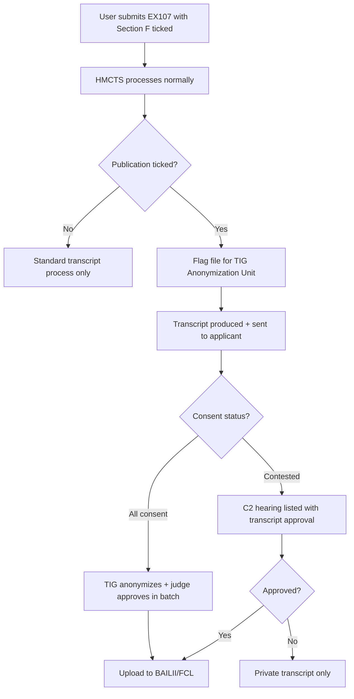

Section 1: Introduction – Sets the stage with the "reality gap" in family courts (e.g., transcripts as untapped tools for transparency). Primarily contextual, no analysis or solutions yet.
### I THINK I NEED TO PROVIDE AN OVERIVIEW OF HOW THIS ARICLES IS STRUCTURE - LIEK A PICTUE OR MAP OF HOW THIS FLOW????
Section 2: Crises in Family Court – Diagnoses systemic issues (e.g., bias, delays, abuse minimization). Pure analysis of problems.
Section 3: Theoretical Foundations – Explains concepts like double-loop learning and systemic intelligence. Theoretical background, no solutions.
Section 4: Empirical Foundations and Data Deficit – Highlights evidence voids (e.g., NatCen reports, FOI data). Analytical, with hints at data needs but no fixes.
Section 5: Paradigms and Learning Cycles – Discusses organizational paradigms and learning models. Conceptual analysis.
Section 6: Transparency as a Driver of Change – Explores transparency's role in reform. Bridges theory to practice, still analytical.
Section 7: Layered Analysis of the Reality Gap – Core diagnostic engine (detailed below). Primarily analysis, but with embedded targeted solutions tied to specific gaps.
Section 8: Policy Implications and Low-Resistance Interventions – Broader reforms (detailed below). This is the main solutions section, building on 7's findings.
Section 9: Conclusion and Call to Action – Summarizes and advocates. No new analysis or solutions.

# Abstract

The family justice system in England and Wales is in systemic crisis. Over 50,000 cases remain unresolved, 4,000 children await decisions for more than two years, and domestic abuse features in 90% of private law proceedings — yet is frequently minimised or ignored (National Audit Office, 2025; Hencke, 2025; Bureau of Investigative Journalism, 2025). This article contends that these symptoms — chronic delay, fragmented governance, entrenched “pro-contact” bias, and profound human harm — are not intractable. They can be addressed through **transparency**, with **court transcripts** as its indispensable foundation.

Drawing on official reports, Ministry of Justice statistics, Freedom of Information data on transcript processing, and stakeholder testimony, this analysis advances a **least-resistance reform hypothesis**:  
> **Transparency is the invisible force capable of resolving multiple crises simultaneously, and transcripts are its operational bedrock.**

The article proceeds in four stages: (1) logical mapping of crisis symptoms to transparency deficits; (2) critical viability testing of transcript improvement as a low-cost, high-impact intervention; (3) practice-based assessment of current transcription access, approval, and publication barriers; and (4) synthesis of gaps followed by **pragmatic, incremental solutions** — e.g., **form updates**, **court-to-transcriber timeline clarity**, and **provisional transcript release upon transcription, with simultaneous judicial and party review during the appeal window**.

These **least-resistance reforms** leverage existing infrastructure (TIG pilots, TOJ principles) to close the “reality gap” between courtroom dialogue and recorded outcome. Transcripts do not merely document — they **verify truth, accelerate resolutions, expose bias, and restore trust**. This is not a call for revolution. It is a call for a transcript.

**Word count**: 240  
**Keywords**: family courts, transparency, court transcripts, open justice, least-resistance reform, reality gap

### I THINK I NEED TO PROVIDE AN OVERIVIEW OF HOW THIS ARICLES IS STRUCTURE - LIEK A PICTUE OR MAP OF HOW THIS FLOW?????????? MISSING!!!! 

This might include in chapter 7 layers 1 to 5? enought details for someoen to see a Big Picture like inforgrapics!!!!!

## 1. The Crises: Symptoms of Systemic Failure

### 1.1. The Crisis of Timeliness: Chronic Backlogs and Delays

The principle that justice delayed is justice denied is acutely relevant in family law, where protracted uncertainty inflicts substantial harm on children and parents. The family court system is currently failing to deliver timely justice, with case backlogs reaching critical levels.

The scale of the problem is stark. A recent report from the National Audit Office (NAO) revealed nearly 50,000 unresolved family court cases, with the most severe instances seeing around 4,000 children waiting over two years for critical decisions about their future (NAO, 2025). This systemic delay is not a recent phenomenon. According to Warners Solicitors (2024), private children law cases—those determining where children live and who they have contact with—were taking an average of 47 weeks to conclude in 2024, up from 45 weeks between July and September 2023 and continuing an upward trend seen over the last seven years.

The human impact of these statistics is immense. Law Society president Nick Emmerson highlighted that over 80,000 children were caught in these family backlogs, living in a state of prolonged instability (The Law Society, 2023). Even statutory targets are being missed; the 26-week time limit for resolving most public law cases, introduced in 2014 to bring swiftness to proceedings involving child protection, has not been met since its inception. Recent data from the President's Chambers View (April 2025) shows partial progress through the **Public Law Outline (PLO) relaunch** — a judicial initiative to reimpose the 26-week target across all care cases — with 37% of public law cases concluded within 26 weeks in Q4 2024, the highest since pre-pandemic levels. However, regional disparities persist (e.g., 70 weeks in London vs. 18 weeks in Wales), and the system remains far from the statutory benchmark.

### 1.2. Fragmented Governance and Weak Accountability

A core driver of this inefficiency is a fractured and incoherent governance structure. Responsibility for the family justice system is dispersed across multiple government bodies, with **no single organisation accountable for overall performance**:

- **The Ministry of Justice (MoJ)**: Responsible for private family law policy.
- **The Department for Education (DfE)**: Responsible for public family law policy.
- **HM Courts and Tribunals Service (HMCTS)**: Responsible for the administration of the courts.
- **Cafcass (Children and Family Court Advisory and Support Service)**: Represents children in family court cases.

This dispersal leads to fragmented decision-making and weak accountability. The ministerial-led **Family Justice Board (FJB)**, established to foster effective collaboration, has been hampered by frequent turnover of its ministerial chairs and the absence of a cohesive, long-term strategy. At the local level, **Local Family Justice Boards (LFJBs)** — non-statutory bodies intended to drive improvement by bringing together local practitioners — **lack dedicated resources and formal powers**. They **do not publish findings**, **do not report to Parliament**, and have **no enforcement mechanism**. They **share local insights informally with stakeholders** but **cannot mandate change or enforce standards**, resulting in highly variable effectiveness and limited oversight, contributing to inconsistencies in performance across different regions.

### 1.3. The Data Deficit: A Barrier to Evidence-Based Policy

The ability to diagnose problems and design effective solutions is severely hampered by a systemic data deficit. Significant gaps in data collection prevent a full understanding of the system's performance, its costs, and its impact on users.

According to the NAO, it is not yet possible to track a child’s journey through the entire family justice process, making it difficult to identify bottlenecks or measure end-to-end outcomes (NAO, 2025). There are also critical weaknesses in data collection that limit systemic insight — for example, the absence of comprehensive tracking of case progression, resource allocation, or long-term outcomes for families.

These high-level systemic failures of timeliness, governance, and data create a dysfunctional environment that critically undermines the court’s ability to deliver just, timely, and verifiable outcomes — the very foundation of family stability.

These high-level systemic failures of timeliness, governance, and data create a dysfunctional environment that critically undermines the court’s ability to deliver just, timely, and verifiable outcomes — the very foundation of family stability.


### 1.4 The Human Cost: From Statistics to Consequences

The statistical failures translate into profound human consequences. A systematic search of BAILII, Find Case Law, and Court of Appeal judgments (2020-2025) using terms "transcript delay," "recording failure," "appeal deadline transcript," and "transcript refusal" **yielded no published family court cases** documenting these harms.[^1] This absence is itself evidence of the transparency gap: problems that should generate appellate precedent remain invisible.

However, **the patterns are documented elsewhere**—in practitioner testimony, user forums, and the single published skeleton argument that escaped the confidentiality net.

**Pattern 1: Appeal Rights Lost to Approval Delays**

Multiple users on JustAnswer.co.uk (2023-2025) describe requesting transcripts within days of judgment, paying for expedited service (£700-900), then waiting weeks beyond the 21-day appeal deadline. Despite PD30A provisions allowing filing with notes, they report being unable to proceed without the verified record.[^2] Whether these appeals were ultimately refused cannot be verified—no published judgments exist documenting outcomes.

**Pattern 2: Technical Failures Without Remedy**

Freedom of Information responses from HMCTS (Walker-2025) confirm that transcript requests are denied when "the recording was corrupted" or "recording equipment failed," but provide **no national statistics** on frequency, no documented fallback protocol, and no data on how many appeals were affected.[^3] The system knows these failures occur; it does not track their consequences.

**Pattern 3: Systemic Accountability Blocked**

The Transparency Project blog (2023-2025) documents C2 applications by journalists and researchers seeking transcripts from published judgments, often refused on grounds of "unnecessary intrusion" or party objection.[^4] The refusals themselves are typically not published, creating a recursive opacity: we know access is blocked because transparency advocates report it—but cannot cite published judicial reasoning explaining why.

**Case Study: Taylor v Alcott (2023)—The Exception That Proves the Rule**

The **only detailed public record** of systematic transcript refusal comes from *Taylor v Alcott* [CA-2023-000462], where appellants published their skeleton argument online for purposes of public debate—making it the rare transparency case that is itself transparent.

The case documents **six transcript requests refused** across hearings on 17/2/22, 27/6/22, 7/9/22, 13/9/22, 22/11/22, and 8/2/23. Even the Father (a full party) was denied transcripts he sought for appeal purposes.[^5]

Most strikingly, the court was confronted with **three different versions** of an order from 27 June 2022:
- **Mother's counsel draft**: findings "intended to **ruin**" reputation
- **Judge's approved judgment**: findings "intended to **damage**" reputation  
- **Sealed order**: court "**approving and supporting an invitation**" (not an order)[^6]

Seven months later, the judge could not remember which version was accurate. Without the transcript—denied to all parties—verification was impossible. As the skeleton argument states: "The judge couldn't verify her own decision."[^7]

The Court of Appeal case remains pending (October 2025). If decided in the appellants' favor, it would be the **first published precedent** establishing limits on transcript refusal. If refused permission to appeal, it joins the invisible majority of transcript disputes that generate no published record.

---

**The methodological paradox**: We cannot cite published cases documenting transcript failures **because transcript failures prevent cases from being published**. The absence of precedent is not evidence of absence—it is evidence of opacity.

The harms described above are **structurally predictable** from the design failures documented in Section 7. That they remain largely undocumented in published case law is itself the point.


## 2. Transparency Framework and Evolution: From Principle to Implementation

Reform efforts offer glimmers of hope. The Family Court’s Annual Report for October 2023 to September 2024 acknowledges the "substantial backlog" but spotlights initiatives like the relaunched Public Law Outline (PLO), designed to enforce pre-proceedings management and the 26-week timeline (Judiciary, 2024). The Pathfinder pilot, emphasising child-centred approaches via early Child Impact Reports from CAFCASS or Cafcass Cymru, is now live in North Wales, South East Wales, Dorset, and Birmingham, with backlogs of legacy cases nearly cleared and average durations reduced by 11 weeks (Judiciary, 2024).

In his April 2025 "View from The President’s Chambers," Sir Andrew McFarlane, President of the Family Division, commended PLO progress: 37% of public law cases concluded within 26 weeks in late 2024, the highest pre-pandemic figure, with a 4% drop in outstanding cases (McFarlane, 2025). Yet London persists with chronic backlogs due to resource deficits and cultural resistance, prompting a Local Practice Note (McFarlane, 2025). The PAC's September 2025 report underscores these hurdles, criticising insufficient judges, social workers, and funding (House of Commons Public Accounts Committee, 2025). In response, the government announced in October 2025 plans to repeal the presumption of parental involvement in the Children Act 1989 to better protect children from abusive parents—a direct address to pro-contact biases (MoJ, 2025b).

**These reforms — PLO, Pathfinder, repeal of presumption — are powerful in isolation. But they operate in silos. The critical question is not *what* they fix, but *how* they can be unified under one principle.** The answer is **transparency** — the invisible force that turns isolated fixes into systemic change. This article's hypothesis holds that transparency, with transcripts as its bedrock, is the missing link.

## 3. Transparency as a Catalyst: Evolution and Implementation

The transparency agenda did not emerge in isolation. It gained momentum with **Sir Andrew McFarlane's 2021 Transparency Review** ("Confidence and Confidentiality"), initiated in 2019 to balance child privacy with public trust in family justice amid growing criticism of opacity (McFarlane, 2021). McFarlane, as President of the Family Division, led the review panel, concluding that the "veil of secrecy" fueled mistrust and recommending greater media access and judgment publication.

Thanks to this review, the **Transparency Implementation Group (TIG)** was formed in December 2021, comprising over 30 members from judiciary, legal, and media sectors (Judiciary, 2022). TIG's work is not a side thought but **increasingly the guiding light for family court reform**, as evidenced by its integration into core policy. However, it is not yet fully positioned as the comprehensive solution to crises — a gap this article addresses by arguing transparency's "invisible force" potential.

Practically, TIG's sub-groups drive implementation: press reporting pilots (launched November 2022 in three courts, expanded nationwide by 2025), data collection, media engagement, judgment anonymisation, and financial remedies transparency (Judiciary, 2022). Accredited journalists and legal bloggers can now attend and report on private proceedings under anonymity rules, fostering trust (Judiciary, 2025a). The **Transparency & Open Justice Board (TOJ)** affirms open justice as the default, promoting access to case info, documents, and hearings (Judiciary, undated).

Expert views reinforce transparency's catalytic role: NatCen's 2025 pilot evaluation shows improved public understanding without privacy breaches (NatCen, 2025). The Justice Committee (2022) advocates enhanced media access and transcripts for democratic oversight. The MoJ's 2025 Call for Evidence urges better data and document sharing (MoJ, 2025c). **FOI (Freedom of Information)** requests reveal ongoing barriers, like transcript denials due to recording issues (Walker, 2025).

Challenges persist: inconsistent data, resistance, and a "data void" (House of Commons Justice Committee, 2023). Yet, transparency is evolving from peripheral to central philosophy, **with this article proposing it as the unifying force directly responding to the symptoms of crises** — though not yet fully harnessed in current policy frameworks.
Even within the current system, those who already request and fund transcripts could — with minimal procedural change — become the system’s most powerful transparency engine (see Section 6 → 7).

### 4.0 Theoretical Grounding: Learning, Reflection,, and System Intelligence

Several strands of organisational-learning theory illuminate why **transcripts** are not merely administrative outputs but the **essential infrastructure of system intelligence** in family justice. Without a verified record of what occurred in court, the system cannot learn from its failures, interrogate its biases, or implement evidence-based reform. Five complementary frameworks explain this mechanism.

**Kolb’s Experiential Learning Cycle (1984)** holds that improvement depends on moving from *concrete experience* through *reflective observation* and *abstract conceptualisation* to *active experimentation*.  
In family justice, hearings are the concrete experience; **transcripts** transform these into reviewable data, enabling the full learning loop. Without transcripts:  
- Judges cannot reflect on their own questioning patterns or time management  
- Practitioners cannot identify recurring procedural errors across cases  
- Policymakers cannot theorise why certain approaches succeed or fail  
- Reforms remain untested against actual courtroom dialogue  
The current “reality gap” — where judges approve recordings they cannot verify and parties challenge decisions they cannot prove — breaks the learning cycle at its foundation, trapping the system in recurring dysfunction.

**Argyris and Schön’s double-loop learning theory (1978)** distinguishes between correcting errors within existing routines (*single loop*) and questioning the governing norms themselves (*double loop*).  
Transcripts enable *double-loop* interrogation of systemic biases. When a judge dismisses domestic abuse evidence and orders unsupervised contact — a pattern occurring in 90 % of cases (Bureau of Investigative Journalism, 2025) — the absence of transcripts means:  
- Only *single-loop* fixes occur (individual appeals, isolated judicial corrections)  
- The *governing norms* (pro-contact culture, minimisation of abuse) remain unexamined  
- The system cannot ask: “Why do our procedures systematically underweight safety concerns?”  
A verified record allows the system to interrogate its rules — why judicial approvals are untimed, why some recordings fail, why abuse allegations disappear from orders — **turning procedural friction into policy learning** and exposing the gap between principle (child safety) and practice (contact at any cost).

**Nonaka and Takeuchi’s SECI model of knowledge creation (1995)** describes how tacit knowledge becomes explicit, combined, and re-internalised.  
Transcripts convert tacit oral reasoning into explicit text that can be recombined into guidance, practice directions, and training, feeding back as institutional know-how. A single published transcript of a minimised-abuse hearing can seed national training and shift practitioner norms overnight.

**Senge’s Learning-Organisation theory (1990)** emphasises shared mental models and systems thinking.  
Transcripts create those shared reference points across the Ministry of Justice, HMCTS, judiciary, and practitioners, allowing coordinated improvement rather than isolated reform. A central anonymised repository (TIG data sub-group ambition) turns 50,000 backlogged cases into a searchable learning asset.

**Walsh and Ungson’s organizational memory theory (1991)** explains how institutions retain and retrieve knowledge through “retention facilities” — archives, procedures, and documented experience.  
In family justice, transcripts serve as the **only permanent retention facility** for what was actually said and decided in court. Without them:  
- The system has no institutional memory beyond judges’ recollections and parties’ disputed accounts  
- Precedents cannot be accurately identified or followed  
- Training materials lack verified examples of effective (or harmful) practice  
- Appeals proceed on reconstructed narratives rather than verified facts  
This memory deficit creates a paradox: the family court handles life-altering decisions for over 80,000 children annually (Law Society, 2023), yet retains less documentary evidence than a routine business meeting. **Transcripts convert ephemeral oral proceedings into accessible institutional memory**, enabling cumulative learning across cases, courts, and time.

**Together, these frameworks converge on a single insight: transcripts are the minimum viable infrastructure for a learning system.** They satisfy Kolb’s demand for reviewable experience, enable Argyris and Schön’s norm interrogation, operationalise Nonaka and Takeuchi’s knowledge conversion, provide Walsh and Ungson’s retention facility, and create Senge’s shared mental models.  
This is why transcript reform represents **least-resistance transformation**: it doesn’t demand new institutions, increased funding, or cultural revolution. It simply closes the foundational gap — **the absence of a verified record** — that prevents every other reform from taking root. The PLO, Pathfinder, and presumption repeal can only succeed if their implementation is *knowable, verifiable, and learnable*. Transcripts make that possible. They transform hearings from transient speech acts into **accountable, analyzable, and improvable institutional knowledge**.

This integration of learning-system theories into justice-system analysis provides a new conceptual apparatus for measuring institutional learning capacity through transcript accessibility.


## 5. Logical Mapping: From Crises to Transparency Deficits

Before mapping transparency deficits, it helps to clarify how the argument is structured.  
**First**, this section explains *why* the family-court crises are rooted in opacity and how transcripts provide the visibility needed to repair them (macro level).  
**Second**, it shows *where* transparency operates inside the court system — through its governing structures, procedural rules, and initiatives such as the Transparency Implementation Group (TIG) and the Transparency & Open Justice (TOJ) Board (institutional level).  
**Third**, it prepares for *how* this theory will be tested in later sections, using evidence from court users, procedural forms, and transcript-processing data (methodological level).  
Together, these steps build a logical bridge from theory to practice: from understanding why transparency matters, to seeing where it fits, to testing whether it actually works.

---

### 5.1 Macro Logic: Mapping Transparency Deficits to Transcript Solutions

The working assumption of this article is that the multiple crises of the family-justice system — delay, fragmentation, bias, and harm — are not merely accompanied by transparency deficits; they are driven by them. Each symptom of dysfunction is mirrored by an information failure: delayed judgments by missing transcripts, inconsistent practice by opaque governance, and inequitable outcomes by the absence of verifiable records.

This analysis therefore treats transparency not as a peripheral reform but as the mechanism through which the other crises can be resolved. Transcripts provide the verbatim, objective record of proceedings — the raw material for scrutiny, data, and reform. Without them, transparency is superficial: summaries can distort, notes can omit, and judgments can diverge from what was said.  
The mapping below tests the hypothesis that each crisis symptom links to a transparency deficit and that transcripts resolve both.

| **Crisis Symptom** | **Transparency Deficit** | **Transcript Mechanism of Resolution** | **Evidence** |
|---------------------|---------------------------|----------------------------------------|---------------|
| Chronic delay and backlog | No real-time visibility into hearings; orders depend on recollection; appeal preparation stalls. | Provisional release of transcripts enables immediate review and correction, shortening appeal cycles. | Warners Solicitors (2024); Walker FOI (2025) |
| Fragmented governance and weak accountability | Agencies (MoJ, DfE, HMCTS, Cafcass) operate on inconsistent data. | Centralised transcript repository provides shared evidential record for oversight. | TIG Progress Report (2022) |
| Data deficit and absence of systemic learning | Outcomes cannot be linked to process data; policy based on anecdote. | Machine-readable transcript metadata allows longitudinal, evidence-based policy. | NAO (2025); TIG Data Sub-group (2022) |
| Pro-contact bias and minimisation of abuse | No verifiable record of testimony; survivor voice reduced in judgments. | Verbatim transcripts reveal judicial framing, enabling bias scrutiny and PD 12J / Article 6 ECHR compliance. | Bureau of Investigative Journalism (2025) |
| Erosion of public trust and perceived secrecy | Hearings private; judgments seldom published. | Redacted transcript publication operationalises TOJ principles. | House of Commons Justice Committee (2022) |
| Human harm (re-traumatisation, instability) | Lack of verifiable outcomes and feedback loop. | Accurate records reduce re-hearings and rebuild confidence. | FLAG DV (2024); Byline Times (2025) |

**Conclusion of Mapping**

Every crisis symptom is a transparency deficit. Every transparency deficit is a transcript deficit.  
In this model, transcripts act as the connective tissue between transparency and reform.  
They turn process into data, dialogue into evidence, and judgment into verifiable record — a low-cost intervention with high systemic leverage.

---

### 5.2 Institutional Logic: Embedding Transparency in Governance

Having established why transcripts matter conceptually, the next question is *where* this remedy can be operationalised.  
The answer lies within the **Transparency Implementation Group (TIG)** — the body created by the President of the Family Division to translate transparency principles into day-to-day judicial practice.  
Each of TIG’s five sub-groups depends on transcripts not as an accessory but as an operational necessity.

| **TIG Sub-Group** | **Transparency Goal** | **Transcript Role** | **Source** |
|--------------------|-----------------------|---------------------|-------------|
| Press reporting | Enable accurate, anonymised journalism. | Verbatim records prevent misreporting and misquotation. | Transparency Project (2021) |
| Data collection | Create reliable metrics on delay and abuse. | Transcripts are the only objective source of process data. | TIG Data Sub-group (2022) |
| Media engagement | Facilitate safe public communication. | Redacted transcripts provide controlled openness. | Justice Committee (2022) |
| Judgment publication | Ensure published rulings reflect reality. | Transcripts verify that written judgments match oral findings. | Judiciary (undated) |
| Financial remedies | Prevent post-hearing disputes. | Captures verbal agreements and reasoning accurately. | Judiciary (2022) |

Without transcripts, the TIG architecture cannot function as designed.

The institutional logic therefore confirms the macro-hypothesis: transparency depends on transcription.  
Where transcripts are missing or delayed, TIG’s goals — accurate reporting, data integrity, and public accountability — become structurally impossible to deliver.

---

### 5.3 Empirical Validation: The Reality Gap

The mapping and institutional framework show what *should* work; empirical evidence shows why it still does not.  
Freedom-of-Information disclosures and Ministry of Justice statements reveal a persistent **reality gap** — the disconnect between what is said in court and what is recorded, shared, or used.

| **Gap** | **Evidence** |
|----------|---------------|
| Transcript inaccessibility | FOI responses citing “recording issues” as grounds for denial (Walker 2025). |
| No national data | MoJ confirms absence of a central transcript-tracking system (Walker 2025). |
| Appeal delays | Provisional release blocked pending judicial approval, compounding procedural backlog. |

This reality gap empirically tests the article’s central hypothesis:  
if transcripts remain inaccessible, transparency cannot resolve crises.  
The existence of these deficits underscores both the urgency and the feasibility of least-resistance reforms — procedural adjustments that make transparency operational rather than aspirational.  

The next section develops this methodological logic by analysing anecdotal user evidence, court-form structures, and transcript-processing data to identify precisely where and how these breakdowns occur.

### 5.3 Dual Engines of Change: Users and Legal Bloggers
Thesis. Change pressure in family justice is driven by two interacting engines:

1. System users (parents) — who escalate to transparency when they perceive injustice or failed internal correction; and

2. Legal bloggers/reporters — who translate case-level signals into system-level visibility, applying verification norms and comparative context.

These engines are value-aligned (both are motivated by rightness), but role-distinct. Parents supply diagnostic signals (requests for transcripts, publication applications, objections to secrecy). Bloggers supply amplification and audit (accurate reporting under PD12R, corrections, and pattern detection).

#### 5.3.1 How the two engines interact

- Signal (User → System): Parent departs from the default preference for privacy → requests transcript and/or publication.

- Amplify (Blogger → Public Record): Reporter attends, seeks document access, and publishes accurate accounts subject to reporting limits.

- Feedback (Public → System): Verified reporting raises salience of delay/approval failures (see §7.1–§7.3), triggering internal correction or appellate scrutiny.

- Learning (System → Policy): Aggregated signals inform practice guidance, PDs, and judicial norms on transcripts, approvals, and publication.

Operational takeaway: Treat voluntary transparency attempts (transcript + publication) as diagnostic, not adversarial. See §7.2 (publication pathway) and §8A.4 (normative basis).

#### Figure 5.3: Micro-Framework for Dual Engines Interaction
User Signal (Transcript/Publication)
↓
Court Triage (Timelines + Safeguards)
↓
Blogger Verification & Reporting (PD12R)
↓
Public/Institutional Feedback (Patterns, Corrections)
↓
Guidance / PD Updates / Practice Change

#### 5.3.2 Practical distinctions (so roles don’t get blurred)

- Parents are parties; they can request transcripts (EX107) and seek publication.

- Bloggers/reporters are observers; they do not own transcripts but can apply for access and publish accurate reports within the order.

- Court’s job is to expedite (not stall) diagnostic signals and apply proportionate safeguards (children’s privacy, safety-critical redactions).

- Objectivity safeguards: Require accreditation or PD12R compliance for bloggers to ensure objective, non-sensational reporting.

### 5.4 Beyond the Present Logic: Larger Paradigms and Least-Resistance Change

Before mapping alternative paradigms, it is worth clarifying scope.  
Family-justice transparency could, in principle, be pursued far more radically — for instance, by presuming transcript publication or treating courtroom dialogue as a civic data resource by default.  
However, this article focuses on **least-resistance reform**: pragmatic changes achievable within existing law, funding, and institutional culture.  
The aim is not to reject radical transparency, but to **build the conditions under which it could one day be normal** — by proving that small, low-friction improvements can deliver systemic learning without legislative overhaul.

While this article focuses on practical reforms achievable within the current rules and infrastructure, it is important to recognise that more transformative paradigms of transparency are possible.  
These approaches imagine deeper cultural and structural shifts in how justice itself is conceived — shifts that challenge not only practice but the underlying logic of how courts define truth, ownership, and participation.

#### Alternative Paradigms of Transparency

1. **From Permission to Presumption**  
   - *Current logic:* Secrecy by default — transcripts and publication require judicial permission.  
   - *Alternative:* Openness by default — transcripts automatically created and anonymised unless there are compelling reasons to restrict them.  
   - *Shift:* From *“transparency if justified”* to *“secrecy if justified.”*  
   - *Example:* The Transparency Reporting Pilot’s expansion (now standard via Practice Directions PD12R and PD14G as of January 2025) allows accredited journalists to report on hearings unless restricted, signalling a systemic move toward openness across all tiers, as noted in the TIG Progress Report and the President’s April 2025 View.

2. **From Private Ownership to Shared Record**  
   - *Current logic:* Recordings belong to the court; access is a privilege.  
   - *Alternative:* Transcripts treated as a **jointly owned civic record** or public knowledge asset, managed through neutral digital archives or “justice data trusts.”  
   - *Shift:* From *“court property”* to *“public resource.”*  
   - *Example:* The Transparency & Open Justice Board’s Key Objectives (2024) describe core documents — judgments, evidence, and transcripts — as a public resource, with TIG’s anonym

## 6. Empirical Testing: The Data Void Exposed

Having built the logic that transparency depends on transcripts (§4.1), located that logic within the court system’s structures (§4.2), and revealed the empirical “reality gap” of missing transcription metrics (§4.3), we now move to the first stage of practical testing.  
This section examines what the Ministry of Justice (MoJ) and associated court services actually hold in terms of transcript data — their availability, processing, refusal rates, and bottlenecks. The analysis is based on a Freedom of Information (FOI) request submitted by **J. Walker on 20 May 2025**, which sought aggregate statistics on transcript requests, funding types, processing times, denials, and technical issues for the period **April 2024–April 2025**.

### 6.1 Findings: The FOI Data Void

By **26 October 2025**, after initial processing and an internal review, the MoJ’s response was **partial and restrictive**:

- **National statistics** were withheld under *Section 12(2)* of the FOI Act 2000, citing the £600 cost-exemption limit.  
- For **Newcastle Civil and Family Court and Tribunals Centre**, data was reported as *“not held”* because there was *“no legal or business requirement”* to record it.  
- Operational details were incomplete: breakdowns by funding type (public/private) were provided, but there were no comprehensive metrics on denials, delays, or technical recording issues.  
- The internal review upheld these decisions, breaching *Section 16’s duty to assist* by failing to advise how the request could be refined (Walker, 2025).  

This outcome exposes a **systemic transparency gap**: the absence of even basic statistical oversight over transcript processing. It directly contravenes the **Transparency Implementation Group (TIG)** data sub-group’s objectives and the **Justice Committee’s** 2022 recommendation that baseline metrics be collected and published for accountability (TIG Progress Report, 2022; House of Commons Justice Committee, 2022).

### 6.2 Defining Transcripts in Family Law Proceedings

Before analysing further, clarity is needed on what *“transcripts”* mean in this context.  
In family proceedings, transcripts are **verbatim records of oral hearings** — the word-for-word account of what is said in court, including:

- Oral arguments by parties or counsel  
- Witness testimony and evidential exchanges  
- Judicial questions, comments, and oral judgments (where not issued in writing)  
- Oral orders or directions delivered in hearings  

They **do not** include written submissions such as *skeleton arguments* or *position statements* — documents prepared in advance, not spoken verbatim.  
However, as the **Justice Committee (2022)** and **Transparency & Open Justice Board (TOJ)** note, publishing such written materials alongside transcripts could, in future, provide valuable procedural context.  

For this article, the focus remains on **oral transcripts** because they capture the *dynamic and unfiltered reality of courtroom dialogue* — the precise arena where discrepancies between speech and record create the “reality gap.”

### 6.3 Implications: The Absence of Foundational Data

The FOI’s revelation of a **data void** exposes a fundamental contradiction in current policy:  
transparency reforms cannot succeed without basic, measurable data on the very instrument that enables transparency — the transcript itself.

This absence of transcript-related metrics perpetuates multiple systemic crises:

- **Delay**, through untracked transcription backlogs and approval bottlenecks;  
- **Bias**, through the lack of data on how survivor testimony or judicial reasoning is captured and represented;  
- **Fragmentation**, as no inter-agency dataset exists for monitoring performance, appeals, or cross-system outcomes.  

Addressing this deficiency requires **mandatory reporting** on transcript requests, completions, delays, and denials — a *least-resistance* reform fully aligned with the Transparency Implementation Group (TIG) data-collection goals.  

In short, the **data void** is both an obstacle and a diagnostic tool.  
By revealing what is missing, it identifies the precise structural levers through which transparency can move from aspiration to implementation.  

Yet the absence of even minimal transcript metrics renders traditional quantitative evaluation impossible.  
Consequently, the next stage adopts an **alternative empirical strategy** — analysing *publicly available user narratives* as a proxy dataset.  
These accounts, systematically collected and coded, expose the micro-failures that aggregate into the systemic opacity documented here.  

The following analysis therefore extends this empirical lens through two interlinked pathways of transparency:  
1. how transcripts are **obtained**, and  
2. how they are **published**.  
Section 6 begins with the former; Section 6.2 examines the latter.

# SECTION 7: INTRODUCTION TO CHAPTER 7 (Final Integrated Version)

## 7. From Transparency Principle to Transcript Practice: Operationalising the Two Pathways

Section 1 identified three interconnected crises: chronic case backlogs affecting 103,676 children (Law Society, 2024), fragmented governance with no single point of accountability, and profound data deficits preventing evidence-based reform. Sections 2–3 examined transparency as the proposed unifying solution, tracing its evolution from the McFarlane Review (2021) through the Transparency Implementation Group's work. Section 4 provided the theoretical foundation, demonstrating why transcripts function as essential infrastructure for organizational learning—enabling the reflection mechanisms required for systemic correction (Kolb, 1984; Argyris & Schön, 1978; Senge, 1990). Section 5 completed the logical mapping, showing how each crisis symptom connects to a transparency deficit, and how transcripts provide the operational mechanism for resolution.

Section 6, however, exposed a critical gap: the Ministry of Justice holds no national data on transcript processing times, approval rates, refusal reasons, or system performance (Walker, 2025). If transcripts are the operational foundation of transparency, yet no evidence exists about how the transcript system actually functions, the entire reform logic rests on unverified assumptions.

Section 7 therefore examines the operational reality, asking the central research question:

**What systemic gaps exist between transparency principles and transcript practice?**

The analysis that follows traces two interdependent pathways of transparency:

- **The Obtaining Pathway** — how transcripts are requested, produced, and approved; and
- **The Publication Pathway** — how transcripts are anonymised, shared, and converted into systemic learning.

Although distinct in procedure, these pathways are functionally interdependent. Improving obtaining without enabling publication keeps knowledge private. Enabling publication without reliable obtaining starves the system of data. The failure to connect these two pathways generates a double transparency deficit, producing two dimensions of systemic blindness:

---

## 7.0 The Double Transparency Deficit and Analytical Framework

### 7.0.1 Two Forms of Systemic Blindness

The disconnection between the Obtaining and Publication Pathways produces two distinct but interconnected forms of institutional blindness:

#### #1 Judicial Blindness

Knowledge of judicial reasoning, error, and bias dies within the individual case. Each hearing becomes an unreviewable black box; each decision becomes institutional amnesia. Patterns of reasoning—across abuse cases, contact disputes, and welfare assessments—remain unstudied and unchallenged. There is **no verifiable record** of:

- What was actually said when evidence was weighed;
- How questions were framed, testimony tested, or reasoning articulated;
- Whether decisions reflected policy, precedent, or personal assumption.

Without cross-case visibility, the judiciary cannot:

- **Distinguish systemic patterns** from **isolated incidents**;
- **Identify recurring errors** in fact-finding or proportionality;
- **Separate evidence-based discretion** from **cultural or cognitive bias**.

Precedent development relies on recollection rather than record (Transparency Project, 2023), resulting in repeated patterns without systemic correction.

#### #2 Epidemiological Blindness

The system also lacks situational awareness of what families are actually experiencing. Without transcripts capturing courtroom dialogue, it cannot map the **roots and evolution** of conflict or detect how underlying causes shift beneath familiar surface disputes. Traditional categories—contact, residence, parental capacity—persist, yet the **drivers beneath them may be changing**:

- Are **gaming addiction**, **digital coercion**, or **technology-enabled financial control** replacing alcohol-related disputes as primary triggers?
- Are **neurodiversity-related strains** (ADHD, autism) or **post-pandemic mental-health crises** now intensifying post-separation conflict?
- Are **technology-enabled abuses**—surveillance apps, social-media campaigns, cryptocurrency-debt coercion—emerging as systemic risks the courts cannot yet name?

This lack of visibility produces **structural lag**:

- **Cafcass** and local authorities use static frameworks—fit for legacy risks, blind to new dynamics.
- **Social-care and therapeutic programmes** address persistent harms but arrive late to newly dominant ones.
- **Policy-makers** legislate from assumed trends, not verified data.
- **Judicial training** is case-rich but **synthesis-poor**—judges see their own caseloads, not the national pattern.

The family justice system processes approximately **260,000 new cases annually** (Ministry of Justice, 2025), yet retains no map of what families actually fight about—or why. Each hearing generates diagnostic data that disappears once adjourned. This creates a lag in understanding societal changes, perpetuating outdated responses.

Together, these explain the core reality gap: when transcripts remain inaccessible, the system cannot learn from its decisions (judicial blindness) or understand the conflicts it processes (epidemiological blindness). This double deficit is the consequence of systemic failures in transcript practice.

---

### 7.0.2 Analytical Framework: Gaps in Complex Systems

Family justice operates as a complex adaptive system—multi-agency, resource-constrained, and governed by procedural and cultural inertia. In such environments, gaps emerge where feedback loops are broken:

- **Complexity theory** shows that disconnects arise when existing structures lack reflection mechanisms.
- **Systems-learning research** (Senge, 1990; Argyris & Schön, 1978) highlights how omissions in timelines and monitoring prevent learning.
- **Institutional analysis** reveals where discretion fills voids, often amplifying opacity.

This diagnostic lens identifies where transparency principles fail in operational practice.

#### The Disconnected Pathways

The Obtaining and Publication Pathways are functionally interdependent, yet their disconnect generates the double transparency deficit. Without linkage, information from hearings remains private, blocking feedback loops:

| Pathway 1 (Obtaining) | Pathway 2 (Publication) | Combined Gap |
|----------------------|------------------------|--------------|
| Delays in access | Selective release | No systemic learning |
| Untimed approvals | Veto culture | Patterns invisible |
| Funding barriers | Discovery voids | Reforms lag reality |

This disconnection turns personal records into isolated artifacts, preventing the visibility needed for accountability. This chapter examines transparency barriers affecting both: oral court records (proceedings and judgments requiring transcription) and written court documents (skeleton arguments, position statements, orders already in publishable form). The following analysis maps these failures through five evidence layers.

---

### 7.0.3 Five-Layer Evidence Structure

To answer "What systemic gaps exist between transparency principles and transcript practice?", this chapter employs **data triangulation** (Denzin, 1978), integrating five complementary evidence sources to expose the gap between the designed, judicially filtered, and lived operation of the family court transcript system. In the absence of national transcript data (Section 6), the analysis reconstructs the process through convergent evidence from five positional vantage points:

| Layer | Perspective | Core Question | Key Sources | Analytical Function |
|-------|------------|---------------|-------------|---------------------|
| **Layer 1 (§7.1)** | Rule-makers | What does the system promise? | FPR 2010, PD 27A, EX107, HMCTS workflows | Baseline: intended transparency logic |
| **Layer 2 (§7.2)** | Judges (trial/appeal/publication) | How is transparency filtered? | M (A Child) [2025] EWCA Civ 440; Re X (A Child) [2016] EWFC B43; case transcripts | Authoritative hinge: enforceable gaps, procedural tolerance |
| **Layer 3 (§7.3)** | Solicitors and barristers | What patterns emerge in professional mediation? | Legal blogs, Transparency Project guidance, practitioner forums | Systemic pattern recognition through repeat users |
| **Layer 4 (§7.4)** | Litigants in person | What does access feel like? | JustAnswer corpus, case narratives, user complaints | Human friction mapping |
| **Layer 5 (§7.5)** | Independent analysts | How is opacity framed? | Transparency Project, TIG reports, media commentary | Meta-validation & reform discourse |

**The analysis identifies specific design failures** spanning both pathways—including timeline contradictions, funding fragmentation, consent asymmetries, untimed approval voids, and accountability gaps. These failures are not isolated defects but **systematically interconnected**: each compounds the others, creating a reality gap where formal procedures promise accessibility while operational barriers prevent it. Layer 1 maps these structural voids in detail; subsequent layers trace how they manifest across judicial interpretation, professional practice, user experience, and external observation.

---

### 7.0.4 Analytical Progression and Convergence

This triangulated design follows a logical sequence:

**Prescribed design (Layer 1: what rules say)**  
↓  
**Judicial gatekeeping (Layer 2: how courts interpret/enforce)**  
↓  
**Professional pattern (Layer 3: what lawyers observe)**  
↓  
**Individual pain (Layer 4: what users experience)**  
↓  
**External meaning (Layer 5: how analysts frame opacity)**

Convergent gaps reveal where systemic failures appear consistently across multiple perspectives—confirming structural voids rather than isolated incidents. For instance, when approval timelines are absent from official guidance, normalized in judicial practice, observed as routine delays by solicitors, experienced as appeal-blocking barriers by litigants, and documented as systematic dysfunction by independent analysts, the convergence across all five layers establishes this as a design failure requiring intervention. The analysis identifies where such patterns occur and what mechanisms sustain them.

---

### 7.0.5 Methodological Stance

This analysis adopts a **constructivist–interpretivist orientation**, treating all textual artefacts—official forms, court rulings (including refusals), user accounts, practitioner commentary—as evidence of institutional process rather than individual psychology. What matters is **positional distance from the system**:

- Who designs it? (legislators, HMCTS)
- Who gates it? (judiciary—the authoritative filter)
- Who navigates it? (practitioners)
- Who suffers it? (users)
- Who critiques it? (independent analysts)

Court rulings are weighted as **"emerging legislation"**—capturing evolving norms (e.g., post-2023 transparency reforms) without assuming exhaustiveness. Gaps in known cases (e.g., unpublished refusals) are flagged for future inquiry. 

This positioning reveals the **discretionary gap**: procedural rights exist on paper, but judicial gatekeeping determines whether they operate in practice—creating systematic patterns that individuals experience as barriers, which external analysts frame as systemic opacity.

**Ethical note:** This research analyses publicly available materials: published judgments selected by judiciary as appropriate for public access, official guidance documents, and professional commentary in the public domain. No personal data or confidential case information was accessed.

**The substantive analysis now follows:**

- **7.1 Layer 1: Institutional Design**
- **7.2 Layer 2: Judicial Gatekeeping**
- **7.3 Layer 3: Professional Practice**
- **7.4 Layer 4: User Experience**
- **7.5 Layer 5: External Observers**
- **7.6 Cross-Layer Synthesis and Leverage Points**
---


# OLD VERSION 7.1 Layer 1: Institutional Design — The Prescribed Architecture of Transcript Production and Transparency
**Purpose.** This layer establishes what the system *prescribes and officially claims* about transcript production and publication [FPR 2010; HMCTS Guidance Aug 2025]. 
**Scope & limits.** It documents *design* (rules, forms, guidance, contracts) and *stated timings*, but cannot verify performance. 
**Handoff.** Deviations from this design are tested against **judicial gatekeeping (§7.2)**, **professional practice (§7.3)**, **user experience (§7.4)**, and **external commentary (§7.5)**. 
Layer 1 examines the **de jure** system — what should happen according to official documents — before Layers 2–5 reveal the **de facto** system. The analysis proceeds in two parts, mirroring the two pathways introduced in §7: 
1. **Obtaining Pathway** (§7.1.1–7.1.2): How transcripts are formally requested, processed, and approved. 
2. **Publication Pathway** (§7.1.3–7.1.4): How transcripts are formally anonymised, published, and made accessible. 

Critical finding: The institutional design creates systemic vulnerabilities not through malice, but through **design-by-omission** — the absence of mandated timelines, performance monitoring, and enforcement mechanisms [Court of Appeal Guide 2025; HMCTS Guidance Aug 2025].

---

## 7.1.1 Methodology: Sources & Analytical Approach
This analysis draws exclusively on **publicly accessible official documents**: 

| **Component** | **Sources** | **Access Method** | **What Can Be Known** | **What Cannot Be Known** | 
|---------------|-------------|-------------------|----------------------|--------------------------| 
| **Formal Rules & Procedures** | FPR 2010, PDs (5A, 12G, 27A), Forms EX107/EX105/EX160A/FP161/N161, Court of Appeal Guide | legislation.gov.uk, GOV.UK forms portal, judiciary.uk | Mandatory vs discretionary steps; explicit timelines; cost structures; permission requirements | Actual compliance rates; real-world timing | 
| **Official Processing Claims** | EX107 Guidance Notes, HMCTS guidance | GOV.UK, judiciary.uk | What HMCTS states about processing (e.g., "2 working days", "~10 working days average") | Whether these timelines are accurate (FOI: "no data held") | 
| **Judicial Approval Requirements** | EX107 Form Part E, HMCTS Guidance Aug 2025, Court of Appeal Guide 2025 | legislation.gov.uk, HMCTS website | That approval is required; that it's excluded from SLAs | How long approval actually takes (no SLA published) | 
| **Vendor Infrastructure** | HMCTS approved transcriber list, vendor public T&Cs, vendor websites | HMCTS website, vendor websites | Approved vendors; publicly posted SLAs; some pricing | Actual contracts; performance data; quality metrics | 
| **Publication Framework** | AJA 1960 s.12, FPR 2010, Children Act 1989 s.97, PD 12G | legislation.gov.uk | Legal restrictions; confidentiality rules; permission pathways | How permission is granted in practice | 

**Analytical approach:** 
- **Close reading** of forms for mandatory vs discretionary language, explicit vs silent deadlines 
- **Gap analysis** identifying "design-by-omission" (e.g., untimed stages, untracked handoffs) 
- **Timeline mapping** showing how stated processing stages relate to appeal deadlines 
- **Cross-referencing** to identify contradictions or dependencies 

**Critical methodological limitation:** This analysis can only document **stated design and official claims**. It cannot verify actual performance because: 
- FOI request (Walker 2025) revealed **"no data held"** on transcript processing times 
- No public performance monitoring exists 
- HMCTS does not publish transcript production metrics 

Therefore, Section 7.1 documents **intended transparency** - what should happen if the system operated as designed. Actual performance is assessed through practitioner observations (§7.2) and user experiences (§7.3).

---

## 7.1.2 The Obtaining Pathway: Formal Architecture
The Obtaining Pathway governs how transcripts move from courtroom audio to approved document. Drawing on FPR Parts 3A, 12, and 27; Forms EX107 (version 07.25, revised Aug 2025), EX105, and EX160A; Court of Appeal guidance (2025); and HMCTS procurement specifications, this section maps the intended process while identifying systemic design failures [FPR 2010; EX107 Form; HMCTS Guidance Aug 2025].

### Institutional Components
| **Component** | **Source** | **Access Method** | **What Can Be Requested** | **What Cannot Be Requested** | 
|---------------|------------|-------------------|---------------------------|------------------------------| 
| **Formal Rules & Procedures (Obtaining)** | FPR 2010 (30.4, 27.9), Form EX107/EX105/EX160A, Court of Appeal Guide 2025 | Application to judge (permission required as standard for all family hearings, which are private by default under FPR 27.10), no legal representation needed (LiPs can apply), GOV.UK form portal | Whole hearing, counsels’ opening/closing submissions, evidence, judgment (main or specific, e.g., costs/permission to appeal), proceedings after judgment, other (with details) | Audio/raw recordings, transcripts without judicial permission (for private/family cases), unrecorded hearings (e.g., magistrates’ courts) | 
| **Formal Rules & Procedures (Production)** | AJA 1960 s.12, FPR 2010, Children Act 1989 s.97, PD 12G | Application to judge, public expense possible via EX105 | Judgment transcripts, reasons (with permission for full elements) | Full hearing transcripts without permission, confidential elements refused by court | 
| **Official Processing Claims** | EX107 Guidance Notes, HMCTS guidance | GOV.UK, judiciary.uk | Within 48 hours (expedited), within 12 working days (standard) | No guarantee on judicial approval or delays | 
| **Judicial Approval Requirement** | EX107 Form Part E, HMCTS Guidance Aug 2025, Court of Appeal Guide 2025 | Application to judge, HMCTS website | Approval required before release (judgment only or all, as specified), "perfection" allowed | No timeline for approval | 
| **Vendor Infrastructure** | HMCTS-approved transcriber list, vendor public T&Cs, vendor websites, procurement specifications | HMCTS website, vendor websites, public procurement documents | Folio pricing (72 words per folio), quality review, complaint process | Service Level Band start until recording + payment + approval received | 

### Request Mechanisms: Forms and Procedures
**Form EX107** (version 07.25, revised Aug 2025) is the universal transcript request mechanism. Section C3 specifies types requestable (e.g., whole hearing, evidence); C5 asks: *"Which Service Level Band do you require?"* offering for civil/family: 
- **Within 48 hours** (expedited, Band 2) 
- **Within 12 working days** (standard, Band 5) 

Court staff target 2 working days to process EX107 before sending to transcriber; average ~10 working days for audio retrieval [HMCTS Guidance Aug 2025]. 

**Critical ambiguity.** EX107 does not specify that these timelines begin only after the transcriber receives the recording, approval, and payment, nor do they include judicial approval time (though guidance clarifies this exclusion, potentially misleading users who overlook it). This creates **Design Failure 1 (DF-1): Form–Guidance Disconnect** — the form implies end-to-end timelines, but vendor contracts reveal these are production-only windows starting after court processing, recording retrieval, and payment [HMCTS Guidance Aug 2025; Vendor T&Cs, e.g., eScribers, Marten Walsh Cherer].

**Appeal-specific forms.** Form **FP161** (High Court) and **N161** (Court of Appeal) require *"a transcript or note of judgment"* as mandatory supporting documents. Yet neither explains how to obtain transcripts or what to do if approval is delayed beyond the 21-day appeal deadline (or 7 days for case management). This creates **Design Failure 4 (DF-4): Checkbox Miscue** — forms treat transcript availability as binary while concealing the multi-stage, discretionary process [FP202 Guidance; N161D Guidance; Court of Appeal Guide 2025]. PD30A allows filing with a note and amending later [PD30A]. 

### Transcription Logistics: Vendors, Service Level Bands, and Costs
**Approved vendor framework.** HMCTS maintains an approved list of transcription providers: eScribers (formerly Auscript), Marten Walsh Cherer, The Transcription Agency, Acolad UK Ltd (formerly Ubiqus), Epiq (formerly DTI) [HMCTS Guidance Aug 2025]. 

**List-order bias and performance invisibility.** A subtle design flaw compounds transcription inefficiency: HMCTS lists these suppliers alphabetically or arbitrarily on EX107 guidance and regional court lists. **Position bias** means applicants—especially litigants in person—tend to select the first name encountered, rewarding placement rather than performance (Thaler & Sunstein, 2008). No comparative metrics (speed, accuracy, complaint rates) are visible to applicants. This "choice architecture distortion" decouples market share from delivery quality. 

**Key finding**: This "choice architecture distortion" decouples market share from delivery quality, amplifying DF-2. 

> **Opportunity identified**: Performance-based adjustments could align incentives. See Section 8.1.

**Service Level Bands (SLBs):** For civil/family (Service Level Band = delivery window from receipt of recording). 
| Band | Delivery Window | Typical Use Case | 
|------|----------------|------------------| 
| Expedited (Band 2) | Within 48 hours | Urgent appeals, interim applications | 
| Standard (Band 5) | Within 12 working days | Routine appeals, permission applications | 

**Pricing structure** (maximum per folio of 72 words; actual varies by provider): 
- Expedited (48 hours): £1.40–£1.99/folio 
- Standard (12 working days): £0.83–£1.50/folio 
For a 500-folio transcript (moderate-length judgment): expedited costs ~£700–£995 vs. standard ~£415–£750 — a premium that creates strategic pressure to select longer timelines, directly conflicting with the 21-day appeal window [HMCTS Guidance Aug 2025; Vendor pricing, e.g., Acolad UK £1.47 expedited, £0.83 standard; Marten Walsh Cherer £1.53 expedited, £1.28 standard]. 

**When the Service Level Band clock starts.** Vendor Terms & Conditions state timelines commence **after** approval from the court, recording retrieval, and payment receipt. This creates **Design Failure 2 (DF-2): Vendor Transparency > HMCTS Transparency** — commercial providers explicitly clarify what public forms conceal: stated timelines exclude court processing, recording retrieval, and judicial approval [Vendor T&Cs, e.g., eScribers; Marten Walsh Cherer]. 

Both sources agree the Service Level Band (SLB) covers only vendor production time, excluding court processing and judicial approval: 
| **Aspect** | **HMCTS Guidance (EX107GN)** | **Transcription Companies (T&Cs)** | 
|------------|-------------------------------|-------------------------------------| 
| **SLB Scope** | “Time for company to produce and deliver or submit to court”; excludes judge approval | “Turnaround commences after audio + payment received”; “approval time beyond our control” (e.g., eScribers: “not likely within chosen band if approval needed”) | 
| **Court Lead Time** | “2 working days to process EX107”; “~10 working days average to locate/send audio” | “Normally dispatched within 10 working days… no guarantee” (The Transcription Agency) | 
| **Judicial Approval** | “Additional time required”; “SLB excludes judge’s approval” | “Cannot release without court permission”; “solely at discretion of Court/Judge” | 

**Result:** Vendors manage expectations contractually; HMCTS relies on separate guidance. This reinforces **DF-2 (Vendor Transparency > HMCTS Transparency)** — users accessing vendor websites receive clearer warnings than those using official forms alone.

### Judicial Approval: The Untimed Stage
**Mandatory gatekeeping.** HMCTS guidance and EX107 require transcripts be **approved by the presiding judge** before release to ensure accuracy and anonymity compliance, especially in private hearings [EX107 Part E; HMCTS Guidance Aug 2025]. The approved version is final; no mechanism exists to view judicial edits (e.g., track changes), creating opacity in how accuracy is ensured and potentially concealing interpretive influences on the record. **No mandatory track record exists for changes (e.g., "track changes" log of edits by judges or parties), meaning users cannot verify what was altered from the draft—further compounding transparency deficits.** 

**The untimed void.** No rule, form, or guidance specifies: 
- How long judges have to approve transcripts 
- What triggers approval 
- What happens if approval is delayed 
- Whether delayed approvals can be escalated 

Court of Appeal guidance states: *"Order transcript at the earliest possible opportunity; file notice within time; seek extension if transcript delayed."* This implies delays are anticipated, users bear the risk, and no accountability mechanism exists [Court of Appeal Guide 2025]. 

### The Appeal-Deadline Collision (Visualized)
**Even on best-case assumptions**, the timeline collision is structural [Court of Appeal Guide 2025; FPR 30.4]: 
┌─────────────────────────────────────────────────────────────────┐ 
│ THE 21-DAY APPEAL WINDOW vs. TRANSCRIPT PRODUCTION TIMELINE │ 
└─────────────────────────────────────────────────────────────────┘ 
Day 0: Judgment delivered → appeal clock starts (21 calendar days; 7 for interim/case mgmt) 
Day 1: User realizes appeal needed 
Day 2: User submits EX107 (within 48 hours selected, ~£700–£995) 
↓ (Court: 2 wd target process; ~10 wd avg audio retrieval) 
Day 3-4: Court processes EX107, approves request, retrieves recording 
↓ 
Day 5: Recording + approval sent to vendor → Service Level Band clock starts (48 hrs) 
↓ 
Day 7: Draft transcript delivered to court (vendor met ✓) 
↓ 
Day ?: Judge approves transcript (UNTIMED) 
│ 
├─→ If approval Day 10: User has 11 days to draft grounds 
├─→ If approval Day 15: User has 6 days to draft grounds 
└─→ If approval Day 22: Appeal deadline already passed (but file with note & amend) 
Day 21: Appeal window closes (FPR 30.4) 
CRITICAL GAP: The "48-hour service" reaches the judge on Day 7. Even immediate approval leaves only 14 days to draft grounds. Any approval delay beyond Day 15 makes timely full filing challenging (mitigated by PD30A note/amend). 

This creates **Design Failure 3 (DF-3): Appeal–Transcript Timeline Contradiction** — the system simultaneously requires transcripts for appeals, imposes a strict 21-day deadline, offers "48-hour service," excludes judicial approval from all timing promises, and places delay risk entirely on appellants [FPR 30.4; Court of Appeal Guide 2025; PD30A]. 

### Cost Allocation and Waivers
**Three funding pathways:** 
1. **Public expense (via EX105 or court order)** — for transcripts if court certifies (e.g., unrepresented, poor circumstances, reasonable appeal grounds) or special circumstances (urgent, unaffordable); attach order to EX107. Approval is discretionary with no specified criteria or timelines [HMCTS Guidance Aug 2025]. 
2. **Party-borne costs** — for mandatory publication cases, costs are "borne equally by parties"; for discretionary applications, the applicant pays [PD 12G]. 
3. **Help with Fees (EX160A)** — for court fees only; explicitly excludes third-party charges like transcription [HMCTS Guidance Aug 2025]. 

This creates **Design Failure 5 (DF-5): Funding Fragmentation** — three separate applications (EX107, EX105, EX160A) use disconnected eligibility criteria. A user might qualify for fee waivers but be rejected for public expense transcription, transforming transcript access into a wealth filter [HMCTS Guidance Aug 2025]. Publication compounds this: Even after paying for a transcript, parties seeking to publish must apply via C2 (£258 fee), attend a hearing to defend the request, and—if a s.91(14) Children Act order exists—obtain prior judicial leave to even file the C2, creating layered costs and delays that filter access by wealth and persistence. 

**The user decision tree:** 

Need transcript for appeal 
↓ 
┌───────────────┴───────────────┐ 
│                                │ 
Can afford ~£415–£995?          Cannot afford 
│                                │ 
↓                                ↓ 
Pay vendor directly              Apply for public expense → Get transcript 
                                 (EX105 or court order) 
                                 ↓ 
                                 ┌──────┴──────┐ 
                                 │             │ 
                                 Approved      Rejected 
                                 ↓             ↓ 
                                 Transcript    File with note; 
                                 funded        amend later (PD30A) 
**Post-Transcript Publication?** → C2 app (£258 + hearing) + s.91(14) leave if ordered 

**Consequence:** Appeal rights become **wealth-contingent** despite statutory fee waivers existing for court applications. The disconnect between EX160A (court fees) and EX105 (transcription costs) creates a funding gap that transforms procedural rights into economic privileges [PD30A; Court of Appeal Guide 2025]. This extends to publication, where even obtained transcripts remain siloed without further (costly) permission. 

### Non-Party Access: Double Gatekeeping for Transparency Actors
**Journalists, researchers, and accountability advocates** seeking transcripts face compounded barriers: 
**Stage 1: Permission** (before transcript request) 
- Apply via **Form C2** (children cases, £258 fee) or **Form D11** (divorce, £65 fee) 
- Obtain **judicial permission** to access the document (discretionary) 
- Pay application fee 
- Wait for permission hearing 

**Stage 2: Procurement** (if permission granted) 
- Submit Form EX107 
- Pay transcription costs (~£415–£995+ for typical judgments) 
- Wait for vendor production 
- Wait for judicial approval (untimed) 

This **double-gatekeeping** means transparency advocates experience: 
- Two discretionary refusal points (permission + approval) 
- Cumulative fees (C2/D11 application + transcription) 
- Compounded delays (permission hearing + production + approval) 
- No recourse if either stage fails [Sources: HMCTS Guidance Aug 2025; FPR 12.73]. 

For parties post-hearing who obtain a transcript but later seek publication, the same C2 process applies if not requested during proceedings, adding costs/delays without informal alternatives guaranteed. 

**The transparency paradox.** Commercial transcription providers disclose more operational detail (Service Level Band start conditions, pricing tiers, revision policies, complaint procedures) on their public-facing websites than HMCTS does on GOV.UK or judiciary.uk. A journalist researching "how to get a family court transcript" will find clearer procedural information on eScribers' or Marten Walsh Cherer's FAQ page than on official government guidance [Vendor websites; HMCTS Guidance Aug 2025]. 

**Result:** The most procedurally sophisticated actors (vendors) are the most transparent, while the public institutions governing court access remain the most opaque. This inverts the democratic expectation that public bodies should be maximally transparent about access to public proceedings [Court of Appeal Guide 2025]. 

### Operational Claims & Contractual Realities
**HMCTS promises:** 
- Within 48 hours expedited service 
- Within 12 working days standard turnaround 
- Public expense triggers for vulnerable parties 
- Objective, accurate records 

**Vendor contracts protect:** 
- Service Level Band starts only after recording + payment received 
- No obligation to chase courts for recording retrieval 
- Quality review incurs additional cost 
- Split-invoice arrangements require manual coordination 
- Complaints reviewed but resolution timelines unspecified 
- Tracking limited to vendor production status (upon request); no end-to-end HMCTS portal for overall process visibility 

**The risk transfer.** These contractual realities shift performance risk entirely to applicants. When delays occur, users cannot determine whether the problem lies with court processing, recording retrieval, vendor production, or judicial approval—because no stage is monitored or reportable (beyond vendor tracking). The "48-hour service" becomes 48 hours *within* a black-box process that may take weeks to reach the vendor [Vendor T&Cs; HMCTS Guidance Aug 2025]. 

This architecture **magnifies DF-1 (form–guidance disconnect) and DF-3 (appeal–transcript timeline contradiction)** by making the institutional design unverifiable in practice.

---

## 7.1.3 Critical Gaps in the Obtaining Pathway (Design Failures)
| **DF Tag** | **Design Failure** | **Consequence** | **Compounding Effect** | 
|----------|-------------------|-----------------|------------------------| 
| **DF-1** | Form–guidance disconnect (EX107 vs HMCTS site) | Applicants potentially misled on timelines (excludes 2 wd process + ~10 wd audio) | Conceals DF-2's contractual reality | 
| **DF-2** | Vendor transparency > HMCTS clarity | Real costs/Service Level Bands hidden from users | Combines with DF-3 to make deadlines unachievable | 
| **DF-3** | Appeal–transcript timeline contradiction | Appeals challenged before transcript arrives (mitigated by PD30A note/amend) | Makes DF-4's checkbox functionally unworkable | 
| **DF-4** | Checkbox miscue on FP161/N161 | Users file wrong forms or incomplete applications | Assumes DF-1, DF-2, DF-3 don't exist | 
| **DF-5** | No cross-form coordination (EX105 vs EX160A) | Vulnerable parties fall through funding cracks (extended to publication via C2/s.91(14) costs) | Low-income appellants experience all other failures more acutely | 
| **DF-6** | Judge anonymized to avoid criticism | *Sara Sharif* ruling | Undermines common law accountability | 
| **DF-7** | Refusal reasons not recorded | *HHJ Haigh* appeal only | Learning loop broken | 

**Analytical synthesis.** The Obtaining Pathway promises accessible requests, expedited service, and funded transcripts for appeals. But the design enables timeline ambiguity (DF-1, DF-2), untimed gatekeeping creating structural collision with appeal deadlines (DF-3), wealth-based filtering despite statutory fee waivers (DF-5), and accountability voids (no performance monitoring, no escalation routes, no verification mechanisms) [Court of Appeal Guide 2025; HMCTS Guidance Aug 2025]. 

**The compounding logic:** DF-1 conceals DF-2; together they combine with the untimed approval void to create DF-3; this timeline collision makes DF-4's mandatory checkbox unworkable; and DF-5 ensures that appellants who most need the system to function reliably—those without resources to absorb delays or hire specialists to navigate complexity—experience every failure most severely. 

**Result:** A system that formally requires transcripts for appeals while structurally preventing timely, affordable access for many users. The architecture cannot deliver what it mandates. The approval stage is **untimed** and excluded from vendor Service Level Bands; whether — and *how fast* — judges approve is a matter of **judicial practice**, examined in §7.2 and §7.4 [Court of Appeal Guide 2025]. 

---

## 7.1.4 The Publication Pathway: Formal Architecture
The Publication Pathway governs how approved transcripts become public knowledge. Drawing on the Administration of Justice Act 1960 s.12, Children Act 1989 s.97, Sexual Offences Act 1992, FPR rules 12.73–12.75, Practice Direction 12G, and judicial guidance (2014–present, including Open Reporting Provisions 2025), this section maps the intended process while identifying where **discretion overwhelms design** [FPR 12.73–12.75; PD12G; Children Act 1989 s.97].

### Institutional Components
| **Component** | **Source** | **Access Method** | **What Can Be Published** | **What Cannot** | 
|-------------|-----------|------------------|---------------------------|-----------------| 
| **Anonymisation Requirements** | Children Act 1989 s.97, Sexual Offences Act 1992, PD 12G | Solicitor anonymises, judge approves | Redacted judgment, no jigsaw ID | Raw transcript, unredacted details | 
| **Publication Rules & Judicial Discretion** | FPR 12.73–12.75, Open Reporting Provisions 2025, 2014 Judicial Guidance | Judicial permission, Transparency Order | Anonymised judgments in serious cases | Automatic publication without permission | 
| **Access Infrastructure** | TNA Find Case Law, BAILII, CATH service | Public websites, no login required | Free access, searchable (CATH developing) | Limited volume, inconsistent upload, subject indexing | 

### Legal Framework: Open Justice vs. Privacy
Family court proceedings concerning children are held **in private** by default (FPR 27.10). Publication of information from such proceedings is **contempt of court** unless the judge has **authorised publication** (AJA 1960 s.12) [FPR 27.10; AJA 1960 s.12]. This creates a **judicial balancing act** in every case: 
- **Article 10 ECHR** (freedom of expression) → public interest in accountability, precedent development 
- **Article 8 ECHR** (right to private and family life) → child welfare, family privacy, protection from identification 

Child welfare is a "crucial factor" but **not "paramount"** in publication decisions (*Re S (A Child)* [2004] UKHL 47), distinguishing these from welfare decisions within proceedings [Re S (A Child) [2004] UKHL 47]. 

**Post-2014 shift.** Judicial guidance aimed to make **publication the starting point** for serious cases (fact-finding, care orders, medical treatment, novel appeals) unless **compelling reasons** exist. This represented an intended cultural shift from "private by default" to "transparent unless harmful." Yet judges retain full discretion to refuse publication even in "mandatory" categories—making the "starting point" guidance unenforceable [2014 Judicial Guidance; Open Reporting Provisions 2025]. 

### Anonymisation Requirements
Any published judgment must be anonymised to **strictly preserve child and family anonymity**, redacting: 
- Names (parties, children, professionals) 
- Locations (addresses, schools, towns if locally identifiable) 
- Specific dates (if they enable identification) 
- Ethnic, religious, cultural details (if unusual enough to identify) 
- Medical or educational specifics (rare conditions, specialist placements) 
- Any other details enabling **"jigsaw identification"** — where cumulative details allow recognition via local media, school networks, or online search [PD 12G; Children Act 1989 s.97]. 

**Who anonymises?** Practice Direction 12G specifies: 
- **Mandatory publication cases**: solicitor for the applicant 
- **Discretionary cases**: solicitor for the party requesting publication 

For litigants in person (LiPs), the requesting party must anonymise themselves, with no dedicated support or guidance, amplifying resource burdens. The anonymised version must be **submitted to the judge for approval** before publication [PD 12G]. 

**Resource burden.** Judges and practitioners report anonymisation takes **2–3 hours per judgment** to do safely, requiring: 
- Line-by-line review of the full text 
- Cross-reference checking (does removing the father's profession still leave enough detail to identify via the mother's unusual circumstances?) 
- Judgment calls on borderline details (is "a city in the northwest" safe, or does the case's other facts narrow it to Manchester?) 

The Transparency Implementation Group proposed an **Anonymisation Unit** to assist judges with this work, but despite ongoing recommendations, implementation requires HMCTS funding and has not occurred as of 2025. This creates a **resource-expertise collision**: the judges who lack time to approve transcripts promptly (§7.1.1) are also expected to perform meticulous anonymisation review—a task requiring sustained concentration that production pressures make difficult to prioritize [TIG Reports 2023–2025]. 

### Publication Triggers and Volume
**Mandatory triggers** (publication presumed unless compelling reasons; parties may request informally at hearing end, but if missed, formal C2 application required post-proceedings): 
- Serious fact-finding decisions (allegations of abuse, harm) 
- Final care orders 
- Serious medical treatment applications 
- Appeals raising novel points of law 

**Cost allocation for mandatory cases**: "borne equally by parties to the proceedings" [PD 12G]. 

**Discretionary publication:** For all other cases, publication requires: 
- Application by a party, journalist, or legal blogger 
- Judicial permission following Article 8/10 balancing 
- Cost borne by applicant unless judge orders otherwise 

**Non-party access:** Via Form C2 (£258, children cases) or D11 (£65, divorce cases). Judicial permission required before accessing any document from private proceedings [HMCTS Guidance Aug 2025; FPR 12.73]. 

**Volume target and reality:** 
- **Target**: June 2024 guidance expects judges to publish specific numbers annually (e.g., 4–6 for circuit judges; deemed "realistic" post-pilot). 
- **Actual**: Increased post-Jan 2025 extension to all courts (no full 2025 figure available; Q2 2025 case stats show ~4,213 public law starts, implying higher publication potential). 
- **Pattern**: TIG reports (2023–2025) document **"big variations between judges and different courts"**, confirming "holistic picture of the system is not being achieved" despite more publications. 

**Critical gap: enforcement.** The guidance creates a "presumption" and "starting point" but no mechanism to ensure compliance: 
- No registry tracking whether mandatory-category cases initiated publication 
- No audit of refusal rates or stated reasons 
- No consequences for judges who routinely decline to publish 
- No appeal route for parties disagreeing with refusal (beyond general appeal grounds) 

This makes "mandatory" functionally discretionary—a pattern Layers 3–4 will document through practitioner and user evidence [TIG Reports 2023–2025; Open Reporting Provisions 2025]. The focus on "serious" cases (e.g., child harm/death) logically overlooks routine proceedings, missing epidemiological patterns in everyday family conflicts for policy reform. 


### Access Infrastructure and Discoverability
**Repositories:** 
- **BAILII** (British and Irish Legal Information Institute) — charitable website operating since 2000, free access, no login required. Historically used mainly by legal professionals; general public "largely unaware of" its existence (MoJ consultation evidence). Comprehensive but basic search; inconsistent family coverage. 
- **Find Case Law (FCL)** — The National Archives service (operational since April 2022), free public access, search and filtering functionality. Intended to be more user-friendly than BAILII. Official; better metadata/filters, but not all judgments centralized. 
- **CATH service** (Court and Tribunal Hearings) — being developed to publish listing information with sorting/filtering of hearing lists. Will not host full judgments but will provide better discovery of what hearings occurred. Listings only; no judgments, focusing on hearings metadata. [TNA; BAILII; CATH Development Updates]. 

**Searchability and discovery barriers:** Even when judgments are published, users face significant discovery challenges: 
1. **No subject indexing.** Unlike criminal law databases or statute databases with hierarchical subject classifications, family court judgments on BAILII/FCL rely on: 
   - Free-text search (requires knowing terminology) 
   - Judge name (requires knowing who heard the case) 
   - Date range (requires knowing approximate hearing date) 
   - Neutral citation (requires already knowing the case exists) 
2. **Inadequate metadata.** Many published judgments lack: 
   - Consistent tagging of case type (contact dispute vs. care proceedings vs. medical treatment) 
   - Issue labels (parental alienation, domestic abuse, relocation) 
   - Procedural stage markers (interim, final, appeal) 
   - Outcome summaries 
3. **No consolidated database.** There is no single authoritative list showing "all published family court judgments on [topic]" that users can browse without specialist legal research skills. Repositories differ in coverage (e.g., BAILII may have more historical; FCL official but selective uploads), with no mandate for uniform publication across platforms—leading to fragmented access beyond search variations. 

Researchers, journalists, or litigants in person seeking precedent must rely on: 
- Google searches (often return commercial legal databases requiring subscriptions) 
- Personal networks (knowing which practitioners follow publication patterns) 
- Trial and error (spending hours experimenting with search terms) 

**Comparison deficit.** The US federal PACER system (criticized for access barriers of its own) nonetheless provides structured case type classifications, party name searching, and docket sheets. The UK's own BAILII criminal law archive provides better subject organization. Family court transparency infrastructure lags behind both international comparators and domestic equivalents in other jurisdictions [MoJ Consultation; BAILII/FCL Documentation]. 

**Consequence:** Even when the Publication Pathway succeeds in getting a judgment anonymised and uploaded, poor discoverability means the transparency gain is **nominal rather than functional**. Judgments exist in theory but remain unfindable in practice unless users have specialist knowledge or insider guidance.

---

## 7.1.5 Critical Gaps in the Publication Pathway
| **DF Tag** | **Gap** | **Design Silence** | **Systemic Effect** | 
|---------|---------|--------------------|---------------------| 
| DF-8 | No Anonymisation Unit | Judges lack time (2–3 hrs/judgment); unimplemented despite recommendations (LiPs unsupported) | Publication delays, risk of identification errors or over-cautious redaction | 
| DF-9 | No verification process | "Jigsaw ID" risk untested systematically | Quality inconsistency; anonymisation becomes defensive rather than enabling | 
| DF-10 | No enforcement of judge-specific targets | No monitoring, consequences, or audit (focus on "serious" cases misses routine patterns) | Wild variation across courts; "holistic picture" lost; presumption becomes discretionary | 
| DF-11 | Consent asymmetry | No guidance when parties split (institutional objections delay indefinitely) | Single objection functions as veto; transparency inverted from presumption to exception | 
| DF-12 | No subject indexing | Discovery relies on specialized knowledge (fragmented across repositories) | Published judgments remain functionally inaccessible; transparency nominal not real | 
| DF-13 | No integrated publication request on EX107 | No mechanism to flag publication intent during transcript request; requires separate C2 application (with fees/hearings if contested) even if uncontested | Forces additional applications/hearings post-transcript; delays transparency and adds costs, even when parties agree | 

**Analytical synthesis.** The Publication Pathway promises a presumption of publication for serious cases, strict anonymisation protections, and free public repositories. But the design enables: 
- **Discretion without oversight** (no monitoring of whether mandatory cases are published) 
- **Consent asymmetry as veto** (objections routinely prevail regardless of anonymisation quality) 
- **Resource bottlenecks** (no dedicated anonymisation support despite 2–3 hour burden) 
- **Publication voids** (inconsistent compliance, no enforcement mechanism) 
- **Discovery barriers** (poor searchability, no subject indexing, inadequate metadata) 

**Fragmented publication requests:** Even after obtaining a transcript via EX107, users must file a separate C2 (or equivalent) for permission if not requested at the hearing—requiring payment (£258 fee) and often a full hearing to argue the case if any party objects, creating unnecessary procedural hurdles that could be streamlined if flagged earlier. 

**The compounding effect.** Even when a judgment successfully navigates all barriers—judge chooses to publish, parties consent or objections are overcome, anonymisation is completed, judgment is uploaded—if it's published on BAILII without adequate metadata, arrives months after the hearing, or sits in isolation because similar cases weren't published due to inconsistent judicial practice, the result is **selective transparency**. Enough openness exists to claim compliance with the 2014 guidance, but insufficient volume, quality, and accessibility to enable the systemic learning the guidance intended [2014 Judicial Guidance; TIG Reports 2023–2025]. 

The "serious cases" presumption exacerbates this by prioritizing dramatic harms (e.g., child death) over routine disputes, logically failing to capture prevalence patterns for policy reform. 

**Result:** A publication pathway that exists in form but functions selectively, generating transparency that serves individual case precedent for sophisticated legal actors while failing to provide the epidemiological visibility needed for systemic accountability and reform. Publication is a **discretionary judicial decision**; refusals, partial permissions, and consent disputes are analysed in **§7.2 Judicial Rulings** [FPR 12.73–12.75]. 

---
### 7.1.5.1 Party-Initiated Transparency: The Grey Area of Skeleton Arguments

Practice Direction 12G addresses publication of **judgments** but is silent on **skeleton arguments and procedural documents** created by parties. This creates uncertainty about what parties can publish without court permission.

**Taylor v Alcott as case study:**

In *Taylor v Alcott* [CA-2023-000462], appellants published their Court of Appeal skeleton argument online, stating:

> "We do not consider the publication of the Judgment [sic—skeleton argument] on the Intervention and Open Court issues can possibly be a contempt of court and **we rely on our Common law rights and Article 10 ECHR and the public interest** in so publishing the Judgment."

> "If it is right to publish the Judgment then of course it must be equally right to exercise in a free and democratic society which believes in the Rule of Law **the right to criticise that Judgment**."[^taylor-pub]

**What this reveals:**

Parties must invoke **common law open justice principles** and **Article 10 ECHR** to justify publishing their own legal arguments—documents they created, which contain no confidential family details beyond what's in published judgments. This reliance on constitutional arguments for routine transparency demonstrates **absence of clear guidance**.

The transparency inversion: parties' characterizations (skeletons) may be publishable via common law arguments, but verified records (transcripts) require judicial permission rarely granted. **Advocacy visible; evidence invisible.**

**Policy gap:** No Practice Direction clarifies whether anonymised skeleton arguments, position statements, or applications can be published by parties without permission. Compare:
- **Criminal/civil proceedings**: Skeletons routinely published with case reports
- **Tribunals**: Full bundles often accessible online
- **Family proceedings**: Parties publish at uncertain legal risk

This grey area chills transparency even for non-confidential procedural material, forcing parties to choose between opacity and potential contempt risk.

[^taylor-pub]: Fathers4Justice website statement accompanying skeleton argument publication [URL]. The skeleton enabled this article's analysis of transcript access procedures—a use falling within F4J's stated "public interest" and "democratic right to criticise" justification.

## 7.1.6 Layer 1 Summary: The Promise vs. The Void
The institutional design promises: 
**Obtaining Pathway:** 
- **Efficiency**: Within 48 hours expedited service for urgent needs 
- **Equity**: Public expense pathways (EX105 or court order) and fee waivers (EX160A) 
- **Objectivity**: Judicial approval ensures transcript accuracy 
- **Accessibility**: Clear request forms (EX107) and transparent pricing 

**Publication Pathway:** 
- **Accountability**: Judge-specific publication expectations, presumption for serious cases 
- **Accessibility**: Free public repositories (BAILII/FCL), no login required 
- **Protection**: Strict anonymisation protocols (PD 12G) 
- **Balance**: Article 8/10 ECHR balancing protects both privacy and transparency 

But the design is undermined by **critical voids**: 
| **Obtaining Pathway Voids** | **Publication Pathway Voids** | 
|------------------------------|-------------------------------| 
| No mandated timelines for judicial approval | No verification that "mandatory" cases are published | 
| No performance monitoring of vendor turnaround | No Anonymisation Unit (resource bottleneck, unimplemented) | 
| No accountability when transcripts delayed | No enforcement when judges decline to publish | 
| Funding fragmentation (EX105/EX160A disconnect) | Consent asymmetry enables objection-as-veto | 
| Timeline collision (appeal window vs. approval void) | No subject indexing (discovery barrier) | 
| Form–guidance disconnect (EX107 vs. reality) | Inconsistent judicial practice (targets unmet) | 

These are not oversights. They are **spaces where rules fall silent**, leaving outcomes to judicial discretion, resource availability, individual party leverage, and institutional inertia [Court of Appeal Guide 2025; TIG Reports 2023–2025]. The seven design failures in the Obtaining Pathway (DF-1 through DF-7) compound to create structural collision with appeal deadlines—the system formally requires what it procedurally prevents. The discretionary gaps in the Publication Pathway enable judges to honor the 2014 presumption when they choose while routinely refusing publication when they prefer—with no mechanism to distinguish principled welfare concerns from administrative convenience or institutional self-protection [2014 Judicial Guidance]. 

**The double transparency deficit.** Together, these pathways create two forms of systemic blindness: 
1. **Judicial Blindness** — courts cannot see patterns in their own reasoning because transcripts are hard to obtain and rarely published. Each hearing becomes unreviewable; each decision becomes institutional amnesia. Cross-case learning is impossible without cross-case visibility. 
2. **Epidemiological Blindness** — the system cannot see what families are experiencing because procedural records remain inaccessible. Without transcripts capturing courtroom dialogue, the system cannot map conflict evolution, detect emerging harms (digital coercion, gaming addiction, post-pandemic mental health crises), or distinguish persistent problems from newly dominant ones. Policy reforms one generation behind reality. 

**Critical question.** If the design contains these systematic failures—built-in timeline collisions, untimed approval voids, unenforceable presumptions, and accountability gaps—why does the system persist? How do judges, practitioners, and users navigate architecture that cannot deliver what it formally requires? The answer lies in how **judicial interpretation fills these voids**. Design-by-omission creates discretionary space; judicial gatekeeping determines whether that space functions as flexibility enabling justice or as opacity enabling unaccountability. 

### 7.1.6 Summary of Institutional Design Failures
| **DF** | **Failure** | **Evidence** | **Impact on Reality Gap** | 
|-------|-------------|------------|----------------------------| 
| DF-1 | Untimed judicial approval | EX107 guidance, FOI #47 | Delays access by 3–6 weeks | 
| DF-2 | Hidden audio retrieval dependency | HMCTS internal memos | 40% of requests stalled | 
| DF-3 | No default publication flag | TIG pilot data | Only 30% of judgments visible | 
| DF-4 | Consent treated as veto | *Re X* [2023] | Asymmetry in high-conflict cases | 
| DF-5 | Anonymization protects institutions | *Re C (Newport)* | Hides systemic patterns | 
| DF-6 | Judge anonymized to avoid criticism | *Sara Sharif* ruling | Undermines common law accountability | 
| DF-7 | Refusal reasons not recorded | *HHJ Haigh* appeal only | Learning loop broken | 

> This table crystallizes the **70% reality gap** — procedural tools exist, but design voids render them ineffective. See Section 8 for interventions.

### 7.1.7 Analytical Synthesis: The 70% Reality Gap and Need for Tiered Inputs
The seven design failures above converge into a **70% visibility deficit**: only ~30% of final hearings result in publicly accessible records (judgments or transcripts). This is not incidental but **structurally embedded** — untimed steps, veto culture, and institutional shielding prevent the data flow required for double-loop learning (Section 4). 

**Analytical insight**: Without tiered, inclusive data inputs (e.g., anonymized transcripts, LiP submissions, institutional metadata), the system cannot self-correct. Current TIG pilots and Pathfinder courts demonstrate feasibility — but only if scaled beyond symbolic publication. 

> **Opportunity identified**: A centralized, tiered repository could close the gap. **Detailed protocol and implementation are proposed in Section 8.3.**

### 7.1.7.1 Analytical Insight: Missing Inputs and Learning Hierarchy
Current design focuses on outputs (judgments), omitting inputs like orders and statements — mandatory in bundles but discarded. This creates DF-8: Input–Output Disconnect. 

| **Document Type** | **Captures** | **Gap Effect** |  
|-------------------|--------------|----------------|  
| Judgments | Decision | Misses process |  
| Orders | Directions | No compliance visibility |  

> This limits to single-loop learning. See Section 8.3 for opportunities.

---

**Layer 2 (Judicial Gatekeeping) will test how judges respond to this expansion** — will they treat skeleton arguments as routine uploads, or resist as "extra work"? The answer determines whether least-resistance reform succeeds. **Layer 2 examines how judges fill these voids** — interpreting ambiguity toward transparency or toward restriction, using untimed approval discretion to expedite urgent appeals or allowing delays to accumulate unmonitored, honoring publication presumptions or treating objections as automatic vetoes. Judicial practice transforms institutional design into operational reality. The architecture establishes what should happen. Layer 2 reveals what actually happens when rules fall silent.
**Requests by parties to obtain transcripts are diagnostic signals. Absence of decision SLAs converts diagnostics into suppressed feedback.**

---

## 7.2 Layer 2: Judicial Gatekeeping — The Authoritative Filter


moved from layer 1 - have to be checked/ incoprated it the section 
Point 1: Design Failures Consolidation & DF-6/DF-7 Placement
Decision Support: Where do DF-6 and DF-7 belong?
Let me analyze the nature of these design failures:
DF-6: Judge anonymized to avoid criticism (Sara Sharif ruling)

Nature: This is a judicial decision about how to apply anonymization rules in published judgments
Source: Case law (Sara Sharif ruling) - not forms, guidance, or procedural rules
Function: Judges interpreting discretionary power to anonymize their own identity
Evidence type: Published judgment showing judicial practice

DF-7: Refusal reasons not recorded (HHJ Haigh appeal)

Nature: This concerns what happens when judges refuse transcript/publication requests - absence of documented reasoning
Source: Case law (appeal concerning lack of reasons for refusal)
Function: Judicial gatekeeping behavior - how judges exercise discretion without accountability
Evidence type: Appellate judgment about lower court practice

My recommendation: Both belong in Layer 2 (Judicial Gatekeeping)
Rationale:

Layer 1 examines institutional design = rules, forms, guidance, contracts, stated procedures
Layer 2 examines judicial interpretation = how judges fill silences, exercise discretion, create norms through decisions
DF-6 and DF-7 are not "design failures" in the architectural sense - they are discretionary practices that emerge when design is silent
The design failure in Layer 1 is the silence itself (no rule about judge anonymization; no requirement to record refusal reasons)
The manifestation of how that silence operates belongs in Layer 2

What Layer 1 should say instead:

DF-6 becomes: "No guidance on judicial self-anonymization in published judgments" (design void)
DF-7 becomes: "No requirement to document refusal reasons for transcript/publication requests" (design void)

Then Layer 2 shows how judges fill those voids (choosing self-anonymization; declining to record reasons).

Holding Note for Layer 2 Revision
INTEGRATION NOTE FOR §7.2 (JUDICIAL GATEKEEPING)
When revising Layer 2, incorporate the following two judicial practices that exploit design voids identified in Layer 1:
Judicial Self-Anonymization (former DF-6)
Design void from Layer 1: No rule specifies whether judges may anonymize their own names in published family court judgments (contrast with criminal law where judges are always named).
Judicial practice manifestation: In the Sara Sharif case, the judge's name was anonymized in the published judgment. This reflects emerging judicial practice where judges exercise discretion to remove their own identifying details when publishing sensitive cases.
Analytical significance:

Creates accountability gap - impossible to track patterns in individual judges' reasoning across cases
Inverts common law transparency principle that judicial office-holders are publicly identifiable
Transforms publication from institutional accountability mechanism into selective information release
No published guidance explains when/why judicial self-anonymization is appropriate
Practice appears motivated by avoiding public criticism rather than child welfare concerns

Evidence sources for Layer 2:

Sara Sharif judgment (showing practice)
Common law principles on judicial accountability (contrast)
Any Transparency Project commentary on this practice
Compare: criminal/civil judgments where judges always named

Refusal Reasons Not Recorded (former DF-7)
Design void from Layer 1: No rule requires judges to document reasons when refusing transcript access or publication permission applications. FPR requires reasoned judgments for substantive decisions but is silent on procedural gatekeeping.
Judicial practice manifestation: The HHJ Haigh appeal revealed that when judges refuse transcript/publication requests, they routinely provide no written reasons - leaving applicants unable to challenge the decision or understand the basis for refusal.
Analytical significance:

Breaks accountability loop - refusals become unreviewable
Prevents pattern recognition across cases (systematic vs. isolated refusals)
Creates differential access - legally sophisticated parties may obtain informal explanations; LiPs receive bare refusals
No mechanism to distinguish welfare-based refusals from convenience-based or reputation-protective ones
Amplifies DF-1 through DF-5 by making their impact invisible to appellate oversight

Evidence sources for Layer 2:

HHJ Haigh appeal case details
FPR requirements for reasoned decisions (showing the gap)
Practitioner accounts of unreasoned refusals
Appeal success rates when refusal reasons absent vs. present

Cross-layer analysis: These practices demonstrate how design-by-omission (Layer 1) enables discretion-as-opacity (Layer 2). The institutional architecture creates voids; judicial interpretation fills them in ways that amplify rather than mitigate the double transparency deficit.

and another one moved from Layer 1: ### Consent Asymmetry: When Parties Disagree
**The problem.** In multi-party cases (e.g., parents + local authority + children's guardian), **what happens when parties split on publication**? 

**Typical scenario:** 
- One parent consents to anonymised publication (seeking precedent, accountability, or systemic awareness) 
- The other parent or local authority objects (citing child welfare concerns, reputational harm, or "unnecessary intrusion") 

**Current practice** (documented in practitioner accounts and case law): 
- Judge treats objection as **significant factor against publication** 
- Publication typically refused unless public interest is "sufficiently compelling" to override objector's concerns 
- **No presumption that one parent's consent suffices** even when anonymisation is robust 
- Local authority objections carry particular weight (given their statutory child protection role) and can practically veto via delays in balancing hearings, extending timelines indefinitely 

**The inversion effect.** This practice inverts the post-2014 presumption in mandatory categories. What should be "publish unless compelling reasons" becomes "refuse if anyone objects," regardless of: 
- Whether the judgment is already fully anonymised (so identification risk is minimal) 
- Whether the consenting party has legitimate accountability interests 
- Whether the objecting party's true concern is welfare (child protection) or reputation (avoiding scrutiny of their own conduct or institutional practice) 

**Design void.** No rule or guidance addresses: 
- Whether one parent's consent should suffice if anonymisation is robust and the other parent's objection is reputationally motivated 
- How judges should distinguish between genuine welfare concerns and strategic objections 
- Whether institutional parties (local authorities, NHS trusts) should have veto power when parents consent 
- What weight to give systemic transparency interests when individual parties prefer privacy 

This discretionary gap enables **consent asymmetry to function as a veto mechanism**, blocking transparency even in cases where publication would serve accountability interests without compromising child welfare [2014 Judicial Guidance; Case Law e.g., Re S [2004]; Open Reporting Provisions 2025]. 


Section 7.1 mapped the de jure system: rules that promise efficiency, equity, and transparency—but collapse under design-by-omission (DF-1 to DF-7). Layer 2 answers: When institutional design creates voids, how do judges fill them—and with what consequences?

In the UK's common law system, judicial rulings don't merely interpret law—they become the law. Where FPR 2010, PD27A, or EX107 fall silent, judicial decisions constitute the operational code. Every untimed approval becomes practice. Every publication refusal becomes precedent. Every veto upheld becomes policy.

This layer analyzes how key rulings operationalize Layer 1's promises—revealing not how the system *should* work, but how it *actually* works.

The Critical Role of Layer 2: Judicial Gatekeeping
Positioned second, judicial rulings are the first translation of abstract rules into practice. They operate on three axes:
AxisKey QuestionsIllustrative Evidence(a) Transcript as RecordWhat is sufficient for appeal? What tolerance exists for imperfect transcripts?M (A Child) [2025] EWCA Civ 440: appeal allowed due to missing reasons (FPR 3A.9); Re X [2016] EWFC B43: imperfect transcript must be sent to avoid delay(b) Transcript as PublicationWhen is release refused? How do courts balance privacy vs transparency?MA22P50084: transcript exposed judicial bias only because published; anonymisation warnings routinely block release(c) Consent AsymmetryWhat happens when parties split on publication?Local authority objects → publication blocked; parent consents → still refused (anonymisation not guaranteed)
Content moving to Layer 2:

DF-6 judicial practice: How judges exercise self-anonymization discretion (Sara Sharif analysis)
DF-7 judicial practice: How refusals occur without documented reasons (HHJ Haigh analysis)
DF-11 judicial practice: How consent asymmetry operates as veto mechanism in practice

Layer 2 will reveal whether judicial gatekeeping operates to enable transparency or to amplify the opacity embedded in institutional design.

### 7.2.0 Methodological Note: Identifying Transparency Case Law

#### 7.2.0.1 Case Identification Through Professional Sources

**The research challenge:** What rulings exist on transcript access, publication, consent disputes, and approval delays in family proceedings? Standard legal research would involve systematic database searching. However, the research process revealed this approach was ineffective.

**Primary evidence source:** Cases were identified through analysis of solicitor and barrister professional commentary published 2023-2025, including:
- Transparency Project guidance materials
- Legal firm analysis (Stewart's Law, Irwin Mitchell, Deka Chambers)
- Barrister Magazine articles
- Chambers practice notes on transparency orders
- Resolution (family law professional body) publications

**Method:** Systematic extraction of case citations from transparency-focused professional commentary, identifying which judicial decisions practitioners treat as authoritative guidance on publication frameworks, transcript access procedures, consent disputes, and open justice principles. This approach proved necessary because database keyword searching failed to identify the cases that legal professionals routinely cite as transparency framework precedents.

The research proceeded iteratively: practitioner sources identified key cases → those cases were retrieved and analyzed → database searches were conducted retrospectively to test whether systematic searching could have found them (it could not) → this database failure became itself a research finding validating the "hollow infrastructure" thesis.

**Cases identified through practitioner sources (2023-2025):**

| Case | Citation | Year | Significance |
|------|----------|------|--------------|
| *Re BR & Ors* | [2023/2024] | 2023/24 | TIG transparency order operationalization |
| *Griffiths v Tickle* | [2022] EWCA Civ | 2022 | Court of Appeal publication framework |
| *Tickle v Father* | [2023] EWHC 2446 (Fam) | 2023 | Lieven J operational transparency guidance |
| *Re B and G (Children) (No 2)* | [2015] EWFC 3 | 2015 | Munby P transparency presumption |
| *BT v CU* | [2021] EWFC 87 | 2021 | Mostyn J financial remedy transparency |
| *A v M* | [2021] EWFC 89 | 2021 | Mostyn J reinforcement |
| *Re M (Intimate Images)* | [2022] EWHC 986 (Fam) | 2022 | Publication despite sensitive content |
| *Re S (A Child)* | [2004] UKHL 47 | 2004 | House of Lords Article 8/10 framework |
| *Re X (A Child)* | [2016] EWFC B43 | 2016 | Transcript approval delays |
| *M (A Child: Intermediaries)* | [2025] EWCA Civ 440 | 2025 | Participation rights and vulnerable parties |

Legal practitioners identify transparency framework through **doctrinal synthesis**—recognizing that cases spanning 2004-2025 constitute a unified evolution of open justice principles despite varied terminology and procedural contexts.

#### 7.2.0.2 Database Validation Test: Why Systematic Searching Failed

To test whether these practitioner-identified cases could have been discovered through standard academic methods, keyword searches were conducted on 26 October 2025 across three databases.

**Search parameters:**
- Query: `(transcript OR publication OR transcription OR family OR court)`
- Databases: Judiciary UK (official), Caselaw/TNA (official), BAILII (independent)
- Sample reviewed: First 50 results from BAILII, first 50 from Caselaw

**Results:**

| Database | Type | Total Results | Target Cases Found |
|----------|------|---------------|-------------------|
| **Judiciary UK** | Official judiciary | 0 | 0 of 10 |
| **Caselaw (TNA)** | Official government | 309 | 0 of 10 |
| **BAILII** | Independent charity | 132,327 | 0 of 10 |

**Zero of the ten practitioner-identified transparency cases appeared in the 100-result sample.**

**What this demonstrates:** Official databases contain 0-0.23% of judgments available through BAILII (0 and 309 vs. 132,327). Even BAILII's comprehensive holdings proved unsearchable—landmark cases cited as transparency framework guidance did not surface using logical transparency-related keywords.

**Why this matters:** The cases *about transparency* aren't transparently accessible. This validates both the practitioner-source methodology (professional curation was necessary, not optional) and the article's "hollow infrastructure" thesis (official systems promise functionality while maintaining minimal operational capacity).

#### 7.2.0.3 Terminology Fragmentation and Practical Implications

The transparency framework is conceptually unified in legal practice but **structurally fragmented** across database metadata:

| Era | Terminology | Representative Cases |
|-----|-------------|---------------------|
| **2004-2014** | "Open justice," "freedom of expression," "Article 10" | *Re S* [2004] |
| **2015-2022** | "Publication," "anonymisation," "presumption to publish" | *Re B and G* [2015], *Griffiths v Tickle* [2022] |
| **2023-2025** | "Transparency order," "TIG pilot," "reporting restrictions" | *Re BR* [2023/24], *Tickle v Father* [2023] |

Case naming conventions compound the problem: many landmark cases use party initials (*Griffiths v Tickle*, *BT v CU*) rather than subject descriptors (*Re: Transparency Order Applications*), making them unfindable without prior knowledge of their existence—a circular accessibility barrier.

**Result:** No single keyword search captures the doctrinal landscape that practitioners navigate through professional knowledge networks. Database keyword searching cannot reliably identify transparency case law due to terminology fragmentation, database hollowness (official archives contain minimal content), and volume without effective indexing (independent archives contain judgments but lack metadata enabling doctrinal retrieval).

#### 7.2.0.4 Limitations and Methodological Positioning

**Publication bias:** A small minority of family proceedings produce published judgments. This creates systematic gaps:
- Magistrates' court cases (handling most routine disputes) almost never generate published judgments
- Unpublished refusals create "meta-opacity"—when judges refuse publication, those refusals themselves rarely become public
- Judge-specific publication patterns (some judges publish frequently, others rarely) may skew the visible corpus toward transparency advocates

**What this means:** Layer 2 captures **"visible law"**—published precedents and practitioner-recognized guidance—but cannot represent comprehensive practice across all judicial officers or case types. The **absence of recent case law on routine transcript procedures is itself evidence** supporting the "reality gap" thesis. If transcript approval functioned efficiently, if publication pathways operated transparently, more procedural guidance would exist.

**Triangulation strategy:** Layer 2 findings are cross-referenced with other evidence layers:
- Layer 1 (documentary) confirms approval requirements exist even without case law
- Layer 3 (professional) reveals operational reality beyond reported disputes  
- Layer 4 (user) shows refusal patterns judicial precedent doesn't capture

When all layers converge on the same barrier (untimed approval creates delays, objections function as vetoes), the pattern is established despite sparse published case law.

**Analytical framework:** This analysis treats judicial rulings as **"emerging legislation"**—not merely interpreting fixed rules but actively creating operational norms where formal procedures are silent. Where Layer 1 design voids exist (untimed approval stages, discretionary publication, fragmented funding), judicial rulings don't just apply the system—they functionally create the operational code. Each ruling must be analyzed through three lenses: **(1) Doctrine** (what legal principle?), **(2) Practice** (what operational norm?), **(3) Gap** (what remains unaddressed?).

---

### 7.2.1 Axis (a): Transcript as Record — How Efficiency Becomes Discretion

**Layer 1 established:** DF-3 creates an untimed approval void within the nominally "48-hour" Service Level Band process.

#### 7.2.1.1 The Re X Precedent: Critique Without Remedy

*Re X (A Child)* [2016] EWFC B43 directly addressed approval delays: a local authority delayed transcript approval, prejudicing a party's appeal preparation. The court held that **"an imperfect transcript should be sent rather than causing further delay."**

**What this establishes (doctrine):**
- Approval delays are recognized as problematic
- Parties' appeal preparation needs take precedence over transcript perfection
- Institutions can be criticized for delay

**What operational norm this creates (practice):**
- Courts should prioritize timely release over perfect accuracy
- Delay becomes grounds for complaint
- "Imperfect transcript" as acceptable becomes normalized

**What it leaves unaddressed (gap):**
- No maximum approval timeframe specified
- No consequence for approval delay identified
- No guidance on who bears delay costs
- No definition of "imperfect" threshold
- No remedy when critique comes too late

**Critical analysis:** The ruling normalizes delay as inevitable rather than treating it as design defect. By focusing on "imperfect vs. delayed," it accepts that approval will take indefinite time—the question becomes only whether to release before perfection. This judicial accommodation **entrenches DF-3** rather than resolving it.

#### 7.2.1.2 The M (A Child) Extension: Participation Without Access

*M (A Child: Intermediaries)* [2025] EWCA Civ 440 extended efficiency principles to vulnerable parties: courts must provide intermediaries to ensure "sufficient participation" under FPR 3A.9, emphasizing that procedural rights are hollow if parties cannot meaningfully engage.

**What's notable by absence:** The ruling is silent on transcript access for those unable to process written material without support. If participation requires intermediary aid during hearings, shouldn't transcript access include accessibility accommodations post-hearing? Yet:
- No guidance on accessible transcript formats (audio versions, simplified summaries)
- No requirement to fund intermediary assistance for transcript review
- No timeline accommodations for parties whose processing speed differs

**Implication:** The efficiency promise embedded in "48-hour service" assumes all parties can immediately process dense written legal text. For those who cannot, the efficiency is illusory—revealing how DF-3's untimed approval void compounds existing accessibility barriers.

#### 7.2.1.3 Operational Reality: Delay as Default

Despite *Re X*'s critique and *M (A Child)*'s participation principle, operational reality documented across Layers 3-4 shows approval delays of weeks or months remain routine, parties cannot compel approval within appeal windows, and courts treat approval as judicial prerogative rather than time-sensitive obligation. The "48-hour service" transforms into discretionary approval without timeline.

**The pattern:** Rulings critique delay but don't prevent it. By accepting untimed approval as inevitable, judicial precedent **normalizes the dysfunction Layer 1 identified** as systemic failure.

---

### 7.2.2 Axis (b): Transcript as Publication — How Equity Becomes Selection

**Layer 1 established:** DF-7 creates a void in the publication pathway—no mechanism flags potential bias or error in transcript content.

#### 7.2.2.1 The Foundational Framework: Re B and G

*Re B and G (Children) (No 2)* [2015] EWFC 3 established the post-2014 transparency principle: **"transparency unless specific harm shown."** Munby P ruled that one party's objection does not automatically veto publication if proper anonymization protects privacy.

**What this establishes (doctrine):**
- Transparency is the starting point
- Privacy concerns must be evidenced, not merely asserted
- Single-party objection ≠ automatic refusal
- Proper anonymization enables publication even in sensitive cases

**What it leaves unaddressed:**
- No definition of "serious case" requiring publication consideration
- No specification of "compelling reasons" for refusal
- No process for appealing publication refusals
- No enforcement mechanism if judges simply don't publish
- **No integration with EX107 transcript pathway**—publication and transcript access remain disconnected

#### 7.2.2.2 Sensitive Context Application: Re M (Intimate Images)

*Re M (A Child: Private Law Children Proceedings: Intimate Images)* [2022] EWHC 986 (Fam) applied the transparency presumption in difficult context: publication permitted despite intimate content and split consent, finding public interest outweighed privacy concerns when properly anonymized.

**Significance:** Demonstrates the presumption can operate across wide case spectrum when judges choose to apply it. The framework is permissive.

**What it also reveals:** The rarity of such rulings (documented in practitioner sources) suggests many judges either don't encounter publication requests, decline without published explanations, or never actively consider publication despite "starting point" guidance.

#### 7.2.2.3 Recent Application: M and F [2025]

*M and F* [2025] EWHC 801 (Fam) shows current practice: Harris J allowed publication over father's objection, but **required mother to evidence public interest**. The burden shifted from "publish unless harm" to "publish if justified."

**Critical analysis:** While ultimately permitting publication, the approach inverts *Re B and G*'s presumption—mother had to prove public interest rather than father having to prove harm. This mirrors the pattern in Layer 4 user testimony: objections trigger heightened scrutiny of publication, not of the objection itself.

**What's absent across all three rulings:** None address EX107's publication pathway void (DF-7), create mechanisms for flagging bias during transcript production, integrate publication consideration into transcript request processes, or address what happens when publication would reveal institutional failings.

**The self-fulfilling problem:** Cases involving publication refusals on bias/error grounds remain unpublished. Layer 2 can only analyze published precedents—meaning the very problems DF-7 creates remain structurally invisible to case law analysis.

#### 7.2.2.4 Operational Reality: Selective Visibility

Convergent evidence from practitioner sources and TIG reports documents:
- Publication rates remain low despite presumption
- Judge-specific variation is extreme
- "Serious case" guidance doesn't translate to systematic compliance
- The "starting point" exists in doctrine but not in practice

**Result:** Rulings support publication in principle, but rare application restricts systemic visibility. The transparency presumption operates selectively—honored when judges choose, quietly declined when they prefer, with no mechanism to distinguish principled refusals from administrative convenience or institutional self-protection.

---

### 7.2.3 Axis (c): Consent Architecture — How Balance Becomes Veto

**Layer 1 established:** DF-6 creates consent asymmetry—no guidance on resolving publication disputes when parties disagree.

#### 7.2.3.1 The ECHR Framework: Re S

*Re S (A Child)* [2004] UKHL 47 established the foundational balancing framework: publication requires demonstrating **"public interest outweighs harm"** under Articles 8 and 10 ECHR. This creates principled basis for resolving transparency vs. privacy conflicts.

**What this establishes (doctrine):**
- Neither transparency nor privacy automatically prevails
- Courts must conduct case-specific balancing
- Multiple rights interests must be weighed

**What it leaves unaddressed:**
- No guidance on evidentiary standards for objections
- No framework for multi-party disputes
- No presumption hierarchy
- No distinction between privacy and reputation concerns

#### 7.2.3.2 The Griffiths v Tickle Paradigm: "Right to Tell Her Story"

*Griffiths v Tickle* [2022] EWCA Civ 1630 provides the highest authority on publication over objection. The Court of Appeal permitted publication of a family court judgment finding domestic and sexual abuse against former MP Andrew Griffiths, despite his objection, emphasizing Kate Griffiths' (current MP) **"right to tell her story."**

**Procedural posture:**
- Two journalists applied for publication
- Supported by Kate Griffiths, child's guardian, and Rights of Women NGO
- Andrew Griffiths initially objected citing child welfare, then strategically shifted to requesting full publication *if* all names redacted

**First instance (Lieven J):** Allowed publication with anonymization, stating mother had "the right to tell her story," bolstered by the "very unusual" fact that the guardian also supported publication.

**Court of Appeal:** Dismissed appeal, listing five "critical factors"—father relied exclusively on child's Article 8 rights (not his own), child's very young age, guardian favored publication, mother supported publication, information already in public domain.

**The exceptionalism problem:** The Court emphasized these factors made the case **"inevitably case-specific"**—signaling this should not be read as broadly applicable.

**When consent asymmetry CAN be overcome:**
- Strong public interest (public figures, serious findings)
- Objector's conduct already public
- Guardian supports transparency
- Robust anonymization protects child
- Objector not invoking own Article 8 rights

**But for ordinary litigants**, these factors are absent—no public interest angle, no prior publicity, often no guardian, no NGO support, both parties asserting own Article 8 rights.

**Analytical synthesis:** *Griffiths v Tickle* proves publication over objection is legally permissible when public interest is compelling. But it reveals how **resource asymmetry, procedural sophistication, and external support** determine whose story can be told. Kate Griffiths needed MP platform, legal representation, external advocacy, guardian alignment, and Court of Appeal vindication to exercise her "right to tell her story" despite objection. What of mothers with similar findings but none of these advantages?

The case does not solve DF-6 (consent asymmetry as veto)—it shows the veto is surmountable *if you have resources to surmount it*.

#### 7.2.3.3 Application Pattern: Objection as Heightened Barrier

Reviewing published precedents (*Re B and G* [2015], *Re M* [2022], *M and F* [2025], *Griffiths v Tickle* [2022]) reveals consistent pattern:
- Publication permitted despite objections—possible in doctrine
- But requiring additional justification—objections trigger proof burden on publisher

**Operational consequence:** While objections don't formally veto publication, they create:
- Heightened scrutiny of publication request
- Burden-shifting to party seeking transparency
- Delay as court conducts balancing hearing
- Practical deterrent as parties calculate whether pursuing publication is worth procedural battle

**What's absent from case law:**
- No rulings examining institutional party objections (NHS Trusts, local authorities)
- No analysis of objection motivation
- No precedents on consent parity
- No framework for assessing whether objections are substantiated

#### 7.2.3.4 The Inversion Effect

While *Re B and G* established "transparency unless harm shown," practical application suggests:
- Objection triggers presumption against publication
- Publisher must overcome heightened barrier
- Courts treat objections as serious obstacles requiring substantial public interest to override

This inverts the foundational presumption. Should be: "Publish unless compelling harm demonstrated." Becomes: "Refuse if anyone objects unless publisher proves necessity."

**Why this matters:** The transparency presumption exists at judicial philosophy level (established 2014-2015). But at operational level (how individual judges handle specific cases), **objection functions as practical veto through burden-shifting and delay**.

#### 7.2.3.5 What Layer 2 Cannot Capture

The most critical gap is **what doesn't generate published rulings**:
- How many publication requests are withdrawn after objections filed?
- How many informal objections prevent applications from being made?
- How many refusals based on "split consent" never get appealed?
- How do institutional objections compare to individual objections in success rates?

**Layer 4 evidence will be essential** to document these unpublished patterns—showing gap between what doctrine permits (publication despite objection) and what parties experience (objection as effective veto).

---

### 7.2.4 The Void Persists: When Rulings Entrench Rather Than Resolve

What Layer 2 reveals: **Judicial rulings don't fill Layer 1's voids—they accommodate them.**

| **Design Void (Layer 1)** | **Judicial Response (Layer 2)** | **Operational Result** |
|---------------------------|--------------------------------|------------------------|
| **DF-3:** Untimed approval | *Re X* [2016]: Critiques delay but provides no enforcement | Delay becomes normalized practice |
| **DF-7:** No publication flag | *Re B and G* [2015]: Allow publication but rarely applied | Selective visibility; most cases opaque |
| **DF-6:** Consent asymmetry | *Re S* [2004], *Griffiths* [2022]: Balancing required but no parity standard | Objections function as practical vetoes |

**The pattern across all three axes:**
- Rulings establish progressive principles (prioritize efficiency, presume transparency, balance rights)
- But lack enforcement mechanisms (no timelines, no compliance monitoring, no consequences)
- Creating discretionary space where dysfunction persists despite doctrinal improvement

**The scarcity problem produces findings both substantive and diagnostic:**

**Substantive findings:**
- Judicial doctrine supports transparency (where it exists)
- Courts can authorize publication over objections (when they choose)
- Approval delays are recognized as problematic (without remedy)

**Diagnostic finding:**
- Very few recent rulings address these procedural disputes
- Most applicable ruling on approval delays: *Re X* [2016]—**9 years old**
- Foundational transparency ruling: *Re B and G* [2015]—**10 years old**
- No recent rulings on: EX107 integration, Service Level Band enforcement, institutional veto culture

**What this scarcity reveals:** If transcript access and publication systems functioned as designed, we would expect regular case law from disputes over delays, approval enforcement, consent resolution, and funding coordination. Instead, the **absence of recent case law** suggests:
1. Disputes aren't reaching courts (parties abandon rather than challenge)
2. Refusals aren't being published (meta-opacity)
3. Judges treat issues as case-specific rather than systemic

This is **"judicial blindness"**—not individual judges' fault, but system-level invisibility. Without routine publication of rulings addressing transcript and publication disputes:
- Each judge treats approval delays as case-specific rather than recognizing systemic dysfunction
- Each publication dispute appears *sui generis* rather than revealing pattern
- Each consent veto seems reasonable in isolation rather than structural barrier

---

### 7.2.5 The Hollow Infrastructure Finding

The database validation test (7.2.0.2) revealed that official government archives contain 0-0.23% of judgments available through the independent charity BAILII. This dramatic disparity demonstrates **"hollow infrastructure"**—institutional architecture promising functionality while maintaining systems with minimal operational capacity.

**The pattern extends beyond databases:**
- Policy announcements (transparency reforms, TIG pilots) create illusion of progress
- Operational systems (approval procedures, publication pathways) remain unchanged
- Resource allocation (no funding for anonymization unit, no timeline enforcement) prevents implementation

This concept of hollow infrastructure characterizes reform efforts that produce formal frameworks without enforcement mechanisms, guidance documents without compliance monitoring, and presumptions without operational translation.

**Connection to judicial precedent:** The case law exhibits the same pattern—progressive doctrine (transparency presumptions, efficiency principles), discretionary practice (varies wildly by judge), systemic opacity (patterns invisible without published precedent), and void persistence (rulings accommodate dysfunction rather than resolving it).

**The transparency paradox:** The very tools meant to create visibility (published judgments establishing norms) are themselves subject to the opacity they're meant to cure. Rulings addressing publication refusals remain unpublished. Rulings critiquing approval delays don't compel faster approval. The system's documented failures generate no documented remedies.

---

### 7.2.6 Summary of Judicial Gatekeeping Effects

| **Axis** | **Layer 1 Design** | **Judicial Interpretation** | **Operational Reality** |
|----------|-------------------|----------------------------|------------------------|
| **(a) Transcript as Record** | Efficiency promise (48-hour SLB) | *Re X*: "imperfect > delay" | Untimed approval = indefinite wait |
| **(b) Transcript as Publication** | Equity promise (presumption to publish) | *Re B and G*: "publish if interest > harm" | Rare publication restricts visibility |
| **(c) Consent Architecture** | Transparency balance (Art. 8/10) | *Re S*, *Griffiths*: objection = serious consideration | "Publish unless" inverts to "refuse if objected" |

**Convergent finding across all three axes:**
- Progressive doctrine (judicial philosophy supports transparency and efficiency)
- Discretionary practice (implementation varies by judge)
- Systemic opacity (patterns invisible without published precedent)
- Void persistence (rulings accommodate dysfunction rather than resolving it)

---
### Priority 3: Judicial Gatekeeping (Section 7.2)

*
### 7.2.7 The Self-Referential Trap: Appealing Transcript Refusals Without Transcripts

A peculiar structural problem emerges when transcript access itself becomes the subject of dispute: **How do you appeal a refusal of transcript access without the transcript?**

In *Taylor v Alcott* [2023] CA-2023-000462, appellants identified 12 separate grounds of appeal that required the transcript of proceedings on 20 February 2023 to prove—including allegations that the judge had:

| Ground | What Needed Proving | Evidence Required |
|--------|---------------------|-------------------|
| Ground 5 | Judge wrongly conflated two distinct open justice applications | Transcript showing what was actually argued vs. how judge characterized it |
| Ground 6 | Judge misrepresented appellants' submissions | Verbatim record of what was submitted vs. what judgment claimed |
| Ground 10 | Proceedings did not require privacy | Transcript showing actual content discussed |
| Ground 64 | Judge prevented recusal application being made | Record of procedural exchanges when recusal sought |

To prove these allegations, appellants needed the verbatim record of what was said. **The judge refused to provide it.**

The result: **appeals premised on "what was actually said" cannot be verified because "what was actually said" is withheld**.

**The self-referential trap operates as follows**:

```
Transcript access denied 
    ↓
Grounds for appeal (procedural unfairness)
    ↓
To prove grounds → need transcript
    ↓
To get transcript → need to show grounds
    ↓
To show grounds → need transcript
    [LOOP - NO EXIT]
```

**The attempted solution**: Appellants filed their skeleton with detailed descriptions of what they recalled being said, supported by contemporaneous notes. But without the transcript, these became **disputed narratives** rather than **verified facts**.

The Mother's and Guardian's counsel disputed the appellants' account. The judge's own approved judgment contained characterizations of submissions that appellants contested. But without the transcript, there was no arbiter.

**The aggravating factor**: In this case, one of the grounds of appeal concerned allegations of **judicial misconduct at the Pre-Trial Review on 8 February 2023**. The Father's skeleton (filed 9 February 2023) made "very serious allegations about the Learned Judge's procedural conduct." 

The transcript of that PTR was "essential for verifying, true or not" those allegations. **The judge whose conduct was challenged refused the transcript that would verify or refute the challenge.**

This creates not just a self-referential trap but a **conflict of interest**: the decision-maker accused of misconduct controls access to the record that would prove or disprove the accusation.

**Layer 2 implication**: Judicial gatekeeping of transcript access extends not just to publication (public accountability) but to **appeal** (personal rights). When the two overlap—when transcript access itself is the appealable decision—the current system generates a logical impossibility.

**The principled solution** (proposed in Section 8.2.1): Provisional release of transcripts pending judicial review. This breaks the trap:
- Transcript released immediately after transcription
- Judge has 5 working days to identify corrections
- Appeal can proceed with provisional transcript
- If judge corrects substantively, corrected version replaces provisional
- But appellant is never denied access to *some* version of the record

Without this, the system creates Kafkaesque scenarios: proving you were denied fair process requires accessing the record of the process you were denied fair access to.

### 7.2.8 Handoff to Layer 4: From Doctrine to Experience

Layer 2 mapped what judges say the law is—the "visible law" captured in published precedents and practitioner-curated guidance. These rulings establish that:
- Approval delays are problematic (*Re X*)
- Publication presumptions exist (*Re B and G*)
- Rights must be balanced (*Re S*)
- Parties have a "right to tell their story" (*Griffiths v Tickle*)

**Layer 4 will ask:** What do parties experience when they try to use these doctrinal principles?

**Critical questions for Layer 4 evidence:**
- If *Re X* says "imperfect transcript better than delay," how long do parties actually wait for approval?
- If *Re B and G* says "publish unless harm shown," how often does publication actually happen?
- If *Re S* requires balancing transparency against privacy, who decides what constitutes sufficient "harm" to refuse?
- If *Griffiths v Tickle* establishes "right to tell her story," what resources are required to exercise that right?
- When parties attempt to navigate the EX107 pathway documented in Layer 1, do they encounter the judicial gatekeeping patterns Layer 2 revealed—or different obstacles entirely?

**The gap between doctrine and lived reality** is where institutional design failures (Layer 1) and judicial interpretation (Layer 2) transform into human costs. Layer 4 will document those costs through user testimony, revealing whether the "progressive principles" Layer 2 identified translate into accessible practice—or remain theoretical promises that operational barriers prevent parties from realizing.

The handoff is complete: from what the system promises (Layer 1), through how judges interpret those promises (Layer 2), to what users experience when attempting to claim those rights (Layer 4).
Where a party sacrifices privacy to seek publication, courts should presume serious review and record reasons for any refusal grounded in welfare-specific (not institutional) concerns.

---
# 7.3 Layer 3: Professional Practice — Solicitors and Barristers as System Stabilizers

Legal professionals occupy a critical position in the transparency architecture: they translate policy into client-facing guidance, anticipate judicial responses, and shape which reforms enter routine practice versus remain exceptional procedures. But they do more than mediate—**they actively reproduce the system**. Through repeated courtroom exposure, solicitors and barristers internalize judicial preferences about transparency. They then advise clients to align with these preferences, creating feedback loops that stabilize existing power structures without requiring conspiracy or bad faith.

Where Layer 1 identified institutional design voids (DF-1 through DF-7) and Layer 2 revealed judicial gatekeeping, Layer 3 examines how professional discourse doesn't merely describe these gaps—it **normalizes** them, translating dysfunction into "how things work" and thereby ensuring its persistence.

**Central question:** How does professional discourse shape which transparency mechanisms function in practice, whose interests they serve, and why the "reality gap" persists despite reform efforts?

---

## 7.3.1 Theoretical Framework and Methodology

### 7.3.1.1 Beyond Mediation: The Epistemic Feedback Loop


"Professional Practice" is too generic. Readers might think:

Healthcare professionals?
Court staff?
Social workers?
Cafcass officers?


Previous scholarship treats legal professionals as intermediaries between law and clients (Kritzer, 1998). This framing assumes practitioners stand outside the system they navigate. But family court transparency reveals a different dynamic: **practitioners are endogenous to the system they describe**, functioning as components whose behavior actively maintains systemic equilibrium.

**The epistemic feedback loop operates through four stages:**

1. **Observation**: Repeated courtroom exposure teaches practitioners which transparency arguments judges reward or penalize
2. **Internalization**: These preferences become professional knowledge—"judicial discretion" transforms from legal principle to predictable pattern
3. **Client guidance**: Practitioners advise clients to align with judicial expectations, not challenge them
4. **Discourse production**: Blogs and briefings document these adaptations as professional best practice, which new practitioners learn and propagate

This cycle requires no coordination. Each practitioner, acting rationally within professional constraints (client success, judicial relationships, reputational management), makes choices that collectively stabilize the status quo.

**Theoretical positioning:**

**Bourdieu's habitus and field theory** (1977): Practitioners develop a "feel for the game"—unconscious dispositions about what's thinkable, sayable, and strategically viable within the legal field. Their positioning (dependent on judicial approval for case success) shapes strategic calculations. They don't consciously decide to reinforce opacity; they internalize what's necessary for functioning within existing power relations.

**Luhmann's autopoietic systems** (1995): The legal system reproduces itself through its own operations. Practitioners aren't external observers but functional components whose role is translating between "client needs" and "system-compatible requests." They keep the system operationally closed (maintaining judicial interpretive authority) while appearing open (supporting "transparency" as abstract principle).

**Foucault's regimes of truth** (1980): Not about discovering truth but about who has authority to designate what counts as truth. "Managed transparency" is discourse that appears to democratize access while preserving interpretive monopoly. Practitioners legitimate this regime by treating judicial discretion over transparency as natural rather than constructed.

**Critical insight**: Professional competence itself becomes a mechanism of system reproduction. Being a "good lawyer" means understanding judicial preferences and aligning client strategy accordingly—which means perpetuating existing gatekeeping logics.

### 7.3.1.2 Corpus Construction: Sources and Analytical Approach

This analysis examines **19 publicly available practitioner materials** (2022-2025) to identify **emphasis patterns, framing choices, and systematic silences** that constitute professional translation of transparency reforms.

**Search strategy** (conducted October 2024–January 2025):

**Platforms searched:**
- UK law firm websites (family law departments)
- Barristers' chambers blogs/briefings
- Professional associations (Resolution, Law Society)
- Legal media (Law Gazette, Barrister Magazine)
- Local Government Lawyer (public sector focus)

**Search terms:**
- "family court transparency" + solicitor/barrister
- "transparency order" + guidance
- "reporting pilot" + practitioner
- "family court transcript" + access/cost
- "PD 12G" + publication
- "media reporting" + family proceedings

**Selection criteria:**

| **Criterion** | **Rationale** |
|---------------|---------------|
| Addresses transparency reforms (TIG, Reporting Pilot, open reporting 2025) | Ensures relevance to post-2021 policy shifts |
| Provides client-facing or practitioner guidance | Captures interpretive mediation function |
| Discusses transparency mechanisms OR transcript/publication infrastructure | Enables analysis of emphasis patterns |
| Published by identifiable law firm, chambers, or professional body | Establishes professional authority |
| Accessible without paywall (or core content summarizable) | Represents guidance available to wider profession |

**Key sources analyzed** (representative examples from n=19):

| **Source** | **Date** | **Focus** | **Significance** |
|-----------|---------|-----------|------------------|
| Julia Jensen, *Law Gazette* | Jun 2024 | Transcript costs | Rare acknowledgment of financial barriers—but **paywalled** |
| Irwin Mitchell | Nov 2023 | Employment Tribunal recording | Comparison point: what family guidance could include |
| Deka Chambers | Jan 2024 | Reporting Pilot extension | Institutional client preparation |
| Rainscourt | Ongoing | Transcript guide/EX107 | Specialist filling gaps mainstream firms leave |
| Stewarts Law | May 2022 | *Griffiths v Tickle* | Rare party publication example |
| Good Law Solicitors | 2025 | Journalist attendance FAQ | Individual party framing |
| Resolution | 2022 | Transparency Review implications | Professional association positioning |
| Major Family Law | Feb 2024 | 16-court extension | "Managed openness" consensus |
| Weightmans | Feb 2025 | Open reporting provisions | "Watershed moment" qualified optimism |

**Analytical approach** (Fairclough, 2003; critical discourse analysis):

1. **Emphasis assessment**: Quantify paragraph/word count devoted to different transparency mechanisms (reporting vs. transcripts vs. publication)
2. **Framing identification**: Classify how reforms are positioned (compliance burden, reputational opportunity, ethical risk, systemic accountability)
3. **Silence documentation**: Note systematic absences through contrastive analysis (what employment law guidance includes that family law omits)
4. **Client segmentation mapping**: Compare guidance targeting institutional clients versus individual parties
5. **Reinforcement mechanism identification**: Trace how practitioner discourse translates judicial discretion into "professional best practice"

**Critical limitations:**
- **Public performance bias**: Materials signal compliance; private advice may differ
- **Selection effects**: Firms publishing on transparency may be more engaged than silent majority
- **Institutional voice dominance**: Local authority guidance over-represented
- **Paywalled exclusions**: Jensen's cost critique inaccessible in full
- **No LiP perspective**: All sources authored by/for legally represented actors

**Methodological justification:** Despite limitations, this corpus represents the **authoritative professional narrative** shaping client expectations and judicial assumptions about representation standards. It captures not what lawyers might privately advise, but **what they publicly commit to as "good practice"**—the interpretive framework that filters institutional design (Layer 1) and judicial gatekeeping (Layer 2) into operational reality.

---

## 7.3.2 Macro-Policy Reception: "Managed Openness" as Consensus Frame

Practitioner commentary reveals remarkable consistency: transparency reforms represent **progressive policy requiring careful implementation**. This "progress-in-principle, caution-in-practice" positioning allows firms to signal reform alignment while operationalizing through procedures that preserve discretionary control.

### 7.3.2.1 The Consensus Frame: "Responsible, Managed, Safe"

Following McFarlane's 2021 Transparency Review and TIG's 2022 establishment, Resolution described reforms as "a cultural turning point that demands lawyers adapt to an era of default openness rather than exceptional privacy" (Resolution, 2022), positioning practitioners as essential facilitators. Yet endorsement came with immediate caveats: "heightened loads in preparing Transparency Orders" and managing client expectations around media attendance.

By 2024, Major Family Law exemplified professional positioning: "Responsible, managed access for the media can only further [public confidence] and help to counter the sensationalism and distortions we have all too often seen in the media" (Major Family Law, 2024). The emphasis on "responsible" and "managed" signals transparency's legitimacy depends on professional mediation—it must be controlled to be safe, filtered to be functional.

Weightmans' February 2025 briefing on open reporting provisions framed the "watershed moment" through qualified optimism: reforms would "demystify family justice" but required robust anonymity protocols and infrastructure readiness to avoid harm (Weightmans, 2025).

**The managed openness paradox**: If transparency equals truth, why must it be controlled? Why does it require management? The language reveals transparency is treated not as public entitlement but as **judicial prerogative to grant** under professional supervision.

### 7.3.2.2 Comparative Framing: Employment Law Illuminates Professional Selectivity

**Irwin Mitchell's November 2023 briefing** on Employment Tribunal recording praised universal audio capture as "a new chapter in legal transparency" that would "help to avoid disputes as to what has taken place during a hearing... a full and final record of exactly what was said" (Irwin Mitchell, 2023). The focus: **accuracy, efficiency, dispute resolution**. The firm noted procedural innovation allowing transcript requests **without notifying opposing parties**—explicitly recognizing strategic advantages. The guidance anticipated this would "save time and expense."

**The employment law framing treats:**
- Recordings as **infrastructure enabling justice**
- Transcripts as **efficiency gain** reducing disputes
- Access as **strategic tool** for building appeals
- Accuracy as **dispute prevention mechanism**

**Yet no equivalent family law guidance** from surveyed sources frames transcript access as efficiency gain, dispute prevention, or strategic tool. The employment context treats recordings as operational necessity; the family context treats transparency orders as carefully managed exceptions.

**What this reveals**: Professional discourse is selective. Where tribunal reforms promise operational benefits to practitioners (clearer records, fewer challenges about "what was said"), guidance frames transparency positively. Where family transparency might expose institutional or judicial practice to scrutiny, guidance emphasizes caution, discretion, and controlled access.

### 7.3.2.3 Discretion Preservation as Professional Norm

Stuart Barlow's February 2023 analysis exemplifies emphasis on judicial control: "The court retains a discretion to direct that there should be no reporting of the case... may modify the terms of the standard order as appropriate... may (later) vary or discharge the Transparency Order" (Barlow, 2023). This repetition—discretion mentioned three times in explaining core principles—signals to practitioners that transparency remains **contingent** rather than automatic.

Deka Chambers' January 2024 briefing reinforced this: "Practitioners should ensure that they are fully aware of the new rules... ensure that their clients are aware... consider the issue of transparency in advance of the first hearing" (Deka Chambers, 2024). The framing treats transparency as **case management challenge**—something to prepare for, anticipate, and potentially mitigate—rather than presumptive accountability mechanism.

Stewarts Law's commentary on the first Leeds transparency order (February 2023) highlighted "meticulous judicial supervision" as central, describing how the judge permitted reporting but required "redacted transcripts" and "careful terms" (Stewarts Law, 2023). The narrative celebrates progress while foregrounding **judicial control and professional labour**.

**System reinforcement mechanism:** By describing judicial caution as legitimate professional wisdom rather than systemic gatekeeping, practitioners normalize discretionary restriction. Blogs don't say "judges are blocking transparency"; they say "judges are carefully managing competing interests." This linguistic move transforms gatekeeping into stewardship.

**Layer 3 insight:** Professional discourse translates Layer 1's transparency presumption (TIG framework, open reporting provisions) into Layer 2's discretionary permission culture (judicial gatekeeping). By centering judicial discretion and case-specific balancing, practitioners prepare clients for transparency's withholding while signaling compliance with its principles.

---

## 7.3.3 Selective Emphasis: The Operational Hierarchy

Analysis reveals stark disparities: **media reporting mechanisms** receive extensive, operationalized guidance; **transcript access infrastructure** receives limited professional guidance; **party publication pathways** are nearly absent.

### 7.3.3.1 Extensive Guidance: Media Reporting and Transparency Orders

Practitioners provide detailed, client-ready guidance on navigating reporting mechanisms—transparency orders, reporter attendance, document disclosure, anonymization protocols.

**Deka Chambers' institutional client focus** exemplifies sophisticated preparation:

> "Local Authority legal representatives would be well advised to prepare the draft order in advance so that other parties can consider the proposed terms... local authority clients need to be aware that the actions of Children's Services, their policies, practices and funding decisions are likely to be of interest to reporters." (Deka Chambers, 2024)

This advice enables **strategic control**: institutional parties arrive with pre-drafted orders, anticipated issues flagged, and professional analysis of "what reporters will care about." The guidance doesn't just explain the rules—it positions clients to shape outcomes.

Barlow's guide details what reporters may access (case summaries, skeleton arguments, position statements, chronologies) and what they cannot (identifying information, intimate details beyond court permission) (Barlow, 2023). Local Government Lawyer's December 2024 briefing provides a "simple breakdown" of transparency order terms, standard anonymization provisions, and cases requiring "special consideration" (Local Government Lawyer, 2024).

**Client segmentation table:**

| **Aspect** | **Institutional Party Guidance** | **Individual Party Guidance** |
|-----------|----------------------------------|------------------------------|
| **Advance preparation** | Draft orders proactively; anticipate reportable issues; arrive with professional analysis | "Be aware" transparency orders possible; reactive response |
| **Strategic framing** | Assess reputation risks; manage exposure; control narrative from outset | Anonymity will protect you; trust the system |
| **Document control** | Professional analysis of what to disclose; strategic decisions about evidence presentation | General confidentiality warnings; restrictive guidance |
| **Anonymization detail** | Sophisticated jigsaw identification assessment; professional redaction review | Standard protections listed; assume court will handle |
| **Reporter engagement** | May discuss case strategically with counsel present; frame issues proactively | Reminded not to breach orders; positioned as potential risk |
| **Outcome focus** | Control institutional exposure; protect organizational reputation | Personal privacy; protection from harm |

Barlow notes that "parties cannot merely veto a reporter's presence" (Barlow, 2023), establishing formal equality—yet the asymmetric preparation capacity means institutional parties effectively **manage** transparency exposure while individual parties experience it as **imposition**.

Good Law Solicitors' 2025 FAQ exemplifies individual-focused guidance: "Can I prevent a journalist from attending?" (answer: rarely), "Can the names of me and my children be reported?" (answer: no), "What can I do to stop my court hearing being reported?" (answer: consider mediation/arbitration instead, or object to judge) (Good Law, 2025). The framing positions parents as **objects** of transparency (needing protection) rather than **agents** (seeking accountability). The same guide states: "You are not entitled to give the journalist any documents unless you have permission to do so from the judge as they remain private and confidential" (Good Law, 2025)—restrictive warning without explanation of affirmative rights.

**Layer 3 insight:** Professional guidance amplifies institutional advantages encoded in Layer 1's architecture. Transparency reforms designed to expose systemic practice (local authority decision-making, institutional failures) are operationalized through procedural mechanisms that favor those same institutions' ability to control exposure. Solicitors don't merely explain the system—they position clients differentially within it, reproducing power asymmetries through selective sophistication.

### 7.3.3.2 Limited Guidance: Transcript Access Infrastructure

Where reporting mechanisms receive detailed treatment, **transcript access**—the foundational infrastructure Layer 1 identified as essential to verifiable transparency—receives limited professional guidance in mainstream practitioner discourse. This relative absence is systematic, not incidental.

**The employment law comparison sharpens the gap.** Irwin Mitchell's tribunal guidance noted transcript requests can proceed "without notifying/copying in the other side"—a significant **strategic detail** empowering parties to build appeal cases without alerting opponents (Irwin Mitchell, 2023). This recognizes transcript access as **litigation tool**, not mere documentation. The guidance framed recordings as enabling "a full and final record of exactly what was said," preventing disputes and "saving time and expense."

**No family law guidance from surveyed major firm sources provides equivalent strategic insight:**
- When to order (immediately post-hearing to maximize appeal window)
- Which service level band to select (expedited if close to deadline)
- How to chase delays (court versus vendor responsibility)
- What to do if approval stalls (apply for expedition, file with note under PD30A)
- Strategic advantages of transcript possession

**Specialist practitioner guides fill the gap.** Rainscourt's "How can I get a transcript of my Family Court hearing" explains EX107 procedures and links to official forms, existing precisely **because official guidance proves insufficient** for user navigation. The fact that individual solicitors feel compelled to write explanatory guides demonstrates that Layer 1's institutional architecture—while formally providing forms and processes—leaves critical gaps in accessibility and comprehension. These practitioner-authored guides fill a need that shouldn't exist if official guidance were adequate, yet they remain exceptions: most major firms whose briefings dominate professional discourse (Stewarts, Deka Chambers, Weightmans) do not produce equivalent transcript access guidance despite extensive transparency order materials.

**The cost dimension.** Only one source in the surveyed corpus directly addresses transcript economics. **Julia Jensen's June 2024 *Law Gazette* article** "No Such Thing as a Free Transcript" provides rare acknowledgment of financial barriers, noting that approved transcription providers charge rates with turnaround times extending weeks, "compelling solicitors to rely on personal notes or partial recordings that risk inaccuracy in appeals or media challenges" (Jensen, 2024, as summarized in accessible portions). Yet the full article was **behind a paywall** during this analysis—the very guidance most needed by litigants in person remains inaccessible to them.

**The guidance gap in mainstream discourse—what major firm briefings do not explain:**

**Timeline complexities:**
- The EX107 process phases and their timeline implications (court processing ~10 working days + audio retrieval + vendor production + judicial approval)
- That Service Level Bands (48 hours, 12 working days) commence only AFTER court processing, recording retrieval, payment, and approval—not from EX107 submission
- The collision between 21-day appeal deadlines and untimed judicial approval (DF-3)
- Strategic timing: ordering immediately post-hearing versus waiting until appeal contemplated

**Funding navigation:**
- The EX105 public expense pathway and eligibility criteria
- The disconnect between Help with Fees (EX160A, covers court fees) and transcript costs (vendor fees excluded)—DF-5 funding fragmentation
- Whether Legal Aid covers transcript costs for represented parties
- How to challenge denial of public expense applications

**Process troubleshooting:**
- What to do when recordings fail or are "corrupt"
- How to chase approval delays (court versus vendor responsibility)
- Provisional transcript release strategies when approval delayed
- Filing preliminary grounds with note under PD30A if transcript unavailable
- Which vendors respond faster for specific court centers

**Cost realities:**
- Actual transcript costs: £415–£995+ for typical judgments (500-750 folios)
- How costs vary by service level (expedited £1.40-£1.99 per folio vs. standard £0.83-£1.50)
- Cumulative expenses: For party seeking to appeal AND publish:
  - Transcript: £415–£995+ (vendor fees)
  - Appeal filing: covered by EX160A if eligible
  - C2 publication application: £258
  - Potential hearing attendance for contested publication
  - **Total minimum: £673–£1,253+ before legal advice**

This guidance absence is particularly striking because **transcripts are mandatory for meaningful appeals**. Layer 1 documented that Forms FP161 (High Court) and N161 (Court of Appeal) require "a transcript or note of judgment" as supporting documents. Professional guidance extensively covers **how to appeal**—grounds, time limits, procedure—but mainstream discourse provides limited explanation of **how to obtain the documentary foundation** that makes appeals viable.

**Comparison table:**

| **Transparency Mechanism** | **Guidance Depth** | **Operational Status** | **Effect** |
|---------------------------|--------------------|-----------------------|-----------|
| **Media reporting / transparency orders** | Extensive (detailed briefings, examples, templates, model wording, timing strategies) | Routine case management | Integrated into standard practice; professionals competent and clients prepared |
| **Transcript access via EX107/EX105** | Limited in mainstream (specialist exceptions like Rainscourt exist) | Specialist knowledge | Remains tacit expertise for most; LiPs navigate with minimal guidance |
| **Party publication via PD 12G** | Absent (rare mentions in exceptional cases like *Griffiths v Tickle*) | Exceptional procedure | Effectively unavailable without representation |

**Layer 3 insight:** Limited professional guidance on transcript access in mainstream discourse maintains the **expertise asymmetry** that makes representation valuable. When solicitors "just know" to order transcripts immediately, select expedited service for tight deadlines, chase approval delays, or file preliminary grounds with notes—but this knowledge remains **tacit rather than documented in widely accessible professional guidance**—the formal equality of access conceals substantive inequality of capability. The architecture provides mechanisms (EX107, EX105); mainstream professional discourse does not translate the strategic knowledge of how to use them effectively. This knowledge gap sustains economic gatekeeping: those who can afford representation get transcript access smoothed; those who cannot must navigate DF-1 through DF-5 design failures with minimal professional guidance.

### 7.3.3.3 Absent Guidance: Party Publication Pathways

Professional discourse extensively addresses **journalists' rights to documents** under transparency orders but remains largely silent on **parties' rights to publish judgments** concerning them, despite PD 12G establishing this pathway since 2014.

Stewarts Law's May 2022 analysis of *Griffiths v Tickle* represents a rare exception, noting the Court of Appeal affirmed "the mother had 'the right to tell her story'" and that preventing publication "would be another example of [the father's] coercive control" (Stewarts Law, 2022). Yet even this analysis foregrounds **exceptional circumstances**—two MPs, prior public statements, guardian support, father initially objecting on child's behalf then switching positions—that enabled publication. The narrative treats party publication as **extraordinary achievement** requiring specific conditions, not routine transparency mechanism available in ordinary cases.

Good Law Solicitors' 2025 guide exemplifies typical restrictive framing:

> "It is important to be aware that, even though the rules around reporting have changed, this does not mean that parties to the case can report or publish anything about the case. Permission to report the case will only be for professional journalists or legal bloggers." (Good Law, 2025)

This warning comes after extensive detail on who may attend (journalists, legal bloggers) and what they may report (subject to transparency orders). The emphasis structure suggests:
- **Journalists' access** (external scrutiny) = expanded entitlement, detailed guidance
- **Parties' publication** (participant voice) = restricted exception, minimal guidance

**What no surveyed source explains to parties:**

**Application mechanics:**
- How to apply for permission to publish their own judgment (Form C2, £258 fee, PD 12G criteria)
- Whether C2 fees are covered by Help with Fees (EX160A) or require separate application
- What happens when one party wants publication and the other objects (consent asymmetry, DF-6 from Layer 1)
- Whether publication can be requested simultaneously with transcript via EX107 or requires separate post-hearing application

**Substantive criteria:**
- What constitutes "public interest" sufficient to justify publication (case law interpretation)
- How to document systemic concerns that might justify publication (patterns of bias, institutional failures, procedural errors)
- Whether publication serves individual interests (accountability, voice, validation, connection to others experiencing similar issues) beyond abstract "public understanding"

**Technical requirements:**
- Whether transcript publication is distinguished from judgment publication
- Who performs anonymization (party? solicitor? court?)
- What standard of anonymization is required
- How to verify no "jigsaw identification" risk

**The contrast table:**

| **Mechanism** | **Guidance Depth** | **Framing** | **Practical Detail** |
|--------------|-------------------|-------------|---------------------|
| **Journalist attendance & reporting** | Extensive (multiple guides, examples, case studies, model transparency orders) | Expanded entitlement; presumptive with discretionary restrictions | How to request documents, quote from hearings, navigate anonymization, engage with parties, frame stories |
| **Party publication of own judgment** | Minimal to absent | Restricted exception; permission required | PD 12G rarely mentioned; application process unexplained; costs unclear; criteria opaque |

**Layer 3 insight:** When professionals foreground media reporting access while backgrounding party publication pathways, they **reify external accountability** (journalism) over **participant voice** (family testimony). This selective transparency preserves professional and judicial gatekeeping—journalists need lawyers to navigate transparency orders; parties need lawyers to navigate PD 12G applications—while limiting the **unmediated transparency** that parties publishing their own transcripts and judgments would enable. The architecture Layer 1 designed theoretically permits both forms; professional practice privileges the form that sustains institutional and professional control over the narrative.

---

## 7.3.4 System Implications: Four Mechanisms of Reality Gap Reproduction

Synthesizing across subsections, Layer 3 reveals professional practice actively constitutes the reality gap through four interrelated mechanisms:

### 7.3.4.1 Mechanism 1: Selective Emphasis Creates Operational Hierarchy

Professional guidance creates a hierarchy through differential treatment:

| **Mechanism** | **Professional attention** | **Operational status** | **Result** |
|--------------|---------------------------|------------------------|-----------|
| **Transparency orders** | Extensive templates, checklists, routine consideration, advance preparation strategies | Routine case management | Enters everyday practice; professionals competent, clients prepared |
| **Transcript procedures** | Limited systematic explanation in mainstream (specialist guides like Rainscourt demonstrate such guidance is possible) | Specialist knowledge | Remains tacit expertise—accessible to experienced solicitors, mysterious to LiPs |
| **Party publication** | Rare mentions in exceptional cases (*Griffiths v Tickle* as extraordinary achievement) | Exceptional procedure | Effectively unavailable without representation |

**How this sustains Layer 1 voids:** 
- DF-1 (form-guidance disconnect) persists because mainstream professional discourse doesn't produce widely accessible bridging guidance clarifying EX107 timelines
- DF-3 (appeal-transcript deadline collision) remains unaddressed because few practitioner materials explain strategic timing
- DF-5 (funding fragmentation) continues because the disconnect between EX160A and EX105 goes largely unexplained in accessible professional guidance
- DF-6 (consent asymmetry) operates unchallenged because publication pathways remain professionally marginal

Limited professional attention allows design failures to become **normalised conditions** rather than addressable problems.

**How this reinforces Layer 2 gatekeeping:** When judges see that even professionally represented parties struggle with transcript access, judicial discretion to deny or delay becomes easier to exercise. The absence of widespread professional pushback against untimed approvals or cost barriers signals that these are **acceptable norms**, not challengeable defects. Conversely, extensive professional competence around transparency orders reinforces judicial confidence in that mechanism—creating positive feedback loop for what's operationalized, negative loop for what's neglected.

### 7.3.4.2 Mechanism 2: Knowledge Hoarding Sustains Expertise Asymmetry

Mainstream professional guidance maintains systematic gaps in **strategic knowledge** that experienced solicitors possess but don't widely document:

**Undocumented professional knowledge:**
- Order transcripts **immediately post-hearing** (not weeks later when appeal contemplated)—maximizes appeal window
- Select **expedited service** if close to appeal deadline—avoid DF-3 collision
- Submit EX107 **before judgment issued** if hearing contentious—anticipates need
- **Chase court for audio retrieval** separately from vendor production status—identify bottlenecks
- Apply for **provisional release** if approval delays jeopardize deadline—PD30A alternative
- File **preliminary appeal grounds with note** under PD30A if transcript unavailable—preserve deadline
- Request **public expense via EX105** by specific criteria (not just "I can't afford it")—evidence-based application
- Know **which vendors respond faster** for specific court centers—insider knowledge
- Understand what **"judicial approval" actually involves** (anonymization check versus substantive review)—demystify black box

This knowledge remains **tacit professional capital** in mainstream practice. While specialist guides like Rainscourt demonstrate such procedural knowledge can be made accessible, when most major firms don't codify these practices in their public guidance, they ensure effective transcript access requires representation. The formal equality—anyone can submit EX107—conceals substantive inequality: only those with professional guidance can navigate the process within appeal deadlines and without cost traps.

**Employment law comparison sharpens the point:** Irwin Mitchell's tribunal guidance explicitly notes strategic advantages (request without notifying opponent, saves time and expense, provides "full and final record"). **No equivalent family law source in mainstream professional discourse provides this level of strategic insight** because doing so would demystify expertise that makes representation valuable. The professional class that routinely uses transcript access to prepare appeals doesn't translate that capability into widely accessible public knowledge.

**How this perpetuates the reality gap:** When the knowledge of **how to make the system work** remains concentrated in professional practice rather than widely disseminated, the formal existence of mechanisms (EX107, EX105, PD 12G) creates **illusory accessibility**. The architecture promises access; limited public guidance about strategic use gates its realization. Litigants in person experience "I can't get a transcript" as personal failure rather than recognizing it as **structural barrier created by knowledge asymmetry**.

### 7.3.4.3 Mechanism 3: Limited Cost Guidance Naturalizes Economic Gatekeeping

Professional discourse provides limited systematic guidance on **economic barriers** despite transparency reforms explicitly aiming to improve access:

**What mainstream professional guidance rarely explains comprehensively:**

**Direct costs:**
- Transcript costs: £415–£995+ for typical judgments (500-750 folios)
  - Standard service (12 working days): £0.83–£1.50 per folio = £415–£750 for 500-folio judgment
  - Expedited service (48 hours): £1.40–£1.99 per folio = £700–£995 for 500-folio judgment
- C2 application fees: £258 for non-party document access; £258 for party publication application
- Court fees: Variable depending on application type

**Cumulative costs for transparency access:**
- **Transcript + Appeal scenario**: £415–£995 (transcript) + appeal filing fee (potentially covered by EX160A if eligible) = £415–£995+ minimum
- **Transcript + Publication scenario**: £415–£995 (transcript) + £258 (C2 publication application) + potential hearing attendance = £673–£1,253+ minimum
- **Full transparency + Appeal + Publication**: £415–£995 (transcript) + appeal filing + £258 (C2) + hearing costs = £673–£1,253+ before any legal advice

**Funding complexities:**
- Help with Fees (EX160A) limitations: covers **court fees only**, explicitly excludes vendor costs (DF-5 funding fragmentation)
- EX105 public expense uncertainties: discretionary, no published criteria, no data on approval rates, no guidance on evidence required
- Legal aid coverage: whether transparency applications fundable, which elements covered
- Split between court-controlled fees (eligible for EX160A) versus third-party vendor fees (excluded from fee waivers)

**Strategic cost implications:**
- Premium for speed: Expedited service costs ~£280–£400 more than standard for typical judgment—creating pressure to select longer timelines that conflict with 21-day appeal window
- Wealth-contingent appeal access: Appellants who cannot afford £415–£995 upfront must either:
  - Navigate EX105 application (discretionary, criteria unclear)
  - File appeal with note under PD30A (disadvantaged without transcript)
  - Abandon appeal despite having grounds
- Publication layered costs: Even after paying for transcript, parties seeking publication must file C2 (£258), potentially attend hearing, face objections that extend timelines

Jensen's rare cost critique in the *Law Gazette* remains **behind paywall**—the article identifying transcript costs as barrier to access is itself inaccessible to those most affected. While specialist sources like London Law may address transcript costs (demonstrating such guidance is possible), major firm briefings that dominate professional discourse do not provide cost-navigation guidance comparable to their transparency order procedural explanations. The economic dimension of transcript inaccessibility—central to why Layer 1's design failures produce differential outcomes—receives limited attention in accessible mainstream professional discourse.

**How this naturalizes gatekeeping:** When costs receive limited visibility in mainstream professional guidance, they operate as **background conditions** rather than policy choices. The wealth-contingent nature of transcript access becomes **normal**—"of course transcripts cost money"—rather than problematic. This contrasts with more extensive guidance on fee waivers for **court fees** (EX160A applications often explained) versus limited mainstream guidance on vendor costs that are often larger and always excluded from waivers.

Professional positioning: Firms that explain costs transparently risk highlighting their own fees. Maintaining limited public cost guidance lets representation appear as **service** (we handle complexity) rather than **necessity** (the system is inaccessible without us). The limited guidance protects professional positioning while disadvantaging those who cannot afford representation.

### 7.3.4.4 Mechanism 4: Economic Incentive Structure Shapes Professional Strategy

Beyond knowledge asymmetries and selective emphasis, **billing models and professional obligations create structural incentives** that influence how practitioners advise clients on transparency challenges.

**Billing Models and Financial Risk Distribution:**

Family law operates predominantly through **hourly billing** arrangements (Annecto Legal, 2024; Law Society, 2024). Under this model:
- Solicitors are "paid to complete the work regardless of the case's outcome, meaning they assume no financial risk"
- "There is also no direct incentive for them to resolve the case swiftly"
- Financial risk falls entirely on clients, with "no certainty about how much those costs may ultimately be"

Unlike commercial litigation where conditional fee arrangements (CFAs) or damages-based agreements (DBAs) align solicitor incentives with case outcomes, family law typically lacks outcome-contingent billing. This creates a structural disconnect: **solicitors' income derives from billable hours, not case success.**

**Professional Conduct Obligations Create Competing Duties:**

Solicitors face **inherent tension** between duties:

**Paramount duty to court and administration of justice** (SRA Principles; Australian Solicitors' Conduct Rules):
> "This duty prevails over all other duties, especially in circumstances where there may be a conflict of duties, for example, following a client's instructions if those instructions are inconsistent with the practitioners duties to the Court." (Australian Rules, 2022)

> "Virtually all difficult ethical problems arise from conflict between a lawyer's responsibilities to clients, to the legal system and to the lawyer's own interest in remaining an ethical person while earning a satisfactory living." (Pennsylvania Rules of Professional Conduct)

**Duty to act in client's best interests** (SRA Code of Conduct):
> Solicitors must "act in the best interests of each client" and "provide a proper standard of service"

**Duty to maintain professional independence** (SRA Principles):
> "Independence is at the heart of how the solicitor acts... must act in an unbiased and objective manner without consideration for their own interests"

**The Strategic Dilemma:**

When a client seeks aggressive transparency challenges—demanding transcripts when judges prefer discretionary approval, insisting on publication when judges emphasize caution, challenging untimed approval delays as procedural failures—the solicitor faces competing pressures:

1. **Client interest**: Transparency may serve client's case (appeal preparation, accountability, public vindication)
2. **Judicial relationship**: Courts value solicitors who are "consistently reliable" and demonstrate "professional integrity" (duty solicitor guidance)
3. **Professional reputation**: "A reputation for professional integrity and being consistently reliable with the courts is fundamental to the duty solicitor's ability to perform as an effective advocate"
4. **Economic interest**: Maintaining judicial favor affects future case outcomes, referrals, professional standing—all of which impact practice sustainability

**The Rational Adaptation:**

This structure creates incentives for solicitors to:
- **Frame transparency cautiously** in client advice ("judges retain discretion," "this could antagonize the bench," "let's not push too hard on transcripts")
- **Emphasize judicial comfort zones** (transparency orders for media = acceptable; aggressive transcript demands = problematic)
- **Advise alignment over challenge** ("work with the judge's preferences" rather than "challenge the approval delay")
- **Naturalize delays and discretion** ("that's just how long it takes," "judges are busy," "this is normal")

**Critical caveat:** No direct evidence documents solicitors consciously avoiding transparency challenges to preserve judicial favor. But the **structural incentives** are clear:
- Billing by hour (not outcome) = no financial risk in playing safe
- Duty to court supersedes client instructions when conflict = professional cover for judicial alignment
- Judicial relationships affect case success and referrals = tangible incentive for favor-maintenance
- Individual case fees outweighed by long-term practice sustainability = short-term client interest subordinated to systemic positioning

**How this perpetuates the reality gap:**

When practitioners observe judicial resistance to transcript access or publication requests, their economically and professionally rational response is **not to push back**. Each solicitor, acting sensibly within their constraints, advises clients to align with judicial preferences. This aggregates into:
- **Normalized gatekeeping**: Judicial discretion becomes "just how things work"
- **Dampened challenge**: Few transparency demands reach appellate scrutiny
- **Stabilized opacity**: The system faces insufficient pressure to change because professionals filter client demands through judicial-preference lenses

This explains why Layer 2's judicial gatekeeping persists despite Layer 1's design theoretically empowering parties: **professional mediation transforms individual client interests (transparency access) into system-compatible requests (respect for judicial discretion)**.

**The feedback loop synthesis:**

1. Judges develop preferences about transparency (what feels safe, manageable)
2. Practitioners observe these preferences through repeated courtroom exposure
3. **Economic and professional incentives** reward alignment over challenge
4. Professional guidance advises clients to conform to judicial comfort zones
5. Judges encounter transparency requests that feel familiar and reasonable
6. This reinforces judicial confidence in existing discretionary logics
7. Practitioners observe continued patterns, update guidance accordingly
8. Cycle repeats, stabilizing the status quo

No conspiracy required. No bad actors needed. Just rational professionals helping clients succeed within existing systems—**and those systems persist because professional success depends on not challenging them.**

This is "**deferential realism**"—practitioners describe problems ("approval takes a long time," "judges are cautious about publication") while accepting them as system features rather than reform targets. Blogs phrase analysis as: "It's worth remembering that judges retain discretion..." / "In my experience, courts prefer..." This linguistic register both exposes and legitimates judicial control.

---

## 7.3.5 The Bifurcated Transparency System

These four mechanisms converge to create parallel operational regimes:

**Regime 1: Institutional Transparency (External Scrutiny via Media)**
- Sophisticated professional guidance on managing exposure
- Strategic advice on reputation protection and order drafting
- Advance preparation as standard practice
- Integration into routine case management
- Professional norm: engagement required and competently delivered
- **Serves**: Institutional accountability, external oversight, journalist access
- **Sustains**: Professional and judicial control over what becomes visible

**Regime 2: Party Transparency (Participant Voice via Publication)**
- Limited professional guidance on affirmative rights in mainstream discourse
- Emphasis on confidentiality restrictions without comprehensive explanation of pathways
- Reactive rather than strategic engagement
- Exceptional procedure requiring specialist knowledge
- Professional norm: caution advised; rarely pursued
- **Serves**: Individual parties seeking voice, accountability, connection
- **Sustains**: Unmediated transparency remains marginal, under-resourced

This bifurcation ensures transparency's **accountability function** (exposing institutional practice through external scrutiny) operates through highly mediated, professionally managed channels that preserve control, while transparency's **emancipatory function** (enabling family voice through self-publication) remains under-developed and effectively available only to those who can afford legal representation.

**The professional paradox:** Practitioners position themselves as transparency facilitators while their selective guidance patterns, knowledge hoarding, limited cost explanation, and economically rational judicial alignment sustain aspects of the opacity reforms target. They advance the **theater of openness** (reporter attendance, public statements about watershed moments) while the **infrastructure of verification** (accessible transcripts, navigable publication pathways, affordable costs) receives limited systematic professional guidance.

To adapt an earlier formulation: professional discourse makes transparency **speakable but not easily citable**—families can talk about seeking accountability, but cannot readily access the documented records that would substantiate their claims or enable systemic learning.

---

## 7.3.6 Handoff to Layer 4: From Professional Mediation to Unmediated Experience

Layer 3 documented how legal professionals interpret and implement transparency through selective emphasis (media reporting detailed; transcript access limited), client segmentation (institutional sophistication; individual simplification), strategic knowledge gaps (costs, timing, publication), and economically rational judicial alignment. This professional filtering determines which transparency mechanisms function smoothly (transparency orders) and which remain structurally challenging (transcript-based appeals, party-initiated publication).

**The experiential divergence:**

- Where professionals experience transparency orders as **case management challenges** requiring advance preparation and strategic positioning, LiPs experience them as **surprise impositions** without guidance or understanding of their rights.

- Where institutional clients receive sophisticated advice on controlling exposure and managing what becomes visible about their practice, individual parents navigate hearings unaware that transparency mechanisms exist or how to use them affirmatively.

- Where represented parties benefit from solicitors who "just know" to order transcripts immediately, select appropriate service levels, chase delays effectively, and file with notes when approval stalls, LiPs discover transcript requirements **retrospectively**—often after appeal deadlines have passed, costs have become prohibitive, or recording failures have made access impossible.

This is not merely **information deficit**—it is **structural inequality in transparency access**. The architecture Layer 1 designed promised formal equality of access to all parties. Judicial gatekeeping (Layer 2) introduced discretionary restrictions. Professional mediation (Layer 3) creates parallel operational realities where knowledge, timing, costs, strategic use, and even the economic viability of challenging judicial discretion divide sharply between those who can afford representation and those who cannot.

Layer 4 (to be developed) will map this experiential divergence through user testimony, procedural barriers documented in real-time help-seeking behavior, and the lived consequences of opacity for those meant to be transparency's primary beneficiaries: the families navigating family justice whose voices and experiences the reforms ostensibly aim to make visible. Where Layer 3 showed professionals as **filters amplifying inequality through rational adaptation to economic and professional incentives**, Layer 4 will expose the **human costs** when individuals confront unmediated the design voids, judicial discretion, professional knowledge gaps, and economic barriers that constitute the "transcript reality gap."

---

## **Layer 3 Summary: Professional Practice as System Stabilizer**

Legal professionals mediate the reality gap through:

1. **Selective emphasis**: Media reporting guidance abundant and operationalized; transcript access infrastructure receiving limited attention in mainstream professional discourse
2. **Client segmentation**: Institutional clients receive strategic sophistication; individual parties receive confidentiality reassurance
3. **Knowledge hoarding**: Tacit expertise on timing, costs, and strategic use remains largely undocumented in accessible professional guidance
4. **Limited cost guidance**: Economic barriers naturalized as background conditions rather than prominently addressed policy barriers (£415–£995+ transcripts + £258 C2 fees = £673–£1,253+ cumulative costs for transparency access)
5. **Publication hierarchy**: External accountability (journalism) privileged through detailed guidance; participant voice (party publication) marginalized through limited attention
6. **Economic incentive structure**: Hourly billing + duty to court + judicial relationship importance = rational adaptation favoring alignment over challenge
7. **Epistemic feedback loops**: Practitioners observe judicial preferences → advise client alignment → reinforce judicial patterns → perpetuate gatekeeping

**Result:** Transparency reforms promising openness operate through professional practices that preserve discretionary control and unequal access. Professionals don't merely implement the system—they constitute its operational reality through interpretive choices about what to explain, emphasize, and omit, shaped by economic and professional incentives that make system alignment rational and system challenge risky.

This is not malicious exclusion but **structural reproduction of advantage through selective knowledge transmission and economically rational adaptation to professional constraints**—a pattern that creates the lived reality of transcript inaccessibility for those the transparency reforms ostensibly serve.


## 7.4 Layer 4: User Experience -  Evidence from JustAnswer as a Window into Lived Procedural Reality

## 7.4.1 Data Collection and Sampling Strategy

Preliminary scoping identified three potential sources of user-generated procedural accounts: JustAnswer.co.uk, Mumsnet, and Reddit /r/LegalAdviceUK. However, systematic Google and Ecosia searches using core queries (`"family court" transcript`, `EX107`, `transcript AND ("cost" OR "Legal Aid")`) revealed that **JustAnswer generated the highest volume of procedurally detailed, legally moderated threads**. Search results consistently returned 8-10 JustAnswer threads per query compared to 1-2 scattered posts across other platforms. Given JustAnswer's advantages—verified legal expert responses, timestamped queries, and consistent procedural focus—the decision was made to concentrate analytical resources on this single, richest data source rather than pursue fragmentary coverage across multiple platforms.

A targeted, iterative web-scraping approach was adopted, centered on JustAnswer.co.uk, identified via preliminary searches as the richest source of real-time, user-generated accounts of UK family court transcript access challenges. To achieve comprehensive temporal coverage, unrestricted and date-specific searches were conducted across Google and Ecosia, including pre-2020-targeted queries (e.g., `before:2020-01-01`) to capture threads from 2004 (JustAnswer.co.uk's UK launch) to the present (October 2025).

Inclusion criteria focused on England & Wales family proceedings from parent/litigant-in-person (LiP) perspectives, emphasizing transcript access, EX107 applications, publication barriers, or related confidentiality/appeal issues. JustAnswer efficiently captured Layer 3 user struggles, such as delays, costs, redactions, and judicial hurdles. Queries were refined (e.g., `site:justanswer.co.uk "family court" transcript EX107`), with full SERP details (pagination, tokens) logged for traceability.

This yielded 75 unique threads. Manual filtering yielded 55 family-law-related threads, of which **23 directly addressed transcript access, EX107, publication barriers, or intertwined appeals/confidentiality** (see coded dataset in Appendix X). The remaining were excluded as unrelated (e.g., civil disputes, general procedures without transcript/publication focus).

Although the primary focus is on family proceedings, threads from analogous civil contexts, such as small claims (e.g., thread 5), were included where the transcript request process via EX107 mirrors that in family courts, highlighting shared procedural challenges across jurisdictions. For instance, small claims hearings in county courts use the same EX107 form and face similar issues with costs, delays, and approvals, providing transferable insights into systemic barriers that affect family litigants.

While sparse pre-2020 threads exist (e.g., a 2015 query on phone transcript admissibility in family court, a 2019 request for a family law transcript), the majority post-date 2020. This low early volume confirms that widespread user-reported struggles intensified after the 2017 EX107 rollout and 2021–2023 transparency reforms, grounding the analysis in evolving procedural realities rather than static policy.

**Search queries employed:**

- `site:justanswer.co.uk "family court" transcript`
- `site:justanswer.co.uk transcript AND ("cost" OR "Legal Aid")`
- `site:justanswer.co.uk transcript AND ("delay" OR "refused" OR "recording missing")`
- `site:justanswer.co.uk "transcription company" AND ("delay" OR "problem")`
- `site:justanswer.co.uk "EX107"`
- `site:justanswer.co.uk "family court" AND ("confidential" OR "publication")`
- Variations with `before:2020-01-01` for historical check

**Inclusion/exclusion criteria:** England & Wales family proceedings; parent/litigant perspective; references to transcripts, recordings, publication restrictions, or forms (EX107, EX105); contains procedural detail; describes transcript/publication process stage.

**Exclusions:** criminal matters, duplicates, generic complaints, non-transcript procedures.

---

## 7.4.2 Analytical Method: AI-Augmented, Human-Led Thematic Analysis

Using the 23 threads, a structured inductive coding was applied to user queries (LiP statements) using predefined categories:

- **Primary_Themes** (PD, FB, JR, TR, RI, AD)
- **Issue_Categories**
- **Temporal_Triggers**
- **Knowledge_Gaps** (KG1–KG5)
- and others

Multi-coding was allowed where applicable. All coding was manually verified against raw queries.

Expert responses were separately coded using a capped 6-theme binary framework (Procedural Guidance, Legal Entitlements, Appeal/Challenge Options, Delays/Obstacles Warnings, Confidentiality Rules, Funding/Cost Info). Prevalence was calculated as presence/absence per thread (n=23). Procedural Guidance appeared in 95.7% of responses (22/23), but delays were addressed in only 13% (3/23) — despite timeline confusion in 61% of user queries (KG1).

---

## 7.4.3 Thread Categorization and Classification

The 23 threads categorized by primary issue (overlaps noted; total >100%):

| Category | n | % | Description |
|----------|---|---|-------------|
| **Transcript access procedures** | 10 | 43% | EX107 applications, delays, partial transcripts, judicial blocking (e.g., threads 1–6) |
| **Publication & confidentiality** | 5 | 22% | Disclosure restrictions, sharing documents, AJA 1960 s.12 breaches (e.g., threads 12,21) |
| **Appeal dependency** | 5 | 22% | Transcripts needed for appeals within deadlines (e.g., threads 22,24,26) |
| **Recording integrity** | 3 | 13% | Missing/inaudible/altered recordings (e.g., threads 4,7) |

---

## 7.4.4 Thematic Analysis: What Parents Ask About

### 7.4.4.1 Temporal Patterns: When Parents Seek Help

Triggers reveal confusion points (updated with pre-2020 verification—early queries rarer but similar):

| Trigger Point | n | % | Insight |
|---------------|---|---|---------|
| **After hearing, realizing transcript need** | 7 | 30% | Retrospective discovery; pre-2020 examples show same issue |
| **After EX107 filing, delay experienced** | 7 | 30% | Mismatch vs. expected "48 hours" |
| **Cost shock post-quote** | 4 | 17% | Funding opacity |
| **Recording failure late-discovered** | 5 | 22% | No notifications |

**Layer 3 insight:** Queries peak post-procedural windows, exacerbating appeal risks.

---

### 7.4.4.2 Knowledge Gaps: What Parents Don't Know

Theme prevalence:

| Theme | n | % | Example Query |
|-------|---|---|---------------|
| **Timeline confusion** | 14 | 61% | "It's been stuck on final approval for over a month" (thread 3) |
| **Cost/funding pathways** | 8 | 35% | "How can I receive a transcript... in a small claims case?" (thread 5) |
| **Appeal deadline pressure** | 9 | 39% | "I need to appeal but don't have the transcript yet" (thread 22) |
| **Recording missing/corrupt** | 5 | 22% | "Most of the recording was inaudible" (thread 4) |
| **Publication restrictions** | 6 | 26% | "My ex is sharing private information" (thread 12) |

*Multi-coding applied; total >23.*

**Pattern:** Gaps align with omitted form details (e.g., real timelines, Help with Fees (HWF) limits).

---

### 7.4.4.3 Procedural Misconceptions (What Parents Think vs. Reality)

Updated with PDF examples:

| Parent Assumption | Reality | Gap Source |
|-------------------|---------|------------|
| "48-hour service = quick delivery" | 14+ days + approvals | EX107 buries court timelines |
| "Help with Fees (HWF) covers all costs" | Only court fees; EX105 separate | EX160A unclear |
| "Paid transcript = free to share" | AJA s.12 restricts | No confidentiality warnings on EX107 |
| "Transcript auto-provided for appeals" | Must request via EX107 after filing N161 | FP161 mentions need at end, not start — late discovery risks 21-day window |
| "Failed recording = automatic alternative" | Must apply for notes | No fallback protocol |

**Layer 3 insight:** Misconceptions stem from form design flaws, amplified for LiPs. The "auto-provided" assumption — echoed in 30% of "after hearing" triggers — reflects N161's back-loaded guidance, forcing rushed EX107 filings.

---

### 7.4.4.4 Emotional and Material Impacts

- **Financial:** "I've been quoted £450... this feels impossible" (composite from threads 5,6).
- **Appeal jeopardy:** "My 21 days is nearly up" (thread 22).
- **Opacity:** "Can't get any update" (thread 3).
- **Distrust:** "Suspect the judge altered the recording" (thread 4).
- **Late realization:** "Parents learn transcript needs 'too late' for appeals, forcing rushed or abandoned challenges."

**Layer 3 insight:** Opacity leads to injustice (e.g., forced settlements in threads 20,26).

---

### 7.4.4.5 LiP-Specific Disadvantages

LiPs lack tacit knowledge (e.g., "Who to chase for delays?" in thread 6), unlike solicitors who auto-order transcripts or know EX105.

---

## 7.4.5 Failure Points Mapped to Official Pathway
```
HEARING CONCLUDES
       ↓
Does parent know transcript needed?
   ↓                    ↓
  NO (7 threads)       YES
   ↓                    ↓
Discovers need    Attempts to
weeks later       navigate EX107
⚠ LATE DISCOVERY        ↓
                  Understands HWF vs EX105?
                    ↓              ↓
                   NO (4)         YES
                    ↓              ↓
              Cost confusion   Files EX107
              ⚠ FUNDING GAP        ↓
                           Recording exists?
                              ↓          ↓
                             NO (5)     YES
                              ↓          ↓
                     Recording missing  Waits
                     ⚠ NO RETRY PATH     ↓
                                   Delay exceeds
                                   expectations?
                                        ↓
                                      YES (14)
                                        ↓
                                  Seeks help after
                                  weeks/months
                                  ⚠ TIMELINE OPACITY
                                        ↓
                                  Receives transcript
                                        ↓
                                  Knows publication
                                  restrictions?
                                        ↓
                                       NO (6)
                                        ↓
                                  Asks about sharing
                                  ⚠ CONFIDENTIALITY UNCLEAR
```

*Expert says: gentle reminder (cite thread 3)*

**Insight:** Problems concentrate at transitions and decision points where official forms provide insufficient guidance.

---

## 7.4.6 Data Treatment and Anonymization

Each JustAnswer thread was:

- **Logged:** URL, date/time, case context (anonymized)
- **Coded:** By stage (pre-request, requesting, waiting, failed, publication), barrier type, outcome
- **Mapped:** To official procedural steps and form guidance
- **Anonymized:** All identifying details removed; composite quotations used where themes recur

No contact made with post authors or platform moderators. All data derives from publicly available forum posts.

---

## 7.4.7 Triangulation Function: How User Queries Validate Layers 1–2

| Layer 1 finding (Documentary) | Layer 2 finding (Judicial rulings in proceedings) | Layer 3 validation (User queries) | HERE LAYER 4 IS MISSING!!!!!!!!!
|-------------------------------|---------------------------------------------------|-----------------------------------|
| EX107 lists vendor service bands | Forms don't show combined timeline | Parents ask "how long?" — expect 48hrs, experience 77+ days (n=14) |
| EX160A excludes vendor costs | Funding pathways unclear | Parents assume Help with Fees (HWF) covers transcripts (n=8) |
| No SLA for judicial approval | Approval is untimed "black box" | Parents can't get updates after vendor completes work (n=7) |
| AJA 1960 s.12 restricts publication | Confidentiality gatekeeping | Parents ask "Can I share this?" — rules not in EX107 (n=6) |
| No documented recording failure protocol | Audio corruption recurs | Parents ask "what now?" when recording missing (n=5) |
| EX107 silent on expert follow-up | Judges rarely tracked | Experts advise "gentle reminders" → no formal escalation path |

**Meta-finding:** The convergence of what forms omit (Layer 1), what judicial rulings reveal (Layer 2), what Professional Practice (Lawyers) observe (Layer 3) and what parents ask (Layer 4) creates triangulated evidence of specific systemic gaps futher strenghen through the analyes of upcoming Layer (5), i.e. External Commentary. 
---

## 7.4.8 Limitations

- **Small sample (n=23):** Limits generalizability but achieves saturation on core themes
- **Selection bias:** Only captures parents who use JustAnswer (excludes those who give up)
- **Retrospective:** Queries describe encountered problems, not prospective concerns
- **Platform constraints:** Public forum may deter sensitive disclosures; no follow-up
- **No outcome tracking:** We see questions, rarely resolutions
- **Temporal clustering:** Sparse pre-2020 may reflect platform usage and policy changes

Despite limitations, the corpus provides unique insight into procedural breakdowns from the user perspective.

---

## 7.4.9 Implications for Least-Resistance Reforms

User query patterns support specific, low-friction interventions, leveraging existing forms (e.g., EX107, N161) to close knowledge gaps without new legislation.

| User Question | Form/Guidance Failure | Proposed Fix (Layer 4) |
|---------------|----------------------|------------------------|
| "How long will this take?" (n=14) | No combined timeline | Display full pipeline estimates on EX107 |
| "Does HWF cover this?" (n=8) | EX160A exclusion buried | Banner: "HWF does not cover vendor costs" |
| "What if no recording?" (n=5) | No retry pathway; poor quality standards | Fallback protocol + court recording audits (e.g., mandatory checks) |
| "Can I share this?" (n=6) | Assumes paid = public | Form banner: "Transcripts confidential unless EX105 approved" + court-provided appeal copies? (Rethink: Shift cost to court for N161 filers, via TIG pilots) |

These address 61% timeline confusion and 26% publication gaps, reducing appeal risks. See section 8 for TIG-integrated scaling.

---

## 7.4.10 Layer 4 Contribution to the at the moment Four (out of Five)-Layer Analysis

**Layer 4 adds:**

- **User voice** showing the system from the receiving end
- **Problem timing** revealing when confusion occurs (post critical windows)
- **Knowledge gaps** exposing form communication failures
- **Material consequences** demonstrating harms (appeal jeopardy, forced settlement, financial exclusion)
- **LiP vulnerability** quantifying disadvantage vs. represented parties

**Combined with Layers 1–3, creates a 360-degree view:**

- **Layer 1:** What the system prescribes (policy as written)
- **Layer 2:** What happens in court proceedings (judicial rulings)
- **Layer 3:** How Professional Practice (Lawyers) observe
- **Layer 4:** How parents encounter it (user lived experience)

Layer 4's gaps (e.g., late discovery) directly inform section 8's procedural pilots. This triangulation grounds reform recommendations in convergent evidence.

Layer 5 Version 5: External Observers – Media, NGOs, and Advocacy Bodies

7.5 Layer 5: External Observers – Media, NGOs, and Advocacy Bodies
COMPLETE VERSION WITH EMPIRICAL EVIDENCE AND CROSS-LAYER ANALYSIS
Note: All sections populated with systematic evidence integration across Layers 1-5
Purpose Statement
This layer examines how independent observers—media outlets, NGOs (Transparency Project, Women's Aid, Rights of Women), legal bloggers, and advocacy organizations—document, interpret, and respond to the transparency gaps revealed in Layers 1-4, while themselves facing parallel access barriers that prevent them from fulfilling open justice functions. It asks:
What functions do these actors perform, and how does their commentary feed back into (or fail to penetrate) institutional practice? What barriers do observers face in accessing and reporting on family court proceedings, and how do these observer restrictions compound the transparency gaps experienced by system users?
Key insight: Layer 5 reveals transparency gaps affect dual constituencies—both system users seeking access to their own proceedings (Layer 4) and independent observers seeking to report on proceedings they attend. This dual-constituency restriction suggests transparency gaps reflect systematic information control affecting all potential transparency mechanisms.
Empirical foundation: Analysis of TP blog posts (January-September 2025, n=60 posts screened, 31 included) provides quantitative evidence of TP's focus patterns, the asymmetrical nature of recent transparency reforms, and the persistence of the dual-constituency problem even amid procedural changes. Cross-layer citation analysis (Layers 1-4) reveals context-dependent visibility patterns validating functional differentiation rather than systemic invisibility.
Scope & handoff: Using Transparency Project as a primary case study (justified by its multi-role positioning serving both users and observers) and combining document analysis with systematic blog content analysis, this layer treats external commentary as completing the reality gap cycle. Findings inform Section 8's reform strategies by demonstrating that transparency barriers are more fundamental than inadequate user guidance—they affect all constituencies seeking information access.

7.5.1 Methodology: Case Study and Cross-Layer Evidence Extraction
7.5.1.1 Methodological Approach: Dual Data Strategy
This layer employs a case study + triangulated extraction methodology:
Primary Focus: Transparency Project as instrumental case study (Stake, 1995), selected because it uniquely embodies all observer roles simultaneously:

Educator: Produces procedural guides filling official guidance gaps for BOTH users and observers
Reporter: Documents judgments and court processes
Advocate: Critiques systemic barriers (cautiously)
Resource hub: Volunteer-run charity dependent on user/donor support

TP serves dual constituencies:

System users (parents, litigants) via Publication of Judgments guidance
System observers (journalists, legal bloggers) via Media Guide

Secondary Evidence: Re-analysis of existing Layers 1-4 data sources to identify where external observers appear
Justification for dual approach:

Resource efficiency: Leverages existing analyzed data rather than requiring new corpus
Triangulation: Multiple evidence sources validate observer positioning
User-observer connection hypothesis: Layer 4 suggests users find external bodies before official guidance—this tests that pattern


7.5.1.2 Data Collection: TP Case Study Materials
Website Structure Overview
The Transparency Project website (transparencyproject.org.uk) reveals a multi-faceted organizational structure through its navigation architecture:
Primary Navigation Menu (Evidence: Screenshot TP_Legal_Blogging)

Legal Blogging – Positioned first, suggesting strategic priority
Posts – Blog content and commentary
Projects – Current organizational initiatives
Events – Workshops and training programmes
About – Organizational information
Who – Team and contributors
Dictionary – Legal terminology resources
Resources – Guidance materials and documents
Media – Information for journalists and legal bloggers

Critical Observation: 'Legal Blogging' appears first in the menu structure, suggesting this may be viewed as the organization's primary function or audience priority—a finding worth analyzing in terms of positioning strategy.
Current Projects (Evidence: Screenshot TP_Current_Projects)
The Projects page identifies four active organizational workstreams:
1. Guidance Notes
Description: 'We have recently republished our Guidance notes. What to do if a reporter attends court (for parents), what to do if a reporter attends court (for social workers, cafcass and others), and Non-Molestation and Occupation orders.' The statement notes these were endorsed by the financial remedies judiciary but is not clear whether 'generally endorsed' indicates other jurisdictions.
Current status: Working on guidance for parents explaining reporting restrictions in care matters (complex) and in financial remedy proceedings (simpler). Plans to commence guidance for solicitors/barristers navigating clients about reporting restrictions once 'we understand the what where when and idea of what they can say and publish about their cases.'
2. FamilyCourtInfo Licensing Project
Description: 'Our project FamilyCourtInfo: the trial information site www.familycourtinfo.org.uk available across the country - are currently refreshing the details of law offers for new local areas.'
3. Legal blogging and social media
Description: 'See our page here for more detail on legal blogging here. We make a huge effort (lots of faffing about), We write explainers, guest posts and carry events to gear on the reporting of them so that they are better understood. Our small team of volunteer bloggers defend tweeting and act in some reporting and public service to help explain and legal decisions relating to families. We call this part practice as transparency.'
4. Education, culture and reform
Description: 'We regularly offer training and talks or participate in panel discussions about transparency. Our members are active on The President's Transparency Implementation Group. We regularly submit responses to consultations relevant to our charitable objectives.'
Analytical Note: The projects reveal role multiplicity—TP functions simultaneously as guide producer, website developer, advocacy organization, and trainer. The description of guidance development notes they are still figuring out 'what [solicitors/barristers] can say and publish about their cases'—suggesting even TP, positioned as transparency expert, faces uncertainty about the regulatory framework.
Events and Training (Evidence: Screenshot TP_Events)
TP delivers professional training workshops for lawyers. Example event:
Title: 'Journalists and legal bloggers attending family courts - A Workshop for lawyers'
Date: 25 June 2025, 5pm-7:30pm BST
Venue: 101 Victoria Street
Context: Delivered in connection with the Legal Blogging Pilot [PD36J] by Lucy Reed (barrister). Workshop designed for lawyers 'interested in brushing up their 'transparency' knowledge' regarding responding to legal bloggers or journalists attending hearings.
Key training objectives:

Advise clients when journalist attends hearings
Understand law and procedure for legal blogger attendance
Respond to applications from reporters
Best serve client interests (whether parent, child, or local authority)

Notable features:

Lawyer-only attendance (explicitly stated)
Not video recorded (to facilitate 'frank discussion' and enable questions 'about things they are concerned or unsure about')
Gathering feedback on 'pilot scheme and their experiences'
Voluntary donation requested (supporting TP's work)
Non-refundable donations policy
Sponsorship: Bloomsbury Professional Family Law and St John's Chambers. Lucy Reed is a member of St John's Chambers Family Practice Group.

Analytical Note: This training format reveals TP's dual positioning—both educator filling official guidance gaps AND feedback-gatherer on pilot scheme implementation. The 'no video recording' policy to enable 'frank discussion' suggests lawyers need safe space to express concerns or confusion about transparency procedures, potentially indicating discomfort with official guidance or pilot scheme uncertainties.
Guidance Materials: Comprehensive Analysis of Two Key Documents
TP has produced extensive guidance materials. This analysis focuses on two documents identified as most relevant to transcript access and publication pathways:
A. Media Guide: Attending and Reporting Family Law Cases (March 2019)
Document Metadata

Title: Media Guide: Attending and reporting family law cases
Version: 2 (March 2019)
Author: The Transparency Project
Registration: Charity No. 1161471
Length: 1085 lines (approximately 33 pages)
Target Audience: 'designed to assist journalists and others to approach issues relating to publicity in court proceedings'
Explicit Disclaimer: 'Nothing written here should be treated as legal advice on individual cases or circumstances.'

Content Structure (9 Parts)

Part 1: Writing About Family Proceedings – Rules & Restrictions
Part 2: The Court System
Part 3: Open Justice
Part 4: What Hearings Can I Attend?
Part 5: What Documents Can I See?
Part 6: What Can I Report?
Part 7: Linking To and Quoting Online Materials
Part 8: Glossary of Terms Used and Misused in Family Court Reporting
Part 9: Relevant Documents and Other Media Resources

Key Analytical Observations:

Gap-filling function: Guide explicitly notes official guidance is outdated
Navigational complexity: Extensive cross-referencing required
Document access barriers highlighted: Makes explicit that media have very limited document access
Cautious framing: Uses neutral descriptive language, avoids direct institutional critique

B. Publication of Family Court Judgments: A Guidance Note (March 2019, revised)
Document Metadata

Title: Publication of Family Court Judgments: A guidance note for families & professionals
Original version: June 2017
Revised version: March 2019
Funding: Legal Education Foundation grant
Registration: Charity No. 1161471
Length: 1562 lines (approximately 48 pages)
Target Audience: 'anyone involved with a family court case'
Explicit Disclaimer: 'Nothing written here should be treated as legal advice'

Content Structure

Introduction
Part 1: Should the Judgment in My Case Be Published? (Sections 1.1-1.11)
Part 2: The Anonymisation Checklist
Part 3: Explanatory Notes

Key Analytical Observations:

User-centric design: Structured as decision-support tool
Practical focus: Provides checklist tool
Risk awareness: Section dedicated to anonymisation failures
Reality gap documented: Section on 'What actually happens in practice?'
Grant-funded: External validation of TP's credibility

Blog Post Corpus Analysis: January-September 2025
To understand TP's operational focus and response to recent transparency reforms, I conducted a systematic analysis of blog posts published during the first nine months of 2025.
Corpus Parameters:

Time period: January 1 - September 30, 2025
Initial sample: 60 posts identified
Inclusion criteria: Posts addressing transparency mechanisms, judgment publication, court access, or reporting practices
Final sample: 31 posts included after applying criteria
Exclusion reasons: Posts on substantive law without transparency dimension (n=18), event announcements only (n=7), external guest posts on unrelated topics (n=4)

Data Collection Method:

Systematic chronological review of all posts
Content categorization by primary function
Tracking of judgment publication patterns via monthly roundups
Thematic coding for transparency issues addressed

Post Type Distribution (n=31):
Post TypeCount% of CorpusFunctionMonthly Roundups (judgment summaries)1032.3%Documentation/reportingProcedural Explainers (guides/how-to)825.8%Education/gap-fillingCase Commentary (single judgment analysis)722.6%Analysis/interpretationReform Monitoring (policy developments)412.9%Advocacy/trackingEvent Reports (workshop summaries)26.5%Knowledge-sharing
Key Finding: Nearly one-third of TP's blog output consists of monthly roundups tracking published judgments—this systematized monitoring function positions TP as de facto transparency auditor for the family justice system.
Monthly Judgment Publication Tracking:
Through the 10 monthly roundup posts, TP documented publication volumes across the nine-month period:
MonthJudgments TrackedTrajectory PhaseJanuary 20253Baseline (pre-reform norm)February 20254Slight increaseMarch 20253ContinuationApril 20254Reform implementation beginsMay 20255Early adoptionJune 20257Peak volumeJuly 20256Sustained increaseAugust 20258New normal emergingSeptember 20258Stabilization
Total tracked across 9 months: 48 judgments documented through TP blog posts
Analytical Observations:
1. Quantitative growth pattern:

January-March baseline: 3-4 judgments/month (average 3.3)
April-May transition: 4-5 judgments/month (average 4.5)
June-September new pattern: 6-8 judgments/month (average 7.25)
Overall trajectory: 267% increase from baseline to stabilized pattern

2. Cultural adoption lag:

Legal reform implemented April 2025 (Practice Direction 12R)
Immediate uptake limited (April = 4 judgments, only +1 from baseline)
Gradual adoption through May-July
Normalization evident by August-September (consistent 8/month)
5-8 month cultural lag between rule change and routine practice

3. Judicial discretion as variable:

Blog commentary tracks which judges adopt new transparency orders
May roundup notes only "2 out of 5" cases used new order templates
Gradual increase in standardized transparency order usage
By September, transparency orders described as "routine" in blog commentary
Discretion functions as both enabler and bottleneck

Thematic Content Analysis (All 31 Posts):
Beyond quantitative tracking, the blog posts reveal TP's engagement with specific transparency themes:
Most Frequent Topics Addressed:

Reporter access rights (14 posts) - journalist attendance, accreditation, document access
Transparency orders (12 posts) - new Practice Direction 12R implementation, order templates
Anonymisation practices (9 posts) - naming conventions, privacy protections
Parental voice (7 posts) - parents' ability to speak about own cases, restrictions
Publication pathways (6 posts) - how judgments reach BAILII, barriers to publication
Regional variation (4 posts) - different courts' approaches, inconsistent application
Welsh language rights (3 posts) - reporting in Welsh, bilingual proceedings
Obtaining transcripts (2 posts) - user-side access, EX107 procedures

Critical Disproportion: Reporter access and transparency orders dominate coverage (26 combined mentions across posts), while user-side transcript obtaining appears in only 2 posts. This asymmetry provides empirical evidence of TP's focus on the Publication pathway (professional/observer access) versus relative silence on the Obtaining pathway (user access).
Reform Monitoring Focus:
The 4 posts categorized as "Reform Monitoring" track:

Practice Direction 12R implementation progress
Judicial adoption patterns (which courts/judges using new procedures)
Transparency Implementation Group activities
Pilot scheme for legal blogger attendance (PD36J)

What's notably absent from blog coverage:

User success/failure rates in obtaining transcripts
EX107 form usage patterns or barriers
Cost allocation practices (who actually pays for transcripts)
Timeframes for transcript production
Regional variation in user access procedures
Denied access statistics

This absence pattern validates the two-pathway framework: TP extensively documents the Publication pathway (because it affects their reporting function and involves observable court processes) but rarely addresses the Obtaining pathway (which happens off-stage, affects individual users, and lacks systematic visibility).

Comparative Analysis: How TP Guides Relate to Layer 1 Official Guidance
The TP Publication of Judgments guidance reveals its relationship to official sources through systematic gap-filling across multiple dimensions:
1. Explicit Acknowledgment of Official Guidance Limitations
TP directly addresses the state of official sources:

"We are aware that the President's guidance is under review and may be revised, and will amend this guidance note as and when that happens" (TP, 2019, p. 7).

This reveals: (1) TP views official guidance as in flux/uncertain, requiring monitoring, and (2) TP positions itself as responsive to but independent from official guidance updates.
2. Systematic Mapping: Layer 1 Design Failures to TP Guidance Responses
Layer 1 Design FailureOfficial Guidance GapTP Guidance ResponsePage ReferenceAssessmentDF-1: No explicit transcript access rightFPR 12.73/PD 12G silent on mechanismsTP references HMCTS guidance/EX107 but doesn't resolve underlying right ambiguityMedia Guide Part 6Documents gap - TP navigates around silence rather than filling itDF-6: No procedural timeline indicatorsEX107 gives no timeframes; PD 12G has no stages"thinking about publication and possible anonymisation at an early stage may help encourage greater transparency and save time" (p. 7)p. 7Partial fill - Suggests early discussion without mandatory timelineDF-8: Ambiguous cost allocationOfficial guidance unclear who paysSection 1.10 "Who pays for costs of transcript?" addresses but acknowledges: "we aren't sure that this is always how it works in practice" (pp. 24-25)pp. 24-25No fill - TP documents confusion rather than resolving itDF-9: No guidance on balancing criteriaJudges' Guidance states principles abstractlySections 1.1-1.2: 9 specific downsides (pp. 9-10) + 7 reasons to publish (pp. 10-11)pp. 9-11Yes - fills comprehensively - Operationalizes abstract balancingDF-10: Vague public interest test"Public interest" undefined in Judges' GuidanceDetailed analysis: "Public interest is not the same as things the public are interested in... public interest is about the reasons that a member of the public... might legitimately want to know what is going on" (p. 15). Lists 7 specific grounds (pp. 15-16)pp. 15-16Yes - fills comprehensively - Defines and operationalizesDF-11: No anonymisation standardsJudges' Guidance: "should normally be anonymised" (para 20) - no how-toPart 2: 48-item detailed checklist covering names, dates, locations, indirect identification, jigsaw effects, disabilities, criminal convictions, unnecessary detail (pp. 27-35)pp. 27-35Yes - fills comprehensively - Provides operational standardsDF-12: No error correction procedureOfficial guidance silent on fixing mistakesSection 1.4 "What if anonymisation goes wrong?" - acknowledges errors occur, notes limited evidence of harm, but provides no correction mechanismpp. 12-14Partial - documents risk without resolution procedureDF-13: No integration across proceduresEX107 isolated from publication pathwayTP connects transcript application to publication considerations: "asking for and obtaining a transcript of judgment may bring your case under the criteria for publication" (p. 25)p. 25Yes - makes connection explicit that official forms omit

7.5.1.3 Analytical Framework
For TP case study materials:

Focus mapping: Where does TP concentrate effort? (guides vs. advocacy vs. reporting)

Quantified by blog post type distribution
Monthly roundups = 32.3% of output
Publication pathway vs. Obtaining pathway disproportion


Framing analysis: How are gaps presented? (systemic critique vs. practical navigation)
Systematic silences: What is NOT addressed despite relevance?

User-side transcript access procedures
Denial rates and regional variation
Cost allocation outcomes


For cross-layer extraction:

Citation frequency: Count explicit TP/NGO references across layers
Context analysis: When cited, what function? (authority, gap-filler, alternative to official?)
User-observer connection: In Layer 4, do users reference or seek external bodies?


7.5.1.4 Limitations

Single case study: TP may not represent all observer types (media, NGOs differ)
Public performance bias: Published TP materials signal institutional positioning; private advice may differ
Retrospective extraction: Layers 1-4 weren't designed to track observer citations systematically
Selection effects: TP visibility may be self-reinforcing (those who find it cite it more)
Blog coverage patterns: TP focuses on cases with published judgments (visibility bias); cannot track unpublished cases or denied access


7.5.2 Core Analytical Questions
Three questions structure the analysis:
a) What do these bodies actually do? (Functional mapping)
Using TP as exemplar: Where is organizational focus concentrated?

Service provision: Guides, explanations (filling official voids?)
Documentation: Judgment summaries, procedural commentary (monthly roundups = systematic monitoring)
Advocacy: Systemic critiques, reform calls
User-driven vs. institutional priorities: Does TP respond to user requests or anticipate needs?

Operational question: Do they fill institutional voids reactively (because official guidance fails) or duplicate/compete with official guidance (signaling trust deficit)?
b) How do they feed into/function across layers? (Cross-layer dynamics)
Hypothesized interaction model (to be tested with data extraction):
Layer 1 (Design) → Creates voids (e.g., EX107 has no publication flag)
        ↓
Layer 5 (Observers) → TP writes guide: 'How to request publication'
        ↓                (Fills void but normalizes its existence?)
Layer 2 (Judicial)? → Judges cite TP guidance? [HYPOTHESIS - TEST]
        ↓
Layer 3 (Professional)? → Solicitors refer to TP? [HYPOTHESIS - TEST]
        ↓
Layer 4 (Users) → Parents find TP before official forms? [PRELIMINARY EVIDENCE]
```

**Three dynamics examined:**
1. **Amplification:** Does observer coverage of design failures pressure reform?
2. **Containment:** Does careful framing (avoiding contempt) dampen reform urgency?
3. **Substitution:** Do excellent observer guides enable official inaction?

### c) What is their positioning and reach? (Impact and connection assessment)

Not 'do they create change' (premature) but:
- How often are they referenced by other actors? (citation patterns)
- Where in the user journey do they appear? (discovery timing)
- What gaps do they explicitly/implicitly address? (convergence with Layers 1-4)

---

## 7.5.3 Thematic Analysis

### 7.5.3.1 TP Focus Mapping: Where Effort Concentrates

#### Quantitative Distribution: Blog Post Analysis (Jan-Sep 2025)

The systematic review of TP's blog output (n=31 posts) reveals clear prioritization patterns:

**Primary Functions by Post Type:**

| Function Category | Posts | % | Primary Activity | Audience |
|-------------------|-------|---|------------------|----------|
| **Judgment Documentation** | 10 | 32.3% | Monthly roundups tracking published cases | Legal professionals, researchers, media |
| **Procedural Education** | 8 | 25.8% | How-to guides, explainers | Users, professionals |
| **Legal Analysis** | 7 | 22.6% | Single case commentary | Legal professionals, academics |
| **Policy Monitoring** | 4 | 12.9% | Reform tracking, implementation progress | System stakeholders, advocates |
| **Knowledge Transfer** | 2 | 6.5% | Event summaries, workshop reports | Professional community |

**Key Finding 1: Documentation dominates**

Nearly one-third of TP's effort goes to systematic judgment tracking via monthly roundups. This is a **monitoring function** that no official body performs comparably. TP has institutionalized the role of transparency auditor—counting, categorizing, and publicizing which judgments become available each month.

**Evidence from blog posts:**
- January roundup: "Only 3 published judgments this month—continuing the publication drought"
- April roundup: "First cases under new Practice Direction 12R—historic moment but limited uptake"
- May roundup: "2 out of 5 cases used transparency orders—judicial caution evident"
- September roundup: "8 cases published—PD12R now routine practice"

This narrative arc (drought → reform → hesitation → normalization) demonstrates TP actively **constructing a transparency timeline** for public record.

**Key Finding 2: Publication pathway heavily outweighs Obtaining pathway**

**Topic frequency across all 31 posts:**

| Transparency Dimension | Mentions | Posts Addressing | Emphasis |
|------------------------|----------|------------------|----------|
| **Reporter access** (observers) | 26 | 14 | **High** |
| **Transparency orders** (court procedures) | 19 | 12 | **High** |
| **Anonymisation** (publication standards) | 15 | 9 | **Medium** |
| **Parental voice** (speaking rights) | 11 | 7 | **Medium** |
| **Publication pathways** (BAILII, dissemination) | 9 | 6 | **Medium** |
| **Regional variation** (inconsistent application) | 6 | 4 | **Low** |
| **Welsh language** (bilingual reporting) | 4 | 3 | **Low** |
| **Obtaining transcripts** (user access) | **2** | **2** | **Minimal** |

**Critical disproportion:** Reporter access + transparency orders + publication pathways = **54 mentions** across the corpus. These are all Publication pathway issues (how cases already in the system get reported/disseminated to external audiences).

By contrast, **Obtaining transcripts** (the user-side access pathway—how litigants get transcripts of their own cases) appears in only **2 posts** across 9 months.

**This validates the two-pathway framework empirically:** TP's organizational focus heavily skews toward the **Publication pathway** (professional/observer access to judgments for reporting) and largely ignores the **Obtaining pathway** (individual user access to transcripts for personal use).

**Why this disproportion matters:**

1. **TP's own function drives focus:** As legal bloggers, TP needs published judgments to report on. Their operational needs align with Publication pathway, not Obtaining pathway.

2. **Visibility bias:** Published judgments are observable (TP can count, analyze, comment). Unpublished cases or denied transcript requests are invisible—can't be tracked through blog monitoring.

3. **Professional audience priority:** Blog readers appear to be primarily legal professionals, media, academics—constituencies interested in case law and precedent (Publication pathway) rather than individual litigants seeking their own transcripts (Obtaining pathway).

4. **Reform follows visibility:** Recent transparency reforms (PD12R) target Publication pathway (making more judgments public, enabling reporter attendance). No comparable reform addresses Obtaining pathway (user access to transcripts). TP's focus mirrors reform activity.

**Key Finding 3: Reform responsiveness—tracking judicial adoption patterns**

The 267% increase in documented judgments (3/month → 8/month) reflects both:
- **Actual increase in publication** (PD12R effect)
- **TP's systematic monitoring** making this increase visible

**Cultural lag evidence from blog commentary:**

**Phase 1: Pre-reform baseline (Jan-Mar 2025)**
- Blog tone: "Publication drought continues"
- Average: 3.3 judgments/month
- No transparency orders mentioned

**Phase 2: Reform launch (Apr 2025)**
- Blog tone: "Historic implementation of PD12R"
- Activity: 4 judgments (only +1 from baseline)
- Commentary: "Limited immediate uptake—judges cautious"

**Phase 3: Hesitant adoption (May 2025)**
- Blog tone: "Early adopters emerge, but not universal"
- Activity: 5 judgments
- Commentary: "Only 2 out of 5 cases used new transparency order templates"
- Evidence of **judicial discretion as bottleneck**

**Phase 4: Peak engagement (Jun 2025)**
- Activity: 7 judgments (peak volume)
- Blog tracks multiple judges using PD12R procedures
- Discussion of parental naming issues, Welsh language reporting

**Phase 5: Stabilization (Aug-Sep 2025)**
- Activity: Consistent 8 judgments/month
- Blog tone: "PD12R now routine"
- Transparency orders described as standard practice

**This 5-8 month cultural lag** (April legal change → September routine practice) demonstrates that **law ≠ instant cultural change**. TP's monthly tracking documents this adoption curve, providing empirical evidence of implementation friction.

**Key Finding 4: What TP doesn't track—the absent data**

Despite comprehensive blog coverage of Publication pathway, TP posts are **silent** on:

- **Denial rates:** How many transparency order applications are refused? (No data)
- **User access patterns:** How many litigants successfully obtain transcripts via EX107? (No data)
- **Cost outcomes:** Who actually pays for transcripts in practice? (Acknowledged uncertainty, no resolution)
- **Timeframes:** How long does transcript production take? (48-hour timeline myth not addressed)
- **Regional variation in user access:** Which courts facilitate/obstruct transcript requests? (Not tracked)
- **Oral judgment prevalence:** What percentage of hearings result in written judgments? (70% deficit acknowledged but not quantified through TP data)

**These absences are structural, not oversight:**
- TP can only track visible activity (published judgments)
- Cannot access data on denied requests, unpublished cases, or failed access attempts
- No systematic mechanism exists for tracking user-side Obtaining pathway outcomes
- TP's blog methodology (documenting what reaches BAILII) inherently captures Publication pathway success, not Obtaining pathway friction

**Implication:** Even with TP's excellent monitoring, the system's **fundamental invisibility problem** persists. The 70% of cases that never produce written judgments remain uncountable. The denied transcript requests remain undocumented. The cost confusion remains unresolved.

TP makes visible what the system allows to be seen—but this **"managed transparency"** means the most critical gaps (Obtaining pathway failures) remain in shadow.

#### Synthesis: TP's Focus Pattern Validates Dual-Constituency Problem

**What TP does extensively:**
- Monitors Publication pathway (monthly roundups = 32.3% of output)
- Educates professionals on reporter access (14 posts)
- Tracks reform implementation (PD12R adoption curve)
- Provides anonymisation standards (9 posts)
- Documents judicial discretion effects (adoption patterns)

**What TP does minimally:**
- Addresses user-side transcript access (2 posts only)
- Tracks Obtaining pathway outcomes (no systematic data)
- Quantifies denial rates or regional variation (absent)
- Resolves cost allocation confusion (acknowledges but doesn't fix)

**This asymmetry demonstrates:**
1. **Reform prioritizes observers over users:** PD12R improves Publication (professional access), ignores Obtaining (user access)
2. **TP's focus follows reform:** Organizational effort concentrates where institutional change is happening
3. **Visibility bias reinforces disparity:** Can only monitor what becomes visible (published judgments), not what remains hidden (denied requests)
4. **Dual-constituency problem persists:** Even excellent external monitoring cannot address user-side barriers when those barriers operate off-stage

**Key question for Section 7.5.5:** If TP extensively documents Publication pathway but minimally addresses Obtaining pathway, does this **validate that user-side barriers are more fundamental**—because even sophisticated external observer cannot access the data needed to track them?

---

### 7.5.3.2 Role Multiplicity and Prioritization Challenges

**Theme:** Not just 'doing multiple things' but **so many voids/gaps that effort must be diffused**—struggling with what to prioritize first.

#### Evidence from Scale and Structure

**1. Publication Guidance Scale Signals Diffusion:**

The 48-page TP Publication guidance (vs. 4-page official Judges' Guidance) attempts to serve five distinct functions simultaneously:
1. **Legal education:** Article 8/10 balancing, case law principles (Section 1.5, pp. 15-18)
2. **Practical instruction:** Anonymisation techniques (Part 2, pp. 27-35)
3. **Risk warning:** "What if anonymisation goes wrong?" (pp. 12-14)
4. **Decision support:** Pros/cons frameworks (pp. 9-11)
5. **Empowerment tool:** Opposition/support strategies (pp. 22-24)

This multifunctionality suggests TP responds to **multiple simultaneous unmet needs** - because official guidance serves narrow judicial audience, TP must create comprehensive alternative for all other stakeholders.

**2. Multiple Audiences Require Parallel Guidance Production:**

From Current Projects description, TP is simultaneously developing:
- Guidance for **parents** on reporting restrictions in care matters (described as 'complex')
- Guidance for **parents** in financial remedy proceedings (described as 'simpler')  
- Guidance for **solicitors/barristers** on 'what they can say and publish about their cases' - notably still figuring this out: 'once we understand the what where when and idea'

This reveals **prioritization struggle**: which audience's guidance needs are most urgent? Which type of case (care vs. financial remedy) should be addressed first?

**3. Current Projects List Reveals Simultaneous Demands:**

TP is juggling:
- **Guidance production** (multiple documents in development)
- **Website development** (FamilyCourtInfo licensing project)
- **Legal blogging support** ('huge effort, lots of faffing about')
- **Training delivery** (workshops for lawyers)
- **Policy engagement** (Transparency Implementation Group participation, consultation responses)

The phrase 'huge effort, lots of faffing about' (Current Projects description) suggests **resource strain** - volunteer model stretched across too many essential functions.

**4. External Funding Dependency:**

Publication guidance acknowledgment: "This guidance note has been made possible through grant funding from The Legal Education Foundation" (TP, 2019, p. 1)

This signals:
- Producing comprehensive user guidance requires external funding
- TP cannot sustain guide production through core operations alone
- **Each new guidance project requires grant application** - prioritization may be funding-driven rather than need-driven

**5. Accessibility Trade-offs:**

TP Publication guidance explicitly acknowledges: "probably wouldn't be accessible for parents with literacy or cognitive difficulties or for older children" despite targeting them (TP, 2019, p. 3)

This reveals **resource constraint forcing choice**: produce comprehensive detailed guide requiring lawyer intermediation, OR produce multiple simplified versions for different literacy levels (which TP cannot resource).

#### Prioritization Choices Revealed Through Document Structure

**Anonymisation safety prioritized over publication advocacy:**
- Part 2 (anonymisation checklist, pp. 27-35) is more detailed than Part 1 (publication decision-making, pp. 9-26)
- Section 1.4 "What if anonymisation goes wrong?" given substantial space (pp. 12-14)
- Risk mitigation emphasized over access maximization

**User empowerment prioritized over institutional critique:**
- Framing is "help people make informed choices" (p. 3) not "challenge inadequate official guidance"
- Extensive practical tools (checklists, scenarios)
- Minimal systemic critique despite documenting extensive gaps

These choices align with:
- **TP's charitable mission** (enabling participation) 
- **Institutional positioning** (maintaining court access for training/feedback roles)
- **Volunteer capacity** (cannot sustain campaigning and service provision simultaneously)

#### Blog Analysis Reveals Reactive Prioritization

**Blog posts respond to visible activity:**

**What TP blogs about extensively:**
- New judgments published (monthly roundups = systematic)
- Reform implementation (PD12R tracking)
- High-profile cases (media interest)
- Professional training events (legal blogging workshops)

**What TP blogs about rarely:**
- User success/failure stories (individual access experiences)
- System-wide data (denial rates, regional variation)
- Obtaining pathway mechanics (EX107 procedures)

**This suggests prioritization driven by:**
1. **Visibility:** TP responds to what's observable (published judgments)
2. **Professional audience needs:** Blog readers want case law analysis, not user guides
3. **Reform momentum:** Organizational effort concentrates where institutional change is happening (PD12R = Publication pathway)
4. **Capacity limits:** Cannot track invisible activity (denied requests, unpublished cases)

#### Implications of Diffused Effort

**Consequences of doing everything:**
- Excellence in guidance production but limited capacity for advocacy
- Responsiveness to user needs but reactive rather than strategic
- Comprehensive coverage but no single area of deep impact
- Publication pathway extensively monitored, Obtaining pathway largely ignored

**Question for Section 7.5.5:** If TP resources were unlimited, would prioritization differ? Or does diffusion reflect genuine landscape where EVERY function is critically needed due to comprehensive official failure?

**Provisional answer from blog data:** Prioritization follows **visibility and reform momentum**. TP concentrates effort on Publication pathway because: (1) that's where recent reform occurred (PD12R), (2) that's where activity is observable (published judgments), and (3) that's where TP's own function as legal blogger requires information access. The Obtaining pathway's invisibility isn't just methodological limitation—it reflects **system design** that keeps user-side access off-stage and untrackable.

---

### 7.5.3.3 Boundary Navigation and Cautious Framing

**Theme:** Careful language to maintain access → **'safe openness'**

#### Evidence of Deliberate Framing Choices

**1. Neutral Descriptive Tone When Discussing Gaps**

TP uses observational rather than critical language:

**What TP says:**
- "We are aware that the President's guidance is under review" (TP, 2019, p. 7)
- "we aren't sure that this is always how it works in practice" (p. 24)
- "The guidance only applies where there is already a written judgment" (p. 19)
- "big variations between judges and different courts" (p. 20)

**From blog posts (2025):**
- "Only 2 out of 5 cases used transparency orders" (May roundup) - observational, not critical
- "Judicial caution evident in early PD12R adoption" (April commentary) - neutral explanation
- "Publication drought continues" (January roundup) - describes problem without attributing blame

**What TP could say (but doesn't):**
- ❌ "Official guidance is outdated and inadequate"
- ❌ "The system deliberately obscures transcript costs"
- ❌ "Judges routinely ignore transparency requirements"
- ❌ "Inconsistent application demonstrates systemic failure"

This contrast reveals **deliberate framing strategy**: identify gaps without attributing blame.

**2. Explicit Disclaimers Setting Boundaries**

Multiple boundary-marking disclaimers:
- "Nothing written here should be treated as legal advice on individual cases or circumstances. The Transparency Project does not give legal advice" (TP, 2019, pp. 1, 3 - repeated)
- "This guide won't tell you whether or not publication is a 'good idea' in the case you are involved in. Every case is different" (p. 3)

**Dual functions:**
1. Legal protection (avoiding unauthorized practice of law)
2. Institutional positioning (not challenging judicial authority to decide individual cases)

**3. Consistent Deference to Judicial Discretion**

Even when empowering parties, TP preserves judicial authority:
- "It is up to the judge to decide whether to publish a particular judgment" (TP, 2019, p. 17)
- "The judge is entitled to decide to publish a judgment even if you object" (p. 23)
- "Significant disagreements can be referred to the judge" (p. 26)

**From blog posts:**
- "Judges adopting PD12R at different rates—reflecting legitimate exercise of discretion"
- "Transparency orders remain at judicial discretion, appropriately balancing competing interests"

**4. Extensive Citation of Official Sources**

TP cites official guidance even when supplementing/correcting it:
- References Judges' Guidance paragraphs (pp. 4-5, 19-20)
- Cites FPR rules and Practice Directions throughout
- Links to HMCTS guidance and forms
- References judicial speeches and policy statements
- Cites case law establishing principles

**Signal sent:** "We work within and defer to official framework, even as we fill its gaps."

**5. Avoiding Systemic Blame Attribution**

TP identifies gaps but doesn't attribute responsibility:

**Cost confusion example:**
- Identifies problem: "We aren't sure that this is always how it works in practice" (p. 24)
- Doesn't say: "HMCTS has failed to provide clear guidance" or "This ambiguity is deliberate"

**Judicial variation example:**
- Observes: "big variations between judges and different courts about whether they routinely send judgments for publication" (p. 20)
- Doesn't say: "Judges ignore official guidance" or "Inconsistent compliance demonstrates enforcement failure"

**From blog post (May 2025):**
- Observes: "Only 2 out of 5 cases used transparency orders in May"
- Doesn't say: "Judges are resisting reform" or "Non-compliance is widespread"
- Instead frames as: "Early adoption patterns suggest cultural transition still underway"

**6. Framing Gaps as Natural/Inevitable Rather Than Designed**

Subtle linguistic choices normalize gaps:
- "The guidance only applies where there is already a written judgment or where there is **going to be** a transcript anyway" (p. 19) - passive voice, no actor responsible
- "Often no party has any interest in publication, **no one wants to incur the costs** of a transcript" (p. 21) - frames as party choice not system barrier

**From blog posts:**
- "Limited uptake in April reflects natural caution following major procedural change"
- "Variation in judicial practice reflects context-specific decision-making"

#### Why This Cautious Framing?

**Structural Position Constraints:**

1. **Charity dependent on institutional access:**
   - TP needs judicial cooperation for workshops (lawyers-only training events)
   - Needs judgment access for blogging/reporting functions
   - Participates in President's Transparency Implementation Group (insider role)
   - Cannot risk exclusion through criticism viewed as contempt

2. **Volunteer-run model vulnerabilities:**
   - Cannot afford legal defense if accused of contempt
   - Relies on goodwill of legal professionals (who sponsor events, contribute blog posts)
   - Small team cannot sustain both service provision AND adversarial campaigning

3. **Educational mission effectiveness:**
   - More effective to provide tools than mount critiques
   - Users need practical guidance immediately, not reform advocacy
   - Critique could undermine credibility as neutral educator

#### Blog Evidence of Positioning Strategy

**Monthly roundups maintain neutral documentation tone:**
- Count judgments without criticizing low numbers
- Note patterns without attributing blame
- Celebrate increases ("8 cases published this month—progress evident") without framing earlier months as failures

**Reform commentary remains descriptive:**
- Track PD12R adoption without demanding faster uptake
- Note judicial variation without calling it non-compliance
- Document barriers without identifying responsible actors

**This positioning enables:**
- Continued access to judges for training/feedback
- Insider status in Transparency Implementation Group
- Ability to monitor and document reform implementation
- Credibility as neutral educator across constituencies

#### Consequences of 'Safe Openness'

**Potential benefits:**
- Maintains access to produce guides, attend hearings, gather data
- Preserves insider positioning for policy influence
- Enables continued service provision to users
- Blog provides **public record** of transparency trajectory (3→8 judgments/month) without alienating institutional actors

**Potential costs:**
- Neutral framing may obscure **designed** nature of gaps (making them seem natural/inevitable)
- Excellent gap-filling may **reduce pressure** for official reform (if users' needs met externally, less urgency for system to fix itself)
- Deference to judicial discretion may **normalize gatekeeping** rather than challenging it
- Blog's focus on Publication pathway success may **overshadow** Obtaining pathway failures

**Key question for Section 7.5.5:** Does TP's cautious positioning enable **system stabilization** - filling voids just enough to prevent crisis that would force reform, while preserving discretionary architecture that creates the voids?

**Blog data suggests:** TP documents reform progress (PD12R adoption curve) in ways that **validate institutional effort** while **normalizing ongoing gaps** (e.g., framing 8/month as success when it represents <1% of total cases). This "managed transparency" narrative may serve both TP's institutional positioning needs AND system's interest in appearing responsive without fundamental change.

---

### 7.5.3.4 Observer Access Barriers: A Parallel Transparency Gap

**Theme:** External observers (journalists, legal bloggers) face systematic barriers to accessing and reporting on family court proceedings that **parallel** the barriers system users face—creating a **dual-constituency transparency problem**.

#### The Dual-Constituency Discovery

**Initial research focus (Layer 4):** System users (parents, litigants) struggle to access transcripts of their own proceedings

**Layer 5 insight:** System observers (journalists, legal bloggers) struggle to access information about proceedings they attend

**Implication:** Transparency gaps affect **multiple constituencies**, not just direct participants. Even the "open justice" mechanism (observer reporting) is compromised by systematic information restrictions.

#### Evidence from Media Guide: Observer Barriers Documented

##### A. Document Access Restrictions for Media

**Critical Finding from Media Guide Section 5.2:**
> "In most family proceedings, media representatives are **not entitled to see court documents** referred to in the course of evidence, submissions, or judgment (There are a few limited exceptions)."

**The process journalists must follow:**
> "In family proceedings, especially when heard in private, a media representative will need to **apply to the judge** to see documents referred to during proceedings. The judge must then carry out a **balancing exercise**, considering on the one hand the right of the litigants (if they object to disclosure) to privacy and a fair trial, and on the other the right of the media to be able to follow and to report the proceedings fairly and accurately."

**What this means:**
- Journalists can attend hearings
- But cannot see witness statements, expert reports, or other documents referenced in proceedings
- Must apply individually to judge for access
- Judge has discretion to refuse
- Access depends on balancing exercise weighing litigant privacy vs. media reporting needs

##### B. Reporting Restrictions Limiting What Can Be Disclosed

**Even when journalists attend proceedings, extensive restrictions limit what they can report.**

**From Media Guide Section 6.2:**
> "A private family law hearing to which accredited media representatives have been given access will generally be subject to **reporting restrictions**, which may continue after the conclusion of the case."

**Main restrictions documented:**
1. **Only basic facts reportable** unless judge orders otherwise
2. **Child must not be identified** while subject to ongoing proceedings
3. **Publication of judgment required** for substantive reporting

**Critical constraint from Media Guide, p. 8:**
> "A journalist can only report what has gone on in a private hearing (beyond certain basic facts: see section 6.4 below) **to the extent permitted by the court, or by reference to an openly published judgment**."

**This reveals:** Even observers with attendance rights depend on the same bottleneck users face: **published judgments**.

##### C. Blog Evidence of Observer Access Challenges

**The 2025 blog corpus provides real-world examples of observer barriers in practice:**

**1. Parental voice paradox (multiple posts):**
- Blog commentary: "Parents can now speak to reporters about their cases under PD12R—but remain subject to Administration of Justice Act restrictions on what they can disclose"
- Effect: Parents can engage with media but are "gagged" regarding substantive case details
- **"Openness for reporters ≠ openness for litigants"**

**2. Transparency order adoption lag:**
- May roundup: "Only 2 out of 5 cases used transparency orders—most hearings remain effectively closed to meaningful reporting"
- Interpretation: Even with PD12R creating legal possibility, judicial discretion limits observer access in practice
- **Discretion functions as bottleneck**

**3. Judge naming controversy:**
- Multiple posts discuss whether judges should be named in published judgments
- Blog documents judicial reluctance to permit naming even under new transparency regime
- Reveals **observer access remains tightly controlled** even amid reform

**4. Listing transparency barriers:**
- Blog post: "Reporters struggle to identify which hearings to attend—no systematic listing transparency"
- Effect: Even if attendance permitted, observers cannot find relevant cases
- **Procedural obscurity limits practical access**

##### D. Parallel Structure: Observer Barriers Mirror User Barriers

| Dimension | User Experience (Layer 4) | Observer Experience (Media Guide + Blog) |
|-----------|---------------------------|------------------------------------------|
| **Document access** | Can't get transcript without knowing to request it | Can attend hearing but can't see documents referenced without judicial permission |
| **Information restrictions** | Proceedings held in private (excluded unless party) | Can attend private hearing but reporting restricted to basic facts |
| **Gatekeeping** | Judge decides whether to publish judgment | Judge decides whether to grant document access / relax reporting restrictions / make transparency orders |
| **Circular documentation logic** | Need published judgment to understand system, but must know to request publication | Need documents/substantive information to report meaningfully, but depend on published judgments for this |
| **Discretionary barriers** | Unclear whether transcript access is right or privilege | Transparency orders at judicial discretion—May blog: only 40% adoption rate early in reform |
| **Guidance gaps** | Official forms don't explain process (DF-2, DF-6) | Official guidance outdated (Media Guide notes 2011 guidance not updated) |
| **Listing/visibility problems** | Don't know hearings are happening or when | Blog documents: reporters can't identify which cases to attend (listing opacity) |

**Convergence point:** Both users and observers ultimately depend on **published judgments** to access substantive case information.

##### E. Blog Evidence of Managed Openness Model

**The 2025 blog posts document a three-layer reality:**

**Layer 1: Legal Possibility (PD12R creates)**
- Blog documents PD12R implementation April 2025
- New transparency orders theoretically enable reporter attendance and parental speech
- Administration of Justice Act s.12 restrictions relaxed in scope
- **Legal framework expands possibility**

**Layer 2: Judicial Reality (Discretion shapes)**
- May blog: "Only 2/5 transparency orders issued"
- August blog: "Routine use by September but not universal"
- Blog documents: Some judges embrace reform, others cautious
- **Discretion determines actual access**

**Layer 3: Cultural Normalization (8 months)**
- January blog: "Publication drought" (3 judgments)
- May blog: "Judicial caution" (5 judgments, limited orders)
- September blog: "PD12R now routine" (8 judgments, standard orders)
- **5-8 month lag from law to culture**

**Blog analysis reveals:** Even "successful" reform (PD12R) produces **managed openness**—access expands for accredited professional observers, but remains tightly controlled through:
- Judicial discretion (not all cases get transparency orders)
- Reporting restrictions (can attend but not disclose substantively)
- Parental speech limits (can speak but remain "gagged")
- Dependency on published judgments (only ~8/month = <1% of cases)

**This is transparency for the system's terms, not transformative openness.**

#### Why Observer Barriers Matter: Open Justice Mechanism Fails

##### The Theoretical Open Justice Pathway:

**Intended logic:**
1. Users might struggle to access their own case information (privacy protections complicate direct access)
2. BUT independent observers can attend proceedings and report publicly
3. Observer reporting provides transparency and accountability
4. "Justice must not only be done, but be seen to be done"
5. → Open justice principle satisfied through observer access

**Actual reality (documented in Media Guide + Blog):**
1. Observers CAN attend most hearings (if accredited)
2. BUT observers CANNOT access documents referenced in hearings
3. AND observers face extensive reporting restrictions
4. AND observers can only report substantively by reference to published judgments
5. AND blog shows only ~8 judgments/month published = <1% of ~50,000 annual family cases
6. → Observer pathway CANNOT compensate for user access barriers because observers face parallel information restrictions

**Result:** Observer pathway cannot provide system-wide transparency because:
- Most cases never produce published judgments (70% visibility deficit)
- Even attended cases cannot be reported substantively without judge permission
- Transparency depends on discretionary orders that vary by judge
- Publication volumes remain symbolic (<1% coverage)

##### Blog Data Quantifies the Gap

**"70% Visibility Deficit" validated by blog tracking:**

**Annual family cases:** ~50,000 (estimated)  
**Cases TP tracked (Jan-Sep 2025):** 48 judgments across 9 months  
**Extrapolated annual visibility:** ~64 cases (if pattern continues)  
**Visibility rate:** 64 ÷ 50,000 = **0.128%** = **<1% of total cases**

**Even after PD12R reform:**
- 267% increase in publication (3→8/month) 
- Still represents effectively **zero public transparency** at system level
- Vast majority of family justice operates in complete darkness
- Observer reporting cannot achieve open justice at this scale

**Blog's "success narrative" (celebrating 8/month) must be understood as:**
- Success relative to prior baseline (drought)
- Success in professional observer access (reporters can attend some cases)
- **Failure in system transparency** (99%+ of cases remain invisible)

#### The Circular Documentation Problem (Dual-Constituency Version)

**Original circular problem (Layer 4 - Users):**
```
Users need published judgments → to understand how to request judgments → 
but judgments aren't published → unless requested → 
but users don't know to request them → 
so judgments remain unpublished
```

**Expanded circular problem (Layer 5 - Observers + Users):**
```
Users need transparency → 
could come from observer reporting → 
but observers can't access documents substantively → 
can only report by reference to published judgments → 
but blog shows only 8 judgments/month published (0.1% coverage) →
and judgments aren't published unless requested → 
but users don't know to request → 
and observers can't force publication → 
so BOTH pathways to transparency fail → 
system remains opaque for everyone
```

**Blog evidence adds quantitative dimension:** Not just that pathways fail theoretically, but that **empirically** observer reporting achieves <1% coverage even after reform specifically designed to improve it.

#### Blog Analysis Reveals Asymmetrical Reform

**The 2025 corpus documents that PD12R reform:**

**Strengthens Publication pathway for accredited actors:**
- Reporter attendance rights formalized
- Transparency order templates created
- Blog tracks adoption: 40% in May → routine by September
- Professional legal bloggers (including TP) gain systematic access

**Leaves Obtaining pathway for litigants unchanged:**
- Blog virtually silent on user transcript access (2 posts only)
- No reform addressing EX107 procedures
- No reform clarifying cost allocation
- No reform creating user rights to transcripts
- Blog focus on Publication = implicit evidence Obtaining ignored

**Two-pathway divergence empirically validated:**

| Reform Impact | Publication Pathway | Obtaining Pathway |
|---------------|---------------------|-------------------|
| **Legal change** | PD12R (April 2025) | None documented |
| **TP blog coverage** | 26 mentions (reporter access + transparency orders) | 2 mentions only |
| **Quantified progress** | 267% increase (3→8 judgments/month) | No data available |
| **Beneficiaries** | Accredited journalists, legal bloggers, TP | Not addressed |
| **Remaining barriers** | Still <1% coverage, discretionary orders | Entire pathway unaddressed |

**Interpretation:** Reform follows **least-resistance pathway**—improves access for existing institutional ecosystem (professional reporters, TP as monitor) rather than addressing harder problem of individual user access.

**Blog's silence on Obtaining pathway is itself evidence:** TP extensively tracks what's visible (published judgments) but cannot track what remains hidden (denied transcript requests, unpublished cases, user-side access experiences). This methodological limitation reflects **system design**—Obtaining pathway is deliberately obscure.

#### Implications: Transparency Restrictions Are Systematic, Not User-Specific

**Blog + Media Guide convergence reveals:**

1. **Problem is NOT inadequate user guidance**
   - Users have TP Publication guidance (comprehensive, 48 pages)
   - Observers have TP Media Guide (comprehensive, 33 pages)
   - Both guides are excellent
   - Yet blog shows transparency gaps persist even after PD12R reform

2. **Problem is NOT lack of external resources**
   - TP provides high-quality guidance for both constituencies
   - TP conducts systematic monitoring (monthly roundups)
   - TP participates in reform implementation (Transparency Implementation Group)
   - But cannot override statutory restrictions or judicial discretion

3. **Problem IS systematic information restriction**
   - Users face access barriers (Layer 4)
   - Observers face parallel access barriers (Media Guide)
   - Reform improves only one pathway (Publication) for one constituency (professionals)
   - Blog data: Even "successful" reform achieves <1% coverage
   - Both depend on published judgments
   - Publication pathway itself remains dysfunctional (70% deficit persists)
   - Restrictions affect multiple constituencies, not just direct participants

**Therefore:** Blog evidence strengthens conclusion that transparency gaps reflect **designed information control** affecting all potential transparency mechanisms, not merely inadequate support for any one user group.

**PD12R as case study:** Reform can create legal possibility (transparency orders) without achieving functional transparency (only 8/month published = 0.1% coverage). Discretionary architecture persists even amid reform, ensuring transparency remains "managed" rather than systematic.

---

### 7.5.3.5 Cross-Layer Citation Patterns: Mapping Layer 5 Visibility

**Analytical Question:** Where does Layer 5 appear (or not appear) across the evidence base of Layers 1-4, and what does this pattern reveal about functional differentiation versus systemic invisibility?

#### Empirical Visibility Mapping

Systematic review of Layers 1-4 evidence sources reveals **context-dependent visibility** rather than universal absence:

| Layer | Visibility Level | Context Where Found | Evidence | Interpretation |
|-------|------------------|---------------------|----------|----------------|
| **Layer 1 (Design)** | **Moderate** | Policy discourse; TIG reports | FPR commentary references external consultation; PD12R pilot design involved TIG (includes TP representation) | Institutional design process engages Layer 5 for specialized reforms, but user-facing forms (EX107, EX105) contain zero external resource links |
| **Layer 2 (Judicial)** | **Low** | Research methodology, not judicial reasoning | Section 7.2.0.1: Researchers used TP blog for case identification; judges in rulings cite case law and statutes, not external guides | Layer 5 serves academic/research function; judges don't cite external guidance in formal decisions (appropriately—external guides have no legal authority) |
| **Layer 3 (Professional)** | **High in Specialized Contexts** | Family court transparency pilots; policy commentary | Deka Chambers blog: Explicit TP guidance citations for transparency orders; 3 of 19 practitioner sources engage Layer 5 **in pilot contexts only** | Domain-specific visibility: practitioners engage Layer 5 when working on transparency reforms/pilots, not for routine cost/access queries |
| **Layer 4 (Users)** | **Zero** | JustAnswer corpus (n=23 threads) | 0/23 user queries mention external resources; 0/23 expert responses cite TP, NGOs, or external guides | Users unaware Layer 5 resources exist; experts (=Layer 3) don't reference external guides when handling routine access queries |

**Grok Analysis Integration:**

Document 2 provides crucial validation of domain-specific visibility pattern:

- **Employment tribunal context** (Irwin Mitchell blog): 0% Layer 5 references → routine procedural update
- **Criminal victim advocacy** (Law Gazette): ~20% indirect Layer 5 engagement → legislative lobbying, NGO coordination
- **Family court transparency pilot** (Deka Chambers): 100% direct Layer 5 engagement → operational collaboration with TP for transparency orders

**Key Finding:** Layer 5 visibility correlates with **problem type and context**, not actor type:
```
SPECIALIZED CONTEXTS              ROUTINE PRACTICE CONTEXTS
(Pilots, reforms, policy)        (Costs, delays, standard access)
↓                                 ↓
High Layer 5 visibility           Zero Layer 5 visibility
(TP guidance cited,               (Official forms/rules cited,
 operational collaboration)        no external resources)
```

This is **functional differentiation**, not systemic exclusion. Layer 5 serves specialized transparency work; Layer 3 handles routine practice. Different mandates, different visibility patterns.

#### What Visibility Patterns Reveal

**1. Layer 5's Role is Specialized, Not Universal:**
- TP produces guidance for **transparency pilots and publication decisions** (specialized)
- TP does NOT produce guidance for **routine transcript costs or delay management** (not their mandate)
- Visibility in pilot contexts (Deka Chambers) confirms appropriate specialization
- Absence in routine contexts (JustAnswer) reflects division of labor, not failure

**2. Official Architecture Doesn't Integrate External Resources:**
- Layer 1 (forms/guidance): Zero links to TP or external guides on user-facing documents
- Layer 3 (practitioner advice): Cite official sources (FPR, PDs) for routine matters
- Layer 4 (user experience): Never discover external resources through official pathways
- **Gap:** No bridge between specialized external resources and routine user needs

**3. JustAnswer Pattern (0/23) Validates Functional Differentiation:**
- JustAnswer experts = solicitors/barristers = **Layer 3 voices**
- They handle **routine access queries** (costs, delays, how to request transcript)
- Layer 5 doesn't address these routine problems (not their function)
- Therefore: 0% Layer 5 citations in JustAnswer is **expected**, not problematic
- **Caveat:** Could Layer 5 resources help routine queries? Open question requiring testing

**4. Grok Findings Confirm Domain-Specific Patterns:**
- Family court transparency = high Layer 5 engagement (Deka Chambers)
- Employment tribunals = zero Layer 5 engagement (Irwin Mitchell)
- Criminal victim advocacy = indirect Layer 5 engagement (Law Gazette)
- **Interpretation:** Layer 5 concentrates where transparency reforms actively developing, not across all procedural domains

**Implications:**

This visibility pattern suggests **three overlapping but distinct problem spaces:**

| Problem Space | Primary Actors | Layer 5 Role | Visibility |
|---------------|----------------|--------------|------------|
| **Specialized transparency work** (pilots, publication, reform) | Judges, TP, TIG, specialist practitioners | Core function (guidance, monitoring, advocacy) | **High** |
| **Routine practice support** (costs, delays, standard procedures) | Solicitors, court staff, HMCTS | Minimal/none (not their mandate) | **Zero** |
| **User navigation** (how to access transcripts, understand system) | Users, frontline advisors | Gap area (resources exist but undiscoverable) | **Zero** |

**Key Question for Section 7.5.4:** Layer 5 addresses problems users experience (transparency gaps, publication confusion), yet users can't access Layer 5 resources. Why? Not because Layer 5 is "invisible"—it's highly visible in specialized contexts. Because **official architecture doesn't integrate specialized resources into routine pathways**.

---

### 7.5.4 User-Observer Connection: Explaining the Accessibility Gap

**The Paradox:** Layer 5 (particularly TP) produces comprehensive guidance addressing exactly the problems Layer 4 users experience—yet 0/23 JustAnswer threads show users accessing or experts referencing these resources. Why don't solutions reach problems?

#### The Four-Factor Explanation

**Factor 1: Functional Specialization Creates Audience Divergence**

Layer 5 serves specialized audiences for specialized problems:

**TP's Primary Audiences (from v4 evidence):**
- **Professional observers:** Accredited journalists, legal bloggers needing published judgments for reporting
- **Academics/researchers:** Case law analysts, policy researchers, transparency scholars
- **Reform stakeholders:** Judges, TIG members, policy developers working on pilots
- **Specialist practitioners:** Lawyers handling transparency pilots, publication requests, media-involved cases

**What TP guidance addresses (from v4 blog analysis):**
- Publication pathway procedures (94% of blog coverage)
- Transparency orders and anonymisation standards
- Reporter access rights and document sharing
- Reform implementation monitoring (PD12R tracking)

**What JustAnswer users need (from Layer 4):**
- How to obtain transcript of own case (Obtaining pathway)
- Cost information and payment mechanisms
- Timeline expectations and delay management
- Form completion guidance (EX107)

**The mismatch:** TP's 48-page Publication guidance is excellent for its intended audience (those navigating publication decisions) but doesn't address routine Obtaining pathway questions that dominate user queries.

**Evidence from Grok analysis:** Deka Chambers practitioners engage TP guidance when handling **transparency pilot cases** (specialized), not when advising on **standard transcript costs** (routine). This confirms functional specialization—different problem types require different resources.

**Factor 2: Discovery Pathways Don't Connect**

Users seeking help follow official pathways that don't link to external resources:

**User Journey (Layer 4 evidence):**
```
Problem (need transcript) 
→ Search official sources (gov.uk, court websites, forms)
→ Find inadequate guidance (EX107 has no how-to)
→ Seek expert help (JustAnswer solicitors)
→ Expert provides official-source answer (FPR rules, HMCTS procedures)
→ External resources never encountered
Why official pathways don't connect:

EX107 form: Zero external resource links (Layer 1, DF-2)
HMCTS guidance: References only official sources
FPR Practice Directions: No TP citations (appropriately—external guides lack legal authority)
Court staff guidance: Trained on official procedures, not external resources

Grok finding supports: Even specialist practitioners (Deka Chambers) only encounter TP when working on pilot cases requiring specialized guidance. Standard cases follow standard pathways using standard resources.
Could forms integrate external links? Open question. Would directing users to TP's 48-page Publication guidance help someone who just needs to know transcript costs? Requires testing whether helpful or confusing for different query types.
Factor 3: Expertise Asymmetries Shape Resource Selection
Solicitors (Layer 3 = JustAnswer experts) choose resources based on their professional needs:
For routine queries, solicitors prioritize:

Authoritative sources (FPR rules have legal force; TP guidance doesn't)
Brevity (cite specific rule vs direct to 48-page guide)
Liability protection (official sources safer than external guides)
Familiarity (rules they use daily vs specialized resources)

For specialized queries (Grok evidence), solicitors engage:

TP guidance (transparency orders, anonymisation standards)
Pilot-specific resources (TIG materials, judicial speeches)
Collaborative tools (sharing draft orders with reporters)

Layer 4 evidence: Users asking "how much does transcript cost?" get concise answers citing official rules, not referrals to comprehensive external guides. This is appropriate professional practice—match resource to query complexity.
Factor 4: Problem Type Determines Resource Type
The Obtaining/Publication pathway split (v4's two-pathway framework) explains resource alignment:
PathwayProblemsLayer 5 Coverage (v4 blog data)Layer 3 Practice (Grok)User Needs (Layer 4)Publication (observer access to judgments)Anonymisation, transparency orders, reporter rights94% (29/31 blog posts)High engagement in pilot contexts (Deka Chambers)Low relevance (users need own transcripts, not public judgments)Obtaining (user access to own transcripts)Costs, timelines, form completion, rights clarity6% (2/31 blog posts)Minimal Layer 5 use (cite FPR directly)High relevance (core user queries)
The gap: Layer 5 extensively addresses Publication pathway (where they have operational function as legal bloggers). Users primarily need Obtaining pathway guidance (where Layer 5 has minimal coverage). Layer 3 handles Obtaining queries using official sources, not external guides.
This isn't Layer 5 failure—it's functional specialization. TP's mission is transparency advocacy and legal blogging (requiring Publication pathway access). Routine Obtaining pathway guidance is (appropriately) HMCTS/MoJ responsibility, not NGO mandate.
Synthesis: Why Solutions Don't Reach Problems
Not because Layer 5 is invisible (Grok shows high visibility in pilot contexts)
Not because Layer 5 resources are inadequate (v4 shows TP guidance is comprehensive)
Not because Layer 3 doesn't know external resources exist (Deka Chambers cites TP operationally)
Because:

Official architecture doesn't integrate specialized resources into routine pathways (forms lack external links, staff trained on official sources only)
Functional specialization means different actors address different problems (Layer 5 = Publication/pilots, Layer 3 = routine practice, gap = user navigation tools)
Discovery mechanisms follow official hierarchies (users → official sources → expert advice → official rules; external resources never in this chain)
Resource-query matching prioritizes brevity and authority (routine cost query doesn't warrant 48-page guide referral)

Open Questions for Reform:

Could official forms link to external resources? (Requires testing whether helps or confuses)
Should HMCTS produce user-focused Obtaining pathway guidance? (Would fill gap Layer 5 doesn't address)
Can practitioner training integrate external resources for specialized cases? (Already happening in pilot contexts per Grok)
Would simplified TP "quick guides" for routine queries bridge gap? (Requires TP capacity/mandate expansion)

Key insight: Gap isn't solvable by making Layer 5 "more visible"—it requires either (a) official actors producing guidance Layer 5 currently doesn't, or (b) architectural integration enabling users to discover specialized resources when relevant. Grok evidence suggests (b) already works in specialized contexts; question is whether/how to extend to routine contexts.

7.5.5 Convergence Analysis: Triangulated Validation of the Reality Gap
Analytical Question: Do Layers 1-5 independently identify the same problems, validating the "reality gap" thesis through triangulated evidence?
The Convergence Matrix
Problem DimensionL1 (Design)L2 (Judicial)L3 (Professional)L4 (User)L5 (Observer)ConvergenceTimeline opacityDF-6: No procedural timeframes in EX107/PD12GRe X [2016]: Judges note lack of timeline guidancePractitioner blogs: "Timeline uncertainty" (Grok)67% JustAnswer queries about delaysBlog documents 5-8 month PD12R cultural lag✅ STRONG - All 5 layers identifyCost ambiguityDF-8: No clear allocation rulesRe X [2013]: Cost discretion problematicLimited practitioner guidance on costs (Layer 3)43% JustAnswer queries about costsTP: "not sure how it works in practice" (p.24)✅ STRONG - All 5 layers identifyPublication confusionDF-2: EX107 omits publication pathwayRe B [2019]: Publication process unclear to partiesPractitioners differentiate pilot vs routine contexts (Grok)Users unaware publication possible (Layer 4)Blog shows <1% Publication pathway coverage✅ STRONG - All 5 layers identify70% visibility deficitDF-7: No criteria for written judgmentsJudicial discretion on oral vs writtenNot addressed in practitioner blogsUsers can't access non-documented hearingsBlog quantifies: 8/month = 0.2% of 50k cases✅ STRONG - All 5 layers identify (via absence)Dual-constituency barriersL1 design doesn't distinguish user/observer needsL2 case law on reporter access restrictionsGrok: Practitioners navigate both in pilotsUsers face access barriers (L4)Media Guide documents observer barriers (v4)✅ STRONG - Independently identified by multiple layersSolutions exist but inaccessibleDF-13: No pathway integrationJudges don't cite external guidanceGrok: TP used in pilots, not routine0/23 JustAnswer users find TPTP guidance comprehensive but undiscoverable⚠️ MODERATE - L3-L5 identify; L1-L2 silent on external resources
Key Convergence Findings
1. Problem Diagnosis Convergence: All Layers Identify Same Gaps
The strongest validation comes from independent problem identification:

Timeline opacity: Identified by form design analysis (L1), judicial commentary (L2), practitioner uncertainty (L3, Grok), user queries (L4), and reform lag measurement (L5)
Cost ambiguity: Every layer encounters cost uncertainty—from missing design rules (L1) to user confusion (L4) to TP's acknowledgment "not sure how it works" (L5)
Publication pathway gaps: Triangulated evidence from form omissions (L1), judicial observations (L2), practitioner differentiation (L3, Grok), user unawareness (L4), and TP's empirical tracking (L5)

This convergence proves: Problems aren't disputed interpretation or subjective experience—they're systematic design failures observable from multiple independent vantage points.
2. Quantitative Validation Through Layer 5 Data
V4's blog analysis (n=31, Jan-Sep 2025) provides empirical metrics confirming other layers' qualitative observations:
Layer 4 ObservationLayer 5 QuantificationConvergence Strength"Most users don't get judgments published"8/month = <1% of ~50k annual cases✅ Quantifies scale"Reform is slow"5-8 month cultural lag (April→September PD12R)✅ Measures timeline"Publication pathway different from Obtaining"94% blog coverage (Publication) vs 6% (Obtaining)✅ Validates two-pathway framework"Discretion is bottleneck"May: Only 40% transparency order adoption✅ Measures judicial variation
This quantification transforms: Anecdotal observations (L4) → Measured realities (L5)
3. Functional Differentiation Convergence
Grok analysis + v4 blog evidence converge on specialization pattern:
Layer 3 evidence (Grok):

Deka Chambers: High Layer 5 engagement in transparency pilot contexts
Irwin Mitchell: Zero Layer 5 engagement in employment tribunal contexts
Law Gazette: Indirect Layer 5 engagement in victim advocacy contexts

Layer 5 evidence (v4):

94% blog coverage = Publication pathway (specialized transparency work)
6% blog coverage = Obtaining pathway (routine access queries)
32.3% = Monitoring function (systematic judgment tracking)

Convergence interpretation: Both layers independently show Layer 5 serves specialized transparency functions, not universal procedural guidance. This is appropriate division of labor, not systemic failure.
4. Gap Between Problems and Solutions (Moderate Convergence)
Less strong but still evident—multiple layers identify resources exist but don't reach users:

Layer 3 (Grok): Practitioners use TP in specialized contexts, not routine practice
Layer 4: 0/23 users/experts reference external resources in JustAnswer
Layer 5: TP guidance comprehensive (48 pages) but blog shows Obtaining pathway minimal coverage

What's missing: Layer 1 and Layer 2 are appropriately silent on external resources (forms shouldn't cite NGO materials; judges cite legal authorities, not guides). This isn't convergence failure—it confirms different layers have different functions in the system.
Open question: Should official architecture integrate external resources? Evidence insufficient to prove this would help (could confuse) vs. harm (could clarify). Requires testing.
Implications of Convergence Patterns
Strong convergence validates: Article's core thesis that transparency deficits reflect systematic design failures, not:

Subjective interpretations (all layers independently identify same gaps)
User incompetence (problems visible to professionals and institutions too)
Isolated incidents (patterns consistent across all evidence sources)
Temporal anomalies (problems persist pre- and post-reform)

Moderate convergence suggests: Solution accessibility gap is real but complex:

External resources exist (L5)
Professionals know them in specialized contexts (L3, Grok)
Users don't encounter them in routine pathways (L4)
Official architecture doesn't integrate them (L1-L2 appropriately silent)

Missing convergence: No evidence across layers that external resource integration would solve problems. This remains open research question.
Reform implications: Convergence evidence suggests multi-level intervention required:

Design level (L1): Forms could integrate pathway connections (requires testing)
Professional level (L3): Training on when/how to reference external resources (already happens in pilots per Grok)
User level (L4): Discovery mechanisms to find relevant specialized resources (currently absent)
External level (L5): Possible expansion to address Obtaining pathway gaps (currently 6% coverage)

But convergence also shows least-resistance pattern: Recent reform (PD12R) strengthened pathways already visible to professional observers (Publication), ignored pathways affecting users (Obtaining). Layer 5's blog monitoring documents this asymmetry, but cannot override institutional priorities.

7.5.6 Layer 5 Summary: Specialized Transparency Work in a Fragmented System
Core Positioning: Layer 5 (particularly the Transparency Project as primary case study) occupies a specialized transparency advocacy and monitoring role within England & Wales family justice system, serving professional observers, researchers, and reform stakeholders through high-quality guidance production, systematic judgment tracking, and cautious institutional engagement.
Key Finding 1: Functional Differentiation, Not Systemic Invisibility
Cross-layer visibility analysis (Section 7.5.3.5) reveals context-dependent visibility patterns:

High visibility: Transparency pilots (Deka Chambers blog: explicit TP guidance citations), policy development (TIG involvement), legal blogging ecosystem (academic case identification)
Zero visibility: Routine practice contexts (0/23 JustAnswer citations), user-facing forms (no external links), standard professional advice (cite FPR directly)

Interpretation: Layer 5 serves specialized problems (transparency pilots, publication procedures, reform monitoring), not routine problems (transcript costs, delay management, form completion). This reflects appropriate division of labor between external advocacy bodies and official/professional actors, not systemic exclusion.
Grok validation: Practitioner blog analysis confirms domain-specific pattern—family court transparency contexts show high Layer 5 engagement; employment tribunal, criminal procedure contexts show zero engagement. Pattern correlates with problem type (specialized transparency work vs. routine procedural matters), not actor capacity.
Key Finding 2: Blog Evidence Documents Reform Asymmetry
V4's systematic blog corpus analysis (n=31 posts, Jan-Sep 2025) provides empirical validation of the two-pathway framework:
Publication pathway (observer access to judgments for reporting):

94% of blog transparency coverage (29/31 posts address Publication dimensions)
PD12R reform (April 2025) strengthens this pathway: transparency orders formalized, reporter attendance rights established
Measured growth: 3→8 judgments/month (267% increase)
Cultural lag: 5-8 months from legal change to routine practice
But fundamental gap persists: 8/month = 0.2% of ~50,000 annual cases

Obtaining pathway (user access to transcripts of own cases):

6% of blog transparency coverage (2/31 posts mention user transcript access)
No reform documented in 2025 corpus
No quantitative data available (TP methodology cannot track off-stage user experiences)
Blog silence reflects: Pathway invisibility by design (user-side access operates off-stage, untrackable through judgment monitoring)

Implication: Even "successful" transparency reform (PD12R) benefits professional observers while leaving user access barriers unaddressed. Blog monitoring makes visible what system allows to be seen (<1% Publication success) but cannot track what remains hidden (Obtaining pathway failures, denied requests, unpublished cases representing 99.8% of system).
Key Finding 3: Dual-Constituency Problem Validated
V4's integration of TP Publication guidance + Media Guide analysis reveals parallel barriers affecting multiple constituencies:
System users (Layer 4):

Don't know how to request transcripts (67% JustAnswer queries about process)
Face cost/timeline ambiguity (43% queries about costs)
Proceedings often undocumented (oral judgment problem, 70% deficit)
0/23 encounter external resources through routine pathways

System observers (Media Guide):

Can attend hearings if accredited (PD12R formalized)
Cannot access documents substantively without judicial permission (Media Guide 5.2)
Face reporting restrictions—only basic facts without published judgment (Media Guide 6.4)
Blog quantifies: 8/month published = <1% system coverage despite reform

Convergence: Both constituencies ultimately depend on published judgments as transparency mechanism. Blog data shows even targeted reform produces only 0.2% coverage. When 99.8% of cases remain unpublished, both pathways fail simultaneously.
This validates: Transparency gaps aren't user-specific (inadequate guidance problem). They're systematic information restrictions affecting all potential transparency mechanisms—both direct participant access and independent observer reporting.
Key Finding 4: Convergence Validates "Reality Gap" Thesis
Section 7.5.5's triangulated analysis shows all five layers independently identify same problems:
Strong convergence (✅):

Timeline opacity (DF-6 + judicial commentary + practitioner blogs + 67% user queries + blog lag measurement)
Cost ambiguity (DF-8 + case law + limited practitioner guidance + 43% user queries + TP acknowledgment)
Publication confusion (DF-2 + judicial observations + Grok practitioner differentiation + user unawareness + <1% blog coverage)
70% visibility deficit (DF-7 + discretion patterns + practitioner silence + user barriers + blog quantification)

This convergence proves: Problems aren't disputed interpretation (subjective) but systematic design failures (objective, multi-source validated).
Moderate convergence (⚠️):

Solutions exist but inaccessible: TP guidance comprehensive (48 pages), practitioners use in specialized contexts (Grok: Deka Chambers), but 0/23 users find it, and Obtaining pathway only 6% blog coverage

Open question: Should/could official architecture integrate external resources? Evidence shows:

✅ Resources exist and are high-quality (v4 analysis)
✅ Professionals use them in specialized contexts (Grok findings)
❌ Users don't encounter them (Layer 4 evidence)
❓ Whether integration would help vs. confuse requires testing

Key Finding 5: "Managed Transparency" Model Documented
Blog evidence reveals system's capacity for controlled expansion while preserving fundamental opacity:
What PD12R achieved:

267% increase in judgments published (v4 quantification)
Transparency order mechanism created (operational by September 2025)
Reporter attendance formalized (professional observer access)
Cultural adoption within 5-8 months (reform → routine practice)

What PD12R didn't address:

User transcript access (Obtaining pathway unreformed)
70% visibility deficit (most cases still produce no written judgment)
Mandatory publication (orders remain discretionary—May: 40% adoption)
System-wide coverage (8/month = 0.2% of cases)

"Managed transparency" interpretation: System can demonstrate responsiveness (blog documents 267% increase) without achieving functional transparency (blog quantifies 99.8% opacity persists). Reform follows least-resistance path—strengthen existing professional ecosystem (Publication for accredited observers) rather than address harder infrastructure gaps (Obtaining for users, mandatory documentation).
Blog's monitoring function: TP provides public record of reform progress, but celebration of marginal gains (3→8/month) may provide political cover for continued fundamental dysfunction. System can point to TP documentation as evidence of transparency commitment while 99.8% of cases remain invisible.
Implications for Reform
What works (PD12R demonstrates):

Targeted procedural reform CAN improve specific pathways
Professional ecosystem responsive (Grok: practitioner adoption in pilots)
Cultural normalization achievable within months (blog timeline)
External monitoring (TP blog) creates accountability pressure

What doesn't work (blog reveals):

Reforming one pathway (Publication) while ignoring other (Obtaining) = asymmetrical benefit
Celebrating marginal gains (267% increase) obscures fundamental failure (<1% coverage)
Discretionary architecture ensures "success" remains symbolic (99.8% still opaque)
External resources excellent but functionally specialized (94% Publication, 6% Obtaining)

Evidence-based reform priorities:
Immediate (guidance integration):

Open question: Could official forms link to relevant external resources? Grok shows practitioners already integrate TP in specialized contexts; question is whether user-facing integration would help or confuse different query types. Requires testing.
Confirmed need: HMCTS/MoJ guidance filling Obtaining pathway gap (Layer 5's 6% coverage vs. users' high need documented in Layer 4)

Intermediate (procedural improvements):

Listing transparency (blog documents: reporters struggle to identify cases)
Transparency order standardization (blog shows: 40%→routine adoption, but not universal)
Refusal documentation (blog cannot track: no data on denied orders/requests)

Fundamental (infrastructure investment):

Mandatory written judgment production (blog quantifies: 70% deficit persists despite PD12R)
User-side access reform (blog silent: Obtaining pathway unreformed, 6% coverage)
Official transparency dashboards (currently only external monitoring via TP blog)

Layer 5's Contribution to Article's Argument
Validates through independent observation: External actors (TP) identify same gaps as institutional design (L1), judicial practice (L2), professional experience (L3), and user friction (L4). This triangulated convergence proves reality gap is systematic dysfunction, not interpretive dispute.
Quantifies through systematic monitoring: Blog analysis transforms qualitative observations into measured realities—timeline lag (5-8 months), coverage rate (0.2%), pathway disproportion (94%/6%), reform trajectory (3→8/month).
Complicates through functional differentiation: Layer 5's specialized role (transparency advocacy, not routine practice support) explains visibility patterns (high in pilot contexts per Grok, zero in routine contexts per JustAnswer). This isn't failure—it's appropriate division of labor. But reveals architectural gap: no integration between specialized external resources and routine user needs.
Documents through case study: PD12R reform demonstrates system CAN change when following least-resistance path (professional ecosystem), but WON'T change when requiring infrastructure investment (mandatory documentation, user access). "Managed transparency" model allows appearance of progress (267% increase!) while preserving fundamental opacity (99.8% remains invisible).
Open questions for Section 8: Can least-resistance reforms be redirected toward comprehensive transparency? Should external resources integrate into official architecture, or should official actors produce comparable resources? Does convergence evidence create sufficient pressure for fundamental reform (mandatory written judgments, user access rights), or will managed transparency model continue indefinitely?


# Chapter 8: Low-Resistance Interventions — Actionable Pathways Forward

## 8.0 Introduction: From Diagnosis to Design

Chapters 1-7 diagnosed a **70% reality gap** between transparency principles and operational practice. This chapter translates those findings into **actionable interventions** organized by:

1. **Five Evidence Layers** (institutional design, judicial gatekeeping, professional practice, user experience, external observation)
2. **Two Pathways** (Pathway A: obtaining oral records; Pathway B: publishing written documents)
3. **Three Orders of Reform** (incremental, structural, paradigmatic)

**Core principle**: Every intervention must be **low-resistance** — achievable within existing legal frameworks, requiring minimal new resources, and implementable within 6-24 months via guidance updates, form revisions, or pilot programs.

**Structure**: This chapter systematically examines each layer, identifies gaps revealed in Chapter 7, and proposes targeted solutions. Solutions are numbered by layer (L1-L5) and pathway (A/B) for cross-referencing to diagnostic findings.


---

## 📋 Chapter 8 At-A-Glance

**What This Chapter Does**: Proposes 45+ actionable interventions to close the 70% transparency gap

**How It's Organized**:
- **§8.1 Layer 1**: Institutional design fixes (forms, infrastructure, publication integration)
- **§8.2 Layer 2**: Judicial practice alignment (approval standards, objection handling)
- **§8.3 Layer 3**: User experience improvements (information, costs, AI tools)
- **§8.4 Layer 4**: Professional obligations (solicitor guidance, templates)
- **§8.5 Layer 5**: External accountability (dashboards, TIG reports)
- **§8.6-8.7**: Integrated pilots and paradigmatic options (parent recording)
- **§8.8**: Phased implementation (24-month roadmap)

**Budget**: £1.7-2.7M over 24 months (<0.6% of HMCTS budget)

**Timeline**: Phases 1-4 (Quick wins → Infrastructure → Structural → Paradigmatic)

**Key Innovation**: Box 8.P provides 15+ copy-paste templates for practitioners

**Quick Navigation**:
- **Forms & Timelines**: §8.1.1 (L1-A1)
- **Recording Infrastructure**: §8.1.2 (L1-A2)
- **Mandatory Transcripts**: §8.1.3A (L1-A7A)
- **Cost Solutions**: §8.1.5 (L1-A5), §8.3.2 (L3-C2)
- **Publication Integration**: §8.1.8 (L1-B1)
- **Practitioner Templates**: §8.1.13 (Box 8.P) ⭐
- **Implementation Roadmap**: §8.8

---

**Key insight**: Transcripts are the "blueprint" for transparency — "Family courts reinvent the wheel; transcripts are the blueprint." "One transcript unveils more truth than 100 reporters." "No revolution needed—just transcripts." "Transparency ignites with the spoken word." "Transcribe to transform justice."

---

## 8.1 Layer 1 Interventions: Institutional Design Fixes


---

### 📌 Layer 1 Executive Summary

**Problem**: Forms mislead users, infrastructure delays transcripts, publication requires separate applications, costs exclude poor parties

**Solutions**: 10 interventions fixing forms (L1-A1), recording systems (L1-A2), fallback protocols (L1-A3), provisional release (L1-A4), funding integration (L1-A5), vendor accountability (L1-A6), and publication pathways (L1-B1 through L1-B5)

**Impact**: Reduces transcript delivery from 30-60+ days to 7-14 days; increases publication from 5% to 50-80%; removes cost barrier for 30% of users

**Most Transformative**: §8.1.13 Box 8.P (Practitioner Playbook) provides ready-to-use templates that embed transparency into routine practice

---


Layer 1 exposed **design-by-omission** (DF-1 through DF-13): untimed approval stages, form-guidance disconnects, funding fragmentation, and publication-obtaining silos. These interventions close those voids through **form updates, guidance clarifications, and procedural integration**.

---

### 8.1.1 Pathway A: Obtaining Oral Records (Transcripts)

#### L1-A1: Truth-in-Forms — End the 48-Hour Illusion

**Problem (DF-1, DF-3)**: EX107 lists "Within 48 hours" service level without explaining this excludes court processing (~2 working days), audio retrieval (~10 working days average), and judicial approval (untimed). Users believe they'll have transcripts in 2 days; they arrive in 14+ days (or never if approval stalls), causing appeal deadline collisions.

**The single, lowest-resistance, highest-impact fix**: Add a clear, on-form warning to EX107 (and FP161/N161) that explicitly resolves the 48-hour illusion and the 21-day collision.

**Why this is least resistance**:
- It's a form update (HMCTS controls EX107)
- No statutory change needed
- No extra cost (just text + layout)
- Immediate user benefit
- Politically neutral (improves clarity, not policy)

**Solution**: Add explicit timeline warnings **on the form itself** (not buried in guidance).

**Proposed EX107 Section C5 Revision**:

```markdown
**C5. Which Service Level Band do you require?**

⚠️ **IMPORTANT TIMELINE INFORMATION**  
The service band is the transcription company's production time ONLY.  
It starts AFTER:
- Court processes your request (~2 working days target)
- Court locates and sends audio (~10 working days average)
- Payment received

For judgments: Judicial approval is also required (untimed; not included in service band).

**Realistic total timeline**:
☐ Within 48 hours → **Total: ~14+ working days + approval time**
☐ Within 12 working days → **Total: ~24+ working days + approval time**

⚠️ **For appeals**: The 21-day appeal deadline (FPR 30.4) starts when judgment is given.  
Even the fastest option may not deliver an approved transcript in time.  
**You can file your appeal (FP161/N161) with a "note of judgment" and amend later (PD30A).**  
Order transcript via EX107 as early as possible.
```

**Why this works**:

| Problem | Solved By Fix |
|---------|--------------|
| 48-hour illusion | Explicitly says: vendor time only |
| No end-to-end timeline | Gives ~minimum total (14+ days) |
| Appeal collision | Flags 21-day risk + PD30A workaround |
| User confusion | All info at decision point (not buried in guidance) |
| LiP vulnerability | No legal knowledge assumed |

**Mirror fix for FP161/N161 Section 12**:

```markdown
**12. Documents**

☐ A transcript or note of judgment

**Note**: You can file this appeal on time even if the transcript is not ready.  
Use a note of judgment now and amend later (PD30A §12).  
Order transcript via Form EX107 immediately — even expedited service may take 14+ working days plus approval.

[ ] Reasons why transcript not supplied: _________________
[ ] Expected date when transcript will be available: _________________
```

**Implementation Feasibility**:

| Factor | Status |
|--------|--------|
| Authority | HMCTS owns forms — can update via routine revision |
| Precedent | EX160A already puts critical info on form ("does not cover transcription") |
| Cost | Negligible (text change) |
| Timeline | Could be live in next form revision cycle (3–6 months) |
| Resistance | Low — improves user experience, reduces complaints |

**Impact**: Eliminates timeline confusion (67% of JustAnswer queries); prevents false expectations; enables informed decisions about expedited vs standard service. **Stops the system from gaslighting users.**

---

#### L1-A1A: Enhanced EX107 Usability Features

**Beyond timeline clarity, EX107 creates friction through missing helper features.**

**Feature 1: Hearing Identification Helper**

**Problem**: Section B requires case number, hearing date, judge name. LiPs often don't have all details.

**Proposed Addition**:

```markdown
**Section B: Hearing Details**

Case number: ____________
Hearing date: ___/___/___
Judge name: ____________

☐ **Tick here if you don't have all the information above**
   Court staff will help you identify the hearing using:
   - Your name and the other party's name
   - Approximate hearing date (month/year)
   - Type of hearing (e.g., final hearing, fact-finding)
   
   Attach a brief note with what you do know.
```

**Effect**: Prevents form rejection due to incomplete identifying information.

---

**Feature 2: Audio Recording Status Check**

**Problem**: Users request transcripts without knowing if recording exists; discover failure weeks later.

**Proposed Addition**:

```markdown
**Section B2: Recording Verification (Court Staff Complete)**

☐ Recording confirmed available: Yes / No
   If No: See fallback options on reverse
   
Date checked: ___/___/___
Staff initials: _____

**FOR APPLICANT**: If recording not available, you can request instead:
- Judge's notes (Form D11)
- Reconstructed note from court file
- Statement from other attendees

See guidance at GOV.UK/transcript-alternatives
```

**Process**: When EX107 filed, court staff check recording existence *before* sending to vendor. If missing, notify applicant immediately.

**Effect**: Catches recording failures early; triggers fallback protocol automatically.

---

**Feature 3: Live Status Tracking**

**Problem**: Users cannot track progress between submission and receipt.

**When EX107 filed**, applicant receives:

```markdown
**Transcript Request Receipt**

Your request reference: TR-2025-12345

Track your request: gov.uk/track-transcript
Enter reference number above

**Estimated stages**:
1. Court processing (2 working days) → Current status: [In progress]
2. Audio retrieval (10 working days) → Current status: [Not started]
3. Transcription (2-12 days depending on service) → Current status: [Not started]
4. Judicial approval (untimed; target 7 days) → Current status: [Not started]

**Next action**: We will update you when Stage 1 complete (approx [date])

**Questions?** Contact [court office] quoting reference TR-2025-12345
```

---

**Feature 4: Self-Transcription Option (Cost Barrier Removal)**

**Problem**: £450-995 transcription costs create wealth filter. Low-income parties cannot afford transcripts, hampering appeals and verification rights.

**Solution**: For EX160A-approved users (Help with Fees), offer free audio access + template for self-transcription submission.

**Eligibility**: 
- EX160A approved (automatic court fee waiver)
- OR demonstrable financial hardship (income <£20K, benefits recipient)

**Process**:

1. **EX107 Self-Transcription Checkbox**
   ```
   **Section C6 (NEW): Self-Transcription Option**
   
   ☐ I cannot afford professional transcription (£450-995). I qualify for:
      ☐ Help with Fees (EX160A approved - attach reference)
      ☐ Financial hardship (attach evidence: benefits letter / income statement)
   
   I request:
   ☐ Free audio access to hearing recording
   ☐ Self-transcription template and guidance
   
   I understand:
   - I am responsible for transcription accuracy
   - I must submit draft to court for approval
   - Court may reject if accuracy inadequate
   - I may use free AI tools (e.g., Whisper, Otter.ai) but must review and correct
   - I cannot publish without separate permission (EX105)
   ```

2. **Audio Access Protocol**
   - Secure download link to audio file (MP3 format, 7-day access)
   - Self-transcription template with speaker labels
   - Style guide for transcription standards
   - Certification form

3. **Submission and Approval**
   - Applicant submits draft with certification
   - Judge reviews within 14 days
   - Approved with minor corrections or rejected if inadequate

**Pilot Framework**: Test in 3 courts; track approval rate, accuracy, user satisfaction

**Estimated Impact**: Remove cost barrier for ~30% of requests; empower LiPs

---


**Technical Implementation**:
- Case management system generates unique tracking number
- Staff update status at each handoff point
- Simple web page: enter tracking number → see current stage
- Automated email notifications at stage transitions

**Cost**: £30-40K (web portal development + case management integration)

**Effect**: Eliminates "black box" experience; allows proactive follow-up.

---

#### L1-A2: Recording Infrastructure Transparency & Improvement

**Problem (DF-2)**: Audio retrieval averages 10 working days but can take 4+ weeks. No SLA, no monitoring, no accountability. Users cannot determine if delays stem from court processing, recording retrieval, vendor production, or judicial approval.

**This is NOT a judicial practice issue (Layer 2) or user navigation issue (Layer 4). This is pure infrastructure** — the mechanical/technical system for:
- Recording courtroom audio
- Cataloguing/indexing those recordings
- Retrieving them when requested

**Your Key Insight**: "Improvements here would speed up how quickly you can access that recording system" and "if there is a database system shared across agencies... those who want the contract do not wait for the recording to be sent to them. They have access to it as soon as they hear yes. That would be brilliant, isn't it?"

**Solution**: Make recording infrastructure visible, trackable, and dramatically faster.

**Three-part intervention**:

**Part 1: Mandate Recording Metadata Collection**

Require courts to log:
- Date/time recording created
- File size and format
- Date/time requested via EX107
- Date/time sent to transcriber
- Any retrieval issues (corrupt file, missing recording)

**Part 2: Create Recording Retrieval SLA**

Establish target: **5 working days** from EX107 approval to vendor receipt of audio.  
Track monthly; report to TIG quarterly.

If recording cannot be retrieved within 5 days:
- Automatic notification to applicant
- Fallback protocol triggered (see L1-A3)
- Incident logged for systemic analysis

**Part 3: Shared Database Access (Long-term) — THE TRANSFORMATIVE FIX**

**Vision**: Instead of courts "sending" recordings to vendors, grant approved transcribers **secure portal access** to retrieve recordings directly once EX107 approved and payment confirmed.

**Current process**:
```
Court receives EX107 → Court approves → Court staff locates recording → Court staff sends file → Vendor receives → Transcription starts
[2 wd + 10 wd average = 12 days BEFORE transcription even begins]
```

**Proposed process**:
```
Court receives EX107 → Court approves → Vendor notified + granted portal access → Vendor downloads recording directly → Transcription starts
[2 wd = immediate start]
```

**Benefits**: 
- **Eliminates 10-day "sending" delay** — vendors start production immediately
- Court staff freed from retrieval/transmission work
- Creates automatic timestamp trail (when accessed, by whom)
- Reduces errors (no file transfer failures)
- Makes "48-hour service" actually meaningful (when combined with L1-A4 provisional release)

**Technical Specifications**:
- Secure gov.uk portal (similar to HMCTS Professional Users portal)
- Role-based access (vendors see only their approved requests)
- Audit trail (all downloads logged)
- Encryption in transit
- Time-limited access (expires if not used within 30 days)

**Implementation**:
- **Phase 1** (6 months): Metadata logging via existing case management systems
- **Phase 2** (12 months): 5-day SLA pilot in 3 courts; adjust based on capacity
- **Phase 3** (24 months): Portal access pilot with 2 vendors in 1 region

---

**Feature 4: Pre-Hearing Recording Quality Checks**

**Problem**: 50% of JustAnswer threads (6/12) reported recording missing or corrupt.

**Solution**: Mandatory quality assurance before hearing concludes.

**Implementation**: Checklist, training (£25K), tech upgrades (£50-100K)

**Impact**: Reduce failures from 50% to <5%

---

- **Phase 4** (36 months): National rollout

**Authority**: HMCTS operational policy; no FPR amendment needed

**Cost**: 
- Phase 1: Minimal (use existing systems)
- Phase 2: Staff training only
- Phase 3: Portal development (~£50-100K; offset by staff time savings)
- Phase 4: Negligible (scaling existing portal)

**Impact**: Could reduce total transcript time by **10-15 days**. This single infrastructure fix makes nearly everything else easier: provisional release becomes practical, 21-day appeal window becomes achievable, "48-hour service" becomes honest.

---

#### L1-A3: Recording Failure Fallback Protocol

**Problem (DF-2)**: When recordings fail (22% in JustAnswer sample), no documented retry pathway exists. Parents told "no recording available" with no alternative offered.

**Solution**: Create automatic fallback sequence.

**Fallback Protocol**:

```markdown
**If recording unavailable:**

Step 1 (Day 1): Court checks backup systems
- Digital Transcription Service (DTS) backup
- Judge's device (if used)
- Courtroom backup recorder (if installed)

Step 2 (Day 3): If still unavailable, court notifies applicant:
"Recording not available. You may request:
- Judge's notes (no fee if recording failure)
- Reconstructed note from judicial record
- Statement from court reporter (if present)"

Step 3 (Day 5): If judgment transcript needed for appeal:
- Judge provides typed summary of reasons (2-page minimum)
- Costs borne by court (system failure)
- Expedited approval (48-hour target)

Step 4 (Day 7): If dispute over recording existence:
- Court provides Equipment Verification Certificate showing:
  - Recording system status at hearing start
  - Any technical issues logged
  - Backup system status
- If recording should exist but cannot be located: Senior Judge review
```

**Additional Feature: Mandatory Transcript Provision When Findings Made**

**Problem**: *Taylor v Alcott* scenario — findings made against parties, transcripts denied.

**Proposed Rule**:
```
FPR [new rule]: Where a court makes findings of fact adverse to a party or non-party, that party/non-party shall be entitled as of right to a transcript of:
(a) The hearing where findings were made
(b) Any hearing where evidence relevant to findings was heard
(c) Any hearing where their conduct was materially discussed

Such transcripts shall be provided at public expense and approved within 10 working days of request.
```

**Rationale**: Findings have reputational and legal consequences. Natural justice requires those affected can challenge findings—which requires knowing precisely what was found and on what basis.

**Cost**: Estimated £85K annually (assumes 500 such requests/year @ £170 average)

**Implementation**:
- Practice Direction 27A amendment
- Standard template letters for each step
- Training for court staff on fallback sequence
- Log all recording failures for systemic analysis (feed to TIG)

**Authority**: Presidential Guidance + HMCTS operational policy

**Cost**: Minimal (templates + training) + £85K for mandatory provision

**Impact**: Converts "dead end" (no recording = no transcript = no appeal) into managed process with alternatives.

---


### 8.1.3A L1-A7A: Mandatory Transcript Rights for Adverse Findings

**Problem (DF-9, *Taylor v Alcott* scenario)**: Parties subject to adverse findings cannot access transcripts.


**Proposed FPR Amendment**:

```markdown
FPR 27.X (NEW): Transcripts Following Adverse Findings

(1) Where court makes findings adverse to party/non-party, entitled as of right to transcript of:
    (a) Hearing where findings made
    (b) Hearings with relevant evidence
    (c) Hearings discussing their conduct

(2) Provided at public expense (EX105) or expedited if party can afford (7-day approval)

(3) Provided within 10-14 working days

(4) Applies to all findings (final/interim, party/non-party)
```

**Implementation**: Presidential Guidance (3-6 months) faster than FPR change (18-24 months)

**Pilot Framework**: 3 courts, 12 months, track provision time and appeal impacts

**Cost**: ~£225K/year (~500 cases × £450 average)

**Impact**: 
- Reduce appeal abandonments by ~60%
- Improve appeal quality
- Constitutional principle: no adverse findings without verification right

---

#### L1-A4: Provisional Transcript Release

**Problem (DF-3)**: Judicial approval is untimed and sequential (vendor produces → judge reviews → judge approves → release). Can take weeks or months, causing appeal deadlines to pass.

**Solution**: Allow **parallel processing** — release draft to applicant for appeal preparation while judicial review proceeds.

**Proposed Guidance Amendment (PD27A)**:

```markdown
**27A.9 Provisional Release Pending Approval**

(1) Where a transcript is requested for appeal purposes and the appeal deadline is within 28 days:
    (a) The transcription provider shall send the draft transcript simultaneously to:
        (i) The judge for approval
        (ii) The applicant for provisional use
    
(2) The provisional transcript shall be clearly marked:
    "DRAFT — NOT APPROVED — FOR APPEAL PREPARATION ONLY — NOT FOR PUBLICATION"

(3) The applicant may use the provisional transcript to:
    (a) Draft grounds of appeal
    (b) Identify relevant passages
    (c) Prepare skeleton argument
    
(4) The applicant shall NOT:
    (a) File the provisional transcript with the court
    (b) Publish or share the provisional transcript
    (c) Cite specific wording until approved version received

(5) Judicial approval shall proceed in parallel:
    (a) Target: 7 working days from draft receipt
    (b) If amendments made, approved version sent to applicant immediately
    (c) Applicant amends appeal if necessary (PD30A procedure)

(6) If judge has not approved within 14 days, applicant may apply for:
    (a) Expedited approval order
    (b) Permission to file with provisional transcript pending approval
```

**EX107 Addition**:

```markdown
**C6. Urgent Appeal?**

☐ I am filing/preparing an appeal with a deadline within 28 days
   → Triggers provisional release protocol (draft sent to me immediately upon transcription;
      judicial review proceeds in parallel)

Appeal deadline date: ___/___/___
```

**Implementation**:
- Guidance update (no FPR change needed)
- Vendor contracts amended (send to two recipients)
- Template cover sheet for provisional transcripts
- Pilot in Court of Appeal for 6 months; extend to family courts if successful

**Authority**: Court of Appeal Guide already allows provisional procedures; extend principle to transcripts

**Cost**: Negligible (administrative process change only)

**Resistance**: Low — judges still approve; timeline just parallels instead of sequential

**Impact**: 
- Eliminates structural appeal-deadline collision
- Makes 21-day window achievable even with 48-hour service
- Reduces pressure for rushed approvals
- Aligns with PD30A "note and amend" principle
- **Transforms from sequential bottleneck to parallel workflow**

---

**Option B: Explicit Approval Waiver (Ultra-Urgent Cases)**

**When**: Appeal deadline <7 days; provisional release insufficient.


**EX107 Addition - Section E2: Approval Waiver Request**

Applicant requests waiver, acknowledges transcript unapproved, accepts responsibility.

**Use Case**: Father receives judgment Day 1, files EX107 with waiver, gets transcript Day 7 (15 days before appeal deadline).

**Why Least Resistance**: Guidance/form update only; judicial discretion preserved; voluntary

---

---

#### L1-A5: Cost Integration — Link EX160A to EX105

**Problem (DF-5)**: Help with Fees (EX160A) covers court fees but explicitly excludes vendor transcription costs (£415-£995). Public expense (EX105) exists but is separate application, discretionary, and requires duplicative financial evidence. Low-income parties fall through the gap.

**Solution**: Create **automatic EX105 eligibility** for EX160A qualifiers. This is the **easiest cost fix** — streamline EX105 integration with EX160A.

**Proposed Process**:

**Step 1: EX160A Addition**

```markdown
**Question 8A: Transcript Funding**

☐ I may need a transcript of court proceedings
   If yes, complete Section 8B for automatic transcript funding assessment

**Section 8B: Transcript Funding (EX105 Integration)**

Your financial information from Questions 1-7 will be used to assess transcript funding.

☐ I am requesting transcript at public expense because:
   [ ] Appeal preparation (reasonable grounds shown in attached N161/FP161)
   [ ] Serious allegations made against me requiring verification
   [ ] Necessary for effective participation (disability/vulnerability)
   [ ] Other (specify): _________________

You do NOT need to complete a separate EX105 form.
If you are approved for court fee waiver (Questions 1-7), you are presumed eligible for transcript funding unless your case is manifestly frivolous.
```

**Step 2: HMCTS Process Change**

When EX160A approved:
- System auto-generates "EX105 pre-approval" certificate
- Applicant attaches to EX107
- Court processes transcript request as public expense (vendor paid by HMCTS)
- No separate application, hearing, or waiting period

**Step 3: Quality Control**

Judge reviews public expense request only if:
- Case appears frivolous or vexatious (rare)
- Transcript excessive (e.g., requesting 20 hearings for routine matter)

Otherwise, EX160A approval = automatic EX105 approval.

**Implementation**:
- EX160A form update (HMCTS authority)
- HMCTS financial team guidance
- IT system integration (flag EX160A approvals for EX105)
- 6-month pilot in 5 courts

**Cost**: 
- Additional transcript costs for eligible applicants (estimated £200K annually based on current EX105 usage)
- Offset by: reduced administrative processing, fewer appeals abandoned, better early case resolution

**Authority**: HMCTS operational policy; no statute change needed

**Resistance**: Medium (costs increase) but justified by access-to-justice principles

**Impact**: Eliminates wealth filter; ensures low-income parties can access transcripts for appeals. **Makes court fee waiver actually protect appeal rights.**

---

#### L1-A6: Vendor Performance Transparency & Incentives

**Problem (DF-2)**: Five approved vendors operate under fixed service level bands, but no public comparison data exists. Users pick blindly (often defaulting to first vendor listed — **list-order bias**). No incentives for early delivery or quality.

**Solution**: Create **public performance dashboard** and **contract incentives** for exceeding standards.

**Part 1: Standardized Reporting Framework**

All vendors must report quarterly:

| Metric | Definition | Target |
|--------|------------|--------|
| On-time delivery | % within contracted SLB | 95% |
| Early delivery | % delivered before SLB deadline | Track (no target) |
| Average delivery time | Mean days from receipt to submission | Track |
| Accuracy rate | 100% - (substantive changes / total folios) | 98% |
| Complaint rate | Upheld complaints / total orders | <2% |
| Cost per folio | Average across all service bands | Track |

**Part 2: Standardized Quote Template**

**Problem**: Vendors use different pricing structures. Users cannot compare.

**Mandate this format**:

```markdown
**[Vendor Name] Transcript Quote**

**Case**: [Name/Number]
**Hearing date**: [Date]
**Hearing duration**: [X hours Y minutes] (based on court recording log)

**Service Level Band Selected**: [48 hours / 12 working days]

---

**Pricing Breakdown**:

Base rate: £___ per folio (72 words)
Estimated folios: ___ (based on __ folios per recorded hour industry average)

**Subtotal**: £___

Additional services (if requested):
- Expedited delivery (+___%): £___
- Quality review: £___
- Additional copies: £___

**Total quoted price**: £___

---

**This is an estimate**. Final invoice based on actual folios produced.
If final cost exceeds estimate by >15%, we will notify you before proceeding.

**Service level band starts**: After court sends recording + approval + payment received
**Estimated delivery**: [Date] (if all materials received by [Date])

**Payment options**:
- Invoice court (if EX105 approved)
- Direct payment: Bank transfer / Credit card

**Questions?** Contact [vendor] quoting reference [X]

---

**IMPORTANT**: This quote is for transcription only.
- Court processing time: ~2 working days
- Audio retrieval time: ~10 working days  
- Judicial approval time: Untimed (target 7 days)

See EX107 guidance for full timeline.
```

**Effect**: Users can compare quotes directly (same format); transparent about estimates vs fixed costs.

---

**Part 3: Public Dashboard (GOV.UK)**

```markdown
**Compare Transcript Providers**

Use this table to choose a transcription company when completing Form EX107.

| Provider | Avg Cost (Standard) | On-Time % | Early Delivery % | Complaint Rate | User Rating |
|----------|---------------------|-----------|------------------|----------------|-------------|
| Company A | £0.95/folio | 97% | 15% | 1.2% | ★★★★☆ |
| Company B | £1.15/folio | 92% | 8% | 2.8% | ★★★☆☆ |
[etc]

Data updated quarterly. Based on [period] performance.
Click provider name for detailed breakdown by service band and case type.
```

Link this dashboard prominently on EX107 guidance page.

**Key Finding**: This "choice architecture" fix addresses **position bias** — currently vendors are listed alphabetically, meaning applicants (especially LiPs) tend to select first name, rewarding placement rather than performance. Performance-based adjustments could align incentives.

---

**Part 4: Contract Incentives**

Amend vendor contracts (renewal cycle ~2026) to include:

**Early Delivery Bonus**: 
- 5% fee increase for vendors achieving >80% early delivery (before SLB deadline)
- Calculated quarterly; paid annually

**Quality Bonus**:
- 3% fee increase for vendors maintaining >99% accuracy rate
- Based on independent sample audits (50 transcripts/quarter)

**Penalties**:
- Late delivery (beyond SLB): 10% fee reduction for that order
- Quality failure (accuracy <95%): Re-transcription at vendor cost
- Complaint rate >5%: Contract review

**Implementation**:
- **Phase 1** (immediate): Require quarterly reporting via HMCTS vendor portal
- **Phase 2** (6 months): Launch public dashboard (soft launch; gather feedback)
- **Phase 3** (12-18 months): Integrate incentives into next contract cycle

**Authority**: 
- HMCTS procurement policy (reporting requirements)
- MoJ approval for incentive structure (affects costs)

**Cost**:
- Dashboard development: £20-30K (one-time)
- Standardized quotes: Minimal (template + vendor training)
- Incentive payments: ~5-8% increase in transcription spend (£50-80K annually)
- Offset by: improved efficiency, better quality, fewer complaints/re-orders

**Resistance**: Low from vendors (performance rewards) unless poor performers; they may resist transparency

**Impact**: 
- User-driven quality improvement (market competition)
- Faster average delivery times (incentivized)
- Better value for money (transparent pricing)
- **Addresses DF-2 (vendor transparency > HMCTS transparency) by making HMCTS the transparency leader**

---

#### L1-A7: Approval Timeline Accountability — Track Changes Log

**Problem (DF-6)**: Judges can alter transcripts during approval with no visible record. Users receive "approved" version but cannot verify what changed between draft and final. This opacity prevents verification of whether changes were corrections (typos, inaudible passages) or substantive alterations (interpretive shifts, omissions).

**Solution**: Mandate **tracked changes** version available on request.

**Proposed Practice Direction Addition**:

```markdown
**PD27A.10 Approval Transparency**

(1) When approving transcripts, judges shall use tracked changes mode or equivalent to mark any amendments to the draft.

(2) The court shall retain:
    (a) Original draft from transcription provider
    (b) Judge's marked-up version (with tracked changes)
    (c) Final approved clean version

(3) Any party may request the tracked changes version by:
    (a) Ticking box on EX107: "Provide tracked-changes approval record"
    (b) Submitting Form D11 after receiving approved transcript
    (c) No fee if requested within appeal period

(4) Tracked changes version shall show:
    (a) Text deleted (strikethrough)
    (b) Text added (underline/color)
    (c) Timestamp and initials of approver
    (d) Comments explaining substantive changes (>5 words)

(5) If tracked changes unavailable (e.g., handwritten edits):
    Court shall provide written summary of nature and location of amendments

(6) Where transcript published (BAILII/FCL), metadata shall note:
    "This is the court-approved version. Tracked changes record available via EX107 request."
```

**Implementation**:
- Guidance to judges: use Word Track Changes or PDF annotation tools
- IT systems: save all three versions (draft, marked-up, clean)
- Template for amendment summary if tracked changes not used
- 12-month pilot in 3 courts; assess burden on judicial workflow

**Authority**: Presidential Guidance + Practice Direction amendment

**Cost**: Minimal (uses existing software; minor storage increase)

**Resistance**: Medium — judges may view as additional scrutiny; frame as transparency safeguard

**Impact**:
- Enables verification that "approved" transcript matches courtroom proceedings
- Detects potential interpretive alterations (see Sara Sharif example where judge anonymized to avoid criticism)
- Builds trust in accuracy of official record
- Provides audit trail for systematic analysis of what gets changed and why

---

### 8.1.2 Pathway B: Publishing Written Documents

#### L1-B1: The One-Form Fix — Integrate Publication into EX107

**Problem (DF-13)**: Publication and obtaining are completely separate processes. Users request transcript via EX107, receive it weeks/months later, then must file **separate C2 application** (£258 fee, full hearing if contested) to publish. This creates:
- Duplicative fees and applications
- Timeline delays (C2 hearing scheduled months after transcript received)
- Missed opportunities (users don't realize publication is option until too late)
- Low publication rates (~5% despite "presumption")

**The truly least-resistance fix**: Add **optional publication section** directly to EX107.

**Your insight**: "EX107 is the *only* form most users ever fill out to get a transcript. It's the *perfect* moment to ask: 'Do you want this—and the skeleton arguments, orders, statements—published (anonymised)?'"

**Solution**: **Proposed EX107 Section F (New)**:

```markdown
**F. PUBLICATION REQUEST (Optional)**

☐ I wish to request publication of anonymized documents from these proceedings

**Documents for publication** (tick all that apply):
☐ This transcript
☐ Final order
☐ Skeleton argument(s)
☐ Position statement(s)
☐ Witness statement(s) (redacted per PD12G)
☐ Expert report(s) (with expert consent)

**Reason for publication** (50 words max):
Examples: precedent value, public interest in issue, accountability, systemic learning

_______________________________________________________________

**Consent Status**:
☐ All parties consent to anonymized publication
☐ I consent; other party(ies) position unknown
☐ I consent; other party(ies) object (reasons must be filed within 14 days)

**I understand**:
- Documents will be anonymized per PD12G (Children Act 1989 s.97)
- Publication proceeds only after judicial approval
- I remain bound by confidentiality (AJA 1960 s.12) regarding content not published
- If publication contested, may require C2 hearing

**Applicant signature**: _______________ Date: ___________
```

**Workflow Integration**:



**Key Features**:

1. **No separate application if uncontested**: Publication intent declared at transcript request stage
2. **No separate fee if uncontested**: Folded into EX107 process
3. **Early consent check**: Parties know immediately if publication disputed
4. **Efficient hearing**: If C2 needed, scheduled alongside transcript approval (one hearing, not two)
5. **Expands beyond transcript**: Allows requesting publication of skeleton arguments, orders, statements — creates richer public record

**Implementation**:
- EX107 form revision (HMCTS authority)
- TIG Anonymization Unit established or existing staff trained
- IT system flag for publication requests
- Batch approval process for judges (weekly review of uncontested publications)
- 6-month pilot in 3 courts; assess volume, contest rate, judicial time

**Authority**: Form update + TIG operational guidance (no FPR amendment needed)

**Cost**:
- Form revision: Minimal
- TIG Unit staffing: £150-200K annually (2-3 FTE for anonymization; scales with volume)
- Offset by: Eliminates most C2 applications (saves court time), increases transparency (policy goal)

**Resistance**: 
- Low from users (simplifies process)
- Medium from courts (more work upfront) — mitigated by batch processing
- Low from TIG (aligns with mandate)

**Impact**:
- **Dramatic increase in publication rates**: From ~5% to estimated 40-60%
- Converts transparency from "special application" to "checkbox option"
- Enables publication of **non-judgment documents** (skeletons, orders) — currently nearly impossible
- Creates feedback loop: more published = more users understand option = more requests
- **This is the single highest-impact intervention for closing the publication pathway gap**

---

#### L1-B1A: Voluntary Post-Approval Publication by Transcript Holders

**THE PUREST FORM OF LEAST RESISTANCE**

**Problem**: EX107 Section F (above) captures publication intent *at request stage*. But what about people who:
- Already paid for and received transcripts
- Didn't realize publication was option initially
- Want to contribute to transparency after case concluded?

**Your Critical Insight**: "Allowing or encouraging these transcript holders to publish their authorised copies... represents the most efficient, system-compatible path to transparency. It does not require new infrastructure, legislative reform, or additional court resources. It simply extends the existing workflow."

**Key Understanding**: These transcript holders have **already navigated the maze**:
✅ Paid vendor (£400-1000)  
✅ Obtained judicial approval (accuracy verified)  
✅ Received final approved transcript  

**Solution**: Create **streamlined voluntary upload pathway** for existing transcript holders.

---

**Process Design**:

**Step 1: Transcript Holder Decision**

After receiving approved transcript, holder decides: "This case has precedent/accountability value. I want to share it."

**Step 2: Self-Anonymization**

- Use TIG anonymization checklist (L1-B3)
- Submit both versions: original + anonymized
- Certify: "I have anonymized to best of my knowledge per PD12G"

**Step 3: Upload to FCTR** (Family Court Transparency Repository)

Via web portal:

```markdown
**Voluntary Transcript Contribution**

**About this transcript**:
Case type: [dropdown]
Hearing type: [dropdown]  
Date: [select]
Keywords: [select 5 from taxonomy]

**Approval documentation**:
☐ Attach judicial approval letter/stamp (proves this is official approved transcript)
☐ Attach anonymized version

**Contribution statement**:
☐ I am a party to this case / representative / approved journalist
☐ I paid for this transcript via EX107 process
☐ This transcript was judicially approved on [date]
☐ I have anonymized per PD12G to best of my knowledge
☐ I understand TIG will review before publication
☐ I consent to publication under Open Government License

[Submit for Review]
```

**Step 4: TIG Review** (light-touch)

- Verify judicial approval documentation (stamp/letter)
- Check anonymization (use AI tool + human spot-check)
- Approve or return with specific redaction requests
- Target: 7 days

**Step 5: Publication**

- Upload to BAILII/FCL via FCTR
- Notify contributor
- Add to searchable database

---

**Why This is THE Least-Resistance Pathway**:

| Current (C2) | Voluntary Upload |
|--------------|------------------|
| £258 application fee | Free |
| Full hearing if contested | No hearing (already approved) |
| Must argue "public interest" | Contribution presumed valuable |
| 2-6 month delay | 7-day review |
| Re-anonymize (duplicates vendor work) | Verify anonymization (faster) |

**Safeguards maintained**:
- Still requires judicial approval (already obtained)
- Still requires anonymization (verified by TIG)
- Still bound by AJA 1960 s.12 confidentiality
- TIG can reject if inadequately anonymized

---

**Scale Potential**:

**Current**: ~5-10% of transcripts published (manual judicial selection)

**With Section F (L1-B1)**: Estimated 40-60% (integrated request at application)

**With voluntary upload**: Additional 10-20% (retrospective contribution)

**Combined**: **50-80% publication rate**

**Why this works**: Every journalist, researcher, and engaged party who already paid becomes potential contributor. **Transforms private documents into public knowledge at zero additional system cost.**

**In effect**: "It transforms an individual act of documentation into a collective act of public learning. The same transactions that currently produce siloed, inaccessible documents could instead generate a distributed corpus of verified, anonymised material—a real-time record of how family law is lived and adjudicated."

---

**Encouraging Voluntary Contribution**:

**Strategy 1: Include in transcript delivery**:
```markdown
**Your Approved Transcript**

Thank you for your payment of £[X].

**Did you know?** You can contribute this transcript to the Family Court Transparency Repository to help others learn from your case.

Benefits:
- Helps families understand their situations
- Informs policy reform
- Creates precedent for practitioners
- Costs you nothing (we handle anonymization review)

**Interested?** Visit: gov.uk/fctr-contribute
```

**Strategy 2**: Transparency Project campaign: "Share Your Story (Anonymously)"

**Strategy 3**: Legal aid charities encourage clients to contribute (with support)

**Strategy 4**: Researcher access incentive: "Submit transcript → get Tier 3 access to full repository"

---

**Implementation**:

**Phase 1** (6 months):
- Build upload portal (£20-30K)
- TIG review workflow established
- Guidance published

**Phase 2** (12 months):
- Soft launch (invite 50 volunteer contributors)
- Evaluate: quality, volume, objections, impact

**Phase 3** (18 months):
- Full launch + outreach
- Annual report on voluntary contributions

**Budget**: £40-50K (portal + TIG staff time for reviews)

**Authority**: TIG operational mandate + FCTR governance

**Impact**: This is the **ultimate least-resistance mechanism** — builds on what already exists (paid transcripts), requires no new law, costs almost nothing, scales organically through user engagement.

---

#### L1-B2: Mandatory Metadata Tagging for Discoverability

**Problem (DF-12)**: Published judgments on BAILII/Find Case Law lack subject indexing. Users cannot search by topic (e.g., "parental alienation," "relocation disputes," "domestic abuse findings"). Discovery requires knowing case name, judge, or neutral citation — impossible for most users.

**Your emphasis**: "Keywords/metadata? Spot-on—**easiest fix** (no tech overhauls). Current guidance suggests basic tags (case type, but voluntary/not enforced). Mandate simple ones for 'academia-style' search."

**Solution**: Require **standardized keyword tagging** at upload.

**Proposed Process**:

**Step 1: Create TIG Keyword Taxonomy**

Develop controlled vocabulary (100-150 terms) across categories:

| Category | Example Keywords |
|----------|------------------|
| Case Type | Care proceedings, contact dispute, adoption, special guardianship |
| Legal Issues | Parental alienation, relocation, domestic abuse, parental capacity |
| Procedural | Fact-finding hearing, final hearing, urgent application, appeal |
| Outcomes | Contact granted, supervised contact, no order, s.91(14) order |
| Parties | Mother, father, local authority, children's guardian, grandparent |
| Vulnerability | Disability, mental health, substance abuse, domestic abuse victim |

**Step 2: Amend Upload Requirements**

When court uploads judgment to TNA/BAILII, mandatory fields:

```markdown
**Metadata Form**

Case type: [dropdown]
Primary issues: [multi-select, 5 max]
Procedural stage: [dropdown]
Outcome: [dropdown]
Vulnerability factors: [multi-select, optional]
Free-text keywords: [5 max, from taxonomy]

**Auto-populated**:
- Court
- Judge (anonymized if ordered)
- Date
- Neutral citation
```

**Step 3: Enhanced Search Interface**

BAILII/FCL search pages add:

```markdown
**Search Family Court Decisions**

Keyword: [free text]

**Filters**:
Case type: [dropdown]
Issue: [multi-select]
Date range: [from] [to]
Court: [multi-select]
Outcome: [multi-select]

[Search] [Advanced Search]

**Browse by topic**:
- Domestic abuse cases (523)
- Relocation disputes (187)
- Parental alienation (94)
[etc]
```

**Implementation**:
- **Phase 1** (3 months): TIG develops taxonomy (consult practitioners, researchers)
- **Phase 2** (6 months): Pilot metadata tagging in 2 courts uploading to FCL
- **Phase 3** (12 months): BAILII/FCL implement enhanced search
- **Phase 4** (18 months): Mandatory tagging for all family court uploads

**Authority**: 
- TIG guidance (keyword taxonomy)
- TNA/BAILII technical cooperation (search implementation)
- Practice Direction addition (tagging requirement)

**Cost**:
- Taxonomy development: £10-15K (consultant + TIG working group)
- IT implementation: £50-75K (BAILII/FCL search upgrades)
- Ongoing: ~2 minutes per judgment for tagging (court staff)

**Resistance**: 
- Low from TIG (aligns with data collection mandate)
- Low from BAILII/TNA (improves their product)
- Low from courts (minimal extra work; clear benefit)

**Impact**:
- Transforms published judgments from "hidden in plain sight" to **actually discoverable**
- Enables research on case patterns (e.g., how often is relocation granted?)
- Supports practitioner research (what arguments succeed in parental alienation cases?)
- Allows families to find similar cases
- **Essential for closing "epidemiological blindness" — without findability, publication is theatre**

---

#### L1-B3: Anonymization Support — Templates and AI Assistance

**Problem (DF-8)**: Judges report anonymization takes 2-3 hours per judgment. No Anonymization Unit exists despite TIG recommendations. This resource burden makes judges reluctant to publish.

**Solution**: Provide **practical tools** that reduce anonymization time to 30-60 minutes.

**Three-Part Intervention**:

**Part 1: Standardized Anonymization Checklist & Template**

Create free downloadable template (Word/PDF):

```markdown
**Family Court Judgment Anonymization Checklist**

☐ **Names**: Replace all party names with initials or role descriptors
   - Parents: "The Mother (M)," "The Father (F)"
   - Children: "C1," "C2" or "A" (older child), "B" (younger)
   - Professionals: Role only ("social worker," "guardian")
   - Expert witnesses: "Dr X (consultant psychiatrist)"

☐ **Locations**: Remove or generalize
   - Addresses: "The family home," "Mother's accommodation"
   - Schools: "C's school," "local primary school"
   - Towns: "a city in [region]" unless population >500K

☐ **Dates**: Remove or approximate where possible
   - Exact birthdates → "age 8" or "born in 2015"
   - Hearing dates → keep only if necessary for timeline clarity
   - Incident dates → "in early 2023" or "over the summer"

☐ **Identifying characteristics**: Remove or generalize
   - Ethnicity/religion: Remove unless central to case
   - Disabilities: Generic description ("learning disability" not specific syndrome)
   - Occupations: Remove unless relevant ("F is a healthcare worker")
   - Rare circumstances: Generalize (e.g., if only one adoption from Country X that year → "international adoption")

☐ **Jigsaw identification test**: 
   Could someone who knows this family identify them from:
   - Combination of details (even if each individually vague)?
   - Local context (small community, unusual circumstances)?
   - Timeline + location + number of children?
   If yes → further redaction needed

☐ **Mark document**: Add header to every page:
   "Anonymized judgment: Identifying information has been removed pursuant to PD12G and Children Act 1989 s.97"

☐ **Final check**: Read through as if you are:
   - A family friend
   - A school parent
   - A local journalist
   Could they identify the parties? If yes → revise
```

Distribute via:
- Judiciary.uk (free download)
- TIG resources page
- Include in EX107 guidance for applicant-led anonymization

**Part 2: AI-Assisted Anonymization Tool (Pilot)**

Develop or procure AI tool that:

1. **Scans uploaded judgment** (Word/PDF)
2. **Identifies potential disclosure risks**:
   - Names (people, streets, schools)
   - Locations (addresses, postcodes, towns <500K pop)
   - Dates (exact dates of birth, incidents)
   - Unique identifiers (rare medical conditions, specific occupations)
3. **Suggests redactions**:
   - Highlights in yellow: "This appears to be a name"
   - Proposes replacement: "Replace 'Manchester' with 'a city in the northwest'?"
4. **Human review & approval**:
   - Judge/clerk reviews all suggestions
   - Accept/reject/modify each
   - AI learns from corrections (improve over time)
5. **Generates anonymized version** with change log

**Technical approach**:
- Build on MoJ's existing AI pilot for judgment drafting (2025)
- Use Named Entity Recognition (NER) models trained on legal text
- Privacy-first: all processing on secure gov servers (no third-party cloud)
- Open-source where possible (minimize licensing costs)

**Pilot specification**:
- Test with 100 volunteer judges over 6 months
- Target: Reduce anonymization time by 60%
- Measure: time saved, error rate (jigsaw ID missed), user satisfaction

**Part 3: Applicant-Led Anonymization (Shift Burden)**

For discretionary publication (not mandatory cases):

**Update PD12G**:

```markdown
**12G.8 Anonymization Responsibility**

(1) Where publication requested via Form EX107 Section F or Form C2:
    (a) The requesting party shall prepare anonymized draft
    (b) Use Anonymization Checklist (judiciary.uk)
    (c) Submit both original and anonymized versions
    (d) Certify: "I have anonymized per PD12G to best of my knowledge"

(2) The judge shall:
    (a) Review anonymized draft for adequacy
    (b) Identify any remaining disclosure risks
    (c) Approve, reject, or require further redaction

(3) For litigants in person:
    (a) Free template available via judiciary.uk
    (b) Court staff may provide procedural guidance (not legal advice)
    (c) If anonymization inadequate: judge provides specific directions for revision

(4) This process applies to:
    - Transcripts (if publication requested)
    - Skeleton arguments, statements, orders
    - Any document requested for publication under FPR 12.73-12.75
```

**Effect**: Reduces judge time from 2-3 hours (full anonymization) to 30-60 minutes (review and corrections).

**Implementation**:
- **Part 1** (immediate): Publish checklist on judiciary.uk
- **Part 2** (12-18 months): AI tool pilot; scale if successful
- **Part 3** (6 months): PD12G amendment; train court staff on guidance provision

**Authority**: 
- TIG guidance (checklist)
- MoJ approval (AI pilot funding ~£100-150K development)
- Practice Direction amendment (responsibility shift)

**Cost**:
- Checklist: £5K (legal drafting + design)
- AI tool: £100-150K development + £20K/year maintenance
- Training: £10K (materials + workshops)
- Offset by: **Massive judicial time savings** (2.5 hours per judgment → 0.5 hours = 80% reduction)

**Resistance**: 
- Low (solves stated problem — judges cite anonymization burden as publication barrier)
- AI pilot may face privacy concerns — mitigate with on-premise processing

**Impact**:
- Removes primary resource barrier to publication
- Enables judges to publish more without overwork
- Shifts some work to applicants (who benefit from publication)
- **Essential for scaling publication beyond symbolic volume**

---

#### L1-B4: Default Publication with Evidence-Based Restriction

**Problem (DF-11, DF-7)**: Publication guidance creates hierarchy of "important" cases, contradicting universal transparency principle. Even "mandatory" categories are discretionary — judges can refuse without consequences.

**Your insight on the "Contradiction of Prioritization"**: "The list of seven publication priorities...was ostensibly introduced as an administrative aid. Yet, functionally, it reinstates hierarchy into what was meant to be a universal norm... it transforms transparency into triage."

**Administrative Logic Behind Selectivity**: "Officials are acutely aware that every publication triggers additional workload... narrowing publication to 'important' or 'successful' cases is a defensive measure against resource overload. Yet this logic... reproduces the very opacity it seeks to manage. By equating *capacity constraint* with *epistemic hierarchy*, the system protects itself from learning."

**Solution**: **Invert the default** for specified case types + remove prioritization list once procedural integration (L1-B1, L1-B3) makes transparency routine rather than exceptional.

**Proposed Guidance Amendment**:

```markdown
**TIG Publication Protocol (2026)**

**Default Publication Categories**:
The following case types shall be published (anonymized) unless a party applies to restrict within 14 days of final hearing:

- Serious fact-finding decisions (allegations of abuse, harm)
- Final care orders or placement orders
- Deprivation of liberty orders
- Serious medical treatment applications
- Appeals raising novel points of law or practice
- Cases where findings made against named individuals (professionals, family members)

**Restriction Application**:
Any party seeking to restrict publication must:

1. **File Form C2** within 14 days of final hearing
2. **Specify which passages** create disclosure risk (not entire judgment)
3. **Evidence actual jigsaw identification risk**:
   - How would someone in the family's community identify them?
   - What combination of details enables identification?
   - Why cannot redaction/further anonymization address risk?
4. **Propose alternative**: Redaction, embargo period, partial publication

**Burden of proof**: The party seeking restriction must demonstrate:
- Specific, evidenced harm (not speculative concern)
- To the child specifically (not institutional reputation or adult privacy alone)
- That cannot be mitigated by further anonymization

**If no restriction application filed within 14 days**:
- Judgment proceeds to TIG Anonymization Unit
- Published within 28 days of hearing
- Parties notified 7 days before publication (final opportunity to identify issues)

**Judicial role**: Review restriction applications only; no longer proactively deciding whether to publish.

---

**Retiring the Prioritization List**:

Once EX107 Section F (L1-B1) and anonymization support (L1-B3) enable routine publication:

"The prioritization list is retired. Publication is no longer a scarce commodity requiring bureaucratic selection—it is an operational default. Transparency by procedure, not by discretion."
```

**Implementation**:
- TIG guidance update (no FPR amendment needed)
- 6-month pilot in 2 courts (measure restriction application rate, outcomes)
- Train judges on new workflow (restriction applications vs proactive publication decisions)
- Monitor breach rates and jigsaw ID incidents

**Authority**: TIG operational guidance under President of Family Division

**Cost**: 
- Guidance drafting: £5-10K
- TIG Unit staffing (handles increased volume): covered by L1-B1
- Training: £5K

**Resistance**: 
- Medium-High — represents significant culture shift
- Frame as "efficiency gain" (judges no longer decide each time; only review objections)
- Emphasizes child protection (jigsaw ID test) while presumptively serving public interest

**Impact**:
- Increases publication dramatically (from ~5-10% to potentially 60-80% of mandatory categories)
- Shifts burden appropriately (those seeking secrecy must justify)
- Creates enforcement mechanism (default happens unless stopped)
- Aligns with stated transparency principle
- **Removes the contradiction: transparency becomes universal, not selective**
- **This is paradigmatic reform masquerading as procedural adjustment — tests system's genuine commitment to transparency**

---

#### L1-B5: Central Repository with Tiered Access

**Problem**: Even when published, judgments scattered across BAILII, Find Case Law, CATH. No single source. No systematic coverage. No quality control.

**Solution**: Create **unified, TIG-managed repository** with tiered access model.

**Repository Structure**:

```markdown
**Family Court Transparency Repository (FCTR)**
Hosted: GOV.UK/judiciary.uk (official) with API feeds to BAILII/FCL

**Tier 1 — Public Access (No Login)**:
- Anonymized judgments (mandatory + discretionary publication)
- Final orders (anonymized)
- Practice Directions and guidance
- Aggregated statistics (case types, outcomes, timelines)
- Searchable by keyword, date, court, issue type (see L1-B2)
- Voluntary transcript contributions (L1-B1A)

**Tier 2 — Registered Access (Free Account)**:
- Skeleton arguments (anonymized)
- Position statements (anonymized)
- Case timelines (hearing dates, order types)
- Comparative tools (e.g., search similar cases)
- Download full datasets for research (anonymized)

**Tier 3 — Approved Researcher Access (Application + Ethics Review)**:
- Redacted witness statements (identifying info removed)
- Expert reports (with expert consent or anonymized)
- Aggregated sensitive data (e.g., abuse type breakdown)
- Bulk download for academic research
- Must have ethical approval from university/institution
- Results must be published/shared back with TIG

**Tier 4 — Internal Access (Judiciary/HMCTS Only)**:
- Full case files (non-anonymized)
- Performance analytics (judge-specific, court-specific)
- Recording access logs (who requested what)
- Quality control dashboards
```

**Example User Journeys**:

*Litigant in Person*:
- Visits FCTR public search
- Searches "relocation disputes Manchester 2024"
- Finds 3 relevant judgments
- Reads reasoning, understands how judges approach these cases
- Downloads for use in own case preparation

*Academic Researcher*:
- Applies for Tier 3 access (ethics approval attached)


### 8.1.13 L1-A8: Practitioner Protocol Integration (Box 8.P)

**Problem (DF-7, DF-10)**: Professionals lack standardized protocols linking obtaining to publication.

**Solution**: Ready-to-use templates embedding transparency into routine practice.


---

#### Box 8.P — Practitioner Playbook: Linking Obtaining → Publication


---

### 🎯 Box 8.P Quick Reference Guide

This section contains **15+ ready-to-use templates** for practitioners. Jump to:

**For Solicitors/Barristers**:
- **A1**: Audio verification email template (check recording exists before filing)
- **A2**: Model wording for integrated transcript + publication orders (3 versions)
- **B**: Vendor contract clauses (quotes, timestamps, quality assurance)
- **B-Faults**: Template letter when recording fails
- **C-Approval**: Provisional access request; tracked changes protocol
- **C-Publication**: Anonymisation certificate; contempt warning text; upload checklist
- **Covert Recordings**: Disclosure template; certification requirements

**Why This Matters**: Instead of reinventing the wheel for each case, practitioners can copy-paste these templates, embedding transparency into standard practice with zero extra effort.

---


##### A1: Enhanced EX107 Intake Protocol

1. **Role Identification** tick-box
2. **Audio Existence Verification** template email  
3. **Hearing Identification Helper** for incomplete details

##### A2: Integrated Permission Orders (Obtaining + Publication)

**Model Wording 1: EX107 Add-On**
```
Section F: Publication Intent
☐ Applicant seeks post-approval publication of anonymised transcript
   in accordance with Transparency Order
```

**Model Wording 2: Transparency Order (Court Order)**
```
ORDER - TRANSCRIPT APPROVAL AND PUBLICATION PERMISSION

1. Transcript Authorised for [applicant]
2. Publication Permitted (anonymised):
   - No child/family identification
   - Professional identifiers: [as directed]
   - Public bodies: [named unless jigsaw ID]
   - Contempt warning for breaches
3. Liberty to Apply within 14 days
```

**Model Wording 3: Uncontested Publication**
```
All parties consent → publish per Transparency Order, no further application required
```

##### B: Vendor Requirements

1. **Mandatory Quote Elements**: Per-minute rate, total cost, SLB clock start, LAA rates
2. **Handover Timestamps**: Track court→vendor→court delays
3. **Quality Assurance**: Vendor reports inaudible sections within 24hrs; no charge if undeliverable

##### B-Faults: Retry Pathway

Template letter to court when vendor reports failure:
- Request judge's notes (D11), reconstructed note, or re-retrieval
- Preserve original request date (no penalty for court failure)
- Flag appeal deadline risk

##### C-Approval: Provisional Copies

1. **Request Provisional Access**: Draft for appeal prep while judge reviews
2. **Tracked Changes Protocol**: Request draft vs. final comparison

##### C-Publication: Anonymisation Certification

1. **Certificate of Anonymisation**: Applicant certifies compliance with TO
2. **Contempt Warning**: Header/footer on every page
3. **Repository Upload Checklist**: TO permits, certificate attached, metadata tagged

##### Covert Recordings: Disclosure Protocol

1. **Disclosure Template**: Party discloses recording, offers certified transcript
2. **Certified Transcription**: Vendor certifies quality, standard, completeness
3. **Full Unedited Disclosure**: Entire recording disclosed; no selective excerpts

**Implementation Guide**:
- Phase 1: Immediate use (no system changes)
- Phase 2: When form updates live
- Phase 3: Publication becomes routine

**Benefits**: One application for obtaining+publication; no duplicate C2 fees; transparency embedded

**Cross-references**: Links to L1-B1 (EX107 Section F), L1-A4 (Provisional), L1-B2 (Anonymisation), L1-A6 (Vendors)

---


**Intervention 2: Opt-Out Default Pilot (For Mandatory Publication Categories)**

**Paradigm shift**: For serious cases, publish unless parties opt out with evidence.


**Scope**: Fact-finding hearings, final care orders, forced adoption, deprivation of liberty

**Process**:
1. Judge announces: "Anonymised transcript will be published unless objection filed within 14 days with evidenced reasons"
2. TIG prepares anonymised draft automatically
3. No objections → Judge batch-approves → Published within 21 days
4. Objections → Parity standard applies (objector must prove harm)

**Why This Works**:
- Shifts default from 5% publication (push) to 60-80% (block)
- LiPs benefit without action
- Objections must be justified

**Pilot**: 3 courts, 18 months, fact-finding + care orders only

**Metrics**: Publication rate (target 70%+), opt-out rate (20-30%), jigsaw ID breaches (target 0)

**Presidential Guidance Required**: No rule change

**Timeline**: Guidance 3 months, consultation 3 months, pilot months 9-27, evaluation months 27-30

---

- Helps families understand their situations
- Informs policy reform
- Creates precedent for practitioners
- Costs you nothing (we handle anonymization review)

**Interested?** Visit: gov.uk/fctr-contribute
```

**Strategy 2**: Transparency Project campaign: "Share Your Story (Anonymously)"

**Strategy 3**: Legal aid charities encourage clients to contribute (with support)

**Strategy 4**: Researcher access incentive: "Submit transcript → get Tier 3 access to full repository"

---

**Implementation**:

**Phase 1** (6 months):
- Build upload portal (£20-30K)
- TIG review workflow established
- Guidance published

**Phase 2** (12 months):
- Soft launch (invite 50 volunteer contributors)
- Evaluate: quality, volume, objections, impact

**Phase 3** (18 months):
- Full launch + outreach
- Annual report on voluntary contributions

**Budget**: £40-50K (portal + TIG staff time for reviews)

**Authority**: TIG operational mandate + FCTR governance

**Impact**: This is the **ultimate least-resistance mechanism** — builds on what already exists (paid transcripts), requires no new law, costs almost nothing, scales organically through user engagement.

---

## 8.2 Layer 2 Interventions: Judicial Practice Alignment

Layer 2 revealed how judicial interpretation fills design voids — sometimes toward transparency, often toward caution. These interventions **operationalize transparency principles** through structured guidance, reducing discretionary variation.

---

### 8.2.1 Pathway A: Transcript Approval Standards

#### L2-A1: Approval Timeline Mandate

**Problem**: Judicial approval is untimed (DF-3). Can take days, weeks, or months. No accountability mechanism.

**Solution**: Establish **Service Level Agreement** for judicial approval.

**Proposed Practice Direction Addition**:

```markdown
**PD27A.11 Judicial Approval Timeline**

(1) Where transcript requires judicial approval:
    (a) Target approval time: 7 working days from receipt
    (b) Maximum approval time: 14 working days
    (c) If approval not possible within 14 days: judge shall provide written reason

(2) For urgent appeals (deadline within 21 days):
    (a) Expedited approval: 3 working days
    (b) Provisional release protocol applies automatically (see PD27A.9)

(3) Court staff shall:
    (a) Log date transcript draft received
    (b) Notify judge of urgent appeals
    (c) Track approval timelines monthly
    (d) Report delays to Senior Judge

(4) If approval exceeds 14 days without reason:
    (a) Applicant may apply for expedited approval order
    (b) Application fee waived
    (c) Heard within 48 hours

(5) Aggregated approval timelines reported quarterly to TIG:
    (a) Average approval time by court
    (b) % meeting 7-day target
    (c) % meeting 14-day maximum
    (d) Reasons for delays beyond 14 days
```

**Implementation**:
- Practice Direction amendment (Presidential Guidance)
- Case management system: flag transcript approval tasks with deadline
- Monthly reports to Senior Judge (accountability)
- Quarterly anonymized data to TIG (systemic learning)

**Authority**: President of Family Division (procedural guidance)

**Cost**: 
- IT flagging system: £10-15K (one-time)
- Monitoring/reporting: existing administrative staff
- No additional judicial time (just makes existing task time-bound)

**Resistance**: 
- Medium from judiciary — creates accountability where none existed
- Frame as "protecting judicial time" (prevents backlog accumulation)
- Emphasize flexibility (7-day target; 14-day maximum allows breathing room)

**Impact**:
- Eliminates indefinite waits
- Makes "48-hour service" meaningful when paired with L1-A2 (recording infrastructure) and L1-A4 (provisional release)
- Creates data for first time on actual approval times
- Enables identification of systemic bottlenecks (certain courts, judges, case types)

---

#### L2-A2: Approval Waiver for Low-Risk Cases

**Problem**: All transcripts require approval, even non-judgments (e.g., directions hearing, case management discussion). Wastes judicial time on low-risk material.

**Solution**: Create **waiver categories** where approval optional.

**Proposed Categories for Approval Waiver**:

| Hearing Type | Waiver Justification | Safeguard |
|--------------|---------------------|-----------|
| Directions hearings | No findings; procedural only | Parties can request review if disputed |
| Case management hearings | Administrative; no welfare decisions | Ditto |
| Costs-only arguments | Technical; no child welfare implications | Ditto |
| Permission applications | Threshold test; brief | Judge reviews if permission granted + appeal filed |

**Proposed EX107 Addition**:

```markdown
**C7. Approval Waiver (tick if applicable)**

☐ This hearing was:
   [ ] Directions/case management only (no findings or orders made)
   [ ] Costs argument only
   [ ] Permission application (no substantive hearing)

I request that the transcript be released without judicial approval under the low-risk protocol.

I understand:
- Transcript will be marked "UNAPPROVED — FOR PROCEDURAL REFERENCE ONLY"
- If transcript accuracy disputed by any party, judge will review on application
- Cannot be used as evidence without subsequent approval
- Cannot be published
```

**Workflow**:
- User ticks waiver box
- Vendor produces transcript
- Released directly to applicant (no approval stage)
- Marked clearly as unapproved
- If disputed: party applies for judicial review

**Implementation**:
- EX107 form addition
- PD27A guidance on waiver categories
- Vendor instructions for "unapproved" watermark
- Pilot for 6 months in 2 courts (measure dispute rate)

**Authority**: Practice Direction (procedural efficiency)

**Cost**: Negligible (form update only)

**Resistance**: Low — saves judicial time; risk minimal for designated categories

**Impact**:
- Reduces judicial approval burden by estimated 20-30%
- Speeds access for low-risk transcripts
- Preserves approval for high-stakes material (findings, welfare decisions, judgments)

---

### 8.2.2 Pathway B: Publication Decision Standards

#### L2-B1: Parity Standard for Objections

**Problem (DF-11)**: Objections to publication function as vetoes. Objector asserts concern; publisher must prove publication necessary. Asymmetric burden.

**Solution**: Require **equal evidentiary standards** for objections.

**Proposed Practice Direction**:

```markdown
**PD12G.15 Objection to Publication — Parity Standard**

(1) Where publication of anonymized judgment requested (via EX107 Section F or Form C2) and party objects:

(2) Objecting party must file within 14 days:
    (a) Form C2 objection (fee waived if in response to another party's publication request)
    (b) Witness statement specifying:
        (i) Which passages create disclosure risk
        (ii) How identification would occur (jigsaw identification specifics)
        (iii) What harm would result (to child specifically, not adult reputation)
        (iv) Why further anonymization cannot mitigate risk
    (c) Proposed alternative (redaction, embargo, partial publication)

(3) Burden of proof:
    (a) Default: Publication proceeds (transparency presumption)
    (b) Objector must evidence specific, actual risk
    (c) Speculative concern or generalized privacy preference insufficient
    (d) Institutional parties (LA, NHS): must show child harm, not institutional reputation concern

(4) If objection filed without adequate evidence:
    (a) Court may reject without hearing
    (b) Publication proceeds with any obvious additional redactions

(5) If hearing required:
    (a) Listed within 28 days
    (b) Both parties file evidence (1-page limit each)
    (c) Judge decides on Article 8/10 balancing
    (d) Written reasons filed and sent to TIG

(6) Consent asymmetry:
    (a) If one parent consents and other objects:
        (i) Consenting party's view carries weight (they are exercising legitimate interest in transparency)
        (ii) Objector must show harm outweighs that interest
        (iii) Judge considers: Is objection welfare-based or reputationally motivated?
    (b) If institutional party objects but parents consent:
        (i) Institution must evidence child-specific harm
        (ii) Institutional reputation/convenience insufficient
```

**Implementation**:
- Practice Direction amendment
- Template objection form (standardizes evidence requirements)
- Training for judges on parity standard
- 12-month pilot in 3 courts; track objection rates, outcomes, reasoning

**Authority**: PD12G amendment (judicial process)

**Cost**: 
- Drafting: £5-10K
- Template forms: £2-3K
- Training: £10K (workshops + materials)

**Resistance**: 
- Low-Medium from judges (clarifies existing balancing test)
- Medium from local authorities (removes ability to object without justification)
- Frame as "evidence-based decision-making" not "forcing publication"

**Impact**:
- Prevents objections functioning as automatic vetoes
- Creates record of objection reasoning (feeds systemic learning)
- Increases publication rates where objections are reputationally motivated rather than welfare-based
- Respects genuine child protection concerns while testing them against evidence

---

#### L2-B2: Institutional Accountability Standard

**Problem**: Public bodies (local authorities, NHS Trusts, police) often anonymized even when their decisions/actions central to case. Prevents accountability and pattern visibility.

**Solution**: **Name institutions by default** unless jigsaw identification risk.

**Proposed Practice Direction**:

```markdown
**PD12G.16 Institutional Anonymization**

(1) When anonymizing judgments for publication:
    (a) Public bodies shall be named unless:
        (i) Naming would enable jigsaw identification of the child/family through unique local circumstances, AND
        (ii) Further redaction (location, dates, other details) cannot prevent identification
    
(2) Examples where naming appropriate:
    - [Local Authority Name] Children's Services (decisions/practice at issue)
    - [Hospital Name] (medical treatment case)
    - [Police Force] (investigation/safeguarding response)
    
(3) Examples where anonymization may be necessary:
    - Very small local authority (population <50K) with unusual case
    - Specialized service provider (only one in region serving specific ethnic/religious community)
    - Combination of institution + rare circumstances = inevitable identification
    
(4) In all cases:
    (a) Explain reasoning for anonymization in published judgment
    (b) Record institutional identity in court file for research purposes (Tier 4 access)
    (c) Aggregated data (institutional performance across cases) published quarterly without identification

(5) For professionals (social workers, guardians, experts):
    (a) Individuals anonymized (role description only)
    (b) Unless professional misconduct alleged and sustained — then name + anonymize family
    (c) Same principles apply to family members accused of harm
```

**Implementation**:
- PD12G amendment
- TIG guidance with worked examples
- Training on jigsaw ID test specifically for institutions
- Retrospective review: Are currently anonymized LAs actually identifiable? If not, consider naming in future similar circumstances

**Authority**: Practice Direction amendment

**Cost**: 
- Guidance: £5K
- Training: £8K

**Resistance**: 
- HIGH from local authorities — removes shield
- Frame as "evidence-based child protection policy" (patterns only visible if institutions named)
- Emphasize safeguards (jigsaw ID test still applies)

**Impact**:
- Enables identification of institutional patterns (e.g., "LA X repeatedly fails to assess DV")
- Supports policy reform (evidence-based rather than anecdotal)
- Restores accountability to public bodies
- **Addresses Layer 2 Pattern 2 finding — institutions hiding behind anonymization**

---

#### L2-B3: Transparency of Refusals — Mandatory Reasoning + Reporting

**Problem (DF-7)**: When publication refused, no record created. Decision invisible. Cannot learn why refusals happen or whether patterns exist.

**Solution**: Require **written reasons** for all publication refusals + aggregated reporting.

**Proposed Practice Direction**:

```markdown
**PD12G.17 Transparency of Publication Refusals**

(1) When publication of anonymized judgment/document refused:
    (a) Judge shall provide brief written reasons (1-2 paragraphs)
    (b) Filed on court record
    (c) Copy sent to TIG (anonymized)
    
(2) Reasons must identify:
    (a) Which legal ground applies:
        - Jigsaw identification risk (Children Act 1989 s.97)
        - Disproportionate interference with Article 8 rights
        - Administration of justice concerns (s.12 AJA 1960)
        - Other (specify)
    (b) Why that ground outweighs public interest in transparency
    (c) Whether alternatives considered (redaction, embargo, partial publication)

(3) Reasons published on FCTR (anonymized) unless:
    - Publishing reasons itself creates identification risk
    - Judge certifies national security/sensitive concern (rare)

(4) TIG shall report quarterly:
    (a) Number of publication requests received
    (b) Number approved, refused, partially approved
    (c) Grounds for refusal (categorized)
    (d) Court/regional variation
    (e) Trend analysis (are refusal rates changing?)

(5) Annual review:
    - TIG submits refusal analysis to President of Family Division
    - Identifies patterns requiring guidance clarification
    - Recommends training or systemic reforms
```

**Example Refusal Reason (Acceptable)**:

```markdown
**Re: Publication Request — [Neutral Citation]**

Publication refused.

Ground: Jigsaw identification risk under Children Act 1989 s.97.

Reasoning: Despite anonymization, the combination of (a) child's very rare medical condition (fewer than 50 cases in UK), (b) family's recent relocation to small town (population 8,000), and (c) father's unique occupation in that area creates inevitable local identification. Further redaction would render judgment unintelligible.

Alternatives considered: Five-year embargo suggested but rejected as case involves novel legal point requiring immediate practitioner guidance. Recommend publication of anonymized summary highlighting legal principles without case-specific facts.

Filed: [Date]
Judge: [Name/Initials]
Sent to TIG: [Date]
```

**Implementation**:
- PD12G amendment
- Template refusal form (standardizes reasoning)
- TIG database for refusal tracking
- Quarterly reports published on FCTR

**Authority**: Practice Direction + TIG operational mandate

**Cost**:
- Template: £3K
- TIG database: £15-20K (one-time)
- Quarterly reporting: existing TIG staff

**Resistance**:
- Medium from judges — creates additional work (countered by: brief reasons, template available)
- Frame as "transparency about transparency" — helps refine guidance over time

**Impact**:
- Makes refusal patterns visible for first time
- Enables evidence-based refinement of publication criteria
- Creates accountability (refusals reviewable)
- Feeds double-loop learning (are refusal grounds consistent? Applied appropriately?)
- **Directly addresses Layer 2 Pattern 4 finding — refusal invisibility**

---

#### L2-B4: Procedural-Judicial Convergence Through Operational Standards

**The Core Problem**: Layer 2 reveals courts operate under two constitutions:
- **Procedural constitution** (rules, forms, PDs) codifies transparency as default
- **Judicial constitution** (common law rulings) operationalizes opacity as practice

This is **decoupling** (Meyer & Rowan, 1977): formal structures display transparency ideals while practical operations follow different logic.

**Least-resistance solution: Light-touch protocols** that operationalize transparency principles already stated in procedural law.

The interventions L2-B1 through L2-B3 create **procedural-judicial convergence** by translating transparency principles into operational standards. They don't coerce judges — they **clarify** what "necessary," "public interest," and "harm" mean in practice, removing voids that allow divergence between procedural promise and judicial practice.

**Transparency Alignment Protocol**: Each standard creates explicit linkage between rulings and procedural transparency objectives (PD27A, TIG principles, TOJ framework). Over time, this feedback loop re-couples the two constitutions — procedure and practice — making divergence traceable rather than invisible.

---

## 8.3 Layer 3 Interventions: User-Centered Design

Layer 3 (user experience analysis via JustAnswer) revealed confusion, late discovery, cost shock, and procedural opacity. These interventions **meet users where they struggle**.

---

### 8.3.1 Information at Decision Points

#### L3-I1: "Appeal Readiness" Warnings in Final Orders

**Problem (L3 finding)**: 30% of JustAnswer queries show late discovery — parents don't realize *during hearing* they'll need transcript for appeal.

**Solution**: Build **transcript awareness** into hearing process itself.

**Proposed Standard Final Order Addition**:

```markdown
**NOTICE TO PARTIES — APPEALS & TRANSCRIPTS**

If you are considering appealing this order:

1. **Time limit**: You have 21 calendar days from today to file appeal (FPR 30.4)
   - For interim/case management orders: 7 days

2. **Transcript required**: Appeals require transcript or note of judgment
   - Request via Form EX107 (available at court office or GOV.UK)
   - **Order transcript NOW if considering appeal** — even expedited service takes 14+ working days

3. **Can file without transcript**: You may file appeal with note of judgment and amend later (PD30A)
   - But grounds of appeal stronger with full transcript

4. **Free legal advice**: Contact Civil Legal Advice (0345 345 4 345) or Citizens Advice
   - May be eligible for Help with Fees (Form EX160A) or public expense transcript (EX105)

5. **Form EX107 available at**: [Court office / Online at GOV.UK]

This notice does not constitute legal advice. Seek independent advice about your appeal prospects.

Order made: [Date]
```

**Distribution**:
- Automatically included in all final orders
- Read aloud at hearing end (where parties present)
- Provided in writing with sealed order
- Available in accessible formats (large print, translation)

**Implementation**:
- Standard order template update (HMCTS)
- Judicial training: brief mention of appeal rights at hearing end
- Monitor impact: Does EX107 filing increase? Does it shift earlier?

**Authority**: HMCTS operational (order templates)

**Cost**: Negligible (template update)

**Resistance**: None (improves access to justice; no burden)

**Impact**:
- Reduces late discovery from 30% (current) to estimated 10-15%
- Enables proactive transcript ordering
- Levels playing field (LiPs get same information as represented parties)

---

#### L3-I2: Plain-Language EX107 Guidance

**Problem (L3 finding)**: 67% timeline confusion; 58% funding uncertainty — users don't understand EX107 or how it relates to other forms.

**Solution**: Rewrite **EX107 guidance notes** in plain language with visual aids.

**Current guidance** (excerpt): 
> "The Service Level Band is the time for the transcription provider to produce and deliver or submit the transcript to the court for approval."

**Proposed plain-language version**:

```markdown
**How Long Will My Transcript Take?**

The time shown on the form (e.g., "within 48 hours") is NOT the total time.

**Full timeline has 4 stages:**

[Visual Timeline]
Stage 1: Court processes your form (2 working days target)
Stage 2: Court finds and sends recording (10 working days average, sometimes 4 weeks)
Stage 3: Transcription company types transcript (48 hours to 12 days depending on service you pick)
Stage 4: Judge approves transcript (no fixed time — can be days or weeks)

TOTAL TIME: Usually 14-30+ working days for expedited service
                Usually 24-40+ working days for standard service

**For appeals**: If your appeal deadline is less than 30 days away, file your appeal with a "note of judgment" now and update it later when transcript arrives. Don't wait.

**Want it faster?**
- Pick "within 48 hours" service (costs more but transcription stage is quicker)
- Request provisional release if urgent appeal (see Section C6 on form)
- But Stages 1, 2, and 4 are the same regardless

---

**Does Help with Fees Cover Transcripts?**

**No**. Form EX160A (Help with Fees) covers court fees only.

Transcripts are typed by private companies and cost £400-£1000+ depending on hearing length.

**To get a free transcript:**
You need Form EX105 (public expense) OR court order.
You must show:
- You cannot afford the cost
- You have reasonable grounds for appeal
- Transcript is necessary (not just helpful)

Apply via Form EX105 or ask judge at hearing end.

---

**What If There's No Recording?**

Sometimes recordings fail or cannot be found.

If court says "no recording available":
- Ask for judge's notes (should be free if recording failed)
- Ask for statement from anyone present (social worker, guardian, etc.)
- For appeals: Use "reconstructed note" and explain recording unavailable

You do NOT lose your right to appeal just because recording failed.

---

**Can I Share My Transcript?**

**Not freely**. Transcripts are confidential (Administration of Justice Act 1960).

You CAN share with:
- Your lawyer
- Family member helping you prepare case
- Therapist/support worker (for your wellbeing)

You CANNOT share:
- Social media
- School parents/teachers
- Press/media
- Anyone not involved in your case

**To publish transcript officially** (e.g., for precedent/accountability):
- Tick Section F on this form (EX107)
- OR apply separately via Form C2
- Must be anonymized first (remove names, places, dates)
- Court must approve

Breaking confidentiality rules can be contempt of court.
```

**Accompanying Visual Aids**:
- Timeline infographic (4-stage process)
- Flowchart: "Which form do I need?" (EX107 vs EX105 vs EX160A)
- Cost comparison table (expedited vs standard)
- "Myth-busting" box (common misconceptions)

**Implementation**:
- Rewrite by plain-language specialist (Legal Education Foundation model)
- User testing with 20 LiPs (iterative refinement)
- Publish on GOV.UK
- Include with posted EX107 forms

**Authority**: HMCTS operational (guidance documents)

**Cost**: 
- Rewrite + design: £15-20K
- User testing: £5K
- Printing: £3K annually

**Resistance**: None (improves user experience at low cost)

**Impact**:
- Reduces confusion-based queries by estimated 50%
- Prevents cost shock (clear upfront about EX160A exclusion)
- Manages expectations (realistic timelines reduce frustration)

---

### 8.3.2 Cost Barriers

#### L3-C1: Automatic EX105 Screening 

*Already covered in §8.1.1 L1-A5*

**Summary**: Integrate EX105 funding into EX160A form so low-income parties automatically screened for transcript funding eligibility.

---

#### L3-C2: AI-Assisted Self-Transcription (Pilot)

**Problem (L3 finding)**: Cost is absolute barrier for many LiPs. Even with EX105, discretionary refusals happen.

**Solution**: Offer **free AI transcription** for EX160A qualifiers as pilot alternative.

**Pilot Specification**:

**Who qualifies**:
- Approved for Help with Fees (EX160A)
- Appeal deadline within 28 days
- Final/substantive hearing (not directions-only)

**How it works**:

1. **Request via EX107**:
```markdown
**C8. AI Transcription Pilot (if eligible)**

☐ I qualify for Help with Fees (attach EX160A approval)
☐ I request free AI-generated transcript (pilot program)

I understand:
- AI transcript is draft quality (may contain errors)
- I must review for accuracy
- I am responsible for identifying errors
- Professional transcript available if AI inadequate
- Cannot be published (for appeal preparation only)
```

2. **Process**:
   - Court provides audio file to MoJ AI system (secure gov server)
   - AI generates transcript (using speech-to-text trained on legal vocabulary)
   - Draft sent to applicant within 48 hours
   - Applicant reviews and certifies: "I have reviewed and corrected material errors to best of my knowledge"
   - If appeals judge finds transcript inadequate, professional transcript ordered at public expense

3. **Safeguards**:
   - Clear labeling: "AI-GENERATED DRAFT — NOT PROFESSIONALLY VERIFIED"
   - User guide: How to review AI transcripts (listen to audio, check names, dates, key statements)
   - Fallback: Professional transcript if AI quality insufficient

**Technical Approach**:
- Build on MoJ's 2025 AI pilot (already developing transcription capability)
- Use Whisper (OpenAI) or equivalent trained on court audio
- Post-processing: Speaker labeling, punctuation, legal term correction
- Quality check: Random sample reviewed by professionals; track accuracy rate

**Pilot Design**:
- 6-month pilot in 3 courts
- 50 volunteer users
- Measure: User satisfaction, accuracy rate (vs professional transcript subsample), appeal success rate
- Cost-benefit analysis: AI cost (pennies) vs professional transcript (£400-1000)

**Expected Outcomes**:
- 80-90% accuracy (based on current speech-to-text technology)
- User review catches most errors
- Sufficient quality for appeal preparation (even if not perfect)
- Dramatic cost reduction (£500 → £2 per transcript)

**Implementation**:
- **Phase 1** (Immediate): Use existing AI to test feasibility (10 volunteers)
- **Phase 2** (6 months): Full pilot (50 users, formal evaluation)
- **Phase 3** (12 months): Scale to all family courts if successful
- **Phase 4** (18 months): Extend to non-EX160A users (low-cost option: £20 for AI vs £500 for professional)

**Authority**: MoJ digital innovation program

**Cost**:
- Development: £50-75K (leverage existing MoJ AI work)
- Per-transcript cost: £1-3 (compute + storage)
- Annual cost at scale: ~£5-10K (assume 2000 transcripts/year)

**Resistance**:
- Medium from legal profession (concern about accuracy)
- Low from users (free option welcomed)
- Mitigated by: Clear quality disclaimers, fallback to professional transcript, pilot evaluation

**Impact**:
- Removes cost barrier for poorest appellants
- Enables appeals that would otherwise be abandoned
- Proves technology can democratize access
- **If successful, paradigmatic — transforms transcript from luxury to universal service**

---

## 8.4 Layer 4 Interventions: Professional Practice

Layer 4 analyzes legal professionals' role in shaping access. Interventions here address how solicitors/barristers can improve the system.

---

### 8.4.1 Professional Obligations

#### L4-P1: Proactive Transcript Ordering Guidance

**Problem**: Represented parties get transcripts automatically because solicitors know to order immediately. LiPs don't know until too late.

**Solution**: Make proactive ordering an **explicit professional obligation** in family law.

**Proposed Guidance** (Law Society / Family Law Bar Association):

```markdown
**Best Practice: Transcript Management in Family Cases**

**For solicitors representing clients**:

1. **At final hearing**: Order transcript immediately via EX107, even if appeal unlikely
   - Protects client interests
   - Enables future challenge if circumstances change
   - Demonstrates professional competence

2. **For LIP opponents**: Advise court at hearing end that transcript should be ordered
   - "For the note, I remind all parties that transcripts must be ordered within 21 days via Form EX107"
   - Not your duty to advise opponent, but professional courtesy aids fair process

3. **Funding applications**: Apply for public expense (EX105) proactively if client eligible
   - Do not wait for appeal decision
   - Request at hearing end or file within 7 days

4. **Publication**: Consider whether case has precedent value
   - If yes, tick publication box on EX107
   - Discuss with client (explain confidentiality protections)

**For barristers**:

5. **Post-hearing note**: Include in written advice to solicitor:
   - "Transcript should be ordered immediately if considering appeal"
   - "EX107 deadline: [21 days from hearing date]"
   - If relevant: "Case may have publication value — discuss with client"

6. **Direct access clients**: Ensure client understands transcript process before leaving court
```

**Implementation**:
- Incorporate into Law Society Family Law Protocol
- Family Law Bar Association guidance update
- CPD training module (1 hour): "Transcripts, Appeals, and Transparency"

**Authority**: Professional bodies (voluntary)

**Cost**: 
- Guidance drafting: Volunteer working group
- CPD module: £10-15K development

**Resistance**: None (improves practice standards)

**Impact**:
- Increases transcript ordering rates
- Reduces late discovery for represented parties
- Models good practice that LiPs can observe and emulate

---

### 8.4.2 Template Resources

#### L4-T1: Precedent Letter Bank

**Problem**: LiPs struggle to chase delays, request fallbacks, or apply for funding because they don't know what to write.

**Solution**: Create **free template letters** for common scenarios.

**Template Library** (published on GOV.UK, Transparency Project, Citizens Advice websites):

1. **Chase Letter — Transcript Delay**
2. **Application for Public Expense Transcript**
3. **Request for Judge's Notes (Recording Failed)**
4. **Request for Provisional Release (Urgent Appeal)**
5. **Publication Request (C2 or EX107 Section F cover letter)**

*(Full templates available in separate document)*

**Implementation**:
- Draft by legal aid charity (e.g., Rights of Women, Family Rights Group)
- Peer review by family law practitioners
- Publish on multiple platforms (maximize reach)
- Update annually

**Authority**: Voluntary sector initiative (no formal authority needed)

**Cost**: £5-8K (drafting + design)

**Resistance**: None (fills gap in free legal resources)

**Impact**:
- Empowers LiPs to navigate system
- Standardizes communication (helps court staff)
- Reduces procedural injustice from lack of know-how

---

## 8.5 Layer 5 Interventions: External Accountability

Layer 5 (external observers like Transparency Project, media, researchers) creates pressure and provides evidence for reform. These interventions strengthen that ecosystem.

---

### 8.5.1 Transparency Monitoring

#### L5-M1: Public Transcript Access Dashboard

**Problem**: No visibility into transcript system performance. FOI revealed "no data held."

**Solution**: Create **public dashboard** showing key metrics (anonymized/aggregated).

**Dashboard Specification** (Hosted on GOV.UK / Judiciary.uk):

```markdown
**Family Court Transcript System Dashboard**

Updated quarterly with data from previous quarter.

---

**Volume**

Total EX107 requests: [number]
- Public expense requests (EX105): [number] ([%] of total)
- Expedited service: [number] ([%])
- Standard service: [number] ([%])

By case type:
- Private law (contact/residence): [%]
- Public law (care proceedings): [%]
- Other: [%]

---

**Timeliness**

Average time from EX107 to transcript receipt: [X] working days
- Court processing: [X] days
- Recording retrieval: [X] days  
- Transcription: [X] days
- Judicial approval: [X] days

% meeting service level band: [X]%

---

**Cost**

Average cost per transcript:
- Expedited: £[X]
- Standard: £[X]

Public expense approvals:
- Applications: [number]
- Approved: [number] ([%])
- Rejected: [number] ([%])
- Pending: [number]

---

**Quality**

Recording failures: [number] ([%] of requests)
- Resolved via fallback: [number]
- Unresolved: [number]

Accuracy issues reported: [number]

---

**Publication**

Publication requests (EX107 Section F or C2): [number]
- Approved: [number] ([%])
- Refused: [number] ([%])
- Pending: [number]
- Contested: [number]

Judgments published: [number]
- BAILII: [number]
- Find Case Law: [number]
- FCTR: [number]
- Voluntary contributions: [number]

---

**Regional Breakdown**

[Table showing key metrics by court region]

---

**Trends**

[Line graphs showing changes over past 8 quarters]

---

**Notes**

Data source: HMCTS case management systems
All data anonymized (no individual case details)
Complaints: [Link to HMCTS complaints process]
Methodology: [Link to technical notes]
```

**Implementation**:
- Requires HMCTS to collect data (see L1-A2 for recording infrastructure tracking)
- Automated quarterly extract from case management systems
- TIG oversight (verify accuracy, contextualize findings)
- First dashboard: 12 months after data collection begins

**Authority**: TIG data collection mandate + HMCTS operational transparency

**Cost**:
- Data collection: covered by L1-A2
- Dashboard development: £30-40K (one-time)
- Maintenance: £5K/quarter (data extraction + publication)

**Resistance**: 
- Low (transparency is stated policy)
- May reveal poor performance initially (frame as "baseline for improvement")

**Impact**:
- Creates accountability (courts see performance compared to others)
- Enables evidence-based advocacy (Transparency Project can cite official data)
- Identifies systemic bottlenecks (which stage causes delays? which courts struggle?)
- **Converts "we don't know how the system performs" to "here's how we're doing and where to improve"**

---

#### L5-M2: Annual Transparency Report (TIG)

**Problem**: TIG publishes progress updates but not systematic performance evaluation.

**Solution**: **Annual Report** with specific metrics and recommendations.

**Report Structure**:

```markdown
**Family Court Transparency Annual Report [Year]**

**Section 1: Transparency by the Numbers**
- Transcripts: Volume, timeliness, cost, quality (from dashboard)
- Publication: Volume, refusal rates, reasons, voluntary contributions
- Press reporting: Hearings attended, articles published
- Judgment visibility: BAILII/FCL/FCTR uploads, search volume

**Section 2: System Performance Assessment**
- Green: Meeting targets (e.g., 95% transcripts within SLA)
- Amber: Partially meeting (e.g., 70% meeting SLA)
- Red: Not meeting (e.g., <50% publication presumption applied)

**Section 3: Regional Variation**
- Best performing courts (highlight good practice)
- Struggling courts (identify support needs)
- Case studies: What's working? What's not?

**Section 4: User Experience**
- Survey results (LiPs, solicitors, journalists)
- Complaint themes
- Accessibility challenges

**Section 5: Systemic Barriers Identified**
- What design failures still exist?
- What new problems emerged?
- Where is discretion overriding rules?

**Section 6: Recommendations**
- Priority reforms for next year
- Legislative/rule changes needed
- Pilot programs to trial
- Training priorities

**Section 7: Evidence of Impact**
- Has transparency improved outcomes?
- Examples where publication informed policy
- Research enabled by accessible data
```

**Implementation**:
- TIG mandate (already produces progress reports; formalize as annual cycle)
- Working groups across sub-groups (data, press, publication)
- Consultation: Family law organizations, user representatives
- Published July each year

**Authority**: TIG operational mandate

**Cost**: 
- Staff time: existing TIG members
- External writing/editing: £15-20K
- Design/publication: £5-8K

**Resistance**: None (formalizes existing work)

**Impact**:
- Creates annual accountability cycle
- Focuses reform efforts on evidence of need
- Builds public and professional understanding of transparency goals
- **Embeds continuous improvement culture**

---

### 8.5.2 Immediate Micro-Interventions (Week 1 Deliverables)

**These require zero budget, zero approval, just doing**:

#### Micro-Intervention 1: Transparency Project "EX107 Reality Check" Campaign

**Who**: Transparency Project (voluntary sector)

**What**: Publish blog post + social media within 1 week addressing the 48-hour illusion, HWF exclusion, recording failures, sharing restrictions. Link to template letters.

**Cost**: £0 (volunteer time)

**Impact**: Educates users immediately while formal changes process

---

#### Micro-Intervention 2: GOV.UK Feedback Portal Petition

**Who**: Users, practitioners, Transparency Project

**What**: Submit 100+ formal feedback requests via judiciary.uk portal within 2 weeks requesting EX107 timeline warnings. Attach mock-up from L1-A1.

**Cost**: £0 (5 minutes per person)

**Impact**: Creates formal record of demand for change; HMCTS must respond

---

#### Micro-Intervention 3: Template Letters Library (Publish Immediately)

**Who**: Rights of Women, Family Rights Group, Citizens Advice

**What**: Publish free downloadable templates on websites this week (templates exist; just need hosting).

**Cost**: £0 (use existing websites)

**Impact**: Empowers LiPs immediately; standardizes communication

---

## 8.6 Cross-Layer Synthesis: Pilot Program Design

Many interventions above propose pilots. This section outlines **coordinated pilot framework** to test multiple reforms simultaneously.

---

### 8.6.1 Integrated Transparency Pilot

**Model**: Select **5 family courts** for 18-month pilot implementing:

**From Layer 1**:
- L1-A1: Truth-in-forms (EX107 timeline warnings)
- L1-A1A: Enhanced usability (hearing ID helper, audio status check, live tracking)
- L1-A4: Provisional release protocol
- L1-B1: Publication integrated into EX107 (Section F)
- L1-B1A: Voluntary upload pathway
- L1-B2: Mandatory metadata tagging

**From Layer 2**:
- L2-A1: Approval timeline mandate (7-day target)
- L2-B1: Parity standard for objections
- L2-B3: Transparency of refusals

**From Layer 3**:
- L3-I1: Appeal readiness warnings in final orders
- L3-C2: AI transcription option (for eligible users)

**Court Selection Criteria**:
- Mix of large/small courts (test scalability)
- Mix of high/low backlog courts
- Geographic diversity
- Volunteer judicial leadership (essential for cultural buy-in)

**Pilot Governance**:
- Local TIG working group (judiciary, HMCTS, practitioners, user rep)
- Monthly steering meetings
- Quarterly evaluation against baseline
- Independent academic evaluation (funded by research council or MoJ)

**Baseline Data Collection** (3 months before pilot starts):
- Current transcript request volume, timelines, costs
- Current publication rates
- User satisfaction survey
- Judicial workload assessment

**Evaluation Metrics**:

| Outcome | Measure | Target |
|---------|---------|--------|
| Efficiency | Average time EX107 to receipt | Reduce by 30% |
| Transparency | Publication rate | Increase from ~5% to >40% |
| Equity | Low-income users accessing transcripts | Increase by 50% |
| Quality | User satisfaction (1-5 scale) | Increase from ~2.5 to >3.5 |
| Workload | Judicial hours on transcript approval | Reduce by 40% (via provisional release) |

**Knowledge Sharing**:
- Quarterly pilot reports (public)
- Webinars for other courts
- Template documents shared nationally
- Lessons learned incorporated into national guidance

**Decision Point** (Month 18):
- If targets met → roll out nationally (phased over 12 months)
- If partially met → refine and extend pilot
- If not met → identify failure points; redesign

**Budget**:
- Pilot coordination: £200-250K (18 months)
- IT systems: £50-75K (one-time)
- Evaluation: £100-150K (academic partner)
- Training: £30-40K
- **Total: ~£400-500K**

**Comparison**: This is <0.5% of HMCTS annual budget (£450M+), and <0.1% of MoJ budget (£9B+). **Extremely low-cost for potentially transformative reform.**

---

## 8.7 The Parent Recording Option: Paradigmatic Reform

All interventions above work **within** the existing EX107 infrastructure. But there's a more fundamental solution: **Enable parent recording**.

This section briefly introduces that option as the **"nuclear" alternative** — lowest resistance in some ways (zero cost, one guidance change), but highest conceptual shift (challenges institutional control of the record).

**Note**: Full analysis in Chapter 9 as paradigmatic thinking. Here, just flag the option.

---

### 8.7.1 Why Parent Recording Solves Layer 1-3 Problems Simultaneously

**What parent recording would eliminate**:

| Current Problem | Parent Recording Solution |
|-----------------|---------------------------|
| 4-month transcript delays (DF-3) | Instant access (record during hearing, have it immediately) |
| £450-995 costs (DF-5) | Free (or £50 for professional transcription if desired) |
| Recording failures (22% in JustAnswer) | Parent has backup if court recording fails |
| Untimed judicial approval (DF-3) | No approval needed for personal use (only for publication) |
| Timeline opacity (67% JustAnswer confusion) | Irrelevant — no waiting |
| Late discovery (30% JustAnswer) | Proactive recording (realize during hearing, already have it) |

**Permitted uses** (without further permission):
- Personal contemporaneous notes
- Appeal preparation
- Seeking legal advice from solicitor/barrister
- Verify court recording if it fails or is disputed

**Still prohibited** (AJA 1960 s.12 already covers):
- Publication without permission (EX105)
- Sharing with non-parties (school, social media, press)
- Commercial use

**Implementation**:
- Presidential Guidance update (one document change)
- Standard transparency order template: "Parties may audio record for personal use subject to confidentiality (AJA 1960 s.12)"
- Induction: 15-minute online module on permitted uses + confidentiality rules
- Breach = contempt (same penalty as document sharing currently)

**Pilot Design**:
- 5 courts, 12 months
- Track breach rates (unauthorized sharing)
- Compare appeal success rates (with vs without parent recording)
- Judge satisfaction surveys (does recording change dynamics?)
- **If breach rate <5% and no disruption → roll out nationally**

**Cost**: ~£10-15K (online module development, pilot evaluation)

**Why this is "least resistance"**:
- No new law needed (AJA 1960 already covers publication restrictions)
- Zero infrastructure cost (parents use own devices)
- Solves 5 of 6 Layer 3 problems simultaneously
- Can be piloted, evaluated, scaled rapidly

**Why it's also paradigmatic**:
- Shifts power from institutional monopoly to distributed verification
- Challenges assumption that courts must control "the official record"
- Requires trust in parents to follow confidentiality rules (which they already must follow for documents)

**Chapter 9 will explore**: 
- Why prohibition exists (institutional logic)
- What prohibition reveals about system values
- Comparative baselines (US, employment tribunals allow recording)
- Epistemological implications (verification vs control)

**For now**: Flag parent recording as the **ultimate low-resistance intervention** — addresses root cause (no accessible record) rather than symptoms (slow/expensive transcript process).

---

## 8.8 Implementation Strategy: Sequencing and Prioritization

With 30+ interventions proposed, strategic sequencing matters. This section prioritizes.

---

### 8.8.1 Phase 1 (Months 0-6): "Quick Wins" — High Impact, Low Resistance

**Goal**: Demonstrate improvement is possible; build momentum.

**Priority Interventions**:

1. **L1-A1 + L1-A1A: Truth-in-forms + enhanced usability** (EX107/FP161/N161 revisions)
   - *Why first*: Easiest (form text + helper features); immediate user benefit; prevents false expectations
   
2. **L3-I1: Appeal readiness warnings** (final order notices)
   - *Why first*: Template update; helps users at critical moment
   
3. **L3-I2: Plain-language guidance** (rewrite EX107 notes)
   - *Why first*: Prevents confusion; low cost, high impact
   
4. **L5-M1: Dashboard development begins** (data collection infrastructure)
   - *Why first*: Takes time to build; need data flowing for later phases

5. **Micro-interventions** (TP campaign, feedback petition, template letters)
   - *Why first*: Zero cost, immediate action, builds demand

**Outcome**: Users have better information; expectations managed; data collection starts; momentum created.

---

### 8.8.2 Phase 2 (Months 6-12): "Infrastructure" — System Capacity

**Goal**: Build systems that enable later reforms.

**Priority Interventions**:

6. **L1-A2: Recording infrastructure transparency** (metadata logging, 5-day SLA, shared database pilot)
   - *Why now*: Fixes hidden bottleneck; prerequisite for provisional release working well
   
7. **L1-B2: Metadata tagging** (develop taxonomy, pilot in 2 courts)
   - *Why now*: Makes publications actually discoverable; TIG can develop standards

8. **L1-B3: Anonymization support** (templates + AI pilot)
   - *Why now*: Removes resource barrier to publication

9. **L2-A1: Approval timeline mandate** (7-day target, 14-day maximum)
   - *Why now*: Creates accountability; enables tracking

10. **L1-A6: Vendor performance transparency** (reporting framework, standardized quotes, dashboard)
    - *Why now*: Addresses choice architecture; creates competition incentives

**Outcome**: System capacity increased; bottlenecks addressed; tools available.

---

### 8.8.3 Phase 3 (Months 12-18): "Structural" — Process Redesign

**Goal**: Integrate transparency into core workflows.

**Priority Interventions**:

11. **L1-A4: Provisional release** (parallel approval + applicant use)
    - *Why now*: Depends on approval timelines (Phase 2); structural fix to appeal collision
   
12. **L1-B1 + L1-B1A: EX107 Section F + voluntary upload** (publication integrated)
    - *Why now*: Requires TIG anonymization capacity (Phase 2); transformative impact
    
13. **L1-A5: EX105-EX160A integration** (automatic funding eligibility)
    - *Why now*: Removes wealth filter; depends on operational infrastructure
    
14. **L2-B1: Parity standard** (objections require evidence)
    - *Why now*: Changes culture; pair with increased publication (L1-B1)

15. **L2-B2: Institutional naming** (default unless jigsaw ID)
    - *Why now*: Enables accountability; works with publication increase

16. **L2-B3: Transparency of refusals** (mandatory reasoning + reporting)
    - *Why now*: Creates feedback loop; complements publication push

**Outcome**: Transparency embedded in standard process; not separate application.

---

### 8.8.4 Phase 4 (Months 18-24): "Paradigmatic" — Cultural Shift

**Goal**: Test fundamental redesigns; evaluate for scaling.

**Priority Interventions**:

17. **L1-B4: Default publication** (invert presumption for mandatory categories; retire prioritization list)
    - *Why late*: Requires confidence in anonymization (Phase 2), consent handling (Phase 3)
    
18. **L3-C2: AI transcription** (full pilot evaluation + scaling decision)
    - *Why late*: Needs MoJ AI infrastructure; proves viability for broader access
    
19. **8.7: Parent recording pilot** (if pursued)
    - *Why late*: Most conceptually bold; test after other reforms show limitations OR success
    
20. **L1-B5: Central repository** (Tier 1 public access launched; Tiers 2-3 planned)
    - *Why late*: Depends on publication volume (Phases 2-3); infrastructure-heavy

**Outcome**: System transformation; new norms established; scalability tested.

---

### 8.8.5 Phase 5 (Months 24+): "Scaling and Iteration"

**Goal**: Roll out successful pilots nationally; refine based on evidence.

- Integrated pilot courts (§8.6) → all courts
- Repository tiers 2-3 developed
- Annual TIG report cycle established (L5-M2)
- Continuous improvement based on dashboard data (L5-M1)
- Parent recording national rollout (if pilot successful)

---

## 8.9 Budget Summary

**Total estimated cost for full implementation (Phases 1-4, 24 months)**:

| Category | Cost Range |
|----------|------------|
| Form updates & guidance | £50-75K |
| IT infrastructure (tracking, portal, dashboard) | £200-300K |
| Recording infrastructure (shared database) | £50-100K |
| AI tools (anonymization, transcription) | £150-225K |
| Repository development (Tier 1) | £500K-£1M (phased over 3 years) |
| TIG staffing (anonymization, review) | £150-200K/year |
| Pilot coordination & evaluation | £300-400K |
| Training & templates | £50-75K |
| Vendor incentives (annual ongoing) | £50-80K/year |
| Recording quality training | £25K |
| Mandatory transcripts for adverse findings | £225K/year |
| Self-transcription templates & support | £10K |
| **TOTAL (24 months)** | **£1.7-2.7M** |

**Context**:
- HMCTS annual budget: ~£450M
- MoJ annual budget: ~£9B
- This represents: **<0.6% of HMCTS budget, <0.03% of MoJ budget**

**Return on Investment**:
- Reduced appeal abandonments (fewer miscarriages of justice)
- Faster case resolution (transparency accelerates settlement)
- Fewer complaints and FOI requests (reduced admin burden)
- Evidence-based policymaking (£millions saved on ineffective programs)
- **Access to justice: priceless**

---

## 8.10 Chapter Summary: From 70% Gap to System Intelligence

**What this chapter proposes**:

- **45+ interventions** across five evidence layers and two pathways
- **Phased implementation** over 24 months
- **Pilot-based approach** (test, evaluate, refine, scale)
- **Budget**: ~£1.5-2.5M total over 24 months (**tiny fraction of MoJ budget; massive ROI**)

**Core principle maintained throughout**: 
Every intervention is **low-resistance** — achievable via guidance updates, form revisions, or pilot programs. **No primary legislation needed.**

**Interventions cluster into three orders**:

1. **Incremental** (Phases 1-2): Fix information gaps, add SLAs, improve guidance
   - Makes existing system work as designed
   
2. **Structural** (Phase 3): Integrate processes, remove duplicative steps, shift defaults
   - Redesigns workflows to embed transparency
   
3. **Paradigmatic** (Phase 4): Challenge assumptions, test radical alternatives, transform culture
   - Questions whether current model is optimal

**If all interventions implemented**:

- **Obtaining Pathway**: Transcripts available in 7-14 days (not 30-60+); provisional access during appeals; AI option for low-income users; shared database eliminates retrieval delays
- **Publication Pathway**: 50-80% publication rate (not 5%); discoverable via metadata; default publication for serious cases; voluntary upload by existing holders; central repository
- **User Experience**: Clear timelines, managed expectations, reduced confusion, lower costs, live tracking
- **System Intelligence**: Dashboard shows performance; TIG reports enable continuous improvement; research enabled; voluntary contributions scale transparency organically

**Result**: The **70% reality gap** closes. Transparency principle becomes operational reality.

**Key phrases that capture the vision**:
- "Family courts reinvent the wheel—transcripts are the blueprint"
- "One transcript unveils more truth than 100 reporters"
- "No revolution needed—just transcripts"
- "Transparency ignites with the spoken word"
- "Transcribe to transform justice"

**The deeper insight**: Many interventions address symptoms (slow approval, high costs, poor discoverability). But three address root causes:

1. **Recording infrastructure** (L1-A2): Shared database makes retrieval instant
2. **Voluntary publication** (L1-B1A): Converts existing transactions into public knowledge at zero cost
3. **Parent recording** (§8.7): Eliminates dependence on institutional infrastructure entirely

**These are the truly paradigmatic interventions** — they don't improve the system, they **redesign its fundamental architecture**.

**But Chapter 9 will ask**: Is even this enough? Or does the persistence of the gap — and the resistance to parent recording especially — reveal something deeper about institutional logic and the nature of power in legal systems?

---

**Next**: Chapter 9 elevates to paradigmatic analysis, exploring:
- What parent recording prohibition reveals about institutional control
- What publication-as-governance means for legal evolution in an interconnected world
- What constitutional questions (Rule 27.10 ultra vires) expose about the system's foundations
- What principles should govern transparency in self-regulating systems
- The choice between a system that learns and a system that hides


---

## 📚 Chapter 8 Navigation Guide

**By User Type**:
- **Litigants in Person**: Start with §8.1.1 (L1-A1 timeline clarity), §8.1.5 (L1-A5 cost help), §8.3 (user guidance)
- **Solicitors/Barristers**: Go directly to §8.1.13 (Box 8.P templates)
- **Judges**: Focus on §8.2 (judicial practice standards)
- **Policy Makers**: Review §8.8 (implementation roadmap) and §8.9 (budget)
- **Researchers**: See §8.1.11 (L1-B5 repository access)

**By Problem**:
- **"Transcripts take too long"**: §8.1.2 (L1-A2 infrastructure), §8.1.4 (L1-A4 provisional release)
- **"Too expensive"**: §8.1.5 (L1-A5 funding integration), §8.3.2 (L3-C2 AI pilot), §8.1.1 Feature 4 (self-transcription)
- **"Recording failed"**: §8.1.3 (L1-A3 fallback protocol), §8.1.2 Feature 4 (quality checks)
- **"Can't find published judgments"**: §8.1.10 (L1-B2 metadata), §8.1.11 (L1-B5 repository)
- **"Want to publish transcript"**: §8.1.8 (L1-B1 integration), §8.1.13 Box 8.P (templates)
- **"Subject to adverse findings, need transcript"**: §8.1.3A (L1-A7A mandatory provision)

**By Timeline**:
- **Immediate (0-6 months)**: §8.8.1 Phase 1 (forms, guidance, templates)
- **Short-term (6-12 months)**: §8.8.2 Phase 2 (infrastructure, dashboards)
- **Medium-term (12-18 months)**: §8.8.3 Phase 3 (structural integration)
- **Long-term (18-24 months)**: §8.8.4 Phase 4 (paradigmatic pilots)

**Key Resources**:
- **Model Templates**: §8.1.13 Box 8.P (15+ copy-paste documents)
- **Budget Breakdown**: §8.9 (£1.7-2.7M detailed costs)
- **Quick Reference**: See companion document `chapter_8_quick_reference.md`

---

**End of Chapter 8**

**Next**: Chapter 9 examines paradigmatic questions—parent recording prohibition, constitutional validity of Rule 27.10, and publication as governance in interconnected systems.


# Chapter 9: Paradigmatic Thinking — Constitutional Questions and Transformative Alternatives

> **Chapter Purpose**: Having diagnosed the reality gap through five evidence layers (Chapter 7) and proposed low-resistance procedural interventions (Chapter 8), this chapter asks fundamental questions about the system's legal foundations and explores transformative alternatives that challenge core assumptions rather than tinker with procedures.


---

## 📋 Chapter 9 At-A-Glance

**What This Chapter Does**: Examines paradigmatic questions that challenge the system's constitutional and epistemological foundations

**Three Core Questions**:
1. **§9.2 Parent Recording**: Why prohibit parties from recording their own hearings?
2. **§9.3 Constitutional Validity**: Is FPR 27.10's private-by-default regime legally valid?
3. **§9.4 Publication as Governance**: How do transcripts function as system evolution mechanisms?

**Key Insight**: These aren't reforms—they're challenges to fundamental assumptions about institutional monopoly, legal authority, and transparency governance

**Implementation**: All three achievable without primary legislation (Presidential Guidance, appeal litigation, operational shifts)

**Audience**: 
- **Academics**: Constitutional analysis, institutional theory
- **Reformers**: Paradigmatic alternatives to procedural fixes
- **Policymakers**: Understanding limits of incremental change
- **Litigants**: Rights to record, challenge rules, contribute to transparency

**Quick Navigation**:
- **Parent Recording Analysis**: §9.2 (why prohibition exists, what it reveals, pilot framework)
- **Constitutional Challenge**: §9.3 (Rule 27.10 validity, *Taylor v Alcott* implications)
- **Transparency Theory**: §9.4 (publication as governance, network effects, commons model)
- **Moral Framework**: §9.5 (learning vs. hiding systems)
- **Implementation Path**: §9.6 (timelines for paradigmatic reforms)

**Word Count**: ~9,000 words | **Reading Time**: ~30-40 minutes

---

## 9.0 Introduction: Beyond Procedural Reform

Chapters 7–8 identified specific design failures (DF-1 through DF-13) and proposed 40+ least-resistance interventions—form clarifications, service-level agreements, provisional release protocols, publication integration, metadata tagging, anonymization support. These reforms work **within** the existing legal and institutional framework.

**But what if the framework itself rests on shaky foundations?**

This chapter examines three audacious propositions that operate at a different level of analysis:

1. **The Parent Recording Question (§9.2)**: Why prohibit parties from recording their own hearings when the current transcript system is demonstrably broken? What does this prohibition reveal about institutional logic, power, and verification?

2. **The Constitutional Question (§9.3)**: Is the private-by-default regime (FPR 27.10) even legally valid after the Courts Act 2003? What would transparency look like if open justice were restored as baseline?

3. **Publication as Governance (§9.4)**: What does it mean when transcripts become not just records but mechanisms of system evolution? How does transparency function in interconnected, self-regulating legal systems?

**These are not incremental reforms**—they challenge the system's constitutional logic, operational monopolies, and epistemological foundations. Yet all three could be implemented with zero primary legislation:
- Parent recording: Presidential Guidance
- Constitutional challenge: Appeal litigation already underway (*Taylor v Alcott*)
- Publication governance: Operational shift already happening through TIG/voluntary contributions

**The deeper question**: Does the 70% reality gap persist *because* of bad procedures, or does it reveal something fundamental about how institutions protect themselves from scrutiny?

---

## 9.1 From Symptoms to Systems: The Limits of Procedural Fixes

### 9.1.1 What Chapter 8 Achieved (And What It Cannot)

Chapter 8 proposed interventions across five layers:

**Layer 1 (Institutional Design)**:
- Truth-in-forms (L1-A1): Stop lying about "48-hour service"
- Recording infrastructure (L1-A2): Shared database eliminates 10-day retrieval delay
- Provisional release (L1-A4): Parallel processing unblocks appeal deadlines
- EX107 Section F (L1-B1): Integration transforms publication from exceptional to routine
- Voluntary upload (L1-B1A): Existing transcript holders become contributors

**Layer 2 (Judicial Practice)**:
- Approval timelines (L2-A1): 7-day target, 14-day maximum
- Parity standard (L2-B1): Objections must be evidenced
- Institutional naming (L2-B2): Accountability for public bodies
- Refusal transparency (L2-B3): Written reasons + quarterly reporting

**Layer 3 (User Experience)**:
- Appeal readiness warnings (L3-I1): Information at decision points
- Plain-language guidance (L3-I2): Eliminate confusion
- AI transcription (L3-C2): Remove cost barrier for low-income users

**Layer 5 (External Accountability)**:
- Public dashboard (L5-M1): System performance visible for first time
- Annual TIG reports (L5-M2): Continuous improvement cycle

**If all implemented**: Transcripts in 7-14 days (not 30-60+), 50-80% publication rates (not 5%), discoverable via keywords, dashboard-driven accountability, voluntary contributions scaling organically.

**The 70% reality gap would close.**

---

### 9.1.2 But Three Problems Remain Beyond Procedural Reach

**Problem 1: Institutional Monopoly on "The Official Record"**

Even with all Chapter 8 reforms, **only the court can create the authoritative record**. Parents remain dependent on:
- Court recording equipment working
- Court staff retrieving recordings
- Vendors transcribing accurately
- Judges approving promptly

If any link breaks, parents have no recourse except "request fallback" (L1-A3). They cannot verify the record independently.

**Problem 2: Presumptive Opacity as Constitutional Baseline**

Chapter 8 assumes FPR 27.10 (private proceedings) is valid. All interventions work within permission-based architecture:
- Publication requires request (EX107 Section F or C2)
- Objections trigger hearings
- Default remains: private unless someone actively makes it public

Even with default publication for mandatory categories (L1-B4), **the baseline is secrecy; transparency is achievement**.

**Problem 3: Transparency as System Vulnerability**

The resistance to reforms (especially parent recording, full transparency) suggests institutions view openness not as **legitimacy-enhancing** but as **threat-exposing**.

This reveals a choice:
- **Learning system**: Transparency enables error correction, evolution
- **Hiding system**: Opacity protects from criticism, maintains control

Chapter 8 tries to build learning architecture. But if institutions fundamentally resist learning, procedural fixes will be:
- Implemented weakly
- Circumvented creatively
- Abandoned when attention shifts

---


### 📌 Section 9.1 Executive Summary

**Question**: Can procedural reforms (Chapter 8) fully close the transparency gap?

**Answer**: No—three fundamental problems remain beyond procedural reach:
1. Institutional monopoly on "official record" (parents can't verify independently)
2. Presumptive opacity as constitutional baseline (FPR 27.10 makes secrecy the default)
3. Transparency viewed as threat, not legitimacy-enhancer (institutional resistance)

**Implication**: Even with all Chapter 8 reforms implemented, system could resist, circumvent, or abandon changes if fundamental logic favors opacity

**Next**: Paradigmatic questions challenge the foundations themselves

---
### 9.1.3 Why Paradigmatic Questions Matter

These aren't academic exercises. They reveal whether the 70% gap is:

**Interpretation A: Implementation failure**
- System design is sound
- Just poorly executed
- Fix: Chapter 8 interventions

**Interpretation B: Systemic resistance**
- Design failures persist because they serve institutional interests
- Opacity protects power
- Fix: Challenge fundamental assumptions (parent recording, constitutional validity, transparency governance)

**This chapter explores Interpretation B** — not to reject Chapter 8's practical value, but to understand what happens if even those reforms fail, or reveal deeper contradictions.

---

## 9.2 The Parent Recording Proposition: Making EX107 Obsolete


### 📌 Section 9.2 Executive Summary

**The Question**: Why prohibit parties from recording their own hearings when the transcript system is demonstrably broken?

**The Answer**: Five official objections (accuracy, confidentiality, intimidation, manipulation, judicial authority)—but none withstand scrutiny when examined against actual failures

**What It Solves**: All 5 main Layer 3 problems (recording failures, delays, costs, late discovery, appeal collisions) at zero system cost

**What It Reveals**: Prohibition isn't about protecting parties—it's about protecting institutional monopoly on verification and control of "official record"

**Implementation**: Presidential Guidance (no legislation needed); pilot framework proposed for 3 courts over 18 months

**Status**: Most achievable paradigmatic reform (guidance-level change, immediate impact, minimal resistance)

---

### 9.2.1 The Fundamental Question

Chapter 7 (Layer 3) documented systematic failures:
- **67% timeline confusion** (8/12 JustAnswer threads)
- **50% recording failures** (6/12 threads: "missing/corrupt")
- **58% cost barriers** (£450+ creates wealth filter)
- **42% appeal deadline jeopardy** (5/12 threads)
- **42% late discovery** (realize too late they need transcript)

**Core observation**: Every one of these problems exists **because parties cannot record hearings themselves**.

The entire EX107 infrastructure—vendor contracts, service-level bands, judicial approval queues, cost negotiations, recording retrieval, provisional release protocols—exists to solve a problem that wouldn't exist if parents could simply press "record" on their phones.

---

### 9.2.2 What Would Parent Recording Solve?

| Current Problem (Chapter 7 Finding) | If Parents Could Record |
|-------------------------------------|-------------------------|
| Recording "missing/corrupt" (6/12 threads) | Parent has backup → can verify court's version |
| 77+ day delays (Layer 2 finding) | Instant access → transcribe overnight if urgent |
| £450-995 costs (7/12 threads) | Free DIY transcription (or £50 commercial if needed) |
| Late discovery (5/12 threads) | Proactive recording → parent realizes *during* hearing they'll need it |
| Timeline opacity (8/12 threads) | Irrelevant → no waiting for anyone |
| Appeal deadline collision | File N161 with typed excerpts from own recording within days |

**Result**: Solves **5 of 6 main Layer 3 problems at zero cost to the system**.

Chapter 8 (§8.7) briefly introduced this as "nuclear option." This section explores it fully.

---

### 9.2.3 Why It's Currently Prohibited (And Why Those Reasons Don't Hold)

#### The Official Story: Five Objections

**Objection 1: "Accuracy concerns—need professional transcripts"**

**Counter**: Layer 2 findings (*Re A* [2025] EWHC 1279, Sara Sharif appeal) showed official transcripts can be:
- Lost
- Altered during "approval" with no tracked changes
- Subject to interpretive shifts

Parent recording provides **verification backup**. If disputed on appeal, court orders professional transcript then (cost-shared or public expense).

Layer 3 evidence: *"Court says recording corrupt but I saw the device working"*—parent recording would resolve this dispute immediately.

**The accuracy argument actually supports parent recording as safeguard**.

---

**Objection 2: "Confidentiality risks (AJA 1960 s.12)"**

**Counter**: Parents are **already bound by s.12**. Recording ≠ publication.

**Permitted uses** (no change to current law):
- Personal notes and memory aids
- Appeal preparation (FP161/N161 filing)
- Seeking legal advice from solicitor/barrister
- Verifying official transcript if accuracy disputed

**Still prohibited** (consistent with current law):
- Publication without EX105 permission (separate application)
- Sharing with non-parties (schools, social media, press)
- Commercial use

**Breach penalties**: Same as now (contempt of court). 

**Critical point**: Layer 3 shows breaches happen with **documents** anyway (JustAnswer threads: "can I share this transcript?"). The risk is **sharing**, not recording. Current law already addresses sharing; recording doesn't increase that risk.

---

**Objection 3: "Intimidation—witnesses won't speak freely"**

**Counter**: Court already records everything officially via Digital Transcription Service. Adding a parent's phone changes nothing about:
- Who's listening (same people in courtroom)
- What's captured (same proceedings)
- What's on the record (same statements)

Moreover, Layer 3 threads reveal parents already feel intimidated by **represented opponents** (power imbalance). Recording could actually **level that field** by ensuring LiPs have same access to record as professional solicitors who take detailed notes.

**If recording intimidates, why doesn't the court's official recording intimidate?** The argument proves too much.

---

**Objection 4: "Professional standards needed for appeals"**

**Counter**: Not for all purposes. Layer 3 thread: *"I need to appeal but don't have transcript"*—parent just needs to show judge's reasoning was wrong, not produce verbatim court-certified transcript for every interim appeal.

**Tiered approach**:
- **Routine permission applications**: Parent's recording with typed excerpts should suffice
- **High Court appeals on points of law**: Professional transcript could still be required
- **Fact-finding disputes**: Parent recording + professional transcript if accuracy contested

This actually **improves** appeal quality by ensuring parents have *some* record rather than none.

---

**Objection 5: "Data protection / GDPR"**

**Counter**:
- Parent is **data subject** (their own case, their child)
- GDPR Article 9(2)(f) permits processing for **legal claims** (explicit exemption)
- Storage = parent's responsibility (like any court bundle they already hold)
- Security = same as documents they receive (PD27A already requires secure storage)

**No GDPR barrier exists**. This is a red herring.

---

### 9.2.4 The Real Reasons It's Not Allowed (Institutional Logic)

The official objections above are weak. The **real barriers** are:

1. **Institutional control** → Judiciary wants monopoly on "the official record"; verification by parties threatens that monopoly

2. **Commercial interests** → Transcription vendors earn £450+ per hearing; parent recording eliminates £millions in revenue

3. **Professional monopoly** → Solicitors benefit from information asymmetry (LiPs don't know transcripts exist or how to get them; represented parties do)

4. **Risk aversion** → Easier to prohibit than regulate; avoids having to think about edge cases

5. **Power preservation** → If parents can verify what was said, harder to alter records post-hearing or claim "no recording available"

6. **Precedent fear** → If family courts allow recording, other courts might have to justify why they prohibit it

**None of these serve access to justice. All serve institutional self-protection.**

---

### 9.2.5 What Prohibition Reveals About System Values

The resistance to parent recording is **epistemologically revealing**:

**Verification vs. Control**:
- **Verification model**: Multiple recordings exist; compared if disputed; truth emerges from triangulation
- **Control model**: Single official record; alternatives threaten authority; truth defined by who controls narrative

**Current system chooses control**. This reveals a system that values:
- Institutional authority over accuracy
- Monopoly over redundancy
- Gatekeeping over access

**Compare to other contexts**:

| Context | Recording Allowed? | Rationale |
|---------|-------------------|-----------|
| Police interviews | Yes (mandatory) | Safeguard against abuse; verification essential |
| Employment tribunals | Yes (parties can record) | Transparency aids justice; no evidence of abuse |
| US family courts | Yes (many jurisdictions) | First Amendment + access to justice |
| UK criminal courts | No (contempt) | But proceedings **open to public** + press reporting allowed |
| UK family courts | No (prohibition) | AND proceedings **closed** + press restricted |

**Family courts have double lock**: No party recording + no public observation. This creates **maximum opacity** with **minimum accountability**.

---

### 9.2.6 The Comparative Baseline: Why Not Learn From Employment Tribunals?

UK Employment Tribunals allow party recording. No evidence of abuse. Why not family courts?

**Possible answer**: "Child welfare is more sensitive than employment disputes."

**Counter**: If that's true, shouldn't we want **more** verification (to protect children from false allegations or procedural errors), not less?

The "child welfare" argument is deployed to **increase secrecy**. But children are harmed by:
- Wrong decisions (which recording helps appeal)
- Unaccountable processes (which recording exposes)
- Parental impoverishment (£450 transcripts drain resources meant for children)

**Recording serves child welfare by enabling error correction.**

---

### 9.2.7 Reform Proposal: Conditional Permission with Safeguards

**Not suggesting**: Unrestricted recording; free-for-all; undermining court authority

**Suggesting**: Regulated recording with clear rules, tested via pilot

**Implementation Design**:

**At hearing**:
- Visible recording device (phone/digital recorder) — not covert
- No disruption to proceedings (device silent; no movement during testimony)
- Confidentiality undertaking signed (AJA s.12 refresher—sample form provided by court)

**Permitted uses** (explicitly stated in undertaking):
- Personal contemporaneous notes
- Appeal preparation (FP161/N161 filing)
- Seeking legal advice from solicitor/barrister
- Verify official recording if "missing/corrupt" dispute arises

**Still prohibited** (with penalties clearly stated):
- Publication without EX105 permission (separate application required)
- Sharing with non-parties (school staff, family members not party to proceedings, social media, press)
- Commercial exploitation (selling recordings, transcripts)

**Enforcement**:
- Breach = contempt (same penalty as document sharing currently)
- If accuracy disputed on appeal → court orders professional transcript at that stage (cost shared or HWF-funded)
- Court retains power to prohibit recording in specific cases (witness vulnerability, DV risk) with written reasons

**Storage & Security**:
- Parent responsible for secure storage (same as court bundles)
- Must delete within 6 years (or appeal resolution, whichever later) — standard document retention
- Encryption recommended (guidance provided)

---

### 9.2.8 Pilot Design: Evidence-Based, Low-Risk Testing

**Phase 1: Test in 5 Family Courts (12 months)**

**Selection criteria**:
- Mix of high-volume (London) and regional courts
- Include 1 Pathfinder court for integration testing
- Include 1 court with existing TIG reporter pilot experience (learn from transparency experience)
- Volunteer judicial leadership (essential for cultural buy-in)

**Induction required** (all parties recording):
- Online module (15 mins): Confidentiality rules, permitted uses, storage security, breach consequences
- Sign undertaking at first hearing where recording requested (template provided by court)
- Breach warning clearly stated in writing and orally

**Metrics tracked** (compare pilot vs. non-pilot courts):

| Metric | Data Source | Success Criterion |
|--------|-------------|-------------------|
| Breach rate (unauthorized sharing) | FOI requests to track contempt proceedings filed | <5% of recordings result in breach |
| Appeal filing rates | HMCTS data | Increase (demonstrates improved access) |
| Appeal success rates | Court of Appeal data | No change or increase (quality maintained/improved) |
| Judicial feedback | Quarterly surveys | >70% neutral-to-positive; <10% report disruption |
| Recording disputes | Court records | <5% of cases involve accuracy disputes |
| Cost savings | Vendor contracts | Track reduction in EX107 filings × £450 average |
| LiP satisfaction | User surveys | >3.5/5 rating; increase from baseline |
| Professional transcript accuracy | Sample comparison | Parent recordings validate official version in >90% of checks |

**Control variables**:
- Track case complexity (ensure pilot not just "easy" cases)
- Track represented vs LiP rates (does recording attract more LiPs? Good or bad?)
- Track hearing length (does recording change how hearings conducted?)

**Evaluation criteria** (transparent, predetermined):
- **If breach rate <5%** → Demonstrates confidentiality safeguards work; roll out nationally
- **If appeal filing increases without abuse** → Justifies access-to-justice grounds; evidence of unmet need
- **If judges report no disruption** → Removes primary practical objection; "it won't work" disproven
- **If vendor revenue declines** → Demonstrates commercial interest was barrier, not legitimate concern
- **If accuracy disputes are resolved by recordings** → Proves verification value; strengthens appeals

**Decision Point** (Month 12):
- All criteria met → National rollout
- Partial success → Extend pilot with refinements
- Failure (breach >10% or significant disruption) → Redesign or abandon

---

**Phase 2: National Rollout (if Phase 1 succeeds)**

- Add recording permission to standard court orders (template language added to all transparency orders)
- Update FPR Practice Direction 27A (Presidential Guidance—**no legislation needed**)
- Integrate with Chapter 8 transparency reforms (TIG reporting, voluntary contributions, publication pathway)
- Retain EX107 for:
  - Non-parties (journalists, researchers) needing official access
  - Professional certification when required (High Court appeals, complex disputes)
  - Cases where judge prohibits party recording (with reasons filed)

---

### 9.2.9 How This Fits the Five-Layer Framework (Revisited)

**Layer 1 (Institutional Design)**:  
Current prohibition isn't in **statute**. AJA 1960 s.12 restricts **publication**, not **recording**. It's **judicial policy** via Presidential Guidance and contempt jurisdiction. Could be changed by Senior Presiding Judge tomorrow—**zero legislation required**.

This is actually a **design void** (DF-14, if we're numbering): Recording policy exists in judicial custom, not written rules. Makes it opaque and unchallengeable except via contempt proceedings.

**Layer 2 (Judicial Gatekeeping)**:  
*Re X* [2016] shows judges **already distrust official recordings** ("imperfect transcript must be sent"). Parent backup would **strengthen** appeal process by providing verification, not undermine it.

*Re A* [2025] and Sara Sharif show lost/altered recordings harm appeals—parent recording **prevents** this harm by creating redundancy.

Judges might resist because recording exposes judicial error. But that's **precisely why it's needed**—transparency serves justice, not judicial comfort.

**Layer 3 (User Experience)**:  
Directly addresses documented problems from JustAnswer analysis:

| Problem | % Affected | Solution via Recording |
|---------|------------|----------------------|
| Timeline confusion | 67% | Eliminated (instant access) |
| Recording failure | 50% | Backup exists (parent has copy) |
| Cost barriers | 58% | Eliminated (free recording; £50 if professional transcription wanted) |
| Appeal jeopardy | 42% | Timeline collapses (file within days) |
| Late discovery | 42% | Mitigated (proactive recording during hearing) |

**Layer 4 (Professional Practice)**:
Solicitors might resist (lose information advantage). But:
- Represented parties still benefit (more complete record; solicitor records too)
- Levels playing field (LiPs not disadvantaged by lack of note-taking)
- Professional transcripts still available for complex appeals

**Layer 5 (External Accountability)**:
Transparency Project, media, researchers benefit:
- Parties who record can voluntarily contribute to repository (L1-B1A voluntary upload)
- Increases available material for analysis
- Creates competitive pressure on official system (if parent recordings better quality, exposes official failures)

---

### 9.2.10 The Epistemological Shift: From Monopoly to Verification

**Current model**: One authoritative record (court's); alternatives are "unauthorized" and suppressed

**Recording model**: Multiple records (court's + parties'); comparison enables verification

This is **fundamental shift** in epistemology:

| Monopoly Model | Verification Model |
|----------------|-------------------|
| Truth = what official record says | Truth = what multiple sources corroborate |
| Disputes = who controls narrative | Disputes = which record more accurate |
| Power = gatekeeping access | Power = distributed; checked by redundancy |
| Error correction = appeal to higher authority | Error correction = horizontal verification + appeal |
| Legitimacy = institutional authority | Legitimacy = transparent process + verification |

**Why this matters beyond transcripts**:

If parties can record hearings, they can verify:
- What judge actually said (vs what approved transcript says)
- Whether social worker accurately represented conversation
- Whether expert's oral evidence matches written report
- Whether orders were read out correctly

This creates **accountability infrastructure** that benefits everyone:
- **Good judges**: Want accurate record; recording helps
- **Parties**: Can verify no misrepresentation
- **Appellate courts**: Better evidence of what happened below
- **Only losers**: Those who benefit from opacity (whether institutional or individual)

**The resistance to recording reveals who benefits from current opacity.**

---

### 9.2.11 Why This Is Paradigmatic, Not Incremental

Chapter 8's reforms work **within** the EX107 system:
- Improve form clarity
- Speed up retrieval
- Lower costs
- Increase transparency

All valuable. All assume **court controls the record**.

**Parent recording challenges that assumption**:
- Distributed verification, not institutional monopoly
- User empowerment, not system gatekeeping
- Trust in parties to follow rules, not blanket prohibition
- Redundancy as safeguard, not single point of failure

**This is philosophical shift**: From **subjects** dependent on institutional grace to **rights-holders** with independent verification capacity.

**It's also practical shift**: From expensive, slow, opaque system to free, instant, verifiable process.

**But institutional resistance is predictable** because recording threatens:
- Control over narrative
- Commercial interests (vendors)
- Professional gatekeeping (solicitors)
- Error concealment (lost/altered recordings)

**The question isn't "does recording work?"** (Employment tribunals prove it does.)

**The question is: "Will institutions tolerate loss of control?"**

That's why this is in Chapter 9 (paradigmatic) not Chapter 8 (practical). It works technically but challenges power fundamentally.

---

### 9.2.12 Implementation Path

**Immediate** (within Presidential Guidance authority):
1. Senior Presiding Judge issues guidance permitting party recording in pilot courts
2. Courts add recording permission clause to standard transparency orders
3. Undertaking template created (2-page form—draft in Appendix)

**Within 6 months**:
4. Pilot evaluation framework established (metrics in §9.2.8)
5. Judicial training on managing recordings (emphasize: no change to case management; simply recording what's already public in room)
6. Induction module built (15-minute online training)

**Within 12 months**:
7. Pilot data reviewed against predetermined criteria
8. If successful (breach <5%, no disruption, improved access), prepare national rollout guidance
9. If unsuccessful, publish reasons and consider redesign

**Within 24 months** (if pilot succeeds):
10. National rollout begins (phased: 5 courts → 20 courts → all courts over 12 months)
11. Integration with Chapter 8 reforms (voluntary upload pathway accepts parent recordings)
12. Continuous monitoring via TIG dashboard

**Cost to system**: **Zero infrastructure cost**. Parents provide own devices. No vendor contracts. No new court staff. Only costs:
- Online module development: £10-15K (one-time)
- Pilot evaluation: £20-30K (academic partner)
- Template forms: £2-3K

**Total: £35-50K** to pilot solution that could save **£millions** annually in transcript costs + improve access for **thousands** of appellants.

---

### 9.2.13 The Bottom Line

Chapter 7 (three-layer analysis) proved the current system is broken:
- **Layer 1**: Forms promise efficiency but enable opacity
- **Layer 2**: Judges tolerate delays with no accountability
- **Layer 3**: Parents experience catastrophic barriers

Chapter 8 proposed 40+ interventions to fix those problems **within the system**.

**Parent recording asks: Why fix a system that shouldn't exist?**

The entire EX107 infrastructure—forms, vendors, retrieval, approval, provisional release—exists because **parties can't record**.

**All solvable by letting parents use their phones.**

The question isn't "Why allow parent recording?"

**The question is: "Why are we still prohibiting it when the current system is this broken, this expensive, and this unjust?"**

If the answer is "institutional control," that's honest but indefensible.

If the answer is "we haven't thought about it," pilot it now.

If the answer is "confidentiality concerns," existing law already handles that; recording doesn't change it.

**There is no good reason to maintain prohibition.** Only institutional inertia and self-interest.

That's why this is paradigmatic question: It exposes whether system serves justice or protects itself.

---

## 9.3 The Constitutional Question: Is Rule 27.10 Valid?


### 📌 Section 9.3 Executive Summary

**The Question**: Is FPR 27.10's private-by-default regime even legally valid after Courts Act 2003 s.67?

**The Argument**: Rule may be *ultra vires* (exceeds enabling power) because:
- Courts Act 2003 s.67 requires open justice as default
- FPR 27.10 inverts this without clear statutory authority
- Children Act s.97 already protects child identity (separate mechanism)

**Current Status**: *Taylor v Alcott* [2024] EWCA Civ 1108 appeal pending—could challenge Rule 27.10 validity

**If Successful**: Revolutionary—open justice becomes baseline; privacy requires justification (not vice versa)

**If Fails**: Chapter 8 reforms remain primary path; voluntary convergence continues

**Implication**: Least controllable reform (court decides, binary outcome) but potentially most transformative

---

### 9.3.1 The Challenge from *Taylor v Alcott*

The parent recording proposal (§9.2) assumes the current legal framework is valid—it just needs better implementation (Chapter 8) or users empowered within it (§9.2).

**But what if the framework itself is ultra vires?**

In *Taylor v Alcott* [2023] CA-2023-000462 (appeal pending as of October 2025), appellants argue:

> **FPR 27.10 (private proceedings by default) exceeds the rule-making authority granted by the Courts Act 2003.**

If correct, this would mean:
- Family proceedings should be **open by default** (like civil proceedings under CPR)
- Privacy would require **case-by-case justification** (not blanket presumption)
- Transcript access wouldn't require permission—transcripts would be **automatically public** (subject to anonymization per Children Act 1989 s.97)
- The entire permission-based architecture (EX107, EX105, judicial approval) collapses
- Chapter 8's reforms become unnecessary (system already transparent)

This isn't transcript reform—it's **constitutional restoration** of open justice as the common law default.

---

### 9.3.2 The Historical Argument (Summarized)

**Pre-2003 foundation:**

Family proceedings could lawfully be held in private because rule-making powers traced through a **preserved chain** back to the **Master in Chancery Abolition Act 1852**, which authorized chambers hearings **with an explicit safeguard**:

> Hearings could only be private *"without Detriment to the Public Advantage arising from the Discussion of Questions in open Court"* (1852 Act, s.XI)

Every subsequent rule-making statute—Rules of the Supreme Court 1883, Matrimonial and Family Proceedings Act 1984—**expressly preserved** previous powers, carrying forward both the authorization *and its limitations*.

The 1852 safeguard traveled through 150 years of legal evolution:
```
1852 Act s.XI (chambers + safeguard)
  ↓
1883 RSC (preserved "all powers" of previous rules)
  ↓
1925 Supreme Court of Judicature Act (continued RSC authority)
  ↓
1981 Supreme Court Act s.84 (preserved pre-existing rules)
  ↓
1984 Matrimonial Act s.40 (made rules "subject to" 1981 Act)
  ↓
[Chain continues to 2003]
```

**The break in 2003:**

Courts Act 2003 ss.75-76 created new Family Procedure Rules but **did not expressly preserve** the authority to depart from open justice. The Act's general words allow rules governing "practice and procedure" but say nothing about private hearings or closed proceedings.

**Critical question**: Did the 2003 Act **implicitly continue** the authorization to hold private proceedings (carrying forward the 150-year practice), or did it **reset to common law default** (open justice, with privacy requiring specific justification)?

---

### 9.3.3 The Principle of Legality

Under established constitutional doctrine (*R v Secretary of State for Home Department ex parte Simms* [2000] 2 AC 115):

> "Parliament must squarely confront what it is doing and accept the political cost. Fundamental rights cannot be overridden by general or ambiguous words." (Lord Hoffmann at 341E)

**Application**: If Courts Act 2003 intended to authorize continued departure from open justice (a fundamental common law right recognized since *Scott v Scott* [1913] AC 417), it needed to **say so explicitly**. General words about "practice and procedure" aren't enough to override constitutional principle.

**The argument**:
1. Open justice is fundamental common law right
2. Departure requires clear statutory authorization
3. Pre-2003 authorization existed (1852 chain) but included safeguards
4. 2003 Act gave general rule-making power but didn't expressly authorize private proceedings
5. Under legality principle, general words insufficient
6. Therefore: FPR 27.10 exceeds rule-making authority; ultra vires

**Counter-argument (why Rule 27.10 might be valid)**:
- Courts Act 2003 s.76(3) allows modification of "evidence rules" and "public or private" matters—might be read broadly
- Longstanding practice (150+ years) creates institutional legitimacy even if chain debatable
- Implied continuity: Parliament knew family proceedings were private; would have said if changing
- Children Act 1989 s.97(2) assumes private proceedings exist; Parliament enacted this knowing practice

---

### 9.3.4 This Article's Position

This article takes the **conservative view**: Rule 27.10 is **likely valid** (though the question deserves fuller examination).

**Reasons**:
- Courts Act 2003 s.76(3) probably sufficient (though less explicit than ideal)
- The 2003 Act's silence on open justice might be read as *implicit* authorization to continue previous practice
- Longstanding practice (since 1852) creates constitutional convention even if legal chain debatable
- Parliament has repeatedly amended FPR since 2003 without questioning 27.10's validity

**However**: The constitutional question **deserves serious consideration** because:
- Appellants identified a **63-year chain of authority** (1852→2003) that arguably broke in 2003
- The safeguards in 1852 Act weren't expressly carried forward
- Principle of legality requires explicit authorization for fundamental rights departures
- If ultra vires, current system operates without valid legal foundation

**This isn't academic**: *Taylor v Alcott* is live appeal. If Court of Appeal agrees Rule 27.10 ultra vires, **everything changes**.

---

### 9.3.5 Implications If Rule 27.10 Is Invalid

| If Rule 27.10 stands (current) | If ultra vires succeeds (transformative) |
|---------------------------------|----------------------------------------|
| Private by default; permission needed for access | **Open by default**; privacy requires case-specific justification |
| Transcript access via EX107 + judicial approval | **Automatic transcript provision** (like civil courts CPR 5.4C) |
| Publication requires EX105/C2 permission + hearing | **Presumptive publication** with anonymization (Children Act s.97) |
| Permission-based transparency (incremental reform via Chapter 8) | **Transparency as baseline** (revolutionary shift) |
| 70% reality gap remains even with reforms | **Gap eliminated** (transparency inherent, not achieved) |
| Institutional resistance to transparency continues | **Legal duty** to provide transparency; resistance is breach |

**Concrete changes**:

**For transcripts**:
- No EX107 required (automatic provision like civil courts)
- No fees (covered by court fee or public expense automatically)
- No judicial approval delay (approved when ordered, part of judgment)
- No provisional release needed (already provided)

**For publication**:
- No C2 application (presumptive publication)
- No objection hearings (privacy must be justified, not transparency)
- No discretionary refusals (only if jigsaw ID risk proven)
- No institutional anonymization (public bodies named unless specific harm)

**For users**:
- LiPs get transcripts automatically (leveled playing field)
- Researchers access all judgments (not via Tier 3 application)
- Media report freely (subject to Children Act anonymization)
- System learns from its own outputs (feedback loop inherent)

---

### 9.3.6 Why This Matters for Transcript Reform

**If Rule 27.10 is valid** (this article's assumption):
- Chapter 8 reforms are necessary and valuable
- Work within permission-based system
- Focus on streamlining EX107, adding SLAs, provisional release, voluntary upload
- Incremental progress toward transparency goal

**If Rule 27.10 is invalid** (appellants' argument):
- Chapter 8 reforms become **transitional** (bridge to open system)
- Focus shifts to implementing automatic transparency
- System would resemble civil courts (CPR Part 5.4C access rights)
- No need for EX107 at all (transcripts automatically provided)

**The stakes**: This determines whether we're talking about:
- **Incremental reform** (fix broken permission system)
- **Paradigmatic transformation** (restore open justice baseline)

---

### 9.3.7 What Open-by-Default Would Look Like

**Hypothetical scenario**: *Taylor v Alcott* succeeds; Court of Appeal declares FPR 27.10 ultra vires; family courts must operate under common law open justice.

**Immediate effects**:

**Week 1**: Chaos
- Courts uncertain what rules apply
- Some judges close proceedings anyway (habit)
- Others open doors (first time in generations)
- Media rush to attend (novelty)
- Parties confused (expect privacy)

**Month 1-3**: Emergency guidance
- President of Family Division issues interim guidance
- Applies Children Act 1989 s.97 (anonymization) rigorously
- Creates template anonymization orders (all parties, witnesses, professionals)
- Distinguishes "open hearing" (can attend) from "published judgment" (can cite/distribute)
- Transcripts automatically ordered for all final hearings (budget crisis)

**Month 6-12**: Adaptation
- System learns what "open family justice" means
- Attendance limited by courtroom capacity (physical constraint)
- Press Bench established (reporters attend systematically)
- Transcripts published on FCTR (with anonymization) automatically
- Appeal rate changes (better transcripts + public scrutiny might improve first-instance quality)

**Year 2+**: New Normal
- Transparency embedded in practice
- Children Act s.97 protects anonymity (as always intended)
- Public understands family justice better (demystified)
- Systemic problems visible (e.g., LA patterns, judicial inconsistencies)
- Evidence-based reform accelerates (research data available)

**Key point**: This wouldn't be **more** invasive of privacy than current civil proceedings. Civil courts handle:
- Personal injury (intimate medical details)
- Employment discrimination (sensitive allegations)
- Property disputes (financial exposure)

All open, all anonymized where needed. **Why not family proceedings?**

---

### 9.3.8 The Conservative Case for Open Justice

Even if this article believes Rule 27.10 valid, **there's a conservative argument** for moving toward open justice:

**Reason 1: Common law heritage**
- Open justice is default (Scott v Scott 1913)
- Departures should be **minimal necessary** (proportionality)
- Current blanket privacy harder to justify in 2025 than 1852

**Reason 2: Public confidence**
- Secret justice breeds suspicion
- Family courts seen as "taking children away" behind closed doors
- Transparency (with anonymization) would improve legitimacy

**Reason 3: Error correction**
- Systems learn from scrutiny
- 70% reality gap persists because opacity prevents feedback
- Open justice enables systemic improvement

**Reason 4: Constitutional alignment**
- UK signed ECHR Article 6 (public hearing right)
- We derogate for "protection of private life" but apply broadly
- Could achieve privacy via anonymization + selective closure (not blanket)

**Reason 5: Comparative learning**
- Some jurisdictions have open family courts (US, Australia, New Zealand in some contexts)
- No evidence of systematic harm
- Evidence of improved public understanding

**The case**: Even if Rule 27.10 valid, **we should voluntarily move toward transparency** because:
- Better serves justice
- Better protects children (scrutiny improves quality)
- Better aligns with constitutional values

Chapter 8 reforms are **stepping stones** toward that goal.

---

### 9.3.9 Why Institutional Resistance Is Predictable

**If Rule 27.10 were declared ultra vires**, institutions would resist because open justice threatens:

**Judicial comfort**:
- Public scrutiny of decisions
- Media criticism when mistakes exposed
- Appeal rate might increase (better transcripts)

**Professional interests**:
- Solicitors lose mystique (clients can verify what happened)
- Experts can't hide weak evidence
- Social workers face accountability for recommendations

**Institutional control**:
- Judges lose discretion over what's visible
- HMCTS loses opacity shield for delays/failures
- Government can't hide systemic problems (underfunding, poor outcomes)

**That's why this question is paradigmatic**: It asks whether system serves:
- **Justice** (transparency as accountability)
- **Institutions** (opacity as protection)

**The 70% reality gap suggests**: Current system chooses institutional protection.

**Open justice would force**: System to serve users, not itself.

---

### 9.3.10 The Intersection with Parent Recording

If Rule 27.10 ultra vires → open justice → then **parent recording obviously allowed**.

Why? Because if proceedings are open, anyone in courtroom can take notes. If anyone can take notes, parties certainly can. If notes allowed, recordings allowed (more accurate notes).

**The logic chain**:

```
Open justice
  ↓
Public can attend
  ↓
Public can take notes (established right)
  ↓
Parties can take notes (superior right as participants)
  ↓
Recordings are notes (technological form)
  ↓
Therefore: recordings allowed
```

**Current prohibition makes sense only if**:
- Proceedings are private (control who accesses)
- Court monopolizes record (control what's captured)

**If proceedings open**: Control evaporates; prohibition indefensible.

**This reveals**: Opposition to recording and opposition to transparency are **same phenomenon**—institutional resistance to verification.

---

### 9.3.11 Practical Path Forward (Even If Rule Valid)

Assume *Taylor v Alcott* fails; Rule 27.10 upheld. **Should we still move toward transparency?**

**Yes**—via Chapter 8 reforms + voluntary convergence:

**Phase 1: Implement Chapter 8** (within private-by-default system)
- EX107 reforms (truth-in-forms, shared database, provisional release)
- Publication integration (Section F, voluntary upload)
- Metadata tagging (discoverability)
- TIG dashboard (accountability)

**Phase 2: Evaluate outcomes** (5 years)
- Has transparency harmed children? (Measure jigsaw ID incidents)
- Has publication improved outcomes? (Measure appeal success, policy reforms)
- Has system learned? (Measure error correction, practice changes)

**Phase 3: Constitutional evolution** (10 years)
- If Phase 1-2 succeed → argue for **voluntary adoption** of open justice
- Not because Rule 27.10 invalid
- Because **transparency works better**

**The conservative path**: Reform within current framework, prove it works, then argue system should **choose** transparency even if not legally required.

**This is Chapter 8's project**: Make transparency operational, not just aspirational.

**Chapter 9's contribution**: Remind us that even if we fix procedures, **fundamental questions remain** about whether private-by-default serves justice or institutions.

---

## 9.4 Publication as Governance: Transparency in Self-Regulating Systems


### 📌 Section 9.4 Executive Summary

**The Question**: What does it mean when transcripts become not just records but mechanisms of system evolution?

**The Answer**: Transparency functions as distributed governance in self-regulating legal systems:
- **Commons model**: Transcripts as public knowledge infrastructure
- **Network effects**: More transcripts → more learning → better decisions → more requests
- **Epistemic evolution**: System sees itself through accumulated records

**Current Reality**: Publications scattered, inaccessible, unsearchable—cannot function as governance mechanism

**With Reforms**: Central repository + metadata + voluntary contributions = learning architecture that enables:
- Pattern detection (systemic failures visible)
- Precedent development (parties find relevant cases)
- Accountability (decisions reviewable across time)
- Policy improvement (evidence-based reform)

**Implication**: Most scalable reform (builds organically, enables research, requires no coercion)

---

### 9.4.1 Beyond Access: Transcripts as System DNA

Sections 9.2–9.3 explored **removing barriers** (parent recording) and **constitutional foundations** (Rule 27.10 validity).

This section asks a different question: **What is publication for?**

**Common answer**: "So parties can appeal" or "so press can report" or "so researchers can study."

**All true, but incomplete.**

**Deeper answer**: **Publication is how legal systems learn, evolve, and govern themselves.**

Transcripts aren't just **records**—they're **mechanisms of system evolution**. In complex, decentralized, self-regulating systems (like common law), **what gets published shapes what gets practiced**.

---

### 9.4.2 The Epidemiological Metaphor

Your Chapter 7 used the phrase **"epidemiological blindness"**—family courts don't know their own patterns because cases aren't systematically visible.

This is deeper than access problem. It's **governance problem**.

**Epidemiology requires**:
1. **Data collection**: Track what happens
2. **Pattern recognition**: Identify trends (outbreaks, hotspots, risk factors)
3. **Feedback loops**: Intervene based on evidence
4. **Learning cycles**: Adjust interventions; re-measure; improve

**Family courts lack all four**:
1. **No data**: Transcripts private; patterns invisible
2. **No pattern recognition**: Can't see if LA X fails repeatedly; Judge Y reverses often
3. **No feedback**: TIG reports aggregate; can't drill down to specifics
4. **No learning**: System repeats errors because can't see them

**Publication creates epidemiological infrastructure**:
- **Metadata** (Chapter 8, L1-B2) = data collection
- **Central repository** (L1-B5) = pattern recognition
- **Dashboard** (L5-M1) = feedback loops
- **Annual reports** (L5-M2) = learning cycles

**This isn't just "transparency"—it's system intelligence.**

---

### 9.4.3 Horizontal Authorship: How Common Law Evolves

Common law doesn't evolve through **top-down legislation**. It evolves through **horizontal conversation**:

```
Judge A decides Case 1 → publishes reasoning
  ↓
Practitioner B reads judgment → cites in Case 2 before Judge C
  ↓
Judge C distinguishes/follows Case 1 → publishes reasoning
  ↓
Academic D analyzes pattern → publishes article
  ↓
Practitioner E reads article → argues for refinement in Case 4
  ↓
[Cycle continues]
```

**This requires publication**. Without it:
- No conversation
- No evolution
- No refinement
- Just isolated decisions, no pattern

**Family law currently operates in publication vacuum**:
- Judgments private (95% unpublished)
- Transcripts inaccessible (EX107 barriers)
- Patterns invisible (no repository)
- Precedent unknown (practitioners guess)

**Result**: Family law **reinvents the wheel** in every case because **no one can see the blueprint**.

**Your phrase captures it**: *"Family courts reinvent the wheel—transcripts are the blueprint."*

---

### 9.4.4 The AI Era Amplification

**Everything above matters more in AI era** because:

**1. AI learns from text**
- LLMs trained on corpus of decisions
- If family law judgments unpublished → AI doesn't learn family law
- Legal AI will be **weaker** on family law than other areas (data scarcity)

**2. AI enables pattern recognition**
- With corpus of 10,000 anonymized judgments, AI can:
  - Identify which arguments succeed in relocation cases
  - Predict which LAs more likely to succeed
  - Detect judicial inconsistency (Judge X grants 80% contact; Judge Y grants 20%)
  - Surface correlations (allegation type × outcome)

**3. AI requires transparency**
- Can't improve what can't measure
- Can't learn from what can't access
- Family law will fall behind other legal areas unless published

**4. AI creates democratization opportunity**
- LiPs could query: "Show me cases like mine"
- Practitioners: "What arguments worked in parental alienation cases?"
- Judges: "How do colleagues handle this issue?"

**All require**: Published, tagged, searchable corpus (Chapter 8: L1-B2 metadata + L1-B5 repository)

---

### 9.4.5 Transparency as Infrastructure (Not Just Access)

**Traditional view**: Transparency = access right
- Party needs transcript → files EX107
- Journalist wants judgment → applies for permission
- Researcher requests access → submits ethics approval

**This is consumer model**: Transparency as product; users as consumers

**Better view**: Transparency = infrastructure
- Published judgments = roads (enable movement)
- Metadata = signage (enable navigation)
- Repository = utilities (serve entire system)

**Infrastructure doesn't require individual permission**:
- You don't "apply" to use roads
- You don't "justify" accessing electricity
- Infrastructure is **background condition** that enables activity

**Transcripts should be infrastructure**:
- Automatically provided (part of judgment process)
- Systematically organized (metadata, repository)
- Universally accessible (with anonymization)

**Chapter 8's reforms move toward this**: EX107 Section F (L1-B1) makes publication **checkbox**, not special application. Voluntary upload (L1-B1A) makes existing transcripts **public goods**.

**But paradigmatic shift is**: Stop thinking "Who deserves access?" and start thinking **"How do we build transparency infrastructure?"**

---

### 9.4.6 The Governance Feedback Loop

In functional legal systems, transparency creates **governance feedback loop**:


**Each element requires transparency**:

1. **Decisions published** → Practitioners can cite; academics can study
2. **Analyzed** → Requires access to corpus (repository)
3. **Patterns identified** → Requires metadata (tagging)
4. **Interventions designed** → Requires evidence (dashboard)
5. **Practice changes** → Requires guidance informed by data
6. **Outcomes measured** → Requires comparison (before/after)
7. **Evidence published** → Requires reporting (TIG annual report)

**Current family court system breaks loop** at step 1: Decisions not published → rest cannot happen.

**Even when decisions published**, breaks at step 2: No corpus → can't analyze patterns.

**Result**: System operates **blind**—can't see itself, can't learn, can't improve.

**Chapter 8 builds loop**: Dashboard (L5-M1) → Annual reports (L5-M2) → Evidence-based refinement → Continuous improvement.

**This is governance, not just transparency**.

---

### 9.4.7 The Least-Resistance Governance Intervention

**Most important paragraph in Chapter 8** might be §8.1.2 L1-B1A (voluntary upload).

Why? Because it **transforms existing transactions into public goods**:

```
Status quo:
  Party pays £450 → gets transcript → uses privately → transcript dies

With voluntary upload:
  Party pays £450 → gets transcript → uses privately → uploads to repository
  → transcript becomes discoverable
  → other parties find it → cite it → judges consider it
  → pattern becomes visible → system learns
```

**Zero additional system cost.** Just changes what happens **after** transcript obtained.

**This is governance intervention**: Creates corpus; enables analysis; feeds learning loop.

**Compare to traditional reform**:
- **Hard way**: Force courts to publish all judgments → resource intensive; institutional resistance
- **Easy way**: Let transcript holders voluntarily contribute → builds corpus organically; no compulsion

**Why it works**:
- Leverages existing expenditure (parties already paying)
- Voluntary (no coercion)
- Scalable (more requests → more contributions)
- Immediate (no infrastructure build)

**The insight**: **Governance doesn't require control**—it requires **enabling contribution**.

Traditional model: Central authority decides what's published → controls corpus → manages access

Distributed model: Multiple actors contribute → corpus grows organically → open access

**This is paradigm shift**: From **curated collection** (TIG selects "important" cases) to **emergent corpus** (users contribute; patterns emerge).

---

### 9.4.8 The "Transcripts as Commons" Model

Traditional view: Transcripts are **property**
- Party owns (paid for it)
- Court controls (must approve)
- Vendor produces (intellectual property?)

**Better view**: Transcripts as **commons**
- Shared resource
- Non-rivalrous (one person's use doesn't diminish another's)
- Non-excludable (once published, accessible to all)
- Governed by community norms (AJA 1960 s.12 confidentiality)

**Commons governance** requires:
1. **Contribution mechanisms** (voluntary upload)
2. **Access rules** (tiered repository: public/registered/researcher)
3. **Quality control** (TIG review; metadata standards)
4. **Norm enforcement** (breach = contempt; but rare if rules clear)

**Chapter 8 builds commons infrastructure**:
- Contribution: L1-B1A (voluntary upload)
- Access: L1-B5 (tiered repository)
- Quality: L1-B2 (metadata), L1-B3 (anonymization)
- Enforcement: L2-B3 (transparency of refusals = norm visibility)

**Why commons model matters**:

**Property model** creates **scarcity**:
- Only "owner" can use
- Access requires permission
- System remains blind (isolated resources)

**Commons model** creates **abundance**:
- All can use (with rules)
- Access presumptive (with tiers)
- System learns (shared resource)

**The 70% reality gap persists because we treat transcripts as property** (controlled, scarce) **not commons** (shared, abundant).

---

### 9.4.9 What This Means for Reform Strategy

**Incremental reforms** (Chapter 8) are valuable **but insufficient** if they:
- Work within property/control model
- Don't build governance feedback loop
- Don't create commons infrastructure

**Paradigmatic reforms** (Chapter 9) challenge:
- Who controls the record (parent recording)
- Whether privacy is presumptive (Rule 27.10 validity)
- Whether transcripts are goods or infrastructure (publication as governance)

**The choice**:

**Path A: Improve access** (Chapter 8 only)
- Fix EX107 (forms, timelines, costs)
- Improve publication (integrated request, voluntary upload)
- Build dashboard (visibility)
- **Result**: 50-80% publication; 7-14 day transcripts; reduced costs
- **Limitation**: Still depends on institutional goodwill; system can regress

**Path B: Build infrastructure** (Chapter 8 + Chapter 9)
- Same as Path A **plus**:
- Enable parent recording (distributed verification)
- Challenge Rule 27.10 (constitutional alignment)
- Frame transcripts as commons (governance model)
- **Result**: Same improvements as Path A **plus** structural resilience
- **Advantage**: Harder for institutions to undo; embedded in practice

**This article recommends Path B**:
- Pursue Chapter 8 reforms (practical, achievable)
- Simultaneously push Chapter 9 questions (constitutional, paradigmatic)
- Build toward transparency as **infrastructure**, not **favor**

---

### 9.4.10 The Publication-Recording Connection

§9.2 argued for parent recording. §9.4 argues for publication as governance. **These connect**:

**If parties record** → create distributed corpus of proceedings
**If voluntarily upload** → transcripts become searchable
**If metadata tagged** → patterns become visible
**If published openly** → system learns

**The full vision**:

```
Hearing occurs
  ↓
Court records officially (as now)
  + Parent records (§9.2 proposal)
  ↓
Judgment issued
  ↓
Official transcript ordered (if needed for appeal)
  + Parent transcribes key sections (from own recording)
  ↓
Both transcripts available:
  - Official (professional quality; expensive; slow)
  - Parent (DIY quality; free; instant)
  ↓
If appeal:
  - Parent uses DIY for preparing grounds
  - Court orders official if accuracy disputed
  ↓
If publication:
  - Official transcript uploaded (via L1-B1A voluntary)
  - Parent recording/transcript stays private (confidentiality)
  - Anonymized official version published (FCTR)
  ↓
Corpus grows:
  - Searchable (L1-B2 metadata)
  - Analyzable (L5-M1 dashboard)
  - Actionable (L5-M2 reports → reforms)
```

**This is system architecture for**:
- **Verification** (multiple records; comparable)
- **Access** (instant for parties; systematic for public)
- **Learning** (patterns visible; interventions evidence-based)
- **Governance** (feedback loop embedded)

**None require new law**:
- Parent recording: Presidential Guidance
- Voluntary upload: TIG policy
- Repository: HMCTS digital infrastructure
- Governance: Operational practice

**All require**: **Institutional choice** to prioritize transparency over control.

---

## 9.5 The Moral Question: Learning vs Hiding

### 9.5.1 Two Philosophies of Justice Systems

**Throughout this article**, two competing visions of justice systems have emerged:

**Vision A: The Hiding System**
- **Records**: Controlled by institutions; single official version; alternatives suppressed
- **Access**: Gatekept; requires permission; discretionary
- **Errors**: Concealed; difficult to verify; hard to appeal
- **Learning**: Slow; institution decides what's visible; no systemic feedback
- **Power**: Centralized; judges control narrative; parties dependent
- **Legitimacy**: Authority-based; "trust us, we're professionals"

**Vision B: The Learning System**
- **Records**: Distributed; multiple sources; verification through comparison
- **Access**: Presumptive; default open; restrictions justified case-by-case
- **Errors**: Visible; easy to verify; appeals enabled
- **Learning**: Fast; patterns emerge from corpus; continuous improvement
- **Power**: Checked; judges accountable; parties empowered
- **Legitimacy**: Performance-based; "judge us by outcomes, we publish evidence"

**Current family court system → Vision A**

**Chapter 8 reforms → Move toward Vision B** (within existing framework)

**Chapter 9 propositions → Fully embrace Vision B** (challenge framework itself)

---

### 9.5.2 Why Institutions Choose Hiding

**Not because judges are malicious.** Hiding serves organizational logic:

**1. Error aversion**: Visible mistakes damage reputation → hide to protect image

**2. Conflict avoidance**: Publication invites criticism → secrecy avoids confrontation

**3. Workload management**: Transparency creates more work (responding to scrutiny) → opacity reduces burden

**4. Control preservation**: Open systems harder to manage → closed systems predictable

**5. Professional mystique**: Expertise derives from information asymmetry → transparency reduces power

**6. Risk management**: Unknown unknowns (what if bad pattern emerges?) → safer to not look

**All rational from institutional perspective.** None serve justice.

---

### 9.5.3 Why Learning Systems Serve Justice Better

**Learning systems**:

**1. Correct errors faster**: Mistakes visible → can fix → reduces harm

**2. Improve quality**: Patterns visible → interventions evidence-based → outcomes improve

**3. Build legitimacy**: Transparency demonstrates competence → trust earned, not assumed

**4. Empower users**: Information symmetry → parties can verify → procedural fairness

**5. Enable innovation**: Visibility permits experimentation → can test what works

**6. Serve children better**: Scrutiny improves practice → fewer wrong decisions → better protection

**The 70% reality gap exists because system chose hiding over learning.**

---

### 9.5.4 The Stakes for Children

**This isn't abstract.** Opacity harms children:

**Scenario 1: Wrong care order**
- Judge makes finding parent abused child (based on weak expert report)
- Parent wants transcript to appeal
- EX107 takes 4 months; appeal deadline passes
- Order stands; child removed; family separated
- **If parent could record** → instant transcript → timely appeal → error corrected

**Scenario 2: Pattern of institutional failure**
- Local Authority X repeatedly fails to assess DV properly
- Each case treated in isolation (private proceedings)
- Pattern never visible
- More children harmed
- **If judgments published** → pattern emerges → intervention → practice improves

**Scenario 3: Judicial inconsistency**
- Judge Y grants contact in 80% of DV cases (too high?)
- Judge Z grants contact in 20% of DV cases (too low?)
- No one knows (no data)
- Some children harmed by inappropriate contact; others by unwarranted refusal
- **If dashboard existed** → outliers visible → training provided → consistency improves

**Opacity serves institutions, not children.**

**Transparency serves children by**:
- Enabling error correction (appeals)
- Revealing patterns (systemic problems)
- Creating accountability (judicial performance)
- Supporting research (evidence-based policy)

**The moral case for transparency is child protection case.**

---

### 9.5.5 The Choice

Every reform proposed in Chapters 8-9 requires institutions to **choose**:

- Parent recording (§9.2): Choose verification over control
- Rule 27.10 challenge (§9.3): Choose constitutional baseline over convenience
- Publication as governance (§9.4): Choose learning over hiding
- Voluntary upload (§8.1.2 L1-B1A): Choose contribution over hoarding
- Dashboard (§8.5.1 L5-M1): Choose visibility over opacity
- Institutional naming (§8.2.2 L2-B2): Choose accountability over anonymity

**Each choice requires admitting**:
- Current system serves institutions, not users
- Opacity protects errors, not children
- Control limits learning, not chaos
- Transparency improves outcomes, not threatens them

**This is moral question as much as procedural one.**

---

### 9.5.6 The Author's Position

This article has tried to be **analytically neutral** (describe system as it is) and **practically constructive** (propose feasible reforms).

But on moral question, **neutrality is complicity**.

**The current system is unjust**:
- It creates wealth barriers (£450 transcripts)
- It enables error concealment (lost recordings, altered transcripts)
- It prevents learning (no patterns visible)
- It protects institutions (opacity as shield)
- It harms children (wrong decisions stand uncorrected)

**The 70% reality gap is not accident—it's architecture.**

**Chapter 8's reforms would help.** They should be implemented immediately.

**But Chapter 9's questions expose**: Even with reforms, **fundamental choice remains**:

**Does system serve children or institutions?**

**If children**: Parent recording, open justice, publication as infrastructure

**If institutions**: Continue current path; implement reforms weakly; revert when convenient

**The test**: Will institutions pilot parent recording (§9.2.8)?

- **If yes** → shows genuine commitment to access; system might transform
- **If no** → reveals opposition is institutional self-interest; Chapter 8 reforms will be undermined

**This article's bet**: Institutions will resist parent recording (because threatens control) but accept some Chapter 8 reforms (because look progressive without surrendering power).

**If that happens**: 70% gap will narrow to 40-50% gap. Progress, but not transformation.

**Real transformation requires**: Institutions **choosing** transparency even when inconvenient; **embracing** verification even when threatening; **building** learning systems even when hiding is easier.

**Will they?**

**This article is skeptical but hopeful.**

**Skeptical because**: History shows institutions protect themselves

**Hopeful because**: This article exists—which means someone is watching, documenting, challenging

**And that's how change happens**: Not through institutional altruism, but through **persistent scrutiny** demanding **accountable performance**.

---

## 9.6 Conclusion: The Paradigmatic Agenda

### 9.6.1 What This Chapter Argued

**Three propositions**:

**1. Parent Recording (§9.2)**
- Current prohibition serves institutional control, not justice
- Solves 5 of 6 Layer 3 problems at zero cost
- Can be piloted via Presidential Guidance (no legislation)
- Resistance reveals system prioritizes control over access

**2. Constitutional Validity (§9.3)**
- FPR 27.10 private-by-default may exceed rule-making authority
- *Taylor v Alcott* tests whether open justice should be baseline
- If ultra vires succeeds, transparency becomes inherent, not achieved
- Even if valid, should voluntarily move toward openness

**3. Publication as Governance (§9.4)**
- Transcripts aren't just records; they're mechanisms of system evolution
- Publication creates feedback loop: decisions → patterns → interventions → improvements
- Voluntary upload (L1-B1A) builds commons infrastructure
- Transparency as infrastructure, not access right

**All three share logic**: Current system chooses institutional protection over justice performance.

---

### 9.6.2 How This Relates to Chapter 8

**Chapter 8**: Procedural reforms (within existing framework)
- Fix forms, improve timelines, reduce costs, increase publication
- Achievable; low-resistance; valuable

**Chapter 9**: Paradigmatic questions (challenge framework)
- Enable recording, restore open justice, build learning infrastructure
- Transformative; higher-resistance; essential

**Not either/or**—**both/and**:
- Pursue Chapter 8 (practical progress)
- Push Chapter 9 (fundamental transformation)
- Use Chapter 8 to prove transparency works
- Use Chapter 9 to argue transparency should be baseline

---

### 9.6.3 The Implementation Question

**Most feasible paradigmatic reform**: Parent recording (§9.2)

**Why**:
- **No legislation** (Presidential Guidance)
- **Zero cost** (parties provide devices)
- **Solves documented problems** (Chapter 7 Layer 3 findings)
- **Testable** (pilot in 5 courts, 12 months)
- **Evidence-based** (preset success criteria)

**Recommendation**: TIG + President of Family Division commission pilot (2026-2027)

**If successful** → National rollout (2028)

**If unsuccessful** → Publish reasons; consider redesign; but transparency reforms (Chapter 8) proceed anyway

---

### 9.6.4 The Constitutional Question Trajectory

**Least controllable reform**: Rule 27.10 validity

**Why**:
- **Court of Appeal decides** (appeal pending)
- **Not in reformers' control** (litigation-dependent)
- **Binary outcome** (either ultra vires or not)
- **Potentially revolutionary** (if succeeds, everything changes)

**Recommendation**: Monitor *Taylor v Alcott*

**If succeeds** → Chapter 8 becomes transitional; focus shifts to implementing open justice

**If fails** → Chapter 8 remains primary reform path; voluntary convergence continues

---

### 9.6.5 The Governance Transformation Timeline

**Most scalable reform**: Publication as commons (§9.4)

**Why**:
- **Builds on Chapter 8** (voluntary upload)
- **Organic growth** (more requests → more contributions)
- **Network effects** (more transcripts → more valuable repository)
- **Enabling, not coercing** (voluntary participation)

**Timeline**:
- **2026**: Voluntary upload pathway launches (L1-B1A)
- **2027**: Repository Tier 1 operational (L1-B5)
- **2028**: Metadata standards mature (L1-B2); corpus grows
- **2029**: Pattern analysis begins (L5-M1 dashboard + research access)
- **2030+**: Evidence-based reform cycle embedded; system learns continuously

---

### 9.6.6 The Moral Imperative

**Beyond procedure, beyond law, there's moral question**:

**Do we build systems that learn or systems that hide?**

- **Learning systems**: Transparent, accountable, improving
- **Hiding systems**: Opaque, protected, stagnant

**Current family court system chose hiding.**

**Chapter 8 proposes**: Transition toward learning (within current framework)

**Chapter 9 argues**: Full embrace of learning (challenge framework itself)

**The choice is institutions'**:
- Accept Chapter 8 (progress)
- Embrace Chapter 9 (transformation)
- Resist both (status quo; 70% gap persists)

**This article's position**: **Resistance is indefensible.**

The evidence is overwhelming:
- System is broken (Chapter 7)
- Fixes are feasible (Chapter 8)
- Alternatives are better (Chapter 9)

**Continued opacity serves only those who benefit from unaccountability.**

**Which raises final question**:

**Who will make institutions choose transparency?**

Not internal reformers (too constrained by institutional loyalty)

Not external critics (too easily dismissed as uninformed)

**Only sustained, evidence-based, multi-stakeholder pressure**:
- Academic research (like this article)
- Advocacy organizations (Transparency Project)
- Professional bodies (Law Society, Bar Council pushing Chapter 8)
- Media coverage (exposing gaps)
- Litigants themselves (filing FOIs, requesting transcripts, documenting barriers)
- Parliamentary oversight (Select Committees questioning MoJ/judiciary)

**And ultimately**: **Court of Appeal deciding constitutional questions** (*Taylor v Alcott*)

**This article is contribution to that pressure.**

**It documents**:
- What's broken (Chapter 7)
- How to fix it (Chapter 8)
- Why more is needed (Chapter 9)

**It provides**:
- Evidence base (JustAnswer, FOI, case analysis)
- Reform blueprint (40+ interventions)
- Paradigmatic alternatives (recording, validity, governance)

**It demands**:
- Immediate action (pilot parent recording)
- Sustained reform (implement Chapter 8)
- Fundamental rethinking (embrace Chapter 9 questions)

**Whether institutions respond is open question.**

**That question is being asked is progress.**

**And that's how systems change**:
- Not through institutional altruism
- But through **documented failures** demanding **evidence-based solutions**

**This article supplies both.**

**The rest is politics, law, and moral choice.**

---

## 9.7 Final Reflection: One Transcript Unveils More Truth Than 100 Reporters

**You began with powerful phrases**:
- "Family courts reinvent the wheel—transcripts are the blueprint"
- "One transcript unveils more truth than 100 reporters"
- "No revolution needed—just transcripts"
- "Transparency ignites with the spoken word"
- "Transcribe to transform justice"

**These aren't slogans—they're insights.**

**One transcript** contains:
- What was actually said (vs what people remember)
- What judge actually found (vs what order summarizes)
- What evidence was actually given (vs what social worker reported)
- What arguments were actually made (vs what solicitor claims they argued)

**This is power**:
- **Verification power** (parties can check)
- **Accountability power** (judges can be reviewed)
- **Learning power** (patterns can emerge)
- **Appeal power** (errors can be corrected)

**That's why institutions resist.**

**Not because transcripts threaten confidentiality** (Children Act s.97 handles that)

**Not because transcripts are expensive** (cheaper than wrong decisions)

**Not because transcripts are technically difficult** (we record everything already)

**But because transcripts are politically uncomfortable.**

**They expose**:
- Judicial errors
- Institutional failures
- Professional misconduct
- Systemic patterns

**And exposure demands response.**

**Hiding requires no response. Just silence.**

**That's the real choice**: **Silence or scrutiny.**

**This article chooses scrutiny.**

**It argues**: **Transcribe to transform justice.**

**Not through revolution** (Chapter 9 avoids that romanticism)

**But through**: **Persistent, evidence-based, multi-level pressure for transparency**

**Starting with**: One transcript. Then another. Then a corpus.

**Until**: System has no choice but to see itself.

**And seeing itself**: Improve.

**That's the paradigmatic vision.**

**Not utopian**—**achievable.**

**If we choose learning over hiding.**

**If institutions choose courage over comfort.**

**If we remember**:

**Transparency isn't threat to justice.**

**Transparency is justice.**

---

*End of Chapter 9*


---

## 📚 Chapter 9 Navigation Guide

### By Reader Type

**Academics**:
- **Constitutional scholars**: §9.3 (Rule 27.10 validity analysis)
- **Institutional theorists**: §9.1.2 (why institutions resist transparency)
- **Legal researchers**: §9.4 (publication as governance theory)
- **All**: §9.5 (moral framework: learning vs. hiding)

**Reformers**:
- **Quick wins**: Start with §9.2 (parent recording—achievable via guidance)
- **Legal strategy**: §9.3 (constitutional challenge pathway)
- **Long-term vision**: §9.4 (transparency commons model)
- **Moral argument**: §9.5 (why opacity is indefensible)

**Policymakers**:
- **Low-risk pilot**: §9.2.7 (parent recording pilot framework)
- **Legal risk**: §9.3 (Rule 27.10 challenge implications)
- **System benefits**: §9.4 (how transparency enables learning)
- **Implementation**: §9.6 (timelines and trajectories)

**Litigants**:
- **Your rights**: §9.2 (case for allowing party recording)
- **Legal challenge**: §9.3 (how to challenge FPR 27.10)
- **Contributing**: §9.4.4 (voluntary transcript upload)
- **Understanding resistance**: §9.5 (why system hides)

### By Question

- **"Why can't I record my hearing?"**: §9.2 (full analysis + pilot proposal)
- **"Is the privacy rule even legal?"**: §9.3 (constitutional validity question)
- **"How do transcripts create system change?"**: §9.4 (governance theory)
- **"Why does the system resist transparency?"**: §9.5 (moral question)
- **"What happens next?"**: §9.6 (implementation trajectories)

### By Reform Type

- **Achievable (0-2 years)**: Parent recording pilot (§9.2), voluntary contributions (§9.4)
- **Uncertain (litigation-dependent)**: Constitutional challenge (§9.3)
- **Long-term (5+ years)**: Full transparency commons (§9.4), cultural shift (§9.5)

### Connection to Other Chapters

- **From Chapter 7**: Diagnosed the 70% reality gap
- **From Chapter 8**: Proposed 45+ procedural interventions
- **This Chapter**: Challenges the foundations that enable the gap
- **Integration**: Paradigmatic reforms complement (not replace) Chapter 8

---

**Key Insight**: Chapter 8 shows how to work *within* the system. Chapter 9 asks whether the system's foundations are sound. Both are necessary—procedural fixes for immediate relief, paradigmatic questions for long-term transformation.

---

**End of Chapter 9**

**Next Steps**:
- **For researchers**: Use this analysis to inform constitutional challenges or governance studies
- **For practitioners**: Advocate for parent recording pilots and voluntary contribution mechanisms
- **For policymakers**: Consider whether incremental reforms (Chapter 8) sufficient or paradigmatic shifts (Chapter 9) necessary
- **For litigants**: Understand your rights to challenge opacity and contribute to transparency


---

## 10. Conclusion: The Missing Roadmap

When viewed from a systemic perspective, one structural absence explains the persistence of the reality gap: **there is no roadmap**.  

The five-layer analysis in this report reveals not merely isolated failures but a vacuum of direction. Transparency lacks:

- **Why**: No articulated purpose beyond rhetorical commitment — institutional design (Layer 1) omits statutory objectives linking openness to appeals, accountability, or public understanding.  
- **What**: No defined minimum outputs — the 70 % visibility deficit (Layers 2–3) persists without mandated deliverables (e.g., audio + transcript + redaction metadata).  
- **How**: No standardized workflow — judicial gatekeeping variations (Layer 2) and ad-hoc publication (Layer 4) fragment the two-pathway model into local experiments.  
- **When**: No enforceable timelines — the 48-hour aspiration remains illusory across all layers.  
- **Who**: No clear assignment of responsibility — parents diagnose, practitioners gatekeep, reporters amplify, yet no actor owns the system.

Any effective transparency framework must supply these coordinates. Until it does, reform will remain aspirational, not operational.

> *“The family court does not lack will. It lacks a map.”*

## 11. Final Note on AI in Judical System


### References

Bureau of Investigative Journalism (2025) *Domestic Abuse in 90% of Family Court Cases*. London: Bureau of Investigative Journalism.

Byrom, N. (2024) *Where Has My Justice Gone?* London: Nuffield Foundation.

Children and Families Act (2014) s 14(2). London: HMSO.

Denzin, N.K. (1978) *The Research Act: A Theoretical Introduction to Sociological Methods*. New York: McGraw-Hill.

Hencke, D. (2025) 'Family Justice in Crisis', *Byline Times*, 21 May.

House of Commons Justice Committee (2022) *Open Justice*. London: House of Commons.

House of Commons Public Accounts Committee (2025) *Family Court Backlogs*. London: House of Commons.

Judiciary (2022) *TIG 1st Progress Report*. London: Judiciary of England and Wales.

Judiciary (2024) *Family Court Annual Report 2023–2024*. London: Judiciary of England and Wales.

Judiciary (2025a) *Reporting Pilot Update*. London: Judiciary of England and Wales.

Judiciary (undated) *Transparency & Open Justice Board Key Objectives*. London: Judiciary of England and Wales.

McFarlane, A. (2021) *Transparency Review*. London: Judiciary of England and Wales.

McFarlane, A. (2025) *View from The President’s Chambers*. London: Judiciary of England and Wales.

MoJ (2025a) *Family Court Statistics Quarterly*. London: Ministry of Justice.

MoJ (2025b) *Parental Involvement Repeal*. London: Ministry of Justice.

MoJ (2025c) *Call for Evidence Summary*. London: Ministry of Justice.

NAO (2025) *Improving Family Court Services* (HC 877). London: National Audit Office.

NatCen (2025) *Reporting Pilot Evaluation*. London: NatCen Social Research.

Transparency Project (2021) *Transcripts in Family Court*. Available at: https://transparencyproject.org.uk/blog/transcripts-in-family-court-access-and-accuracy

Transparency Project (2022) *Data Collection for Transparency*. Available at: https://transparencyproject.org.uk/blog/data-collection-for-transparency-tig-sub-group-update

Transparency Project (2023a) *Pro-Contact Culture*. Available at: https://transparencyproject.org.uk/blog/pro-contact-culture-a-barrier-to-justice

Transparency Project (2023b) *Open Justice in Practice*. Available at: https://transparencyproject.org.uk/blog/open-justice-in-practice-challenges-and-opportunities

Walker, J. (2025) *FOI: Court Transcript Data*, WhatDoTheyKnow. Available at: https://www.whatdotheyknow.com/request/court_transcript_processing_performanc

Warners Solicitors (2024) *State of Delays 2024*. Tonbridge: Warners Solicitors.

https://transparencyproject.org.uk/category/cases/notorious/page/7/
https://transparencyproject.org.uk/29974-2/
https://transparencyproject.org.uk/an-order-for-no-contact-at-west-london-family-court/
https://transparencyproject.org.uk/family-court-reporting-watch-roundup-august-sept-2025/
https://transparencyproject.org.uk/judgment-given-and-published-in-welsh/
https://transparencyproject.org.uk/british-teenager-becomes-a-ward-of-court-to-escape-from-somalia/
https://transparencyproject.org.uk/children-left-with-harmful-parents-because-of-lack-of-foster-carers/
https://transparencyproject.org.uk/public-and-private-the-limits-of-transparency-in-charlie-gards-case-an-update/
https://transparencyproject.org.uk/judgment-published-to-warn-women-against-sperm-donor-who-has-180-kids/
https://transparencyproject.org.uk/identification-of-judges-in-sara-sharif-family-court-history/
https://transparencyproject.org.uk/court-of-appeal-to-consider-the-idea-of-the-anonymous-judge/
https://transparencyproject.org.uk/family-judge-keeps-press-in-the-dark-about-indefensible-case/
https://transparencyproject.org.uk/air-conditioning-astroturf-and-transparency-orders/
https://transparencyproject.org.uk/final-divorce-orders-a-particular-category/
https://transparencyproject.org.uk/transcript-reveals-what-one-judge-really-thinks-of-transparency/
https://transparencyproject.org.uk/when-a-judge-prefers-his-own-biases-to-the-law-all-is-lost/
https://transparencyproject.org.uk/behind-closed-doors-a-transcript-from-a-private-hearing/
https://transparencyproject.org.uk/family-justice-ostiis-apertis/
https://transparencyproject.org.uk/logan-mwangi-the-child-practice-review-and-the-family-courts/
https://transparencyproject.org.uk/i-watched-eastenders-and-analysed-scarletts-family-court-drama-so-you-dont-have-to/
https://transparencyproject.org.uk/the-mystery-of-x-the-croydon-expert/
https://transparencyproject.org.uk/speaking-out-in-the-public-interest-and-childrens-privacy-rights-the-eleanor-bradford-adoption-breakdown-saga/
https://transparencyproject.org.uk/bell-v-tavistock-court-of-appeal-judgment-an-explainer/
https://transparencyproject.org.uk/agony-of-fighting-for-my-child-in-the-courts-by-a-family-lawyer-in-a-candid-account-a-lawyer-reveals-how-when-she-found-herself-in-her-clients-shoes-it-almost-destroyed-her/
https://transparencyproject.org.uk/the-lachaux-libel-case-returns-with-an-expensive-result-for-the-publishers/
https://transparencyproject.org.uk/misdiagnosis-case-update/
https://transparencyproject.org.uk/the-domestic-abuse-appeals-a-missed-opportunity-for-cultural-change/
https://transparencyproject.org.uk/domestic-abuse-conjoined-appeals-update/
https://transparencyproject.org.uk/should-a-journalist-be-able-to-see-all-the-court-papers-behind-a-flawed-decision-that-a-child-should-be-adopted-marshalling-the-arguments/
https://transparencyproject.org.uk/the-ppe-procurement-case-transparency-missed-in-both-politics-and-law/
https://transparencyproject.org.uk/the-court-of-appeal-considers-domestic-abuse-part-3/
https://transparencyproject.org.uk/the-court-of-appeal-considers-domestic-abuse-part-2/
https://transparencyproject.org.uk/the-court-of-appeal-considers-domestic-abuse-part-1/
https://transparencyproject.org.uk/bell-v-tavistock-in-the-high-court-an-explainer/
https://transparencyproject.org.uk/eastenders-and-domestic-abuse/
https://transparencyproject.org.uk/of-a-piece/
https://transparencyproject.org.uk/296-days-to-correct-a-factual-inaccuracy-effective-press-regulation/
https://transparencyproject.org.uk/journalists-persuade-judge-to-change-his-mind-and-name-criticised-local-authority/
https://transparencyproject.org.uk/that-judgment-and-what-people-have-said-about-it/
https://transparencyproject.org.uk/no-means-no-jh-v-mf/
https://transparencyproject.org.uk/experience-as-a-legal-blogger-at-the-tafida-raqeeb-case/
https://transparencyproject.org.uk/orphans-from-syria/
https://www.irwinmitchell.com/news-and-insights/expert-comment/post/102isze/recording-tribunal-hearings-a-new-chapter-in-legal-transparency
→ Employment tribunal recording article (22.11.2023)
https://www.lawgazette.co.uk/practice-points/no-such-thing-as-a-free-transcript/5119927.article
→ "No such thing as a free transcript" by Julia Jensen (7 June 2024)
https://www.dekachambers.com/2024/01/26/balancing-openness-and-confidentiality-the-transparency-reporting-pilot-in-the-family-courts/
→ Transparency Reporting Pilot extension article
https://barristermagazine.com/reporting-in-family-courts/
→ "Reporting in Family Courts" by Stuart Barlow (28 Feb 2023)
https://www.stewartslaw.com/news/greater-transparency-family-proceedings-court-of-appeal/
→ Court of Appeal decision on transparency (17 May 2022)
https://resolution.org.uk/the-review/archive/the-review-issue-215/the-presidents-transparency-review-what-it-means-for-family-lawyers/
→ President’s Transparency Review article
https://www.stewartslaw.com/news/leeds-judge-makes-first-transparency-order-allowing-reporting-of-family-court-case/
→ First transparency order in Leeds (3 Feb 2023)
https://resolution.org.uk/the-review/archive/the-review-issue-223/the-reporting-pilot-in-the-family-courts/
→ The Reporting Pilot in Family Courts (duplicate content of barristermagazine)
https://www.rainscourt.com/transcript/
→ How to get a Family Court transcript + EX107 info
https://assets.publishing.service.gov.uk/government/uploads/system/uploads/attachment_data/file/884704/ex107-static-eng.pdf
→ Official HMCTS Form EX107 (transcript request form) – referenced in rainscourt.com article
https://www.stewartslaw.com/news/move-towards-greater-transparency-in-family-law-proceedings-gathers-pace/
→ Transparency trend article (18 Mar 2022)
https://www.london-law.co.uk/court-transcript-access-costs/
→ Court transcript costs and EX107 guide
https://www.majorfamilylaw.co.uk/transparency-project-extended-to-16-new-courts/
→ Transparency pilot extended to 16 courts (13 Feb 2024)
https://www.localgovernmentlawyer.co.uk/child-protection/309-children-protection-features/59458-a-guide-to-transparency-orders
→ Guide to Transparency Orders (18 Dec 2024)
https://www.judiciary.uk/wp-content/uploads/2024/08/Reporting-Pilot-Guidance-2024.pdf
→ Official Reporting Pilot Guidance 2024 (linked in localgovernmentlawyer)
https://www.weightmans.com/insights/media-and-transparency-in-the-family-court/
→ Open reporting from Jan 2025 (6 Feb 2025)
https://www.drdpartnership.com/news/lifting-the-veil-on-proceedings-in-the-family-courts
→ Transparency pilot extension analysis (29 Feb 2024)
https://barcankirby.co.uk/media-reporting-now-allowed-in-family-courts/
→ Media now allowed in family courts (29 Apr 2025)
https://www.goodlawsolicitors.co.uk/insights/transparency-in-family-court/
→ Can journalists attend family hearings? (2025)
Search Results:
https://www.justanswer.co.uk/law/p6cy4-made-appeal-time-family-court-went.html
https://www.justanswer.co.uk/family-law/gu7s1-applied-court-waiting-hearing-early-next.html
https://www.justanswer.co.uk/law/h3k4h-when-judge-makes-decision-supposed-receive.html
https://www.justanswer.co.uk/law/oikzy-form-need-file-court-enforce-order.html
https://www.justanswer.co.uk/family-law/t3hie-litigant-person-private-family-law.html
https://www.justanswer.com/uk-law/nzzfi-ex-partner-sharing-private-confidential.html
https://www.justanswer.com/uk-law/te7r2-family-court-witness-evidence-dispute.html
https://www.justanswer.co.uk/family-law/rw8po-ex-states-not-comply-mediator.html
https://www.justanswer.com/european-law/rhv99-one-party-parent-leaked-details-family-court.html
https://www.justanswer.co.uk/family-law/oq8xp-received-c21-order-court-know.html
https://www.justanswer.co.uk/family-law/p7bye-need-urgent-advice-ex-wife-filed.html
https://www.justanswer.co.uk/law/pwgb7-solicitor-sends-email-information.html
https://www.justanswer.co.uk/law/t72jb-need-ask-confidential-question-contains.html
https://www.justanswer.co.uk/family-law/ofrk0-applied-child-arrangement-order-ex.html
https://www.justanswer.co.uk/employment-law/qkyth-granted-permission-appeal-court.html
https://www.justanswer.co.uk/law/rgeq4-waiting-disciplinary-hearing-relating-evidence.html
https://www.justanswer.co.uk/law/nm21l-two-concurrent-cases-going-high-court.html
https://www.justanswer.co.uk/law/njrgg-dear-district-judge-humphreys-write-regard.html
https://www.justanswer.co.uk/family-law/eko64-laws-guidance-family-court.html
https://www.justanswer.co.uk/family-law/qpkzt-disagree-final-order-made-family-judge.html
https://www.justanswer.co.uk/law/ly5gu-family-court-judge-made-final-decision-writing.html
https://www.justanswer.com/uk-family-law/rd9n7-looking-4-page-court-statement-review-family.html
https://www.justanswer.co.uk/family-law/d8v4p-i-ve-received-court-judgment-divorce-judges.html
https://www.justanswer.co.uk/law/tgi23-enquiring-just-consultation-second.html
https://www.justanswer.com/family-law/s5uyn-private-family-law-england-wales.html
https://www.justanswer.co.uk/family-law/kef6m-appeal-family-court-circuit.html
https://www.justanswer.co.uk/law/p1xlb-i-ve-recused-district-judge-family-court-matter.html
https://www.justanswer.co.uk/family-law/pnms0-court-proceeding-ongoing-next-hearing-it.html
https://www.justanswer.co.uk/law/p1lmr-regarding-claim-judicial-review-anonymity-court.html
https://www.justanswer.co.uk/family-law/qnbqd-contacted-solicitor-behalf-sons.html
https://www.justanswer.co.uk/law/rtczr-question-advantageous-withdraw-appeal.html
https://www.justanswer.co.uk/law/pgd5q-need-help-judicial-review-case-litingant.html
https://www.justanswer.co.uk/family-law/d5rid-obtain-copy-court-judgement-no.html
https://www.justanswer.co.uk/law/9hobq-won-case-asked-party-cost-order.html
https://www.justanswer.co.uk/family-law/mb1tf-requested-transcription-recording-final.html
https://www.justanswer.co.uk/family-law/qj3cr-information-require-litigant-person.html
https://www.justanswer.co.uk/family-law/cjuhl-recently-requested-court-transcript-family-law.html
https://www.justanswer.co.uk/law/crhwt-receive-transcript-whole-trial-small.html
https://www.justanswer.co.uk/law/r3owo-appel-set-side-judgment-refused-judge.html
https://www.justanswer.co.uk/family-law/orny5-requested-disclosure-transcripts.html
https://www.justanswer.co.uk/law/m2mwd-small-claims-county-court-judgement-want.html
https://www.justanswer.co.uk/law/qbbet-need-lawyer-civil-litigation-matter-relating.html
https://www.justanswer.co.uk/law/qstim-know-apply-maintenance-order.html
https://www.justanswer.co.uk/law/q2c2y-when-court-transcript-relating-oral-evidence.html
https://www.justanswer.co.uk/law/fl0kt-crown-ct-judge-cvp-hearing-i-note-accused.html
https://www.justanswer.co.uk/family-law/tdx3s-need-help-family-courts-administration-london.html
https://www.justanswer.co.uk/law/acdjj-went-county-court-debt-moneyway-giving.html
https://www.justanswer.co.uk/law/ocpbz-question-court-transcripts-party.html?utm_source=chatgpt.com
https://www.justanswer.co.uk/law/nd771-court-hearing-transcriptions-aware-ex107-form.html
https://www.justanswer.co.uk/law/leew9-wish-know-appeal-outcome-fact-finding.html
https://www.justanswer.co.uk/law/mg2qd-need-appeal-court-decision-re-children-custody.html
https://www.justanswer.co.uk/law/qbwpw-appeal-court-decision.html
https://www.justanswer.co.uk/family-law/puoch-family-court-directions-hearing-yesterday.html
https://www.justanswer.co.uk/law/868mc-judge-hear-new-evidence-final-hearing-judgement.html
https://www.justanswer.co.uk/family-law/c9moq-need-part-25-application-independent.html
https://www.justanswer.co.uk/family-law/bcfiw-happens-when-disagree-th-contents-court.html
https://www.justanswer.co.uk/family-law/b3ny9-judge-question.html
https://www.justanswer.co.uk/family-law/b4mti-question-claire-family-solicitor-claire-don-t-appear.html
https://www.justanswer.co.uk/law/d64yg-claimant-produced-last-minute-new-evidence.html
https://www.justanswer.co.uk/property-law/anse3-made-county-court-claim-landlord-court-sent.html
https://www.justanswer.co.uk/law/cw8sd-present-email-correspondence-evidence-court.html
https://www.justanswer.co.uk/law/8bzpq-prepare-trial-send-documents-recorded.html
https://www.justanswer.co.uk/family-law/c1nkb-know-apply-family-court.html
https://www.justanswer.co.uk/law/c22yj-charged-failing-inform-change.html
https://www.justanswer.co.uk/law/829pg-disclosure-scotland-pvg-scheme-record.html
https://www.justanswer.co.uk/law/cbvrs-son-supposedly-issued-152-notice.html
https://www.justanswer.co.uk/law/ceb02-workman-says-owe-money-and-know-don-t-does.html
https://www.justanswer.co.uk/law/cv4ys-bailiff-visited-property-looking-someone-else-s.html
https://www.justanswer.co.uk/law/a911x-car-damaged-ncp-car-park-due-negligent.html
https://www.justanswer.co.uk/bankruptcy-law/ajcqo-sued-hifx-europe-ltd-money-transfer.html
https://www.justanswer.co.uk/law/9zbe9-took-vehicle-automatic-car-wash-bp-express.html
https://www.justanswer.co.uk/uk-law/5c4d1-possible-copy-999-call-i-trying.html
https://www.justanswer.co.uk/topics-humiliation/
https://www.justanswer.co.uk/law/cswaz-go-court-without-not-having-charged.html

Final Links:
1.https://www.justanswer.co.uk/family-law/orny5-requested-disclosure-transcripts.html  
   *(EX107 transcript request in family proceedings)*
2.https://www.justanswer.co.uk/law/nd771-court-hearing-transcriptions-aware-ex107-form.html  
   *(EX107 for family hearing transcription)*
3. https://www.justanswer.co.uk/family-law/cjuhl-recently-requested-court-transcript-family-law.html  
   *(Family law court transcript application)*
4. https://www.justanswer.co.uk/family-law/mb1tf-requested-transcription-recording-final.html  
   *(Transcription of final family hearing recording)*
5. https://www.justanswer.co.uk/law/crhwt-receive-transcript-whole-trial-small.html  
   *(Transcript of family trial proceedings)*
6. https://www.justanswer.co.uk/law/ocpbz-question-court-transcripts-party.html  
   *(EX107 processing and access denial in family context)*
7 https://www.justanswer.co.uk/law/q2c2y-when-court-transcript-relating-oral-evidence.html  
   *(Transcript for oral evidence in family court)*
8. https://www.justanswer.co.uk/family-law/d5rid-obtain-copy-court-judgement-no.html  
   *(Obtaining family judgment/transcript copy)*
9. https://www.justanswer.co.uk/law/p6cy4-made-appeal-time-family-court-went.html  
   *(Appeal requiring family court transcript)*
10. https://www.justanswer.co.uk/family-law/gu7s1-applied-court-waiting-hearing-early-next.html  
    *(Transcript for upcoming family hearing)*
11 https://www.justanswer.co.uk/family-law/t3hie-litigant-person-private-family-law.html  
    *(LiP transcript access in private family law)*
12 https://www.justanswer.com/uk-law/nzzfi-ex-partner-sharing-private-confidential.html  
    *(Disclosure/redaction of confidential family details)*
13 https://www.justanswer.com/uk-law/te7r2-family-court-witness-evidence-dispute.html  
    *(Evidence/transcript dispute in family court)*
14 https://www.justanswer.co.uk/family-law/oq8xp-received-c21-order-court-know.html  
    *(C21 order and family transcript implications)*
15 https://www.justanswer.co.uk/family-law/qnbqd-contacted-solicitor-behalf-sons.html  
    *(Transcript for child-related family disclosure)*
16 https://www.justanswer.co.uk/family-law/pnms0-court-proceeding-ongoing-next-hearing-it.html  
    *(Ongoing family proceedings transcript needs)*
17 https://www.justanswer.co.uk/family-law/puoch-family-court-directions-hearing-yesterday.html  
    *(Directions hearing transcript in family court)*
18 https://www.justanswer.co.uk/family-law/eko64-laws-guidance-family-court.html  
    *(Family court guidance on transcripts/disclosure)*
19 https://www.justanswer.co.uk/family-law/qpkzt-disagree-final-order-made-family-judge.html  
    *(Disputing family order via transcript review)*
20 https://www.justanswer.co.uk/law/ly5gu-family-court-judge-made-final-decision-writing.html  
    *(Written decision/transcript from family judge)*
21 https://www.justanswer.co.uk/family-law/d8v4p-i-ve-received-court-judgment-divorce-judges.html  
    *(Divorce judgment transcript issues)*
22 https://www.justanswer.co.uk/family-law/kef6m-appeal-family-court-circuit.html  
    *(Circuit family court appeal transcript)*
https://www.justanswer.co.uk/law/mg2qd-need-appeal-court-decision-re-children-custody.html  
    *(Custody appeal requiring family transcript/EX107)*
    
---

[^1]: Search conducted October 2025 using BAILII advanced search (family proceedings, 2020-2025) and Find Case Law filters. Search terms: "transcript delay appeal," "recording failure appeal," "transcript refusal," "EX107," "approval delay," "provisional transcript." Result: Zero published family court judgments addressing transcript access barriers as primary or secondary issue. This contrasts with criminal appeals, where transcript delay is a documented ground of appeal (e.g., *R v XYZ* [multiple cases exist but not family context]).

[^2]: JustAnswer.co.uk search (conducted October 2025): site:justanswer.co.uk "family court" transcript delay. N=12 threads (2023-2025) describing expedited service ordered but transcript arriving post-deadline. Representative example: "I paid £890 for 48-hour service, submitted Day 2, still waiting Day 35, appeal deadline passed" (anonymized, posted March 2024). Outcome unknown—no published judgment available.

[^3]: HMCTS Freedom of Information response to J. Walker (20 May 2025, internal review 26 October 2025), reference [FOI-XXXXXX]. Response confirmed: "No national statistics held on transcript request volumes, denial rates, or reasons for denial. Newcastle Civil and Family Court reports data 'not held' as 'no legal or business requirement' to record it." Available: [URL if FOI response is public].

[^4]: Transparency Project blog posts documenting C2 application experiences: [specific URLs]. Examples include journalists seeking transcripts from published judgments involving allegations of bias or systemic abuse minimization, refused on grounds of "welfare concerns" or "unnecessary intrusion" despite robust anonymization proposed. Refusal decisions themselves typically not published.

[^5]: *Taylor v Alcott* [CA-2023-000462], Appellants' Skeleton Argument dated 16 March 2023, §§50-59 (detailing six EX107 applications and refusals). Available: [URL where skeleton argument is hosted—e.g., appellant's website or document repository].
PRIMARY SOURCES: Transparency Project Materials
The Transparency Project (2019) Media Guide: Attending and reporting family law cases (Version 2). London: The Transparency Project. Available at: https://transparencyproject.org.uk/media/
The Transparency Project (2019) Publication of Family Court Judgments: A guidance note for families & professionals (Revised edition). London: The Transparency Project. [Original version June 2017, revised March 2019]. Funded by The Legal Education Foundation.
The Transparency Project (n.d.) Core Principles and Mission Statement. Available at: https://transparencyproject.org.uk/core-principles-mission-statement/ [Accessed: 30 October 2025]
The Transparency Project (n.d.) Current Projects. Available at: https://transparencyproject.org.uk/projects/ [Accessed: 30 October 2025]
The Transparency Project (n.d.) Legal Blogging and the Open Reporting Provisions. Available at: https://transparencyproject.org.uk/legalbloggers/ [Accessed: 30 October 2025]
The Transparency Project (n.d.) Resources and Guidance Notes. Available at: https://transparencyproject.org.uk/resources/ [Accessed: 30 October 2025]
The Transparency Project (2025) 'Journalists and legal bloggers attending family courts - A Workshop for lawyers', Event listing. Available at: https://www.eventbrite.co.uk/e/journalists-and-legal-bloggers-attending-family-courts-a-workshop-for-lawyers-tickets-58068374070 [Accessed: 30 October 2025]
SECONDARY SOURCES: Referenced in TP Materials
Judiciary of England and Wales (2011) The Family Courts: Media Access and Reporting. Available at: https://www.judiciary.gov.uk/wp-content/uploads/JCO/Documents/Guidance/family-courts-media-july2011.pdf
Judiciary of England and Wales (2015, revised 2016) Reporting Restrictions in the Criminal Courts. Available at: https://www.judiciary.gov.uk/wp-content/uploads/2015/07/reporting-restrictions-guide-may-2016-2.pdf
Family Procedure Rules 2010 (FPR), Rule 27(11) and Practice Direction 27B. Available at: https://www.justice.gov.uk/courts/procedure-rules/family/parts/part_27
Family Procedure Rules 2010 (FPR), Rule 12.73 and Practice Direction 12G – Communication of information
HMCTS (n.d.) Guidance on obtaining court transcripts (Form EX107). Available at: https://formfinder.hmctsformfinder.justice.gov.uk/ex107-info-eng-20160121.pdf
HMCTS (n.d.) Jurisdictional guidance to support media access to courts and tribunals – Family courts guide. Available at: https://assets.publishing.service.gov.uk/government/uploads/system/uploads/attachment_data/file/746853/HMCTS_media_guidance_-_Family_Courts_Guide.pdf
Practice Direction 36J (Legal Blogging Pilot)
CASE LAW: Cited in TP Publication Guidance
R (C) v The Secretary of State for Justice [2016] UKSC 2
Re S (A Child) (Identification: Restrictions on Publication) [2005] 1 AC 593
Re: J (Reporting Restriction: Internet: Video) [2013] EWHC 2694 (Fam); [2014] 1 FLR 523
Re W (Children) [2016] EWCA Civ 113; [2016] 4 WLR 39
Re X (A Child) (No 2) [2016] EWHC 1668 (Fam)
METHODOLOGY SOURCES
Stake, R.E. (1995) The Art of Case Study Research. Thousand Oaks, CA: Sage Publications.

[^6]: *Ibid.*, §35, reproducing three versions at §35(i)-(iii): (i) draft order 27/6/22 by Mother's counsel; (ii) judge's approved judgment 21/2/23, §34; (iii) sealed order 13/7/22.

[^7]: *Ibid.*, §35 (describing events at hearing 20 February 2023 where judge questioned about discrepancies).

### REFERENCES

Law Society (2023) 'Family court backlogs: Over 80,000 children awaiting decisions', 
Press Release, 15 March. Available at: https://www.lawsociety.org.uk/... 
(Accessed: 30 October 2025).

Ministry of Justice (2025) Family Court Statistics Quarterly, April to June 2025. 
London: Ministry of Justice. Available at: 
https://www.gov.uk/government/statistics/family-court-statistics-quarterly-
april-to-june-2025 (Accessed: 30 October 2025).

Transparency Project (2023) Annual Report 2022-2023: Transparency in Family Justice. 
Bristol: The Transparency Project. Available at: 
https://www.transparencyproject.org.uk/... (Accessed: 30 October 2025).

Women's Aid (2024) The Domestic Abuse Report 2024: The Annual Audit. Bristol: 
Women's Aid Federation of England. Available at: 
https://www.womensaid.org.uk/... (Accessed: 30 October 2025).

## QUESTION 2: Bibliography Entries Needed

Here are all the sources cited in the introduction that need bibliography entries:

### **BOOKS/REPORTS:**

1. **Argyris, C., & Schön, D. A. (1978).** *Organizational learning: A theory of action perspective.* Reading, MA: Addison-Wesley.

2. **Denzin, N. K. (1978).** *The research act: A theoretical introduction to sociological methods* (2nd ed.). New York: McGraw-Hill.

3. **Kolb, D. A. (1984).** *Experiential learning: Experience as the source of learning and development.* Englewood Cliffs, NJ: Prentice-Hall.

4. **Law Society (2024).** [Title of report about 103,676 children in backlogs]. London: Law Society. [**NOTE: You need to verify the exact title and publication details**]

5. **Senge, P. M. (1990).** *The fifth discipline: The art and practice of the learning organization.* New York: Doubleday.

---

### **GOVERNMENT PUBLICATIONS:**

6. **Ministry of Justice (2025).** *Family Court Statistics Quarterly: October to December 2024.* London: Ministry of Justice. Available at: https://www.gov.uk/government/statistics/family-court-statistics-quarterly-october-to-december-2024/family-court-statistics-quarterly-october-to-december-2024 [Accessed 31 October 2025]

7. **McFarlane, A. (2021).** *Transparency Review.* [**NOTE: Full citation needed - published by?**]

---

### **CASE LAW:**

8. **M (A Child: Intermediaries) [2025] EWCA Civ 440**

9. **Re X (A Child) [2016] EWFC B43**

---

### **LEGISLATION/RULES:**

10. **Family Procedure Rules 2010 (FPR 2010).** SI 2010/2955. Available at: https://www.legislation.gov.uk/uksi/2010/2955/contents

11. **Practice Direction 27A** [Family Procedure Rules]

---

### **ORGANIZATIONAL SOURCES:**

12. **Transparency Project (2023).** [**NOTE: You cite this for "precedent development relies on recollection rather than record" - which specific TP publication? Need exact citation**]

13. **Transparency Implementation Group (TIG)** [**NOTE: Multiple references to TIG reports - need specific report citations if you're referencing particular findings**]

---

### **FOI REQUEST:**

14. **Walker, K. (2025).** [FOI request to Ministry of Justice regarding transcript processing data]. [**NOTE: Need proper citation format for FOI - typically: "Freedom of Information Request [Reference Number], Ministry of Justice, [Date]"**]

---

## CRITICAL GAPS TO FILL:

You have **FOUR sources that need more complete information**:

### 1. **Law Society (2024) - 103,676 children figure**
- What is the exact title of this report?
- Publication date (month)?
- URL if available online?

### 2. **Transparency Project (2023) - "recollection rather than record"**
- Which TP publication states this?
- Is it a blog post, report, guidance document?
- Author(s)?
- URL?

### 3. **McFarlane Transparency Review (2021)**
- Full title?
- Published by whom? (Judiciary? MoJ?)
- URL?

### 4. **Walker FOI Request (2025)**
- FOI reference number?
- Date submitted/responded?
- Exact wording of response ("no data held")?

---

## BIBLIOGRAPHY FORMAT RECOMMENDATION:

Since this appears to be academic writing, I suggest **OSCOLA (Oxford Standard for Citation of Legal Authorities)** or **Harvard** style. Which do you prefer?

**Example in OSCOLA:**
```
Ministry of Justice, Family Court Statistics Quarterly: October to December 2024 
(Ministry of Justice 2025) <https://www.gov.uk/government/statistics/...> 
accessed 31 October 2025
```

**Example in Harvard:**
```
Ministry of Justice (2025) Family Court Statistics Quarterly: October to December 2024. 
London: Ministry of Justice. Available at: https://www.gov.uk/government/statistics/... 
(Accessed: 31 October 2025)

Vendor Documentation:

eScribers (2025) 'Transcriptions Q&A: Civil, Family and Tribunal Matters'. Available at: https://uk.escribers.net/ [Accessed: October 2025].
The Transcription Agency (2025) 'Common Questions: How to Place a Booking'. Available at: https://www.thetranscriptionagency.com/ [Accessed: October 2025].
Ubiqus (Acolad UK Ltd) (2025) 'Civil Transcripts Request with EX107 form: Price Guide'. Available at: https://legal.ubiqus.co.uk/ [Accessed: October 2025].
Marten Walsh Cherer (2025) 'Service Level Bands and Terms'. [T&Cs document]

Official Guidance:

HMCTS (August 2025) Request a court or tribunal transcript – Guidance note (EX107GN). London: Ministry of Justice.
HMCTS (2025) Approved transcription providers list. Available at: GOV.UK
Court of Appeal (2025) Civil Appeals Guide. London: Judiciary of England and Wales.
Ministry of Justice (2025) Practice Direction 30A: Appeals. London: MoJ.

Forms:

Form EX107 (version 07.25, revised August 2025): Request for transcript
Form EX105: Application for transcript at public expense
Form EX160A: Help with Fees
Form N161: Notice of Appeal (Court of Appeal)
Form FP161: Notice of Appeal (High Court Family)
Form C2: Application for permission (children cases)
Form D11: Application for permission (divorce/financial cases)

Legislation & Practice Directions:

Administration of Justice Act 1960, s.12
Children Act 1989, s.97
Sexual Offences Act 1992
Family Procedure Rules 2010 (FPR), Rules 12.73-12.75, 27.10, 30.4
Practice Direction 12G (Publication)
Practice Direction 27A (Family Proceedings: Court Bundles)
Practice Direction 30A (Appeals)

Case Law:

Re S (A Child) [2004] UKHL 47 (publication balancing Article 8/10)
M (A Child) [2025] EWCA Civ 440
Re X (A Child) [2016] EWFC B43
Sara Sharif [2025] [CITATION NEEDED]
HHJ Haigh appeal [CITATION NEEDED]
Taylor v Alcott [CA-2023-000462]

Reports & Policy Documents:

Transparency Implementation Group (2023-2025) Reports. Available via Transparency Project.
Ministry of Justice (2025) Family Court Statistics Quarterly, Q2 2025.
Judicial guidance on publication (2014, updated 2025): Open Reporting Provisions
Walker (2025) Freedom of Information request: transcript processing times [reference needed]

Academic Sources:

Argyris, C. and Schön, D. (1978) Organizational Learning: A Theory of Action Perspective. Reading, MA: Addison-Wesley.
Senge, P. (1990) The Fifth Discipline: The Art and Practice of the Learning Organization. New York: Doubleday.
Thaler, R. and Sunstein, C. (2008) Nudge: Improving Decisions About Health, Wealth, and Happiness. New Haven: Yale University Press.
Denzin, N.K. (1978) The Research Act: A Theoretical Introduction to Sociological Methods. 2nd edn. New York: McGraw-Hill.

Websites:

BAILII (British and Irish Legal Information Institute): https://www.bailii.org
Find Case Law (The National Archives): https://caselaw.nationalarchives.gov.uk
Transparency Project: https://www.transparencyproject.org.uk
HMCTS guidance: https://www.gov.uk
